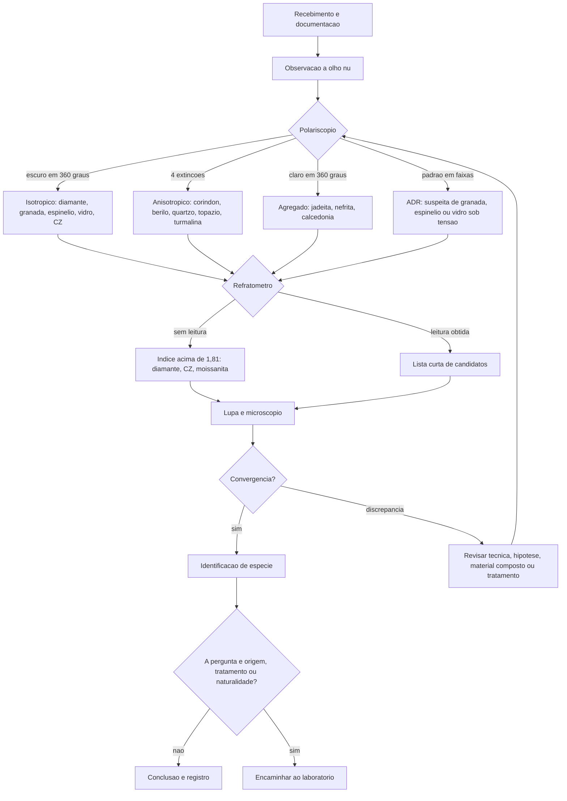

# Aula 07: Fluxo de identificação gemológica

**ID:** gemologia-m01-a07
**Módulo:** Gemologia geral e identificação
**Duração estimada:** ~30 min
**Objetivo:** ordenar os testes das aulas anteriores num fluxo que vai do barato ao caro e do geral ao específico, e escrever uma conclusão cujo grau de certeza corresponda à evidência efetivamente obtida.
**Pré-requisito:** aulas 01 a 06 deste módulo.

## Vocabulário desta aula

| Palavra | O que quer dizer |
|---|---|
| **triagem** | sequência inicial de testes rápidos e baratos, feita para eliminar candidatos. |
| **hipótese** | explicação provisória que os testes seguintes tentam derrubar. |
| **convergência** | acordo entre pistas obtidas de forma independente; é o que sustenta uma identificação. |
| **discrepância** | resultado incompatível com a hipótese em teste. |
| **material composto** | peça montada com dois ou mais materiais colados — duplete, triplete. |
| **encaminhamento** | envio a laboratório ou especialista, quando a pergunta excede o que a bancada alcança. |
| **laudo** | documento que declara escopo, método, conclusão **e** o que não foi determinado. |

## Antes de começar, você precisa saber

- Espécie, variedade e nome comercial foram separados na [[01-gemologia-geral-aula-01-o-que-e-gema-especie-variedade-nome-comercial|Aula 01]], e as quatro perguntas independentes (material, formação, tratamento, conformidade) vieram de lá.
- Cor abre hipóteses e não as fecha ([[01-gemologia-geral-aula-02-origem-da-cor-nas-gemas|Aula 02]]); identificação é convergência de filtros independentes ([[01-gemologia-geral-aula-03-propriedades-diagnosticas-gemologicas|Aula 03]]).
- Os instrumentos e seus limites vieram das [[01-gemologia-geral-aula-04-refratometro-e-polariscopio|Aulas 04]], [[01-gemologia-geral-aula-05-instrumentos-de-observacao-parte-1-dicroscopio-espectroscopio-e-filtro-chelsea|05]] e [[01-gemologia-geral-aula-06-instrumentos-de-observacao-parte-2-lupa-microscopio-e-imersao|06]].
- "Não determinado" é um resultado honesto, não um fracasso.

## Ao final você vai conseguir

- `gemologia-m01-oa06` — Aplicar um fluxo de identificação gemológica.

## Conteúdo

Quem conserta um aparelho não começa abrindo o gabinete. Começa checando se está na tomada, depois o cabo, depois o fusível, e só então parte para o que exige ferramenta e risco. A identificação gemológica segue a mesma economia — e por uma razão adicional: a pedra é do cliente, e cada teste tem um custo de risco além do custo de tempo.

### Primeiro: qual pergunta você está respondendo

Antes do primeiro teste, decida o que está sendo perguntado. São cinco perguntas diferentes, com graus de certeza radicalmente diferentes:

| Pergunta | Natureza da resposta | Onde se responde |
|---|---|---|
| **Que material é?** (identidade) | medida — alta certeza | bancada, na maioria dos casos |
| **Natural ou crescido em laboratório?** | observação de feições de crescimento | bancada em muitos casos; laboratório nos difíceis |
| **Foi tratado? Qual tratamento?** | observação + espectroscopia | bancada para alguns; laboratório para a maioria |
| **De onde veio?** (origem geográfica) | **opinião comparativa**, não medida | laboratório, e com incerteza declarada |
| **Quanto vale?** | estimativa datada de mercado | avaliação, não gemologia |

Misturar essas cinco perguntas é a origem da maior parte dos conflitos entre cliente, joalheiro e gemólogo. A aula 23 volta a essa tabela no contexto de laudos.

### O fluxo, em oito passos

O princípio de ordenação é simples: **primeiro o que não toca na pedra, é barato e elimina muitos candidatos; por último o que é caro, lento ou tem restrição.**

1. **Receba e documente.** Fotografe. Registre peso, dimensões, forma, montagem, danos preexistentes e as **declarações do cliente**, marcadas como declarações. Separar "o que foi dito" de "o que foi observado" desde a primeira linha evita metade dos problemas.
2. **Observe sem instrumento.** Cor, transparência, brilho, estilo de lapidação, desgaste, sinais de montagem. Isso já gera as hipóteses iniciais e, às vezes, resolve o caso (um brilho vítreo com arestas gastas numa joia antiga já diz muita coisa).
3. **Polariscópio.** É o teste mais barato, mais rápido e mais discriminante do começo do fluxo: separa isotrópico, anisotrópico e agregado, e elimina metade da lista de candidatos em segundos.
4. **Refratômetro.** Índice e birrefringência estreitam drasticamente o que sobrou. "Sem leitura" também é informação: indica índice acima de ≈1,81.
5. **Lupa e microscópio.** Registre inclusões, zonas de crescimento, feições de superfície e de cinturão. Este é o passo que mais frequentemente responde à segunda e à terceira perguntas da tabela acima.
6. **Densidade relativa**, quando a pedra é solta e não porosa. Excelente para excluir; a aula 08 detalha.
7. **Testes complementares conforme a hipótese.** Dicroscópio para confirmar anisotropia e sugerir candidatos, espectroscópio para o cromóforo, lâmpada UV para triagem (aula 09), testador de condutividade quando a hipótese é diamante (aula 10).
8. **Compare, declare escopo e encaminhe se preciso.** Uma hipótese só sobrevive se **todos** os resultados relevantes forem consistentes com ela.

*O fluxo é um funil: cada teste reduz o conjunto de candidatos, e a discrepância devolve o caso ao início em vez de ser ignorada.*

### Discrepância: a informação mais valiosa do caso

Quando um resultado não bate com a hipótese, existem exatamente quatro explicações, e nenhuma delas se resolve ignorando o dado:

1. **Erro de técnica.** Contato ruim no refratômetro, bolha presa na pesagem, pedra suja, iluminação inadequada. Repita antes de qualquer outra coisa.
2. **Material composto.** Dupletes e tripletes dão leituras da camada superior e densidade do conjunto — valores que não pertencem a espécie nenhuma. A linha de colagem aparece à lupa vista de lado, ou por imersão.
3. **Tratamento não previsto.** Preenchimento, impregnação, difusão e revestimento deslocam propriedades de superfície e podem alterar o espectro.
4. **Hipótese errada.** A explicação mais simples, e a que o viés de confirmação faz demorar mais a considerar.

Esconder uma anotação incômoda é o erro mais caro do ofício, porque ele produz laudo errado com aparência de laudo bom.

### O que a montagem tira de você

Uma gema montada bloqueia parte do fluxo, e reconhecer isso na hora do orçamento evita frustração:

| Teste | Gema montada |
|---|---|
| Polariscópio | frequentemente possível |
| Refratômetro | só se houver faceta plana exposta e acessível |
| Densidade relativa | **impossível** — o metal entra na conta |
| Líquidos pesados | **contraindicado** — atacam colas e engastes |
| Lupa e microscópio | possível, com campo de visão reduzido pelo engaste |
| UV | possível, com a ressalva de que o metal também pode reagir |

A aula 19 volta ao assunto pelo lado do metal.

### O vocabulário graduado da conclusão

A conclusão precisa ter o grau de certeza que a evidência sustenta. Cinco níveis, do mais forte ao mais fraco:

- **"Identificado como X."** Convergência de três ou mais propriedades independentes, sem discrepância.
- **"Compatível com X."** Os resultados obtidos não contradizem X, mas faltam testes que separariam X de um concorrente.
- **"Indícios de Y."** Uma feição sugestiva foi observada e não é conclusiva sozinha — típico de tratamento.
- **"Não determinado."** O teste necessário não foi feito, não foi possível, ou deu resultado ambíguo.
- **"Requer laboratório."** A pergunta excede o que a bancada alcança.

Um laudo confiável informa **o que foi testado, com que método, o que foi concluído e o que não foi determinado**. A última parte é a que separa um documento profissional de uma opinião.

## Exemplo trabalhado

Chega um anel com uma pedra vermelha engastada em garras, apresentado pelo cliente como **"rubi natural birmanês, sem tratamento"**.

1. **Documente a declaração como declaração.** *"Cliente declara: rubi natural, origem Mianmar, não tratado."* Nenhuma dessas três palavras é observação sua ainda. Fotografe a peça, registre o tipo de engaste e o desgaste do metal.
2. **Olho nu.** Vermelho médio, transparente, brilho vítreo forte, arestas de faceta vivas. Nada elimina nada ainda.
3. **Polariscópio.** Alterna claro e escuro quatro vezes na volta: **anisotrópica**. Granada, espinélio e vidro saem da lista — e os três são exatamente os materiais que mais frequentemente se apresentam como rubi.
4. **Refratômetro.** A mesa está exposta e acessível. Duas sombras: 1,762 e 1,770, birrefringência 0,008, padrão uniaxial negativo. **Compatível com coríndon.**
5. **Densidade relativa.** Impossível: a pedra está montada. Registre a impossibilidade, não a omita.
6. **Microscópio, campo escuro.** Zonas de crescimento **retilíneas e angulosas**, agulhas finas cruzando-se em ângulos definidos, e algumas fissuras. Nada de estrias curvas, nada de bolhas esféricas.
7. **Microscópio, campo claro e oblíqua.** Aparecem, dentro de fissuras que atingem a superfície, pequenas áreas com aspecto vítreo e um lampejo de cor ao girar a peça.
8. **A discrepância.** O passo 7 não contradiz "coríndon", mas contradiz frontalmente "sem tratamento". A anotação vai para o registro exatamente como foi vista.
9. **Conclusão possível.**
   - *Identificado como:* coríndon, cor vermelha — **rubi**.
   - *Origem de crescimento:* feições internas consistentes com material natural.
   - *Tratamento:* **indícios de preenchimento em fissuras que atingem a superfície**; a natureza e a extensão do preenchimento não foram determinadas nesta análise.
   - *Origem geográfica:* **não determinada**. Requer análise química comparativa em laboratório.
   - *Valor:* fora do escopo desta análise.
10. **A conversa com o cliente.** Duas das três afirmações da etiqueta sobreviveram; a terceira não. O papel do gemólogo termina aqui: relatar o que foi visto, com o verbo certo, e explicar que a determinação da extensão do tratamento e da origem exige laboratório.

Repare que o caso não terminou com um veredito único. Terminou com **quatro respostas independentes, cada uma no seu grau de certeza** — que é a forma correta de um resultado gemológico.

## Erros comuns

- **Fazer o fluxo ao contrário.** Começar pela etiqueta e escolher só os testes que a confirmam é viés de confirmação puro, e produz erro sistemático numa direção só.
- **Começar pelo teste caro.** Encaminhar ao laboratório uma pedra que o polariscópio resolveria em cinco segundos é desperdício de dinheiro do cliente.
- **Esconder discrepância.** É a anotação incômoda que costuma ser a mais valiosa do caso.
- **Dar uma resposta única a uma pergunta múltipla.** "É rubi" não responde tratamento nem origem.
- **Prometer o que a bancada não entrega.** Origem geográfica e ausência de tratamento raramente se resolvem fora do laboratório.
- **Não registrar o que foi impossível fazer.** "Densidade não medida — pedra montada" é parte do laudo, não uma lacuna.

## O que não concluir

- Identificar espécie não determina origem geográfica, tratamento ou valor.
- Um laudo de laboratório não é certificado de preço: ele declara uma conclusão dentro de um escopo.
- Origem geográfica é **opinião comparativa** apoiada em bancos de dados de referência, não uma medida — e laboratórios diferentes podem divergir sobre a mesma pedra.
- Ausência de indício de tratamento não é prova de ausência de tratamento; é ausência de evidência dentro do escopo testado.

## Recap relâmpago

- Decida **qual das cinco perguntas** está sendo feita antes do primeiro teste: identidade, origem de crescimento, tratamento, origem geográfica e valor têm certezas diferentes.
- Ordem do fluxo: documentar → olho nu → polariscópio → refratômetro → lupa e microscópio → densidade → testes complementares → conclusão ou encaminhamento.
- O princípio de ordenação é: não destrutivo, barato e discriminante primeiro.
- Convergência de três ou mais propriedades independentes sustenta a identificação; uma discrepância derruba a hipótese.
- Discrepância tem quatro causas: técnica, material composto, tratamento inesperado ou hipótese errada.
- Montagem inviabiliza densidade relativa e líquidos pesados; registre a impossibilidade.
- Use o verbo certo: identificado como / compatível com / indícios de / não determinado / requer laboratório.

## Próxima aula

[[01-gemologia-geral-aula-08-densidade-relativa-e-liquidos-pesados|Aula 08 — Densidade relativa e líquidos pesados]]: a propriedade que mais eficientemente exclui candidatos, e os dois métodos de medi-la.

## Fontes consultadas

- GIA, [*Analysis of Gemstones at GIA Laboratories* (Gems & Gemology, inverno 2024)](https://www.gia.edu/gems-gemology/winter-2024-gemstone-analysis).
- GIA, [*Gem Identification*](https://www.gia.edu/gem-education/course-gem-ident).
- GIA, [*How GIA Identifies Colored Stones*](https://www.gia.edu/gia-news-research); [*Country of Origin*](https://www.gia.edu/gems-gemology).
- CIBJO, [*Gemmological Laboratories Blue Book* (2024)](https://cibjo.org/wp-content/uploads/2024/11/CIBJO-Gemmological-Laboratories-Blue-Book-2024-02-11.pdf) — escopo e conteúdo mínimo de um laudo.
- LMHC, *Information Sheets* — harmonização de terminologia de laudo entre laboratórios.
- Gem-A, *Gemmology Foundation* — sequência de testes e materiais compostos.

<!--
nivel: iniciante-absoluto-v1
palavras_corpo: ~1650
cobertura:
  gemologia-m01-oa06: [Conteúdo, Exemplo trabalhado]
alegacoes_auditaveis:
  - claim_id: GEM-FLUXO-001
    claim: "O GIA descreve testes padrao como base da identificacao de gemas coradas e emprega testes avancados conforme necessario."
    risk: classificacao
    source: "GIA, Analysis of Gemstones at GIA Laboratories (2024)"
  - claim_id: GEM-FLUXO-002
    claim: "Identidade, origem de crescimento, tratamento, origem geografica e valor sao perguntas distintas com graus de certeza distintos; a origem geografica e uma opiniao comparativa apoiada em bancos de dados de referencia, e nao uma medida, podendo laboratorios divergir sobre a mesma pedra."
    risk: interpretacao
    source: "GIA, Country of Origin; CIBJO Gemmological Laboratories Blue Book (2024); LMHC Information Sheets"
  - claim_id: GEM-FLUXO-003
    claim: "Uma gema montada inviabiliza a medida de densidade relativa por pesagem hidrostatica, porque o metal entra na conta, e contraindica o uso de liquidos pesados, que atacam colas e engastes."
    risk: mecanismo
    source: "Gem-A, Gemmology Foundation; GIA Gem Identification"
  - claim_id: GEM-FLUXO-004
    claim: "Materiais compostos (dupletes e tripletes) produzem leitura de indice da camada superior e densidade do conjunto, valores que nao correspondem a especie alguma; a linha de colagem e detectada a lupa em vista lateral ou por imersao."
    risk: mecanismo
    source: "Gem-A, Gemmology Foundation; Liddicoat, Handbook of Gem Identification"
  - claim_id: GEM-FLUXO-005
    claim: "Um laudo gemologico deve declarar escopo, metodo, conclusao e o que nao foi determinado; laudo de identificacao nao e avaliacao de valor."
    risk: interpretacao
    source: "CIBJO Gemmological Laboratories Blue Book (2024); LMHC"
  - claim_id: GEM-FLUXO-006
    claim: "Fissuras que atingem a superficie com areas de aspecto vitreo e lampejo de cor ao girar (efeito de flash) sao indicio de preenchimento; a natureza e a extensao do preenchimento exigem exame de laboratorio."
    risk: mecanismo
    source: "GIA, Ruby Description and Treatments; Gem-A"
-->
