# Geologia Avançada — Especializações além da graduação

> [!info] Status: **planejado** · destino Obsidian · complementar a [Geologia — do essencial ao avançado](../curso-geologia/_curso.md)

Atalhos: [[00-dashboard|Dashboard]] · [[00-progresso-do-aluno|Progresso do aluno]] · [[_contexto|Contexto da IA]]

## Nível
Partida: curso base concluído até o módulo 25 (fim da área VII). Chegada: especialização de pós-graduação/profissional em geologia.

> [!warning] Um pré-requisito do curso base a respeitar antes do módulo 23
> O **módulo 23** (Introdução à modelagem numérica geodinâmica) pressupõe cálculo numérico — diferenças finitas, esquemas explícito e implícito, erro de truncamento e critério de estabilidade — que se aprende no **módulo 30 do curso base** (Métodos numéricos para geociências, trilha de apoio, disciplina MAP0125 do IGc-USP), criado em 2026-08-28 justamente para isso. A dependência não aparece no grafo abaixo porque o grafo formal de cada curso só aceita módulos do próprio curso; está declarada no `course-state.yaml`, campo `cross_course_prerequisites` do módulo 23. Em produção, gerar o módulo 30 do curso base antes deste. O **módulo 42** tem uma dependência cruzada análoga com o módulo 21 do curso base.

## Base curricular
Grade curricular do curso de Geologia do Instituto de Geociências da USP (`GradeCurricular/Geologia-USP/`), cruzada com a cobertura do curso base para evitar duplicação. Desde a reestruturação de 2026-08-23, cada módulo corresponde a uma disciplina da grade (ou a um recorte coerente dela), e não a um agrupamento temático amplo. Ver [[_contexto|Contexto da IA]] para o método de seleção.

## Ao final você vai conseguir
- Aplicar a geologia à hidrogeologia, à hidrogeoquímica, à geotecnia, à geometalurgia e à engenharia de petróleo em nível de projeto.
- Usar SIG, sensoriamento remoto, geofísica avançada, modelagem 3D, geoestatística e machine learning como ferramentas quantitativas de geociências.
- Interpretar geoquímica isotópica, petrocronologia e petrogênese de rochas ígneas especializadas (granitos, kimberlitos, carbonatitos, alcalinas, pegmatitos, intrusões acamadadas).
- Relacionar sistemas hidrotermais, metalogênese, vulcanismo e microscopia de minério à formação de depósitos.
- Aplicar geologia estrutural quantitativa e análise textural e integrar múltiplas especializações num projeto de geologia aplicada.

## Volume
42 módulos · 283 aulas planejadas (módulo 32 passou de 5 para 26 em 2026-09-23, replanejamento de profundidade antes do build — distritos pegmatíticos de classe mundial; totais por área recalculados a partir do `course-state.yaml`; módulo 26 passou de 6 para 7 em 2026-09-22, divisão da Aula 06; módulo 24 passou de 6 para 7 em 2026-09-21, divisão da Aula 03; módulo 17 passou de 5 para 6 em 2026-09-10, divisão da Aula 04; módulo 19 passou de 6 para 7 em 2026-09-18, divisão da Aula 02; módulo 20 passou de 4 para 5 em 2026-09-18, divisão da Aula 02; módulo 21 passou de 5 para 6 em 2026-09-19, divisão da Aula 03; módulo 22 passou de 5 para 6 em 2026-09-19, divisão da Aula 04; módulo 23 passou de 7 para 9 em 2026-09-19, divisão de Aulas 03 e 04; módulo 27 passou de 6 para 7 em 2026-09-22, divisão da Aula 04; módulo 28 passou de 5 para 6 em 2026-09-23, divisão da Aula 05; módulo 31 passou de 6 para 7 em 2026-09-24, divisão da Aula 03) · ~133–152 h de estudo · 4 áreas temáticas · **252 aulas escritas**, em 37 módulos (soma direta de `lessons.completed`, recontada em 2026-09-30; contagens anteriores desta linha estavam defasadas) concluídos — 100 nos módulos 01–18 + 14 no módulo 40 + 7 no módulo 19 + 5 no módulo 20 + 6 no módulo 21 + 6 no módulo 22 + 9 no módulo 23 + 7 no módulo 24 + 5 no módulo 25 + 7 no módulo 26 + 7 no módulo 27 + 6 no módulo 28 + 6 no módulo 29 + 6 no módulo 30 + 7 no módulo 31 + 26 no módulo 32 + 8 no módulo 33 + 10 no módulo 34 + 6 no módulo 35 + 4 no módulo 36 (último fechamento: módulo 36 em 2026-09-30; módulo 34 passou de 7 para 10 em 2026-09-29, divisão das Aulas 03, 05 e 07)

## Módulos

### IX. Especializações aplicadas
*12 módulos · 66 aulas*

- [[01-hidrogeologia-recursos-hidricos/01-hidrogeologia-recursos-hidricos-modulo|01 — Hidrogeologia e recursos hídricos]] — 7 aulas — **concluído**
- [[02-hidrogeoquimica/02-hidrogeoquimica-modulo|02 — Hidrogeoquímica]] — 5 aulas · requer 01 — **concluído**
- [[03-contaminacao-aguas-subterraneas/03-contaminacao-aguas-subterraneas-modulo|03 — Contaminação dos recursos hídricos subterrâneos]] — 5 aulas · requer 01, 02 — **concluído**
- [[04-exploracao-gestao-aguas-subterraneas/04-exploracao-gestao-aguas-subterraneas-modulo|04 — Exploração, explotação e gestão dos recursos hídricos subterrâneos]] — 4 aulas · requer 01 — **concluído**
- [[05-mecanica-de-rochas/05-mecanica-de-rochas-modulo|05 — Mecânica de rochas]] — 7 aulas · requer 01 — **concluído**
- [[06-elementos-de-geomecanica/06-elementos-de-geomecanica-modulo|06 — Elementos de geomecânica]] — 6 aulas · requer 05 — **concluído**
- [[07-mapeamento-geotecnico/07-mapeamento-geotecnico-modulo|07 — Metodologia de mapeamento geotécnico]] — 4 aulas · requer 06 — **concluído**
- [[08-geotecnia-ambiental/08-geotecnia-ambiental-modulo|08 — Geotecnia ambiental]] — 6 aulas · requer 06, 03 — **concluído**
- [[09-geometalurgia/09-geometalurgia-modulo|09 — Geometalurgia]] — 6 aulas — **concluído**
- [[10-tectonica-de-bacias-sedimentares/10-tectonica-de-bacias-sedimentares-modulo|10 — Tectônica de bacias sedimentares]] — 5 aulas — **concluído**
- [[11-sismoestratigrafia/11-sismoestratigrafia-modulo|11 — Sismoestratigrafia]] — 6 aulas · requer 10 — **concluído**
- [[12-engenharia-de-petroleo/12-engenharia-de-petroleo-modulo|12 — Engenharia de petróleo]] — 5 aulas · requer 11 — **concluído**

### X. Métodos quantitativos e geoinformação
*14 módulos · 87 aulas*

- [[13-geoprocessamento/13-geoprocessamento-modulo|13 — Geoprocessamento]] — 7 aulas — **completo** (7/7 escritas; auditoria ✅; revisão didática ✅; 4 questionários ✅; 78 flashcards ✅)
- [[14-sensoriamento-remoto/14-sensoriamento-remoto-modulo|14 — Sensoriamento remoto]] — 7 aulas · requer 13 — **completo** (7/7 escritas; auditoria ✅; revisão didática ✅; 4 questionários ✅; 96 flashcards ✅)
- [[15-petrofisica/15-petrofisica-modulo|15 — Introdução à petrofísica]] — 4 aulas — **completo** (4/4 escritas; auditoria ✅; revisão didática ✅; questionário ✅ 16Q; flashcards ✅ 95C)
- [[16-aerogeofisica/16-aerogeofisica-modulo|16 — Introdução à aerogeofísica]] — 5 aulas · requer 15 — **concluído** (5/5 escritas; auditoria ✅ 0🔴/0🟠 abertos; revisão didática ✅; questionário ✅ 18Q; 104 flashcards ✅)
- [[17-geofisica-marinha-bacias-sedimentares/17-geofisica-marinha-bacias-sedimentares-modulo|17 — Geofísica marinha e de bacias sedimentares]] — 6 aulas (Aula 04 dividida em 04+05 em 2026-09-10) · requer 15 — **completo** (6/6 escritas, auditadas e revisadas; questionário concluído; 56 flashcards concluídos em 2026-09-10)
- [[18-geofisica-america-do-sul/18-geofisica-america-do-sul-modulo|18 — Geofísica da América do Sul]] — **5 aulas** · requer 15 — ✅ concluído (2026-09-12)
- [[19-geofisica-exploracao-mineral/19-geofisica-exploracao-mineral-modulo|19 — Geofísica aplicada na exploração mineral]] — **7 aulas** · requer 15, 14 — **concluído** (6 escritas em 2026-09-12, 1 criada em 2026-09-18 pela divisão da Aula 02; auditoria ✅ 2026-09-13, 0🔴/0🟠 abertos; revisão didática ✅ 2026-09-13; questionário ✅ 2026-09-18 [47 questões, 3 parciais + 1 final]; flashcards ✅ 2026-09-18 [50 cards])
- [[20-geoestatistica/20-geoestatistica-modulo|20 — Introdução à geoestatística]] — **5 aulas** (Aula 02 dividida em 02+03 em 2026-09-18) · requer 13 — **concluído** (5/5 escritas; auditoria ✅ 2026-09-18, 0🔴/0🟠 abertos; revisão didática ✅ 2026-09-18; questionário ✅ 2026-09-18 [20 questões, único cumulativo]; flashcards ✅ 2026-09-18 [45 cards])
- [[21-modelagem-geoestatistica-depositos-minerais/21-modelagem-geoestatistica-depositos-minerais-modulo|21 — Modelagem geoestatística de depósitos minerais]] — **6 aulas** (Aula 03 dividida em 03+04 em 2026-09-19) · requer 20 — **concluído** (6/6 escritas; auditoria ✅ 2026-09-19 em duas passagens, 0🔴/0🟠 abertos — inclui correção de fator 2 na fórmula do variograma indicador; revisão didática ✅ 2026-09-19; questionário ✅ 2026-09-19 [19 questões, único cumulativo]; flashcards ✅ 2026-09-19 [30 cards])
- [[22-modelagem-geologica-3d/22-modelagem-geologica-3d-modulo|22 — Modelagem geológica 3D]] — **6 aulas** (Aula 04 dividida em 04+05 em 2026-09-19) · requer 21, 19 — **concluído** (6/6 escritas; auditoria ✅ 2026-09-19 com passagem pontual, 0🔴/0🟠 abertos — 29 alegações rastreadas, 15 achados corrigidos; revisão didática ✅ 2026-09-19; questionário ✅ 2026-09-19 [15 questões, único cumulativo]; flashcards ✅ 2026-09-19 [56 cards])
- [[42-exploracao-mineral-avaliacao-de-recursos/42-exploracao-mineral-avaliacao-de-recursos-modulo|42 — Exploração mineral e avaliação de recursos]] — 8 aulas · requer 19, 21 · **estudar antes do 41** — pendente
- [[23-modelagem-numerica-geodinamica/23-modelagem-numerica-geodinamica-modulo|23 — Introdução à modelagem numérica geodinâmica]] — 9 aulas · requer módulo 30 do curso base — **concluído** (9/9 escritas; auditoria ✅ 0🔴/0🟠 abertos; revisão didática ✅; questionário ✅ 41Q; 87 flashcards ✅)
- [[24-machine-learning-geociencias/24-machine-learning-geociencias-modulo|24 — Fundamentos e aplicações de machine learning em geociências]] — 7 aulas · requer 20 — **concluído** (7/7 escritas; auditoria ✅; revisão didática ✅; questionário ✅ 3 parciais+1 final, 42 q; flashcards ✅ 56 cards)
- [[25-aquisicao-digital-ia-geociencias/25-aquisicao-digital-ia-geociencias-modulo|25 — Aquisição de dados digitais e inteligência artificial em geociências]] — 5 aulas · requer 24, 14 — **concluído** (5/5 escritas; auditoria ✅ 0🔴/0🟠 abertos; revisão didática ✅; questionário ✅; flashcards ✅ 45 cards)

### XI. Geoquímica isotópica e petrogênese avançada
*12 módulos · 92 aulas*

- [[26-geologia-isotopica-aplicada/26-geologia-isotopica-aplicada-modulo|26 — Geologia isotópica aplicada]] — 7 aulas — **concluído** (7/7 escritas; auditoria ✅ 1🔵 em aberto não bloqueante; revisão didática ✅ 1🔴 em aberto não bloqueante — paleoclimatologia sem cobertura; questionário ✅ 2 parciais+1 final, 32 q; flashcards ✅ 100 cards)
- [[27-petrocronologia/27-petrocronologia-modulo|27 — Introdução à petrocronologia]] — 7 aulas · requer 26 — **concluído** (7/7 escritas; auditoria ✅ 0🔴/0🟠 abertos; revisão didática ✅, Aula 04 dividida em 04+05; questionário ✅ 2 parciais+1 final, 32 q; flashcards ✅ 88 cards)
- [[28-analise-instrumental-i/28-analise-instrumental-i-modulo|28 — Análise instrumental I]] — 6 aulas — concluído (6/6 escritas; auditoria ✅ 0/0 abertos; revisão didática ✅ (Aula 05 dividida); questionário ✅ (17q, único); baralho ✅ (62 cards); 2026-09-23)
- [[29-granitos-no-ciclo-de-wilson/29-granitos-no-ciclo-de-wilson-modulo|29 — Granitos no ciclo de Wilson]] — 6 aulas · requer 26 — **concluído** (6/6 escritas; auditoria ✅ 0/0 abertos; revisão didática ✅; questionário ✅ (18q, único); flashcards ✅ (31 cards); 2026-09-23)
- [[30-kimberlitos-carbonatitos/30-kimberlitos-carbonatitos-modulo|30 — Petrologia de kimberlitos e carbonatitos e mineralizações associadas]] — 6 aulas · requer 26 — **concluído** (6/6 escritas; auditoria ✅ 4🔴/7🟠/1🟡/2🔵 corrigidos, 0 abertos — inclui correção de duas inversões de sentido: proporção kimberlito≫carbonatito e nome atual do preenchimento do diatrema (KPK, não "tuffisítico"), além da reta grafite-diamante e da textura em atol; revisão didática ✅ 9🟡 corrigidos; questionário ✅ (19q, único); flashcards ✅ (50 cards); 2026-09-23)
- [[31-rochas-igneas-alcalinas/31-rochas-igneas-alcalinas-modulo|31 — Rochas ígneas alcalinas: petrologia e mineralizações]] — 7 aulas · requer 26 — **concluído** (7/7 escritas; auditoria ✅ 27 achados corrigidos, 0 abertos; revisão didática ✅ 0 bloqueantes; questionário ✅ 3 (2 parciais + 1 final), 31 q; flashcards ✅ 53 cards; 2026-09-24)
- [[32-pegmatitos/32-pegmatitos-modulo|32 — Pegmatitos: da gênese à exploração]] — 26 aulas (replanejado em 2026-09-23) · requer 29, 27 — pendente
- [[33-intrusoes-acamadadas/33-intrusoes-acamadadas-modulo|33 — Petrologia de intrusões acamadadas e processos ígneos de mineralização]] — 8 aulas · requer 26 — **concluído** (8/8 escritas; auditoria ✅; revisão didática ✅; questionário ✅ 2 parciais+final, 43 q; flashcards ✅ 81 cards; 2026-09-29)
- [[34-sistemas-hidrotermais-metalogenese/34-sistemas-hidrotermais-metalogenese-modulo|34 — Sistemas hidrotermais e metalogênese]] — 10 aulas · requer 29 — **concluído** (10/10 escritas; auditoria ✅; revisão didática ✅; questionário ✅ 2 parciais+final, 43 q; flashcards ✅ 100 cards; 2026-09-29)
- [[35-vulcanismo-mineralizacoes-associadas/35-vulcanismo-mineralizacoes-associadas-modulo|35 — Vulcanismo e mineralizações associadas]] — 6 aulas · requer 34 — **concluído** (6/6 escritas; auditoria ✅; revisão didática ✅; questionário ✅ único, 20 q; flashcards ✅ 61 cards; 2026-09-29)
- [[36-microscopia-de-minerios/36-microscopia-de-minerios-modulo|36 — Microscopia de minérios]] — 4 aulas — **concluído** (4/4 escritas; auditoria ✅; revisão didática ✅; questionário ✅ único, 17 q; flashcards ✅ 48 cards; 2026-09-30)
- [[37-petrografia-de-minerio/37-petrografia-de-minerio-modulo|37 — Petrografia de minério]] — 6 aulas · requer 36 — pendente

### XII. Síntese estrutural e integração
*4 módulos · 31 aulas*

- [[38-geologia-estrutural-quantitativa/38-geologia-estrutural-quantitativa-modulo|38 — Geologia estrutural quantitativa]] — 5 aulas · requer 06 — pendente
- [[39-analise-textural-de-rochas/39-analise-textural-de-rochas-modulo|39 — Análise textural de rochas: técnicas e aplicações]] — 8 aulas · requer 38 — pendente
- [[40-mineralogia-dos-tectossilicatos/40-mineralogia-dos-tectossilicatos-modulo|40 — Mineralogia dos tectossilicatos: cristaloquímica, óptica e relações de fases]] — 14 aulas · requer 39 — **concluído**
- [[41-estudos-integrados-projetos-em-geologia-aplicada/41-estudos-integrados-projetos-em-geologia-aplicada-modulo|41 — Estudos integrados: projetos em geologia aplicada]] — 4 aulas · requer 12, 25, 37, 39 — pendente

## Grafo de pré-requisitos

```mermaid
graph TD
  subgraph IX["IX. Especializações aplicadas"]
    M01["01 Hidrogeologia"]
    M02["02 Hidrogeoquímica"]
    M03["03 Contaminação de aquíferos"]
    M04["04 Exploração e gestão hídrica"]
    M05["05 Mecânica de rochas"]
    M06["06 Geomecânica"]
    M07["07 Mapeamento geotécnico"]
    M08["08 Geotecnia ambiental"]
    M09["09 Geometalurgia"]
    M10["10 Tectônica de bacias"]
    M11["11 Sismoestratigrafia"]
    M12["12 Engenharia de petróleo"]
  end
  subgraph X["X. Métodos quantitativos e geoinformação"]
    M13["13 Geoprocessamento"]
    M14["14 Sensoriamento remoto"]
    M15["15 Petrofísica"]
    M16["16 Aerogeofísica"]
    M17["17 Geofísica marinha"]
    M18["18 Geofísica da América do Sul"]
    M19["19 Geofísica na exploração mineral"]
    M20["20 Geoestatística"]
    M21["21 Modelagem geoest. de depósitos"]
    M22["22 Modelagem geológica 3D"]
    M23["23 Modelagem numérica geodinâmica"]
    M24["24 Machine learning"]
    M25["25 Aquisição digital e IA"]
    M42["42 Exploração mineral e avaliação de recursos"]
  end
  subgraph XI["XI. Geoquímica isotópica e petrogênese avançada"]
    M26["26 Geologia isotópica"]
    M27["27 Petrocronologia"]
    M28["28 Análise instrumental I"]
    M29["29 Granitos no ciclo de Wilson"]
    M30["30 Kimberlitos e carbonatitos"]
    M31["31 Rochas ígneas alcalinas"]
    M32["32 Pegmatitos"]
    M33["33 Intrusões acamadadas"]
    M34["34 Sistemas hidrotermais"]
    M35["35 Vulcanismo e mineralizações"]
    M36["36 Microscopia de minérios"]
    M37["37 Petrografia de minério"]
  end
  subgraph XII["XII. Síntese estrutural e integração"]
    M38["38 Estrutural quantitativa"]
    M39["39 Análise textural"]
    M40["40 Tectossilicatos"]
    M41["41 Projeto integrado"]
  end
  M01 --> M02
  M01 --> M03
  M02 --> M03
  M01 --> M04
  M01 --> M05
  M05 --> M06
  M06 --> M07
  M06 --> M08
  M03 --> M08
  M10 --> M11
  M11 --> M12
  M13 --> M14
  M15 --> M16
  M15 --> M17
  M15 --> M18
  M15 --> M19
  M14 --> M19
  M13 --> M20
  M20 --> M21
  M21 --> M22
  M19 --> M22
  M20 --> M24
  M24 --> M25
  M14 --> M25
  M26 --> M27
  M26 --> M29
  M26 --> M30
  M26 --> M31
  M29 --> M32
  M27 --> M32
  M26 --> M33
  M29 --> M34
  M34 --> M35
  M36 --> M37
  M06 --> M38
  M38 --> M39
  M39 --> M40
  M19 --> M42
  M21 --> M42
  M12 --> M41
  M25 --> M41
  M37 --> M41
  M39 --> M41
  M42 -.-> M41
```

Módulos sem pré-requisito interno (pontos de entrada do curso): 01, 09, 10, 13, 15, 23, 26, 28, 36.

A seta tracejada `42 -.-> 41` é **ordem de estudo recomendada, não pré-requisito formal**: o capstone pressupõe o vocabulário de recurso, reserva e código de reporte ensinado no módulo 42, mas o validador estrutural exige que todo pré-requisito tenha id numericamente menor que o do módulo, e renumerar o capstone custaria mais do que resolve. Ver a decisão de 2026-08-28 no `course-state.yaml`.

## Próximo passo
O módulo 40 (Mineralogia dos tectossilicatos) está concluído: 14 aulas, auditoria científica aprovada, revisão didática aprovada, 2 questionários parciais + 1 final e 96 flashcards. Ele foi gerado fora da ordem curricular porque nasceu de um material-fonte específico (o caderno do Prof. Vlach, IGc-USP). A auditoria fechou com 0 achados vermelhos, 1 laranja (atribuição autoral do índice de triclinicidade — Goldsmith & Laves, não Goldschmidt) e 3 amarelos, todos corrigidos ou já sinalizados no texto, mais 3 azuis de debate científico legítimo e 3 brancos de rastreabilidade. O recálculo independente ratificou cinco pontos em que as aulas corrigem erratas da própria fonte primária. A revisão didática aprovou o módulo, com um achado amarelo (extensão da aula 14) já mitigado por um ponto de pausa sugerido. As atividades práticas ao microscópio (Parte B do guia) tornaram-se a Parte IV do questionário final, e os exercícios diversos (Parte C) foram distribuídos pelos três questionários.

O módulo 01 (Hidrogeologia e recursos hídricos), primeiro módulo da sequência curricular normal, também está concluído: 7 aulas, auditoria científica aprovada (0 achados vermelhos/laranjas), revisão didática aprovada, 2 questionários parciais + 1 final e 56 flashcards.

O módulo 02 (Hidrogeoquímica) também está concluído: 5 aulas, auditoria científica aprovada (0 achados vermelhos/laranjas), revisão didática aprovada, 1 questionário cumulativo e 50 flashcards.

O módulo 03 (Contaminação dos recursos hídricos subterrâneos) também está concluído: 5 aulas, auditoria científica aprovada (0 achados vermelhos/laranjas/amarelos, 2 achados brancos sem impacto), revisão didática aprovada, 1 questionário cumulativo e 50 flashcards.

O módulo 04 (Exploração, explotação e gestão dos recursos hídricos subterrâneos) também está concluído: 4 aulas, auditoria científica aprovada (0 achados vermelhos/laranjas/amarelos, 1 achado branco sem impacto), revisão didática aprovada, 1 questionário cumulativo e 44 flashcards.

O módulo 05 (Mecânica de rochas) também está concluído: 7 aulas, primeiro módulo do curso fora da linha de hidrogeologia dos módulos 01–04. Auditoria científica aprovada (0 achados vermelhos/laranjas/amarelos, 1 achado azul de debate técnico legítimo sobre o papel de σ2 nos critérios de ruptura, 2 achados brancos sem impacto); o recálculo independente da auditoria identificou e corrigiu, antes da publicação, uma troca entre as expressões de Kirsch de tensão tangencial do teto/piso e das paredes de uma escavação circular. Revisão didática aprovada sem ressalvas. Como o módulo tem 7 aulas (acima do limiar de ~5–6), foram gerados 2 questionários parciais + 1 final cumulativo, e um baralho de 60 flashcards.

O módulo 06 (Elementos de geomecânica) também está concluído: 6 aulas — as duas primeiras já existiam de sessão anterior e as quatro restantes foram escritas em 2026-08-27. A auditoria verificou 34 alegações contra normas (ASTM, ABNT, AASHTO) e fontes primárias, com recálculo independente dos seis exemplos trabalhados, e identificou dois problemas que foram **corrigidos no texto antes de gerar avaliação e flashcards**: um achado laranja (a Aula 06 atribuía a mesma especificação de martelo do SPT à NBR 6484 e à ASTM D1586, que na verdade adotam 65 kg/75 cm e 63,5 kg/76 cm respectivamente) e um amarelo (a Aula 03 atribuía a Jáky a forma simplificada K0 = 1 − sen φ' sem registrar que é aproximação da expressão original). Restaram 1 achado azul (o estatuto físico do intercepto c', debate legítimo) e 2 brancos, sem correção necessária. Revisão didática aprovada sem ressalvas. Este é o **primeiro módulo de 6 aulas do curso**, na fronteira da regra de parciais: elas foram acionadas por haver corte conceitual natural entre as aulas 01–03 e 04–06 e por ser alto o valor de um ponto de verificação antes da Aula 05 — resultando em 2 parciais + 1 final cumulativo (28 questões) e um baralho de 56 flashcards.

O módulo 07 (Metodologia de mapeamento geotécnico) também está concluído: 4 aulas, auditoria científica aprovada (0 achados vermelhos e laranjas, 1 amarelo, 1 azul, 2 brancos), com recálculo do exemplo de talude infinito e verificação cruzada de consistência com os módulos 05 e 06. O achado amarelo não é erro, e sim **volatilidade da legislação brasileira citada** (Leis 6.766/1979, 12.608/2012 e 12.651/2012, sujeitas a alterações posteriores) — ficou registrado como ponto de manutenção periódica, e a Aula 03 traz callout de advertência dedicado. Revisão didática aprovada sem ressalvas. Como o módulo tem 4 aulas (abaixo do limiar de parciais), foi gerado 1 questionário cumulativo de 14 questões, mais um baralho de 44 flashcards.

O módulo 08 (Geotecnia ambiental) também está concluído: 6 aulas (barreiras e propriedades geotécnicas, erosão e movimentos de massa, seleção de áreas de disposição, aterros sanitários, rejeitos de mineração, recuperação e remediação). A auditoria verificou 44 alegações contra normas (ABNT, ASTM) e fontes primárias, com recálculo independente dos seis exemplos trabalhados, e identificou **1 achado vermelho, 5 laranjas e 8 amarelos, todos corrigidos no texto antes de gerar avaliação e flashcards**. O vermelho: o exemplo de estabilidade de talude da Aula 05 calculava o esforço motriz com peso submerso num talude declarado percolado, inflando o fator de segurança em 1,88× — corrigido para FS 1,56 (drenado) e 0,25 (pós-liquefação), o que faz a aula mostrar corretamente uma estrutura que passa no critério de 1,5 e mesmo assim liquefaz, como em Fundão e Feijão. Restaram 1 achado azul e 3 brancos sem correção, e 3 pontos de manutenção periódica (legislação de resíduos e de barragens de rejeito, e a edição vigente das NBR 15115/15116). A revisão didática aprovou o módulo (a Aula 02 ganhou a seção da USLE, que o objetivo prometia e nenhuma seção ensinava). Segundo módulo de 6 aulas com parciais acionadas — corte entre viabilidade/licenciamento (aulas 01–03) e projeto executivo (aulas 04–06): 2 parciais + 1 final cumulativo (28 questões) e um baralho de 54 flashcards.

**Planejamento de 2026-08-28 — módulo 42 criado.** A comparação deste curso e do curso base com a grade obrigatória do IGc-USP mostrou que duas disciplinas obrigatórias não tinham módulo em lugar nenhum: **GAA0405 — Exploração Mineral** (90 h) e **GAA0404 — Avaliação de Recursos Minerais** (60 h). Foi criado o **módulo 42 — Exploração mineral e avaliação de recursos** (área X, 8 aulas, pré-requisitos 19 e 21), que complementa e não duplica os módulos 19, 20, 21, 22, 36, 37 e 41: aqueles ensinam ferramentas isoladas, este ensina o fluxo — geração de alvos, prospecção geoquímica de superfície, campanha de sondagem, amostragem e QA/QC, métodos clássicos de cálculo de recurso e classificação recursos/reservas com fatores modificadores. Recebeu o número 42 para não renumerar nenhum módulo existente; na listagem ele aparece na sua posição de estudo, logo após o 22. **Está só planejado** — nenhuma aula, questionário ou flashcard foi gerado.

**Conferência de 2026-08-29 — nada criado, nada renumerado.** A tarefa de fechamento de lacunas foi reaberta porque o arquivo de retomada na raiz do vault ainda dizia "planejamento não iniciado"; ele havia sido escrito antes da sessão de 2026-08-28 e nunca atualizado. A conferência contra o `course-state.yaml` mostrou que as quatro lacunas de disciplina obrigatória já estavam plenamente planejadas — aqui o módulo 42, e no curso base o M20 expandido para 10 aulas (topografia instrumental, PTR0201), o módulo 29 (Recursos energéticos, GAA0301) e o módulo 30 (Métodos numéricos, MAP0125). **Nenhum módulo, objetivo ou aula foi criado, alterado ou renumerado.** O que mudou:

- o **módulo 23** passou a declarar o pré-requisito cruzado para o módulo 30 do curso base, no campo `cross_course_prerequisites` do estado e num aviso no hub do módulo — antes a dependência só existia escrita do lado do curso base, e quem abrisse o módulo 23 daqui não teria como saber;
- o **módulo 42** teve o pré-requisito cruzado para o módulo 21 do curso base promovido de texto de decisão a campo do estado, pelo mesmo motivo;
- o `_contexto.md` ganhou a decisão de 2026-08-28 sobre o módulo 42, que até então só existia no estado e aqui, e o **status explícito das optativas em limbo** — GAA0342 (Petrografia e Diagênese de Rochas Sedimentares) e GMG0333 (Introdução ao Magnetismo de Rocha) ficaram **adiadas**, nenhuma cortada;
- os links relativos para a pasta antiga do curso base (`curso-geologia-gemologia`), quebrados desde 2026-08-25, foram repontados.

Nenhuma aula, questionário ou flashcard foi gerado, e nada foi publicado no Notion.

O módulo 09 (Geometalurgia) também está concluído (2026-08-30): 6 aulas (o que é geometalurgia, mineralogia de processo, textura e liberação, cominuição e moabilidade, concentração e recuperação, domínios geometalúrgicos). A auditoria verificou 19 alegações em duas passagens, com recálculo independente das energias de Bond, da cadeia econômica e dos teores estequiométricos, e identificou **1 achado vermelho, 6 laranjas e 7 amarelos, todos corrigidos no texto antes de gerar avaliação e flashcards** (3 dos amarelos eram correções anteriores aplicadas pela metade — texto mudado, moldura ao redor esquecida). Restaram 2 achados azuis e 3 brancos sem correção. A revisão didática aprovou o módulo ("bem ensinado"), com 1 achado laranja mitigado (a Aula 03, sobre curvas de liberação, não desenhava curva nenhuma — corrigido com dois gráficos ASCII usando os pontos do próprio exemplo da aula) e 3 amarelos. Como nenhum dos quatro objetivos atravessa o corte entre aulas 01–03 e 04–06, foram gerados 2 questionários parciais + 1 final cumulativo (29 questões) e um baralho de 95 flashcards (59 Basic + 36 Cloze).

O módulo 10 (Tectônica de bacias sedimentares) também está concluído (2026-08-30): 5 aulas (mecanismos de subsidência, bacias extensionais, bacias compressivas, bacias transcorrentes/sal, inversão de bacia e sistema petrolífero). A auditoria verificou 22 alegações em uma única passagem, com recálculo de subsidência térmica pós-rifte e análise de permeabilidade do sal, identificando **6 achados vermelhos, 12 laranjas e 1 azul, todos corrigidos no texto antes de gerar avaliação e flashcards**. Três dos vermelhos foram inversões de sentido críticas (rollover mergulha PARA a falha em arrasto reverso, inversão REDUZ sobrecarga e INTERROMPE maturação, o antepaís não deformado NÃO é uma zona de DeCelles & Giles). A revisão didática aprovou o módulo ("bem ensinado com ressalvas"), com 6 achados didáticos: amplitude da aula 04 justificada, mapeamento de objetivo 03 corrigido no metadado, contagem de palavras medida com precisão (divergência máxima de 32%), legendas padronizadas, amplitude da aula 01 registrada para futuro, exemplos trabalhados encaminhados ao gerador de questionários para inclusão de cálculo. Como nenhum objetivo atravessa um corte conceitual natural (a05 integra as aulas anteriores numa estrutura radial), foi gerado 1 questionário cumulativo único (16 questões cobrindo os quatro objetivos) e um baralho de 110 flashcards (60 Basic + 50 Cloze), com ênfase especial nos quatro distratores de primeira qualidade sinalizados pela auditoria.

O módulo 11 (Sismoestratigrafia) também está concluído (2026-08-31): 6 aulas (definições e resolução, perfilagem sísmica, ciclos de sedimentação, geometria de refletores, tratos de sistemas sísmicos, aplicação em exploração). A auditoria verificou 28 alegações com foco em atribuição de nomenclatura (Widess, Brown & Fisher, Catuneanu, etc.), identificando **3 achados vermelhos (inversões de sentido), 7 laranjas (atribuição errada) e 0 amarelos/azuis/brancos, todos corrigidos no texto antes de gerar avaliação e flashcards**. Revisão didática aprovada ("bem ensinado com ressalvas"), com 5 achados didáticos mitigados. Como o módulo tem 6 aulas e há corte conceitual natural (refletor individual vs. pacote/bacia), foram gerados 2 questionários parciais + 1 final cumulativo (28 questões) e um baralho de 132 flashcards (66 Basic + 66 Cloze), com especial atenção aos distratores de primeira qualidade sinalizados pela auditoria (nomes próprios errados são especialmente perigosos aqui).

O módulo 12 (Engenharia de petróleo) também está concluído (2026-09-02): 5 aulas (perfuração de poços, avaliação de formações via perfis geofísicos, propriedades de rocha-reservatório e fluidos/PVT, mecanismos de produção, recuperação secundária e avançada). A auditoria verificou 25 alegações com foco em cálculos quantitativos, identificando apenas **1 achado laranja (bibliográfico: ano de Craft & Hawkins 2015, não 2013), corrigido no texto antes de gerar avaliação e flashcards**. Os cinco exemplos trabalhados (gradiente de lama 0,546 psi/ft, Archie Sw=25%/Sh=75%, OOIP=19.115.712 STB, IP J=1,0 bbl/dia/psi, ganho EOR 2.293.885 STB) foram recalculados dígito a dígito e todos conferem exatamente, inclusive a cadeia de herança a03→a05. Revisão didática aprovada ("bem ensinado com ressalvas"), com 2 achados mitigados. Como o módulo tem 5 aulas (abaixo do limiar de parciais) e nenhum objetivo é partido ao meio, foi gerado 1 questionário cumulativo único (16 questões cobrindo os quatro objetivos) e um baralho de 239 flashcards (152 Basic + 87 Cloze). **Este fechamento completa a área IX (Especializações aplicadas) por inteiro** — a sequência curricular perfeita: hidrogeologia (01) → hidrogeoquímica (02) → contaminação (03) → gestão de recursos (04) → mecânica de rochas (05) → geomecânica (06) → mapeamento geotécnico (07) → geotecnia ambiental (08) → geometalurgia (09) → tectônica de bacias (10) → sismoestratigrafia (11) → engenharia de petróleo (12).

**Módulo 14 (Sensoriamento remoto) foi fechado em 2026-09-08**: 7/7 aulas escritas, auditadas (11 achados, 0 abertos), revisadas didaticamente (10 achados, 0 bloqueantes), 4 questionários cumulativos (39 questões cobrindo os 4 objetivos e os 3 pares de sinal oposto apontados pela auditoria), e 96 flashcards (58 Basic + 38 Cloze, formato Anki, validação zero-erro). Continuação da área X (Métodos quantitativos e geoinformação) — pré-requisito: módulo 13.

**Módulo 15 (Introdução à petrofísica) foi fechado em 2026-09-08**: 4/4 aulas escritas, auditadas (19 achados: 2 vermelhos + 7 laranjas + 8 amarelos + 2 brancos, todos tratados, `open_findings: []`), revisadas didaticamente ("bem ensinado com ressalvas", 8 achados, 0 bloqueantes), 1 questionário cumulativo (16 questões) e 95 flashcards (45 Basic + 50 Cloze). Padrão dominante da auditoria: "mineral ou método certo no lugar errado" — sete achados atribuíam o fenômeno físico ao agente ou instrumento errado (o mais grave: a ilmenita, paramagnética em qualquer condição geológica, apresentada como fonte relevante de magnetismo de rocha, contradizendo o próprio Módulo 09 já estudado). Menor dispersão de carga entre aulas do curso até aqui (18,2%). Continuação da área X — pré-requisito para módulo 16 (aerogeofísica).

**Módulo 16 (Introdução à aerogeofísica): as 5 aulas foram escritas em 2026-09-09** (planejamento de voo/plataformas/parâmetros de aquisição/QC; aeromagnetometria — IGRF, diurna, RTP, sinal analítico; aerogravimetria e gradiometria — correção de Eötvös, mGal/Eötvös; aerogamaespectrometria — canais K/eU/eTh, correção de stripping, mapa ternário; aerolevantamentos eletromagnéticos de fonte artificial (FDEM/TDEM) e natural (VLF/AFMAG), skin depth e integração multimétodo do módulo). Valores numéricos de aquisição, correções e faixas típicas foram verificados via busca na fonte antes de publicar, mas **ainda não passaram por auditoria científica dedicada** — módulo permanece `in_progress`. **Próximo passo**: auditoria científica do módulo 16 (com atenção à reconciliação com o Módulo 15 — magnetita/titanomagnetita, não ilmenita, como agente do magnetismo; magnetização total = induzida + remanente; razão Th/U pela régua da IAEA), seguida de revisão didática, questionário e flashcards.

**Módulo 17 (Geofísica marinha e de bacias sedimentares): CONCLUÍDO em 2026-09-10** — 6/6 aulas escritas, auditadas, revisadas didaticamente, questionário (20 Q) e flashcards (56 cards) gerados. Temas: bacias sedimentares — mecanismos de subsidência, estilos estruturais extensionais, panorama de Santos/Campos/Espírito Santo/Sergipe-Alagoas; a margem atlântica brasileira — pré-rifte, rifte, sag, breakup e margem divergente, com idades de rifteamento e do sal aptiano tratadas como faixas aproximadas/controvérsia aberta; métodos sísmicos marinhos — velocidade do som na água (~1.500 m/s), air guns, streamers/hidrofones, cobertura CDP, sonar, batimetria; gravimetria e magnetometria marinhas — correção de Bouguer, anomalias magnéticas lineares; fluxo de calor — modelo GDH1, decaimento com idade; recursos — sistema petrolífero, trapas, hidratos. A Aula 04 foi dividida em Aula 04 (campos potenciais) e Aula 05 (fluxo de calor) por sobrecarga cognitiva (DID-M17-A04-CARGA-003); a antiga Aula 05 foi renumerada para Aula 06. Auditoria científica aprovada (1R + 4O + 8A, todos corrigidos; 0 abertos) — padrão dominante: atribuição de fonte (dado certo, referência errada). Reconciliação com M10 e M12 explícita. Questionário único (20 Q, 2 multimétodo), flashcards (56 cards com pontos de discriminação da auditoria: rollover/sentido/colapso, rifte/134-143 Ma, sal/controvérsia, Eötvös/~30x, Bouguer/marinha/+220-+330, GDH1/55-65/66-48, concessões/4, fluxo/réguas, sincronismo). Liberado para publicação Notion. **Pausa explícita solicitada**: não iniciar módulo 18. Os módulos 16 e 18–39, 41 e 42 seguem pendentes de fechamento.
