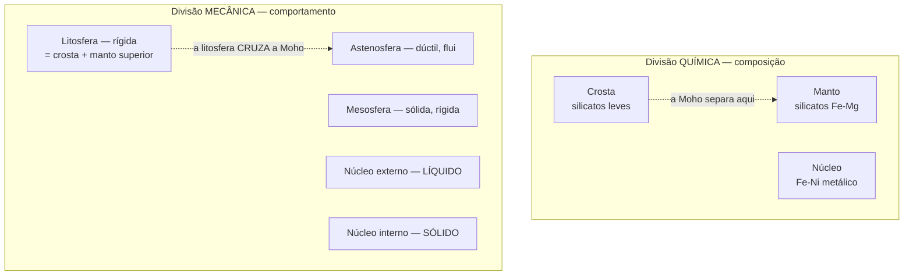

# Aula 03: A Terra no sistema solar — origem e diferenciação em camadas

**ID:** geologia-gemologia-m01-a03
**Módulo:** [[01-fundamentos-e-metodo-modulo|Módulo 01 — Fundamentos e método das geociências]]
**Duração estimada:** ~30 min
**Objetivo:** reconstruir como a Terra se formou e por que ela é estratificada em camadas de composição e de comportamento mecânico distintos.
**Pré-requisito:** Aula 02 (atualismo, inferência à melhor explicação, consiliência de evidências independentes).

## Ao final você vai conseguir

- [OA-01] Descrever a formação da Terra a partir do disco protoplanetário e justificar a idade de ~4,54 Ga com as evidências que a sustentam.
- [OA-02] Explicar o mecanismo da diferenciação planetária e prever suas consequências químicas.
- [OA-03] Distinguir a divisão **química** (crosta, manto, núcleo) da divisão **mecânica** (litosfera, astenosfera, mesosfera, núcleos externo e interno) e dizer por que as duas coexistem.

## Conteúdo

### O problema: datar um planeta cujas rochas iniciais não existem mais

Se você quisesse datar a Terra, o caminho natural seria achar a rocha mais antiga e medi-la. O caminho não funciona, e entender por que ele não funciona é entender como o problema foi resolvido.

A Terra recicla sua superfície. Tectônica de placas destrói crosta oceânica continuamente; erosão e metamorfismo reprocessam a continental. O resultado é que **nenhuma rocha da superfície original sobreviveu**. Os registros mais antigos conhecidos são:

- **Grãos de zircão detrítico de Jack Hills** (Austrália Ocidental), com cerca de **4,4 bilhões de anos** — não uma rocha, mas cristais isolados sobreviventes, reciclados para dentro de um sedimento muito mais novo. São os materiais mais antigos de origem terrestre já identificados.
- **Gnaisse de Acasta** (Cráton Slave, Canadá), com cerca de **4,03 bilhões de anos** — entre as rochas intactas mais antigas conhecidas.

Ambos são mais novos que o planeta. Então, como se chega a **4,54 bilhões de anos**?

Pela via lateral, e é um belo caso de consiliência (Aula 02): datam-se **meteoritos** — em especial as inclusões ricas em cálcio e alumínio (CAIs) dos condritos, os sólidos mais antigos formados no sistema solar, com cerca de **4,567 bilhões de anos**. Como Terra e meteoritos condensaram do mesmo disco, essa é a idade do sistema, e um limite superior para a Terra. Cruzando isso com a sistemática isotópica de chumbo em meteoritos e em reservatórios terrestres, chega-se ao valor consagrado de **~4,54 Ga** para a Terra. Diferentes métodos, com fundamentos físicos independentes, convergem — que é exatamente o critério de robustez discutido na aula anterior.

> [!question] Antes de seguir
> Por que o zircão, e não outro mineral, é o sobrevivente de 4,4 Ga? Guarde a pergunta: a resposta está na sua estrutura cristalina e na sua resistência química, e virá no módulo 03.

### A formação: do disco ao planeta

A sequência aceita, em traços largos:

1. **Colapso da nuvem molecular e disco protoplanetário.** Uma nuvem de gás e poeira colapsa por gravidade; a conservação do momento angular achata o material num disco em rotação, com o Sol nascente no centro.
2. **Condensação e acresção.** O disco esfria e os sólidos condensam — e aqui está o ponto que explica a arquitetura do sistema solar: **perto do Sol só condensam materiais refratários** (silicatos, metais); longe, além da chamada linha de gelo, condensam também voláteis (água, amônia, metano). É por isso que os planetas internos são rochosos e pequenos, e os externos são gigantes gasosos e gelados.
3. **Planetesimais e embriões.** Grãos se agregam em corpos quilométricos (planetesimais), que crescem por colisões em embriões planetários. A fase final é violenta: impactos de corpos do tamanho de planetas.
4. **O impacto formador da Lua.** A hipótese dominante é a colisão da proto-Terra com um corpo do tamanho de Marte, chamado Theia. O material ejetado teria reacretado em órbita, formando a Lua. A evidência mais forte é a semelhança isotópica notável entre Terra e Lua, combinada com o déficit de ferro da Lua — que se explica se o material lunar veio dos mantos, não dos núcleos. Detalhes do modelo seguem em debate ativo; a hipótese geral é bem sustentada.

Essa fase inicial deixou a Terra muito quente, por três fontes de calor: **energia de acresção** (impactos convertendo energia cinética em calor), **decaimento radioativo** (incluindo isótopos de meia-vida curta, como o ²⁶Al, já extintos hoje) e **energia gravitacional liberada na própria diferenciação**.

### A diferenciação: por que a Terra tem camadas

Uma Terra quente o bastante para ter grandes porções fundidas se separa por **densidade**. O ferro metálico, denso e imiscível com os silicatos fundidos, afunda; os silicatos, mais leves, sobem. Esse afundamento é gravitacional: converte energia potencial em calor, o que aquece ainda mais e realimenta o processo.

O resultado é um planeta **quimicamente zonado**: núcleo metálico, manto de silicatos, e — depois, por fusão parcial repetida do manto — uma crosta ainda mais leve.

A consequência química é o conceito mais reaproveitado do curso inteiro. Os elementos se repartem conforme sua afinidade — a classificação **geoquímica de Goldschmidt**:

| Classe | Afinidade | Para onde foi | Exemplos |
|---|---|---|---|
| **Litófilos** | por silicatos | manto e crosta | Si, Al, Ca, Na, K, Mg, terras raras, U, Th |
| **Siderófilos** | por ferro metálico | **núcleo** | Ni, Co, Au, Pt, Ir, Os |
| **Calcófilos** | por enxofre | sulfetos (manto/crosta) | Cu, Pb, Zn, Ag, Hg |
| **Atmófilos** | fase gasosa | atmosfera | H, N, gases nobres |

Isso responde a uma pergunta prática que o curso vai retomar em geologia econômica: **por que ouro e platina são raros na crosta?** Não porque o planeta os tenha em pouca quantidade, mas porque são siderófilos e migraram para o núcleo durante a diferenciação. O que restou na crosta acessível é, em boa parte, material trazido depois por impactos — o chamado "verniz tardio" — e concentrado localmente por processos geológicos. A raridade é **posicional**, não absoluta.

### As duas divisões que não se sobrepõem

Aqui está a distinção que mais confunde iniciantes, e que vale a pena fixar de vez. A Terra é dividida de **duas maneiras diferentes**, por critérios diferentes, e as fronteiras **não coincidem**.

**Divisão química — do que é feito:**

- **Crosta** — camada mais externa, de silicatos leves. Dois tipos: a **oceânica**, basáltica, mais densa e fina (cerca de 5–10 km); a **continental**, de composição média mais félsica (frequentemente descrita como granodiorítica), menos densa e muito mais espessa (tipicamente 30–50 km, chegando a mais sob cadeias de montanhas).
- **Manto** — silicatos ricos em ferro e magnésio (peridotito no manto superior). É a maior fração do volume do planeta.
- **Núcleo** — liga metálica de ferro e níquel, com elementos leves em menor proporção.

O limite crosta–manto é a **descontinuidade de Mohorovičić** (Moho), definida sismicamente: um salto na velocidade das ondas P que marca a mudança composicional.

**Divisão mecânica — como se comporta:**

- **Litosfera** — rígida, quebradiça. Comporta-se como placa. **Inclui a crosta inteira mais a parte mais superficial do manto.** É essa a chave: a litosfera é definida por reologia, não por composição, e por isso atravessa a Moho.
- **Astenosfera** — manto que, apesar de sólido, é dúctil na escala de tempo geológica, e flui. É sobre ela que as placas se movem.
- **Mesosfera** (manto inferior) — sólida e mais rígida que a astenosfera, por causa da pressão.
- **Núcleo externo** — **líquido**. É o movimento convectivo desse metal fundido, condutor, que gera o campo magnético terrestre pelo geodínamo.
- **Núcleo interno** — **sólido**, apesar de ser mais quente que o externo, porque a pressão é alta o bastante para solidificar o ferro.

*Figura: as duas divisões correm em paralelo e não coincidem. Observe onde a litosfera termina — dentro do manto, não na Moho.*

Por que duas divisões? Porque respondem a perguntas diferentes. Se a pergunta é "que minerais e elementos há aqui", o critério é composicional. Se a pergunta é "isto quebra ou flui", o critério é reológico — e reologia depende de temperatura e pressão, não só de composição. Uma mesma rocha peridotítica é litosfera se estiver fria e astenosfera se estiver quente.

**A consequência prática é enorme:** a tectônica de placas só faz sentido na divisão mecânica. As placas não são "crosta" — são **litosfera**, crosta mais manto superior rígido, deslizando sobre a astenosfera. Falar em "placa crustal" é erro conceitual, e é o erro mais comum sobre este tema.

Esse quadro será desenvolvido no módulo 02 (estrutura interna e tectônica) e no módulo 20 (como a sismologia o revela).

## Exemplo trabalhado

**Pergunta.** Um meteorito ferroso, essencialmente ferro e níquel metálicos com Widmanstätten bem desenvolvida, chega ao laboratório. Que história ele conta, e por que ele é relevante para entender a Terra?

*Passo 1 — do que é feito.* Ferro e níquel metálicos com textura de exsolução em grande escala. Pela tabela de Goldschmidt, é material **siderófilo**: exatamente a fração que, num corpo diferenciado, migra para o núcleo.

*Passo 2 — a inferência.* Metal em massa não condensa em corpo homogêneo; ele se **segrega**. Logo, o meteorito veio de um corpo-pai que **se diferenciou** — teve calor suficiente para fundir e separar metal de silicato. Isso é uma inferência à melhor explicação, com poucas alternativas viáveis.

*Passo 3 — a escala do corpo-pai.* A textura de Widmanstätten são lamelas de exsolução que só crescem com resfriamento extremamente lento, da ordem de poucos graus por milhão de anos. Isso exige um isolante térmico espesso ao redor: o corpo-pai era um asteroide de porte, não um fragmento pequeno. E o fato de o material estar aqui, exposto, implica que ele foi **catastroficamente destruído** por colisão.

*Passo 4 — a conexão com a Terra.* Você está segurando o **núcleo de um planetesimal**. É a amostra física mais próxima que existe do material do núcleo terrestre — inacessível a 2.900 km de profundidade. Meteoritos ferrosos e condritos são as principais restrições composicionais sobre o interior profundo da Terra.

*Passo 5 — o fecho lógico.* Repare no que foi feito: um objeto do tamanho da mão, sem contexto de campo, sustentou afirmações sobre a estrutura de um planeta. É o método da Aula 02 operando — regra de leitura vinda do laboratório, aplicada a um registro preservado, com hipóteses concorrentes eliminadas.

## Erros comuns

- **Achar que as placas tectônicas são a crosta.** O erro é sedutor porque a crosta é a parte que vemos e a palavra é mais familiar. Mas a placa é **litosfera** — crosta *mais* manto litosférico. A prova de que a distinção importa: crosta oceânica tem uns 7 km, enquanto a litosfera oceânica engrossa até ~100 km ao envelhecer. A massa da placa está majoritariamente no manto, e é ela que dá o peso do *slab pull*.
- **Imaginar a astenosfera como uma camada de magma.** Sedutor porque "flui" sugere líquido, e porque desenhos escolares a pintam de laranja. A astenosfera é **sólida**; ela flui em estado sólido, por fluência (creep) na escala de milhões de anos, como uma geleira flui sendo gelo sólido. A fração de fundido presente é pequena, tipicamente de ordem percentual.
- **Supor que o núcleo interno é sólido por ser mais frio.** Ele é o ponto **mais quente** do planeta. É sólido porque a pressão eleva o ponto de fusão do ferro acima da temperatura local. Pressão e temperatura competem, e ali a pressão ganha.
- **Datar a Terra pela rocha mais antiga.** O raciocínio parece impecável, e falha porque o registro foi reciclado. A idade veio de meteoritos, não de rochas terrestres.
- **Ler a diferenciação como um evento pontual e encerrado.** A separação núcleo–manto foi rápida em termos geológicos, mas a diferenciação continua: fusão parcial do manto ainda produz crosta nova hoje, em cada dorsal.

## O que não concluir

- Que a Terra tem camadas com fronteiras nítidas e uniformes. Zonas de transição são reais e importantes — a zona de transição do manto entre ~410 e ~660 km, a camada D″ na base do manto, variações laterais grandes na espessura litosférica. O modelo de camadas concêntricas é uma primeira aproximação, útil e incompleta.
- Que a idade de 4,54 Ga é uma medida direta da Terra. É um valor de consenso apoiado em meteoritos e em sistemática isotópica cruzada, não a leitura de um cronômetro terrestre. Os números têm incerteza associada e podem ser refinados.
- Que o ouro ser siderófilo significa que não há ouro econômico na crosta. Significa que a maior parte foi para o núcleo; o que ficou é concentrado por processos hidrotermais e magmáticos em depósitos localizados. Escassez global e concentração local são coisas distintas.
- Que a hipótese do impacto gigante para a Lua está fechada. A ideia geral é bem sustentada, mas parâmetros do impactor, mecanismo de mistura e a semelhança isotópica exata continuam em discussão ativa.
- Que crosta continental "granítica" significa feita de granito. É uma média composicional aproximada, frequentemente descrita como granodiorítica. A crosta continental real é um mosaico heterogêneo de rochas ígneas, metamórficas e sedimentares.

## Recap relâmpago

- Nenhuma rocha da Terra primitiva sobreviveu; a idade de **~4,54 Ga** vem de **meteoritos** — CAIs com ~4,567 Ga — e de sistemática isotópica cruzada.
- Registros terrestres mais antigos: **zircões de Jack Hills** (~4,4 Ga, grãos) e **gnaisse de Acasta** (~4,03 Ga, rocha).
- A Terra se formou por condensação e acresção no disco protoplanetário; a **linha de gelo** explica planetas rochosos internos e gigantes externos.
- Calor inicial: acresção + decaimento radioativo + energia da diferenciação. A Lua provavelmente veio de um impacto gigante.
- **Diferenciação** por densidade: metal afunda, silicato sobe. Goldschmidt: litófilo, **siderófilo**, calcófilo, atmófilo. Ouro é siderófilo — daí sua raridade crustal.
- **Divisão química**: crosta / manto / núcleo, separadas pela **Moho** e pelo limite manto–núcleo.
- **Divisão mecânica**: litosfera / astenosfera / mesosfera / núcleo externo (líquido) / núcleo interno (sólido).
- **A litosfera cruza a Moho**: placa = crosta + manto superior rígido. Placas não são crosta.
- Núcleo externo líquido em convecção = **geodínamo** = campo magnético.

## Próxima aula

[[01-fundamentos-e-metodo-aula-04-sistemas-terrestres-e-tempo-profundo|Aula 04 — Os grandes sistemas terrestres e o tempo profundo]], que junta as camadas desta aula num sistema com fluxos de energia e matéria, e introduz a escala temporal em que ele opera.

## Fontes

- Idade da Terra, CAIs e materiais terrestres mais antigos — [Age of Earth (Wikipedia)](https://en.wikipedia.org/wiki/Age_of_Earth), [Jack Hills (Wikipedia)](https://en.wikipedia.org/wiki/Jack_Hills), [Earth's Oldest Rocks — Historical Geology (OpenGeology)](https://opengeology.org/historicalgeology/case-studies/earths-oldest-rocks/)
- Confirmação da idade do zircão de Jack Hills (Valley et al., 2014) — [Live Science](https://www.livescience.com/43584-earth-oldest-rock-jack-hills-zircon.html)

<!--
mapa_objetivo_secao:
  OA-01: "O problema: datar um planeta cujas rochas iniciais não existem mais" + "A formação: do disco ao planeta"
  OA-02: "A diferenciação: por que a Terra tem camadas" + "Exemplo trabalhado"
  OA-03: "As duas divisões que não se sobrepõem"

alegacoes_auditaveis:
  - claim_id: GEO-M01-A03-IDADE-TERRA-001
    claim: "A idade da Terra é de aproximadamente 4,54 bilhões de anos."
    risk: numero
    source: "Wikipedia/Age of Earth; NCSE — valor de consenso"
    confianca: alta
  - claim_id: GEO-M01-A03-CAI-002
    claim: "As CAIs são os sólidos mais antigos formados no sistema solar, com ~4,567 Ga (4,5673 ± 0,00016 Ga)."
    risk: numero
    source: "Wikipedia/Age of Earth (compilação de Amelin/Bouvier)"
    confianca: alta
  - claim_id: GEO-M01-A03-JACKHILLS-003
    claim: "Zircões de Jack Hills, Austrália Ocidental, têm ~4,4 Ga (4,404 Ga) e são os materiais terrestres mais antigos conhecidos."
    risk: numero
    source: "Wikipedia/Jack Hills; Valley et al., 2014"
    confianca: alta
  - claim_id: GEO-M01-A03-ACASTA-004
    claim: "O gnaisse de Acasta, Cráton Slave, tem 4,031 ± 0,003 Ga (Bowring & Williams, 1999)."
    risk: numero
    source: "OpenGeology / Bowring & Williams 1999"
    confianca: alta
    nota: "existem candidatas concorrentes a 'rocha mais antiga' (ex.: cinturão Nuvvuagittuq); texto usa 'entre as mais antigas'"
  - claim_id: GEO-M01-A03-ESPESSURA-CROSTA-005
    claim: "Crosta oceânica ~5–10 km; crosta continental ~30–50 km, maior sob cadeias de montanhas."
    risk: numero
    source: "valores de referência padrão; detalhar no módulo 02"
    confianca: media
  - claim_id: GEO-M01-A03-LIMITE-NUCLEO-006
    claim: "O limite manto–núcleo está a cerca de 2.900 km de profundidade."
    risk: numero
    source: "valor padrão (Gutenberg); confirmar no módulo 20"
    confianca: media
  - claim_id: GEO-M01-A03-GOLDSCHMIDT-007
    claim: "Classificação de Goldschmidt: litófilos, siderófilos, calcófilos, atmófilos, com as atribuições elementares listadas."
    risk: classificacao
    source: "geoquímica clássica; detalhar no módulo 10"
    confianca: alta
  - claim_id: GEO-M01-A03-NUCLEO-INTERNO-008
    claim: "O núcleo interno é sólido porque a pressão eleva o ponto de fusão do ferro acima da temperatura local."
    risk: mecanismo
    source: "consolidado"
    confianca: alta
  - claim_id: GEO-M01-A03-LITOSFERA-OCEANICA-009
    claim: "A litosfera oceânica engrossa com a idade, chegando a cerca de 100 km."
    risk: numero
    source: "modelo de resfriamento de placa; detalhar no módulo 02"
    confianca: media
  - claim_id: GEO-M01-A03-THEIA-010
    claim: "A Lua teria se formado por impacto da proto-Terra com um corpo do tamanho de Marte (Theia); modelo dominante, com parâmetros em debate."
    risk: controverso
    source: "apresentado como hipótese dominante, não como fato fechado"
    confianca: media
  - claim_id: GEO-M01-A03-AL26-011
    claim: "O ²⁶Al foi uma fonte de calor relevante na Terra primitiva e é um radionuclídeo extinto hoje."
    risk: classificacao
    source: "cosmoquímica; detalhar no módulo 03"
    confianca: alta
-->
