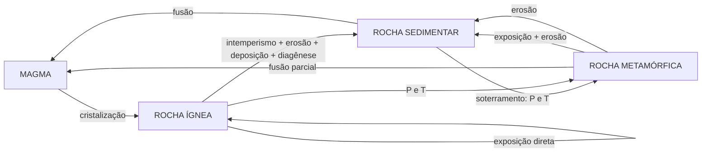

# Aula 04: Os grandes sistemas terrestres e o tempo profundo

**ID:** geologia-gemologia-m01-a04
**Módulo:** [[01-fundamentos-e-metodo-modulo|Módulo 01 — Fundamentos e método das geociências]]
**Duração estimada:** ~30 min
**Objetivo:** integrar as camadas da aula anterior num sistema com fluxos de energia e matéria, e instalar a escala de tempo em que esse sistema opera.
**Pré-requisito:** Aula 03 (camadas da Terra, diferenciação); Aula 02 (atualismo, princípios estratigráficos).

## Ao final você vai conseguir

- [OA-01] Identificar as quatro esferas terrestres e descrever uma interação concreta entre duas delas.
- [OA-02] Explicar as duas fontes de energia que movem os sistemas terrestres e atribuir cada grupo de processos à sua fonte.
- [OA-03] Descrever o ciclo das rochas como grafo de transformações, e não como um círculo de mão única.
- [OA-04] Estimar ordens de grandeza no tempo geológico e distinguir tempo relativo de tempo absoluto.

## Conteúdo

### A Terra como sistema

A aula anterior mostrou a Terra em corte: camadas empilhadas. Essa imagem é estática e, sozinha, enganosa. A Terra é um **sistema** — um conjunto de partes que trocam energia e matéria continuamente. O que a geologia estuda são, em última instância, essas trocas.

Convenciona-se dividi-la em quatro esferas, que se interpenetram:

- **Geosfera** — a Terra sólida: crosta, manto, núcleo.
- **Hidrosfera** — toda a água: oceanos, água continental, subterrânea, e a criosfera (gelo), frequentemente destacada à parte.
- **Atmosfera** — o envelope gasoso.
- **Biosfera** — o conjunto dos seres vivos.

A divisão é útil, mas a lição real está nas **interfaces**. Praticamente todo processo geológico interessante acontece onde duas ou mais esferas se encontram:

| Interação | Exemplo | Resultado geológico |
|---|---|---|
| Atmosfera × Geosfera | CO₂ e água atacando silicatos | Intemperismo químico; consumo de CO₂ atmosférico |
| Hidrosfera × Geosfera | Rio erodindo e transportando | Sedimentos, relevo, bacias |
| Biosfera × Atmosfera | Fotossíntese | Oxigenação da atmosfera |
| Biosfera × Geosfera | Organismos precipitando carbonato | Calcários, recifes, giz |
| Geosfera × Atmosfera | Desgaseificação vulcânica | Fornecimento de CO₂, SO₂, H₂O |

O intemperismo de silicatos merece destaque, porque é o exemplo mais completo de acoplamento entre esferas. A reação consome CO₂ atmosférico, libera cátions que rios levam ao mar, onde organismos os usam para fazer carbonato, que se deposita e é subductado, e devolvido à atmosfera por vulcanismo. É o **ciclo geológico do carbono** — e o principal termostato de longo prazo do clima terrestre, operando na escala de centenas de milhares a milhões de anos.

Consequência conceitual importante: **a vida não é passageira na geologia; ela é agente geológico**. A atmosfera oxigenada é produto biológico. Depósitos de ferro bandado, calcários, carvão, petróleo e boa parte dos solos existem porque há vida. Essa é a base do módulo 17 (geobiologia).

> [!question] Antes de seguir
> Se o intemperismo consome CO₂ e o vulcanismo o repõe, o que aconteceria com o clima da Terra num período de soerguimento de uma grande cadeia de montanhas? Pense na área de rocha fresca exposta.

### As duas fontes de energia

Todo processo geológico é movido por uma de duas fontes — ou pela interação das duas. Essa é a divisão organizadora mais econômica que existe em geologia.

**Energia interna** — calor do interior da Terra, com duas origens: o **calor residual** da acresção e da diferenciação, e o **decaimento radioativo** de isótopos de meia-vida longa no manto e na crosta (urânio, tório, potássio-40). Esse calor sai por condução e por convecção, e move:

- tectônica de placas e deriva continental;
- magmatismo e vulcanismo;
- metamorfismo;
- terremotos;
- soerguimento e construção de relevo.

Os processos internos são, em síntese, **construtivos**: criam desnível, geram rocha nova, fazem montanha.

**Energia externa** — radiação solar (mais uma contribuição menor da gravidade lunar e solar, via marés). Ela move:

- circulação atmosférica e oceânica, e portanto o clima;
- o ciclo da água;
- intemperismo, erosão, transporte e sedimentação;
- glaciações;
- a biosfera inteira, via fotossíntese.

Os processos externos são, em síntese, **destrutivos**: destroem desnível, aplainam, transportam material de onde está alto para onde está baixo.

A tensão entre os dois é o motor do relevo. Uma cadeia de montanhas é o saldo instantâneo de uma disputa: soerguimento (interno) contra erosão (externo). O Himalaia existe porque o soerguimento ainda vence; um cráton antigo aplainado é um lugar onde a erosão venceu há muito tempo.

E a **gravidade** atravessa as duas fontes: é ela que faz o material denso afundar, o rio correr, a encosta desmoronar e as placas serem puxadas na subducção.

### O ciclo das rochas

O ciclo das rochas é a expressão sintética dessas trocas na geosfera. Três grandes classes de rocha, definidas pelo processo que as forma:

- **Ígneas** — cristalizadas a partir de material fundido (magma em profundidade, lava em superfície).
- **Sedimentares** — formadas por acumulação e litificação de sedimentos, ou por precipitação química ou bioquímica.
- **Metamórficas** — rochas preexistentes transformadas no estado sólido por pressão, temperatura e fluidos, sem passar por fusão completa.

E os processos que ligam uma à outra: fusão e cristalização; intemperismo, erosão, transporte, deposição e diagênese; soterramento, aquecimento e deformação.

*Figura: o ciclo das rochas como grafo. Observe as setas que atravessam o meio — o percurso não é obrigatoriamente circular.*

O erro clássico é decorar o ciclo como um círculo em que se percorre ígnea → sedimentar → metamórfica → ígnea, sempre nessa ordem. **Não é isso.** É um grafo com atalhos: um granito pode ser metamorfizado sem nunca virar sedimento; um arenito pode fundir direto; um gnaisse pode ser erodido e virar arenito sem jamais fundir. A ordem canônica é uma narrativa didática, não uma regra do mundo.

E há uma assimetria de taxa importante: um mesmo átomo pode passar por muitos ciclos, ou por nenhum. Rochas de cráton estável podem ficar bilhões de anos sem serem recicladas, enquanto a crosta oceânica raramente sobrevive além de ~200 milhões de anos, porque é subductada — razão pela qual **o assoalho oceânico é sistematicamente muito mais jovem que os continentes**.

### O tempo profundo

Nada em geologia funciona sem interiorizar a escala de tempo. E "4,54 bilhões de anos" é um número que a intuição humana não processa — é preciso convertê-lo em algo comparável.

**Analogia do ano-calendário.** Comprima os 4,54 bilhões de anos num único ano, começando à meia-noite de 1º de janeiro:

| Evento | Data na analogia |
|---|---|
| Formação da Terra | 1 de janeiro, 00:00 |
| Primeiras evidências de vida | fim de fevereiro / março |
| Oxigenação significativa da atmosfera | fim de março |
| Vida animal complexa (Cambriano) | meados de novembro |
| Plantas colonizam a terra firme | fim de novembro |
| Dinossauros dominam | meados de dezembro |
| Extinção K–Pg | 26 de dezembro |
| Hominíneos | 31 de dezembro, por volta das 22h |
| *Homo sapiens* | 31 de dezembro, últimos ~20 minutos |
| Toda a história escrita | 31 de dezembro, últimos ~30 segundos |

*(Os valores são arredondados para efeito de escala; as idades precisas vêm no módulo 03.)*

Duas conclusões que essa tabela força:

1. **Quase toda a história da Terra é pré-animal.** Mais de 80% do tempo geológico decorreu antes do Cambriano. Um curso de geologia que gasta a maior parte do tempo no Fanerozoico está estudando a minoria do registro — e faz isso porque é a parte mais bem preservada e mais fácil de datar, não porque seja a mais representativa.
2. **Processos imperceptíveis são poderosos.** Uma placa que se move 5 cm/ano — velocidade da unha crescendo — percorre 5.000 km em 100 milhões de anos. Um rio que rebaixa 0,1 mm/ano remove 1 km em 10 milhões de anos. **A escala converte o lento em decisivo.** É esse o insight que Hutton teve ao olhar a discordância de Siccar Point e falar em "nenhum vestígio de um começo".

**Tempo relativo e tempo absoluto.** Duas maneiras complementares de falar de tempo geológico:

- **Tempo relativo** — a ordem dos eventos, obtida pelos princípios da Aula 02. Diz "A antes de B", não diz quantos anos.
- **Tempo absoluto (numérico)** — idades em anos, obtidas por **geocronologia**, sobretudo por datação radiométrica, que usa o decaimento de isótopos instáveis a taxa conhecida.

A escala geológica moderna combina os dois. A **Comissão Internacional de Estratigrafia (ICS)** publica a Carta Cronoestratigráfica Internacional, que é a referência oficial: éons, eras, períodos, épocas e idades, com os limites definidos por seções de referência (GSSP) e com idades numéricas associadas.

Dois pontos que valem desde já, e que o módulo 03 desenvolve:

- **A carta é versionada.** As idades numéricas são revisadas conforme novas datações. A versão de junho de 2026, por exemplo, ajustou a base do Anisiano para 247,0 Ma e a base do Wuchiapingiano para 259,857 ± 0,084 Ma. Ao citar uma idade, **cite a versão da carta** — número sem versão envelhece mal.
- **Unidade cronoestratigráfica ≠ unidade geocronológica.** *Sistema, série, andar* referem-se ao corpo de rocha; *período, época, idade* referem-se ao intervalo de tempo. Diz-se "rochas do Sistema Jurássico" e "eventos do Período Jurássico". A distinção parece pedante e evita confusões reais em estratigrafia.

## Exemplo trabalhado

**Pergunta.** Um grão de quartzo está numa praia hoje. Reconstrua uma trajetória plausível dele pelos sistemas terrestres, e estime as ordens de grandeza de tempo envolvidas.

*Etapa 1 — origem ígnea.* O grão cristalizou num granito, a ~10 km de profundidade, a partir de magma. Energia: **interna**. O resfriamento e a cristalização de um plúton desse porte levam da ordem de 10⁵–10⁶ anos — cristais grandes exigem tempo, como visto na Aula 01.

*Etapa 2 — exumação.* Para chegar à superfície, foram removidos ~10 km de rocha acima. A uma taxa de denudação de 0,1 mm/ano, isso são 10⁸ anos — cem milhões. Energia: **interna** (soerguimento) e **externa** (erosão) em disputa. Já aqui, a escala de tempo passou de qualquer intuição cotidiana.

*Etapa 3 — intemperismo e liberação.* Na superfície, água e CO₂ atacam os feldspatos do granito, convertendo-os em argila. O quartzo resiste, por ser quimicamente estável e sem clivagem, e é liberado como grão solto. Interação **atmosfera × hidrosfera × geosfera**; energia **externa**. E note: essa reação consumiu CO₂ atmosférico — o grão participou do termostato climático.

*Etapa 4 — transporte.* Levado por rio até a costa. Abrasão o arredonda, e ciclos sucessivos aumentam a maturidade textural e composicional do sedimento. Energia **externa**, mediada pela **gravidade**. Escala: de 10³ a 10⁶ anos, dependendo de quantas vezes ele ficou estocado em barras e planícies pelo caminho — sedimento passa a maior parte do tempo parado, não em trânsito.

*Etapa 5 — os futuros possíveis.* Aqui o grafo se abre, e é o ponto do exercício:

- soterramento → cimentação (diagênese) → **arenito**;
- se o arenito for soterrado mais fundo → **quartzito** (metamórfica);
- se for a uma zona de subducção → fusão → volta a **magma**;
- ou nada: pode ficar naquela praia por milhões de anos.

**A lição.** Um único grão atravessou três esferas, as duas fontes de energia e várias ordens de grandeza no tempo. É isso que o "ciclo das rochas" quer dizer — não um diagrama para decorar, mas uma trajetória real de matéria, com bifurcações genuínas.

## Erros comuns

- **Tratar o ciclo das rochas como sequência obrigatória.** Sedutor porque o diagrama é desenhado em círculo, e círculos sugerem percurso único. Mas há atalhos legítimos em todas as direções. A pergunta correta diante de uma rocha nunca é "em que ponto do círculo ela está", e sim "que processo a formou".
- **Achar que "ciclo" implica reciclagem completa e uniforme.** Parte da matéria é reciclada muitas vezes; parte fica presa em cráton estável por bilhões de anos. Não há uma "taxa de ciclo" única.
- **Confundir esferas com camadas físicas separadas.** As esferas se interpenetram: há água na rocha, rocha em suspensão na água, vida a quilômetros de profundidade na crosta. As esferas são categorias de matéria e processo, não andares empilhados.
- **Achar que a analogia do calendário é uma medida.** É um recurso de intuição, com arredondamentos grosseiros. Nunca cite datas do calendário comprimido como se fossem dados; use-o para calibrar o senso de proporção, e só.
- **Citar idade sem versão da carta ICS.** O erro é discreto e sério: idades numéricas são revisadas, e um número de uma versão antiga circula por décadas em apostilas. Sempre que uma idade importar, diga de qual versão veio.
- **Usar "Jurássico" indistintamente para rocha e para tempo.** Cronoestratigráfico (sistema/série/andar) descreve rocha; geocronológico (período/época/idade) descreve tempo.

## O que não concluir

- Que processos internos são sempre construtivos e externos sempre destrutivos. É uma síntese útil e tem exceções: subsidência tectônica destrói relevo, e deposição sedimentar constrói (deltas, dunas, recifes). A regra é uma tendência dominante, não uma lei.
- Que o Sol move só a superfície e o calor interno só o interior. O acoplamento é real: clima controla erosão, erosão controla carga sobre a crosta, e a descarga pode influenciar soerguimento e até taxas de exumação em orógenos. As duas fontes conversam.
- Que a lentidão dos processos geológicos os torna irrelevantes na escala humana. Terremotos, erupções e deslizamentos são geológicos e acontecem em segundos. "Tempo geológico" descreve a escala em que o sistema se organiza, não a duração de cada evento — e lembre-se de que taxas não são constantes (Aula 02).
- Que a Carta da ICS é definitiva. Ela é o padrão internacional e é **revisada periodicamente**; a versão de junho de 2026 alterou idades no Triássico e no Permiano, e há nova versão prevista. Padrão vigente não é verdade final.
- Que 4,54 Ga de história significa que o registro cobre esse intervalo uniformemente. O registro é enviesado para o recente e para os ambientes deposicionais; o Pré-Cambriano é longo e mal amostrado.

## Recap relâmpago

- Quatro esferas — **geosfera, hidrosfera, atmosfera, biosfera** — que se interpenetram; o interessante acontece nas **interfaces**.
- O **intemperismo de silicatos** acopla as quatro esferas e é o termostato climático de longo prazo, via ciclo geológico do carbono.
- A **vida é agente geológico**: atmosfera oxigenada, calcários, carvão, ferro bandado e solos são produtos biológicos.
- **Energia interna** (calor residual + decaimento radioativo) → tectônica, magmatismo, metamorfismo, sismos, soerguimento. Tendência **construtiva**.
- **Energia externa** (Sol, marés) → clima, ciclo da água, intemperismo, erosão, sedimentação, biosfera. Tendência **destrutiva**. A **gravidade** atravessa as duas.
- **Ciclo das rochas** é um **grafo com atalhos**, não um círculo obrigatório. Ígnea, sedimentar e metamórfica se definem pelo **processo formador**.
- Crosta oceânica raramente passa de ~200 Ma (subducção); continentes guardam bilhões de anos.
- **Tempo profundo**: >80% da história da Terra é pré-Cambriano; a escala converte taxas imperceptíveis em efeitos decisivos.
- **Tempo relativo** (ordem, por princípios estratigráficos) × **tempo absoluto** (anos, por geocronologia). A **Carta da ICS** é a referência — **versionada**, cite a versão.
- **Crono** (sistema/série/andar = rocha) ≠ **geocrono** (período/época/idade = tempo).

## Próxima aula

Fim do conteúdo do Módulo 01. Seguem o [[01-fundamentos-e-metodo-questionario-final|questionário do módulo]] e o [[01-fundamentos-e-metodo-flashcards|baralho de flashcards]]. Depois, o [[02-sistema-terra-tectonica-modulo|Módulo 02 — Sistema Terra: estrutura interna e tectônica de placas]] pega a divisão mecânica da Aula 03 e mostra como a litosfera se organiza em placas e o que as move.

## Fontes

- International Commission on Stratigraphy — [Carta Cronoestratigráfica Internacional](https://stratigraphy.org/chart/); atualização de junho de 2026 com revisão das bases do Anisiano, Olenekiano e Wuchiapingiano — [ICS news](https://stratigraphy.org/news/156)
- Cohen et al. (2025), "The ICS international chronostratigraphic chart this decade", *Episodes* — [e-episodes.org](https://www.e-episodes.org/journal/view.html?doi=10.18814%2Fepiiugs%2F2025%2F025001)

<!--
mapa_objetivo_secao:
  OA-01: "A Terra como sistema"
  OA-02: "As duas fontes de energia"
  OA-03: "O ciclo das rochas" + "Exemplo trabalhado"
  OA-04: "O tempo profundo"

alegacoes_auditaveis:
  - claim_id: GEO-M01-A04-ICS-VERSAO-001
    claim: "A ICS publicou atualização da carta em junho de 2026, com base do Anisiano em 247,0 Ma (antes 246,7), base do Olenekiano em 250,8 Ma (antes 249,9) e base do Wuchiapingiano em 259,857 ± 0,084 Ma (antes 259,51 ± 0,21)."
    risk: numero
    source: "stratigraphy.org/news/156"
    confianca: alta
  - claim_id: GEO-M01-A04-COHEN-2025-002
    claim: "Cohen et al. publicaram 'The ICS international chronostratigraphic chart this decade' em Episodes, 2025."
    risk: data
    source: "e-episodes.org"
    confianca: alta
  - claim_id: GEO-M01-A04-CROSTA-OCEANICA-IDADE-003
    claim: "A crosta oceânica raramente ultrapassa ~200 Ma de idade, por ser subductada."
    risk: numero
    source: "consolidado; detalhar no módulo 02/24"
    confianca: alta
  - claim_id: GEO-M01-A04-PRECAMBRIANO-004
    claim: "Mais de 80% do tempo geológico decorreu antes do Cambriano."
    risk: numero
    source: "cálculo direto: base do Cambriano ~538,8 Ma sobre 4.540 Ma ≈ 88%"
    confianca: alta
  - claim_id: GEO-M01-A04-CALENDARIO-005
    claim: "Tabela do ano-calendário comprimido (posições dos eventos)."
    risk: numero
    source: "recurso didático, valores arredondados; declarado como tal no texto"
    confianca: media
  - claim_id: GEO-M01-A04-VELOCIDADE-PLACA-006
    claim: "Uma placa a 5 cm/ano percorre 5.000 km em 100 milhões de anos."
    risk: numero
    source: "cálculo aritmético direto: 0,05 m/a x 1e8 a = 5e6 m"
    confianca: alta
  - claim_id: GEO-M01-A04-DENUDACAO-007
    claim: "A 0,1 mm/ano de denudação, remover 10 km leva ~1e8 anos."
    risk: numero
    source: "cálculo aritmético direto"
    confianca: alta
  - claim_id: GEO-M01-A04-CRONO-GEOCRONO-008
    claim: "Sistema/série/andar são unidades cronoestratigráficas (rocha); período/época/idade são geocronológicas (tempo)."
    risk: nomenclatura
    source: "ISG / ICS"
    confianca: alta
  - claim_id: GEO-M01-A04-GSSP-009
    claim: "Os limites das unidades da carta ICS são definidos por seções e pontos de referência globais (GSSP)."
    risk: nomenclatura
    source: "ICS; nota: unidades pré-cambrianas usam GSSA, detalhado no módulo 03"
    confianca: alta
-->
