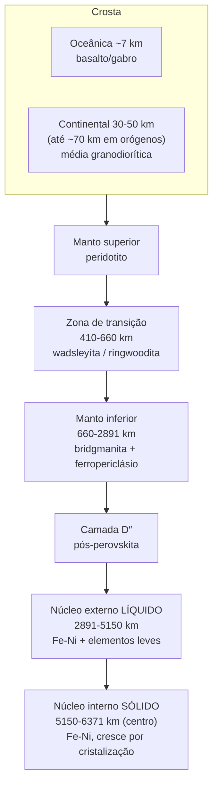

# Aula 02: O modelo em camadas — da crosta ao núcleo interno

**ID:** geologia-gemologia-m02-a02
**Módulo:** [[02-sistema-terra-tectonica-modulo|Módulo 02 — Sistema Terra: estrutura interna e tectônica de placas]]
**Duração estimada:** ~30 min
**Objetivo:** preencher com números, composições e mineralogia o modelo em camadas da Terra, e reunir as evidências independentes — sísmicas e não sísmicas — que o sustentam.
**Pré-requisito:** Aula 01 deste módulo (como a sismologia revela o interior: ondas P e S, zonas de sombra, descontinuidades de Mohorovičić, Gutenberg e Lehmann, descontinuidades de 410 e 660 km, camada D″, PREM, tomografia sísmica).

## Ao final você vai conseguir

- [OA-01] Descrever a composição e as espessuras representativas de crosta oceânica e continental, e a definição sísmica da Moho.
- [OA-02] Descrever a mineralogia e a estrutura do manto — superior, zona de transição, inferior — e a camada D″.
- [OA-03] Descrever a composição e o comportamento do núcleo externo e interno, e o mecanismo pelo qual o núcleo interno cresce.
- [OA-04] Reunir evidências independentes do modelo em camadas — densidade média, momento de inércia, meteoritos, experimentos de alta pressão, campo magnético — como caso de consiliência.
- [OA-05] Explicar a geoterma e a definição (múltipla) da base da litosfera.

## Conteúdo

### Retomada rápida: o método já está feito, falta o número

A Aula 01 respondeu "como sabemos o que tem lá dentro, sem nunca ter ido lá": ondas sísmicas mudam de velocidade e de trajetória ao cruzar interfaces, e essas interfaces — Moho, Gutenberg, Lehmann, 410 km, 660 km — desenham a arquitetura do planeta. Isso já deu a **forma** do modelo. Esta aula dá o **conteúdo**: do que cada camada é feita, em que proporção, e — o ponto mais importante — que outras linhas de evidência, independentes da sismologia, chegam à mesma conclusão. É a divisão **química** da Aula 03 do módulo 01 (crosta/manto/núcleo), agora com números e mineralogia. A divisão **mecânica** (litosfera/astenosfera/mesosfera/núcleos) já foi apresentada lá; não é reensinada aqui.

### Crosta: a casca fina e heterogênea

A crosta é a camada mais externa, de silicatos leves, e existe em dois tipos que quase não têm nada em comum além do nome.

**Crosta oceânica.** Fina — em torno de **7 km** em média, numa faixa típica de **5 a 10 km** — e de composição basáltica/gabroica: basalto perto do topo, gabro (o equivalente intrusivo, de granulação grossa) mais abaixo. Ela nasce nas dorsais meso-oceânicas e é geologicamente jovem em qualquer ponto do planeta, porque é reciclada por subducção antes de envelhecer muito.

O corte dessa crosta não é hipotético: existem no mundo fatias inteiras de crosta oceânica e manto superior empurradas para cima de continentes por processos tectônicos, preservadas quase intactas. Chamam-se **ofiolitos**, e a sequência ofiolítica, de cima para baixo, é o "raio-X" da crosta oceânica:

1. Sedimentos pelágicos (o que se deposita lentamente no fundo oceânico).
2. Basalto em almofada (*pillow lava*) — lava que esfria em contato com água formando lóbulos arredondados, a assinatura de vulcanismo submarino.
3. Diques em camada (*sheeted dikes*) — fraturas verticais paralelas, sucessivas, por onde o magma subiu para alimentar a lava acima.
4. Gabro — a mesma composição do basalto, cristalizada lentamente em profundidade.
5. Peridotito residual — manto que perdeu a fração que fundiu para formar a crosta acima.

Um ofiolito é, literalmente, uma seção da litosfera oceânica em pé, e é uma das poucas amostras diretas — não inferidas por ondas sísmicas — que existem do que fica logo abaixo do fundo do mar.

**Crosta continental.** Muito mais espessa — tipicamente **30 a 50 km**, chegando a cerca de **70 km** sob cinturões orogênicos (cadeias de montanhas formadas por colisão continental, como o Himalaia, onde a raiz crustal engrossa por dobramento e empilhamento). Sua composição média é mais félsica (rica em sílica e alumínio) que a oceânica, frequentemente descrita como **granodiorítica** — mas essa é uma média estatística, não uma receita: a crosta continental real é um mosaico heterogêneo de rochas ígneas, metamórficas e sedimentares, com idades que vão de recentes a bilhões de anos. Diferente da oceânica, ela não é reciclada de forma sistemática — por isso guarda registro geológico muito mais antigo.

**A Moho: uma definição sísmica, não uma parede.** O limite crosta-manto, visto na Aula 01, é definido operacionalmente por um salto na velocidade das ondas P para cerca de **8 km/s** — a marca da passagem de silicato pobre em Mg-Fe (crosta) para peridotito (manto). É importante registrar que a **Moho sísmica** (onde a velocidade salta) e a **Moho petrológica** (onde a composição realmente muda de rocha crustal para peridotítica) nem sempre coincidem exatamente: em alguns contextos há uma zona de transição composicional que não produz um salto sísmico limpo, e vice-versa. Na prática, para a maior parte do planeta, as duas convergem o bastante para que "Moho" funcione como um único conceito — mas vale saber que a definição operacional (sísmica) é o que realmente se mede.

### Manto: a maior parte do planeta, em três andares

O manto responde por cerca de **84% do volume da Terra** — de longe a maior fração do planeta, ainda que a crosta seja a parte visível e o núcleo concentre a maior fração da *massa* (por ser muito mais denso). É preciso separar volume de massa aqui: o manto domina em volume, o núcleo domina em densidade, e a crosta não domina em nada além de acessibilidade.

**Composição.** O manto superior é predominantemente **peridotito** — uma rocha ultramáfica composta majoritariamente por **olivina** ((Mg,Fe)₂SiO₄), com **ortopiroxênio** e **clinopiroxênio** como fases secundárias, mais uma fase rica em alumínio que **muda com a pressão**: perto da superfície é **plagioclásio**; um pouco mais fundo, **espinélio**; mais fundo ainda, **granada**. Essa sequência de fases — plagioclásio → espinélio → granada — não é uma mudança de composição química do manto (os elementos continuam os mesmos), é o mineral se reorganizando numa estrutura cristalina mais compacta para acomodar a pressão crescente. Guarde essa lógica: ela volta, ampliada, na zona de transição.

**Manto superior, zona de transição, manto inferior.** A Aula 01 já localizou sismicamente as descontinuidades de **410 km** e **660 km** (valores de referência do modelo PREM — a profundidade exata varia um pouco conforme o modelo sísmico adotado e a região do planeta). Entre elas fica a **zona de transição**: ali, a olivina sofre transições de fase sucessivas — para wadsleyíta perto de 410 km, depois para ringwoodita perto de 520-560 km — estruturas cristalinas mais densas e compactas da mesma fórmula química. Em 660 km, a ringwoodita se decompõe em **bridgmanita** + **ferropericlásio**, marcando a entrada no **manto inferior**.

**Mineralogia do manto inferior.** O mineral dominante — e, por volume, provavelmente o mineral mais abundante da Terra inteira — é a **bridgmanita**, um silicato de magnésio e ferro com estrutura tipo perovskita, (Mg,Fe)SiO₃. O nome é relativamente recente: foi aprovado pela IMA (Comissão Internacional de Novos Minerais e Nomes de Minerais) em **2014**, batizado em homenagem ao físico Percy Bridgman, pioneiro em física de altas pressões. Antes disso, e ainda em boa parte da literatura mais antiga, ele aparece como "**perovskita de silicato**" ou "silicate perovskite" — um nome descritivo de estrutura, não um nome mineral formal, porque faltava uma amostra natural confirmada (que só veio de um meteorito chocado, o que permitiu a aprovação IMA). O segundo mineral mais abundante do manto inferior é o **ferropericlásio** ((Mg,Fe)O), um óxido simples.

**A camada D″ e a pós-perovskita.** Nos últimos ~200-300 km acima do limite manto-núcleo fica a **camada D″**, já vista na Aula 01 como zona sismicamente anômala. Uma peça do quebra-cabeça foi resolvida em meados dos anos 2000: sob a pressão e temperatura dessa profundidade, a bridgmanita sofre nova transição de fase para **pós-perovskita**, uma estrutura ainda mais densa. Essa transição ajuda a explicar parte da complexidade sísmica de D″, mas não explica tudo: a camada também concentra heterogeneidade química e térmica, sendo o local onde plumas mantélicas provavelmente se originam.

**Duas grandes anomalias: as LLSVPs.** A tomografia sísmica (Aula 01) revela, na base do manto, duas regiões continentais de baixíssima velocidade de cisalhamento — sob a **África** e sob o **Pacífico** — conhecidas como LLSVPs (*Large Low Shear-Velocity Provinces*). A **observação** tomográfica é robusta e bem replicada por diferentes estudos. A **interpretação** é onde o consenso acaba: podem ser anomalias predominantemente térmicas (mais quentes, mas quimicamente parecidas com o manto ao redor), podem ser reservatórios quimicamente distintos e mais densos (às vezes propostos como acúmulos de crosta oceânica muito antiga, subductada e afundada até o fundo do manto ao longo de bilhões de anos), ou uma combinação das duas. Trate isso como **questão aberta**, não como fato resolvido.

### Núcleo: metal em dois estados

**Núcleo externo — líquido.** Liga de ferro e níquel, mas não pura: a densidade medida por sismologia é sistematicamente menor do que a de uma liga Fe-Ni pura sob as mesmas condições de pressão, o chamado "**déficit de densidade**" do núcleo. A diferença é atribuída a **elementos leves** dissolvidos no metal fundido — os candidatos mais discutidos são enxofre (S), oxigênio (O), silício (Si), carbono (C) e hidrogênio (H), possivelmente em alguma combinação. **Quais desses elementos, e em que proporção, é uma das questões em aberto mais ativas da geofísica profunda** — não trate nenhuma proporção específica como resolvida.

É a convecção desse metal líquido condutor que, pelo mecanismo do **geodínamo** (já visto no módulo 01), gera o campo magnético terrestre. Um fato relevante do próprio campo, que esta aula só registra — o uso vem na Aula 03 — é que ele **inverte de polaridade** em intervalos irregulares ao longo do tempo geológico.

**Núcleo interno — sólido, e crescendo.** Já vimos, no módulo 01, por que ele é sólido apesar de ser o ponto mais quente do planeta: a pressão ali eleva o ponto de fusão do ferro acima da temperatura local. O que se acrescenta agora é que esse núcleo **não é estático**: ele cresce, lentamente, por **cristalização** na sua superfície — ferro sólido "congelando" a partir do núcleo externo líquido.

Esse processo tem uma consequência elegante que amarra núcleo interno e externo num único sistema. Quando o ferro cristaliza, dois subprodutos ficam para trás no líquido: **calor latente** (liberado na mudança de fase) e os **elementos leves** que não entram na rede cristalina do ferro sólido — e que, por serem menos densos, sobem. Calor e material flutuante, ambos liberados exatamente na fronteira núcleo interno-externo, são o que **alimenta a convecção do núcleo externo** — e portanto o próprio geodínamo. Em outras palavras: o núcleo interno crescendo é, em boa parte, o motor do campo magnético que protege o planeta. Essa é uma peça central da geofísica (módulo 20), citada aqui como parte do quadro composicional.

O núcleo interno também não é uma esfera homogênea e isotrópica: ondas sísmicas que o atravessam de polo a polo viajam mais rápido do que as que o atravessam pelo equador — a chamada **anisotropia sísmica do núcleo interno**, atribuída ao alinhamento preferencial dos cristais de ferro, provavelmente relacionado ao próprio processo de crescimento. Os detalhes desse alinhamento seguem em pesquisa ativa.

### As evidências que não vêm de ondas sísmicas

A sismologia é a ferramenta mais direta para desenhar a arquitetura interna da Terra, mas seria um modelo frágil se dependesse de uma única linha de evidência. Não depende. Ele é sustentado por evidências de naturezas completamente diferentes, que convergem — o critério de **consiliência** apresentado no módulo 01.

- **Densidade média do planeta.** A densidade média da Terra é **5,514 g/cm³**. Compare com a densidade da crosta continental, cerca de **2,7 g/cm³**, e a do manto superior, cerca de **3,3 g/cm³**. Nenhuma combinação razoável de rochas de silicato chega perto de 5,5 g/cm³. **Isso, sozinho, já obriga a existência de material muito mais denso no interior** — é o ponto de partida do exemplo trabalhado desta aula.
- **Momento de inércia.** A densidade média diz que existe algo denso em algum lugar, mas não diz *onde*. Quem resolve isso é o fator de momento de inércia da Terra, medido por geodésia de precisão (a partir de como o planeta responde a torques gravitacionais externos): cerca de **0,3307**, valor **menor** que **0,4**, o fator de uma esfera perfeitamente homogênea. Quanto mais a massa se concentra perto do centro, menor esse fator fica. Um valor abaixo de 0,4 é a prova de que a massa densa não está espalhada — está **concentrada no núcleo**.
- **Meteoritos.** Os **condritos** (meteoritos rochosos não diferenciados) são usados como referência composicional para o material bruto de que o planeta se formou, antes da diferenciação. Os **meteoritos ferrosos** (liga Fe-Ni, com texturas de exsolução como a Widmanstätten, vista na Aula 03 do módulo 01) são interpretados como núcleos de planetesimais que se diferenciaram e depois foram fragmentados por colisão — os análogos físicos mais próximos que existem do material do núcleo terrestre.
- **Experimentos de alta pressão e temperatura.** Técnicas como a **célula de bigorna de diamante** (que comprime amostras microscópicas entre duas pontas de diamante, atingindo pressões de centenas de gigapascals) e a **compressão por choque** (ondas de choque geradas por impacto ou explosão controlada) reproduzem em laboratório as condições de pressão e temperatura do manto profundo e do núcleo, permitindo medir diretamente propriedades como densidade, velocidade sísmica e ponto de fusão de ligas de ferro e de silicatos sob essas condições — e comparar com o que a sismologia infere à distância.
- **Xenólitos mantélicos e ofiolitos.** Xenólitos são fragmentos de rocha estranhos ao magma que os carrega, arrancados de paredes profundas e trazidos à superfície rapidamente o bastante para não reequilibrar — no caso de xenólitos mantélicos, arrancados do manto litosférico por magmas kimberlíticos ou basálticos, são amostras reais de peridotito do manto superior. Ofiolitos, já vistos nesta aula, fazem o mesmo papel para crosta oceânica e o manto imediatamente abaixo dela.
- **A existência do campo magnético.** Um campo magnético global sustentado por bilhões de anos exige um mecanismo de dínamo, e um dínamo exige um fluido **condutor** em movimento **convectivo** numa escala planetária. Isso é incompatível com um interior sólido e homogêneo de silicato — e compatível especificamente com um núcleo externo metálico líquido.

Nenhuma dessas evidências, isolada, prova o modelo. A força está em serem **independentes** — vêm de física, química e geodésia diferentes — e ainda assim convergirem para a mesma arquitetura. Esse é o padrão de raciocínio do módulo 01 aplicado ao caso mais ambicioso possível: o interior inteiro de um planeta.

### A geoterma e a base da litosfera

A temperatura sobe com a profundidade — isso é intuitivo e correto. O que não é correto é extrapolar o comportamento perto da superfície para o planeta inteiro. Na crosta, o gradiente geotérmico médio é da ordem de **25 a 30 °C por quilômetro**. Se esse gradiente valesse até o centro da Terra, a temperatura a 100 km já passaria de 2.500 °C, e o manto inteiro estaria fundido — o que contradiz diretamente as ondas S atravessando o manto (Aula 01: ondas S não se propagam em líquido). O gradiente crustal é alto porque a crosta é um isolante térmico relativamente pobre condutor perto da superfície; em profundidade, o transporte de calor passa a ser dominado por convecção no manto sólido (fluência em escala geológica, não fusão), e o gradiente cai drasticamente.

É essa curva de temperatura por profundidade — a **geoterma** — que define, de forma aproximada, a base da litosfera. A litosfera (módulo 01) é a camada rígida; abaixo dela, a astenosfera flui. A fronteira entre as duas — a **LAB**, *lithosphere-asthenosphere boundary* — costuma ser aproximada pela isoterma de cerca de **1.300 °C**, temperatura próxima ao início de fusão parcial do peridotito em condições mantélicas. Mas vale registrar algo importante: a LAB tem **três definições possíveis**, que não coincidem exatamente:

- **Térmica** — a isoterma de referência (~1.300 °C).
- **Sísmica** — onde a velocidade das ondas cai (a *zona de baixa velocidade*, sinal de maior atenuação e possivelmente pequena fração de fundido).
- **Reológica** — onde o material passa de comportamento rígido para dúctil, definição que mais diretamente interessa à tectônica de placas.

Cada critério mede algo fisicamente diferente, então cada um dá uma profundidade um pouco diferente para "onde a litosfera acaba" — assim como a Moho sísmica e a petrológica nem sempre coincidem. Isso reforça um padrão que já apareceu antes nesta aula: os limites internos da Terra são, em boa medida, **definições operacionais**, escolhidas porque são mensuráveis, não fronteiras físicas absolutas.

*Figura: as profundidades marcadas (410, 660, 2.891 e ~5.150 km) são os valores de referência do modelo sísmico PREM — mudam um pouco conforme o modelo adotado e a região do planeta, e não devem ser lidos como medidas exatas e universais.*

## Exemplo trabalhado

**Pergunta.** A densidade média da Terra é 5,514 g/cm³. A crosta e o manto de silicato têm, em média, cerca de 3,3 g/cm³. Mostre, passo a passo, por que isso exige um núcleo metálico denso — e por que a densidade média sozinha não diz onde esse material denso está.

*Passo 1 — a fração de volume do núcleo, a partir dos raios sísmicos.* Pela Aula 01, o limite manto-núcleo (CMB) está a 2.891 km de profundidade no modelo PREM. Com o raio da Terra em 6.371 km, o raio do núcleo é 6.371 − 2.891 = **3.480 km**. A fração de volume do núcleo em relação ao planeta inteiro é (raio do núcleo / raio da Terra)³:

(3.480 / 6.371)³ = (0,5463)³ ≈ **0,163** — ou seja, o núcleo ocupa cerca de **16%** do volume da Terra (consistente com o manto respondendo pelos ~84% restantes, citados nesta aula).

*Passo 2 — o balanço de massa em duas camadas.* Simplificando a Terra em apenas duas camadas — um envelope de silicato com densidade ρ_manto ≈ 3,3 g/cm³ ocupando 83,7% do volume, e um núcleo de densidade desconhecida ρ_núcleo ocupando os 16,3% restantes —, a densidade média é a média ponderada por volume:

ρ_média = f_núcleo × ρ_núcleo + (1 − f_núcleo) × ρ_manto

5,514 = 0,163 × ρ_núcleo + 0,837 × 3,3

*Passo 3 — isolar e resolver.* 0,837 × 3,3 = 2,762. Logo:

5,514 − 2,762 = 2,752 = 0,163 × ρ_núcleo

ρ_núcleo = 2,752 / 0,163 ≈ **16,9 g/cm³**

*Passo 4 — checar contra um material real.* Esse número — quase 17 g/cm³ — é mais alto que a densidade real do núcleo (a sismologia, via PREM, dá algo da ordem de 10 a 13 g/cm³ crescendo com a profundidade). A razão do exagero é a simplificação do passo 2: tratamos o manto como se tivesse densidade constante de 3,3 g/cm³ em toda sua espessura, quando na realidade o próprio manto se autocomprime com a profundidade e sua densidade média real é maior que o valor de referência próximo à superfície. Ainda assim, mesmo com essa simplificação grosseira, a ordem de grandeza do resultado — um material bem mais denso que qualquer silicato, na faixa de dez a vinte g/cm³ — é exatamente a faixa em que fica o ferro comprimido sob pressões de núcleo (o ferro à pressão ambiente tem 7,87 g/cm³; comprimido às pressões do núcleo, sua densidade sobe para a faixa de 10-13 g/cm³). O argumento grosseiro já aponta na direção certa; o refinamento fino vem do modelo sísmico completo (PREM), não da média de duas camadas.

*Passo 5 — o que falta: onde?* Esse cálculo mostra que **precisa existir**, em algum lugar da Terra, material com densidade da ordem de dez ou mais g/cm³. Não mostra **onde**. Em princípio, um planeta poderia ter essa densidade média com uma casca externa muito densa e um interior mais leve, ou qualquer outra distribuição que preserve a mesma massa total. É aqui que entra o **momento de inércia**: seu valor medido, 0,3307, é menor que 0,4 (esfera homogênea) precisamente porque massa concentrada perto do eixo de rotação — ou seja, perto do **centro** — reduz esse fator. Uma casca densa na superfície produziria o efeito oposto: aumentaria o momento de inércia, não diminuiria. O valor observado só é compatível com a massa densa concentrada no núcleo. A densidade média prova que "existe algo denso"; o momento de inércia converte isso em "está no centro".

## Erros comuns

- **Extrapolar o gradiente geotérmico da crosta para o planeta inteiro.** É sedutor porque a relação "mais fundo, mais quente" parece linear e intuitiva, e o gradiente crustal (~25-30 °C/km) é o único que se mede diretamente e com facilidade, em poços e minas. Extrapolado, ele preveria um manto inteiramente fundido — contradito pelas ondas S do módulo anterior. O gradiente cai fortemente com a profundidade porque o mecanismo de transporte de calor muda.
- **Achar que as descontinuidades de 410 e 660 km marcam mudança de composição química.** É sedutor porque "descontinuidade" soa como "aqui muda o material", e é exatamente assim que funciona a Moho. Mas na zona de transição a química permanece a mesma (olivina e seus polimorfos); o que muda são **transições de fase** — reorganizações da estrutura cristalina sob pressão crescente, sem trocar os átomos envolvidos. A mudança de composição real acontece só em 660 km, quando a ringwoodita se decompõe em dois minerais distintos.
- **Tratar as camadas como cascas nítidas, concêntricas e internamente uniformes.** É sedutor porque diagramas didáticos (inclusive o desta aula) desenham círculos com bordas limpas. Na prática, a Moho sísmica e a petrológica nem sempre coincidem, a LAB tem três definições que divergem, a espessura da litosfera varia lateralmente de forma enorme, e o manto profundo tem heterogeneidades de larga escala (as LLSVPs) que não têm simetria esférica nenhuma.
- **Achar que o manto é magma ou está fundido.** É sedutor porque "manto quente e viscoso" evoca líquido, e porque a palavra "manto" às vezes aparece perto de "magma" em contextos de vulcanismo. O manto é, esmagadoramente, **sólido** — flui em escala de milhões de anos por fluência no estado sólido (mecanismo já visto no módulo 01 para a astenosfera). Fusão parcial existe, mas é localizada e geralmente pequena em fração — é justamente ela que **alimenta** o vulcanismo, não uma condição geral do manto.

## O que não concluir

- Que a natureza física das LLSVPs está resolvida. A observação tomográfica — duas grandes regiões de baixa velocidade sob a África e o Pacífico — é robusta; se são principalmente térmicas, quimicamente distintas e mais densas (por exemplo, acúmulos de crosta oceânica antiga subductada), ou uma mistura das duas, segue em debate ativo na comunidade de geofísica do manto.
- Que se sabe exatamente quais elementos leves compõem o déficit de densidade do núcleo externo, e em que proporção. Enxofre, oxigênio, silício, carbono e hidrogênio são candidatos discutidos; nenhuma combinação específica é consenso fechado.
- Que os números de profundidade citados (410 km, 660 km, 2.891 km, ~5.150 km) são medidas universais e fixas. São valores de referência de um modelo sísmico específico (PREM), construído a partir de uma média global; a profundidade real dessas interfaces varia regionalmente, e modelos sísmicos diferentes dão números um pouco diferentes.
- Que a LAB é uma única fronteira bem definida a uma profundidade fixa. É uma família de três definições — térmica, sísmica, reológica — que se aproximam mas não coincidem exatamente, e cuja profundidade também varia muito entre litosfera oceânica jovem e litosfera continental antiga (assunto que volta quando a tectônica de placas for desenvolvida).
- Que o exemplo trabalhado desta aula (núcleo a ~17 g/cm³) é o valor real de densidade do núcleo. É uma estimativa grosseira de duas camadas, feita de propósito para mostrar a ordem de grandeza do argumento; o perfil de densidade real, mais baixo e crescente com a profundidade, vem do modelo sísmico completo.

## Recap relâmpago

- **Crosta**: oceânica ~7 km (basáltica/gabroica, revelada em corte pelos ofiolitos); continental 30-50 km, até ~70 km sob orógenos, composição média granodiorítica. **Moho** = definição sísmica (salto para Vp ≈ 8 km/s), não sempre igual à Moho petrológica.
- **Manto** ≈ 84% do volume da Terra. Peridotito (olivina + piroxênios + fase aluminosa que muda com pressão). Zona de transição (410-660 km, PREM) = transições de fase, não de composição. Manto inferior = **bridgmanita** (nome IMA 2014) + **ferropericlásio**. Camada D″ = transição para pós-perovskita + heterogeneidade química/térmica, incluindo as **LLSVPs** sob África e Pacífico (interpretação em aberto).
- **Núcleo externo líquido** (Fe-Ni + elementos leves debatidos: S, O, Si, C, H) gera o campo magnético por geodínamo. **Núcleo interno sólido** cresce por cristalização, liberando calor latente e elementos leves que alimentam a convecção externa — e tem anisotropia sísmica.
- O modelo não depende só de sismologia: densidade média (5,514 g/cm³), momento de inércia (0,3307), meteoritos, experimentos de alta pressão, xenólitos/ofiolitos e o próprio campo magnético convergem — consiliência.
- Densidade média mostra que existe material denso; momento de inércia mostra que ele está concentrado no centro.
- Gradiente geotérmico crustal (~25-30 °C/km) não se extrapola; a base da litosfera (LAB) é aproximada pela isoterma de ~1.300 °C, com três definições que não coincidem exatamente.

## Próxima aula

[[02-sistema-terra-tectonica-aula-03-deriva-continental-a-tectonica|Aula 03 — Da deriva continental à tectônica de placas]]. Até aqui a Terra foi tratada em corte, estática — um planeta descrito camada por camada. A próxima aula põe esse planeta em movimento: como a ideia de continentes que se deslocam, rejeitada por décadas, virou a teoria unificadora que explica sismos, vulcões e a forma dos continentes.

## Fontes

- Modelo sísmico de referência (PREM) e profundidades das principais descontinuidades — Dziewonski & Anderson, "Preliminary reference Earth model" (1981); [PREM (Wikipedia)](https://en.wikipedia.org/wiki/Preliminary_reference_Earth_model)
- Bridgmanita — nome aprovado pela IMA em 2014, primeira ocorrência natural confirmada em meteorito chocado — [Bridgmanite (Wikipedia)](https://en.wikipedia.org/wiki/Bridgmanite); Tschauner et al., "Discovery of bridgmanite, the most abundant mineral in Earth, in a shocked meteorite" (Science, 2014)
- Densidade média e momento de inércia da Terra — [Earth (Wikipedia)](https://en.wikipedia.org/wiki/Earth); [Structure of Earth (Wikipedia)](https://en.wikipedia.org/wiki/Structure_of_Earth)
- Ofiolitos como seções de litosfera oceânica preservadas — [Ophiolite (Wikipedia)](https://en.wikipedia.org/wiki/Ophiolite)
- Zona de transição do manto, pós-perovskita e camada D″ — [Mantle transition zone (Wikipedia)](https://en.wikipedia.org/wiki/Mantle_transition_zone); [Post-perovskite (Wikipedia)](https://en.wikipedia.org/wiki/Post-perovskite)
- Large Low-Shear-Velocity Provinces (LLSVPs) — [Large low-shear-velocity provinces (Wikipedia)](https://en.wikipedia.org/wiki/Large_low-shear-velocity_provinces)
- Déficit de densidade do núcleo e elementos leves — [Earth's outer core (Wikipedia)](https://en.wikipedia.org/wiki/Earth%27s_outer_core); [Earth's inner core (Wikipedia)](https://en.wikipedia.org/wiki/Earth%27s_inner_core)
- Anisotropia sísmica do núcleo interno — [Inner core (Wikipedia)](https://en.wikipedia.org/wiki/Earth%27s_inner_core#Seismic_anisotropy)
- Gradiente geotérmico e base da litosfera (LAB) — [Geothermal gradient (Wikipedia)](https://en.wikipedia.org/wiki/Geothermal_gradient); [Lithosphere-asthenosphere boundary (Wikipedia)](https://en.wikipedia.org/wiki/Lithosphere%E2%80%93asthenosphere_boundary)

<!--
mapa_objetivo_secao:
  OA-01: "Retomada rápida" + "Crosta: a casca fina e heterogênea"
  OA-02: "Manto: a maior parte do planeta, em três andares"
  OA-03: "Núcleo: metal em dois estados"
  OA-04: "As evidências que não vêm de ondas sísmicas" + "Exemplo trabalhado"
  OA-05: "A geoterma e a base da litosfera"

alegacoes_auditaveis:
  - claim_id: GEO-M02-A02-CROSTA-OCEANICA-001
    claim: "Crosta oceânica tem espessura típica de ~7 km, em faixa de 5-10 km, composição basáltica/gabroica."
    risk: numero
    source: "valores de referência padrão de geofísica; consistente com módulo 01 (faixa 5-10 km)"
    confianca: alta
  - claim_id: GEO-M02-A02-OFIOLITO-002
    claim: "Sequência ofiolítica: sedimentos pelágicos, basalto em almofada, diques em camada, gabro, peridotito residual, como corte observável de litosfera oceânica preservada."
    risk: classificacao
    source: "petrologia estrutural clássica; Wikipedia/Ophiolite"
    confianca: alta
  - claim_id: GEO-M02-A02-CROSTA-CONTINENTAL-003
    claim: "Crosta continental tem espessura típica de 30-50 km, chegando a cerca de 70 km sob cinturões orogênicos."
    risk: numero
    source: "valores de referência padrão de geofísica"
    confianca: alta
  - claim_id: GEO-M02-A02-GRANODIORITO-004
    claim: "Composição média da crosta continental é frequentemente descrita como granodiorítica, sendo uma média estatística sobre um mosaico heterogêneo."
    risk: classificacao
    source: "geoquímica de crosta continental, consolidado; detalhar no módulo 10"
    confianca: alta
  - claim_id: GEO-M02-A02-MOHO-VP-005
    claim: "A Moho é definida sismicamente por um salto na velocidade das ondas P para cerca de 8 km/s; Moho sísmica e petrológica nem sempre coincidem exatamente."
    risk: mecanismo
    source: "sismologia de crosta, consolidado; detalhar no módulo 20"
    confianca: alta
  - claim_id: GEO-M02-A02-VOLUME-MANTO-006
    claim: "O manto responde por cerca de 84% do volume da Terra."
    risk: numero
    source: "valor de referência padrão; conferido por cálculo geométrico no exemplo trabalhado desta aula (~84% consistente com fração de núcleo ~16%)"
    confianca: alta
  - claim_id: GEO-M02-A02-PERIDOTITO-007
    claim: "O manto superior é predominantemente peridotítico: olivina + ortopiroxênio + clinopiroxênio + fase aluminosa que varia com a pressão (plagioclásio → espinélio → granada)."
    risk: classificacao
    source: "petrologia do manto, consolidado; detalhar no módulo 08 (petrologia ígnea/metamórfica) e módulo 20"
    confianca: alta
  - claim_id: GEO-M02-A02-ZONA-TRANSICAO-008
    claim: "A zona de transição do manto vai de ~410 a ~660 km (valores de referência do modelo PREM), com transições de fase da olivina (wadsleyíta, depois ringwoodita), não mudança de composição."
    risk: numero
    source: "PREM (Dziewonski & Anderson, 1981); mineralogia de alta pressão"
    confianca: alta
  - claim_id: GEO-M02-A02-BRIDGMANITA-009
    claim: "Bridgmanita é o nome IMA aprovado em 2014 para o silicato de Mg-Fe com estrutura tipo perovskita, mineral mais abundante do manto inferior; literatura anterior a 2014 usa 'perovskita de silicato'."
    risk: numero
    source: "Tschauner et al., 2014, Science; Wikipedia/Bridgmanite"
    confianca: alta
  - claim_id: GEO-M02-A02-FERROPERICLASIO-010
    claim: "Ferropericlásio ((Mg,Fe)O) é o segundo mineral mais abundante do manto inferior."
    risk: classificacao
    source: "mineralogia de manto profundo, consolidado"
    confianca: alta
  - claim_id: GEO-M02-A02-POSPEROVSKITA-011
    claim: "Na camada D″, a bridgmanita sofre transição de fase para pós-perovskita, descoberta em meados dos anos 2000."
    risk: mecanismo
    source: "Wikipedia/Post-perovskite; literatura de geofísica de manto profundo"
    confianca: media
  - claim_id: GEO-M02-A02-LLSVP-012
    claim: "Existem duas grandes províncias de baixa velocidade de cisalhamento (LLSVPs) na base do manto, sob a África e sob o Pacífico; a observação tomográfica é robusta, a interpretação (termoquímica vs. pilha de crosta oceânica subductada) é debatida."
    risk: controverso
    source: "Wikipedia/Large low-shear-velocity provinces; apresentado explicitamente como questão em aberto"
    confianca: media
  - claim_id: GEO-M02-A02-CMB-013
    claim: "O limite manto-núcleo (CMB) está a 2.891 km de profundidade no modelo PREM; o número depende do modelo sísmico adotado."
    risk: numero
    source: "PREM (Dziewonski & Anderson, 1981)"
    confianca: alta
    nota: "retomar M01-F04 (auditoria do módulo 01, valor anterior 'cerca de 2.900 km'), aqui já usando o valor PREM explícito conforme pendência registrada em _contexto.md"
  - claim_id: GEO-M02-A02-ELEMENTOS-LEVES-014
    claim: "O núcleo externo tem déficit de densidade em relação a liga Fe-Ni pura, atribuído a elementos leves (S, O, Si, C, H) em proporções não consensuais."
    risk: controverso
    source: "geofísica de núcleo, consolidado como questão aberta; detalhar no módulo 20"
    confianca: media
  - claim_id: GEO-M02-A02-ICB-015
    claim: "O limite núcleo externo/interno (ICB) está a aproximadamente 5.150 km de profundidade no modelo PREM (raio do núcleo interno ~1.221 km)."
    risk: numero
    source: "PREM (Dziewonski & Anderson, 1981)"
    confianca: alta
  - claim_id: GEO-M02-A02-CRESCIMENTO-NI-016
    claim: "O núcleo interno cresce por cristalização a partir do núcleo externo líquido, liberando calor latente e elementos leves que alimentam a convecção do núcleo externo e o geodínamo."
    risk: mecanismo
    source: "geodínamo, consolidado; detalhar no módulo 20"
    confianca: alta
  - claim_id: GEO-M02-A02-ANISOTROPIA-017
    claim: "O núcleo interno apresenta anisotropia sísmica (ondas viajam mais rápido na direção polar que na equatorial), atribuída a alinhamento cristalino do ferro."
    risk: mecanismo
    source: "Wikipedia/Earth's inner core; sismologia de núcleo profundo"
    confianca: media
  - claim_id: GEO-M02-A02-DENSIDADE-MEDIA-018
    claim: "A densidade média da Terra é 5,514 g/cm³."
    risk: numero
    source: "Wikipedia/Earth; valor de referência padrão"
    confianca: alta
  - claim_id: GEO-M02-A02-DENSIDADES-REF-019
    claim: "Densidade da crosta continental ~2,7 g/cm³; densidade do manto superior ~3,3 g/cm³."
    risk: numero
    source: "valores de referência padrão de petrofísica"
    confianca: alta
  - claim_id: GEO-M02-A02-MOMENTO-INERCIA-020
    claim: "O fator de momento de inércia da Terra (C/MR²) é aproximadamente 0,3307, menor que 0,4 (esfera homogênea), indicando concentração de massa no centro."
    risk: numero
    source: "Wikipedia/Structure of Earth; geodésia de precisão"
    confianca: alta
  - claim_id: GEO-M02-A02-GRADIENTE-021
    claim: "O gradiente geotérmico médio na crosta é da ordem de 25-30 °C/km, não extrapolável para o manto inteiro."
    risk: numero
    source: "Wikipedia/Geothermal gradient; valor de referência padrão"
    confianca: alta
  - claim_id: GEO-M02-A02-LAB-ISOTERMA-022
    claim: "A base da litosfera (LAB) é frequentemente aproximada pela isoterma de ~1.300 °C, com definições térmica, sísmica e reológica que não coincidem exatamente."
    risk: numero
    source: "Wikipedia/Lithosphere-asthenosphere boundary; literatura de geofísica de litosfera"
    confianca: media
  - claim_id: GEO-M02-A02-FERRO-PRESSAO-023
    claim: "O ferro tem densidade de 7,87 g/cm³ à pressão ambiente e, comprimido sob pressões de núcleo, atinge a faixa de 10-13 g/cm³, ordem de grandeza usada para checar o exemplo trabalhado desta aula."
    risk: numero
    source: "propriedades físicas do ferro (referência padrão) + perfil de densidade do núcleo no PREM"
    confianca: media
    nota: "valor de checagem de ordem de grandeza, não medida exata do núcleo; o perfil real vem do PREM"
-->
