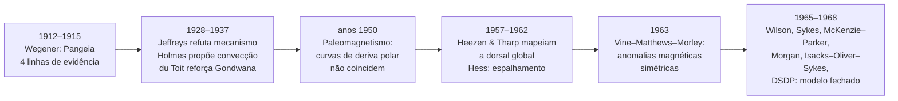

# Aula 03: Da deriva continental à tectônica de placas: anatomia de uma revolução

**ID:** geologia-gemologia-m02-a03
**Módulo:** [[02-sistema-terra-tectonica-modulo|Módulo 02 — Sistema Terra: estrutura interna e tectônica de placas]]
**Duração estimada:** ~30 min
**Objetivo:** reconstruir a passagem da deriva continental de Wegener à tectônica de placas — objetivo `geologia-gemologia-m02-oa02` do módulo —, mostrando por que a primeira foi racionalmente rejeitada por décadas e o que a segunda teve que reunir, entre 1950 e 1968, para ser aceita.
**Pré-requisito:** Aulas 01 e 02 deste módulo (estrutura interna revelada por sismologia; litosfera rígida sobre astenosfera dúctil, com os números de espessura e comportamento).

## Ao final você vai conseguir

- [OA-01] Reconstruir as quatro linhas de evidência independentes reunidas por Wegener para a Pangeia, e explicar por que eram consilientes mas ainda insuficientes.
- [OA-02] Explicar por que a rejeição da deriva continental, entre 1912 e os anos 1950, foi uma resposta racional à falta de mecanismo físico plausível — e não um caso de teimosia ou dogmatismo da comunidade científica.
- [OA-03] Reconstruir a cadeia de evidências independentes — paleomagnetismo, batimetria, anomalias magnéticas simétricas, falhas transformantes, sismologia global, perfuração oceânica — que converteu a deriva continental na tectônica de placas entre 1950 e 1968, e calcular uma taxa de espalhamento oceânico a partir de anomalias magnéticas.

## Conteúdo

### Por que esta aula é também uma aula de método

Na Aula 02 do módulo 01 você aprendeu que a geologia raciocina por **consiliência**: uma hipótese ganha força quando linhas de evidência independentes, com fundamentos físicos distintos, convergem para a mesma conclusão. Esta aula é o estudo de caso mais espetacular desse critério — e também um contraexemplo instrutivo, porque consiliência de observação **não bastou**. Faltava mecanismo. E a comunidade que rejeitou Wegener não foi irracional: tinha uma objeção física correta. A tectônica de placas só se consolidou quando um segundo conjunto de evidências, de natureza completamente diferente, fechou exatamente essa lacuna.

### 1. Precursores: notar o encaixe não é ter uma teoria

O encaixe entre a costa leste da América do Sul e a costa oeste da África salta aos olhos em qualquer mapa-múndi razoavelmente preciso, e foi notado cedo. **Abraham Ortelius**, cartógrafo, já observara e comentara essa correspondência em 1596, em seu *Thesaurus Geographicus*, especulando que os continentes teriam sido arrancados uns dos outros — atribuição que só foi trazida à atenção da comunidade geológica moderna em 1994, por um estudo do classicista James Romm, e que hoje circula amplamente na literatura de divulgação. **Antonio Snider-Pellegrini**, geógrafo francês, foi além em 1858: no livro *La Création et ses mystères dévoilés*, publicou os primeiros mapas conhecidos mostrando os continentes unidos e depois separados, apoiado também em semelhanças de fósseis vegetais entre a Europa e a América do Norte.

Nenhum dos dois propôs um mecanismo, nem reuniu evidência sistemática além da geometria e de observações pontuais. **Notar um encaixe geométrico é uma observação; explicar por que ele existe, com evidência independente e verificável, é uma teoria.** É essa distinção que separa os precursores de Wegener.

### 2. Wegener: a Pangeia e quatro linhas de evidência independentes

Alfred Wegener, meteorologista alemão, apresentou a hipótese da deriva continental em conferências e artigos a partir de **1912**, e a desenvolveu no livro *Die Entstehung der Kontinente und Ozeane* (**1915**), publicado em edições sucessivas e ampliadas nas décadas seguintes. A proposta central: todos os continentes atuais estiveram reunidos num supercontinente único, a **Pangeia**, que começou a se fragmentar há cerca de 200 milhões de anos, e os fragmentos derivaram até as posições de hoje.

O que torna Wegener diferente dos precursores é que ele não se apoiou só no encaixe visual — reuniu **quatro linhas de evidência independentes**:

**(a) Geométrica.** O ajuste entre continentes funciona melhor quando se usa a borda da **plataforma continental** (o limite real da massa continental, submerso) em vez da linha de costa atual, que é apenas o nível do mar de hoje. Décadas depois, em **1965**, Edward Bullard, James Everett e Alan Smith formalizariam isso quantitativamente: usando um computador da Universidade de Cambridge, ajustaram os continentes ao redor do Atlântico pela linha batimétrica de 500 braças (cerca de 900 m), minimizando o erro geométrico do encaixe e expressando a rotação de cada continente por um polo e um ângulo de Euler. O resultado — um ajuste quase perfeito — é hoje conhecido como o **ajuste de Bullard**, e é frequentemente citado como o momento em que a deriva continental deixou de ser uma impressão visual para virar um resultado numérico verificável.

**(b) Paleontológica.** Fósseis idênticos ou muito próximos aparecem em continentes hoje separados por milhares de quilômetros de oceano, sem meio óbvio de travessia. Os casos clássicos: *Mesosaurus*, um réptil aquático de água doce do Permiano, encontrado apenas na América do Sul e na África — um animal de água doce não atravessa um oceano; *Glossopteris*, uma samambaia com sementes cujas sementes grandes e pesadas não se dispersam por vento ou água salgada a longa distância, encontrada em todos os continentes hoje reunidos no que se chama **Gondwana** (América do Sul, África, Índia, Austrália, Antártida); e dois répteis terrestres do Triássico, *Cynognathus* e *Lystrosaurus*, com distribuições igualmente restritas a fragmentos gondwânicos hoje separados por oceano.

**(c) Paleoclimática.** Depósitos de **tilito** — sedimento glacial não estratificado, com blocos e matriz misturada — do intervalo permo-carbonífero aparecem em regiões hoje tropicais ou subtropicais (partes da América do Sul, África, Índia, Austrália), com **estrias de abrasão glacial** no substrato rochoso. Essas estrias só apontam em direções geograficamente coerentes — como um único manto de gelo centrado sobre um polo — quando os continentes são reconstruídos na configuração gondwânica. Na configuração atual, o padrão de estrias é geograficamente absurdo. No sentido inverso, depósitos de **carvão** (que exigem clima úmido e quente, vegetação exuberante) e **evaporitos** (que exigem clima árido) aparecem em latitudes incompatíveis com o clima que essas latitudes têm hoje.

**(d) Geológica.** Cinturões orogênicos — faixas de rocha deformada por antigas cadeias de montanhas — e blocos de embasamento pré-cambriano se alinham através do oceano quando os continentes são reunidos, como se um mesmo cinturão tivesse sido cortado ao meio. O caso mais citado no contexto deste curso é a correspondência entre o embasamento pré-cambriano da **África Ocidental e o do Brasil**: unidades geológicas, idades radiométricas e trends estruturais de um lado do Atlântico Sul encontram continuidade no outro lado — tema que será retomado com detalhe no módulo 26 (Geologia do Brasil).

| Linha de evidência | O que mostra | Por que é independente das outras |
|---|---|---|
| Geométrica (plataforma; ajuste de Bullard, 1965) | Os continentes se encaixam como peças de um quebra-cabeça | Depende só de geometria, não de biologia ou clima |
| Paleontológica (*Mesosaurus*, *Glossopteris*, *Cynognathus*, *Lystrosaurus*) | Organismos incapazes de atravessar oceano aparecem nos dois lados | Depende de biologia de dispersão, não de geometria |
| Paleoclimática (tilitos, estrias, carvão, evaporitos) | Zonas climáticas antigas só fazem sentido físico na reconstrução | Depende de física do clima e do gelo, não de fósseis |
| Geológica (cinturões orogênicos, embasamento) | Estruturas rochosas contínuas se um continente foi cortado do outro | Depende de geologia estrutural, não de clima nem de biologia |

Quatro linhas com fundamentos físicos totalmente distintos convergindo para a mesma reconstrução — isto é consiliência no sentido exato da Aula 02. E, mesmo assim, a hipótese foi rejeitada pela maioria da comunidade geológica por décadas.

### 3. Por que foi rejeitada: uma objeção física correta

O ponto fraco de Wegener não estava na evidência — estava no **mecanismo**. Ele propôs que os continentes, feitos de rocha continental mais leve (sial), "aravam" o assoalho oceânico, mais denso (sima), como um navio de gelo abrindo caminho na água. As forças motrizes propostas eram a *Polflucht* ("fuga dos polos", uma força centrífuga ligada à rotação da Terra que empurraria massas continentais para longe dos polos) e forças de maré geradas pela atração do Sol e da Lua.

O físico e geofísico **Harold Jeffreys** mostrou, com cálculos que resistiram ao escrutínio, que essas forças eram **ordens de grandeza pequenas demais** para mover continentes inteiros através de um assoalho oceânico rígido, e que a resistência mecânica da crosta e do manto superior, tais como então entendidos, simplesmente não permitiria esse tipo de deslocamento sem que a crosta se rompesse de formas não observadas. **A objeção era fisicamente correta.** O erro de Wegener não estava em dizer que os continentes se moveram — estava em dizer *como*. Sem mecanismo plausível, a comunidade geofísica, que julgava a hipótese pelo padrão adequado de qualquer proposta científica — pode isto realmente acontecer, fisicamente? —, tinha motivo legítimo para rejeitá-la.

Isso não significa que ninguém defendeu a ideia nesse meio-tempo. O geólogo sul-africano **Alexander du Toit** publicou em **1937** o livro *Our Wandering Continents*, reforçando com detalhe de campo o lado gondwânico da evidência geológica e paleontológica. E o geólogo britânico **Arthur Holmes**, no fim dos anos 1920 e início dos 1930, propôs que o motor não seria a Terra arando o oceano, mas **correntes de convecção no manto** arrastando os continentes passivamente — uma ideia notavelmente próxima do que se aceita hoje, formalizada depois com mais detalhe em seu livro *Principles of Physical Geology* (1944). Era a ideia certa, mas Holmes não tinha dados capazes de comprová-la: não havia, em sua época, nenhuma forma de observar convecção mantélica diretamente. Uma hipótese correta sem evidência que a sustente ainda não é uma teoria estabelecida — só se torna uma quando os dados aparecem.

> [!question] Antes de seguir
> Se a evidência de Wegener já era consiliente em 1915, por que isso não bastou para convencer a comunidade? Guarde a resposta: falta de mecanismo físico plausível não é o mesmo que falta de evidência observacional — e a ciência exige as duas coisas.

### 4. O paleomagnetismo reabre o problema (anos 1950)

A virada começou por um caminho inesperado: rochas guardam, no momento em que se formam, um registro fóssil da direção do campo magnético terrestre daquele instante — a **magnetização remanente**. Minerais magnéticos (magnetita, por exemplo) se alinham com o campo ao esfriar abaixo de certa temperatura (o ponto de Curie) e "travam" essa orientação.

Medindo a magnetização remanente em rochas de idades sucessivas num mesmo continente, é possível reconstruir uma **curva de deriva polar aparente** — a posição do polo magnético "vista" daquele continente ao longo do tempo. Nos anos 1950, o grupo britânico liderado por **S. K. Runcorn** fez exatamente isso para a Europa e para a América do Norte, separadamente. O resultado foi desconcertante: as duas curvas de deriva polar aparente **não coincidem**. Cada continente, tratado como fixo, "vê" o polo magnético percorrer um caminho diferente ao longo do tempo geológico.

Isso força uma escolha lógica. Só existe **um** polo magnético médio do planeta em cada época — o campo geomagnético é global. Então, ou o polo se moveu de duas formas diferentes ao mesmo tempo, o que é fisicamente absurdo, ou os continentes que registraram essas curvas **se moveram um em relação ao outro**. Quando se fecha o Atlântico na reconstrução geométrica, as duas curvas de deriva polar aparente **convergem numa só**. O paleomagnetismo, uma linha de evidência que Wegener sequer tinha à disposição, reabriu uma questão que a geofísica considerava fechada havia décadas.

### 5. O assoalho oceânico revelado (anos 1950–1960)

Em paralelo, o mapeamento sistemático do fundo oceânico — sobretudo o trabalho de **Bruce Heezen** e da cartógrafa **Marie Tharp**, que transformou dados de sonar em mapas fisiográficos detalhados do assoalho — revelou uma estrutura que ninguém esperava: uma **cadeia de montanhas submarina contínua**, a dorsal meso-oceânica, percorrendo cerca de **65.000 km** através de todos os oceanos, com um **vale de rifte** no seu eixo. Junto com isso vieram três observações que exigiam explicação: o **fluxo de calor** medido no eixo da dorsal é anormalmente alto; o **sedimento oceânico** é surpreendentemente fino e nunca muito antigo, mesmo em bacias oceânicas profundas; e a **sismicidade** do assoalho se concentra em faixas estreitas e contínuas, coincidindo com o traçado da dorsal e com as margens de certas bacias.

Um planeta com uma cordilheira global ativa, quente no eixo, com sedimento jovem em toda parte e terremotos alinhados em faixas — isso não é o retrato de um assoalho oceânico estático e antigo, como se supunha até então.

### 6. Espalhamento do assoalho oceânico

O geólogo **Harry Hess**, num artigo influente de **1962** intitulado "History of Ocean Basins" (a ideia já circulava informalmente desde cerca de 1960), propôs a explicação: o assoalho oceânico **nasce** na dorsal, onde material do manto sobe, resfria e forma nova crosta oceânica, e é **consumido** nas fossas oceânicas profundas, onde mergulha de volta para o manto. O assoalho funciona como uma esteira rolante contínua — cada faixa de crosta se afasta da dorsal à medida que uma faixa mais nova se forma atrás dela. **Robert Dietz**, em **1961**, cunhou o termo que ficou consagrado para esse processo: *seafloor spreading*, espalhamento do assoalho oceânico.

Repare no que isso explica de imediato: por que o sedimento oceânico nunca é muito antigo (a crosta que o carrega está sempre sendo criada de novo e destruída); por que o fluxo de calor é alto no eixo da dorsal (é lá que o material do manto está mais próximo da superfície); e por que a crosta oceânica, como você já sabe do módulo 01, tem idade máxima de cerca de 200 Ma — muito mais nova que a crosta continental, que preserva rocha de bilhões de anos.

### 7. O teste decisivo: as anomalias magnéticas simétricas (1963)

A hipótese de Hess e Dietz era plausível, mas ainda faltava um teste que pudesse **falhar**. Ele veio do próprio paleomagnetismo, cruzado com o mapeamento do assoalho.

Você já sabe, da Aula 02 deste módulo, que o campo magnético terrestre é gerado por um geodínamo no núcleo externo líquido, e que esse campo passa por **inversões de polaridade** ao longo do tempo geológico — épocas em que o norte e o sul magnéticos trocam de lugar. Se o assoalho oceânico realmente nasce continuamente na dorsal, então cada faixa nova de crosta basáltica deveria registrar, ao esfriar, a polaridade do campo magnético **no momento exato em que se formou** — como uma fita gravando continuamente.

Em **1963**, **Frederick Vine** e **Drummond Matthews**, na revista *Nature*, propuseram e testaram exatamente essa previsão: se o espalhamento é real, as anomalias magnéticas — variações na intensidade do campo medidas por magnetômetro rebocado por navio, refletindo se a rocha embaixo está com polaridade normal ou invertida — deveriam formar **faixas paralelas ao eixo da dorsal, simétricas dos dois lados**, e o padrão dessas faixas deveria coincidir com a escala de inversões de polaridade já datada de forma independente, em lavas continentais datadas por métodos radiométricos. Foi exatamente o que os dados mostraram. De forma notável e pouco reconhecida na época, o geofísico canadense **Lawrence Morley** havia chegado à mesma ideia de forma independente, e submetido um artigo com ela à *Nature* em fevereiro de 1963 e ao *Journal of Geophysical Research* em abril de 1963 — ambos recusaram o manuscrito por considerá-lo especulativo demais, meses antes da publicação de Vine e Matthews. A hipótese ficou consagrada como **hipótese de Vine–Matthews–Morley**.

Vale destacar por que este é um teste epistemologicamente forte, no sentido da Aula 02: é uma **previsão arriscada**. O padrão de faixas simétricas, coincidindo em espaçamento com uma escala de tempo medida por método totalmente diferente (radiometria em rocha continental), poderia perfeitamente **não** ter aparecido — e se não tivesse aparecido, a hipótese do espalhamento teria sido derrubada ali mesmo. Ela não falhou. É esse tipo de teste, e não a mera acumulação de mais observações compatíveis, que dá peso decisivo a uma hipótese científica.

### 8. O fechamento do modelo (1965–1968)

Entre 1965 e 1968, uma sequência de trabalhos amarrou as pontas soltas e transformou observações dispersas num modelo unificado e testável.

**J. Tuzo Wilson**, em **1965**, resolveu um quebra-cabeça geométrico que intrigava quem olhava o mapa da dorsal: por que ela é cortada, em ziguezague, por falhas que parecem deslocar segmentos inteiros de um lado para o outro? Wilson mostrou que essas não são falhas de deslocamento comum — são um tipo novo, a **falha transformante**, cuja existência só faz sentido lógico se o assoalho realmente se espalha para os dois lados da dorsal. Em **1967**, **Lynn Sykes** testou essa previsão de forma direta: analisando **mecanismos focais** de terremotos ao longo de falhas transformantes oceânicas, mostrou que o sentido do deslizamento é exatamente o previsto pelo espalhamento — e é o **oposto** do que a intuição ingênua sugeriria olhando só a geometria da falha no mapa. Essa confirmação, porque testava uma previsão contraintuitiva e específica, foi decisiva.

Em **1967**, **Dan McKenzie** e **Robert Parker**, e em **1968**, **Jason Morgan**, formalizaram de modo independente o que faltava: tratar a superfície da Terra como um conjunto de **placas rígidas** — não continentes isolados arando o oceano, mas placas inteiras de litosfera, incluindo crosta e manto superior — que se movem umas em relação às outras sobre a superfície de uma esfera, cada movimento descrito matematicamente como uma **rotação em torno de um polo de Euler**. Essa é a formalização geométrica que dá à teoria seu nome moderno, **tectônica de placas**.

O artigo de **Bryan Isacks, Jack Oliver e Lynn Sykes**, "Seismology and the New Global Tectonics" (**1968**, *Journal of Geophysical Research*), amarrou a sismologia global inteira a esse modelo, mostrando que a distribuição profunda de terremotos ao redor do Pacífico — os chamados planos de Wadati–Benioff, que já se sabia mergulharem sob os continentes — é exatamente o que se espera de litosfera sendo empurrada de volta para o manto nas zonas de subducção.

E o teste final veio da perfuração direta: a partir de **1968**, o **Deep Sea Drilling Project**, operado pelo navio *Glomar Challenger*, começou a perfurar o assoalho oceânico e recuperar o sedimento mais antigo, logo acima da crosta basáltica, em pontos a distâncias variadas da dorsal. O resultado: a **idade do sedimento basal cresce de forma simétrica com a distância à dorsal**, exatamente como o modelo de espalhamento previa — e sem exceções que forçassem revisão do modelo.

*Figura: a linha do tempo não é uma acumulação linear — é uma hipótese proposta, rejeitada com boa razão, e depois retomada por uma via de evidência completamente diferente (paleomagnetismo e assoalho oceânico) que resolveu justamente o problema que a havia derrubado.*

### 9. O que a tectônica de placas unificou

Antes de 1968, sismos, vulcões, cadeias de montanhas, a idade jovem do assoalho oceânico, a distribuição de fósseis e o paleoclima antigo eram tratados como fenômenos separados, cada um com sua própria explicação ad hoc. A tectônica de placas deu a todos eles **uma única causa mecânica**: o movimento relativo de placas rígidas de litosfera sobre a astenosfera dúctil (Aula 01 deste módulo), criadas nas dorsais e destruídas nas zonas de subducção. Sismos e vulcões se concentram nas bordas das placas porque é ali que a deformação e a fusão acontecem; cadeias de montanhas se formam onde placas convergem; o assoalho oceânico é sempre jovem porque está em reciclagem contínua; e a distribuição antiga de fósseis e climas faz sentido porque os continentes de fato estiveram em posições diferentes. O ciclo completo de abertura e fechamento de uma bacia oceânica ao longo do tempo — hoje chamado **ciclo de Wilson** — é assunto do módulo 19.

## Exemplo trabalhado

**Situação.** Um navio de pesquisa rebocando um magnetômetro atravessa perpendicularmente o eixo de uma dorsal meso-oceânica e registra o padrão de anomalias magnéticas. A anomalia correspondente ao limite de polaridade **Brunhes–Matuyama** (a última grande reversão do campo magnético, datada de forma independente por métodos radiométricos e astronômicos em cerca de **0,78 milhão de anos**) é identificada a **15,6 km** do eixo da dorsal, num dos dois flancos.

**Passo 1 — a taxa de meia-abertura (half-spreading rate).** Essa distância de 15,6 km foi percorrida por **um único flanco** da dorsal, se afastando do eixo, no tempo transcorrido desde a reversão:

taxa de meia-abertura = 15,6 km ÷ 0,78 milhão de anos = **20 km/milhão de anos**

Convertendo para cm/ano (1 km = 100.000 cm; 1 milhão de anos = 10⁶ anos):
20 km/Ma × 100.000 cm/km ÷ 1.000.000 anos = **2,0 cm/ano**

**Passo 2 — a taxa de abertura total (full-spreading rate).** A dorsal espalha para os **dois lados** simultaneamente e de forma aproximadamente simétrica. Se um flanco se afasta a 2,0 cm/ano, o outro faz o mesmo no sentido oposto, e a bacia oceânica como um todo se alarga ao dobro dessa taxa:

taxa de abertura total = 2 × 2,0 cm/ano = **4,0 cm/ano** (ou 40 km/milhão de anos)

**Passo 3 — o erro clássico, explicitado.** Se alguém pedir "a que velocidade a dorsal espalha" e você responder 2,0 cm/ano usando o raciocínio acima, a resposta está incompleta: 2,0 cm/ano é a taxa de **um flanco**. A taxa de **abertura da bacia** — a que normalmente interessa para dizer "o oceano está crescendo a tanto por ano" — é o dobro, 4,0 cm/ano. Confundir as duas é o erro mais comum ao interpretar dados de espalhamento, e derruba qualquer cálculo posterior por um fator de dois. (Para referência de ordem de grandeza: dorsais lentas, como partes do Atlântico, têm meia-taxa da ordem de 1–2,5 cm/ano — ou seja, abertura total de 2–5 cm/ano; dorsais rápidas, como a Elevação do Pacífico Leste, chegam a cerca de 7–7,5 cm/ano de meia-taxa, isto é, até cerca de 15 cm/ano de abertura total. Esses são os mesmos valores que a Aula 04 usa, lá expressos como taxa total.)

**Passo 4 — estimando a idade da crosta na borda de uma bacia.** Suponha que a mesma dorsal seja o limite ativo de uma bacia oceânica, e você queira estimar a idade da crosta oceânica bem próxima da margem continental, a 200 km do eixo, no mesmo flanco onde a anomalia foi medida. Usando a taxa de **meia-abertura** (é o deslocamento de um único flanco que você está medindo):

idade estimada = 200 km ÷ 20 km/milhão de anos = **10 milhões de anos**

Repare que usar por engano a taxa total (40 km/Ma) daria 5 milhões de anos — metade do valor correto. É o mesmo erro do Passo 3, com consequência prática.

**Passo 5 — por que essa extrapolação é só aproximada.** Essa conta assume uma taxa de espalhamento **constante** ao longo de 10 milhões de anos, e isso raramente é rigorosamente verdadeiro: dorsais aceleram, desaceleram, saltam de posição (*ridge jumps*), e o espalhamento pode deixar de ser simétrico entre os dois flancos por longos intervalos. Além disso, a distância medida hoje ao longo da superfície não corresponde exatamente à distância percorrida no passado se houve deformação posterior da placa, subducção parcial de crosta mais antiga, ou sobreposição de platôs oceânicos e cadeias de ilhas vulcânicas que não fazem parte do espalhamento "puro". Na prática, geólogos refinam essa estimativa linear simples cruzando várias anomalias de idade conhecida ao longo do mesmo perfil — a chamada escala de tempo de polaridade geomagnética — em vez de extrapolar de um único ponto.

## Erros comuns

- **Achar que Wegener "provou" a deriva e foi ignorado por teimosia da comunidade.** A evidência de Wegener era consiliente, mas faltava mecanismo físico plausível, e Harold Jeffreys mostrou com cálculo correto que o mecanismo proposto (Polflucht e maré) era fisicamente inviável. Rejeitar uma hipótese por falta de mecanismo sustentável não é dogmatismo — é o padrão normal de exigência científica. A revolução de 1950–1968 não repetiu a evidência de Wegener; trouxe evidência **nova**, de tipo diferente, que resolvia justamente o problema do mecanismo.
- **Confundir deriva continental com tectônica de placas, como se fossem sinônimos ou fases do mesmo modelo sem diferença real.** Na deriva continental de Wegener, continentes de rocha leve "aravam" um assoalho oceânico estático e rígido. Na tectônica de placas, são **placas inteiras de litosfera** — crosta mais manto superior rígido, oceânica e continental juntas — que se movem, carregando os continentes passivamente como passageiros; o assoalho oceânico não é estático, ele nasce e é consumido continuamente. São modelos com mecanismo, unidade de movimento e comportamento do assoalho oceânico completamente diferentes.
- **Confundir taxa de meia-abertura com taxa de abertura total.** Como no Passo 3 do exemplo trabalhado: a meia-taxa mede um flanco; a taxa total, o dobro, mede o crescimento da bacia inteira. Usar uma pela outra erra por um fator de dois em qualquer cálculo de idade ou de velocidade de afastamento.
- **Achar que as anomalias magnéticas do assoalho registram "o magnetismo da rocha envelhecendo" ou enfraquecendo com o tempo.** Não é isso. A rocha registra, de forma permanente no momento em que esfria abaixo do ponto de Curie, a **polaridade do campo magnético terrestre naquele instante** — normal ou invertida. A faixa não fica "mais fraca" com a idade; ela é uma gravação fixa de um estado do campo global, e o padrão de faixas alternadas reflete as inversões de polaridade ao longo do tempo, não decaimento do magnetismo da rocha.

## O que não concluir

- Que a tectônica de placas "estava pronta" em 1968 como um pacote fechado. O modelo geométrico e cinemático — placas rígidas, espalhamento, subducção, falhas transformantes — ficou bem estabelecido nesse período. O **motor** que efetivamente move as placas (convecção do manto, ridge push, slab pull, e o peso relativo de cada um) continuou e continua sendo refinado — é assunto da Aula 05 deste módulo.
- Que a atribuição de crédito histórico é um fato simples e não uma reconstrução com zonas cinzentas. Vários pesquisadores chegaram a ideias semelhantes de forma independente ou quase simultânea (Vine–Matthews e Morley; McKenzie–Parker e Morgan), e a narrativa "quem descobriu primeiro" costuma ser mais disputada e mais dependente de quem publicou onde e quando do que os relatos simplificados sugerem.
- Que a rejeição de Wegener prova que a comunidade científica erra sistematicamente ao rejeitar ideias corretas. O caso mostra o oposto: a rejeição foi bem fundamentada nos dados e na física disponíveis na época. O que a mudou não foi teimosia vencida por persistência — foi evidência nova, de natureza diferente, que fechou a lacuna real que existia.
- Que todas as quatro linhas de evidência de Wegener tinham o mesmo peso ou a mesma robustez. A evidência paleontológica e paleoclimática era qualitativamente forte, mas dependia de reconstruções que, sem um mecanismo aceito, podiam sempre ser explicadas por hipóteses alternativas então em voga (como pontes de terra afundadas) — hipóteses hoje descartadas, mas que, no contexto da época, competiam de forma não absurda.
- Que o ajuste de Bullard (1965) foi a evidência que convenceu a comunidade. Ele é elegante e quantitativo, mas veio **depois** do paleomagnetismo já ter reaberto a questão nos anos 1950, e antes do fechamento definitivo via anomalias magnéticas e sismologia global (1963–1968). Ele reforça a reconstrução geométrica; não é, sozinho, o teste decisivo do mecanismo.

## Recap relâmpago

- Notar o encaixe atlântico (Ortelius, 1596; Snider-Pellegrini, 1858) não é ter uma teoria; faltava evidência sistemática e mecanismo.
- **Wegener (1912; livro de 1915)** reuniu quatro linhas de evidência independentes e consilientes para a Pangeia: geométrica (formalizada depois no ajuste de Bullard, 1965), paleontológica (*Mesosaurus*, *Glossopteris*, *Cynognathus*, *Lystrosaurus*), paleoclimática (tilitos e estrias glaciais, carvão, evaporitos) e geológica (cinturões orogênicos, embasamento Brasil–África Ocidental).
- A rejeição foi **racional**: Jeffreys mostrou que o mecanismo proposto (Polflucht, marés) era fisicamente insustentável. Du Toit (1937) e Holmes (fim dos 1920 / início dos 1930, convecção mantélica) mantiveram a discussão viva sem dados suficientes para fechá-la.
- **Paleomagnetismo (anos 1950)**: curvas de deriva polar aparente da Europa e da América do Norte só coincidem se o Atlântico for fechado.
- **Assoalho oceânico**: Heezen e Tharp mapeiam a dorsal global (~65.000 km); Hess (1962) e Dietz (1961, "seafloor spreading") propõem que o assoalho nasce na dorsal e é consumido nas fossas.
- **Teste decisivo**: Vine, Matthews e, independentemente, Morley (1963) preveem e confirmam anomalias magnéticas simétricas ao eixo da dorsal — previsão arriscada que não falhou.
- **Fechamento (1965–1968)**: Wilson (falha transformante), Sykes (mecanismos focais confirmam o sentido previsto), McKenzie–Parker e Morgan (placas rígidas, polo de Euler), Isacks–Oliver–Sykes (sismologia global), DSDP (idade do sedimento cresce simetricamente com a distância à dorsal).
- Taxa de **meia-abertura** ≠ taxa de **abertura total** (o dobro) — é o erro numérico mais comum do tema.
- A tectônica de placas unificou sismos, vulcões, orogenia, idade do assoalho, paleobiogeografia e paleoclima numa única causa mecânica; o motor exato segue em refinamento (Aula 05).

## Próxima aula

[[02-sistema-terra-tectonica-aula-04-limites-de-placa|Aula 04 — Os limites de placa: divergentes, convergentes e transformantes]], que pega o modelo fechado nesta aula e detalha as feições geológicas produzidas em cada tipo de fronteira entre placas.

## Fontes

- Alfred Wegener e a deriva continental, biografia e cronologia — [Alfred Wegener (Wikipedia)](https://en.wikipedia.org/wiki/Alfred_Wegener)
- Ajuste de Bullard, Everett e Smith (1965), "The Fit of the Continents around the Atlantic" — [Philosophical Transactions of the Royal Society A](https://royalsocietypublishing.org/rsta/article/373/2039/20140227/114814/A-harbinger-of-plate-tectonics-a-commentary-on)
- Antonio Snider-Pellegrini e os primeiros mapas de continentes unidos (1858) — [Antonio Snider-Pellegrini (Wikipedia)](https://en.wikipedia.org/wiki/Antonio_Snider-Pellegrini)
- Harry Hess e o espalhamento do assoalho oceânico (1962) — [Seafloor spreading (Wikipedia)](https://en.wikipedia.org/wiki/Seafloor_spreading)
- Hipótese de Vine–Matthews–Morley e o papel de Lawrence Morley — [Vine–Matthews–Morley hypothesis (Wikipedia)](https://en.wikipedia.org/wiki/Vine%E2%80%93Matthews%E2%80%93Morley_hypothesis)
- Isacks, Oliver e Sykes (1968), "Seismology and the New Global Tectonics" — citação bibliográfica em [Journal of Geophysical Research, v. 73](https://agupubs.onlinelibrary.wiley.com/doi/abs/10.1029/jb073i018p05855)
- Reversão Brunhes–Matuyama e sua idade (~0,78 Ma) — [Brunhes–Matuyama reversal (Wikipedia)](https://en.wikipedia.org/wiki/Geomagnetic_reversal)
- Panorama geral da história da teoria — USGS, "This Dynamic Earth: The Story of Plate Tectonics" (citado pelo nome; consultar edição online do USGS)
- Base histórica geral e cronologia da tectônica de placas — [Plate tectonics (Wikipedia)](https://en.wikipedia.org/wiki/Plate_tectonics), [OpenGeology — Historical Geology](https://opengeology.org/historicalgeology/)

<!--
mapa_objetivo_secao:
  OA-01: "1. Precursores" + "2. Wegener: a Pangeia e quatro linhas de evidência independentes"
  OA-02: "3. Por que foi rejeitada: uma objeção física correta"
  OA-03: "4. O paleomagnetismo reabre o problema" + "5. O assoalho oceânico revelado" + "6. Espalhamento do assoalho oceânico" + "7. O teste decisivo" + "8. O fechamento do modelo" + "9. O que a tectônica de placas unificou" + "Exemplo trabalhado"

alegacoes_auditaveis:
  - claim_id: GEO-M02-A03-ORTELIUS-001
    claim: "Abraham Ortelius notou e comentou o encaixe entre continentes em 1596, no Thesaurus Geographicus."
    risk: historico
    source: "história da geologia; atribuição amplamente repetida, primária não conferida diretamente"
    confianca: media
  - claim_id: GEO-M02-A03-SNIDER-002
    claim: "Antonio Snider-Pellegrini publicou em 1858 'La Création et ses mystères dévoilés', com os primeiros mapas conhecidos de continentes unidos e separados."
    risk: historico
    source: "Wikipedia/Antonio Snider-Pellegrini; Cartographica (2025), comentário sobre a obra"
    confianca: alta
  - claim_id: GEO-M02-A03-WEGENER-1912-003
    claim: "Alfred Wegener apresentou a hipótese da deriva continental a partir de 1912."
    risk: historico
    source: "Wikipedia/Alfred Wegener; consolidado na história da geologia"
    confianca: alta
  - claim_id: GEO-M02-A03-WEGENER-BOOK-004
    claim: "Wegener publicou 'Die Entstehung der Kontinente und Ozeane' em 1915, com edições ampliadas posteriores."
    risk: data
    source: "consolidado; Wikipedia/Alfred Wegener"
    confianca: alta
  - claim_id: GEO-M02-A03-BULLARD-005
    claim: "Bullard, Everett e Smith (1965) ajustaram os continentes ao redor do Atlântico por computador, usando a linha batimétrica de 500 braças e rotação por polo de Euler ('ajuste de Bullard')."
    risk: historico
    source: "Philosophical Transactions of the Royal Society A, comentário de 2015 sobre o artigo original de 1965"
    confianca: alta
  - claim_id: GEO-M02-A03-MESOSAURUS-006
    claim: "Mesosaurus, réptil aquático de água doce do Permiano, é encontrado apenas na América do Sul e na África."
    risk: classificacao
    source: "paleontologia clássica; evidência canônica da deriva continental"
    confianca: alta
  - claim_id: GEO-M02-A03-GLOSSOPTERIS-007
    claim: "Glossopteris, planta com semente de dispersão limitada, é encontrada em todos os continentes hoje reunidos no Gondwana (América do Sul, África, Índia, Austrália, Antártida)."
    risk: classificacao
    source: "paleobotânica clássica; evidência canônica da deriva continental"
    confianca: alta
  - claim_id: GEO-M02-A03-CYNOGNATHUSLYSTROSAURUS-008
    claim: "Cynognathus e Lystrosaurus, répteis terrestres do Triássico, têm distribuição restrita a fragmentos gondwânicos hoje separados por oceano."
    risk: classificacao
    source: "paleontologia clássica; evidência canônica da deriva continental"
    confianca: alta
  - claim_id: GEO-M02-A03-TILITOS-009
    claim: "Tilitos glaciais permo-carboníferos com estrias em regiões hoje tropicais/subtropicais só formam padrão geograficamente coerente na reconstrução gondwânica."
    risk: classificacao
    source: "geologia glacial clássica; evidência canônica da deriva continental"
    confianca: alta
  - claim_id: GEO-M02-A03-BRASILAFRICA-010
    claim: "Há continuidade de cinturões orogênicos e de embasamento pré-cambriano entre a África Ocidental e o Brasil, usada como evidência geológica da deriva continental."
    risk: historico
    source: "geologia regional; detalhar e conferir correlações específicas de crátons no módulo 26"
    confianca: media
  - claim_id: GEO-M02-A03-POLFLUCHT-011
    claim: "Wegener propôs Polflucht (força de fuga dos polos) e forças de maré como mecanismo motor da deriva continental."
    risk: historico
    source: "história da geologia; consolidado"
    confianca: alta
  - claim_id: GEO-M02-A03-JEFFREYS-012
    claim: "Harold Jeffreys mostrou que as forças propostas por Wegener eram ordens de grandeza pequenas demais e que a crosta não suportaria o mecanismo proposto."
    risk: historico
    source: "história da geofísica; Jeffreys, 'The Earth' (edições sucessivas a partir de 1924)"
    confianca: alta
  - claim_id: GEO-M02-A03-DUTOIT-013
    claim: "Alexander du Toit publicou 'Our Wandering Continents' em 1937, reforçando a evidência gondwânica da deriva continental."
    risk: data
    source: "história da geologia; consolidado"
    confianca: alta
  - claim_id: GEO-M02-A03-HOLMES-014
    claim: "Arthur Holmes propôs convecção mantélica como motor da deriva continental no fim dos anos 1920 / início dos 1930, sem dados capazes de comprová-la na época; desenvolvida em 'Principles of Physical Geology' (1944)."
    risk: historico
    source: "história da geofísica; datação do início da proposta é aproximada"
    confianca: media
  - claim_id: GEO-M02-A03-PALEOMAG-015
    claim: "Nos anos 1950, o grupo de S. K. Runcorn mostrou que as curvas de deriva polar aparente da Europa e da América do Norte não coincidem, e convergem ao se fechar o Atlântico."
    risk: historico
    source: "história do paleomagnetismo; consolidado"
    confianca: alta
  - claim_id: GEO-M02-A03-HEEZENTHARP-016
    claim: "Bruce Heezen e Marie Tharp mapearam o assoalho oceânico global nos anos 1950, revelando a dorsal meso-oceânica contínua."
    risk: historico
    source: "história da oceanografia; consolidado"
    confianca: alta
  - claim_id: GEO-M02-A03-DORSALCOMPRIMENTO-017
    claim: "A cadeia de dorsais meso-oceânicas se estende por cerca de 65.000 km através dos oceanos."
    risk: numero
    source: "valor de referência amplamente citado (ex.: NOAA/USGS); conferir na fonte oficial"
    confianca: media
  - claim_id: GEO-M02-A03-HESS-1962-018
    claim: "Harry Hess propôs o espalhamento do assoalho oceânico em 'History of Ocean Basins' (1962), com a ideia circulando informalmente desde cerca de 1960."
    risk: historico
    source: "Wikipedia/Seafloor spreading; história da geologia"
    confianca: alta
  - claim_id: GEO-M02-A03-DIETZ-019
    claim: "Robert Dietz cunhou o termo 'seafloor spreading' em 1961."
    risk: historico
    source: "Wikipedia/Seafloor spreading; consolidado"
    confianca: alta
  - claim_id: GEO-M02-A03-VINEMATTHEWSMORLEY-020
    claim: "Vine e Matthews (Nature, 1963) e, independentemente, Lawrence Morley (artigo rejeitado por Nature em fevereiro de 1963 e por JGR em abril de 1963) propuseram que anomalias magnéticas simétricas ao eixo da dorsal confirmam o espalhamento do assoalho."
    risk: historico
    source: "Wikipedia/Vine–Matthews–Morley hypothesis"
    confianca: alta
  - claim_id: GEO-M02-A03-WILSON-1965-021
    claim: "J. Tuzo Wilson propôs o conceito de falha transformante em 1965."
    risk: historico
    source: "história da tectônica de placas; consolidado"
    confianca: alta
  - claim_id: GEO-M02-A03-SYKES-1967-022
    claim: "Lynn Sykes confirmou em 1967, por mecanismos focais de terremotos, que o sentido de deslizamento em falhas transformantes oceânicas é o previsto pelo espalhamento, e não o intuitivo."
    risk: historico
    source: "história da sismologia; consolidado"
    confianca: alta
  - claim_id: GEO-M02-A03-MCKENZIEPARKER-023
    claim: "Dan McKenzie e Robert Parker formalizaram em 1967 o modelo de placas rígidas se movendo sobre uma esfera, com rotação em torno de um polo de Euler."
    risk: historico
    source: "história da tectônica de placas; consolidado"
    confianca: alta
  - claim_id: GEO-M02-A03-MORGAN-1968-024
    claim: "Jason Morgan formalizou de forma independente, em 1968, o modelo de placas rígidas."
    risk: historico
    source: "história da tectônica de placas; consolidado"
    confianca: alta
  - claim_id: GEO-M02-A03-ISACKSOLIVERSYKES-025
    claim: "Isacks, Oliver e Sykes publicaram 'Seismology and the New Global Tectonics' em 1968, no Journal of Geophysical Research, v. 73, p. 5855-5899."
    risk: historico
    source: "AGU/Journal of Geophysical Research, referência bibliográfica confirmada"
    confianca: alta
  - claim_id: GEO-M02-A03-DSDP-026
    claim: "O Deep Sea Drilling Project, com o navio Glomar Challenger, começou a perfurar o assoalho oceânico a partir de 1968, mostrando que a idade do sedimento basal cresce simetricamente com a distância à dorsal."
    risk: historico
    source: "história da oceanografia; consolidado"
    confianca: alta
  - claim_id: GEO-M02-A03-BRUNHESMATUYAMA-027
    claim: "O limite de polaridade Brunhes-Matuyama tem idade de aproximadamente 0,78 milhão de anos."
    risk: numero
    source: "compilação de datações radiométricas e astronômicas (Wikipedia/Geomagnetic reversal); valores na literatura variam entre ~0,73 e ~0,78 Ma conforme o método"
    confianca: alta
  - claim_id: GEO-M02-A03-TAXAESPALHAMENTO-028
    claim: "No exemplo trabalhado, uma anomalia a 15,6 km do eixo da dorsal e idade de 0,78 Ma implica meia-taxa de 2,0 cm/ano e taxa total de 4,0 cm/ano; dorsais lentas têm meia-taxa da ordem de 1-2,5 cm/ano (total 2-5 cm/ano) e dorsais rápidas (Elevação do Pacífico Leste) chegam a cerca de 7-7,5 cm/ano de meia-taxa (total até ~15 cm/ano)."
    risk: numero
    source: "cálculo ilustrativo do curso, com faixas de referência de taxas reais de espalhamento (literatura de tectônica de placas)"
    confianca: media
    nota: "distância de 15,6 km é valor ilustrativo escolhido para o exemplo, não uma medição real citada. Faixas de taxa harmonizadas com a Aula 04 deste módulo na auditoria (achado M02-F01), que as expressa como taxa total."
-->
