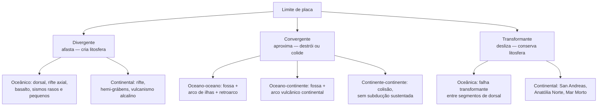

# Aula 04: Os limites de placa: divergentes, convergentes e transformantes

**ID:** geologia-gemologia-m02-a04
**Módulo:** [[02-sistema-terra-tectonica-modulo|Módulo 02 — Sistema Terra: estrutura interna e tectônica de placas]]
**Duração estimada:** ~30 min
**Objetivo:** identificar os três tipos de limite de placa e reconhecer suas feições geológicas e geofísicas características, sem ainda explicar o que os move.
**Pré-requisito:** Aulas 01–03 deste módulo (sismologia e o modelo em camadas; espalhamento do assoalho oceânico e anomalias magnéticas simétricas; falha transformante de Wilson; placas como corpos rígidos girando em torno de polos de Euler).

## Ao final você vai conseguir

- [OA-03a] Explicar por que "borda de placa" e "borda de continente" são coisas diferentes, com a margem brasileira como caso central.
- [OA-03b] Reconhecer as feições de um limite divergente, oceânico e continental, e explicar o contraste entre dorsal lenta e dorsal rápida.
- [OA-03c] Reconhecer as três configurações de limite convergente, descrever a anatomia de uma zona de subducção e explicar corretamente a origem do magma de arco.
- [OA-03d] Descrever a geometria de um limite transformante, oceânico e continental, incluindo a lógica contraintuitiva do movimento ativo entre segmentos de dorsal.

## Conteúdo

### O mosaico atual: quantas placas existem, afinal

A litosfera terrestre está fragmentada num mosaico de placas rígidas que se deslocam umas em relação às outras, empurrando, afastando-se ou deslizando lateralmente. As sete maiores, por área, são geralmente listadas como: **Pacífica**, **Norte-Americana**, **Sul-Americana**, **Africana**, **Euroasiática**, **Indo-Australiana** e **Antártica**.

Duas dessas sete já não são tão simples quanto parecem. A placa **Africana** é hoje frequentemente subdividida em **Núbia** (a maior parte, a oeste) e **Somália** (a leste, separando-se ao longo do Rift do Leste Africano — o próprio objeto de estudo mais adiante nesta aula). A placa **Indo-Australiana** é, de modo semelhante, tratada por muitos autores como duas placas distintas, **Indiana** e **Australiana**, que colidem e se deformam ao longo de uma zona de fronteira difusa no oceano Índico, em vez de se comportarem como um corpo único e rígido.

Além dessas sete (ou nove, a depender do critério), existe um conjunto de **placas menores**, mas geologicamente muito relevantes — **Nazca**, **Cocos**, **Caribe**, **Arábica**, **Filipinas**, **Juan de Fuca**, **Scotia** — e um número maior ainda de **microplacas**, fragmentos pequenos presos entre placas maiores, comuns em zonas de deformação complexa.

Vale registrar de saída: **o número de placas não é uma constante da natureza**. Ele depende do critério adotado (o que conta como "rígido o bastante" para ser uma placa própria, e não apenas uma zona de deformação difusa dentro de outra) e da resolução do modelo geodésico usado para medir os movimentos. Modelos clássicos citam algo entre doze e quinze placas principais; modelos mais recentes, que incorporam dados de GPS de alta precisão, já reconhecem dezenas de blocos com comportamento cinemático distinto. Trate qualquer número fixo como uma simplificação didática, não como um fato imutável.

**O ponto mais importante desta seção, e um dos mais importantes da aula inteira:** a borda de uma placa não é a borda de um continente. A placa **Sul-Americana**, por exemplo, não termina na costa do Brasil — ela inclui o continente sul-americano inteiro *e* aproximadamente metade do oceano Atlântico Sul, até chegar à Dorsal Mesoatlântica, que é o verdadeiro limite (divergente) daquele lado. A margem brasileira — a linha onde o continente encontra o oceano — é uma **margem passiva**: uma cicatriz geológica antiga, formada quando o supercontinente se rompeu e o Atlântico Sul começou a se abrir, mas que hoje está inteiramente **dentro** da placa Sul-Americana, longe de qualquer limite ativo. Ela não é sísmica nem vulcanicamente ativa pelo mesmo motivo que o meio de uma placa, de modo geral, não é: não há ali um limite de placa gerando ou consumindo litosfera. Essa distinção — margem passiva dentro da placa versus limite ativo entre placas — é a chave para entender por que o Brasil tem sismicidade tão baixa comparado ao Chile ou ao Japão, tema que a Aula 06 deste módulo vai desenvolver.

### Limite divergente: onde a litosfera se afasta

Num limite divergente, duas placas se afastam uma da outra e litosfera nova é criada para preencher o espaço, por resfriamento de magma que sobe do manto.

**Divergência oceânica: a dorsal meso-oceânica.** É a manifestação mais extensa deste tipo de limite — uma cordilheira submarina contínua de cerca de 65 mil km, atravessando todos os oceanos. No eixo da dorsal existe um **vale de rifte axial**, uma depressão alongada onde a extensão ativa está ocorrendo; ao longo dele, **vulcanismo basáltico** (a mesma composição química discutida na aula sobre espalhamento do assoalho oceânico) alimenta a formação de crosta oceânica nova. Os sismos associados são **rasos** (concentrados nos primeiros quilômetros de profundidade, coerente com uma litosfera ainda fina e quente ali) e de **pequena magnitude**, porque a rocha ali é dúctil demais, aquecida demais, para acumular grande tensão elástica antes de romper. A crosta formada no eixo é, por definição, a mais **nova** que existe em qualquer ponto do oceano — e envelhece, engrossa e esfria à medida que se afasta do eixo, exatamente como visto na aula anterior sobre as faixas magnéticas simétricas. Um efeito notável dessa história térmica é a **batimetria**: o eixo da dorsal é topograficamente alto (frequentemente a poucos milhares de metros da superfície, contra profundidades muito maiores nas bacias oceânicas mais antigas), não porque haja uma "montanha" construída por acúmulo de material, mas por **flutuabilidade térmica** — rocha quente é menos densa e ocupa mais volume, então a litosfera jovem "flutua" mais alto sobre a astenosfera; à medida que esfria e engrossa, afunda gradualmente, um processo bem descrito por modelos de subsidência térmica.

Nem toda dorsal tem a mesma cara, e o contraste é didático. A **Dorsal Mesoatlântica** é o exemplo clássico de **espalhamento lento** — taxa total de abertura da ordem de **2 a 5 cm/ano** — e seu perfil morfológico mostra um vale de rifte axial profundo e pronunciado, com relevo acidentado, falhado, muitas vezes com vários quilômetros de desnível entre o piso do vale e as bordas elevadas. A **Dorsal do Pacífico Leste**, em contraste, é o exemplo clássico de **espalhamento rápido** — taxa total chegando a até **15 cm/ano** em alguns segmentos — e tem um perfil suave, abaulado, sem um vale de rifte marcado. O mecanismo por trás desse contraste é um balanço entre **suprimento magmático** e **resfriamento associado à extensão**: numa dorsal rápida, a extensão puxa material tão depressa que a câmara magmática é continuamente realimentada e a crosta nova se forma antes que a rocha tenha tempo de esfriar e fraturar em blocos escalonados — o resultado é um perfil suave, quase sempre com uma câmara magmática rasa e ativa sob o eixo. Numa dorsal lenta, a taxa de extensão supera a taxa de suprimento magmático; o espaço aberto é preenchido por falhamento normal em blocos (formando o relevo acidentado) tanto quanto por magma novo, e frequentemente até por afloramento de rocha mantélica exposta diretamente no fundo do vale.

**Divergência continental: o rifte.** Quando a divergência começa dentro de um continente, e não já num oceano, o resultado é um **rifte continental** — uma faixa de extensão crustal com afinamento progressivo da litosfera. O **Rift do Leste Africano** é o exemplo de manual de um rifte em estágio **inicial**: a crosta continental ainda está inteira, mas se estirando, com feições características como **hemi-grábens** (blocos falhados assimetricamente rebaixados), **vulcanismo alcalino e basáltico** disperso ao longo do vale, **lagos alongados** ocupando as depressões (como os grandes lagos do rift, alinhados ao longo da fenda), e **alto fluxo de calor**, refletindo a litosfera afinada e a proximidade de magma. O **Mar Vermelho** e o **Golfo de Áden**, ao norte desse mesmo sistema, representam o estágio **seguinte**: a ruptura continental já ocorreu, e um mar estreito de crosta oceânica jovem já está se formando entre as margens continentais que se separam. A sequência evolutiva completa — rifte continental → mar estreito com crosta oceânica incipiente → oceano maduro com dorsal ativa (como o Atlântico) → margem passiva, quando a divergência migra para longe e a antiga borda fraturada vira interior estável de placa — é o roteiro pelo qual, provavelmente, o próprio Atlântico Sul e a margem brasileira se formaram, há dezenas de milhões de anos.

### Limite convergente: onde a litosfera se destrói (ou colide)

Num limite convergente, duas placas se aproximam. O que acontece depende de qual litosfera está de cada lado, porque densidade decide o desfecho.

**Oceano–oceano.** Quando duas litosferas oceânicas convergem, a mais **velha e densa** — lembrando que a litosfera oceânica esfria, engrossa e fica mais densa com a idade — mergulha sob a outra, num processo chamado **subducção**. A superfície marca uma **fossa** oceânica, a feição mais profunda do assoalho oceânico naquele trecho; sobre a placa que não subducta, o magma gerado pela subducção (mecanismo explicado adiante) constrói um **arco de ilhas vulcânico**, uma cadeia curva de vulcões emergindo do mar; e entre o arco e a placa mais distante, frequentemente se forma uma **bacia de retroarco**, uma depressão com crosta própria, às vezes até com sua própria extensão ativa. O exemplo mais citado é o sistema das **Marianas**, no Pacífico ocidental, onde a **fossa das Marianas** contém o **Challenger Deep**, o ponto mais profundo já documentado dos oceanos, com profundidade da ordem de **~10.900 m** (valor aproximado — medições de expedições recentes variam entre cerca de 10.900 e 10.935 m, e o número exato segue sendo refinado). Outros exemplos do mesmo tipo de limite: **Aleutas**, **Tonga**, e o próprio arco do **Japão** (que também tem trechos oceano–continente, sendo um sistema geologicamente complexo).

**Oceano–continente.** Quando uma litosfera oceânica converge contra uma continental, é sempre a **oceânica** que subducta — ela é sistematicamente mais densa que a crosta continental, que é leve demais para afundar de forma sustentada. O resultado morfológico é semelhante ao caso anterior — fossa, magmatismo — mas o arco vulcânico se forma **sobre crosta continental**, e por isso é chamado de **arco vulcânico continental**, dando origem a um **orógeno de arco** (uma cadeia de montanhas construída, em parte, por vulcanismo e deformação associados à subducção). O exemplo clássico é a cordilheira dos **Andes**, resultado da subducção da placa de **Nazca** sob a placa **Sul-Americana**. É esse mesmo sistema de subducção, com a placa de Nazca mergulhando continuamente, que produz os grandes terremotos históricos do **Chile** e do **Peru** — entre os maiores já registrados por instrumentos no planeta.

**Continente–continente.** Quando duas litosferas continentais convergem — geralmente porque um oceano interposto foi inteiramente consumido por subducção antes — nenhuma das duas subducta de forma sustentada, porque a **crosta continental é leve demais**: sua flutuabilidade a impede de mergulhar fundo no manto denso, mesmo sob grande força de convergência. O resultado, em vez de subducção contínua, é **colisão**: espessamento crustal, encurtamento horizontal absorvido por dobras e falhas de cavalgamento (empurrando fatias de crosta umas sobre as outras), e a elevação de um planalto. O exemplo de manual é o **Himalaia** e o **Planalto Tibetano**, produtos da colisão entre a placa **Indiana** e a placa **Euroasiática**, em curso há dezenas de milhões de anos. O detalhamento de como esse tipo de colisão constrói uma cadeia de montanhas — a orogênese propriamente dita — é assunto do módulo 19; a mecânica do encurtamento e do cavalgamento, com suas estruturas específicas, é assunto do módulo 18. Aqui, o que importa fixar é apenas o desfecho geométrico: convergência continente–continente termina em colisão, não em subducção sustentada.

**Anatomia de uma zona de subducção.** Vale a pena montar o quadro completo, porque é a assinatura que permite reconhecer esse tipo de limite a partir de dados indiretos — e é exatamente o que o exemplo trabalhado desta aula vai pedir. Do oceano em direção ao continente (ou ao outro lado da subducção):

- A **fossa**, onde a placa que mergulha começa a curvar-se para baixo.
- O **prisma acrecionário**, uma cunha de sedimentos raspados da placa que subducta e empilhados contra a placa superior — como a neve empurrada por um arado.
- A **bacia de antearco**, uma depressão entre o prisma acrecionário e o arco vulcânico.
- O **arco vulcânico**, a uma distância horizontal da fossa que é razoavelmente constante nos diferentes sistemas de subducção do planeta — tipicamente da ordem de uma a duas centenas de quilômetros, embora varie com o ângulo de mergulho (ver adiante).
- A **bacia de retroarco**, do outro lado do arco, às vezes com extensão própria.
- E, em profundidade, a **zona de Wadati–Benioff**: o plano inclinado de **hipocentros** sísmicos que acompanha a placa subductada, desde a fossa até profundidades de até cerca de **700 km**. Essa faixa de terremotos é a evidência sismológica direta de que existe, ali, uma placa fria e rígida mergulhando através do manto — sem essa "trilha" de sismos, a inferência de subducção teria que se apoiar só em morfologia de superfície.

O **ângulo de mergulho** da placa subductada não é fixo — varia de sistema para sistema, e até dentro de um mesmo sistema. Um caso notável é a **subducção plana** (*flat slab*), observada em trechos dos Andes centrais, onde a placa de Nazca mergulha num ângulo muito raso em vez do ângulo médio típico. Nesses trechos, o arco vulcânico ativo **desaparece**, porque a placa fria permanece raso demais e longe demais do manto quente por tempo suficiente para não gerar o magmatismo que sustentaria vulcões — um exemplo direto de como a geometria da subducção controla, ponto a ponto, se há ou não vulcanismo de arco.

**Por que o arco tem vulcão — e o erro clássico a corrigir.** É tentador imaginar que o calor do magma vem do **atrito** entre as duas placas raspando uma na outra — a ideia é intuitiva, mas está errada, e vale corrigi-la de vez. O mecanismo real é outro: a placa que subducta carrega **minerais hidratados** (que incorporaram água em sua estrutura cristalina quando a crosta oceânica ainda estava no fundo do mar, alterada quimicamente pela água do mar). Conforme a placa mergulha, pressão e temperatura crescentes fazem esses minerais **desidratar**, liberando água para dentro da cunha de manto logo acima. Essa água **reduz o ponto de fusão** do manto sobrejacente — um efeito químico bem conhecido, análogo a como sal reduz o ponto de fusão do gelo — e é esse abaixamento do ponto de fusão, e não um aumento de temperatura por atrito, que provoca a fusão parcial do manto e alimenta o vulcanismo do arco. O nome técnico para esse mecanismo é **fusão por adição de fluidos** (em inglês, *flux melting*). O detalhamento de como esse magma sobe, se modifica e erupte é assunto dos módulos 07 (rochas ígneas) e 11 (vulcanologia); aqui, o que importa é gravar o mecanismo certo no lugar do errado.

### Limite transformante: onde a litosfera desliza

Num limite transformante, duas placas se movem **paralelamente** uma à outra, ao longo de uma falha essencialmente vertical. Litosfera **não é criada nem destruída** — apenas transferida lateralmente de um lado para o outro da falha. Os sismos são **rasos** (a deformação se concentra nos primeiros quilômetros, onde a rocha é rígida o bastante para romper de forma frágil), mas, diferente do limite divergente, podem ser **de grande magnitude**, porque a rocha fria e rígida ao longo de boa parte desses limites acumula tensão elástica considerável antes de romper. O vulcanismo é **escasso a ausente**, já que não há geração sistemática de magma associada a esse tipo de movimento.

**Transformantes oceânicas: a sacada de Wilson.** A manifestação mais comum deste tipo de limite no oceano são as **falhas transformantes** que deslocam segmentos sucessivos de uma dorsal meso-oceânica — lembrando que as dorsais não são linhas retas contínuas, mas séries de segmentos desalinhados, conectados por essas falhas. Aqui está o ponto mais sutil e mais valioso da aula, a contribuição de J. Tuson Wilson que já apareceu na aula anterior: o **movimento relativo ativo** entre as duas placas ocorre **apenas no trecho da falha situado entre os dois segmentos de dorsal** — e, nesse trecho, o sentido do deslizamento é **oposto** ao que a geometria do deslocamento aparente da dorsal sugeriria à primeira vista.

Vale desenrolar isso com cuidado, porque é contraintuitivo. Imagine uma dorsal cujo eixo está deslocado lateralmente por uma falha — como se alguém tivesse cortado uma régua reta e empurrado uma metade para o lado. Olhando só para esse deslocamento aparente, a intuição diz que a falha se comporta como uma falha transcorrente comum, deslizando num sentido consistente com "puxar" os dois pedaços de volta ao alinhamento. Mas não é isso que acontece fisicamente. Nos dois segmentos de dorsal, a litosfera está se afastando do eixo **em ambas as direções**, simetricamente, dos dois lados de cada segmento. No trecho da falha situado **entre** os dois segmentos, portanto, o material de um lado está se afastando de seu próprio eixo (indo em direção ao trecho da falha), e o material do outro lado também está se afastando do seu próprio eixo, na direção **oposta** — o que faz os dois lados da falha, naquele trecho específico, se moverem em sentidos opostos um ao outro, exatamente o inverso do que pareceria numa falha transcorrente comum interpretando só o deslocamento visual da dorsal. Fora desse trecho ativo — isto é, ao longo do prolongamento da falha para além de cada segmento de dorsal — os dois lados estão se movendo **juntos**, na mesma direção e à mesma velocidade (afinal, ambos já se afastaram do respectivo eixo há mais tempo e estão presos à mesma placa que se resfria em conjunto); ali não há movimento relativo, e a estrutura, embora ainda visível na batimetria como uma cicatriz linear, é uma **zona de fratura inativa**, não mais um limite de placa funcional. Foi justamente essa distinção — entre o trecho ativo (verdadeiro limite transformante) e o prolongamento inativo (zona de fratura) — que permitiu reconhecer a falha transformante como um terceiro tipo fundamental de limite de placa, e não como uma falha comum deslocando uma feição geológica qualquer.

**Transformantes continentais.** Quando esse tipo de limite atravessa crosta continental, o resultado são algumas das falhas mais estudadas e mais monitoradas do planeta: a **Falha de San Andreas**, na Califórnia, marcando o limite entre a placa **Pacífica** e a placa **Norte-Americana**; a **Falha do Norte da Anatólia**, na Turquia; a **Falha Alpina**, na Nova Zelândia; e a **Falha do Mar Morto**, no Oriente Médio. Todas compartilham a assinatura básica do limite transformante — movimento lateral, sismos rasos que podem ser muito destrutivos, vulcanismo escasso — mas, por atravessarem crosta continental heterogênea, frequentemente exibem geometria mais complexa que o caso oceânico idealizado, com segmentos que se ramificam, curvam e interagem com outras estruturas.

### Junções tríplices, em um parágrafo

Onde três placas se encontram, o ponto de encontro é chamado de **junção tríplice**, e pode envolver qualquer combinação dos três tipos de limite já descritos (por exemplo, três limites divergentes, ou uma mistura de divergente, convergente e transformante). Um exemplo clássico é a **junção tríplice de Afar**, no Chifre da África, onde o Rift do Leste Africano, o Mar Vermelho e o Golfo de Áden se encontram — um raro ponto na superfície terrestre onde três braços de rifte divergente se juntam e onde, não coincidentemente, o continente está se rompendo de forma particularmente ativa. Nem toda configuração geométrica de junção tríplice é **estável** ao longo do tempo geológico — algumas combinações de tipos de limite e de geometria evoluem inevitavelmente para outra configuração, enquanto outras podem persistir por dezenas de milhões de anos. A análise da estabilidade das junções tríplices, com seu tratamento geométrico formal, é assunto do módulo 19.

### Organizando os três tipos

*Figura: os três tipos de limite e suas duas subdivisões principais — a árvore organiza o vocabulário desta aula, não substitui a leitura do texto.*

| Tipo de limite | Movimento relativo | Litosfera | Feições típicas | Profundidade dos sismos | Vulcanismo | Exemplo |
|---|---|---|---|---|---|---|
| Divergente | Afastamento | Criada | Dorsal/rifte, vale axial, hemi-grábens | Rasa | Basáltico, alcalino (continental) | Dorsal Mesoatlântica; Rift do Leste Africano |
| Convergente | Aproximação | Destruída (subducção) ou nenhuma criação/destruição líquida (colisão) | Fossa, arco vulcânico, prisma acrecionário, orógeno | Rasa a profunda (até ~700 km, Wadati–Benioff) | Andesítico/arco (subducção); ausente (colisão) | Andes (Nazca–Sul-Americana); Himalaia (Índia–Eurásia) |
| Transformante | Lateral (paralelo ao limite) | Conservada | Falha linear, zona de fratura (trecho inativo) | Rasa, podendo ser de grande magnitude | Escasso a ausente | San Andreas (Pacífica–Norte-Americana) |

## Exemplo trabalhado

**O problema.** Uma equipe entrega um conjunto de observações de uma região oceânica, sem dizer de antemão que tipo de limite de placa é. As observações são:

1. Batimetria mostra uma depressão linear e estreita, atingindo profundidade muito maior que o fundo oceânico ao redor.
2. Paralela a essa depressão, a cerca de 200–300 km de distância, existe uma cadeia de ilhas vulcânicas.
3. Os hipocentros de terremotos na região, quando plotados por profundidade, formam um **plano inclinado**: rasos perto da depressão, progressivamente mais profundos à medida que se afastam dela, até algumas centenas de quilômetros de profundidade.
4. O fluxo de calor medido no fundo do mar é **baixo** do lado da depressão, e **alto** sob a cadeia de ilhas.
5. Não há crosta continental em nenhum dos dois lados — ambos os lados são assoalho oceânico.

Que tipo de limite é esse, e qual é o sentido do mergulho?

**Passo 1 — eliminar o limite divergente.** Um limite divergente teria batimetria **alta** no eixo (por flutuabilidade térmica, como visto nesta aula), não uma depressão profunda; teria sismos concentrados numa faixa estreita e rasa, não um plano inclinado que se aprofunda progressivamente; e teria fluxo de calor **alto** em toda a zona ativa, não a assimetria observada aqui. As observações 1, 3 e 4 já eliminam essa hipótese.

**Passo 2 — eliminar o limite transformante.** Um limite transformante não produziria uma cadeia de vulcões paralela e sistemática — o vulcanismo ali é escasso a ausente, por não haver o mecanismo de fusão por fluidos que gera magma de arco. Também não produziria um plano inclinado de hipocentros descendo progressivamente: os sismos transformantes se concentram rasos, ao longo da própria falha, sem essa geometria em profundidade. As observações 2 e 3 eliminam essa hipótese.

**Passo 3 — eliminar a colisão continente–continente.** A observação 5 é decisiva aqui: colisão continente–continente exige crosta continental dos dois lados, e a espessa deformação resultante (cavalgamentos, espessamento crustal) não corresponde a uma depressão batimétrica linear e profunda como a observada. Como ambos os lados são oceânicos, essa hipótese está descartada de saída.

**Passo 4 — confirmar subducção oceano–oceano.** Sobra exatamente a assinatura descrita na seção "Anatomia de uma zona de subducção": depressão linear e profunda = **fossa**; cadeia de ilhas vulcânicas paralela, a uma distância da ordem de uma a duas centenas de quilômetros = **arco de ilhas**; plano inclinado de hipocentros progressivamente mais profundos = **zona de Wadati–Benioff**, a trilha sísmica da placa fria mergulhando; fluxo de calor baixo do lado da fossa (litosfera fria descendo) e alto sob o arco (magma subindo por fusão de fluidos) = a assinatura térmica esperada dos dois lados de uma subducção. É subducção **oceano–oceano**.

**Passo 5 — o sentido do mergulho.** O sentido em que os hipocentros se **aprofundam** é o sentido em que a placa mergulha: como eles ficam mais profundos à medida que se afastam da fossa, em direção ao arco de ilhas, a placa que subducta está descendo **da fossa em direção ao arco**, por baixo dele — não o contrário. É essa mesma lógica, aplicada a dados reais, que permite a sismólogos determinar de que lado a placa está mergulhando em qualquer sistema de subducção do planeta, mesmo sem nenhuma amostra de rocha em profundidade.

**Passo 6 — estimar o ângulo de mergulho.** Suponha que os dados de hipocentros permitam extrair dois pontos representativos do plano inclinado: a 100 km de distância horizontal da fossa, os sismos ocorrem a 100 km de profundidade; a 400 km de distância horizontal, ocorrem a 500 km de profundidade. O ângulo médio de mergulho, θ, é dado por:

tan(θ) = Δprofundidade / Δdistância horizontal = (500 − 100) / (400 − 100) = 400 / 300 ≈ 1,333

θ = arctan(1,333) ≈ **53°**

Conferindo: tan(53°) ≈ 1,327, e tan(53,13°) ≈ 1,333 — a conta fecha, dentro do arredondamento. Um ângulo médio de mergulho de aproximadamente 53° está dentro da faixa típica observada em zonas de subducção reais (que vão de mergulhos muito rasos, como no caso de subducção plana discutido nesta aula, até mergulhos íngremes, próximos da vertical, em sistemas mais maduros como partes do Pacífico ocidental).

## Erros comuns

- **Confundir borda de placa com borda de continente.** É sedutor porque a costa é a linha mais visível no mapa, e a intuição projeta a fronteira geopolítica/geográfica sobre a fronteira tectônica. Mas a placa Sul-Americana inclui o oceano Atlântico Sul inteiro até a Dorsal Mesoatlântica; a costa brasileira é uma margem passiva, dentro da placa, não um limite. Esse erro tem consequência prática direta: leva a esperar sismicidade e vulcanismo onde eles simplesmente não existem, por falta de um limite ativo ali.
- **Achar que o magma dos arcos vem do atrito da subducção.** É sedutor porque "duas placas raspando uma na outra" evoca calor por fricção, uma intuição mecânica cotidiana. O mecanismo real é a desidratação de minerais na placa que mergulha, liberando água que reduz o ponto de fusão do manto sobrejacente — fusão por adição de fluidos, não por aquecimento friccional.
- **Inverter o sentido do movimento na transformante oceânica.** É sedutor porque o deslocamento visual da dorsal parece, à primeira vista, indicar diretamente o sentido do deslizamento, como numa falha comum. Mas, no trecho ativo entre os dois segmentos de dorsal, o sentido real é o oposto do que essa leitura ingênua sugere — é preciso pensar em termos de para onde cada lado está se afastando do seu próprio eixo de espalhamento, não da geometria aparente do deslocamento.
- **Achar que há subducção sustentada de crosta continental na colisão continente–continente.** É sedutor porque subducção já foi apresentada como "o que acontece quando placas convergem", e a mente generaliza esse desfecho para todo tipo de convergência. Mas a crosta continental é leve demais para subductar de forma sustentada; o desfecho é colisão, espessamento e cavalgamento, não mergulho contínuo.
- **Tratar "o número de placas" como um fato fixo da natureza.** É sedutor porque listas numeradas parecem definitivas, e a maioria dos materiais introdutórios apresenta "sete placas principais" como se fosse uma contagem objetiva e encerrada. Na prática, o número depende de critério (o que conta como placa própria versus zona de deformação difusa) e de resolução do modelo geodésico — a Africana e a Indo-Australiana já são rotineiramente subdivididas em textos mais recentes.

## O que não concluir

- Que limites de placa são **linhas** finas e bem definidas no mapa. Na prática são **zonas** de largura variável — de poucos quilômetros em algumas transformantes oceânicas bem definidas, a centenas de quilômetros em regiões de deformação difusa, como o próprio limite entre as placas Indiana e Australiana no oceano Índico.
- Que as placas são corpos **perfeitamente rígidos**, sem deformação nenhuma no interior. Deformação intraplaca é real, ainda que muito menor que nas bordas — sismos ocasionais no interior de placas (inclusive no Brasil, dentro da margem passiva discutida nesta aula) são evidência direta disso, e serão retomados na Aula 06.
- Que a classificação em três tipos puros — divergente, convergente, transformante — descreve todo limite real com exatidão. É um modelo idealizado; muitos limites reais são **oblíquos**, combinando componentes de dois tipos ao mesmo tempo — **transpressão** (componente convergente mais transformante) ou **transtração** (componente divergente mais transformante) —, o que produz feições híbridas em vez do quadro puro apresentado aqui.
- Que a fossa e a profundidade máxima da zona de Wadati–Benioff (~700 km) e a distância fossa–arco são números fixos, iguais em todo sistema de subducção. São valores típicos e faixas de referência — cada sistema real tem sua própria geometria, moldada pelo ângulo de mergulho, pela idade e velocidade da placa que subducta, e por fatores locais ainda sob pesquisa.

## Recap relâmpago

- A litosfera está fragmentada num mosaico de placas cujo número exato (sete "principais", mais placas menores e microplacas) depende de critério e resolução — não é uma constante fixa.
- **Borda de placa ≠ borda de continente**: a placa Sul-Americana inclui o Atlântico Sul; a costa brasileira é margem passiva, dentro da placa, sem sismicidade ou vulcanismo de limite.
- **Divergente**: afasta, cria litosfera. Oceânico = dorsal com vale axial, basalto, sismos rasos pequenos; contraste dorsal lenta (Mesoatlântica, vale profundo) vs. rápida (Pacífico Leste, perfil suave). Continental = rifte (Leste Africano → Mar Vermelho/Áden → oceano → margem passiva).
- **Convergente**: aproxima. Oceano-oceano = fossa + arco de ilhas (Marianas); oceano-continente = fossa + arco continental (Andes/Nazca); continente-continente = colisão sem subducção sustentada (Himalaia). Anatomia: fossa, prisma acrecionário, antearco, arco, retroarco, zona de Wadati–Benioff até ~700 km.
- O magma de arco **não vem de atrito** — vem da desidratação da placa subductada, liberando água que reduz o ponto de fusão do manto (fusão por adição de fluidos).
- **Transformante**: desliza, conserva litosfera, sismos rasos que podem ser grandes, vulcanismo escasso. Na transformante oceânica, o movimento ativo só existe **entre** os dois segmentos de dorsal, em sentido oposto ao que a geometria aparente sugere; fora dali é zona de fratura inativa.
- Junções tríplices existem onde três limites se encontram (ex.: Afar) e nem toda configuração é estável — assunto do módulo 19.
- Nada disso ainda explica **o que move** as placas — isso é a próxima aula.

## Próxima aula

[[02-sistema-terra-tectonica-aula-05-motor-da-tectonica|Aula 05 — O motor da tectônica: convecção, ridge push e slab pull]], que enfrenta a pergunta que derrubou a proposta original de Wegener: identificado o mosaico e a geometria de cada tipo de limite, falta responder o que, fisicamente, faz as placas se mover.

## Fontes

- Limites de placa e feições associadas — [USGS, This Dynamic Earth](https://pubs.usgs.gov/gip/dynamic/dynamic.html), [Plate boundary (Wikipedia)](https://en.wikipedia.org/wiki/Plate_boundary)
- Dorsais meso-oceânicas, espalhamento lento vs. rápido — [NOAA Ocean Exploration, Mid-Ocean Ridges](https://oceanexplorer.noaa.gov/), [Mid-ocean ridge (Wikipedia)](https://en.wikipedia.org/wiki/Mid-ocean_ridge)
- Rifte continental e o Rift do Leste Africano — [East African Rift (Wikipedia)](https://en.wikipedia.org/wiki/East_African_Rift)
- Zonas de subducção, anatomia e Wadati–Benioff — [Subduction (Wikipedia)](https://en.wikipedia.org/wiki/Subduction), [Wadati–Benioff zone (Wikipedia)](https://en.wikipedia.org/wiki/Wadati%E2%80%93Benioff_zone), [OpenGeology — Historical Geology](https://opengeology.org/historicalgeology/)
- Fossa das Marianas e Challenger Deep — [Challenger Deep (Wikipedia)](https://en.wikipedia.org/wiki/Challenger_Deep)
- Falhas transformantes e a interpretação de Wilson — [Transform fault (Wikipedia)](https://en.wikipedia.org/wiki/Transform_fault)
- Junções tríplices e a de Afar — [Triple junction (Wikipedia)](https://en.wikipedia.org/wiki/Triple_junction), [Afar Triple Junction (Wikipedia)](https://en.wikipedia.org/wiki/Afar_Triple_Junction)

<!--
mapa_objetivo_secao:
  OA-03a: "O mosaico atual: quantas placas existem, afinal"
  OA-03b: "Limite divergente: onde a litosfera se afasta"
  OA-03c: "Limite convergente: onde a litosfera se destrói (ou colide)" + "Exemplo trabalhado"
  OA-03d: "Limite transformante: onde a litosfera desliza"

alegacoes_auditaveis:
  - claim_id: GEO-M02-A04-PLACAS-MAIORES-001
    claim: "As sete placas tectônicas maiores por área são Pacífica, Norte-Americana, Sul-Americana, Africana, Euroasiática, Indo-Australiana e Antártica; a Africana é frequentemente subdividida em Núbia e Somália, e a Indo-Australiana em Indiana e Australiana."
    risk: classificacao
    source: "USGS This Dynamic Earth; convenção amplamente adotada em textos introdutórios e em modelos cinemáticos recentes"
    confianca: alta
  - claim_id: GEO-M02-A04-PLACAS-MENORES-002
    claim: "Placas menores relevantes incluem Nazca, Cocos, Caribe, Arábica, Filipinas, Juan de Fuca e Scotia, além de microplacas."
    risk: classificacao
    source: "USGS This Dynamic Earth; nomenclatura padrão de placas tectônicas"
    confianca: alta
  - claim_id: GEO-M02-A04-NUMERO-PLACAS-003
    claim: "O número total de placas reconhecidas varia conforme critério e resolução do modelo cinemático (entre cerca de 12-15 em modelos clássicos e dezenas de blocos em modelos modernos de GPS)."
    risk: controverso
    source: "apresentado explicitamente como dependente de critério, não como valor fixo"
    confianca: media
  - claim_id: GEO-M02-A04-DORSAL-EXTENSAO-004
    claim: "O sistema de dorsais meso-oceânicas tem extensão total de cerca de 65 mil km."
    risk: numero
    source: "valor de referência padrão amplamente citado em oceanografia geológica"
    confianca: media
  - claim_id: GEO-M02-A04-DORSAL-LENTA-005
    claim: "A Dorsal Mesoatlântica tem taxa de espalhamento total da ordem de 2 a 5 cm/ano, com vale de rifte axial profundo característico de dorsal lenta."
    risk: numero
    source: "valores de referência padrão de tectônica de placas"
    confianca: alta
  - claim_id: GEO-M02-A04-DORSAL-RAPIDA-006
    claim: "A Dorsal do Pacífico Leste tem taxa de espalhamento total chegando a até cerca de 15 cm/ano em alguns segmentos, com perfil suave e sem vale de rifte marcado."
    risk: numero
    source: "valores de referência padrão de tectônica de placas"
    confianca: alta
  - claim_id: GEO-M02-A04-MARIANAS-007
    claim: "A fossa das Marianas contém o Challenger Deep, ponto mais profundo já documentado dos oceanos, com profundidade da ordem de ~10.900 m (medições recentes situam o valor entre ~10.900 e ~10.935 m)."
    risk: numero
    source: "Wikipedia/Challenger Deep; valor segue sendo refinado por expedições recentes"
    confianca: media
  - claim_id: GEO-M02-A04-WADATI-BENIOFF-PROFUNDIDADE-008
    claim: "A zona de Wadati-Benioff, o plano de hipocentros associado a uma placa em subducção, estende-se até profundidades de até cerca de 700 km."
    risk: numero
    source: "sismologia de subducção, valor padrão amplamente citado"
    confianca: alta
  - claim_id: GEO-M02-A04-DISTANCIA-FOSSA-ARCO-009
    claim: "A distância horizontal entre a fossa e o arco vulcânico ativo é tipicamente da ordem de uma a duas centenas de quilômetros, variando com o ângulo de mergulho da placa subductada."
    risk: numero
    source: "valor de referência padrão de sistemas de subducção; varia por sistema"
    confianca: media
  - claim_id: GEO-M02-A04-FLAT-SLAB-010
    claim: "Trechos dos Andes centrais apresentam subducção de ângulo raso (flat slab) da placa de Nazca, associados à ausência local de arco vulcânico ativo."
    risk: mecanismo
    source: "geologia regional dos Andes, consolidado na literatura de tectônica sul-americana"
    confianca: alta
  - claim_id: GEO-M02-A04-FLUX-MELTING-011
    claim: "O magma dos arcos vulcânicos de subducção se origina predominantemente por fusão por adição de fluidos (flux melting): desidratação de minerais hidratados na placa subductada, reduzindo o ponto de fusão do manto sobrejacente — não por atrito entre as placas."
    risk: mecanismo
    source: "petrologia ígnea consolidada; detalhamento nos módulos 07 e 11"
    confianca: alta
  - claim_id: GEO-M02-A04-WILSON-TRANSFORMANTE-012
    claim: "Em uma falha transformante oceânica que desloca segmentos de dorsal, o movimento relativo ativo ocorre apenas no trecho entre os dois segmentos de dorsal, em sentido oposto ao sugerido pelo deslocamento aparente da dorsal; fora desse trecho a estrutura é uma zona de fratura inativa."
    risk: mecanismo
    source: "interpretação de J. Tuzo Wilson (1965), consolidada na teoria de placas"
    confianca: alta
  - claim_id: GEO-M02-A04-TRANSFORMANTES-CONTINENTAIS-013
    claim: "Falha de San Andreas (Pacífica-Norte-Americana), Falha do Norte da Anatólia, Falha Alpina da Nova Zelândia e Falha do Mar Morto são exemplos de limites transformantes continentais."
    risk: classificacao
    source: "tectônica regional consolidada"
    confianca: alta
  - claim_id: GEO-M02-A04-MARGEM-PASSIVA-BRASIL-014
    claim: "A margem continental brasileira é uma margem passiva, situada dentro da placa Sul-Americana, e não corresponde a um limite de placa ativo."
    risk: classificacao
    source: "geologia regional consolidada; retomado com mais detalhe na Aula 06 deste módulo"
    confianca: alta
  - claim_id: GEO-M02-A04-AFAR-015
    claim: "A junção tríplice de Afar, no Chifre da África, reúne o Rift do Leste Africano, o Mar Vermelho e o Golfo de Áden."
    risk: classificacao
    source: "Wikipedia/Afar Triple Junction; geologia regional consolidada"
    confianca: alta
  - claim_id: GEO-M02-A04-EXEMPLO-ANGULO-016
    claim: "No exemplo trabalhado, com hipocentros a 100 km de profundidade a 100 km de distância horizontal da fossa e a 500 km de profundidade a 400 km de distância, o ângulo médio de mergulho calculado é de aproximadamente 53°."
    risk: numero
    source: "cálculo aritmético direto a partir dos valores hipotéticos do próprio exemplo, conferido no passo 6"
    confianca: alta
-->
