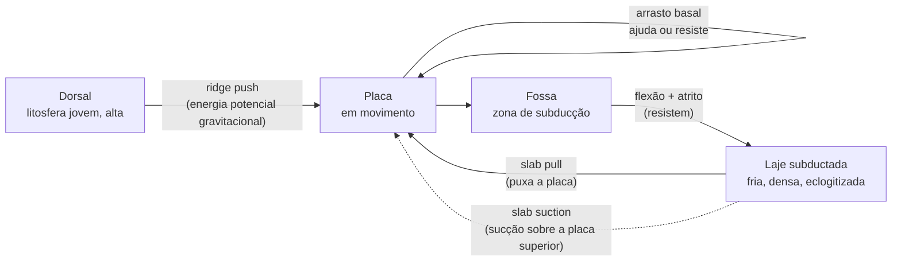

# Aula 05: O motor da tectônica — convecção, ridge push e slab pull

**ID:** geologia-gemologia-m02-a05
**Módulo:** [[02-sistema-terra-tectonica-modulo|Módulo 02 — Sistema Terra e tectônica]]
**Duração estimada:** ~30 min
**Objetivo:** explicar o que move as placas — o padrão de convecção do manto e as forças específicas que atuam sobre cada placa, com o peso relativo de cada uma.
**Pré-requisito:** Aulas 01–04 deste módulo (camadas numeradas e descontinuidade de 660 km; tomografia sísmica; os três tipos de limite de placa; anatomia da zona de subducção e zona de Wadati–Benioff).

## Ao final você vai conseguir

- [OA-04a] Explicar por que o manto sólido convecta e descrever, em termos conceituais, o que o número de Rayleigh mede.
- [OA-04b] Nomear e comparar as forças que atuam sobre uma placa tectônica, com sua ordem de grandeza relativa.
- [OA-04c] Argumentar, com a evidência de velocidade das placas, por que o slab pull é considerado a força dominante — e reconhecer o que ainda está em aberto na geometria da convecção e no papel das plumas.

## Conteúdo

### A dívida que esta aula fecha

Na Aula 01 você viu por que Wegener foi rejeitado por décadas: não pela deriva continental em si — o encaixe dos continentes e a distribuição de fósseis e climas antigos já eram sugestivos — mas porque ele não tinha um **mecanismo** com força suficiente. Harold Jeffreys, o crítico mais influente, calculou que as forças de maré e de rotação que Wegener invocava eram ordens de grandeza pequenas demais para arrastar continentes através de crosta oceânica rígida. A objeção era quantitativa, não sobre o padrão observado.

A tectônica de placas só se tornou consenso a partir de 1968, quando o mecanismo mudou de forma: não são forças externas empurrando continentes pela crosta, é o próprio sistema convectivo do manto que gera as placas e as move. Esta aula paga essa dívida — apresenta as forças que de fato movem uma placa, com magnitude real, e mostra por que a resposta certa exigiu trocar a pergunta.

### Por que um sólido convecta

Convecção é transporte de calor por movimento de massa: material aquecido, menos denso, sobe; material resfriado, mais denso, desce. Isso soa como descrição de um fluido — e o manto **é** sólido, na escala de tempo humana. A resolução, já vista na Aula 01 do módulo, é a fluência (*creep*): sob tensão sustentada por milhões de anos, os cristais do manto deformam por migração lenta de defeitos internos e de contornos de grão, sem fundir. Na escala de milhões de anos, o manto se comporta como um fluido extremamente viscoso.

A instabilidade que dispara a convecção é térmica. Se uma camada de material é aquecida por baixo (ou tem calor interno) e o gradiente de temperatura entre a base e o topo excede o que a condução pura consegue dissipar — excede o gradiente adiabático, que é o esperado só por compressão —, uma parcela quente na base fica leve o bastante para vencer a resistência viscosa e subir. O critério que formaliza essa competição é o **número de Rayleigh**: conceitualmente, é a razão entre o que impulsiona o movimento (o empuxo térmico, proporcional à diferença de temperatura, à expansão térmica e à gravidade) e o que resiste a ele (a viscosidade do material e a taxa com que o calor se difunde por condução, dissipando o próprio gradiente que gera o empuxo). Quando esse número ultrapassa um valor crítico, a condução pura deixa de ser suficiente e a convecção assume o transporte de calor.

Não é preciso reter a fórmula — o que importa reter é a lógica: quanto maior o Rayleigh, mais vigorosa e mais instável (mais próxima de um regime turbulento, em vez de células lentas e regulares) é a convecção. Estimativas para o manto terrestre colocam esse número na faixa de **10⁶ a 10⁸**, muito acima do limiar crítico — o manto convecta, e convecta de forma vigorosa, não marginal. A viscosidade que entra nesse cálculo é enorme para os padrões do dia a dia: da ordem de **10²¹ Pa·s** no manto (para comparação, a água tem viscosidade da ordem de 10⁻³ Pa·s). Esse valor não é uma constante única — varia com profundidade, temperatura e composição, e as estimativas para o manto inferior tendem a ser maiores que para o superior. É a partir dessa viscosidade gigantesca, e não apesar dela, que o Rayleigh do manto ainda dá vigoroso: a diferença de temperatura e a escala de comprimento envolvidas (milhares de quilômetros) são também gigantescas.

### Uma ou duas camadas de convecção? Um debate que ainda se resolve com dados novos

Você já viu, na Aula 03, a descontinuidade sísmica de 660 km, associada a uma transição de fase mineral no manto. Por décadas, uma questão central da geodinâmica foi se essa descontinuidade também separa **dois sistemas convectivos independentes** — um no manto superior, outro no inferior, cada um com sua própria circulação — ou se o manto convecta como **uma única camada**, com material cruzando os 660 km livremente.

A tomografia sísmica, ao permitir enxergar anomalias de velocidade em profundidade (temperatura e composição deixam assinatura na velocidade das ondas sísmicas), tem sido a linha de evidência mais direta. O quadro que emerge, hoje, é misto: em várias regiões, lajes subductadas frias são rastreáveis atravessando os 660 km e chegando até perto da base do manto, próximo ao limite manto-núcleo — o que favorece convecção de manto inteiro como padrão dominante. Ao mesmo tempo, a transição de 660 km claramente oferece **resistência real** à passagem de material: há lajes que se achatam e permanecem temporariamente estagnadas nessa profundidade antes de eventualmente afundar mais, um comportamento visível em várias regiões de subducção do Pacífico ocidental. Trate isto como conhecimento **em evolução**, não como um caso encerrado: o consenso atual pende para manto inteiro como quadro dominante, com estratificação parcial e temporária em certas regiões — não para um manto rigidamente dividido em duas caixas separadas.

### A virada conceitual: a placa não é passageira, é o motor

Aqui está o ponto que reorganiza tudo o que vem antes nesta aula, e que vale a pena isolar porque a intuição mais comum erra justamente aqui: **as placas não são continentes flutuando sobre células de convecção que as carregam como uma esteira rolante carrega uma caixa.**

O quadro que a geodinâmica moderna sustenta é o oposto em ênfase: a própria litosfera oceânica **é** o ramo superior, frio e rígido, do sistema convectivo do manto. Pense na convecção como um ciclo: material quente sobe na dorsal, se resfria ao longo do percurso, e eventualmente volta a descer. A litosfera oceânica é exatamente essa camada-limite térmica superior resfriada — a "pele" fria do sistema. À medida que ela se afasta da dorsal, envelhece, perde calor por condução para o oceano acima, e engrossa (o modelo de resfriamento de placa, que você vai encontrar formalizado no módulo 20, prevê esse engrossamento como função da raiz quadrada da idade). Engrossar e esfriar a torna, cedo ou tarde, **mais densa que a astenosfera abaixo dela** — e quando essa densidade excede a do manto subjacente, a placa não é mais estável em superfície: ela afunda, e isso é a subducção.

Dito de outro modo: a subducção não é algo que acontece **à** placa por causa da convecção — é a manifestação, na superfície, de uma instabilidade gravitacional que **é** o próprio processo convectivo. A tectônica de placas é o mesmo fenômeno da convecção interna do manto, só que visto de cima, com a camada-limite fria e rígida fragmentada em placas discretas em vez de formar uma camada contínua.

### As forças, uma a uma

Com esse quadro em mente, as "forças que movem as placas" deixam de ser uma lista solta e passam a ser componentes de um único sistema convectivo.

**Slab pull (puxão da laje).** A laje subductada — a porção da placa que já mergulhou no manto — está mais fria e mais densa que o manto ao redor, e esse excesso de densidade a puxa para baixo, como um peso preso a uma corrente puxando o resto da placa atrás de si. Esta é considerada, pela maioria das estimativas, **a força dominante** do sistema. Um reforço importante, e frequentemente esquecido: a densidade da laje não vem só de estar fria. Ao descer, a crosta oceânica basáltica (gabro, quimicamente) sofre uma **transformação de fase para eclogita**, uma rocha metamórfica ddessa mesma composição química porém com estrutura mineral muito mais densa (granada e piroxênio sódico no lugar dos minerais originais). Essa transformação aumenta consideravelmente a densidade da porção superior da laje, e é parte do motivo pelo qual o slab pull é forte o bastante para dominar o sistema. Estimativas quantitativas variam entre estudos e modelos, mas de forma recorrente colocam o slab pull como a maior força motora, tipicamente **algumas vezes maior** que o ridge push — uma faixa de proporção, não um número único e definitivo.

**Ridge push (empurrão da dorsal) — o nome que engana quase todo mundo.** A explicação intuitiva e errada é que a dorsal "empurra" a placa porque magma sobe e a pressiona lateralmente. Não é isso. O mecanismo real é **escorregamento gravitacional**: como acabamos de ver, a litosfera oceânica engrossa e afunda (topograficamente) com a idade, o que cria um desnível — a litosfera jovem na crista da dorsal está topograficamente mais alta que a litosfera mais velha e mais afastada. Esse relevo armazena energia potencial gravitacional, e a liberação dessa energia se manifesta como um empurrão distribuído ao longo de toda a placa, afastando-a da dorsal — parecido com uma pilha de livros ligeiramente inclinada que tende a escorregar, não com alguém empurrando a pilha por trás. Por isso a literatura moderna prefere o nome **força de energia potencial gravitacional da dorsal** ao termo tradicional "ridge push", que sugere empurrão ativo por pressão de magma. Vale reter: a fonte de energia é a mesma gravidade e o mesmo resfriamento que geram o slab pull, aplicados à outra ponta da placa.

**Basal drag / mantle drag (arrasto basal).** É o acoplamento viscoso entre a base da litosfera e a astenosfera em movimento logo abaixo. Se a astenosfera flui no mesmo sentido do movimento da placa e mais rápido que ela, o arrasto **ajuda**; se flui em sentido contrário ou mais devagar, o arrasto **resiste**. Como o padrão de fluxo da astenosfera sob cada placa não é bem conhecido em toda parte, esta é tratada como uma força de **sinal ambíguo** — não um motor confiável, mas um fator que modula os outros.

**Slab suction (sucção da laje).** O afundamento da laje induz um padrão de fluxo no manto ao redor dela, e esse fluxo pode, por sua vez, exercer uma sucção sobre a placa superior (a que não está subductando, do outro lado da fossa), puxando-a em direção à zona de subducção.

**Forças resistivas.** Nenhuma força motora atua sem oposição: a **flexão da laje** na fossa (dobrar litosfera rígida custa energia), o **atrito na interface de subducção** entre as duas placas em contato, e a **resistência viscosa do manto** ao movimento tanto da laje quanto da placa em superfície — o manto, afinal, tem viscosidade real e opõe resistência a qualquer coisa que se mova através dele.

*Figura: as forças atuam nas duas pontas da placa — empurrão distribuído na dorsal, puxão concentrado na laje — mais o arrasto basal, de sinal ambíguo, e as resistências na fossa. O slab pull, na maioria das estimativas, domina o balanço.*

### A evidência que decide a favor do slab pull

A comparação de forças em modelos é indireta — depende de parâmetros reológicos difíceis de medir diretamente. Mas há uma evidência observacional direta e relativamente simples: **a velocidade real das placas correlaciona com quanto de sua borda está em subducção.**

Placas com grande fração de sua borda subductando — Pacífica, Nazca, Cocos, Filipinas — movem-se consistentemente mais rápido, tipicamente na faixa de várias unidades a cerca de **10 cm/ano**. Placas com pouca ou nenhuma laje subductando presa a elas — Africana, Euroasiática, Norte-Americana, Antártica — movem-se consistentemente mais devagar, tipicamente na faixa de **1 a poucos cm/ano**. Essa correlação com o comprimento de borda em subducção é forte; a correlação com o comprimento de borda de dorsal (que seria a assinatura esperada se o ridge push dominasse) é fraca. Esse padrão, notado de forma sistemática desde os trabalhos clássicos de Forsyth e Uyeda no fim dos anos 1970, é o argumento observacional mais direto a favor do slab pull como força dominante — e é mais robusto do que qualquer estimativa isolada de magnitude de força, porque vem de medir o que as placas realmente fazem, não de modelar o que deveriam fazer.

### Plumas mantélicas e pontos quentes: um sistema à parte, e genuinamente controverso

Até aqui, tudo girou em torno do sistema de placas. Existe um segundo padrão de fluxo no manto, tratado como relativamente independente do primeiro: **plumas mantélicas**, colunas estreitas de material anomalamente quente que sobem através do manto e produzem vulcanismo mesmo no meio de uma placa, longe de qualquer limite — o chamado vulcanismo intraplaca. Havaí é o exemplo mais citado: fica no meio da Placa Pacífica, longe de qualquer dorsal ou fossa, e ainda assim é vulcanicamente ativo.

A assinatura mais usada para reconhecer um ponto quente é a **cadeia de ilhas com progressão etária**: se o ponto quente é relativamente estacionário e a placa se move sobre ele, cada vulcão se forma sobre o ponto quente, é carregado para longe pelo movimento da placa, torna-se extinto, e um novo vulcão se forma atrás dele. O resultado é uma cadeia linear de idades crescentes à medida que se afasta do vulcão ativo — exatamente o padrão da cadeia **Havaí–Imperador**, que muda de direção numa dobra pronunciada datada em torno de **47 milhões de anos**.

Dito isso, dois pontos aqui são genuinamente disputados, e é importante não apresentá-los como resolvidos:

- **A origem das plumas.** A hipótese clássica situa a origem na base do manto, no limite manto-núcleo, onde uma camada termicamente instável geraria colunas ascendentes profundas. Explicações concorrentes atribuem boa parte do vulcanismo intraplaca a processos muito mais rasos — fraturas e zonas de fraqueza na própria litosfera, ou heterogeneidade química no manto superior, sem exigir uma fonte profunda. Este é um debate ativo na literatura de geodinâmica (associado, entre outros, ao grupo que defende a origem profunda clássica e ao grupo, com G. R. Foulger como voz proeminente, cético quanto a essa origem para vários casos), não uma questão fechada.
- **A fixidez dos pontos quentes.** O modelo mais simples trata pontos quentes como referenciais fixos entre si, o que os tornaria um sistema de coordenadas conveniente para reconstruir o movimento absoluto das placas. Evidências mais recentes, incluindo reconstruções paleomagnéticas e comparações entre diferentes cadeias de ilhas, indicam que os pontos quentes **também se movem uns em relação aos outros**, ainda que de forma mais lenta que as placas. Isso complica, sem invalidar, o uso de trilhas de hotspot como referencial de movimento absoluto.

Este curso retoma plumas e pontos quentes com mais profundidade no módulo 11 (vulcanologia) e no módulo 19 (geodinâmica) — aqui, o ponto é reconhecer que existe um segundo motor, distinto do sistema placas-convecção-manto, e que partes centrais dele ainda estão em disputa.

### O balanço de energia por trás de tudo isso

Toda essa maquinaria é movida por calor saindo do interior da Terra. O fluxo de calor global — a taxa total com que a Terra perde calor pela superfície — é estimado em torno de **46 terawatts**, um valor aproximado e com incerteza real associada às diferentes compilações de medições regionais de fluxo de calor. Esse calor vem de duas fontes: **calor primordial residual**, sobrando da formação e diferenciação do planeta (vista no módulo 01), e **calor radiogênico**, gerado continuamente pelo decaimento de isótopos radioativos (principalmente urânio, tório e potássio) distribuídos no manto e na crosta.

A fração desse fluxo atribuível à produção radiogênica atual é chamada **razão de Urey**. Estimativas situam esse valor tipicamente entre **0,3 e 0,5** — ou seja, algo entre um terço e metade do calor que a Terra perde hoje estaria sendo reposto por decaimento radioativo em tempo real, com o restante vindo do estoque de calor primordial. Trate esse número como **mal restringido**, não como uma constante bem medida: depende de estimativas de abundância de elementos radioativos no manto profundo que são elas próprias incertas, e diferentes modelos geoquímicos chegam a valores distintos dentro dessa faixa.

A consequência qualitativa, porém, é sólida: como parte do calor perdido não está sendo totalmente reposto, **a Terra está esfriando lentamente** ao longo do tempo geológico. Isso tem uma implicação importante que o curso retoma no módulo 19: se o manto era mais quente no passado profundo, é razoável esperar que o próprio regime de tectônica de placas — velocidades, estilo de subducção, talvez até se placas rígidas como as de hoje sempre existiram — não tenha sido idêntico ao atual ao longo de toda a história da Terra.

## Exemplo trabalhado

**Pergunta.** Use a cadeia de ilhas vulcânicas Havaí–Imperador para estimar a velocidade da Placa Pacífica. Suponha uma distância aproximada de **2.600 km** entre o vulcão Kīlauea (ativo hoje, extremidade sudeste da cadeia) e um vulcão mais antigo da cadeia datado em aproximadamente **28 milhões de anos**. Depois, avalie criticamente o que esse cálculo pressupõe.

*Passo 1 — o modelo por trás do cálculo.* Se o ponto quente do Havaí for aproximadamente estacionário e a placa se move sobre ele em velocidade aproximadamente constante, a distância entre um vulcão extinto e o ponto quente atual (Kīlauea) equivale à distância percorrida pela placa desde que aquele vulcão se formou sobre o ponto quente. Velocidade é distância dividida por tempo.

*Passo 2 — o cálculo.* Velocidade = 2.600 km ÷ 28 Ma ≈ **92,9 km/Ma**.

*Passo 3 — conversão de unidade.* 1 km/Ma equivale a 0,1 cm/ano (porque 1 km = 100.000 cm e 1 Ma = 1.000.000 de anos, e 100.000 ÷ 1.000.000 = 0,1). Logo: 92,9 km/Ma × 0,1 ≈ **9,3 cm/ano**.

*Passo 4 — checagem de plausibilidade.* Esse valor cai dentro da faixa observada para a Placa Pacífica na seção de evidência empírica acima (várias unidades a cerca de 10 cm/ano) — o cálculo, com valores aproximados e declarados como tal, produz um número consistente com as medições reais de GPS/geodésia para essa placa.

*Passo 5 — o que este resultado pressupõe, e por que isso importa.* O cálculo carrega três suposições que precisam ficar explícitas:

- Que o ponto quente é **fixo** no manto — ou pelo menos estacionário o suficiente, na janela de tempo considerada, para servir de referência.
- Que a velocidade da placa foi **aproximadamente constante** ao longo de todo o intervalo de 28 milhões de anos — o que a linha reta do cálculo assume implicitamente.
- Que não houve **deriva própria do hotspot** significativa nesse intervalo, isto é, que o próprio ponto quente não se moveu de forma relevante em relação ao manto profundo enquanto a placa se movia sobre ele.

*Passo 6 — por que a dobra da cadeia complica isso.* A cadeia Havaí–Imperador não é uma linha reta: ela muda de direção numa dobra pronunciada por volta de 47 milhões de anos, passando de uma orientação aproximadamente norte-sul (segmento Imperador, mais antigo) para a orientação aproximadamente oeste-noroeste que continua até o Kīlauea (segmento Havaí, mais recente). Essa mudança de direção tem, na literatura, duas leituras concorrentes, e nenhuma das duas deve ser tratada aqui como estabelecida:

- **Mudança na direção de movimento da própria Placa Pacífica**, por volta de 47 Ma — a leitura tradicional, consistente com reorganizações de placas conhecidas por outras evidências nesse período.
- **Deriva do próprio ponto quente do Havaí** em relação a outros pontos quentes e ao manto profundo — uma leitura sustentada por reconstruções paleomagnéticas mais recentes, que sugerem que ao menos parte da dobra reflete o hotspot se movendo, não (ou não só) a placa mudando de direção.

O resultado prático: um número único de velocidade, como os 9,3 cm/ano calculados acima, é uma estimativa média razoável para um trecho recente e aproximadamente retilíneo da cadeia — mas tratar a trilha inteira como um registro simples e direto do movimento da placa, sem qualificação, ignora um debate real sobre o que, exatamente, essa trilha está registrando.

## Erros comuns

- **Imaginar células de convecção com as placas boiando passivamente em cima, como uma esteira rolante carregando uma caixa.** É o erro mais central da aula, e o mais intuitivo, porque "convecção move as placas" soa como se convecção e placa fossem coisas separadas. Elas não são: a placa **é** a camada-limite fria do próprio sistema convectivo, não uma carona.
- **Achar que ridge push é a dorsal empurrando por pressão de magma.** O nome sugere isso, e por isso o erro é tão comum mesmo em material didático. O mecanismo real é escorregamento gravitacional por causa do relevo criado pelo resfriamento e engrossamento da litosfera com a idade — a energia é potencial gravitacional, não pressão magmática.
- **Achar que o slab pull é só o peso morto de rocha fria afundando.** A rocha fria já seria mais densa por si só, mas a transformação do gabro basáltico em eclogita, durante a descida, aumenta consideravelmente essa densidade — é parte relevante do motivo do slab pull ser tão forte, e costuma ficar de fora de explicações simplificadas.
- **Tratar plumas mantélicas como fato consolidado, com origem profunda no limite manto-núcleo comprovada para todos os casos.** A cadeia Havaí–Imperador é uma evidência forte de *algum* processo de fonte relativamente estacionária, mas a origem profunda versus rasa de plumas específicas é debate ativo, não consenso fechado.
- **Achar que convecção do manto é convecção de líquido, como água fervendo numa panela.** O manto é sólido; ele convecta por fluência em escala de milhões de anos. Confundir os dois regimes leva a esperar velocidades e comportamentos completamente errados.
- **Achar que o número de Rayleigh alto do manto significa turbulência visível ou movimento rápido no sentido cotidiano.** "Vigoroso", aqui, é vigoroso na escala de tempo geológica — centímetros por ano, não metros por segundo.

## O que não concluir

- Que o balanço quantitativo exato entre slab pull, ridge push, basal drag e slab suction está fechado e é o mesmo para todas as placas. Ele é objeto ativo de modelagem numérica, depende de parâmetros reológicos difíceis de restringir, e provavelmente varia de placa para placa conforme a geometria de cada uma.
- Que a razão de Urey (~0,3–0,5) é uma constante bem medida. É uma estimativa mal restringida, sensível a modelos geoquímicos de composição do manto profundo que ainda divergem entre si.
- Que os modelos de convecção do manto — geometria de uma ou duas camadas, velocidade, padrão de fluxo — são simulações diretas e sem ambiguidade. Eles dependem fortemente de parâmetros reológicos (viscosidade em função de profundidade, temperatura e tensão) que são incertos, e resultados diferentes de premissas diferentes coexistem na literatura.
- Que a origem das plumas mantélicas e a fixidez dos pontos quentes são questões resolvidas. Ambas são debates ativos, com evidências genuínas dos dois lados — tratá-las como fato fechado é o erro mais fácil de cometer ao simplificar este tema.
- Que a existência de forças bem nomeadas (ridge push, slab pull etc.) significa que cada uma atua de forma isolada e independente sobre uma placa real. Na prática, todas atuam simultaneamente sobre a mesma placa rígida, e o movimento observado é a resultante — as forças individuais raramente são medidas em isolamento, são inferidas.

## Recap relâmpago

- A rejeição de Wegener foi por falta de mecanismo com força suficiente; a tectônica de placas moderna resolve isso mostrando que a **própria placa é parte do sistema convectivo**, não uma passageira.
- O manto convecta em estado sólido, por fluência; o número de Rayleigh (conceitualmente, empuxo térmico sobre resistência viscosa e difusiva) do manto é da ordem de **10⁶–10⁸** — convecção vigorosa, com viscosidade de manto da ordem de **10²¹ Pa·s**.
- Convecção de manto inteiro é o quadro dominante atual, com resistência real e estagnação temporária de lajes na descontinuidade de **660 km** em algumas regiões — tema ainda em evolução.
- **Slab pull** (laje fria, densificada por transformação em eclogita) é a força dominante; **ridge push** é escorregamento gravitacional por relevo, não empurrão de magma; **basal drag** tem sinal ambíguo; **slab suction** e forças resistivas completam o quadro.
- A evidência decisiva: placas com muita borda em subducção se movem mais rápido (até ~10 cm/ano) que placas sem laje relevante (~1 a poucos cm/ano) — correlação forte com subducção, fraca com dorsal.
- **Plumas e pontos quentes** são um subsistema à parte, evidenciado por cadeias como Havaí–Imperador; origem profunda versus rasa e fixidez dos hotspots são debates ativos, não fatos fechados.
- Fluxo de calor global (~**46 TW**) vem de calor primordial e radiogênico; a razão de Urey (~0,3–0,5) é mal restringida; a Terra esfria lentamente, e o regime tectônico do passado pode não ter sido idêntico ao atual.

## Próxima aula

[[02-sistema-terra-tectonica-aula-06-sismos-vulcoes-relevo|Aula 06 — Tectônica na superfície: sismos, vulcões e relevo]], que leva o motor apresentado aqui até suas expressões observáveis na superfície.

## Fontes

- Convecção do manto, número de Rayleigh, viscosidade do manto — Turcotte & Schubert, *Geodynamics* (referência clássica de geodinâmica quantitativa); [Mantle convection (Wikipedia)](https://en.wikipedia.org/wiki/Mantle_convection)
- Forças que movem as placas (slab pull, ridge push, basal drag, slab suction) e suas magnitudes relativas — Conrad & Lithgow-Bertelloni, sobre o balanço de forças de placas; Forsyth & Uyeda (1975), sobre a correlação entre velocidade de placa e comprimento de borda subductante; [Plate tectonics — Forces (Wikipedia)](https://en.wikipedia.org/wiki/Plate_tectonics)
- Convecção de manto inteiro versus estratificada e evidência de tomografia sísmica — Tackley, sobre modelagem de convecção de manto inteiro; [Mantle plume (Wikipedia)](https://en.wikipedia.org/wiki/Mantle_plume)
- Debate sobre origem de plumas mantélicas — G. R. Foulger, trabalhos sobre hipóteses alternativas à origem profunda de plumas ("plate hypothesis")
- Cadeia Havaí–Imperador, progressão etária e a dobra de ~47 Ma — [Hawaiian–Emperor seamount chain (Wikipedia)](https://en.wikipedia.org/wiki/Hawaiian%E2%80%93Emperor_seamount_chain); USGS, recursos sobre o ponto quente do Havaí
- Movimento relativo entre pontos quentes — Torsvik e colaboradores, sobre reconstruções de movimento de hotspots
- Fluxo de calor global e razão de Urey — [Earth's internal heat budget (Wikipedia)](https://en.wikipedia.org/wiki/Earth%27s_internal_heat_budget)

<!--
mapa_objetivo_secao:
  OA-04a: "Por que um sólido convecta" + "Uma ou duas camadas de convecção?"
  OA-04b: "A virada conceitual: a placa não é passageira, é o motor" + "As forças, uma a uma"
  OA-04c: "A evidência que decide a favor do slab pull" + "Plumas mantélicas e pontos quentes" + "Exemplo trabalhado"

nota_auditoria: "Esta é a aula do módulo com maior densidade esperada de achados 🔵 (controvérsias de literatura genuínas, não defeitos de conteúdo) — geometria da convecção, origem e fixidez de plumas/hotspots, e balanço quantitativo exato de forças. Recomenda-se registrar essas três frentes em _contexto.md como pendências a retomar nos módulos 11, 19 e 20, seguindo o padrão já usado para o M01."

alegacoes_auditaveis:
  - claim_id: GEO-M02-A05-JEFFREYS-001
    claim: "A objeção de Jeffreys à deriva continental de Wegener era sobre a magnitude insuficiente das forças propostas (maré e rotação), não sobre o padrão observado."
    risk: mecanismo
    source: "história da geologia; consolidado"
    confianca: alta
  - claim_id: GEO-M02-A05-1968-002
    claim: "A tectônica de placas se estabeleceu como consenso científico a partir de 1968."
    risk: numero
    source: "história da geologia; data amplamente citada"
    confianca: alta
  - claim_id: GEO-M02-A05-RAYLEIGH-003
    claim: "O número de Rayleigh do manto terrestre é estimado da ordem de 10^6 a 10^8."
    risk: numero
    source: "Turcotte & Schubert, Geodynamics; ordem de grandeza padrão em geodinâmica"
    confianca: media
  - claim_id: GEO-M02-A05-VISCOSIDADE-004
    claim: "A viscosidade do manto é da ordem de 10^21 Pa·s, variando com profundidade."
    risk: numero
    source: "Turcotte & Schubert; valor de referência padrão em geodinâmica"
    confianca: media
  - claim_id: GEO-M02-A05-660KM-GEOMETRIA-005
    claim: "A geometria da convecção do manto (camada única vs. estratificada em 660 km) é objeto de debate ativo; tomografia atual favorece manto inteiro como quadro dominante, com estagnação temporária de lajes em algumas regiões."
    risk: controverso
    source: "tomografia sísmica; síntese de literatura de geodinâmica"
    confianca: media
  - claim_id: GEO-M02-A05-SLABPULL-DOMINANTE-006
    claim: "O slab pull é considerado, na maioria das estimativas, a força dominante sobre uma placa, tipicamente algumas vezes maior que o ridge push."
    risk: controverso
    source: "Conrad & Lithgow-Bertelloni; Forsyth & Uyeda 1975; faixa aproximada, não valor único consolidado"
    confianca: media
  - claim_id: GEO-M02-A05-ECLOGITA-007
    claim: "A transformação de fase do gabro basáltico da crosta oceânica subductada em eclogita aumenta significativamente a densidade da laje, reforçando o slab pull."
    risk: mecanismo
    source: "petrologia metamórfica; consolidado"
    confianca: alta
  - claim_id: GEO-M02-A05-RIDGEPUSH-NOME-008
    claim: "O 'ridge push' é escorregamento gravitacional por relevo da litosfera, não empurrão por pressão de magma; a literatura moderna prefere o termo 'força de energia potencial gravitacional da dorsal'."
    risk: mecanismo
    source: "geodinâmica de placas; consolidado, mas frequentemente mal ensinado"
    confianca: alta
  - claim_id: GEO-M02-A05-VELOCIDADE-RAPIDAS-009
    claim: "Placas com grande fração de borda subductante (Pacífica, Nazca, Cocos, Filipinas) movem-se tipicamente na faixa de várias unidades a ~10 cm/ano."
    risk: numero
    source: "Forsyth & Uyeda 1975; dados de geodésia/GPS modernos consistentes com a faixa"
    confianca: media
  - claim_id: GEO-M02-A05-VELOCIDADE-LENTAS-010
    claim: "Placas sem laje subductante significativa (Africana, Euroasiática, Norte-Americana, Antártica) movem-se tipicamente na faixa de 1 a poucos cm/ano."
    risk: numero
    source: "Forsyth & Uyeda 1975; dados de geodésia/GPS modernos consistentes com a faixa"
    confianca: media
  - claim_id: GEO-M02-A05-DOBRA-HEC-011
    claim: "A cadeia Havaí–Imperador apresenta uma dobra de direção datada em aproximadamente 47 milhões de anos."
    risk: numero
    source: "Wikipedia/Hawaiian–Emperor seamount chain; literatura de geocronologia de traços de hotspot"
    confianca: media
  - claim_id: GEO-M02-A05-PLUMAS-ORIGEM-012
    claim: "A origem das plumas mantélicas (profunda, no limite manto-núcleo, versus rasa, ligada a fraturas litosféricas e heterogeneidade do manto superior) é debate ativo e não resolvido."
    risk: controverso
    source: "G. R. Foulger e colaboradores (hipótese cética/rasa) versus modelo clássico de pluma profunda"
    confianca: media
  - claim_id: GEO-M02-A05-HOTSPOT-FIXIDEZ-013
    claim: "Pontos quentes não são referenciais perfeitamente fixos entre si; há evidência de movimento relativo entre eles."
    risk: controverso
    source: "Torsvik e colaboradores; reconstruções paleomagnéticas"
    confianca: media
  - claim_id: GEO-M02-A05-FLUXOCALOR-014
    claim: "O fluxo de calor global da Terra é estimado em torno de 46 terawatts, com incerteza."
    risk: numero
    source: "Wikipedia/Earth's internal heat budget; compilações de medições de fluxo de calor"
    confianca: media
  - claim_id: GEO-M02-A05-RAZAOUREY-015
    claim: "A razão de Urey (fração do fluxo de calor terrestre atribuível a produção radiogênica atual) é estimada entre aproximadamente 0,3 e 0,5, valor mal restringido."
    risk: controverso
    source: "geoquímica do manto; estimativas variam entre modelos composicionais"
    confianca: baixa
  - claim_id: GEO-M02-A05-EXEMPLO-VELOCIDADE-016
    claim: "Exemplo trabalhado: distância aproximada de 2.600 km e idade aproximada de 28 Ma entre Kīlauea e um vulcão mais antigo da cadeia Havaí-Imperador produzem uma velocidade estimada de ~92,9 km/Ma, equivalente a ~9,3 cm/ano — valores declarados como aproximados para fins didáticos, consistentes com a faixa real de velocidade da Placa Pacífica."
    risk: numero
    source: "valores aproximados construídos para o exemplo; ordem de grandeza consistente com literatura sobre a Placa Pacífica"
    confianca: media
-->
