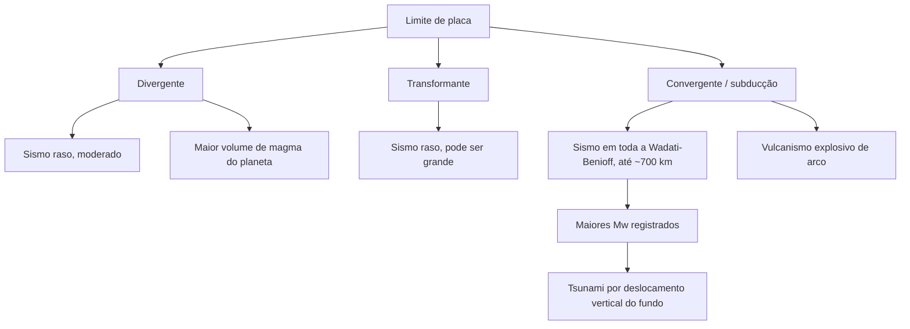

# Aula 06: Tectônica na superfície: sismos, vulcões e relevo

**ID:** geologia-gemologia-m02-a06
**Módulo:** [[02-sistema-terra-tectonica-modulo|Módulo 02 — Sistema Terra: estrutura interna e tectônica de placas]]
**Duração estimada:** ~30 min
**Objetivo:** relacionar a tectônica de placas às três expressões de superfície que ela produz — sismos, vulcões e relevo — e mostrar como a distribuição delas serve tanto de evidência histórica da teoria quanto de previsão atual.
**Pré-requisito:** Aulas 01–05 deste módulo (ondas P e S e localização de sismo; camadas com números; a revolução da tectônica; os três tipos de limite e a anatomia da subducção; o motor da tectônica). É a aula de fechamento do módulo.

## Ao final você vai conseguir

- [OA-05a] Explicar por que sismos e vulcões se concentram em faixas estreitas, e por que essas faixas às vezes se alargam.
- [OA-05b] Distinguir magnitude de intensidade, e explicar o que o momento sísmico mede fisicamente.
- [OA-05c] Associar assinatura sísmica e vulcânica a cada tipo de limite de placa, e situar corretamente os sismos intraplaca, inclusive os brasileiros.
- [OA-05d] Diferenciar previsão determinística de avaliação probabilística de perigo sísmico e de alerta precoce.
- [OA-05e] Explicar isostasia e subsidência térmica como os dois mecanismos que ligam tectônica a topografia.

## Conteúdo

### O mapa que desenhou as placas — e agora prevê

Em 1968, três sismólogos — Bryan Isacks, Jack Oliver e Lynn Sykes — publicaram um mapa que se tornaria um dos artigos mais citados da geofísica do século XX. Não inventaram uma teoria nova: plotaram décadas de hipocentros sísmicos e mostraram que eles não se espalham ao acaso pelo globo. Concentram-se em faixas estreitas e contínuas. Essas faixas, quando sobrepostas às cadeias vulcânicas e às dorsais, coincidiam exatamente com os limites de placa que a tectônica, ainda em consolidação naquele momento, propunha. A sismicidade global não era um detalhe secundário da teoria — foi uma das evidências que a fecharam.

Essa é a inversão lógica desta aula. Nas aulas anteriores, a distribuição de sismos e vulcões funcionou como **dado**: entrada bruta que ajudou a desenhar os limites de placa. Agora, com a teoria consolidada, ela vira **consequência**: dado o tipo de limite, é possível prever onde, com que profundidade e com que caráter esses fenômenos vão ocorrer. É o mesmo padrão de raciocínio da aula 01 — leitura de sismograma como inferência —, aplicado em escala global.

Onde essa correspondência falha, ela falha de um jeito instrutivo. Nas grandes zonas de colisão continental — Ásia central, ao redor da Placa Indiana empurrando contra a Eurasiática, e o cinturão que vai dos Alpes ao Mediterrâneo e ao Irã — a faixa sísmica não é estreita, é larga, com centenas a milhares de quilômetros de deformação difusa. A razão não contradiz a lógica de limite de placa: contradiz apenas a imagem de "limite = linha fina". Quando dois blocos continentais colidem, nenhum dos dois subducta com facilidade (a crosta continental é leve demais para isso), então a deformação se distribui por um cinturão inteiro de falhas, em vez de se concentrar numa única interface. A exceção confirma a regra: onde o limite é bem definido (oceano–oceano, oceano–continente), a faixa é estreita; onde o limite é "borrado" por colisão continental, a faixa se alarga proporcionalmente.

### Sismos — o mecanismo: rebote elástico

Por que a rocha se rompe de repente, produzindo um sismo, em vez de se deformar suavemente e continuamente? A resposta consolidada é a **teoria do rebote elástico**, proposta por Harry Fielding Reid a partir do estudo do terremoto de São Francisco de 1906.

Reid observou algo contraintuitivo: cercas, estradas e linhas de trem que cruzavam a falha de San Andreas estavam deslocadas — mas o deslocamento não apareceu de uma vez no dia do sismo. Comparando levantamentos topográficos de décadas antes com o pós-sismo, ele viu que o terreno vinha se deformando lentamente, ano após ano, muito antes da ruptura. O mecanismo que ele propôs tem três etapas:

1. **Acúmulo.** As duas margens da falha estão travadas por atrito, mas as placas continuam se movendo. A rocha ao redor da falha se deforma elasticamente — como uma régua sendo entortada —, acumulando energia de deformação por anos, décadas ou séculos.
2. **Ruptura.** Quando a tensão acumulada excede a resistência friccional da falha, ela cede. As duas margens escorregam repentinamente uma em relação à outra.
3. **Rebote.** Cada lado da falha volta elasticamente à sua forma não deformada — como a régua que se solta —, liberando de uma vez a energia acumulada ao longo de todo aquele tempo. Essa liberação súbita é o sismo.

Alguns termos ficam definidos aqui, para uso no resto da aula. O ponto onde a ruptura começa, em profundidade, é o **hipocentro** (ou **foco**). Sua projeção vertical até a superfície é o **epicentro** — o ponto normalmente citado nas notícias, mas que não é onde o sismo "aconteceu": é só a marca na superfície de onde ele aconteceu embaixo. A superfície ao longo da qual as rochas escorregam é o **plano de falha**, e o deslocamento relativo entre os dois lados é o **rejeito**. Depois do evento principal, o volume de rocha ao redor da ruptura continua ajustando tensões residuais, produzindo sismos menores chamados **réplicas**, que podem continuar por dias a meses.

### Medir sismo é medir duas coisas diferentes

Um erro extremamente comum — tratado à parte, adiante — é confundir duas grandezas que descrevem aspectos completamente diferentes do mesmo evento.

**Magnitude** é uma propriedade da **fonte**: quanta energia foi liberada na ruptura. Um sismo tem uma única magnitude (ou um pequeno conjunto de estimativas próximas, conforme o método), não importa de onde se meça.

**Intensidade** é uma propriedade do **efeito local**: o quanto se sentiu e o quanto se destruiu num ponto específico da superfície. A escala usual é a de **Mercalli modificada**, uma escala descritiva (baseada em observação de dano e percepção, não em instrumento), com graus geralmente de I a XII. A intensidade varia de lugar para lugar para o mesmo sismo — depende da distância ao epicentro, da profundidade do hipocentro, e criticamente do tipo de terreno: sedimento inconsolidado e solo mole **amplificam** o movimento sísmico em relação à rocha firme, porque a onda perde velocidade ao entrar num meio menos rígido e, para conservar energia, ganha amplitude. É por isso que bairros construídos sobre aterro ou sedimento de baía sofrem muito mais dano que bairros vizinhos sobre rocha, a distâncias epicentrais praticamente iguais.

A magnitude moderna de referência para sismos grandes é a **magnitude de momento (Mw)**, derivada do **momento sísmico** (M0), definido como:

**M0 = μ · A · d**

Cada termo tem um significado físico direto:
- **μ** (rigidez do material rochoso ao longo da falha, em pascals) — quão resistente à deformação é a rocha que rompeu;
- **A** (área da superfície de ruptura, em metros quadrados) — quanto do plano de falha efetivamente escorregou;
- **d** (deslocamento médio ao longo da falha, em metros) — o quanto os dois lados se moveram um em relação ao outro.

M0 é convertido para a escala Mw por uma fórmula logarítmica, de modo que a escala final se pareça numericamente com a Richter clássica em valores baixos e médios, mas continue válida — sem saturar — em valores altos.

E esse é o ponto histórico a esclarecer: a escala de Richter original, tecnicamente a **magnitude local (ML)**, foi desenvolvida em 1935 para sismos moderados da Califórnia, medida pela amplitude máxima registrada num sismógrafo padronizado a uma distância padronizada. Ela **satura** para eventos muito grandes — a partir de magnitude ~6,5–7, aumentos reais de energia liberada deixam de se refletir proporcionalmente no valor de ML, porque o método de amplitude simplesmente não consegue mais discriminar rupturas cada vez maiores. Por isso a sismologia profissional abandonou a Richter para os grandes eventos e usa Mw, calculada a partir do momento sísmico físico (μ·A·d), que não tem esse teto. A imprensa, por hábito, continua dizendo "escala Richter" para qualquer magnitude — é impreciso, mas difundido; o termo tecnicamente correto para os grandes sismos citados adiante é Mw.

A escala de magnitude é **logarítmica**, e vale registrar os dois números que traduzem isso em intuição:
- cada grau de magnitude a mais corresponde a **cerca de 10 vezes mais amplitude** de onda registrada no sismógrafo;
- e, como a energia liberada escala com a amplitude elevada a um expoente maior que 1, cada grau de magnitude corresponde a **cerca de 32 vezes mais energia liberada** (mais precisamente ≈31,6×, ou 10^1,5).

Ou seja: um sismo de magnitude 8 não é "o dobro" de um de magnitude 7 — libera cerca de 32 vezes mais energia.

### Sismos por tipo de limite: a assinatura de cada um

Cada tipo de limite de placa (aula 03) produz um padrão característico de profundidade e magnitude de sismo.

- **Divergente** (dorsais, riftes): sismos **rasos** (tipicamente até ~10–20 km), de magnitude **moderada**. A crosta ali é fina e está sendo esticada, não comprimida com grande área de ruptura acumulável.
- **Transformante**: sismos **rasos**, mas capazes de atingir magnitude **grande**, porque falhas transformantes maduras e longas (como San Andreas, na Califórnia, ou a falha da Anatólia do Norte, na Turquia) oferecem área de ruptura considerável ao longo de dezenas a centenas de quilômetros de comprimento de falha.
- **Convergente / subducção**: a única configuração capaz de produzir sismos ao longo de **toda a faixa de profundidade** da zona de Wadati–Benioff (aula 03), de rasos até cerca de **700 km**. E é a única capaz de gerar os **maiores terremotos já registrados**, porque a interface entre a placa em subducção e a placa superior oferece, de longe, a maior área de ruptura contínua disponível na tectônica — um plano quase horizontal que pode se estender por centenas de quilômetros ao longo do mergulho e milhares ao longo do arco. Voltando à fórmula do momento sísmico: magnitude gigantesca exige A gigantesco, e só a interface de subducção fornece essa área. Os três maiores sismos instrumentalmente registrados são todos eventos de subducção: **Valdivia (Chile), 1960, Mw ≈ 9,5** — o maior já registrado; **Sumatra–Andamão, 2004, Mw ≈ 9,1**; e **Tohoku (Japão), 2011, Mw ≈ 9,0**.
- **Tsunami**: gerado por deslocamento vertical súbito do assoalho oceânico, tipicamente associado a megassismos de subducção rasa — quando o fundo do mar sobe ou desce abruptamente numa área extensa, ele empurra toda a coluna de água acima, gerando uma onda de comprimento enorme que se propaga em todas as direções pelo oceano aberto. **Não** é gerado por "onda de calor" nem por tremor lateral de uma falha transformante (que desloca o fundo horizontalmente, sem empurrar a coluna d'água de forma eficiente) — daí por que tsunamis destrutivos de grande escala estão associados quase exclusivamente a zonas de subducção.
- **Intraplaca**: existem, e importam, mesmo longe de qualquer limite de placa. O caso mais citado nos Estados Unidos é a sequência de **Nova Madri**, de 1811–1812, no interior do continente norte-americano, longe de qualquer limite ativo — evidência de que tensões residuais e zonas de fraqueza antigas na crosta continental podem acumular e liberar energia sísmica significativa mesmo sem um limite de placa ativo por perto.

  O caso brasileiro segue a mesma lógica. O Brasil está situado no **interior da Placa Sul-Americana**, longe de qualquer limite ativo — e por isso tem sismicidade **baixa**, mas, novamente, "baixa" não é "zero". Dois exemplos frequentemente citados na literatura brasileira: o **sismo de João Câmara, no Rio Grande do Norte, em 1986**, com magnitude da ordem de **5** (valor de catálogo — trata-se de uma alegação auditável de confiança **média**, já que magnitudes de eventos mais antigos variam ligeiramente entre catálogos e métodos de reprocessamento); e o **evento da região de Mato Grosso, em 1955**, também com magnitude da ordem de **6**, igualmente um valor de catálogo a tratar com confiança média. O detalhamento da sismicidade brasileira — mecanismos, zonas mais ativas, redes de monitoramento — fica para o **módulo 26 (Geologia do Brasil)**; aqui a lição é apenas que sismicidade intraplaca baixa não significa ausência de risco.

### Previsão × previsibilidade: um parágrafo que precisa ser dito com exatidão

Este é o ponto do módulo em que a honestidade importa mais do que em qualquer outro, porque desinformação sobre risco sísmico causa dano real — tanto pelo pânico infundado quanto pela falsa sensação de segurança.

A ciência sismológica atual **não prevê terremotos de forma determinística**. Não existe método capaz de dizer, com utilidade operacional, "haverá um sismo de magnitude X no local Y na data Z". Décadas de tentativas — padrões de sismicidade precursora, comportamento animal, radônio, eletricidade atmosférica — não produziram um método validado e reprodutível de previsão de curto prazo.

O que existe, e funciona, é outra coisa, com outro nome: **avaliação probabilística de perigo sísmico**. A partir do histórico de sismos, da geometria de falhas conhecidas e de modelos estatísticos de recorrência, agências sismológicas estimam a **probabilidade** de um sismo de determinada magnitude ocorrer numa região, numa janela de tempo de décadas — não o evento específico. Essa avaliação alimenta o **zoneamento sísmico** e os **códigos construtivos** (que dizem, por região, quanto uma edificação precisa resistir), instrumentos que reduzem dano futuro sem prever o evento individual.

Existe também o **sistema de alerta precoce (early warning)**, que **não é previsão**: ele não antecipa que um sismo vai acontecer, detecta um sismo que **já começou**. O princípio explora diretamente o conceito da aula 01 — a onda P viaja mais rápido que a onda S e que as ondas de superfície, que são as mais destrutivas. Sensores próximos ao epicentro detectam a chegada da onda P, calculam magnitude e localização em segundos, e disparam um alerta que corre à velocidade de sinal eletrônico — muito mais rápido que a onda S se propagando pela rocha. O resultado é uma janela de **segundos a poucas dezenas de segundos** de aviso antes que o sacolejo forte chegue a uma cidade distante do epicentro — tempo suficiente para parar trens, abrir portas de elevador no andar mais próximo, ou simplesmente se abaixar e se proteger. É real, salva vidas, e não é previsão: é detecção rápida de um evento que já está em curso.

### Vulcões: três contextos, volumes muito diferentes

A distribuição de vulcões também segue os limites de placa, mas com uma assimetria de volume que surpreende a maioria das pessoas.

- **Dorsais meso-oceânicas**: produzem o **maior volume de magma do planeta**, de longe — mas quase todo ele submarino, ao longo da fenda que percorre as dorsais por dezenas de milhares de quilômetros, invisível ao público em geral e raramente noticiado. É vulcanismo contínuo, geralmente efusivo e não explosivo, formando nova crosta oceânica basáltica.
- **Arcos de subducção**: o exemplo mais conhecido é o **Anel de Fogo do Pacífico**, o cinturão de vulcões que circunda o oceano Pacífico ao longo de zonas de subducção. Os magmas gerados aqui tendem a ser mais **viscosos** e mais **ricos em voláteis** (água, sobretudo) do que os de dorsal, e por isso produzem erupções tipicamente mais **explosivas**. A origem desse magma já foi vista na aula 03: vem da **desidratação da laje em subducção**, que libera água para o manto acima e reduz seu ponto de fusão — **não** de atrito entre as placas (não voltamos a esse ponto aqui, apenas relembramos a conclusão).
- **Intraplaca**: **pontos quentes** (hotspots) ligados a plumas mantélicas — a cadeia Havaí–Imperador é o exemplo clássico —, e episódios ainda maiores de vulcanismo intraplaca chamados **grandes províncias ígneas**, que colocam volumes enormes de magma em intervalos geologicamente curtos.

A classificação detalhada de vulcões, os estilos eruptivos (efusivo, estromboliano, pliniano, entre outros) e a relação entre composição química e viscosidade do magma são o conteúdo do **módulo 11 (Vulcanologia)**; a petrologia dos magmas — como e onde exatamente eles se formam e evoluem — é o **módulo 07**. Aqui, o que importa reter é apenas a associação entre contexto tectônico e caráter do magma.

### Relevo — como a tectônica constrói topografia

A tectônica não só sacode e explode a superfície: também constrói e destrói o relevo em si, de várias maneiras distintas.

**Orógenos de colisão.** Quando dois blocos continentais colidem (nenhum subducta com facilidade, como visto acima), a crosta se **espessa** por empilhamento e dobramento. O caso extremo é o **Himalaia**, produto da colisão em curso entre a Placa Indiana e a Eurasiática, com o **Everest** no topo — **8.849 m** de altitude, valor da medição conjunta China–Nepal anunciada em 2020 (uma alegação auditável, dado o histórico de pequenas revisões desse número ao longo das décadas).

**Orógenos de arco.** Quando um oceano subducta sob uma margem continental, o soerguimento e o vulcanismo associado constroem uma cordilheira ao longo da margem — o caso dos **Andes**, ao longo de toda a costa oeste da América do Sul.

**Isostasia — o conceito central desta seção.** A litosfera **flutua** sobre a astenosfera dúctil (aula 02), em equilíbrio de empuxo — de modo semelhante a um iceberg flutuando na água: quanto mais alto acima da linha de flutuação, mais fundo o "casco" submerso precisa ir. Uma montanha alta exige, por baixo, uma **raiz crustal** proporcionalmente profunda — crosta espessa que afunda na astenosfera para sustentar o peso do relevo acima, exatamente a crosta continental espessa sob orógenos já mencionada na aula 02. Dois modelos clássicos formalizam essa ideia:

- **Modelo de Airy**: assume densidade **constante** para toda a crosta, e explica a topografia por **espessura variável** — montanhas têm raízes mais profundas simplesmente porque são blocos mais espessos do mesmo material, afundando mais na astenosfera.
- **Modelo de Pratt**: assume espessura de referência **constante**, e explica a topografia por **densidade variável** — blocos crustais menos densos flutuam mais alto, blocos mais densos ficam mais baixos, sem precisar de raízes profundas.

A demonstração mais direta e observável de que a isostasia é real, e não só um modelo teórico, é o **rebote pós-glacial**: regiões como a Escandinávia e partes do Canadá, que estiveram sob quilômetros de gelo durante a última glaciação, ainda hoje estão **soerguendo** — o manto, aliviado do peso da carga de gelo removida há milhares de anos, continua fluindo lentamente de volta e empurrando a crosta para cima. É a prova de que o manto responde, de forma mensurável, tanto a carga quanto a descarga de peso na superfície.

**Riftes e vales de rifte; escarpas de falha.** Onde a crosta se estica (limites divergentes ainda em fase continental, como o Vale do Rifte Africano), blocos afundam entre falhas normais, criando vales alongados com escarpas íngremes de cada lado.

**Fossas oceânicas.** A depressão mais profunda do assoalho oceânico marca justamente onde a placa em subducção começa a mergulhar — a fossa é a "dobradiça" visível da subducção na topografia submarina.

**Subsidência térmica.** Aqui está o segundo mecanismo (além da isostasia) que liga tectônica a topografia, e ele responde a uma pergunta simples: por que a dorsal meso-oceânica é rasa e a planície abissal, longe dela, é muito mais funda? A resposta **não é erosão** — o fundo do oceano não erode de forma relevante nessa escala. É **resfriamento**. Crosta oceânica recém-formada na dorsal está quente e, por isso, menos densa — flutua relativamente alto. Conforme essa crosta se afasta da dorsal (transportada pelo próprio movimento de placa) e envelhece, ela esfria, engrossa (a litosfera ganha espessura por baixo, à medida que mais manto esfria abaixo do limite reológico que a define) e fica progressivamente mais densa — logo, afunda mais na astenosfera. A profundidade do assoalho oceânico aumenta **aproximadamente com a raiz quadrada da idade da crosta**, uma relação bem estabelecida em geofísica marinha. É por isso que a dorsal é a feição mais rasa do fundo oceânico e a planície abissal, com crosta muito mais velha, é a mais funda.

**Margens passivas e o caso brasileiro.** Nem toda margem continental é um limite de placa ativo. A margem continental brasileira (já mencionada na aula 03 como o exemplo canônico de que a borda da placa não é a borda do continente) foi gerada pela **abertura do Atlântico Sul** — um processo de rifteamento que, uma vez concluído, deixou de ser um limite de placa ativo e passou a ser uma **margem passiva**: sem sismicidade de limite, sem vulcanismo de arco, mas com bacias sedimentares espessas acumuladas ao longo de dezenas de milhões de anos, que são hoje o alvo principal da geologia do petróleo no Brasil — tema dos **módulos 23 e 26**.

**Soerguimento × erosão, de novo.** Todo relevo tectônico está em disputa permanente com a erosão — a mesma tensão entre energia interna construtiva e energia externa destrutiva estabelecida no módulo 01. Uma cordilheira alta é o saldo instantâneo dessa disputa: enquanto o soerguimento (colisão, subducção, isostasia respondendo a espessamento) superar a taxa de erosão, a montanha cresce ou se mantém; onde a erosão já venceu há muito tempo, resta um cráton aplainado. Relevo tectônico nunca é um estado final — é um equilíbrio dinâmico, sempre em jogo.

### Tabela-síntese

| Tipo de limite | Sismicidade | Vulcanismo | Relevo típico | Exemplo |
|---|---|---|---|---|
| Divergente | Rasa, magnitude moderada | Maior volume do planeta, quase todo submarino | Dorsal meso-oceânica; rifte continental com escarpas | Dorsal Meso-Atlântica; Vale do Rifte Africano |
| Transformante | Rasa, pode ser grande | Ausente ou desprezível | Vale linear ao longo da falha | San Andreas (Califórnia); Anatólia do Norte (Turquia) |
| Convergente/subducção | Toda a faixa de profundidade (Wadati–Benioff, até ~700 km); os maiores sismos e tsunamis | Arco vulcânico explosivo | Orógeno de arco; fossa oceânica | Chile 1960 (Mw≈9,5); Andes; Anel de Fogo |
| Colisão continental | Cinturão largo e difuso | Escasso (pouca subducção efetiva) | Orógeno de colisão, crosta espessada, isostasia | Himalaia/Everest |
| Intraplaca | Baixa, mas não nula | Pontos quentes, grandes províncias ígneas | Variável; cadeias de ilhas vulcânicas | Nova Madri (EUA); João Câmara (Brasil); Havaí |
| Margem passiva (sem limite ativo) | Muito baixa | Ausente | Bacia sedimentar sobre subsidência térmica | Margem brasileira, Atlântico Sul |

*Figura: da esquerda para a direita, o tipo de limite determina a assinatura sísmica e vulcânica; note que só a subducção acumula profundidade e área de ruptura suficientes para gerar os maiores terremotos e os tsunamis mais destrutivos.*

## Exemplo trabalhado

**Pergunta.** Um catálogo geológico traz os seguintes dados de uma margem continental hipotética: (1) uma fossa oceânica profunda, correndo paralela à costa; (2) hipocentros de sismos que se tornam progressivamente mais profundos à medida que se afastam da fossa em direção ao continente, chegando a várias centenas de quilômetros de profundidade; (3) uma cordilheira com vulcões ativos, situada a algumas centenas de quilômetros da fossa, do lado continental; (4) registro histórico de megassismos seguidos de tsunami; (5) crosta continental anomalamente espessa sob a cordilheira. Reconstrua o que está acontecendo ali.

*Passo 1 — identificar o tipo de limite e o sentido do mergulho.* A combinação de fossa + hipocentros que se aprofundam sistematicamente para o interior do continente é a assinatura da **zona de Wadati–Benioff** (aula 03): só ocorre onde uma placa mergulha sob outra. Como a profundidade cresce **em direção ao continente**, a laje está mergulhando **para baixo do continente** — é um limite **convergente do tipo oceano–continente**, com subducção da placa oceânica.

*Passo 2 — estimar o ângulo médio de mergulho.* Se os hipocentros vão de próximo da superfície, junto à fossa, até, digamos, 300 km de profundidade a uma distância horizontal de 300 km da fossa (valores ilustrativos, coerentes com a ordem de grandeza do enunciado), a geometria aproximada é um triângulo retângulo com cateto vertical de 300 km e cateto horizontal de 300 km. O ângulo de mergulho médio θ satisfaz tan θ = profundidade/distância horizontal = 300/300 = 1, logo **θ ≈ 45°** — um mergulho moderado a íngreme, consistente com muitas zonas de subducção reais (que variam tipicamente entre ~30° e ~60°).

*Passo 3 — por que essa configuração, e não uma transformante ou uma dorsal, gera Mw acima de 9.* Pela fórmula M0 = μ·A·d, magnitude gigante exige área de ruptura (A) gigante. Uma falha transformante rompe ao longo de uma superfície essencialmente vertical e estreita; uma dorsal rompe segmentos curtos entre offsets. Só a interface de subducção — um plano de baixo ângulo que pode se estender por centenas de quilômetros ao longo do mergulho e milhares ao longo do arco — oferece área suficiente para que A cresça o bastante e produza M0 (e, portanto, Mw) na faixa de 9. É exatamente a configuração de Valdivia 1960, Sumatra 2004 e Tohoku 2011.

*Passo 4 — por que a cordilheira é alta.* O vulcanismo de arco constrói relevo por acúmulo de material extrusivo, mas o dado (5) — crosta continental anomalamente espessa sob a cordilheira — aponta para o mecanismo dominante: **espessamento crustal** somado a **isostasia**. Uma crosta mais espessa é menos densa em bloco relativo ao manto abaixo e precisa de uma raiz profunda para flutuar em equilíbrio (modelo de Airy); a raiz sustenta a elevação da superfície. É a mesma lógica do Himalaia, aqui aplicada a um orógeno de arco em vez de colisão continental.

*Passo 5 — a assinatura, se o mesmo limite fosse oceano–oceano.* Trocando a placa superior de continental para oceânica, o padrão de hipocentros ao longo da Wadati–Benioff se mantém (é uma propriedade da subducção, não do tipo de placa superior), assim como a capacidade de gerar megassismos e tsunami. Mudam duas coisas: em vez de uma cordilheira continental, forma-se um **arco de ilhas vulcânicas** (como o arco das Marianas ou das Aleutas); e, sem crosta continental espessa para servir de raiz isostática, não há orógeno soerguido comparável — a topografia fica concentrada na fossa (extremamente profunda) e nas ilhas vulcânicas do arco, sem a grande cadeia montanhosa continental.

## Erros comuns

- **Confundir magnitude com intensidade.** Magnitude é uma propriedade única do sismo, medida na fonte; intensidade varia de lugar para lugar, e depende de distância, profundidade e tipo de terreno. Um sismo de magnitude moderada, raso e próximo à superfície, sob terreno de sedimento mole, pode ter intensidade local maior que um sismo de magnitude bem mais alta, porém profundo e distante.
- **Chamar toda magnitude sísmica de "escala Richter".** A escala de Richter (ML) satura para eventos grandes e foi abandonada pela sismologia profissional em favor da magnitude de momento (Mw) para os grandes sismos — inclusive todos os citados nesta aula. O hábito da imprensa de dizer "Richter" persiste, mas é impreciso.
- **Achar que existe previsão determinística de terremotos, ou confundir alerta precoce com previsão.** Não existe método validado que diga onde, quando e de que tamanho será o próximo sismo. O que existe é avaliação probabilística de perigo (para zoneamento e construção) e alerta precoce (detecção de um sismo já em curso, usando a diferença de velocidade P–S) — nenhum dos dois é previsão.
- **Achar que o Brasil não tem sismos.** Sismicidade baixa não é sismicidade nula. João Câmara (RN, 1986) e o evento de Mato Grosso (1955) são exemplos documentados de sismos intraplaca no território brasileiro.
- **Achar que a planície abissal é funda por erosão, e não por subsidência térmica.** O fundo oceânico não erode de forma relevante nessa escala; ele afunda porque a crosta oceânica esfria, engrossa e fica mais densa com a idade, aproximadamente com a raiz quadrada do tempo desde sua formação na dorsal.
- **Achar que tsunami é causado pelo tremor lateral de uma falha.** Tsunamis destrutivos de grande escala exigem deslocamento **vertical** súbito do fundo oceânico, capaz de empurrar toda a coluna d'água acima — por isso estão associados quase exclusivamente a megassismos de subducção, e não a falhas transformantes, que deslocam o terreno predominantemente na horizontal.

## O que não concluir

- Que todo sismo destrutivo tem magnitude alta. Um sismo de magnitude moderada, mas raso, próximo a uma cidade e sob terreno de amplificação (sedimento mole), pode causar dano severo — e um sismo de magnitude alta, mas profundo ou distante do que se povoa, pode passar quase despercebido. Profundidade, distância e tipo de terreno mandam tanto quanto a magnitude na conta final de dano.
- Que existe uma correspondência um-para-um perfeita entre tipo de limite e feição de relevo/sismicidade. A tabela-síntese desta aula é uma idealização didática útil; o mundo real tem limites oblíquos, transtensivos, transpressivos, e orógenos com histórias tectônicas compostas (colisão seguida de subducção, por exemplo) que misturam assinaturas.
- Que sismos intraplaca são bem compreendidos. Ao contrário dos sismos de limite de placa, cujo mecanismo (rebote elástico sobre um limite ativo, conhecido) é relativamente claro, os mecanismos exatos que acumulam e liberam tensão em sismos intraplaca — longe de qualquer limite ativo, como Nova Madri ou os eventos brasileiros — permanecem, em boa parte, mal compreendidos, e são objeto de pesquisa ativa.
- Que a avaliação probabilística de perigo sísmico é "quase uma previsão", só menos precisa. São categorias diferentes de afirmação: previsão diz respeito a um evento específico; avaliação de perigo é uma estimativa estatística de longo prazo sobre uma região. Tratar a segunda como uma versão fraca da primeira é o mesmo erro conceitual, só que atenuado.
- Que a altura do Everest, ou qualquer medição de relevo, é um número fixo e definitivo. Medições de altitude são refinadas com nova tecnologia (a medição conjunta China–Nepal de 2020 revisou o valor aceito anteriormente) — o relevo tectônico também está, ele mesmo, em lento movimento vertical contínuo.

## Recap relâmpago

- A distribuição global de sismos e vulcões **foi a evidência** que ajudou a desenhar os limites de placa (Isacks, Oliver & Sykes, 1968); com a teoria consolidada, ela vira **previsão**. Cinturões largos (Ásia central, Mediterrâneo) marcam colisão continental com deformação distribuída — exceção que confirma a regra.
- Sismo: **rebote elástico** (Reid, 1906) — acúmulo de deformação elástica, ruptura, rebote. **Hipocentro/foco** (em profundidade) × **epicentro** (projeção na superfície). Plano de falha, rejeito, réplicas.
- **Magnitude** (fonte, única) ≠ **intensidade** (efeito local, varia com distância/profundidade/terreno, escala Mercalli modificada). **Mw** (de M0 = μ·A·d) substitui a **Richter (ML)**, que satura em eventos grandes. Escala logarítmica: **~10× amplitude** e **~32× energia** por grau.
- Assinatura por limite: divergente (raso, moderado); transformante (raso, pode ser grande); subducção (toda a Wadati–Benioff até ~700 km, os maiores Mw e os tsunamis — Chile 1960 Mw≈9,5, Sumatra 2004 Mw≈9,1, Tohoku 2011 Mw≈9,0). Intraplaca existe e importa: Nova Madri (EUA); João Câmara-RN 1986 e Mato Grosso 1955 no Brasil (sismicidade baixa, não nula; detalhe no módulo 26).
- **Não há previsão determinística** de terremotos. Existem: avaliação probabilística de perigo sísmico, zoneamento, códigos construtivos, e **alerta precoce** (usa Δt P–S da aula 01) — nenhum deles prevê o evento, apenas gerencia o risco ou detecta o que já começou.
- Vulcões: dorsal (maior volume, submarino), arco de subducção (explosivo, Anel de Fogo — fusão por desidratação da laje, módulo 07/11 para detalhe), intraplaca (pontos quentes, grandes províncias ígneas).
- Relevo: orógenos de colisão (Himalaia/Everest) e de arco (Andes) por espessamento crustal; **isostasia** (Airy: espessura variável; Pratt: densidade variável) sustenta a raiz sob montanhas, demonstrada pelo rebote pós-glacial; **subsidência térmica** (não erosão) explica por que a dorsal é rasa e a planície abissal é funda, com profundidade crescendo com a raiz quadrada da idade da crosta; margem brasileira é passiva, gerada pela abertura do Atlântico Sul, hoje alvo da geologia do petróleo (módulos 23/26).
- Tudo isso é, de novo, **energia interna construtiva × energia externa destrutiva** (módulo 01): soerguimento contra erosão, sempre em disputa.

## Próxima aula

Este é o fim do conteúdo do Módulo 02. Segue o [[02-sistema-terra-tectonica-questionario-final|Questionário final do módulo 02]], que integra as seis aulas — da sismologia interna à tectônica de superfície. Depois, o curso avança para o [[03-tempo-geologico-geocronologia-modulo|Módulo 03 — Tempo geológico e geocronologia]], que troca o "onde e como" pelo "quando": aprofunda a geocronologia relativa e absoluta já introduzidas de passagem (aulas 02 e 04 do módulo 01) e ensina os métodos de datação radiométrica que dão números às idades citadas ao longo deste módulo.

## Fontes

- USGS Earthquake Hazards Program — magnitude, intensidade, escala de Mercalli modificada, e os maiores terremotos registrados (Valdivia 1960, Sumatra 2004, Tohoku 2011)
- USGS — "Earthquake Early Warning" (ShakeAlert) — princípio de funcionamento do alerta precoce
- Smithsonian Institution — Global Volcanism Program — distribuição e contextos tectônicos de vulcões
- Isacks, B., Oliver, J., Sykes, L. R. (1968), "Seismology and the new global tectonics", *Journal of Geophysical Research* — o artigo que correlacionou sismicidade global aos limites de placa
- Reid, H. F. (1910), relatório da comissão estadual sobre o terremoto de São Francisco de 1906 — origem da teoria do rebote elástico
- Centro de Sismologia da USP (IAG-USP) — sismicidade intraplaca no Brasil, incluindo João Câmara (RN, 1986) e o evento de Mato Grosso (1955)
- China–Nepal, anúncio conjunto de 2020 — nova medição oficial da altitude do Everest (8.849 m)
- Wikipedia (inglês) — "Isostasy", "Post-glacial rebound", "Thermal subsidence" — para os modelos de Airy e Pratt e a relação profundidade–idade do assoalho oceânico

<!--
mapa_objetivo_secao:
  OA-05a: "O mapa que desenhou as placas — e agora prevê"
  OA-05b: "Medir sismo é medir duas coisas diferentes"
  OA-05c: "Sismos por tipo de limite" + "Vulcões" + "Exemplo trabalhado"
  OA-05d: "Previsão × previsibilidade"
  OA-05e: "Relevo — como a tectônica constrói topografia"

alegacoes_auditaveis:
  - claim_id: GEO-M02-A06-ISACKS-1968-001
    claim: "Isacks, Oliver e Sykes publicaram em 1968 'Seismology and the new global tectonics', correlacionando a distribuição global de sismos aos limites de placa."
    risk: data
    source: "Journal of Geophysical Research, 1968"
    confianca: alta
  - claim_id: GEO-M02-A06-REBOTE-ELASTICO-002
    claim: "H. F. Reid propôs a teoria do rebote elástico a partir do estudo do terremoto de São Francisco de 1906."
    risk: nomenclatura
    source: "relatório da comissão estadual, 1910"
    confianca: alta
  - claim_id: GEO-M02-A06-MOMENTO-SISMICO-003
    claim: "M0 = μ·A·d (rigidez × área de ruptura × deslocamento médio) é a definição do momento sísmico, base da magnitude de momento (Mw)."
    risk: numero
    source: "sismologia padrão; USGS"
    confianca: alta
  - claim_id: GEO-M02-A06-RICHTER-SATURACAO-004
    claim: "A escala de Richter (ML) satura para eventos grandes (a partir de aproximadamente magnitude 6,5-7) e por isso não é usada para os maiores sismos, sendo substituída por Mw."
    risk: numero
    source: "USGS Earthquake Hazards Program"
    confianca: alta
  - claim_id: GEO-M02-A06-ESCALA-LOG-005
    claim: "Cada grau de magnitude corresponde a aproximadamente 10x mais amplitude de onda e aproximadamente 32x (10^1,5) mais energia liberada."
    risk: numero
    source: "cálculo direto da definição logarítmica da escala de magnitude; USGS"
    confianca: alta
  - claim_id: GEO-M02-A06-VALDIVIA-1960-006
    claim: "O terremoto de Valdivia, Chile, em 1960, teve Mw ≈ 9,5, o maior sismo instrumentalmente registrado."
    risk: numero
    source: "USGS Earthquake Hazards Program"
    confianca: alta
  - claim_id: GEO-M02-A06-SUMATRA-2004-007
    claim: "O terremoto de Sumatra-Andamão, em 2004, teve Mw ≈ 9,1."
    risk: numero
    source: "USGS Earthquake Hazards Program"
    confianca: alta
  - claim_id: GEO-M02-A06-TOHOKU-2011-008
    claim: "O terremoto de Tohoku, Japão, em 2011, teve Mw ≈ 9,0."
    risk: numero
    source: "USGS Earthquake Hazards Program"
    confianca: alta
  - claim_id: GEO-M02-A06-WADATI-BENIOFF-PROF-009
    claim: "A zona de Wadati-Benioff, em zonas de subducção, estende-se até profundidades de aproximadamente 700 km."
    risk: numero
    source: "consolidado em sismologia; ver também aula 03 deste módulo"
    confianca: alta
  - claim_id: GEO-M02-A06-NOVA-MADRI-010
    claim: "A sequência de sismos de Nova Madri, no interior dos EUA, ocorreu entre 1811 e 1812, exemplo de sismicidade intraplaca longe de limites ativos."
    risk: data
    source: "USGS"
    confianca: alta
  - claim_id: GEO-M02-A06-JOAO-CAMARA-011
    claim: "O sismo de João Câmara, Rio Grande do Norte, em 1986, teve magnitude da ordem de 5 (valor de catálogo)."
    risk: numero
    source: "Centro de Sismologia da USP; valores variam ligeiramente entre catálogos"
    confianca: media
  - claim_id: GEO-M02-A06-MATO-GROSSO-1955-012
    claim: "O evento sísmico da região de Mato Grosso, em 1955, teve magnitude da ordem de 6 (valor de catálogo)."
    risk: numero
    source: "Centro de Sismologia da USP; valores variam ligeiramente entre catálogos"
    confianca: media
  - claim_id: GEO-M02-A06-EVEREST-2020-013
    claim: "A altitude oficial do Monte Everest, segundo a medição conjunta China-Nepal anunciada em 2020, é de 8.849 m."
    risk: numero
    source: "anúncio conjunto China-Nepal, dezembro de 2020"
    confianca: alta
  - claim_id: GEO-M02-A06-SUBSIDENCIA-TERMICA-014
    claim: "A profundidade do assoalho oceânico aumenta aproximadamente com a raiz quadrada da idade da crosta, por resfriamento e espessamento da litosfera, não por erosão."
    risk: numero
    source: "geofísica marinha padrão (modelo de subsidência térmica de placa/half-space)"
    confianca: alta
  - claim_id: GEO-M02-A06-REBOTE-POSGLACIAL-015
    claim: "Regiões como a Escandinávia e partes do Canadá ainda estão em soerguimento por rebote pós-glacial, resposta do manto ao alívio de carga de gelo removida ao final da última glaciação."
    risk: nomenclatura
    source: "geodésia/geofísica padrão"
    confianca: alta
-->
