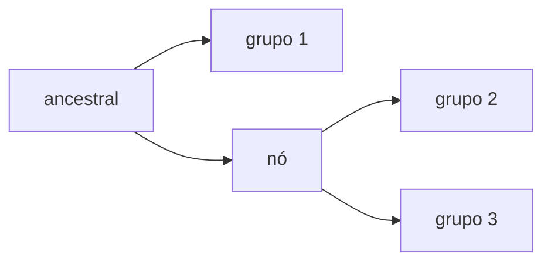

# Aula 02: Classificação biológica e árvores de parentesco
**ID:** geologia-m15-a02
**Módulo:** Paleontologia e história da vida
**Duração estimada:** ~25 min
**Objetivo:** Ler nomes científicos, táxons e uma árvore filogenética simples.
**Pré-requisito:** nenhum; nivelamento opcional.

## Vocabulário desta aula
| Palavra | O que quer dizer |
|---|---|
| **táxon** | grupo nomeado em uma classificação. |
| **espécie** | unidade nomeada; gênero: grupo de espécies próximas. |
| **clado** | ancestral e todos os descendentes. |
| **filogenia** | hipótese de parentesco evolutivo. |
| **nó** | ponto de ramificação da árvore. |
## Antes de começar, você precisa saber
Esta ponte é opcional. Avance se já distingue espécie, gênero e clado e lê parentesco por nós.

## Ao final você vai conseguir
- [OA-02] Distinguir espécie, gênero e clado.
- [OA-02] Inferir parentesco pelo ancestral comum mais recente.

## Conteúdo
Antes do nome técnico, pense numa árvore genealógica: dois primos são próximos porque compartilham ancestral recente, não porque seus nomes estão lado a lado. Uma **filogenia** representa essa hipótese para organismos. As pontas são grupos comparados; o **nó** representa um ancestral comum inferido. Um **clado** reúne esse ancestral e todos os seus descendentes.

**Táxon** é qualquer grupo nomeado. Os níveis espécie e gênero são úteis, mas níveis altos podem variar entre classificações. Para animais, o ICZN regula nomenclatura, não decide qual classificação evolutiva é correta. O nome de espécie é um binômio: gênero com inicial maiúscula e epíteto específico minúsculo, como *Homo sapiens*.

Legenda: 2 e 3 são grupos-irmãos porque compartilham o nó mais recente.

## Exemplo trabalhado
No desenho, os grupos 2 e 3 saem do nó mais recente. Um clado que os reúne inclui os dois grupos e esse ancestral. Juntar apenas o grupo 2 a um **grupo externo** (um grupo fora desse ramo), excluindo o grupo 3, não forma um clado nessa árvore.

## Erros comuns
- “A ponta de baixo é ancestral da de cima.” O desenho parece escada, mas ancestralidade está nos nós.

## O que não concluir
- A árvore não mede superioridade ou progresso; mostra relações propostas.

## Recap relâmpago
- Táxon é grupo nomeado; clado inclui ancestral e descendentes.
- Parentesco se lê pelo ancestral comum mais recente.
- Nomenclatura não é a mesma coisa que taxonomia.

## Próxima aula
Vamos situar grandes ramos da vida sem torná-los uma escada evolutiva.

## Fontes consultadas
- ICZN, Artigos 1 e 5: https://code.iczn.org/zoological-nomenclature/article-1-definition-and-scope/ ; https://code.iczn.org/chapter-2-the-number-of-words-in-the-scientific-names-of-animals/article-5-principle-of-binominal-nomenclature/
- ICNafp: https://www.iaptglobal.org/_files/ugd/12c57a_0d03b3f645d5489f93ab1f311bba62c5.pdf

<!--
cobertura:
  OA-02: [Conteúdo, Exemplo trabalhado]
alegacoes_auditaveis:
  - claim_id: PAL-ICZN-001
    claim: "No ICZN, o nome de espécie é um binômio composto por nome genérico e nome específico."
    risk: nomenclatura
    source: "ICZN, Artigo 5"
-->
