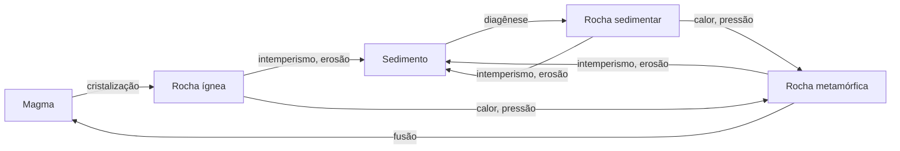

# Aula 02: O ciclo das rochas — ígneas, sedimentares e metamórficas pelo processo

**ID:** mineralogia-m03-a02
**Módulo:** [[03-terra-fabrica-de-minerais-modulo|Módulo 03 — A Terra como fábrica de minerais: contexto geológico mínimo]]
**Duração estimada:** ~28 min
**Nível:** ensino médio, sem geologia prévia (contrato `ensino-medio-sem-geologia-v1`)
**Objetivo:** explicar o ciclo das rochas e distinguir rochas ígneas, sedimentares e metamórficas pelo processo que as forma, lendo a textura e a foliação como registro desse processo.
**Pré-requisito:** [[03-terra-fabrica-de-minerais-aula-01-estrutura-e-composicao-da-terra-crosta-manto-e-nucleo|Aula 01]] (crosta e manto).

## Vocabulário desta aula

| Termo | O que quer dizer |
|---|---|
| **magma** | rocha fundida (com cristais e gases dissolvidos) abaixo da superfície; chamada **lava** quando sai na superfície. |
| **rocha ígnea** | rocha formada pela cristalização (ou solidificação como vidro) de um magma. |
| **rocha sedimentar** | rocha formada na superfície pelo acúmulo e consolidação de fragmentos ou de material precipitado da água. |
| **rocha metamórfica** | rocha transformada no estado sólido, sem fundir, por mudança de temperatura, pressão ou fluidos. |
| **intemperismo** | desagregação e decomposição das rochas na superfície, por água, ar, variação de temperatura e organismos. |
| **diagênese / litificação** | o conjunto de mudanças que transformam sedimento solto em rocha: compactação e cimentação por minerais precipitados nos poros. |
| **textura** | tamanho, forma e arranjo dos grãos de uma rocha. |
| **foliação** | orientação paralela de minerais planos ou alongados numa rocha metamórfica, que a faz partir em lâminas. |

## Antes de começar, você precisa saber

- Que a crosta é feita sobretudo de feldspatos, quartzo e outros silicatos: [[02-o-que-e-mineral-aula-04-abundancia-crustal-e-minerais-formadores-de-rocha|módulo 02, aula 04]].
- Que o manto é sólido e que a fusão é local: [[03-terra-fabrica-de-minerais-aula-01-estrutura-e-composicao-da-terra-crosta-manto-e-nucleo|aula 01]].

## Ao final você vai conseguir

- `mineralogia-m03-oa02` — Explicar o ciclo das rochas e distinguir rochas ígneas, sedimentares e metamórficas pelo processo de formação, incluindo textura e foliação como registro desse processo.

## Conteúdo

### Uma rocha é um registro de processo

O módulo 02 definiu mineral. Uma **rocha** é um agregado de minerais (ou de vidro), e a geologia a classifica em três grandes famílias **pelo processo que a formou**, não pela aparência: **ígnea** (de magma), **sedimentar** (de sedimento, na superfície) e **metamórfica** (transformada no estado sólido). Essas três famílias se convertem umas nas outras num ciclo sem começo nem fim, ideia de James Hutton no fim do século XVIII. Para a mineralogia, cada etapa do ciclo é uma "fábrica" com regras próprias: o que cristaliza de um magma não é o que cresce numa poça de evaporação nem o que recristaliza a 600 °C sob uma montanha.

*Figura: o ciclo das rochas. O que observar: não há caminho obrigatório. Uma rocha ígnea pode virar metamórfica sem passar por sedimento, e qualquer rocha exposta na superfície volta a ser sedimento.*

### Ígneas: o magma que cristaliza

Quando um magma esfria, os íons dissolvidos no líquido se organizam em cristais. O que a textura registra é **onde e com que velocidade** isso aconteceu:

- **Plutônica (intrusiva):** o magma esfria devagar, em profundidade, por milhares a milhões de anos. Os cristais têm tempo de crescer e ficam visíveis a olho nu (textura **fanerítica**). Exemplos: **granito** (feldspatos, quartzo, mica) e **gabro** (plagioclásio, piroxênio).
- **Vulcânica (extrusiva):** a lava esfria em dias ou anos na superfície. Os cristais são microscópicos (textura **afanítica**) e, se o resfriamento for brusco, nem dá tempo de cristalizar: forma-se **vidro** (obsidiana, módulo 02). Exemplos: **riolito** (a química do granito) e **basalto** (a do gabro).
- **Porfirítica:** cristais grandes imersos numa matriz fina. Conta uma história em duas etapas: os cristais grandes cresceram devagar em profundidade, e o restante cristalizou rápido depois que o magma subiu.

Note o par: **granito e riolito têm a mesma química e minerais parecidos; o que muda é a textura**, isto é, a história térmica. O módulo 38 trata dos minerais magmáticos; aqui basta saber que magmas ricos em Mg e Fe (basálticos) cristalizam olivina, piroxênio e plagioclásio cálcico, e magmas ricos em Si, Na e K (graníticos) cristalizam quartzo, feldspato potássico, plagioclásio sódico e micas.

### Sedimentares: a superfície desmonta e remonta

Na superfície, as rochas encontram água, oxigênio, CO₂ e variação de temperatura. É o **intemperismo**, de dois tipos:

- **Físico:** quebra sem mudar os minerais (congelamento de água em fraturas, raízes, expansão térmica).
- **Químico:** muda os minerais. Os silicatos formados em alta temperatura ficam instáveis na superfície. O feldspato, por exemplo, reage com água levemente ácida e vira **caulinita**, um argilomineral, liberando K⁺ e sílica dissolvidos. O quartzo resiste muito mais, e por isso acaba concentrado como **areia**.

Os produtos seguem por dois caminhos:

1. **Clásticos (fragmentos):** grãos transportados por rio, vento ou gelo, depositados em camadas e consolidados por **diagênese**: o peso das camadas de cima compacta, e minerais que precipitam nos poros (calcita, sílica, óxidos de ferro) cimentam os grãos. Areia vira **arenito**; lama vira **folhelho**.
2. **Químicos e bioquímicos (precipitados):** os íons dissolvidos (Ca²⁺, Na⁺, K⁺, Mg²⁺, Cl⁻, SO₄²⁻, HCO₃⁻) vão para lagos e mares e precipitam de novo, por evaporação ou pela ação de organismos: **calcário** (calcita), **evaporitos** (gipsita, halita).

A textura sedimentar registra o transporte: grãos arredondados e bem selecionados (todos do mesmo tamanho) sugerem transporte longo; camadas paralelas registram deposição sucessiva.

> [!question] Pare e explique
> Um granito tem quartzo e feldspato. Depois de muito intemperismo químico, a areia de um rio que corta esse granito tem quase só quartzo. Para onde foi o feldspato?

### Metamórficas: transformar sem fundir

Quando uma rocha é enterrada, empurrada para dentro de uma montanha ou aquecida por um magma vizinho, seus minerais ficam fora das condições em que nasceram. Sem fundir, os átomos migram no estado sólido (muitas vezes ajudados por fluidos, aula 04) e os minerais **recristalizam** ou **reagem**, formando novos minerais estáveis nas novas condições. Uma argila vira **mica**; mais quente, aparecem **granada** e **estaurolita** (silicato de Fe e Al típico dessas rochas). Esse é o **metamorfismo**.

A textura registra a **pressão dirigida**. Num cinturão de montanhas, a rocha é comprimida mais numa direção do que nas outras, e os minerais planos (micas) crescem perpendiculares à compressão. Daí a **foliação**:

- **Ardósia:** grão finíssimo, parte em placas (o "telhado de ardósia").
- **Xisto:** micas visíveis, brilho sedoso, foliação marcada.
- **Gnaisse:** bandas claras (quartzo, feldspato) e escuras (biotita, anfibólio) alternadas.

A sequência ardósia → xisto → gnaisse acompanha, grosso modo, temperatura crescente sobre um mesmo folhelho de partida.

Sem pressão dirigida, ou com minerais que não são planos, não há foliação: **mármore** (calcário recristalizado, calcita) e **quartzito** (arenito recristalizado, quartzo). Junto a um corpo de magma, o calor sem compressão produz o **hornfels** (ou corneana), maciço e de grão fino: é o metamorfismo de contato.

### Onde a mineralogia entra

Para este curso, a lição do ciclo é que **cada família corresponde a condições físicas e químicas típicas**:

| Família | Condição típica | Minerais característicos (exemplos) |
|---|---|---|
| Ígnea | ~700-1.200 °C, cristalização de um líquido silicático | olivina, piroxênio, plagioclásio, feldspato potássico, quartzo, micas |
| Sedimentar | ~0-200 °C, água, superfície ou pouca profundidade | quartzo detrítico, argilominerais, calcita, gipsita, halita |
| Metamórfica | ~200-800 °C ou mais, estado sólido, com ou sem pressão dirigida | micas, granada, estaurolita, cianita, sillimanita, anfibólios |

As faixas são de ordem de grandeza e se sobrepõem nas bordas (a diagênese vira metamorfismo de baixo grau sem fronteira nítida). A aula 03 mostra de onde vêm essas pressões e temperaturas.

## Exemplo trabalhado

**Problema.** Três amostras: (A) rocha com cristais de quartzo, feldspato e mica de ~5 mm, encaixados uns nos outros, sem orientação; (B) rocha com os mesmos minerais, mas com as micas todas paralelas e bandas claras e escuras; (C) rocha de grãos de quartzo arredondados, de ~0,5 mm, colados por calcita. Classifique cada uma pelo processo, apontando a evidência.

**Passo 1. Observação, sem interpretar.** A: grãos grossos, interpenetrados, sem orientação. B: orientação paralela e bandamento. C: grãos arredondados e separados, com um cimento entre eles.

**Passo 2. Ligar a textura ao processo.** A: cristais que cresceram uns contra os outros a partir de um líquido, devagar → **ígnea plutônica** (um granito). B: orientação imposta por pressão dirigida em estado sólido → **metamórfica foliada** (um gnaisse). C: grãos arredondados por transporte e depois cimentados → **sedimentar clástica** (um arenito).

**Passo 3. O que a mineralogia sozinha não diria.** A e B têm os mesmos minerais. Só a textura separa as duas.

**Método geral:** descreva a textura antes de nomear o processo; a lista de minerais ajuda, mas raramente decide sozinha.

## Erros comuns

- **Classificar pela lista de minerais.** É sedutor porque minerais são o assunto do curso. Mas quartzo, feldspato e mica aparecem em granito, gnaisse e arenito.
- **Achar que o metamorfismo funde a rocha.** Se fundir, o produto resfriado é ígneo. O metamorfismo acontece no estado sólido.
- **Pensar o ciclo como uma sequência obrigatória** (ígnea → sedimentar → metamórfica). Qualquer seta pode ser pulada.

## O que não concluir

- Que **todo cristal pequeno indique resfriamento rápido**. Rochas metamórficas de grão fino (ardósia) e sedimentos finos (folhelho) também têm grãos pequenos, por outros motivos. A regra "grão fino = esfriou rápido" vale só para rochas ígneas.
- Que toda foliação seja metamórfica. Camadas sedimentares também são planas; a foliação metamórfica é a orientação dos próprios minerais, não o empilhamento de camadas.
- Que a textura dê a idade ou a temperatura exata. Ela dá o tipo de processo; números vêm de outras ferramentas (módulos 40 e 42).

## Recap relâmpago

- Rochas se classificam pelo processo: ígneas (magma), sedimentares (superfície), metamórficas (estado sólido).
- Ígnea: textura grossa (plutônica, lenta), fina ou vítrea (vulcânica, rápida), porfirítica (duas etapas); granito e riolito têm a mesma química.
- Sedimentar: intemperismo físico e químico (feldspato → caulinita; quartzo resiste), transporte, deposição e diagênese; clásticas e químicas.
- Metamórfica: recristalização sem fusão; pressão dirigida gera foliação (ardósia, xisto, gnaisse); sem ela, mármore, quartzito, hornfels.
- Cada família corresponde a uma faixa de condições, e cada faixa tem seus minerais.

## Próxima aula

Em [[03-terra-fabrica-de-minerais-aula-03-pressao-temperatura-e-tectonica-gradientes-geotermicos|Aula 03 — Pressão, temperatura e tectônica]], as setas do ciclo ganham motor: o movimento das placas, que enterra, aquece, comprime e funde, e o gradiente geotérmico, que diz quanto esquenta a cada quilômetro.

## Fontes consultadas

- Klein, C. & Dutrow, B., *Manual of Mineral Science*, 23ª ed., Wiley (capítulos de assembleias ígneas, sedimentares e metamórficas).
- Perkins, D., *Mineralogy*, 3ª ed., Pearson (minerais por ambiente).
- Winter, J. D., *Principles of Igneous and Metamorphic Petrology*, 2ª ed., Pearson (texturas ígneas e metamórficas; sequência ardósia-xisto-gnaisse).
- Hutton, J. (1788), "Theory of the Earth", *Transactions of the Royal Society of Edinburgh* 1, 209–304 (origem da ideia de ciclo).

<!--
nivel: ensino-medio-sem-geologia-v1
palavras_corpo: 1391
cobertura:
  mineralogia-m03-oa02: [Conteúdo, Exemplo trabalhado]
alegacoes_auditaveis:
  - claim_id: TER-CIC-HUTTON-001
    claim: "A ideia de um ciclo continuo das rochas remonta a James Hutton, no fim do seculo XVIII (1785/1788)."
    risk: data
    source: "Hutton (1788)"
    audit: "verificado em 2026-10-04"
  - claim_id: TER-IGN-TEXTURA-001
    claim: "Plutonica = resfriamento lento, cristais visiveis (faneritica); vulcanica = rapido, afanitica ou vitrea; porfiritica = duas etapas."
    risk: conceito
    source: "Winter; Klein & Dutrow"
    audit: "verificado em 2026-10-04"
  - claim_id: TER-IGN-PARES-001
    claim: "Granito e riolito tem a mesma quimica; gabro e basalto tem a mesma quimica."
    risk: conceito
    source: "classificacao IUGS (Le Maitre 2002)"
    audit: "verificado em 2026-10-04"
  - claim_id: TER-IGN-MINERAIS-001
    claim: "Magmas basalticos cristalizam olivina, piroxenio e plagioclasio calcico; graniticos cristalizam quartzo, feldspato potassico, plagioclasio sodico e micas."
    risk: conceito
    source: "Winter; Klein & Dutrow"
    audit: "verificado em 2026-10-04"
  - claim_id: TER-SED-CAULIN-001
    claim: "Intemperismo quimico transforma feldspato em caulinita, liberando K+ e silica dissolvida; quartzo e muito mais resistente e se concentra como areia."
    risk: mecanismo
    source: "Klein & Dutrow; geoquimica de superficie"
    audit: "verificado em 2026-10-04"
  - claim_id: TER-SED-DIAGEN-001
    claim: "Diagenese: compactacao e cimentacao por calcita, silica e oxidos de ferro; areia vira arenito, lama vira folhelho; calcario e evaporitos sao quimicos/bioquimicos."
    risk: conceito
    source: "livros-texto de sedimentologia"
    audit: "verificado em 2026-10-04"
  - claim_id: TER-MET-FOLIA-001
    claim: "Foliacao resulta do crescimento de minerais planos perpendiculares a compressao dirigida; ardosia -> xisto -> gnaisse acompanha temperatura crescente sobre um folhelho; marmore, quartzito e hornfels sao tipicamente nao foliados."
    risk: conceito
    source: "Winter (2010)"
    audit: "verificado em 2026-10-04"
  - claim_id: TER-MET-MINERAIS-001
    claim: "Argila vira mica com o metamorfismo; em temperatura maior aparecem granada e estaurolita."
    risk: conceito
    source: "Winter; Klein & Dutrow"
    audit: "verificado em 2026-10-04"
  - claim_id: TER-CIC-FAIXAS-001
    claim: "Faixas tipicas: igneas ~700-1.200 C; sedimentares ~0-200 C; metamorficas ~200-800 C ou mais; fronteiras se sobrepoem."
    risk: numero
    source: "Winter; ordem de grandeza"
    audit: "verificado em 2026-10-04"
-->
