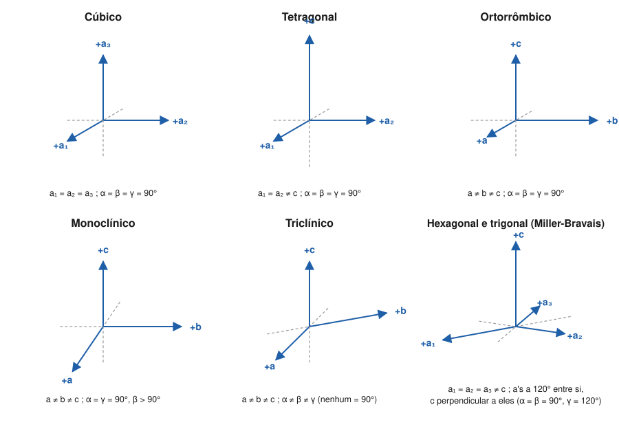

# Aula 01: Eixos cristalográficos e parâmetros de cela por sistema

**ID:** mineralogia-m05-a01
**Módulo:** [[05-miller-e-projecao-modulo|Módulo 05 — Eixos cristalográficos, índices de Miller e projeção estereográfica]]
**Duração estimada:** ~28 min
**Nível:** ensino médio, sem geologia prévia (contrato `ensino-medio-sem-geologia-v1`)
**Objetivo:** associar a cada sistema cristalino seus eixos de referência e as relações entre os seis parâmetros de cela, e explicar por que os eixos seguem a simetria.
**Pré-requisito:** [[04-simetria-e-morfologia-aula-06-os-sete-sistemas-cristalinos-definidos-pela-simetria|Módulo 04, aula 06]] (os sete sistemas pela simetria característica).

## Vocabulário desta aula

| Termo | O que quer dizer |
|---|---|
| **eixos cristalográficos** | três (ou quatro) direções de referência fixadas no cristal, usadas para dar coordenadas a faces e direções. |
| **a, b, c** | os comprimentos de referência medidos ao longo de cada eixo. |
| **α, β, γ** | os ângulos entre os eixos: α entre b e c, β entre a e c, γ entre a e b. |
| **parâmetros de cela** | o conjunto dos seis números a, b, c, α, β, γ da unidade que, repetida, constrói o cristal (cela unitária, módulo 06). |
| **ångström (Å)** | unidade de comprimento: 1 Å = 10⁻¹⁰ m = 0,1 nanômetro. É a escala das distâncias entre átomos. |
| **razão axial** | a proporção entre os comprimentos, como c/a, que a forma externa do cristal permite medir sem raios X. |
| **eixo único** | o eixo especial de um sistema: o eixo 4 no tetragonal, o 6 ou 3 no hexagonal e trigonal, o eixo 2 no monoclínico. |

## Antes de começar, você precisa saber

- Os sete sistemas e a simetria característica de cada um: [[04-simetria-e-morfologia-aula-06-os-sete-sistemas-cristalinos-definidos-pela-simetria|módulo 04, aula 06]].
- Que a lei de Haüy fala em faces que cortam "os eixos" a distâncias em razões de inteiros pequenos: [[04-simetria-e-morfologia-aula-01-o-estado-cristalino-leis-de-steno-e-de-hauy|módulo 04, aula 01]]. Esta aula diz quais são esses eixos.

## Ao final você vai conseguir

- `mineralogia-m05-oa01` — Associar a cada sistema cristalino seus eixos cristalográficos e as relações entre os parâmetros de cela (a, b, c; α, β, γ).

## Conteúdo

### Por que o cristal precisa de eixos

Para dizer onde está uma face, é preciso um sistema de coordenadas, como num mapa. No cristal, os eixos seguem a **simetria**: cada um é posto ao longo de um eixo de rotação ou perpendicular a um espelho, para que faces equivalentes recebam endereços parecidos. O preço é que eles **nem sempre são perpendiculares** e **nem sempre têm o mesmo comprimento**, ao contrário dos x, y, z da escola. Quem decide é o sistema.

### A convenção de nomes

Os eixos se chamam **a**, **b** e **c**. Na figura padrão dos livros, a extremidade positiva de **a** aponta para quem olha, a de **b** para a direita e a de **c** para cima. Os ângulos entre eixos seguem uma regra fácil de guardar: **cada ângulo tem o nome do eixo que ele não toca.**

- **α** (alfa) é o ângulo entre b e c (não toca a);
- **β** (beta) é o ângulo entre a e c (não toca b);
- **γ** (gama) é o ângulo entre a e b (não toca c).

Quando dois ou três eixos são equivalentes pela simetria, eles recebem o mesmo nome com índice: a₁, a₂, a₃.

*Figura 1. Os conjuntos de eixos dos sistemas, com as extremidades positivas em azul e as negativas tracejadas. O que observar: só no monoclínico e no triclínico há ângulos diferentes de 90° entre os eixos a, b, c; no hexagonal e no trigonal entram três eixos a no plano horizontal, a 120° entre si.*

### Os parâmetros de cela

Os seis números **a, b, c, α, β, γ** são os **parâmetros de cela**. Os comprimentos são as dimensões reais da unidade que se repete, medidas por difração de raios X (módulo 18), em ångströms. A forma externa dá só as **proporções** entre eles (a razão axial): cristais grandes e pequenos da mesma substância têm os mesmos ângulos (lei de Steno).

### A tabela que esta aula entrega

| Sistema | Relações entre parâmetros | Onde ficam os eixos (pela simetria) | Parâmetros independentes |
|---|---|---|---|
| **Cúbico** | a₁ = a₂ = a₃; α = β = γ = 90° | ao longo dos três eixos 4 ou 4̄ (ou dos três eixos 2, nas classes 23 e m3̄, que não têm nem 4 nem 4̄) | 1 (a) |
| **Tetragonal** | a₁ = a₂ ≠ c; α = β = γ = 90° | c ao longo do eixo 4 ou 4̄; a₁ e a₂ perpendiculares a ele, ao longo dos eixos 2 ou normais aos espelhos, quando existem | 2 (a, c) |
| **Ortorrômbico** | a ≠ b ≠ c; α = β = γ = 90° | ao longo das três direções com eixo 2 ou 2̄ (= normal a espelho) | 3 |
| **Hexagonal e trigonal** | a₁ = a₂ = a₃ ≠ c; os a's a 120° entre si e a 90° de c (α = β = 90°, γ = 120°) | c ao longo do eixo 6, 6̄, 3 ou 3̄; os três a's no plano perpendicular | 2 (a, c) |
| **Monoclínico** | a ≠ b ≠ c; α = γ = 90°, β ≠ 90° | **b** ao longo do único eixo 2 (ou normal ao único espelho); a e c no plano perpendicular a b, formando entre si o ângulo β | 4 |
| **Triclínico** | a ≠ b ≠ c; α ≠ β ≠ γ, nenhum igual a 90° por exigência | sem eixo de simetria que os fixe; escolhidos ao longo de arestas proeminentes do cristal | 6 |

Três observações tornam a tabela utilizável:

- **"≠" quer dizer "não é exigido igual", e não "obrigatoriamente diferente".** Num ortorrômbico, a e b podem sair quase iguais por acaso; o que faz o cristal ser ortorrômbico é não haver simetria que obrigue a igualdade.
- **No monoclínico, b é o eixo especial.** Esta é a convenção mais usada em mineralogia (chamada "segunda posição"), e o ângulo β é tomado como **obtuso**, maior que 90°, como os 105,6° do diopsídio na tabela abaixo.
- **Trigonal e hexagonal usam os mesmos eixos.** É o motivo pelo qual a IUCr os reúne numa só família hexagonal ([[04-simetria-e-morfologia-aula-06-os-sete-sistemas-cristalinos-definidos-pela-simetria|módulo 04, aula 06]]). Muitos minerais trigonais também podem ser descritos por eixos romboédricos, com a = b = c e α = β = γ ≠ 90°; essa alternativa volta no módulo 06. Os quatro índices que os três eixos a exigem são o assunto da aula 03.

> [!question] Pare e explique
> Por que o eixo c do tetragonal é posto ao longo do eixo 4, e não ao longo de um dos eixos 2 horizontais? O que se perderia nos endereços das faces se a escolha fosse outra?

### Minerais reais, números reais

Os parâmetros abaixo são do *Handbook of Mineralogy* (amostras de referência; variam um pouco com a composição). A tabela é de consulta: o que importa é o padrão de igualdades, não os decimais.

| Mineral | Sistema | Parâmetros de cela |
|---|---|---|
| halita | cúbico | a = 5,640 Å |
| zircão | tetragonal | a = 6,607 Å; c = 5,982 Å |
| quartzo | trigonal (eixos hexagonais) | a = 4,913 Å; c = 5,405 Å |
| forsterita (olivina) | ortorrômbico | a = 4,754 Å; b = 10,197 Å; c = 5,981 Å |
| diopsídio | monoclínico | a = 9,746 Å; b = 8,899 Å; c = 5,251 Å; β = 105,63° |
| cianita | triclínico | a = 7,126 Å; b = 7,852 Å; c = 5,572 Å; α = 89,99°; β = 101,11°; γ = 106,03° |

Veja a cianita: α saiu 89,99°, praticamente reto. Mesmo assim ela é triclínica, porque nenhuma simetria obriga esse ângulo a valer 90°. É a mesma lição do módulo 04, agora nos números: **o sistema vem da simetria; os parâmetros só a acompanham.**

### Razão axial e lei de Steno

A razão axial explica por que cada substância tem seus próprios ângulos. No zircão, c/a = 5,982 / 6,607 ≈ 0,905; no quartzo, c/a ≈ 1,100. No sistema cúbico não há razão axial a medir (a₁ = a₂ = a₃), e por isso **o ângulo entre duas faces de mesmos índices, como (100) e (111), é exatamente o mesmo na halita, na fluorita e na galena**, embora os tamanhos de cela sejam diferentes. A aula 06 vai medir esses ângulos.

## Exemplo trabalhado

**Problema.** Quatro conjuntos de parâmetros de cela, de minerais reais. Diga a que sistema (ou família) cada um é compatível e qual eixo é o especial.
(A) a = 4,594 Å, c = 2,959 Å, todos os ângulos 90° (rutilo).
(B) a = 9,746 Å, b = 8,899 Å, c = 5,251 Å, α = γ = 90°, β = 105,63° (diopsídio).
(C) a = 4,913 Å, c = 5,405 Å, α = β = 90°, γ = 120° (quartzo).
(D) a = 5,640 Å, todos os ângulos 90° (halita).

**Passo 1. (A).** Dois comprimentos iguais (a₁ = a₂) e um diferente, ângulos retos: compatível com **tetragonal**. O eixo especial é c, ao longo do eixo 4.

**Passo 2. (B).** Três comprimentos diferentes, só um ângulo diferente de 90°, e ele é β: compatível com **monoclínico**. O eixo especial é **b**, o único perpendicular aos outros dois.

**Passo 3. (C).** γ = 120° e a = b: são **eixos hexagonais**, usados pela família hexagonal. Os parâmetros não distinguem trigonal de hexagonal; quem decide é a simetria (o quartzo de baixa temperatura é trigonal, classe 32, módulo 04).

**Passo 4. (D).** Um só comprimento e ângulos retos: compatível com **cúbico**.

**Passo 5. Conferência.** A palavra certa é "compatível": os parâmetros dizem que a cela **pode** ter a simetria do sistema; a prova é a simetria observada.

**Método geral:** conte quantos comprimentos são iguais e quais ângulos diferem de 90°; ache o eixo especial pelo ângulo ou pelo comprimento diferente; confirme o sistema pela simetria, nunca só pelos números.

## Erros comuns

- **Trocar os nomes dos ângulos.** É sedutor pensar que α fica "junto de a". É o contrário: α é o ângulo **oposto** a a. Por isso o ângulo do monoclínico, entre a e c, é β.
- **Achar que todo eixo cristalográfico é perpendicular aos outros.** Vem da geometria escolar; no monoclínico, no triclínico e entre os a's do hexagonal, não vale.
- **Classificar pelo número.** Um ângulo de 89,99° não torna a cianita monoclínica.

## O que não concluir

- Que os parâmetros de cela definem o sistema. Eles acompanham a simetria; uma cela pode parecer mais simétrica que o cristal.
- Que os comprimentos a, b, c possam ser lidos da forma externa. A morfologia dá a razão axial; os ångströms vêm da difração.
- Que a escolha dos eixos seja única no triclínico. Sem simetria para fixá-los, ela é convenção, e textos diferentes podem usar celas diferentes.

## Recap relâmpago

- Eixos a, b, c (ou a₁, a₂, a₃) seguem a simetria: ao longo de eixos de rotação ou normais a espelhos.
- α = b∧c, β = a∧c, γ = a∧b: cada ângulo leva o nome do eixo que não toca.
- Cúbico 1 parâmetro; tetragonal e hexagonal 2; ortorrômbico 3; monoclínico 4; triclínico 6.
- Monoclínico: b é o eixo único, β obtuso; hexagonal e trigonal: três a's a 120° e c perpendicular.
- O sistema decide os parâmetros, não o contrário (cianita: α ≈ 90° e ainda triclínica).

## Próxima aula

Em [[05-miller-e-projecao-aula-02-indices-de-miller-de-interceptos-a-hkl-e-formas|Aula 02 — Índices de Miller]], os eixos viram régua: cada face recebe um endereço de três números inteiros, a partir de onde ela corta os eixos.

## Fontes consultadas

- Anthony, J. W., Bideaux, R. A., Bladh, K. W. & Nichols, M. C. (eds.), *Handbook of Mineralogy*, Mineralogical Society of America (fichas de halita, zircão, quartzo, forsterita, diopsídio, cianita; parâmetros de cela conferidos por busca em 2026-10-04).
- Klein, C. & Dutrow, B., *Manual of Mineral Science*, 23ª ed., Wiley (eixos cristalográficos por sistema; convenção do monoclínico com b único e β obtuso).
- IUCr, *Online Dictionary of Crystallography*, verbetes "Crystal system" e "Crystal family" (família hexagonal; consultado em 2026-10-04).
- *International Tables for Crystallography*, vol. A, IUCr (convenções de eixos e de cela).

<!--
nivel: ensino-medio-sem-geologia-v1
palavras_corpo: 1595
cobertura:
  mineralogia-m05-oa01: [Conteúdo, Exemplo trabalhado]
figuras:
  - 05-miller-e-projecao-fig-01-eixos-por-sistema.svg
alegacoes_auditaveis:
  - claim_id: CRI-EIX-ANGULOS-001
    claim: "alfa e o angulo entre b e c; beta entre a e c; gama entre a e b."
    risk: conceito
    source: "International Tables vol. A; Klein & Dutrow"
    audit: "verificado em 2026-10-04"
  - claim_id: CRI-EIX-TABELA-001
    claim: "Relacoes de parametros por sistema (cubico a=a=a, 90; tetragonal a=a!=c, 90; ortorrombico a!=b!=c, 90; hexagonal/trigonal a=a!=c, alfa=beta=90, gama=120; monoclinico alfa=gama=90, beta!=90; triclinico nenhum imposto) e numero de parametros independentes 1, 2, 3, 2, 4, 6."
    risk: conceito
    source: "International Tables vol. A; Klein & Dutrow"
    audit: "verificado em 2026-10-04"
  - claim_id: CRI-EIX-POSICAO-001
    claim: "Eixos ao longo de eixos de simetria ou normais a espelhos; no cubico ao longo dos eixos 4 ou 4-barra (ou eixos 2 nas classes 23 e m3-barra); no monoclinico b ao longo do eixo 2 (segunda posicao), beta obtuso."
    risk: conceito
    source: "Klein & Dutrow; International Tables vol. A"
    audit: "corrigido em 2026-10-04 (🟠: faltava o eixo 4-barra no cubico, classe 4-barra 3m; 🔵: generalizacao sobre o beta de feldspatos, piroxenios e micas substituida pelo exemplo conferido do ortoclasio)"
  - claim_id: CRI-EIX-PARAM-001
    claim: "Halita a = 5,640; zircao a = 6,607, c = 5,982; quartzo a = 4,913, c = 5,405; forsterita a = 4,754, b = 10,197, c = 5,981; diopsidio a = 9,746, b = 8,899, c = 5,251, beta = 105,63; cianita a = 7,126, b = 7,852, c = 5,572, alfa = 89,99, beta = 101,11, gama = 106,03 (angstrom, graus)."
    risk: numero
    source: "Handbook of Mineralogy (por busca); forsterita confere com HoM 4,7540/10,1971/5,9806; diopsidio a = 9,746, b = 8,899, c = 5,251, beta = 105,63 (busca: valores atribuidos ao HoM)"
    audit: "corrigido em 2026-10-04 (🟠, terceira passagem: o ortoclasio com c = 7,299 A, valor suspeito, foi trocado pelo diopsidio)"
  - claim_id: CRI-EIX-RUTILO-001
    claim: "Rutilo: a = 4,594, c = 2,959 angstrom, tetragonal."
    risk: numero
    source: "Handbook of Mineralogy (a = 4,5937, c = 2,9587)"
    audit: "verificado em 2026-10-04"
  - claim_id: CRI-EIX-RAZAO-001
    claim: "c/a zircao ~0,905; quartzo ~1,100; no cubico os angulos entre faces equivalentes nao dependem de a."
    risk: numero
    source: "calculo a partir dos parametros do HoM"
    audit: "corrigido em 2026-10-04 (🟡: faces equivalentes -> faces de mesmos indices)"
  - claim_id: CRI-EIX-ROMB-001
    claim: "Minerais trigonais podem ser descritos por eixos romboedricos a=b=c, alfa=beta=gama!=90."
    risk: conceito
    source: "International Tables vol. A"
    audit: "verificado em 2026-10-04"
-->
