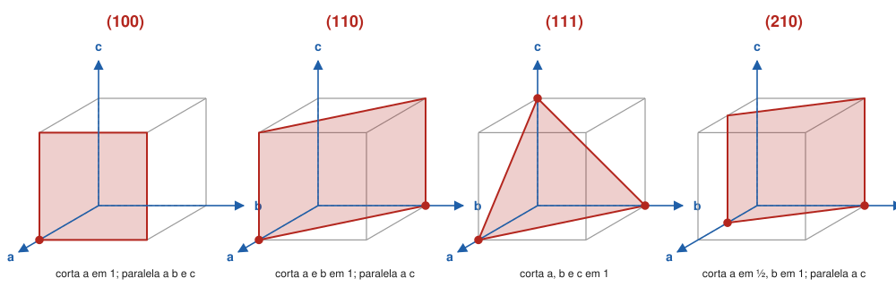

# Aula 02: Índices de Miller — de interceptos a (hkl) e formas {hkl}

**ID:** mineralogia-m05-a02
**Módulo:** [[05-miller-e-projecao-modulo|Módulo 05 — Eixos cristalográficos, índices de Miller e projeção estereográfica]]
**Duração estimada:** ~28 min
**Nível:** ensino médio, sem geologia prévia (contrato `ensino-medio-sem-geologia-v1`)
**Objetivo:** atribuir índices de Miller (hkl) a uma face a partir de onde ela corta os eixos, fazer o caminho inverso, e escrever uma forma cristalina como {hkl}.
**Pré-requisito:** [[05-miller-e-projecao-aula-01-eixos-cristalograficos-e-parametros-de-cela-por-sistema|Aula 01]] (eixos e parâmetros) e [[04-simetria-e-morfologia-aula-07-formas-cristalinas-e-habito-formas-gerais-especiais-abertas-e-fechadas|módulo 04, aula 07]] (o que é uma forma).

## Vocabulário desta aula

| Termo | O que quer dizer |
|---|---|
| **intercepto** | a distância, ao longo de um eixo, do centro do cristal até o ponto onde o plano da face (prolongado) corta esse eixo. |
| **parâmetros de Weiss** | os interceptos escritos em unidades de a, b e c, como 1a : 2b : ∞c. |
| **índices de Miller (hkl)** | três inteiros obtidos dos inversos dos interceptos; o "endereço" de uma face. |
| **face unitária** | a face escolhida como (111), que corta os três eixos nas distâncias de referência a, b, c. |
| **forma {hkl}** | o conjunto de faces equivalentes pela simetria que contém a face (hkl). |
| **índice com barra** | índice negativo, escrito com um traço em cima: 1̄ lê-se "um barra" e vale −1. |

## Antes de começar, você precisa saber

- Os eixos e a convenção de sinais: [[05-miller-e-projecao-aula-01-eixos-cristalograficos-e-parametros-de-cela-por-sistema|aula 01]].
- A lei de Haüy (interceptos em razões de inteiros pequenos): [[04-simetria-e-morfologia-aula-01-o-estado-cristalino-leis-de-steno-e-de-hauy|módulo 04, aula 01]].
- **Matemática reativada:** o inverso de um número (o inverso de 2 é ½; o de ½ é 2) e o mínimo múltiplo comum, para eliminar frações.

## Ao final você vai conseguir

- `mineralogia-m05-oa02` — Atribuir índices de Miller (hkl) e de Miller-Bravais (hkil) a faces, formas {hkl} e direções [uvw]. *(Nesta aula: faces (hkl) e formas {hkl}; direções e Miller-Bravais na aula 03.)*

## Conteúdo

### O problema: dar endereço a uma face

Uma face de cristal é um plano. O que importa nela é a **orientação**, não a posição: se a face cresce e se desloca para fora, paralela a si mesma, continua sendo a mesma face. Então o endereço precisa descrever a inclinação do plano em relação aos eixos, e só isso.

O jeito natural é olhar **onde o plano corta os eixos**. No começo do século XIX, Christian Samuel Weiss escrevia esses cortes em unidades de a, b e c: uma face que corta a em 1 unidade, b em 2 unidades e nunca encontra c (é paralela a ele) fica **1a : 2b : ∞c**. São os **parâmetros de Weiss**. Funcionam, mas o ∞ é incômodo e as frações se acumulam.

Em 1839, William Hallowes Miller, em Cambridge, propôs inverter os números. O inverso de ∞ é 0, e as frações viram inteiros pequenos. São os **índices de Miller**, usados até hoje.

### A receita em quatro passos

1. **Interceptos** em unidades de a, b, c. Se a face é paralela a um eixo, o intercepto é ∞. Se o plano passa pelo centro, desloque-o paralelamente (a orientação não muda).
2. **Inverta** cada um: 1/intercepto. Paralelo → 0.
3. **Elimine as frações** multiplicando todos pelo mesmo número, e reduza aos menores inteiros.
4. **Escreva entre parênteses**, sem vírgulas: (hkl). Negativo leva barra: (1̄10).

Exemplo: 1a : 2b : ∞c → inversos 1, ½, 0 → vezes 2 → **(210)**.

A ordem é sempre a mesma: o primeiro índice (h) se refere a a, o segundo (k) a b, o terceiro (l) a c. Índice **grande** quer dizer intercepto **pequeno**: a face corta aquele eixo perto do centro. Índice **zero** quer dizer que a face é **paralela** àquele eixo.

*Figura 2. Quatro planos desenhados numa cela de eixos a, b, c, com os interceptos marcados em vermelho. O que observar: em (100) e (110) o plano é paralelo a c e o terceiro índice é 0; em (210) o plano corta a na metade do caminho, por isso o índice de a é o maior.*

### A face unitária define a régua

De onde vem a "unidade" de cada eixo? Antes dos raios X, os cristalógrafos escolhiam uma face que cortasse os três eixos e a chamavam de **(111)**, a face unitária. Os interceptos dela definiam as proporções a : b : c, a razão axial da aula 01. Toda outra face era medida em relação a ela. Hoje a régua é a cela unitária (módulo 06), medida por difração (módulo 18), e as duas escolhas normalmente coincidem; quando não coincidem, o mesmo plano pode receber índices diferentes em textos antigos e modernos (a aula 03 mostra o caso da calcita).

A lei de Haüy garante que a receita sempre termina em **inteiros pequenos**: as faces reais cortam os eixos em razões racionais simples. É por isso que (210) e (111) aparecem em cristais, e (√2 1 0) não.

### Faces paralelas e sinais

A face oposta, paralela, do outro lado do cristal tem todos os sinais trocados: o par de (210) é (2̄1̄0). Os sinais seguem a convenção de eixos da aula 01: corte do lado negativo de a dá h negativo.

Na morfologia, (420) e (210) descrevem a **mesma orientação**, e por isso se reduz sempre aos menores inteiros. No módulo 18 (difração), índices com fator comum ganham um sentido próprio; aqui, não.

> [!question] Pare e explique
> Uma face tem índices (001). Ela é paralela a quais eixos? E que intercepto ela tem em c?

### De (hkl) a forma {hkl}

No [[04-simetria-e-morfologia-aula-07-formas-cristalinas-e-habito-formas-gerais-especiais-abertas-e-fechadas|módulo 04, aula 07]], forma era o conjunto de faces que a simetria gera a partir de uma face. Agora ela ganha nome: escreve-se a face de partida entre **chaves**, {hkl}.

| Símbolo | Lê-se | Quer dizer |
|---|---|---|
| (hkl) | "face h k l" | uma face só |
| {hkl} | "forma h k l" | todas as faces equivalentes a (hkl) pela simetria da classe |

No cúbico holoédrico (m3̄m):

- **{100}** é o **cubo**: (100), (1̄00), (010), (01̄0), (001), (001̄), 6 faces.
- **{111}** é o **octaedro**: 8 faces, todas as combinações de sinais de (111).
- **{110}** é o **dodecaedro rômbico**: 12 faces, como (110), (1̄10), (011), (101)...
- **{hkl}** com h, k, l diferentes e não nulos é a **forma geral**, de 48 faces, como na aula 07 do módulo 04.

O número de faces de {hkl} **depende da classe**, não só dos índices. Na pirita (classe m3̄), {210} é o **piritoedro**, de 12 faces pentagonais. Na classe m3̄m, o mesmo símbolo {210} gera 24 faces (o tetra-hexaedro), porque há mais simetria multiplicando a face.

No zircão (tetragonal, 4/mmm), o prisma pode ser {100} ou {110}, de 4 faces cada, e as pontas costumam ser a bipirâmide {101}, de 8 faces.

## Exemplo trabalhado

**Problema.** (a) Ache os índices das faces com interceptos 2a : 3b : 6c, 1a : −1b : ½c e 2a : ∞b : −1c. (b) Faça o caminho inverso para (231). (c) Quantas faces tem {111} num cristal cúbico holoédrico?

**Passo 1. 2a : 3b : 6c.** Inversos ½, ⅓, ⅙. O mínimo múltiplo comum dos denominadores é 6: vezes 6 → 3, 2, 1 → **(321)**.

**Passo 2. 1a : −1b : ½c.** Inversos 1, −1, 2. Já inteiros → **(1 1̄ 2)**.

**Passo 3. 2a : ∞b : −1c.** Inversos ½, 0, −1. Vezes 2 → 1, 0, −2 → **(1 0 2̄)**. O zero diz que a face é paralela a b.

**Passo 4. Caminho inverso de (231).** Inverta os índices: ½, ⅓, 1. Os interceptos só valem como proporção, então multiplique por 6 para tirar as frações: **3a : 2b : 6c**. Confira: inversos ⅓, ½, ⅙, vezes 6 → (231).

**Passo 5. {111} no cúbico.** Cada índice pode ser +1 ou −1: 2 × 2 × 2 = **8 faces**, o octaedro.

**Método geral:** interceptos → inversos → inteiros mínimos → parênteses com barras. Para voltar, inverta de novo e multiplique até sumirem as frações.

## Erros comuns

- **Escrever os interceptos no lugar dos índices.** A face que corta a em 2 e b em 1 não é (210), é (120). O erro seduz porque os números "estão ali"; o passo de inverter é o que se esquece.
- **Pôr ∞ no índice.** Paralelo vira 0, não ∞. O ∞ é do intercepto.
- **Confundir (hkl) com {hkl}.** Parênteses é uma face; chaves é a forma inteira.
- **Achar que {210} tem sempre o mesmo número de faces.** Depende da classe: 12 na pirita, 24 em m3̄m.

## O que não concluir

- Que índices maiores indiquem faces maiores. É quase o contrário: empiricamente, as faces mais comuns e desenvolvidas têm índices baixos, como {100}, {110}, {111}; o porquê vem no módulo 25.
- Que os mesmos índices dêem os mesmos ângulos em minerais diferentes. Só no cúbico; nos outros sistemas, o ângulo depende da razão axial (aula 01).
- Que o índice diga onde a face está no cristal. Ele diz a orientação; a posição, não.

## Recap relâmpago

- Interceptos em unidades de a, b, c → inversos → menores inteiros → (hkl).
- Paralelo a um eixo = índice 0; corte do lado negativo = índice com barra.
- Índice grande = corte perto do centro naquele eixo.
- (hkl) é uma face; {hkl} é a forma, todas as faces equivalentes pela simetria.
- O número de faces de {hkl} depende da classe: {111} = 8 no cúbico; {210} = 12 na pirita e 24 em m3̄m.

## Próxima aula

Em [[05-miller-e-projecao-aula-03-direcoes-uvw-e-o-sistema-hexagonal-de-miller-bravais-hkil|Aula 03 — Direções [uvw] e Miller-Bravais (hkil)]], o mesmo raciocínio dá nome às direções (arestas, eixos) e o sistema hexagonal ganha um quarto índice.

## Fontes consultadas

- Miller, W. H. (1839), *A Treatise on Crystallography*, Cambridge (origem dos índices; data conferida por busca em 2026-10-04).
- Klein, C. & Dutrow, B., *Manual of Mineral Science*, 23ª ed., Wiley (parâmetros de Weiss, índices de Miller, formas cúbicas e número de faces).
- IUCr, *Online Dictionary of Crystallography*, verbetes "Miller indices" e "Form" (consultado em 2026-10-04).
- *International Tables for Crystallography*, vol. A (multiplicidade das formas por classe).

<!--
nivel: ensino-medio-sem-geologia-v1
palavras_corpo: 1275
cobertura:
  mineralogia-m05-oa02: [Conteúdo, Exemplo trabalhado]
figuras:
  - 05-miller-e-projecao-fig-02-planos-de-miller.svg
alegacoes_auditaveis:
  - claim_id: CRI-MIL-HIST-001
    claim: "Parametros de Weiss (Christian Samuel Weiss, inicio do seculo XIX); indices de Miller propostos por William Hallowes Miller em 1839 (A Treatise on Crystallography, Cambridge)."
    risk: data
    source: "Miller (1839); biografias (Britannica, Oxford Reference) por busca"
    audit: "verificado em 2026-10-04"
  - claim_id: CRI-MIL-RECEITA-001
    claim: "Indices de Miller = inversos dos interceptos em unidades de a, b, c, reduzidos aos menores inteiros; paralelo = 0; negativo com barra."
    risk: conceito
    source: "Klein & Dutrow; IUCr Online Dictionary"
    audit: "verificado em 2026-10-04"
  - claim_id: CRI-MIL-EXEMPLOS-001
    claim: "1a:2b:inf c -> (210); 2a:3b:6c -> (321); 1a:-1b:1/2c -> (1 -1 2); 2a:inf b:-1c -> (1 0 -2); (231) -> 3a:2b:6c."
    risk: numero
    source: "calculo (conferido em Python, fracoes exatas)"
    audit: "verificado em 2026-10-04"
  - claim_id: CRI-MIL-FORMAS-001
    claim: "Em m3-barra m: {100} cubo 6 faces; {111} octaedro 8; {110} dodecaedro rombico 12; {hkl} geral 48."
    risk: numero
    source: "International Tables vol. A; Klein & Dutrow"
    audit: "verificado em 2026-10-04"
  - claim_id: CRI-MIL-PIRITOEDRO-001
    claim: "{210} na classe m3-barra e o piritoedro de 12 faces pentagonais; em m3-barra m, {210} e o tetra-hexaedro de 24 faces."
    risk: numero
    source: "Klein & Dutrow; International Tables vol. A"
    audit: "verificado em 2026-10-04"
  - claim_id: CRI-MIL-ZIRCAO-001
    claim: "Zircao: prisma {100} ou {110} (4 faces cada), bipiramide {101} (8 faces)."
    risk: fato
    source: "Klein & Dutrow; Handbook of Mineralogy (formas do zircao)"
    audit: "verificado em 2026-10-04"
  - claim_id: CRI-MIL-INDBAIXO-001
    claim: "Empiricamente, as faces mais comuns tem indices baixos."
    risk: conceito
    source: "Klein & Dutrow (lei de Bravais-Friedel-Donnay-Harker, tratada no modulo 25)"
    audit: "verificado em 2026-10-04"
-->
