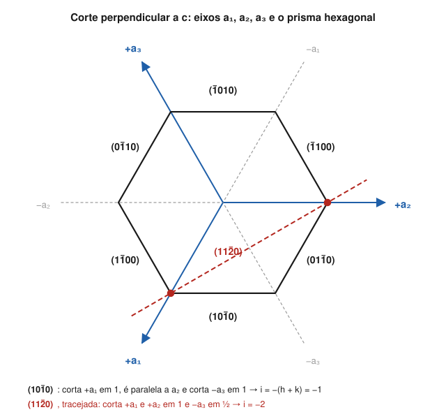

# Aula 03: Direções [uvw] e o sistema hexagonal de Miller-Bravais (hkil)

**ID:** mineralogia-m05-a03
**Módulo:** [[05-miller-e-projecao-modulo|Módulo 05 — Eixos cristalográficos, índices de Miller e projeção estereográfica]]
**Duração estimada:** ~30 min (com a nota de consulta como leitura opcional)
**Nível:** ensino médio, sem geologia prévia (contrato `ensino-medio-sem-geologia-v1`)
**Objetivo:** escrever direções como [uvw] e famílias de direções como ⟨uvw⟩, e indexar faces dos sistemas hexagonal e trigonal com os quatro índices (hkil), convertendo entre três e quatro índices.
**Pré-requisito:** [[05-miller-e-projecao-aula-02-indices-de-miller-de-interceptos-a-hkl-e-formas|Aula 02]] (índices de Miller de faces).

## Vocabulário desta aula

| Termo | O que quer dizer |
|---|---|
| **direção [uvw]** | uma reta do cristal (aresta, eixo, alinhamento de átomos), indicada pelo menor vetor inteiro u·a + v·b + w·c paralelo a ela. |
| **família ⟨uvw⟩** | todas as direções equivalentes a [uvw] pela simetria. |
| **índices de Miller-Bravais (hkil)** | (também chamados de Bravais-Miller) os quatro índices de face usados com os eixos a₁, a₂, a₃ e c; o terceiro é i = −(h + k). |
| **prisma de primeira ordem** | no hexagonal, a forma {101̄0}: faces verticais que cortam dois eixos a. |
| **prisma de segunda ordem** | a forma {112̄0}: faces verticais que cortam os três eixos a. |
| **pinacoide basal** | a forma {0001}: o par de faces perpendiculares a c. |

## Antes de começar, você precisa saber

- Os eixos hexagonais a₁, a₂, a₃ a 120° e c perpendicular: [[05-miller-e-projecao-aula-01-eixos-cristalograficos-e-parametros-de-cela-por-sistema|aula 01]].
- A receita interceptos → inversos → inteiros: [[05-miller-e-projecao-aula-02-indices-de-miller-de-interceptos-a-hkl-e-formas|aula 02]].
- **Matemática reativada:** um vetor como "andar 2 passos em a e 1 em b" é a soma 2a + 1b; multiplicar todos os passos pelo mesmo número não muda a direção, só o comprimento.

## Ao final você vai conseguir

- `mineralogia-m05-oa02` — Atribuir índices de Miller (hkl) e de Miller-Bravais (hkil) a faces, formas {hkl} e direções [uvw]. *(Nesta aula: direções e índices de quatro números.)*

## Conteúdo

### Direções: colchetes em vez de parênteses

Uma direção é uma reta que passa pelo centro do cristal. Para nomeá-la, parta da origem e ande **u** unidades ao longo de a, **v** ao longo de b e **w** ao longo de c; a direção é a da seta que liga a origem ao ponto de chegada. Reduza aos menores inteiros e escreva entre **colchetes**: **[uvw]**.

Aqui **não se inverte nada**. Os números são os passos, não interceptos. Isso é o que mais confunde quem acabou de aprender faces.

- O eixo a é [100]; o eixo b, [010]; o eixo c, [001]. O sentido contrário de c é [001̄].
- A diagonal do cubo, que vai do centro até um vértice, é [111].
- A diagonal da face ab do cubo é [110].

Equivalentes pela simetria formam uma família, entre **sinais de menor e maior**: ⟨111⟩ são as quatro diagonais do cubo (oito sentidos). Os quatro tipos de parêntese são o vocabulário de todo o resto do curso:

| Símbolo | O que nomeia |
|---|---|
| (hkl) | uma face (ou plano) |
| {hkl} | uma forma: as faces equivalentes |
| [uvw] | uma direção |
| ⟨uvw⟩ | uma família de direções equivalentes |

### Direção e face com os mesmos números

No cúbico, a direção [hkl] é **perpendicular** à face (hkl): [111] é a normal de (111), [100] a de (100). É uma comodidade só do cúbico, porque lá os eixos são iguais e perpendiculares. Num tetragonal, [001] continua perpendicular a (001), mas [101] **não** é perpendicular a (101), a não ser que c fosse igual a a. No monoclínico, nem [001] é perpendicular a (001), porque c é inclinado em relação ao plano ab (β ≠ 90°).

> [!question] Pare e explique
> Por que a regra "[hkl] perpendicular a (hkl)" depende de os três eixos serem iguais e perpendiculares? Pense no tijolo da aula 02 do módulo 04.

### Por que o hexagonal precisa de quatro índices

Com só três eixos (a₁, a₂, c), as seis faces do prisma hexagonal, que a simetria torna equivalentes, recebem índices de aparência diferente: (100), (010), (1̄10), (1̄00), (01̄0), (11̄0). Ninguém reconhece de olho que são da mesma forma.

A solução, de Bravais, é usar os **três** eixos a, mais c. Uma face recebe quatro índices **(hkil)**, na ordem a₁, a₂, a₃, c. Como a₃ não é independente (a₁ + a₂ + a₃ = 0), o terceiro índice também não é:

**i = −(h + k)**, ou seja, **h + k + i = 0**.

Com isso, as seis faces do prisma ficam (101̄0), (011̄0), (1̄100), (1̄010), (01̄10), (11̄00): todas são arranjos de 1, 0 e −1, e a família salta aos olhos.

*Figura 3. Corte perpendicular a c com os eixos a₁, a₂, a₃ e as seis faces do prisma de primeira ordem; em vermelho, o traço de uma face do prisma de segunda ordem. O que observar: (101̄0) corta +a₁ e −a₃ e é paralela a a₂; (112̄0) corta os três eixos, e o terceiro índice, −2, sai da regra h + k + i = 0.*

### Formas hexagonais de referência

| Forma | Faces | O que é |
|---|---|---|
| {0001} | 2 | pinacoide basal, perpendicular a c |
| {101̄0} | 6 | prisma de primeira ordem |
| {112̄0} | 6 | prisma de segunda ordem, girado 30° em relação ao primeiro |
| {101̄1} | 6 (trigonal 3̄m, 32) ou 12 (6/mmm) | romboedro ou bipirâmide, conforme a classe |

No quartzo, as faces da ponta são os romboedros **r {101̄1}** e **z {011̄1}** (os "dois romboedros alternados" do módulo 04, aula 06), e o prisma é **m {101̄0}**.

### Converter entre três e quatro índices

- **Faces:** de (hkil) para (hkl), simplesmente **apague i**: (101̄1) → (101). De (hkl) para (hkil), **acrescente i = −(h + k)**: (110) → (112̄0).
- **Direções:** use **três índices** [UVW], referidos a a₁, a₂ e c: o eixo c é [001] e o eixo a₁ é [100]. É o que o resto do curso usa.

> [!note] Para consulta (não precisa decorar)
> Existe uma versão de quatro índices para direções, [uvtw], com u + v + t = 0; nela o eixo a₁ fica [21̄1̄0]. A conversão é U = u − t, V = v − t, W = w. Para direções, **não** vale o atalho de apagar o terceiro índice: apagar o t de [21̄1̄0] daria [21̄0], que não é o eixo a₁.

### A mesma face, dois nomes: a calcita

O índice depende da cela de referência. A clivagem da calcita, que dá os famosos romboedros, é **{101̄4}** quando se usa a cela medida por raios X (c ≈ 17,06 Å). Os textos antigos, que escolhiam os eixos pela morfologia, usavam um c quatro vezes menor e chamavam a mesma clivagem de **{101̄1}**. Não há contradição: é o mesmo plano, medido com outra régua. Ao ler um índice de calcita, verifique qual cela o texto usa.

## Exemplo trabalhado

**Problema.** Um cristal de quartzo mostra: faces verticais de prisma; uma face de ponta que corta +a₁ e −a₃ a uma unidade e c a uma unidade; e uma aresta ao longo do comprimento do prisma. (a) Indexe a face de prisma que corta +a₁ e −a₃ e é paralela a a₂ e a c. (b) Indexe a face de ponta e converta para três índices. (c) Nomeie a direção da aresta, com três e com quatro índices.

**Passo 1. Prisma.** Interceptos: a₁ = 1, a₂ = ∞, a₃ = −1, c = ∞. Inversos: 1, 0, −1, 0 → **(101̄0)**. Conferência: h + k + i = 1 + 0 − 1 = 0.

**Passo 2. Ponta.** Interceptos: a₁ = 1, a₂ = ∞, a₃ = −1, c = 1. Inversos: 1, 0, −1, 1 → **(101̄1)**, uma face do romboedro r. Apagando i: **(101)**.

**Passo 3. Aresta do prisma.** É paralela a c: **[001]** com três índices e **[0001]** com quatro.

**Método geral:** para faces, use a receita da aula 02 nos quatro eixos e confira h + k + i = 0; para direções, prefira [UVW] com a₁, a₂, c.

## Erros comuns

- **Inverter os números de uma direção.** Direção é passo, não intercepto: [210] é "2 em a, 1 em b", sem inversão.
- **Esquecer de conferir h + k + i = 0.** Um (hkil) que não soma zero está errado, mesmo que pareça plausível.
- **Apagar o t de uma direção de quatro índices** (nota de consulta). Para faces, apagar i funciona; para direções, não.
- **Tomar [hkl] como normal de (hkl) fora do cúbico.** É verdade só quando os eixos são iguais e perpendiculares.

## O que não concluir

- Que os quatro índices sejam obrigatórios. Três índices descrevem tudo; os quatro só tornam a simetria visível.
- Que {101̄1} seja sempre um romboedro. No quartzo (32) e na calcita (3̄m), sim; numa classe hexagonal como 6/mmm, a mesma forma é uma bipirâmide de 12 faces.
- Que um índice de calcita de um livro antigo esteja errado. Pode só estar referido à cela morfológica.

## Recap relâmpago

- Direção [uvw] = passos u·a + v·b + w·c, sem inversão; família ⟨uvw⟩.
- (hkl) face, {hkl} forma, [uvw] direção, ⟨uvw⟩ família de direções.
- [hkl] ⟂ (hkl) só no cúbico.
- Hexagonal e trigonal: (hkil) com i = −(h + k); prisma {101̄0}, {112̄0}, pinacoide {0001}.
- Face: apague i para ter (hkl). Direção: use [UVW]; nunca apague t.
- Calcita: clivagem {101̄4} na cela estrutural = {101̄1} na cela morfológica antiga.

## Próxima aula

Em [[05-miller-e-projecao-aula-04-zonas-e-a-lei-de-weiss|Aula 04 — Zonas e a lei de Weiss]], faces e direções se encontram: as faces cujas arestas são paralelas a uma mesma direção formam uma zona, e uma conta de uma linha diz se uma face pertence a ela.

## Fontes consultadas

- Klein, C. & Dutrow, B., *Manual of Mineral Science*, 23ª ed., Wiley (direções, índices de Miller-Bravais, formas hexagonais).
- IUCr, *Online Dictionary of Crystallography*, verbetes "Miller-Bravais indices" e "Miller indices" (consultado em 2026-10-04).
- *Handbook of Mineralogy*, fichas de quartzo (a = 4,9133 Å, c = 5,4053 Å) e calcita (a = 4,9896 Å, c = 17,0610 Å, R3̄c), conferidas por busca em 2026-10-04.
- Clivagem da calcita: {101̄4} na cela estrutural (Klein & Dutrow); a equivalência com {101̄1} da cela morfológica foi conferida por cálculo: c(estrutural)/a = 17,061/4,990 = 3,419 = 4 × 0,855, e 0,854 é a razão axial morfológica clássica da calcita (Dana).

<!--
nivel: ensino-medio-sem-geologia-v1
palavras_corpo: 1274
cobertura:
  mineralogia-m05-oa02: [Conteúdo, Exemplo trabalhado]
figuras:
  - 05-miller-e-projecao-fig-03-miller-bravais.svg
alegacoes_auditaveis:
  - claim_id: CRI-DIR-NOTACAO-001
    claim: "(hkl) face, {hkl} forma, [uvw] direcao, <uvw> familia de direcoes; direcao = u a + v b + w c, sem inversao."
    risk: conceito
    source: "IUCr Online Dictionary; Klein & Dutrow"
    audit: "verificado em 2026-10-04"
  - claim_id: CRI-DIR-NORMAL-001
    claim: "[hkl] perpendicular a (hkl) no cubico; no tetragonal [001] perpendicular a (001) mas [101] nao e perpendicular a (101) (salvo c = a); no monoclinico [001] nao e perpendicular a (001)."
    risk: conceito
    source: "geometria dos eixos; Klein & Dutrow"
    audit: "verificado em 2026-10-04"
  - claim_id: CRI-MB-INDICE-001
    claim: "Miller-Bravais (hkil), ordem a1 a2 a3 c, i = -(h+k); prisma de 1a ordem {10-10}, 2a ordem {11-20}, pinacoide {0001}; as seis faces de {10-10} listadas."
    risk: conceito
    source: "Klein & Dutrow; IUCr Online Dictionary"
    audit: "corrigido em 2026-10-04 (🟡: sinonimo Bravais-Miller registrado, coerente com a auditoria do m04)"
  - claim_id: CRI-MB-BRAVAIS-001
    claim: "O uso dos quatro eixos (indices de quatro numeros) e atribuido a Bravais."
    risk: fato
    source: "IUCr Online Dictionary (Miller-Bravais indices)"
    audit: "verificado em 2026-10-04"
  - claim_id: CRI-MB-QUARTZO-001
    claim: "Quartzo: prisma m {10-10}, romboedros r {10-11} e z {01-11}."
    risk: fato
    source: "Klein & Dutrow; Frondel (Dana's System vol. III)"
    audit: "verificado em 2026-10-04"
  - claim_id: CRI-MB-DIRECAO-001
    claim: "Direcoes de quatro indices [uvtw] com u+v+t = 0; conversao U = u - t, V = v - t, W = w; a1 = [100] = [2 -1 -1 0]; apagar t nao da a direcao certa."
    risk: conceito
    source: "International Tables vol. A; calculo conferido em Python"
    audit: "verificado em 2026-10-04"
  - claim_id: CRI-MB-CALCITA-001
    claim: "Clivagem da calcita {10-14} na cela estrutural (c ~17,06 A); {10-11} na cela morfologica antiga, de c quatro vezes menor."
    risk: conceito
    source: "Handbook of Mineralogy (cela R-3c); calculo: c_estrutural/c_morfologico = 4"
    audit: "verificado em 2026-10-04"
  - claim_id: CRI-MB-FORMA-001
    claim: "{10-11} e romboedro de 6 faces em 3-barra m e 32 e bipiramide de 12 faces em 6/mmm."
    risk: numero
    source: "International Tables vol. A"
    audit: "verificado em 2026-10-04"
-->
