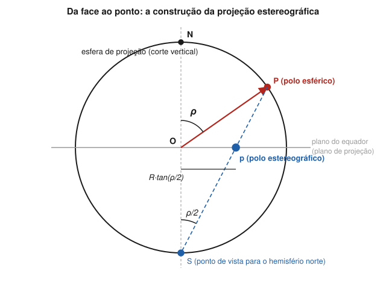
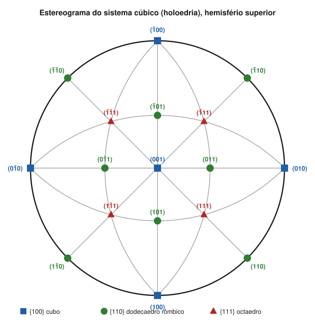

# Aula 05: A projeção estereográfica e a rede de Wulff

**ID:** mineralogia-m05-a05
**Módulo:** [[05-miller-e-projecao-modulo|Módulo 05 — Eixos cristalográficos, índices de Miller e projeção estereográfica]]
**Duração estimada:** ~28 min
**Nível:** ensino médio, sem geologia prévia (contrato `ensino-medio-sem-geologia-v1`)
**Objetivo:** construir e ler a projeção estereográfica das faces de um cristal: polos, círculo primitivo, hemisférios, coordenadas φ e ρ, zonas como grandes círculos. *(Os elementos de simetria no estereograma ficam para a aula 07.)*
**Pré-requisito:** [[05-miller-e-projecao-aula-04-zonas-e-a-lei-de-weiss|Aula 04]] (zonas) e [[04-simetria-e-morfologia-aula-01-o-estado-cristalino-leis-de-steno-e-de-hauy|módulo 04, aula 01]] (ângulo interfacial medido entre as normais).

## Vocabulário desta aula

| Termo | O que quer dizer |
|---|---|
| **normal de uma face** | a reta perpendicular à face, saindo do centro do cristal. |
| **polo** | o ponto onde a normal de uma face fura a esfera de projeção; depois de projetado, o ponto que representa a face. |
| **esfera de projeção** | uma esfera imaginária com o cristal no centro. |
| **círculo primitivo** | o equador da esfera, que vira a borda do desenho. |
| **grande círculo** | círculo da esfera cujo centro é o centro da esfera (como um meridiano); uma zona aparece como grande círculo. |
| **pequeno círculo** | círculo da esfera que não passa pelo centro dela (como um paralelo de latitude). |
| **estereograma** | o desenho resultante: um círculo com os polos das faces e os elementos de simetria. |
| **rede de Wulff** | a grade de grandes e pequenos círculos usada para desenhar e medir no estereograma. |

## Antes de começar, você precisa saber

- Que o ângulo interfacial se mede entre as normais das faces: [[04-simetria-e-morfologia-aula-01-o-estado-cristalino-leis-de-steno-e-de-hauy|módulo 04, aula 01]].
- Zona e eixo de zona: [[05-miller-e-projecao-aula-04-zonas-e-a-lei-de-weiss|aula 04]].
- **Matemática reativada:** num triângulo retângulo, a tangente de um ângulo é o cateto oposto dividido pelo adjacente; com calculadora, tan 45° = 1 e tan 30° ≈ 0,577.

## Ao final você vai conseguir

- `mineralogia-m05-oa04` — Construir e ler uma projeção estereográfica de faces e elementos de simetria na rede de Wulff. *(Nesta aula: as faces; os elementos de simetria, na aula 07.)*

## Conteúdo

### O problema: desenhar ângulos 3D numa folha

O que define um cristal são os **ângulos** entre faces (lei de Steno), não o tamanho delas. Um desenho em perspectiva distorce ângulos. A projeção estereográfica resolve isso em dois passos e mantém as relações angulares mensuráveis.

### Passo 1: da face ao polo esférico

Imagine o cristal minúsculo no centro de uma esfera grande. De cada face, trace a normal até ela furar a esfera: esse ponto é o **polo esférico** da face. O tamanho da face desaparece; sobra só a orientação. Faces paralelas a c (as do prisma) têm normais horizontais e furam a esfera no equador. A face (001), perpendicular a c, fura no polo norte.

### Passo 2: do polo esférico ao ponto no papel

Agora ligue cada polo do hemisfério norte ao **polo sul** da esfera, o ponto de vista. Onde essa linha atravessa o plano do equador fica o ponto do desenho. O equador vira a borda: o **círculo primitivo**.

*Figura 5. Corte vertical da esfera. O que observar: o polo esférico P, a um ângulo ρ do eixo vertical, é ligado ao polo sul S; o cruzamento com o plano do equador dá o ponto p, a uma distância R·tan(ρ/2) do centro.*

A distância do ponto ao centro é **r = R · tan(ρ/2)**, em que R é o raio do primitivo e ρ é o ângulo entre a normal da face e o eixo vertical. Alguns valores, em frações de R:

| ρ (da vertical) | 0° | 30° | 45° | 54,7° | 60° | 90° |
|---|---|---|---|---|---|---|
| r / R | 0 | 0,268 | 0,414 | 0,518 | 0,577 | 1 |

Faces horizontais caem no **centro**; faces verticais caem **sobre o primitivo**; as inclinadas, entre os dois, mais espremidas perto do centro que perto da borda.

### Hemisfério de baixo e símbolos

Os polos do hemisfério **sul** são projetados ligando-os ao polo **norte**, e caem dentro do mesmo círculo. Para não confundir, usa-se **ponto cheio (•)** para polos de cima e **círculo aberto (○)** para polos de baixo. Uma face de cima e uma de baixo que caem no mesmo lugar aparecem como ponto dentro de círculo. Polos sobre o primitivo pertencem aos dois hemisférios.

### Orientação e coordenadas

A convenção dos livros de mineralogia coloca o eixo **c na vertical**, de modo que (001) fica no **centro**. Com os eixos da aula 01 (a para o observador, b para a direita), o polo de **(010) fica à direita** do primitivo e o de **(100) embaixo**, na posição do observador.

A posição de um polo se dá por dois ângulos: **ρ**, medido a partir de c (do centro para fora; 90° no primitivo), e **φ**, medido no primitivo a partir do polo (010), **no sentido horário**. Assim (010) tem φ = 0°, ρ = 90°; (100) tem φ = 90°, ρ = 90°; (001) tem ρ = 0°.

### Grandes círculos e zonas

Todas as faces de uma zona têm normais perpendiculares ao eixo de zona, e essas normais caem num **grande círculo** da esfera. No estereograma, um grande círculo vertical aparece como um **diâmetro**; o horizontal é o próprio **primitivo**; um inclinado aparece como **arco** que corta o primitivo em dois pontos diametralmente opostos. Logo: **faces tautozonais ficam sobre um mesmo grande círculo**, e o eixo de zona é o ponto a 90° de todos os pontos desse círculo, o polo da zona.

Uma propriedade torna a projeção ideal para cristalografia: **círculos na esfera viram círculos no papel**, e os ângulos entre polos podem ser medidos ao longo dos grandes círculos com a rede de Wulff (aula 06). A rede foi proposta por Georg (Yuri) Wulff em 1902. Na geologia estrutural usa-se outra rede, a de **Schmidt**, de igual área, boa para contar densidade de medidas; ela não preserva a forma dos círculos e não é a ferramenta da cristalografia morfológica.

*Figura 6. Polos das faces do cubo {100}, do dodecaedro rômbico {110} e do octaedro {111} num cristal cúbico, hemisfério superior; as linhas cinza são grandes círculos (zonas) que a aula 07 vai reler como espelhos. O que observar: (001) no centro, (010) à direita, (100) embaixo; os polos {111} a 54,7° do centro; cada polo {110} está no meio do arco entre dois polos {100}, e todos os polos de uma linha cinza são tautozonais.*

> [!question] Pare e explique
> Por que a face (001) cai exatamente no centro, e as faces de qualquer prisma vertical caem todas sobre o primitivo?

## Exemplo trabalhado

**Problema.** Num primitivo de raio R = 10 cm, onde caem os polos de (001), (010), (100), (011), (101) e (111) de um cristal cúbico? Quais ficam sobre o primitivo e quais formam uma zona com (001) e (010)?

**Passo 1. As faces dos eixos.** (001) é perpendicular a c: ρ = 0°, **no centro**. (010) e (100) são verticais: ρ = 90°, **sobre o primitivo**, (010) à direita (φ = 0°) e (100) embaixo (φ = 90°).

**Passo 2. (011).** A normal fica a meio caminho entre [001] e [010]: ρ = 45°, na direção de (010), φ = 0°. r = 10 · tan(22,5°) ≈ 10 · 0,414 ≈ **4,1 cm** à direita do centro.

**Passo 3. (101).** Mesmo raciocínio, na direção de (100): ρ = 45°, φ = 90°, **4,1 cm** abaixo do centro.

**Passo 4. (111).** A normal fica a meio caminho entre (010) e (100) no azimute, **φ = 45°**, e a ρ = 54,7° de c (o ângulo será conferido na aula 06). r = 10 · tan(27,4°) ≈ 10 · 0,518 ≈ **5,2 cm**, no quadrante inferior direito.

**Passo 5. A zona.** (001), (011) e (010) estão no mesmo diâmetro horizontal: são tautozonais, e pela aula 04 o eixo da zona é [100] (1·0 + 0·1 + 0·1 = 0 para as três). Um grande círculo vertical aparece como diâmetro, como esta aula previu. Compare tudo com a figura 6.

**Método geral:** ache ρ (ângulo da normal com c) e φ (a partir de (010), sentido horário); calcule r = R·tan(ρ/2); marque; confira zonas pelos grandes círculos.

## Erros comuns

- **Projetar a face em vez da normal.** O polo representa a direção perpendicular à face; uma face vertical cai no primitivo, não no centro.
- **Achar que a distância ao centro é proporcional a ρ.** É R·tan(ρ/2): 45° não cai na metade do raio, e sim a 0,414 R.
- **Esquecer o símbolo aberto.** Um polo de baixo marcado como cheio parece uma face que não existe em cima.
- **Usar a rede de Schmidt para medir ângulos de cristal.** É a rede errada para este trabalho.

## O que não concluir

- Que o estereograma mostre o tamanho ou a forma das faces. Ele só mostra orientações.
- Que pontos próximos no papel sejam faces de ângulo pequeno entre si. A escala muda do centro para a borda; o ângulo só se mede na rede (aula 06).
- Que toda linha desenhada no estereograma seja um elemento de simetria. Grandes círculos são, antes de tudo, zonas; a aula 07 mostra quando são também espelhos.

## Recap relâmpago

- Face → normal → polo esférico → projeção pelo polo oposto → ponto no plano do equador.
- r = R·tan(ρ/2): horizontal no centro, vertical no primitivo.
- • hemisfério de cima; ○ de baixo.
- c no centro, (010) à direita (φ = 0°), (100) embaixo (φ = 90°); ρ medido a partir de c.
- Zona = grande círculo; rede de Wulff (1902), não a de Schmidt.

## Próxima aula

Em [[05-miller-e-projecao-aula-06-medir-angulos-na-rede-de-wulff-faces-zonas-e-elementos-de-simetria|Aula 06 — Medir ângulos na rede de Wulff]], a rede deixa de ser enfeite: com papel vegetal e um alfinete, você mede ângulos entre faces, traça zonas e acha eixos de zona.

## Fontes consultadas

- Whittaker, E. J. W., *The Stereographic Projection*, IUCr Commission on Crystallographic Teaching, Teaching Pamphlet 11 (construção, propriedades, redes de Wulff e de Schmidt).
- Klein, C. & Dutrow, B., *Manual of Mineral Science*, 23ª ed., Wiley (projeção esférica e estereográfica; estereogramas das classes).
- Nelson, S. A., *Stereographic Projection of Crystal Faces*, EENS 211, Tulane University (convenção φ a partir de (010) no sentido horário e ρ a partir de c; conferido por busca em 2026-10-04).
- IUCr, Georg (Yuri) Viktorovich Wulff, *IUCr Newsletter* 30(2) (rede de Wulff, 1902; conferido por busca em 2026-10-04).
- Figuras 5 e 6 geradas por cálculo (projeção r = R·tan(ρ/2) dos vetores normais), sem desenho à mão.

<!--
nivel: ensino-medio-sem-geologia-v1
palavras_corpo: 1267
cobertura:
  mineralogia-m05-oa04: [Conteúdo, Exemplo trabalhado]
figuras:
  - 05-miller-e-projecao-fig-05-construcao-estereografica.svg
  - 05-miller-e-projecao-fig-06-estereograma-cubico.svg
alegacoes_auditaveis:
  - claim_id: CRI-EST-CONSTR-001
    claim: "Projecao estereografica: normal da face -> polo esferico -> ligacao ao polo oposto -> ponto no plano do equador; r = R tan(rho/2)."
    risk: conceito
    source: "Whittaker (IUCr pamphlet 11); Klein & Dutrow"
    audit: "verificado em 2026-10-04"
  - claim_id: CRI-EST-TABELA-001
    claim: "r/R = 0; 0,268; 0,414; 0,518; 0,577; 1 para rho = 0, 30, 45, 54,7, 60, 90 graus."
    risk: numero
    source: "calculo"
    audit: "verificado em 2026-10-04"
  - claim_id: CRI-EST-SIMBOLOS-001
    claim: "Polo superior ponto cheio; polo inferior circulo aberto; polos do primitivo pertencem aos dois hemisferios."
    risk: conceito
    source: "Klein & Dutrow; Whittaker"
    audit: "verificado em 2026-10-04"
  - claim_id: CRI-EST-CONV-001
    claim: "c no centro; (010) a direita; (100) embaixo; phi medido a partir de (010) no sentido horario; rho medido a partir de c."
    risk: conceito
    source: "Nelson (Tulane, EENS 211) por busca; Klein & Dutrow"
    audit: "verificado em 2026-10-04"
  - claim_id: CRI-EST-PROPR-001
    claim: "Grandes circulos: verticais como diametros, horizontal como primitivo, inclinados como arcos que cortam o primitivo em pontos diametralmente opostos; circulos viram circulos; faces tautozonais num grande circulo."
    risk: conceito
    source: "Whittaker; Klein & Dutrow"
    audit: "verificado em 2026-10-04"
  - claim_id: CRI-EST-WULFF-001
    claim: "Rede de Wulff proposta por G. (Yu.) V. Wulff em 1902; rede de Schmidt e de igual area, usada em geologia estrutural."
    risk: data
    source: "IUCr Newsletter 30(2) (Wulff); Whittaker"
    audit: "verificado em 2026-10-04"
  - claim_id: CRI-EST-111-001
    claim: "Cubico: (111) rho = 54,7, phi = 45, r = 0,518 R; (011) rho = 45, phi = 0; (101) rho = 45, phi = 90; r = 0,414 R; (001), (011), (010) na zona [100]."
    risk: numero
    source: "calculo conferido em Python"
    audit: "verificado em 2026-10-04"
-->
