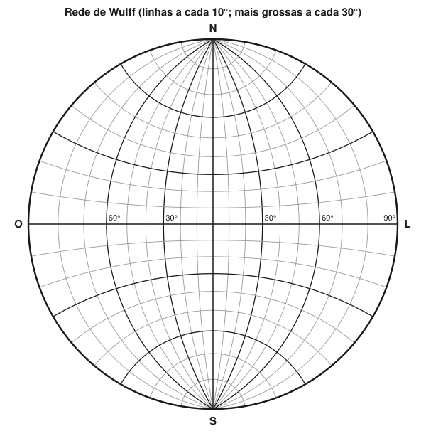
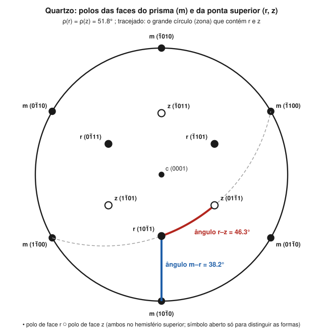

# Aula 06: Medir ângulos na rede de Wulff — faces, zonas e elementos de simetria

**ID:** mineralogia-m05-a06
**Módulo:** [[05-miller-e-projecao-modulo|Módulo 05 — Eixos cristalográficos, índices de Miller e projeção estereográfica]]
**Duração estimada:** ~30 min (com a prática da rede)
**Nível:** ensino médio, sem geologia prévia (contrato `ensino-medio-sem-geologia-v1`)
**Objetivo:** usar a rede de Wulff para plotar polos a partir de φ e ρ, medir o ângulo entre duas faces ou duas direções, traçar uma zona e achar o seu eixo, e conferir o resultado por cálculo no sistema cúbico.
**Pré-requisito:** [[05-miller-e-projecao-aula-05-a-projecao-estereografica-e-a-rede-de-wulff|Aula 05]] (construção e convenções da projeção).

## Vocabulário desta aula

| Termo | O que quer dizer |
|---|---|
| **meridiano da rede** | cada grande círculo da rede de Wulff; todos passam pelos pontos N e S do primitivo. |
| **paralelo da rede** | cada pequeno círculo da rede, centrado no eixo N-S; serve de régua ao longo dos meridianos. |
| **papel vegetal (overlay)** | a folha transparente onde se desenha, presa no centro da rede por um alfinete e girada sobre ela. |
| **polo de uma zona** | o ponto a 90° de todos os pontos do grande círculo da zona; é o eixo de zona projetado. |
| **produto escalar** | conta que dá o ângulo entre duas direções a partir dos seus componentes (usada aqui só no cúbico). |

## Antes de começar, você precisa saber

- Convenções: c no centro, (010) à direita, φ a partir de (010) no sentido horário, ρ a partir de c: [[05-miller-e-projecao-aula-05-a-projecao-estereografica-e-a-rede-de-wulff|aula 05]].
- Zona e eixo de zona, e a zona r–z do quartzo calculada: [[05-miller-e-projecao-aula-04-zonas-e-a-lei-de-weiss|aula 04]].
- **Matemática reativada:** o cosseno de um ângulo; com calculadora, se cos θ = 0,577, então θ = arccos(0,577) ≈ 54,7°.

## Ao final você vai conseguir

- `mineralogia-m05-oa05` — Medir ângulos interfaciais e entre direções com a rede de Wulff.

## Conteúdo

### Como a rede funciona

A rede de Wulff é a projeção estereográfica de uma esfera com meridianos e paralelos, desenhada com o eixo N-S **no plano do papel**. Por isso todos os meridianos (grandes círculos) passam pelos pontos N e S, e os paralelos (pequenos círculos) cruzam os meridianos como degraus de uma escada. Redes impressas para uso costumam ter linhas a cada 2°; a figura 7 mostra uma a cada 10°, para leitura.

*Figura 7. Rede de Wulff com linhas a cada 10° (mais grossas a cada 30°). O que observar: ao longo do diâmetro L-O, as marcas de 30° e 60° não estão a um terço e dois terços do raio, mas mais perto do centro; é o efeito de r = R·tan(ρ/2).*

**A regra de ouro:** ângulos só se medem **ao longo de um grande círculo**, isto é, ao longo de um meridiano da rede ou do primitivo. Para trazer dois polos para o mesmo meridiano, gira-se o **papel vegetal**, nunca a rede, em torno do alfinete no centro.

### Os cinco procedimentos

**1. Plotar um polo dados φ e ρ.** Marque no primitivo o ponto de referência (010). A partir dele, no sentido horário, marque o ângulo φ. Gire o papel até essa marca ficar sobre o diâmetro L-O da rede; conte ρ do centro para fora, ao longo do diâmetro. Marque o polo e volte o papel à posição inicial.

**2. Medir o ângulo entre dois polos.** Gire o papel até os dois polos ficarem **sobre o mesmo meridiano**. Conte os graus entre eles ao longo desse meridiano, pelos cruzamentos com os paralelos. Se um dos polos está no centro, basta girar o outro até um diâmetro e contar.

**3. Traçar a zona de dois polos.** Com os dois polos no mesmo meridiano (passo 2), copie esse meridiano no papel: é o grande círculo da zona. Todas as faces da zona estão sobre ele.

**4. Achar o eixo de zona.** Com o meridiano da zona sobre a rede, conte **90°** ao longo do diâmetro L-O, a partir do ponto onde a zona o cruza, passando pelo centro. O ponto obtido é o polo da zona.

**5. Ângulo entre duas zonas.** É o ângulo entre os seus polos (procedimento 2), ou, o que dá o mesmo, o ângulo no ponto onde os dois grandes círculos se cruzam.

Direções e elementos de simetria se tratam do mesmo jeito: um eixo 3 ou uma aresta é um ponto no estereograma, e o ângulo entre dois deles se mede como entre dois polos. No cúbico, o ângulo entre um eixo 4 e um eixo 3 é o mesmo que entre (100) e (111).

> [!question] Pare e explique
> Por que não se pode medir o ângulo entre dois polos com uma régua reta no papel, mesmo quando eles estão perto um do outro?

### O caso do quartzo

*Figura 8. Polos das faces do prisma m e da ponta superior r e z do quartzo, calculados a partir da cela do* Handbook of Mineralogy *(a = 4,913 Å, c = 5,405 Å). O que observar: m(101̄0), r(101̄1) e c(0001) estão no mesmo diâmetro; r e z estão sobre um arco (tracejado) que também passa por m(11̄00) e m(1̄100), a zona [1̄1̄1] calculada na aula 04.*

### Conferir por cálculo

O gráfico dá graus inteiros; o cálculo dá os decimais quando os parâmetros são conhecidos. No **cúbico**, o ângulo θ entre as normais de (h₁k₁l₁) e (h₂k₂l₂) sai do produto escalar, porque os eixos são iguais e perpendiculares:

cos θ = (h₁h₂ + k₁k₂ + l₁l₂) / [√(h₁² + k₁² + l₁²) · √(h₂² + k₂² + l₂²)]

- (100)∧(111): cos θ = 1/√3 = 0,577 → **θ = 54,7°**.
- (100)∧(110): cos θ = 1/√2 → **45°**.
- (111)∧(11̄1): cos θ = 1/3 → **70,5°**.
- (110)∧(011): cos θ = 1/2 → **60°**.

Esses valores são os mesmos para halita, fluorita, galena ou granada. Nos outros sistemas, a fórmula precisa dos parâmetros de cela, e o mesmo par de índices dá ângulos diferentes de mineral para mineral (aula 01).

## Exemplo trabalhado

**Problema.** Na figura 8 (quartzo): (a) meça m(101̄0)∧r(101̄1); (b) meça r(101̄1)∧z(011̄1); (c) trace a zona de r e z e diga que outras faces ela contém; (d) qual é o ângulo interno entre as faces m e r, o que se mediria com um goniômetro de contato?

**Passo 1. ρ de r.** Plotado a partir da cela: ρ(r) = 51,8° do centro.

**Passo 2. (a) m∧r.** m e r estão no **mesmo diâmetro** (o de baixo). Conte ao longo dele: m está a 90°, r a 51,8°. Ângulo = 90° − 51,8° = **38,2°**.

**Passo 3. (b) r∧z.** Eles não estão no mesmo diâmetro: gire o papel até r e z caírem no mesmo meridiano da rede e conte os graus entre eles: **≈ 46°** (o cálculo dá 46,3°).

**Passo 4. (c) A zona r–z.** Copie o meridiano do passo 3. Ele toca o primitivo em dois pontos opostos, que são os polos de **m(11̄00)** e **m(1̄100)**: essas faces de prisma são tautozonais com r e z, como a lei das zonas previu na aula 04.

**Passo 5. (d) Ângulo interno.** O estereograma dá o ângulo entre normais, 38,2°. O ângulo "por dentro" entre as faces é 180° − 38,2° = **141,8°** (convenção do módulo 04, aula 01).

**Passo 6. Conferência.** Os valores 38,2° e 46,3° vêm da cela; um goniômetro num cristal real de quartzo, grande ou pequeno, dá os mesmos ângulos dentro do erro de medida (lei de Steno).

**Método geral:** coloque os dois pontos no mesmo grande círculo girando o papel; conte ao longo dele; para o ângulo interno, subtraia de 180°.

## Erros comuns

- **Medir ao longo de um paralelo.** Os pequenos círculos não medem ângulo entre polos; contar sobre eles dá valores errados, sedutoramente parecidos com os certos para polos perto do equador.
- **Girar a rede em vez do papel.** Perde-se a referência (010) e todos os φ seguintes.
- **Confundir ângulo entre normais com ângulo interno.** O estereograma dá o primeiro; o goniômetro de contato, o segundo; somam 180°.
- **Usar a fórmula do cúbico em outro sistema.** Ela só vale com eixos iguais e perpendiculares.

## O que não concluir

- Que a precisão gráfica seja suficiente para distinguir minerais de razões axiais próximas. Para isso, mede-se com goniômetro e calcula-se, ou usa-se difração (módulo 18).
- Que dois polos sobre o mesmo meridiano em uma posição do papel estejam sempre numa zona "especial". Quaisquer dois polos definem uma zona; ela só é notável se contiver outras faces.
- Que os ângulos do quartzo valham para outro mineral trigonal com faces de mesmos índices. Eles dependem de c/a.

## Recap relâmpago

- Ângulo só se mede ao longo de grande círculo: gire o papel até os dois pontos ficarem no mesmo meridiano.
- Plotar: φ no primitivo a partir de (010), sentido horário; ρ do centro ao longo do diâmetro L-O.
- Zona: copie o meridiano; eixo de zona: 90° ao longo do diâmetro L-O.
- Cúbico: cos θ = (h₁h₂ + k₁k₂ + l₁l₂)/(|n₁||n₂|); (100)∧(111) = 54,7°, (111)∧(11̄1) = 70,5°.
- Quartzo: m∧r = 38,2°, r∧z = 46,3°; ângulo interno = 180° − ângulo entre normais.

## Próxima aula

Em [[05-miller-e-projecao-aula-07-simetria-no-estereograma-elementos-e-forma-geral-das-classes|Aula 07 — Simetria no estereograma]], a última do módulo: os espelhos e eixos entram no desenho, e cada uma das 32 classes do módulo 04 ganha o seu estereograma.

## Fontes consultadas

- Whittaker, E. J. W., *The Stereographic Projection*, IUCr Teaching Pamphlet 11 (uso da rede de Wulff: rotação do overlay, medida ao longo de grandes círculos, polo de zona).
- Klein, C. & Dutrow, B., *Manual of Mineral Science*, 23ª ed., Wiley (procedimentos na rede; ângulo entre faces no cúbico).
- *Handbook of Mineralogy*, ficha do quartzo (a = 4,9133 Å, c = 5,4053 Å), conferida por busca em 2026-10-04; ângulos m∧r, r∧z e r∧r′ calculados em Python (38,21°, 46,27°, 85,76°); coincidem com os valores clássicos 38°13′, 46°16′ e 85°46′ lembrados dos livros-texto, que não foram conferidos na fonte nesta sessão (o texto da aula usa só os calculados).
- Figuras 7 e 8 geradas por cálculo, sem desenho à mão.

<!--
nivel: ensino-medio-sem-geologia-v1
palavras_corpo: 1213
cobertura:
  mineralogia-m05-oa05: [Conteúdo, Exemplo trabalhado]
figuras:
  - 05-miller-e-projecao-fig-07-rede-de-wulff.svg
  - 05-miller-e-projecao-fig-08-estereograma-quartzo.svg
alegacoes_auditaveis:
  - claim_id: CRI-WUL-REDE-001
    claim: "Rede de Wulff: meridianos (grandes circulos) passam por N e S; paralelos (pequenos circulos) centrados no eixo N-S; redes impressas com linhas a cada 2 graus."
    risk: conceito
    source: "Whittaker (IUCr pamphlet 11); Klein & Dutrow"
    audit: "corrigido em 2026-10-04 (🟡: redes impressas costumam ter linhas a cada 2 graus)"
  - claim_id: CRI-WUL-PROC-001
    claim: "Angulos so ao longo de grandes circulos; gira-se o overlay, nao a rede; polo de zona a 90 graus ao longo do diametro L-O; angulo entre zonas = angulo entre seus polos."
    risk: conceito
    source: "Whittaker; Klein & Dutrow"
    audit: "verificado em 2026-10-04"
  - claim_id: CRI-WUL-CUBICO-001
    claim: "Cubico: (100)^(111) = 54,7; (100)^(110) = 45; (111)^(11-1) = 70,5; (110)^(011) = 60 graus; independem do mineral."
    risk: numero
    source: "calculo conferido em Python"
    audit: "verificado em 2026-10-04"
  - claim_id: CRI-WUL-QUARTZO-001
    claim: "Quartzo (a = 4,9133, c = 5,4053): rho(r) = 51,8; m^r = 38,2; r^z = 46,3; r^r' = 85,8 graus; valores classicos 38 13', 46 16', 85 46'."
    risk: numero
    source: "calculo a partir do HoM; valores classicos de Dana (memoria de dominio, a conferir pelo auditor)"
    audit: "verificado por calculo em 2026-10-04; os valores classicos em minutos nao foram conferidos na fonte e nao entram no texto da aula"
  - claim_id: CRI-WUL-ZONARZ-001
    claim: "A zona r(10-11)-z(01-11) contem m(1-100) e m(-1100)."
    risk: numero
    source: "calculo (lei das zonas) e estereograma calculado"
    audit: "verificado em 2026-10-04"
  - claim_id: CRI-WUL-INTERNO-001
    claim: "Angulo interno = 180 - angulo entre normais; m-r interno = 141,8 graus."
    risk: numero
    source: "modulo 04, aula 01; calculo"
    audit: "verificado em 2026-10-04"
-->
