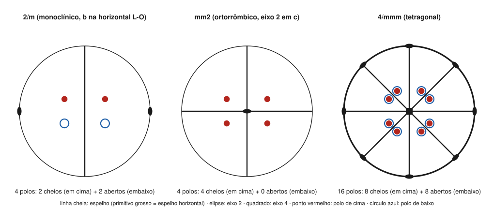

# Aula 07: Simetria no estereograma — elementos e forma geral das classes

**ID:** mineralogia-m05-a07
**Módulo:** [[05-miller-e-projecao-modulo|Módulo 05 — Eixos cristalográficos, índices de Miller e projeção estereográfica]]
**Duração estimada:** ~28 min
**Nível:** ensino médio, sem geologia prévia (contrato `ensino-medio-sem-geologia-v1`)
**Objetivo:** desenhar os elementos de simetria de uma classe no estereograma, construir o estereograma da sua forma geral e, no caminho inverso, reconhecer a classe a partir de um estereograma de polos.
**Pré-requisito:** [[05-miller-e-projecao-aula-05-a-projecao-estereografica-e-a-rede-de-wulff|Aula 05]] (polos, hemisférios, grandes círculos) e [[04-simetria-e-morfologia-aula-04-os-32-grupos-pontuais-e-a-notacao-de-hermann-mauguin-parte-1-deducao|módulo 04, aula 04]] (as 32 classes em oito famílias).

> [!note] Por que esta aula existe
> No planejamento, o módulo tinha 6 aulas e a aula 05 levava também a simetria no estereograma. A revisão didática mediu carga demais nela (cinco ideias novas, mais duas construções) e a dividiu: a simetria passou para esta aula, que fecha o módulo voltando ao módulo 04, como a revisão daquele módulo tinha pedido.

## Vocabulário desta aula

| Termo | O que quer dizer |
|---|---|
| **símbolo gráfico** | o desenho padronizado de um elemento de simetria no estereograma. |
| **forma geral** | a forma cujas faces não estão sobre nenhum elemento de simetria; tem tantas faces quanto a ordem do grupo (módulo 04, aula 07). |
| **forma especial** | forma cujas faces ficam sobre um elemento de simetria (ou perpendiculares a ele); tem menos faces. |
| **ordem do grupo** | o número de operações da classe; é o número de polos da forma geral. |
| **estereograma da classe** | o par "elementos de simetria + polos da forma geral", a maneira-padrão de mostrar uma classe. |

## Antes de começar, você precisa saber

- • para polo de cima, ○ para polo de baixo; grandes círculos como diâmetros, arcos ou o primitivo: [[05-miller-e-projecao-aula-05-a-projecao-estereografica-e-a-rede-de-wulff|aula 05]].
- As operações rotação, espelho, centro e rotoinversão: [[04-simetria-e-morfologia-aula-02-operacoes-de-simetria-i-rotacao-reflexao-e-inversao|módulo 04, aula 02]] e [[04-simetria-e-morfologia-aula-03-operacoes-de-simetria-ii-rotoinversao-e-combinacao-de-elementos|aula 03]].

## Ao final você vai conseguir

- `mineralogia-m05-oa04` — Construir e ler uma projeção estereográfica de faces e elementos de simetria na rede de Wulff. *(Nesta aula: os elementos de simetria e a forma geral.)*

## Conteúdo

### Como se desenha cada elemento

- **Espelho:** é um plano que passa pelo centro, então corta a esfera num grande círculo. Desenha-se esse grande círculo em **traço cheio**. Se o espelho é horizontal, o próprio primitivo é desenhado em traço cheio (grosso); se não há espelho horizontal, o primitivo é só a borda, em traço fino.
- **Eixo de rotação:** marca-se onde ele fura a esfera, com o símbolo da ordem: **elipse** para 2, **triângulo** para 3, **quadrado** para 4, **hexágono** para 6. Um eixo vertical aparece no centro; um horizontal, em dois pontos opostos do primitivo.
- **Rotoinversões:** têm símbolos compostos (um polígono com outro símbolo dentro), tabelados nas *International Tables*.
- **Centro:** em muitos livros não tem símbolo próprio. Ele se reconhece pelos polos: cada polo cheio tem um polo aberto na posição diametralmente oposta.

### A receita da forma geral

1. Desenhe os elementos de simetria.
2. Ponha **um** polo cheio numa posição genérica: fora de qualquer espelho e de qualquer eixo.
3. Aplique cada operação a ele e aos polos que forem surgindo, até nada novo aparecer.
4. A cada operação, pergunte: o polo foi para o outro hemisfério? Se foi, troque **cheio por aberto** (ou o contrário).
5. Conte: o número de polos tem de ser a **ordem do grupo**. Se não for, faltou uma operação.

Quais operações trocam o hemisfério? Espelho horizontal, eixo 2 horizontal, centro e as rotoinversões. Rotações em torno do eixo vertical e espelhos verticais **não** trocam.

*Figura 9. Estereogramas calculados das classes 2/m, mm2 e 4/mmm, com os elementos de simetria e os polos da forma geral. O que observar: em 2/m, metade dos polos vai para baixo (eixo 2 horizontal); em mm2, nenhum vai (só espelhos verticais e eixo vertical); em 4/mmm, o espelho horizontal (primitivo grosso) põe cada polo de cima exatamente sobre um de baixo.*

### Três casos, passo a passo

**2/m, com b na horizontal (L-O).** O espelho perpendicular a b é o diâmetro vertical (N-S). Partindo de um polo cheio no quadrante superior direito: o espelho dá outro cheio no superior esquerdo; o eixo 2 em b gira 180° em torno do eixo L-O e leva o polo para baixo e para o outro lado desse eixo, um aberto no quadrante inferior direito; o espelho completa um aberto no inferior esquerdo. **4 polos**, a ordem de 2/m.

**mm2, com o eixo 2 em c.** Dois espelhos verticais (os diâmetros N-S e L-O) e o eixo 2 no centro. Nenhuma operação troca de hemisfério: **4 polos cheios**. É uma classe **polar**: o cristal tem "cima" diferente de "baixo", como a hemimorfita do módulo 04.

**4/mmm.** Eixo 4 no centro, quatro espelhos verticais, espelho horizontal e oito pontas de eixos 2 no primitivo. O eixo 4 e os espelhos verticais dão 8 polos cheios; o espelho horizontal põe um aberto sob cada um: **16 polos**, a ordem de 4/mmm (módulo 04, aula 07: a forma geral de 4/mmm tem 16 faces).

### A leitura inversa: do estereograma à classe

Dado um estereograma só com os polos da forma geral, perguntas que decidem a classe:

1. **Quantos polos?** É a ordem do grupo.
2. **Cada cheio está sobre um aberto?** Então há espelho horizontal.
3. **Há linhas que refletem o padrão?** São espelhos verticais.
4. **Quantas vezes o padrão se repete ao redor do centro?** É a ordem do eixo vertical (de rotação ou de rotoinversão).
5. **Cheios e abertos se alternam ao redor do centro?** Sinal de rotoinversão ou de eixos 2 horizontais.

Dois exemplos calculados para treinar a leitura:

- **4 polos, 2 cheios opostos e 2 abertos opostos, alternados a cada 90°:** o padrão se repete por "girar 90° e trocar de hemisfério". É **4̄**.
- **6 polos: 3 cheios a 120° e, sob cada um, um aberto:** eixo 3 e espelho horizontal, 3/m, que é a classe **6̄** (módulo 04, aula 03).

### De volta ao cubo

Releia a figura 6 da aula 05 como estereograma de simetria. O primitivo e as oito linhas cinza são os **nove espelhos** de m3̄m. Os eixos coincidem com os polos das formas: **eixos 4** nos polos de {100}, **eixos 3** nos de {111}, **eixos 2** nos de {110}. É a mesma lista 3A₄ 4A₃ 6A₂ 9P C do módulo 04, agora desenhada.

> [!question] Pare e explique
> Por que o eixo 2 horizontal troca o polo de hemisfério, e o eixo 2 vertical não?

## Exemplo trabalhado

**Problema.** Construa o estereograma da forma geral da classe 4/m e diga quantas faces tem a forma geral. Depois, compare com 4mm e 422.

**Passo 1. Elementos de 4/m.** Eixo 4 vertical (quadrado no centro) e espelho horizontal (primitivo grosso). Nenhum espelho vertical.

**Passo 2. Polo de partida.** Um cheio genérico, por exemplo no quadrante superior direito.

**Passo 3. Eixo 4.** Gira de 90° em 90°: quatro cheios, um em cada quadrante, à mesma distância do centro.

**Passo 4. Espelho horizontal.** Põe um aberto exatamente sob cada cheio. Total **8 polos** (4 cheios sobre 4 abertos): ordem 8, forma geral de 8 faces (a bipirâmide tetragonal da classe 4/m).

**Passo 5. Comparação.** Em **4mm**, os espelhos verticais duplicam os quatro cheios em pares refletidos: 8 cheios, nenhum aberto. Em **422**, os eixos 2 horizontais levam cada cheio para baixo, deslocado: 4 cheios e 4 abertos **não** superpostos. As três classes têm ordem 8, e os estereogramas as distinguem à primeira vista.

**Método geral:** elementos → um polo genérico → aplicar operações trocando cheio/aberto quando o hemisfério muda → conferir pela ordem do grupo.

## Erros comuns

- **Pôr o polo de partida sobre um espelho.** Ele gera uma forma especial, com menos polos, e a conta não fecha com a ordem. A forma geral pede posição genérica.
- **Desenhar o primitivo grosso em toda classe.** Primitivo grosso quer dizer espelho horizontal; em 2/m (com b horizontal), mm2 e 422 ele é fino.
- **Achar que todo eixo 2 troca de hemisfério.** Só o horizontal; o vertical gira o polo em torno do centro.
- **Contar polo cheio sobre aberto como um só.** São duas faces, uma em cima e outra embaixo.

## O que não concluir

- Que o estereograma da forma geral mostre o cristal real. É um modelo da simetria; o cristal pode exibir só formas especiais (o cubo de halita é {100}, forma especial de m3̄m).
- Que dois estereogramas com o mesmo número de polos sejam da mesma classe. 4/m, 4mm e 422 têm 8 polos cada.
- Que a ausência de símbolo de centro signifique ausência de centro. Confira os polos opostos.

## Recap relâmpago

- Espelho = grande círculo cheio; primitivo grosso = espelho horizontal.
- Eixos: elipse (2), triângulo (3), quadrado (4), hexágono (6), onde o eixo fura a esfera.
- Forma geral: um polo genérico + todas as operações; nº de polos = ordem do grupo.
- Trocam o hemisfério: espelho horizontal, eixo 2 horizontal, centro, rotoinversões.
- 2/m: 2 cheios + 2 abertos; mm2: 4 cheios; 4/mmm: 8 cheios sobre 8 abertos.
- m3̄m: 9 espelhos; eixos 4, 3 e 2 nos polos de {100}, {111} e {110}.

## Próxima aula

Este é o fim do módulo 05. O [[06-reticulo-e-cela-modulo|módulo 06 — Retículo cristalino, cela unitária e redes de Bravais]] passa da forma externa à periodicidade interna: os eixos e os parâmetros de cela deste módulo ganham sentido físico, como as arestas da unidade que se repete.

## Fontes consultadas

- *International Tables for Crystallography*, vol. A, IUCr (símbolos gráficos dos elementos de simetria; estereogramas das formas gerais das 32 classes).
- Klein, C. & Dutrow, B., *Manual of Mineral Science*, 23ª ed., Wiley (estereogramas das classes; formas gerais).
- Whittaker, E. J. W., *The Stereographic Projection*, IUCr Teaching Pamphlet 11.
- Figura 9 e os exemplos 4̄, 6̄, 4/m, 4mm e 422 gerados por cálculo (fechamento do grupo a partir dos geradores, aplicado a um polo genérico), em 2026-10-04.

<!--
nivel: ensino-medio-sem-geologia-v1
palavras_corpo: 1191
cobertura:
  mineralogia-m05-oa04: [Conteúdo, Exemplo trabalhado]
figuras:
  - 05-miller-e-projecao-fig-09-formas-gerais.svg
  - 05-miller-e-projecao-fig-06-estereograma-cubico.svg
alegacoes_auditaveis:
  - claim_id: CRI-ESS-SIMBOLOS-001
    claim: "Simbolos graficos: espelho = grande circulo cheio; primitivo cheio se ha espelho horizontal; eixo 2 elipse, 3 triangulo, 4 quadrado, 6 hexagono; rotoinversoes com simbolos compostos."
    risk: conceito
    source: "International Tables vol. A"
    audit: "verificado em 2026-10-04 (segunda passagem, aula criada pela revisao didatica)"
  - claim_id: CRI-ESS-HEMISF-001
    claim: "Trocam o hemisferio: espelho horizontal, eixo 2 horizontal, centro, rotoinversoes; nao trocam: rotacoes em torno do eixo vertical e espelhos verticais."
    risk: conceito
    source: "geometria das operacoes; Klein & Dutrow"
    audit: "verificado em 2026-10-04 (segunda passagem, aula criada pela revisao didatica)"
  - claim_id: CRI-ESS-FORMAS-001
    claim: "Forma geral: 2/m 4 polos (2 cheios, 2 abertos, b horizontal); mm2 4 cheios; 4/mmm 16 (8 sobre 8); 4/m 8 (4 sobre 4); 4mm 8 cheios; 422 4 cheios + 4 abertos deslocados; 4-barra 2 cheios + 2 abertos alternados a 90; 6-barra = 3/m 3 cheios sobre 3 abertos."
    risk: numero
    source: "International Tables vol. A; calculo de fechamento de grupo em Python"
    audit: "verificado em 2026-10-04 (segunda passagem, aula criada pela revisao didatica)"
  - claim_id: CRI-ESS-POLAR-001
    claim: "mm2 e classe polar; hemimorfita e mm2 (Imm2)."
    risk: fato
    source: "modulo 04 (auditoria: hemimorfita Imm2; 10 classes polares)"
    audit: "verificado em 2026-10-04 (segunda passagem, aula criada pela revisao didatica)"
  - claim_id: CRI-ESS-CUBO-001
    claim: "Em m3-barra m: 9 espelhos (primitivo + 8 grandes circulos no estereograma padrao); eixos 4 nos polos de {100}, 3 nos de {111}, 2 nos de {110}."
    risk: conceito
    source: "International Tables vol. A; figura 6 calculada"
    audit: "verificado em 2026-10-04 (segunda passagem, aula criada pela revisao didatica)"
  - claim_id: CRI-ESS-HALITA-001
    claim: "O cubo {100} e forma especial de m3-barra m."
    risk: conceito
    source: "modulo 04, aula 07"
    audit: "verificado em 2026-10-04 (segunda passagem, aula criada pela revisao didatica)"
-->
