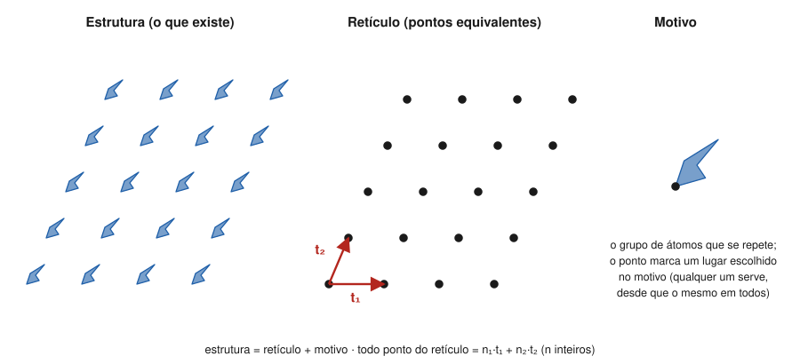

# Aula 01: Motivo, retículo e estrutura — a translação como operação

**ID:** mineralogia-m06-a01
**Módulo:** [[06-reticulo-e-cela-modulo|Módulo 06 — Retículo cristalino, cela unitária e redes de Bravais]]
**Duração estimada:** ~27 min
**Nível:** ensino médio, sem geologia prévia (contrato `ensino-medio-sem-geologia-v1`)
**Objetivo:** explicar a relação entre motivo, retículo e estrutura, reconhecer o retículo de um padrão periódico e descrever as translações que o geram.
**Pré-requisito:** [[05-miller-e-projecao-aula-01-eixos-cristalograficos-e-parametros-de-cela-por-sistema|Módulo 05, aula 01]] (eixos e parâmetros de cela) e [[04-simetria-e-morfologia-aula-01-o-estado-cristalino-leis-de-steno-e-de-hauy|módulo 04, aula 01]] (ordem interna e os "tijolos" de Haüy).

## Vocabulário desta aula

| Termo | O que quer dizer |
|---|---|
| **translação** | deslocar tudo de uma mesma distância numa mesma direção, sem girar nem refletir. |
| **periódico** | que se repete a intervalos regulares. |
| **motivo** | o grupo de átomos (ou de desenhos, num papel de parede) que se repete; também chamado de **base**. |
| **ponto do retículo** | um lugar escolhido no motivo e marcado igual em todas as cópias. |
| **retículo** | o conjunto infinito de pontos equivalentes por translação; é uma abstração geométrica, não um conjunto de átomos. |
| **vetores de translação** | as translações mínimas (t₁, t₂, t₃) que, somadas em múltiplos inteiros, levam de um ponto do retículo a todos os outros. |
| **estrutura cristalina** | o arranjo real dos átomos: retículo + motivo. |

## Antes de começar, você precisa saber

- Que um cristal tem ordem interna que se repete nas três direções: [[04-simetria-e-morfologia-aula-01-o-estado-cristalino-leis-de-steno-e-de-hauy|módulo 04, aula 01]].
- Que só eixos de ordem 1, 2, 3, 4 e 6 cabem num cristal: [[04-simetria-e-morfologia-aula-02-operacoes-de-simetria-i-rotacao-reflexao-e-inversao|módulo 04, aula 02]].
- Os parâmetros a, b, c, α, β, γ: [[05-miller-e-projecao-aula-01-eixos-cristalograficos-e-parametros-de-cela-por-sistema|módulo 05, aula 01]].
- **Matemática reativada:** um vetor é uma seta com tamanho e direção; somar vetores é encadear setas; 3·t significa a seta t repetida três vezes.

## Ao final você vai conseguir

- `mineralogia-m06-oa01` — Explicar a relação entre motivo, retículo e estrutura cristalina e as translações que geram um retículo.

## Conteúdo

### Do papel de parede ao cristal

Olhe um papel de parede estampado. Um mesmo desenho (uma flor, um losango) aparece de novo e de novo, sempre igual e na mesma orientação. Se você marcar com um ponto o centro da flor em todas as cópias, os pontos formam uma grade regular. Apague as flores e sobra só a grade: ela diz **como** o desenho se repete, sem dizer **o que** se repete.

Um cristal é a versão 3D disso, com átomos no lugar das flores:

- o **motivo** é o grupo de átomos que se repete (na halita, um Na e um Cl);
- o **retículo** é a grade de pontos que marca onde cada cópia do motivo está;
- a **estrutura cristalina** é o resultado de pôr uma cópia do motivo em cada ponto do retículo.

**Estrutura = retículo + motivo.** Essa frase organiza o resto do módulo: este módulo e o 07 (de aprofundamento) tratam do retículo e da simetria; o módulo 08 e os seguintes, do motivo (que átomos, com que ligações).

*Figura 1. Um padrão bidimensional (à esquerda), o retículo que ele esconde (ao centro) e o motivo (à direita). O que observar: o retículo tem um ponto por motivo; dois vetores, t₁ e t₂, bastam para gerar todos os pontos.*

### O retículo é abstração

Os pontos do retículo **não são átomos**. São lugares equivalentes. Onde pôr o ponto no motivo é escolha: no centro de um átomo, entre dois átomos, em lugar nenhum especial. O que não é escolha é a regra: o ponto tem de ficar **no mesmo lugar** de todas as cópias. Mudar a escolha desloca a grade inteira, mas não muda a forma dela.

Daí o teste prático que define um retículo: **todo ponto do retículo tem exatamente a mesma vizinhança, na mesma orientação.** Quem está sobre um ponto do retículo e olha em volta vê o mesmo panorama, qualquer que seja o ponto.

### A translação como operação de simetria

No módulo 04, as operações de simetria eram rotações, reflexões e inversões, todas deixando um ponto fixo. A **translação** é uma operação de outro tipo: desloca o cristal inteiro, sem ponto fixo, e o leva a coincidir consigo mesmo (supondo o cristal infinito, o que, na escala de ångströms, é uma excelente aproximação: um grão de 1 mm tem milhões de repetições em cada direção).

Num plano, duas translações não paralelas, **t₁** e **t₂**, geram o retículo: todo ponto é

**n₁·t₁ + n₂·t₂**, com n₁ e n₂ inteiros (positivos, negativos ou zero).

No espaço, são três translações não coplanares, e os pontos são **n₁·t₁ + n₂·t₂ + n₃·t₃**. Os comprimentos dessas três translações e os ângulos entre elas são exatamente os **parâmetros de cela** a, b, c, α, β, γ do módulo 05: lá eles eram eixos de referência; aqui, ganham sentido físico.

Duas consequências que você já conhece mudam de estatuto:

- A **restrição cristalográfica** (só eixos 1, 2, 3, 4 e 6) é exigência do retículo: um eixo 5 não deixa os pontos se repetirem por translação sem lacunas nem sobreposições.
- A **morfologia só mostra o grupo pontual.** As translações são de alguns ångströms, invisíveis a olho; a forma externa revela as rotações e reflexões (as 32 classes), mas não a grade. Para ver a grade é preciso difração (módulo 18).

> [!question] Pare e explique
> Por que, num retículo, não podem existir dois pontos com vizinhanças diferentes? O que estaria errado na escolha dos pontos?

### Quando os pontos "óbvios" não formam um retículo

Uma camada de **grafita** (uma folha de átomos de carbono, módulo 30) desenha uma colmeia de hexágonos. É tentador dizer que os vértices da colmeia formam o retículo. Não formam: metade dos vértices tem as três ligações apontando "para cima" e a outra metade "para baixo" (gire o desenho e confira). Dois tipos de vizinhança, logo dois tipos de ponto. O retículo da camada é hexagonal, com um ponto a cada **par** de átomos; o motivo tem **dois** carbonos.

## Exemplo trabalhado

**Problema.** Um tabuleiro de xadrez infinito, em que as casas pretas são um tipo de átomo e as brancas, outro. As casas têm lado d. (a) Os centros de todas as casas formam um retículo? (b) Qual é o retículo? (c) Qual é o motivo? (d) Quantos pontos do retículo há por casa?

**Passo 1. Teste da vizinhança.** Uma casa preta tem quatro vizinhas brancas pelos lados; uma branca, quatro pretas. As vizinhanças diferem: **não**, os centros de todas as casas não formam um retículo.

**Passo 2. Retículo.** Fique só com os centros das casas pretas. Cada preta tem a mesma vizinhança. As pretas vizinhas mais próximas estão na diagonal, a d·√2 ≈ 1,41 d. O retículo é **quadrado**, girado 45° em relação às casas, com lado d·√2.

**Passo 3. Motivo.** Uma casa preta + uma casa branca vizinha (por exemplo, a da direita). Copiado em cada ponto, recompõe o tabuleiro.

**Passo 4. Contagem.** Cada ponto do retículo "carrega" um motivo de duas casas: **½ ponto por casa**, ou um ponto por par preta-branca.

**Passo 5. Conferência.** Se as casas fossem todas iguais (um só tipo de átomo), todos os centros seriam equivalentes, e o retículo seria o quadrado de lado d, com motivo de uma casa. O retículo depende de **quais pontos são realmente equivalentes**, não do desenho geométrico.

**Método geral:** procure lugares com vizinhança idêntica e igualmente orientada; eles formam o retículo; o motivo é o mínimo de matéria que, posto em cada ponto, refaz o padrão.

## Erros comuns

- **Chamar os átomos de "pontos do retículo".** É sedutor porque, em estruturas simples, pode-se pôr um ponto em cada átomo de um tipo. Mas o retículo é a regra de repetição; o motivo pode ter dezenas de átomos.
- **Achar que todo padrão regular de pontos é um retículo.** A colmeia da grafita e o tabuleiro de dois tipos de casa mostram que não: falta a vizinhança idêntica.
- **Confundir translação com rotação.** A translação não tem ponto fixo; é por isso que não aparece entre os elementos do módulo 04.

## O que não concluir

- Que a escolha do ponto no motivo mude o retículo. Ela desloca a grade inteira, sem mudar sua forma nem seus parâmetros.
- Que o cristal real seja infinito. A aproximação é excelente no interior; nas faces e nos defeitos (módulo 12) ela falha.
- Que a forma externa mostre o retículo. Ela mostra a classe; o retículo é visto por difração.

## Recap relâmpago

- Estrutura = retículo + motivo.
- Retículo: pontos com vizinhança idêntica e igualmente orientada; abstração, não átomos.
- Todo ponto do retículo é n₁·t₁ + n₂·t₂ + n₃·t₃, com n inteiros; |t| e ângulos = parâmetros de cela.
- A translação é operação de simetria sem ponto fixo; ela impõe a restrição aos eixos 1, 2, 3, 4, 6.
- Colmeia de grafita: retículo hexagonal com motivo de 2 carbonos.

## Próxima aula

Em [[06-reticulo-e-cela-aula-02-cela-primitiva-e-cela-convencional|Aula 02 — Cela primitiva e cela convencional]], o retículo infinito ganha uma "unidade de repetição": a cela, e a escolha entre a menor cela possível e a que mostra a simetria.

## Fontes consultadas

- IUCr, *Online Dictionary of Crystallography*, verbetes "Lattice", "Crystal pattern" e "Translation" (consultado em 2026-10-04).
- Klein, C. & Dutrow, B., *Manual of Mineral Science*, 23ª ed., Wiley (motivo, retículo, translação, padrões bidimensionais).
- Nesse, W. D., *Introduction to Mineralogy*, Oxford University Press (retículo como abstração; estrutura = retículo + motivo).
- Figura 1 gerada por script (padrão periódico calculado).

<!--
nivel: ensino-medio-sem-geologia-v1
palavras_corpo: 1160
cobertura:
  mineralogia-m06-oa01: [Conteúdo, Exemplo trabalhado]
figuras:
  - 06-reticulo-e-cela-fig-01-motivo-e-reticulo.svg
alegacoes_auditaveis:
  - claim_id: CRI-RET-DEF-001
    claim: "Estrutura cristalina = reticulo + motivo; reticulo e conjunto infinito de pontos equivalentes por translacao, com vizinhanca identica e igualmente orientada; nao e conjunto de atomos."
    risk: conceito
    source: "IUCr Online Dictionary; Klein & Dutrow"
    audit: "verificado em 2026-10-04"
  - claim_id: CRI-RET-TRANSL-001
    claim: "Pontos do reticulo = n1 t1 + n2 t2 + n3 t3, n inteiros; comprimentos e angulos dos vetores = parametros de cela."
    risk: conceito
    source: "International Tables vol. A"
    audit: "verificado em 2026-10-04"
  - claim_id: CRI-RET-HALITA-001
    claim: "Na halita o motivo e um Na e um Cl."
    risk: fato
    source: "Klein & Dutrow (estrutura NaCl, reticulo cF, motivo NaCl)"
    audit: "verificado em 2026-10-04"
  - claim_id: CRI-RET-RESTRICAO-001
    claim: "A restricao cristalografica (eixos 1, 2, 3, 4, 6) decorre da periodicidade por translacao."
    risk: conceito
    source: "International Tables vol. A; modulo 04"
    audit: "verificado em 2026-10-04"
  - claim_id: CRI-RET-MORFO-001
    claim: "A forma externa revela o grupo pontual (as 32 classes), nao as translacoes, que sao de alguns angstroms; o reticulo e visto por difracao."
    risk: conceito
    source: "Klein & Dutrow"
    audit: "verificado em 2026-10-04"
  - claim_id: CRI-RET-GRAFITA-001
    claim: "A camada de grafita (colmeia) nao e um reticulo: os vertices tem duas orientacoes de vizinhanca; o reticulo e hexagonal com motivo de 2 carbonos."
    risk: conceito
    source: "Klein & Dutrow; IUCr Online Dictionary (honeycomb nao e reticulo de Bravais)"
    audit: "verificado em 2026-10-04"
  - claim_id: CRI-RET-XADREZ-001
    claim: "Tabuleiro de dois tipos de casa (lado d): reticulo quadrado de lado d raiz de 2, girado 45 graus, motivo de 2 casas."
    risk: numero
    source: "geometria"
    audit: "verificado em 2026-10-04"
  - claim_id: CRI-RET-GRAO-001
    claim: "Um grao de 1 mm tem milhoes de repeticoes da cela em cada direcao."
    risk: numero
    source: "calculo: 1 mm / 5-20 A = 0,5-2 milhoes"
    audit: "verificado em 2026-10-04"
-->
