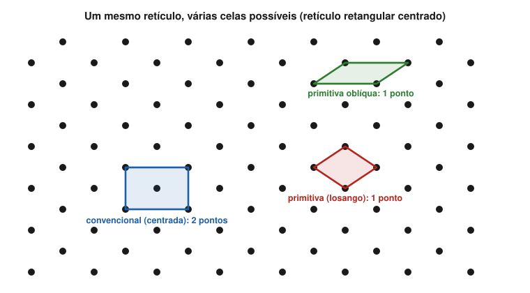
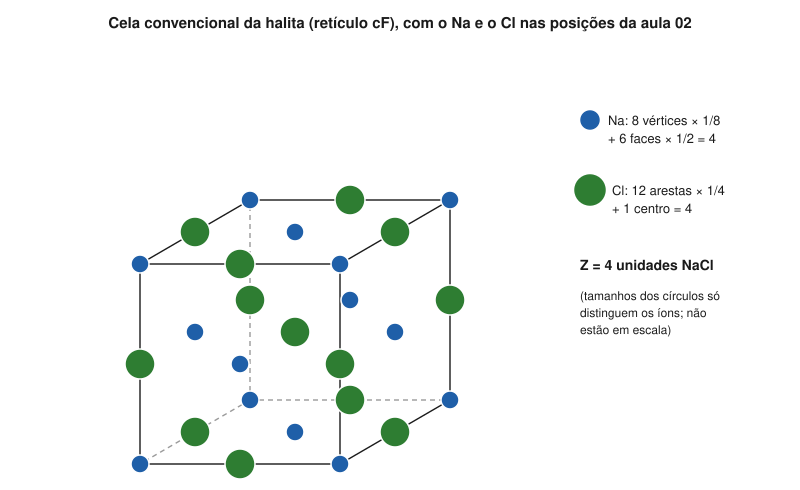

# Aula 02: Cela primitiva e cela convencional

**ID:** mineralogia-m06-a02
**Módulo:** [[06-reticulo-e-cela-modulo|Módulo 06 — Retículo cristalino, cela unitária e redes de Bravais]]
**Duração estimada:** ~28 min
**Nível:** ensino médio, sem geologia prévia (contrato `ensino-medio-sem-geologia-v1`)
**Objetivo:** distinguir cela primitiva de cela convencional, contar os pontos do retículo numa cela, escrever posições em coordenadas fracionárias e justificar por que a cela convencional é escolhida pela simetria.
**Pré-requisito:** [[06-reticulo-e-cela-aula-01-motivo-reticulo-e-estrutura-a-translacao-como-operacao|Aula 01]] (retículo e translações).

## Vocabulário desta aula

| Termo | O que quer dizer |
|---|---|
| **cela unitária** | um paralelepípedo, definido por três translações do retículo, que, repetido por translação, preenche o espaço sem lacunas nem sobreposições. |
| **cela primitiva** | cela com exatamente **um** ponto do retículo; é a de menor volume. |
| **cela convencional** | a cela escolhida para mostrar a simetria do retículo: arestas ao longo das direções de simetria; pode conter 1, 2, 3 ou 4 pontos. |
| **cela centrada** | cela convencional com pontos extras no centro do corpo, no centro de faces ou em posições internas. |
| **coordenadas fracionárias** | a posição de um ponto escrita como frações (x, y, z) de a, b e c, a partir de um vértice da cela. |

## Antes de começar, você precisa saber

- Retículo, motivo e vetores de translação: [[06-reticulo-e-cela-aula-01-motivo-reticulo-e-estrutura-a-translacao-como-operacao|aula 01]].
- Que os eixos cristalográficos seguem a simetria: [[05-miller-e-projecao-aula-01-eixos-cristalograficos-e-parametros-de-cela-por-sistema|módulo 05, aula 01]].

## Ao final você vai conseguir

- `mineralogia-m06-oa04` — Distinguir cela primitiva de cela convencional e justificar a escolha da cela convencional pela simetria.

## Conteúdo

### Uma cela é uma escolha

O retículo é infinito; para descrevê-lo, basta um pedaço que, empilhado, o reconstrói. Esse pedaço é a **cela unitária**: um paralelepípedo com arestas iguais a três translações do retículo. É o descendente moderno dos "tijolos" de Haüy ([[04-simetria-e-morfologia-aula-01-o-estado-cristalino-leis-de-steno-e-de-hauy|módulo 04, aula 01]]).

Mas há **infinitas** maneiras de escolher três translações. A figura 2 mostra um só retículo plano com três celas diferentes.

*Figura 2. Um retículo retangular centrado com três celas: a convencional, retangular e centrada (azul, 2 pontos); uma primitiva em losango (vermelho, 1 ponto); e uma primitiva oblíqua (verde, 1 ponto). O que observar: as duas primitivas têm a mesma área, metade da área da convencional; só a retangular tem as arestas ao longo dos espelhos do padrão.*

### Contar pontos numa cela

Um ponto do retículo que cai num vértice é **dividido** entre todas as celas que se tocam ali. Em 3D:

| Posição do ponto na cela | Celas que o compartilham | Vale, para esta cela |
|---|---|---|
| vértice | 8 | 1/8 |
| aresta | 4 | 1/4 |
| face | 2 | 1/2 |
| interior | 1 | 1 |

Uma cela com pontos só nos 8 vértices tem 8 × 1/8 = **1 ponto**: é **primitiva**. Uma cela com os 8 vértices e mais um ponto no centro do corpo tem 1 + 1 = **2**. Com os vértices e um ponto no centro de cada uma das 6 faces: 1 + 6 × 1/2 = **4**.

Todas as celas primitivas de um retículo têm o **mesmo volume**, o menor possível; uma cela com n pontos tem n vezes esse volume.

### Por que não usar sempre a primitiva

Porque a primitiva pode esconder a simetria. O exemplo clássico é o retículo da halita (aula 03 dá o nome: cúbico de faces centradas). A cela **convencional** é um cubo de aresta a, com 4 pontos. Existe uma cela **primitiva**, com 1 ponto e um quarto do volume do cubo, mas ela é um **romboedro** de ângulos de 60° entre as arestas. Ninguém olhando esse romboedro adivinha que o retículo tem quatro eixos 3 e três eixos 4.

A regra da cela convencional é, por isso:

1. as arestas ficam ao longo das direções de simetria do retículo, as mesmas dos eixos cristalográficos do [[05-miller-e-projecao-aula-01-eixos-cristalograficos-e-parametros-de-cela-por-sistema|módulo 05, aula 01]];
2. entre as celas que obedecem a (1), escolhe-se a menor.

Quando a menor cela que mostra a simetria tem mais de um ponto, ela é **centrada**. Os tipos de centragem, com os pontos extras escritos em coordenadas fracionárias:

| Letra | Nome | Pontos extras (além do vértice 0, 0, 0) | Pontos por cela |
|---|---|---|---|
| **P** | primitiva | nenhum | 1 |
| **C** | base centrada (face ab) | (½, ½, 0) | 2 |
| **A** ou **B** | base centrada nas faces bc ou ac | (0, ½, ½) ou (½, 0, ½) | 2 |
| **I** | corpo centrado (do alemão *innenzentriert*) | (½, ½, ½) | 2 |
| **F** | faces centradas | (½, ½, 0), (½, 0, ½), (0, ½, ½) | 4 |

> [!question] Pare e explique
> Uma cela convencional I tem o dobro do volume da primitiva do mesmo retículo. Por quê?

### Coordenadas fracionárias

Dentro da cela, uma posição se escreve como frações das arestas: **(x, y, z)** quer dizer "x de a, y de b, z de c" a partir do vértice de origem. O centro do corpo é (½, ½, ½), qualquer que seja o tamanho ou a inclinação da cela. Dois detalhes:

- **Somar 1 a uma coordenada leva a um ponto equivalente** na cela vizinha: (0, 0, 0), (1, 0, 0) e (1, 1, 1) são o mesmo ponto do retículo, por translação. Por isso as coordenadas se escrevem entre 0 e 1.
- As coordenadas valem também para **átomos**, não só para pontos do retículo. É assim que as tabelas de estrutura (e os arquivos CIF do módulo 07) listam onde está cada átomo.

## Exemplo trabalhado

**Problema.** Na halita, a cela convencional é um cubo com retículo F. O motivo é 1 Na + 1 Cl, com o Na sobre o ponto do retículo e o Cl deslocado de (½, 0, 0). (a) Liste as posições dos Na. (b) Liste as dos Cl. (c) Quantos Na e quantos Cl há na cela? (d) A fórmula NaCl está respeitada?

**Passo 1. Na.** Um Na em cada ponto do retículo F: **(0, 0, 0), (½, ½, 0), (½, 0, ½), (0, ½, ½)**. Os vértices e centros de face restantes são equivalentes a esses por translação.

**Passo 2. Cl.** Some (½, 0, 0) a cada Na e traga para dentro de 0-1: (½, 0, 0); (1, ½, 0) → **(0, ½, 0)**; (1, 0, ½) → **(0, 0, ½)**; **(½, ½, ½)**.

**Passo 3. Contagem pela tabela de compartilhamento.** Na: 8 vértices × 1/8 + 6 faces × 1/2 = **4**. Cl: no meio das 12 arestas (12 × 1/4 = 3) + 1 no centro = **4**.

*Figura 6. A cela convencional da halita com os íons nas posições dos passos 1 e 2. O que observar: os Na (azuis, pequenos) ocupam vértices e centros de face; os Cl (verdes), os meios das arestas e o centro; cada posição conta com o seu peso.*

**Passo 4. Fórmula.** 4 Na : 4 Cl = 1 : 1. A cela contém **4 unidades NaCl**; esse número tem nome, Z, e é o assunto da aula 04.

**Método geral:** liste os pontos do retículo pela letra de centragem; acrescente o motivo a cada um; reduza as coordenadas a 0-1; conte com os pesos 1/8, 1/4, 1/2, 1; confira contra a fórmula.

## Erros comuns

- **Contar os 8 vértices como 8 pontos.** Cada vértice é compartilhado por 8 celas; juntos valem 1.
- **Achar que a cela convencional é sempre a menor.** A menor é a primitiva; a convencional é a menor **entre as que mostram a simetria**.
- **Confundir a cela com o motivo.** A cela é um volume de repetição; o motivo é o que fica em cada ponto. Uma cela F de halita tem 4 motivos dentro.
- **Usar coordenadas maiores que 1.** (1, ½, 0) e (0, ½, 0) são o mesmo ponto; escreve-se o segundo.

## O que não concluir

- Que a cela unitária seja "a menor unidade que se repete" em todos os casos. Isso vale para a primitiva; a convencional pode ter 2, 3 ou 4 vezes esse volume.
- Que a cela tenha a forma do fragmento de clivagem ou do cristal. A cela de halita é cúbica e a clivagem também, mas na calcita a cela primitiva não é o romboedro de clivagem (aula 04).
- Que pontos do retículo sejam átomos. Na halita, o retículo F passa pelos Na por escolha; poderia passar pelos Cl.

## Recap relâmpago

- Cela unitária: paralelepípedo de translações que preenche o espaço; há infinitas escolhas.
- Primitiva: 1 ponto, menor volume; convencional: arestas ao longo da simetria, pode ser centrada.
- Pesos: vértice 1/8, aresta 1/4, face 1/2, interior 1.
- P (1 ponto), C/A/B e I (2), F (4); I = (½, ½, ½); C = (½, ½, 0).
- Coordenadas fracionárias (x, y, z) entre 0 e 1; halita: 4 Na + 4 Cl por cela.

## Próxima aula

Em [[06-reticulo-e-cela-aula-03-os-14-reticulos-de-bravais|Aula 03 — Os 14 retículos de Bravais]], as letras P, C, I, F e R se combinam com os sistemas, e você vê por que só 14 combinações são diferentes.

## Fontes consultadas

- IUCr, *Online Dictionary of Crystallography*, verbetes "Unit cell", "Primitive cell", "Conventional cell", "Centred lattice" (consultado em 2026-10-04).
- *International Tables for Crystallography*, vol. A (tipos de centragem e vetores de centragem).
- Klein, C. & Dutrow, B., *Manual of Mineral Science*, 23ª ed., Wiley (cela unitária, estrutura da halita).
- Contas do exemplo (posições, contagem e ângulo de 60° da cela primitiva do retículo F) conferidas em Python em 2026-10-04; figuras 2 e 6 geradas por script.

<!--
nivel: ensino-medio-sem-geologia-v1
palavras_corpo: 1241
cobertura:
  mineralogia-m06-oa04: [Conteúdo, Exemplo trabalhado]
figuras:
  - 06-reticulo-e-cela-fig-02-celas-primitiva-e-convencional.svg
  - 06-reticulo-e-cela-fig-06-cela-da-halita.svg
alegacoes_auditaveis:
  - claim_id: CRI-CEL-DEF-001
    claim: "Cela unitaria: paralelepipedo de translacoes que preenche o espaco; primitiva = 1 ponto, menor volume, todas as primitivas com o mesmo volume; convencional = arestas ao longo das direcoes de simetria, a menor entre as que mostram a simetria."
    risk: conceito
    source: "IUCr Online Dictionary; International Tables vol. A"
    audit: "verificado em 2026-10-04"
  - claim_id: CRI-CEL-PESOS-001
    claim: "Pesos de compartilhamento: vertice 1/8, aresta 1/4, face 1/2, interior 1; P 1 ponto, I 2, F 4."
    risk: numero
    source: "Klein & Dutrow"
    audit: "verificado em 2026-10-04"
  - claim_id: CRI-CEL-CENTRAGEM-001
    claim: "Vetores de centragem: C (1/2,1/2,0); A (0,1/2,1/2); B (1/2,0,1/2); I (1/2,1/2,1/2); F os tres de face; I do alemao innenzentriert."
    risk: conceito
    source: "International Tables vol. A"
    audit: "verificado em 2026-10-04"
  - claim_id: CRI-CEL-FCCPRIM-001
    claim: "A cela primitiva do reticulo cubico F e um romboedro de angulos de 60 graus com 1/4 do volume do cubo."
    risk: numero
    source: "calculo conferido em Python"
    audit: "verificado em 2026-10-04"
  - claim_id: CRI-CEL-HALITA-001
    claim: "Halita: reticulo F, Na em (0,0,0)+F e Cl em (1/2,0,0)+F; 4 Na + 4 Cl por cela convencional."
    risk: fato
    source: "Klein & Dutrow; Handbook of Mineralogy (Fm3-barra m, Z = 4)"
    audit: "verificado em 2026-10-04"
  - claim_id: CRI-CEL-COORD-001
    claim: "Coordenadas fracionarias (x,y,z) como fracoes de a, b, c; somar 1 leva a ponto equivalente; as tabelas de estrutura e arquivos CIF listam atomos assim."
    risk: conceito
    source: "International Tables vol. A; IUCr (CIF)"
    audit: "verificado em 2026-10-04"
-->
