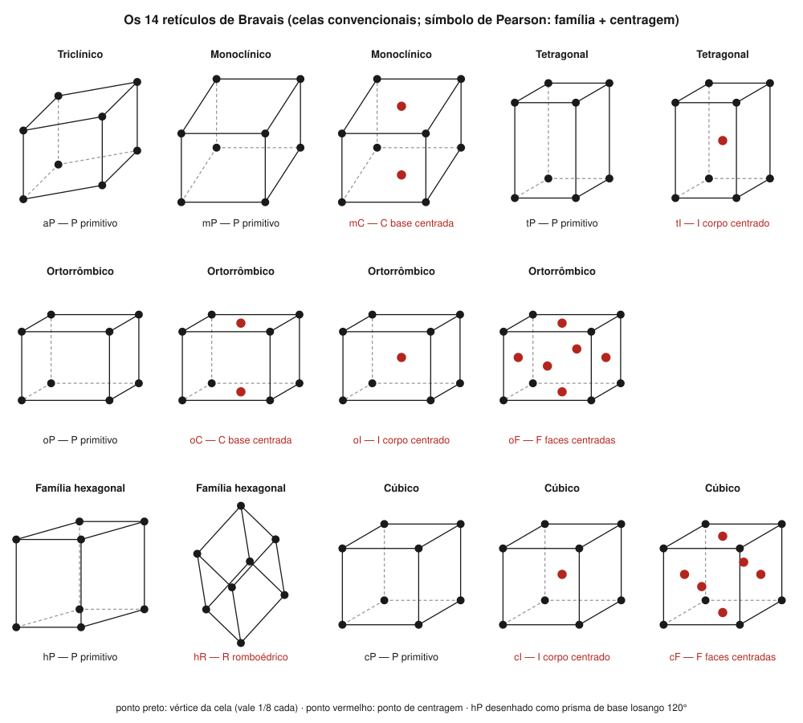
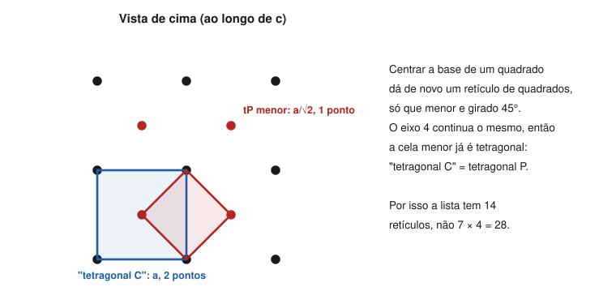

# Aula 03: Os 14 retículos de Bravais

**ID:** mineralogia-m06-a03
**Módulo:** [[06-reticulo-e-cela-modulo|Módulo 06 — Retículo cristalino, cela unitária e redes de Bravais]]
**Duração estimada:** ~30 min
**Nível:** ensino médio, sem geologia prévia (contrato `ensino-medio-sem-geologia-v1`)
**Objetivo:** identificar os 14 retículos de Bravais pelo símbolo (família + centragem), associar cada um a um mineral real e justificar por que certas centragens não aparecem em certos sistemas.
**Pré-requisito:** [[06-reticulo-e-cela-aula-02-cela-primitiva-e-cela-convencional|Aula 02]] (celas primitiva e convencional; P, C, I, F).

## Vocabulário desta aula

| Termo | O que quer dizer |
|---|---|
| **retículo de Bravais** | um dos 14 tipos distintos de retículo tridimensional. |
| **sistema reticular** | o agrupamento dos retículos pela simetria do próprio retículo; são sete (do triclínico ao cúbico, com hexagonal e romboédrico separados). |
| **símbolo do tipo de retículo** | duas letras: a família (a, m, o, t, h, c) e a centragem (P, C, I, F, R), como cF. |
| **R (romboédrico)** | retículo da família hexagonal cuja cela primitiva é um romboedro (a = b = c, α = β = γ ≠ 90°). |
| **família cristalina** | o agrupamento que junta hexagonal e trigonal (módulo 04, aula 06). |

## Antes de começar, você precisa saber

- Os tipos de centragem P, C, I, F e a contagem de pontos: [[06-reticulo-e-cela-aula-02-cela-primitiva-e-cela-convencional|aula 02]].
- Sete sistemas, seis famílias, sete sistemas reticulares: [[04-simetria-e-morfologia-aula-06-os-sete-sistemas-cristalinos-definidos-pela-simetria|módulo 04, aula 06]].

## Ao final você vai conseguir

- `mineralogia-m06-oa02` — Identificar os 14 retículos de Bravais e justificar quais centragens são permitidas em cada sistema.

## Conteúdo

### A pergunta de Bravais

Combine cada sistema com cada tipo de centragem. Dá muitas combinações. Quantas são retículos **realmente diferentes**? Moritz Frankenheim, em 1842, contou 15. Auguste Bravais mostrou, num trabalho lido à Academia de Ciências de Paris em 1848 (publicado em 1850), que dois dos de Frankenheim eram o mesmo retículo: são **14**. Desde então se chamam **retículos de Bravais**.

### A lista

O símbolo tem duas letras. A primeira é a **família**: **a** (triclínico, do grego *anórthico*), **m** (monoclínico), **o** (ortorrômbico), **t** (tetragonal), **h** (família hexagonal), **c** (cúbico). A segunda é a **centragem**.

| Família | Retículos | Quantos | Exemplos minerais (grupo espacial) |
|---|---|---|---|
| Triclínica | aP | 1 | cianita (P1̄) |
| Monoclínica | mP, mC | 2 | epídoto (P2₁/m); ortoclásio (C2/m), diopsídio (C2/c) |
| Ortorrômbica | oP, oC, oI, oF | 4 | forsterita (Pbnm), aragonita (Pmcn); cordierita (Cccm); hemimorfita (Imm2); enxofre (Fddd) |
| Tetragonal | tP, tI | 2 | rutilo (P4₂/mnm); zircão (I4₁/amd) |
| Hexagonal | hP, hR | 2 | quartzo (P3₂21) e berilo (P6/mcc); calcita (R3̄c), coríndon (R3̄c) |
| Cúbica | cP, cI, cF | 3 | pirita (Pa3̄); granadas (Ia3̄d); halita (Fm3̄m), fluorita (Fm3̄m), diamante (Fd3̄m) |
| | | **14** | |

A letra que abre o símbolo do grupo espacial (módulo 07) é a centragem: é assim que se lê o retículo de um mineral numa ficha. A tabela é de consulta; vale guardar um exemplo por linha.

*Figura 3. As celas convencionais dos 14 retículos, com os pontos de centragem em vermelho. O que observar: o ortorrômbico admite as quatro centragens; o tetragonal e o cúbico, não; a família hexagonal tem um retículo P (prisma de base em losango de 120°) e um R (romboedro).*

### Por que não 7 × 5

Duas razões eliminam combinações. Ambas se entendem com desenho.

**1. A centragem não cria nada novo: existe uma cela menor do mesmo sistema.** Centrar a base de um retículo tetragonal ("tetragonal C") dá de novo um retículo de quadrados, menor e girado 45°, com o mesmo eixo 4: é **tetragonal P** (figura 4). Pelo mesmo argumento, "tetragonal F" é **tetragonal I**. No monoclínico, uma cela I pode ser redescrita como C, escolhendo outro par de eixos no plano perpendicular a b; por isso só aparecem mP e mC.

*Figura 4. Vista ao longo de c de um "tetragonal C". O que observar: os pontos centrados e os dos vértices formam juntos um retículo de quadrados menores (vermelho), de lado a/√2, que já é tetragonal primitivo.*

**2. A centragem destrói a simetria do sistema.** Um "cúbico C", com pontos extras só no par de faces ab, teria a direção c diferente de a e b. Os quatro eixos 3, que exigem as três direções equivalentes, desapareceriam: o retículo seria tetragonal, não cúbico. Pelo mesmo motivo não há "hexagonal C": um ponto extra no centro da base em losango deixa as três direções a de ser equivalentes e quebra o eixo 6.

O ortorrômbico é o único sistema que admite as quatro (P, C, I, F): cada centragem preserva os três eixos 2 (nenhuma quebra a simetria) e nenhuma pode ser redescrita como uma cela ortorrômbica menor (nenhuma colapsa).

> [!question] Pare e explique
> Por que um "cúbico C" deixaria de ser cúbico, enquanto um cúbico F continua cúbico? Pense em quantas faces do cubo recebem ponto extra em cada caso.

### A família hexagonal: hP e hR

A família hexagonal tem **dois** retículos. O **hP** tem cela convencional em prisma de base losango (a = b, γ = 120°), uma terça parte do prisma hexagonal dos desenhos de livro. O **hR** tem cela primitiva em **romboedro** (a = b = c, α = β = γ ≠ 90°), e por isso dá nome ao sistema reticular **romboédrico**.

Aqui está a ponte com o módulo 04: os cristais **trigonais** podem ter retículo hP ou hR. O **quartzo** é trigonal com retículo **hP**; a **calcita** e o **coríndon** são trigonais com retículo **hR**. Os cristais **hexagonais** (berilo, apatita) têm sempre hP. Por isso "trigonal" (simetria do cristal) e "romboédrico" (tipo de retículo) não são sinônimos. Como a cela romboédrica se relaciona com a cela hexagonal, e o que isso faz com a contagem de fórmulas, é a aula 04.

## Exemplo trabalhado

**Problema.** Pelas informações, identifique o retículo de Bravais e justifique.
(A) Zircão: grupo espacial I4₁/amd.
(B) Um mineral cúbico cuja cela tem pontos do retículo nos vértices e no centro de cada face.
(C) Alguém propõe para um mineral tetragonal um retículo "tF". Avalie.
(D) Calcita: grupo espacial R3̄c, sistema trigonal.
(E) Um mineral ortorrômbico com pontos extras só em (½, ½, 0).

**Passo 1. (A).** A primeira letra é I, e o sistema é tetragonal: **tI**.

**Passo 2. (B).** Vértices + centros de face = F, no cúbico: **cF**, 4 pontos por cela.

**Passo 3. (C).** Um tetragonal F pode ser redescrito com uma cela menor, de base girada 45° (como na figura 4), em que os pontos dos centros das faces laterais viram centro de corpo: é **tI**. "tF" não é um retículo novo.

**Passo 4. (D).** Letra R, família hexagonal: **hR**. Sistema cristalino trigonal, sistema reticular romboédrico.

**Passo 5. (E).** Pontos extras em (½, ½, 0) são centragem C; no ortorrômbico ela é distinta das outras: **oC**.

**Método geral:** leia a letra de centragem no grupo espacial e a família pelo sistema; se a combinação não está na lista de 14, procure a cela menor (razão 1) ou a simetria quebrada (razão 2).

## Erros comuns

- **Achar que há 7 × 4 = 28 ou 7 × 5 = 35 retículos.** É o raciocínio sedutor de "todas as combinações". A maior parte colapsa num retículo já listado ou quebra a simetria.
- **Usar "romboédrico" como sinônimo de "trigonal".** O quartzo é trigonal e tem retículo hP.
- **Esquecer que o ortorrômbico tem quatro.** É o sistema mais rico em centragens, justamente por ter três eixos diferentes.
- **Ler a centragem pelo hábito.** A letra vem da difração (módulo 18), não da forma externa.

## O que não concluir

- Que o retículo de Bravais diga o grupo espacial. Ele diz a família e a centragem; o grupo espacial (módulo 07) acrescenta eixos helicoidais e planos de deslizamento.
- Que todos os minerais de um mesmo sistema tenham o mesmo retículo. Rutilo (tP) e zircão (tI) são ambos tetragonais.
- Que um retículo cúbico F seja "mais simétrico" que um cúbico P. Os três retículos cúbicos têm a mesma simetria pontual (m3̄m); diferem na centragem.

## Recap relâmpago

- 14 retículos: aP; mP, mC; oP, oC, oI, oF; tP, tI; hP, hR; cP, cI, cF.
- Bravais (1848) corrigiu os 15 de Frankenheim (1842).
- Combinações que faltam: ou há cela menor do mesmo sistema (tC = tP, tF = tI, mI = mC), ou a centragem quebra a simetria (não há cC nem hC).
- Trigonal pode ser hP (quartzo) ou hR (calcita, coríndon); hexagonal é sempre hP.
- A centragem se lê na primeira letra do grupo espacial.

## Próxima aula

Em [[06-reticulo-e-cela-aula-04-conteudo-da-cela-z-volume-e-densidade-calculada|Aula 04 — Conteúdo da cela]], a cela vira número: quantas fórmulas cabem nela (Z), qual é o seu volume e que densidade isso dá.

## Fontes consultadas

- *International Tables for Crystallography*, vol. A (tipos de retículo de Bravais e símbolos; sistemas reticulares).
- IUCr, *Online Dictionary of Crystallography*, verbetes "Bravais lattice", "Bravais class", "Lattice system" (consultado em 2026-10-04).
- IUCr Newsletter 27(1), "Auguste Bravais, from Lapland to Mont Blanc"; datas de Frankenheim (1842) e Bravais (1848, publicado em 1850) conferidas por busca em 2026-10-04.
- *Handbook of Mineralogy* e a auditoria do módulo 04 deste curso (grupos espaciais: cianita P1̄, ortoclásio C2/m, diopsídio C2/c, forsterita Pbnm, aragonita Pmcn, hemimorfita Imm2, rutilo P4₂/mnm, zircão I4₁/amd, quartzo P3₁21/P3₂21, berilo P6/mcc, calcita e coríndon R3̄c, pirita Pa3̄, granadas Ia3̄d, halita e fluorita Fm3̄m, diamante Fd3̄m); epídoto P2₁/m, cordierita Cccm e enxofre Fddd conferidos por busca em 2026-10-04.
- Figuras 3 e 4 geradas por script.

<!--
nivel: ensino-medio-sem-geologia-v1
palavras_corpo: 1189
cobertura:
  mineralogia-m06-oa02: [Conteúdo, Exemplo trabalhado]
figuras:
  - 06-reticulo-e-cela-fig-03-14-reticulos-de-bravais.svg
  - 06-reticulo-e-cela-fig-04-tetragonal-c-e-p.svg
alegacoes_auditaveis:
  - claim_id: CRI-BRA-LISTA-001
    claim: "14 reticulos: aP; mP, mC; oP, oC, oI, oF; tP, tI; hP, hR; cP, cI, cF (1+2+4+2+2+3)."
    risk: numero
    source: "International Tables vol. A"
    audit: "verificado em 2026-10-04"
  - claim_id: CRI-BRA-HIST-001
    claim: "Frankenheim (1842) contou 15; Bravais leu em 1848 (publicado 1850) o trabalho que mostrou 14."
    risk: data
    source: "IUCr Newsletter 27(1); historia (busca)"
    audit: "verificado em 2026-10-04"
  - claim_id: CRI-BRA-SIMBOLO-001
    claim: "Simbolo do tipo de reticulo: familia a, m, o, t, h, c + centragem P, C, I, F, R; a = anortico (triclinico)."
    risk: conceito
    source: "International Tables vol. A"
    audit: "verificado em 2026-10-04"
  - claim_id: CRI-BRA-EXEMPLOS-001
    claim: "cianita aP; epidoto mP; ortoclasio e diopsidio mC; forsterita e aragonita oP; cordierita oC; hemimorfita oI; enxofre oF; rutilo tP; zircao tI; quartzo e berilo hP; calcita e corindon hR; pirita cP; granadas cI; halita, fluorita, diamante cF."
    risk: fato
    source: "Handbook of Mineralogy; auditoria m04; busca 2026-10-04"
    audit: "verificado em 2026-10-04"
  - claim_id: CRI-BRA-COLAPSO-001
    claim: "Tetragonal C = tetragonal P (cela menor, de lado a/raiz de 2, girada 45 graus); tetragonal F = tetragonal I; monoclinico I = monoclinico C (outra escolha de eixos)."
    risk: conceito
    source: "International Tables vol. A; Klein & Dutrow"
    audit: "verificado em 2026-10-04"
  - claim_id: CRI-BRA-QUEBRA-001
    claim: "Nao existe cubico C (quebraria os quatro eixos 3) nem hexagonal C (quebraria o eixo 6); ortorrombico admite P, C, I, F."
    risk: conceito
    source: "International Tables vol. A; Klein & Dutrow"
    audit: "corrigido em 2026-10-04 (🟡: a justificativa do ortorrombico citava so a quebra de simetria; agora cita tambem a ausencia de cela menor)"
  - claim_id: CRI-BRA-HEX-001
    claim: "Familia hexagonal: hP (cela em prisma de base losango 120 graus, 1/3 do prisma hexagonal) e hR (cela primitiva romboedrica a=b=c, alfa=beta=gama !=90); trigonais podem ser hP (quartzo) ou hR (calcita, corindon); hexagonais sempre hP."
    risk: conceito
    source: "International Tables vol. A; IUCr Online Dictionary"
    audit: "verificado em 2026-10-04"
  - claim_id: CRI-BRA-PONTUAL-001
    claim: "Os tres reticulos cubicos tem a mesma simetria pontual m3-barra m (holoedria)."
    risk: conceito
    source: "International Tables vol. A"
    audit: "verificado em 2026-10-04"
-->
