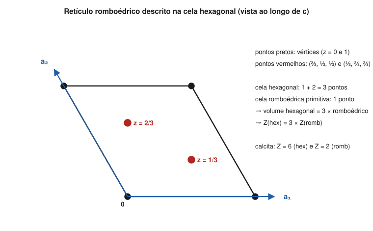

# Aula 04: Conteúdo da cela — Z, volume e densidade calculada

**ID:** mineralogia-m06-a04
**Módulo:** [[06-reticulo-e-cela-modulo|Módulo 06 — Retículo cristalino, cela unitária e redes de Bravais]]
**Duração estimada:** ~30 min (com as contas)
**Nível:** ensino médio, sem geologia prévia (contrato `ensino-medio-sem-geologia-v1`)
**Objetivo:** calcular o número de fórmulas por cela (Z), o volume da cela em qualquer sistema e a densidade calculada de um mineral; usar a densidade medida para achar Z; e relacionar as celas romboédrica e hexagonal de um mesmo cristal.
**Pré-requisito:** [[06-reticulo-e-cela-aula-02-cela-primitiva-e-cela-convencional|Aula 02]] (contagem de pontos e coordenadas) e [[06-reticulo-e-cela-aula-03-os-14-reticulos-de-bravais|aula 03]] (retículos hP e hR).

## Vocabulário desta aula

| Termo | O que quer dizer |
|---|---|
| **Z** | o número de unidades de fórmula contidas numa cela convencional. |
| **unidade de fórmula** | o grupo de átomos que a fórmula química escreve: NaCl, SiO₂, CaCO₃. |
| **massa molar (M)** | a massa de um mol de unidades de fórmula, em g/mol, somando as massas atômicas (módulo 01). |
| **constante de Avogadro (Nₐ)** | o número de unidades num mol: 6,022 × 10²³ por mol. |
| **densidade calculada** | a densidade obtida da cela: massa do conteúdo dividida pelo volume. |
| **densidade medida** | a densidade determinada numa amostra real (por pesagem). |

## Antes de começar, você precisa saber

- Contagem com os pesos 1/8, 1/4, 1/2, 1, e a halita com 4 Na + 4 Cl: [[06-reticulo-e-cela-aula-02-cela-primitiva-e-cela-convencional|aula 02]].
- Mol, massa molar e Avogadro: [[01-fundamentos-quimicos-aula-06-mol-massa-molar-composicao-em-oxidos-e-unidades|módulo 01, aula 06]].
- **Matemática reativada:** volume de uma caixa = comprimento × largura × altura; o seno de um ângulo (sen 90° = 1; sen 120° = sen 60° ≈ 0,866); 1 ų = 10⁻²⁴ cm³ (porque 1 Å = 10⁻⁸ cm).

## Ao final você vai conseguir

- `mineralogia-m06-oa03` — Calcular o número de fórmulas por cela (Z) e a densidade calculada de um mineral a partir dos parâmetros de cela.

## Conteúdo

### Z: quantas fórmulas cabem na cela

Conte os átomos da cela com os pesos da aula 02 e divida pela fórmula. Na halita: 4 Na e 4 Cl → **Z = 4** unidades NaCl. Z é sempre inteiro: a cela contém um número inteiro de motivos, e o motivo, um número inteiro de fórmulas.

Z depende da cela escolhida. A cela convencional F da halita tem Z = 4; a primitiva, um quarto do volume, teria Z = 1. As fichas de mineral sempre dão Z **para a cela convencional** do grupo espacial informado.

### O volume da cela

| Sistema | Volume V |
|---|---|
| cúbico | a³ |
| tetragonal | a²·c |
| ortorrômbico | a·b·c |
| hexagonal (cela hP ou hexagonal de hR) | (√3/2)·a²·c ≈ 0,866·a²·c |
| monoclínico | a·b·c·sen β |
| triclínico | a·b·c·√(1 − cos²α − cos²β − cos²γ + 2·cos α·cos β·cos γ) |

As duas linhas novas vêm de uma ideia só: inclinar a caixa diminui o volume. No monoclínico, a face ac é um paralelogramo de área a·c·sen β; vezes b, que é perpendicular a ela, dá o volume. A fórmula do triclínico generaliza isso para três ângulos; ela se usa, não se decora.

### Densidade calculada

A massa contida na cela é Z vezes a massa de uma unidade de fórmula, que é M/Nₐ. A densidade é massa sobre volume:

**ρ = Z·M / (Nₐ·V)**

Com V em ų e ρ em g/cm³, o produto Nₐ × 10⁻²⁴ vale 0,6022, e a fórmula prática fica:

**ρ (g/cm³) = Z·M / (0,6022 · V[ų])**

**Halita.** M(NaCl) = 22,990 + 35,45 = 58,44 g/mol; a = 5,6404 Å; V = 5,6404³ = 179,4 ų. ρ = 4 × 58,44 / (0,6022 × 179,4) = **2,163 g/cm³**. O *Handbook of Mineralogy* dá 2,165 (calculada) e 2,168 (medida); a diferença na terceira casa vem das massas atômicas e do valor exato de a usados.

**Quartzo (hexagonal, Z = 3).** A mesma conta, com V = 0,866 × 4,9133² × 5,4053 = 113,0 ų, dá **2,649 g/cm³** (medida: 2,65).

### O caminho inverso: achar Z

Se você conhece a densidade medida e a cela, isole Z:

**Z = ρ · 0,6022 · V / M**

O resultado tem de sair **perto de um inteiro**. Se sai 3,5, algo está errado: a fórmula, a cela ou a medida. Esse teste é uma das primeiras checagens quando se resolve uma estrutura nova.

**Fluorita.** a = 5,4626 Å, V = 163,0 ų; ρ medida ≈ 3,18 g/cm³; M(CaF₂) = 78,07. Z = 3,18 × 0,6022 × 163,0 / 78,07 = **4,00**.

### Calculada × medida

A densidade calculada é a de um cristal ideal: fórmula exata, sem vazios. A medida é a de uma amostra real, com substituições na fórmula (módulo 09), vacâncias e defeitos (módulo 12), inclusões e fissuras. As duas costumam ficar próximas (diferenças de alguns centésimos são comuns); quando divergem muito, é a amostra que tem algo a contar. No módulo 13, a densidade volta como ferramenta de identificação.

### Uma cela romboédrica, uma cela hexagonal

Se o tempo apertar, deixe esta seção para uma segunda sessão; o exemplo trabalhado não depende dela. Um retículo **hR** (aula 03) pode ser descrito por duas celas. A **primitiva** é um romboedro (a_r = b_r = c_r, α = β = γ). A outra, mais usada nas fichas, é uma cela **hexagonal** de eixos a e c, que contém **3 pontos** do retículo: os vértices, mais os pontos em (⅔, ⅓, ⅓) e (⅓, ⅔, ⅔).

*Figura 5. Vista ao longo de c da cela hexagonal de um retículo romboédrico. O que observar: dentro da cela há dois pontos extras, a 1/3 e 2/3 da altura; por isso a cela hexagonal tem três vezes o volume, e três vezes o Z, da romboédrica primitiva.*

Na **calcita**, a cela hexagonal (a = 4,9896 Å, c = 17,0610 Å) tem V = 367,8 ų e **Z = 6**; a cela romboédrica primitiva (a_r = 6,375 Å, α = 46,08°) tem V = 122,6 ų, exatamente um terço, e **Z = 2**. A densidade sai a mesma pelas duas: 6 × 100,09 / (0,6022 × 367,8) = **2,711 g/cm³**, que é a medida da calcita. Esse romboedro de 46° é a cela; o romboedro de clivagem, com ângulos entre faces de cerca de 75° e 105°, é outra coisa (os índices dessa clivagem estão no módulo 05, aula 03).

> [!question] Pare e explique
> Se Z muda quando se troca a cela, por que a densidade calculada não muda?

## Exemplo trabalhado

**Problema.** O diopsídio, CaMgSi₂O₆, é monoclínico (C2/c), com a = 9,746 Å, b = 8,899 Å, c = 5,251 Å, β = 105,63° e Z = 4. (a) Calcule M. (b) Calcule V. (c) Calcule ρ. (d) Se um colega usar V = a·b·c, esquecendo o sen β, que erro comete?

**Passo 1. M.** Ca 40,078 + Mg 24,305 + 2 × Si 28,085 + 6 × O 15,999 = **216,55 g/mol**.

**Passo 2. V.** sen 105,63° = 0,9630. V = 9,746 × 8,899 × 5,251 × 0,9630 = **438,6 ų**.

**Passo 3. ρ.** ρ = 4 × 216,55 / (0,6022 × 438,6) = **3,28 g/cm³**.

**Passo 4. O erro do colega.** Sem o sen β, V = 455,4 ų, cerca de 4% maior, e ρ = 3,16 g/cm³: densidade subestimada em ~4%.

**Passo 5. Conferência de ordem de grandeza.** 3,28 g/cm³ é maior que a densidade do quartzo (2,65) e da mesma ordem das de outros silicatos de Mg e Ca; um resultado como 0,3 ou 30 denunciaria erro de unidade.

**Método geral:** M pela fórmula; V pela tabela do sistema (com o seno no monoclínico); ρ = Z·M / (0,6022·V); confira se o valor é plausível e, se tiver a densidade medida, se Z sai inteiro.

## Erros comuns

- **Esquecer o fator 0,6022.** Sem ele, a densidade sai da ordem de 10²⁴ fora; o fator junta Avogadro e a conversão de ų para cm³.
- **Usar o volume da cela primitiva com o Z da convencional** (ou o contrário). Z e V têm de ser da **mesma** cela; trocar só um muda a densidade em 2, 3 ou 4 vezes.
- **Esquecer o seno no monoclínico.** A caixa inclinada tem volume menor que a reta de mesmas arestas.
- **Esperar Z = 1 sempre.** Z é 4 na halita, 3 no quartzo, 6 na calcita (cela hexagonal), 4 no diopsídio.

## O que não concluir

- Que densidade medida e calculada devam coincidir exatamente. A medida carrega a composição real e os defeitos.
- Que Z seja propriedade do mineral. É propriedade do par mineral + cela escolhida (calcita: 6 ou 2).
- Que o romboedro de clivagem da calcita seja a sua cela. Os ângulos não batem (46° × ~75°).

## Recap relâmpago

- Z = fórmulas por cela convencional; sempre inteiro.
- V: a³; a²c; abc; 0,866·a²c; abc·sen β; fórmula geral no triclínico.
- ρ (g/cm³) = Z·M / (0,6022·V[ų]); Z = ρ·0,6022·V/M deve dar inteiro.
- Halita 2,163; quartzo 2,649; calcita 2,711; diopsídio 3,28 g/cm³.
- Retículo hR: cela hexagonal com 3 pontos [(⅔, ⅓, ⅓), (⅓, ⅔, ⅔)]; calcita Z = 6 (hexagonal) = 3 × Z = 2 (romboédrica).

## Próxima aula

Este é o fim do módulo 06. O módulo 07, de **aprofundamento**, acrescenta ao retículo as operações com translação (eixos helicoidais e planos de deslizamento) e lê grupos espaciais completos; quem segue o núcleo vai direto ao [[08-empacotamento-e-coordenacao-modulo|módulo 08 — Cristaloquímica I: raios iônicos, coordenação e regras de Pauling]], onde o motivo ganha átomos de verdade.

## Fontes consultadas

- *Handbook of Mineralogy*, Mineralogical Society of America: halita (a = 5,6404 Å, Z = 4; D(meas.) 2,168, D(calc.) 2,165), quartzo (a = 4,9133, c = 5,4053 Å, Z = 3; D(meas.) 2,65), calcita (a = 4,9896, c = 17,0610 Å, Z = 6; D(meas.) 2,7102, D(calc.) 2,711), fluorita (a = 5,4626 Å, Z = 4; D(calc.) 3,180; densidade medida 3,175-3,184), diopsídio (a = 9,746, b = 8,899, c = 5,251 Å, β = 105,63°, Z = 4) — conferidos por busca em 2026-10-04.
- IUPAC, massas atômicas padrão (abreviadas); constante de Avogadro exata do SI (2019): 6,022 140 76 × 10²³ mol⁻¹.
- *International Tables for Crystallography*, vol. A (volume da cela; retículo R em eixos hexagonais, posição "obversa").
- Todas as contas (volumes, densidades, Z da fluorita, cela romboédrica da calcita) feitas em Python em 2026-10-04.

<!--
nivel: ensino-medio-sem-geologia-v1
palavras_corpo: 1217
cobertura:
  mineralogia-m06-oa03: [Conteúdo, Exemplo trabalhado]
figuras:
  - 06-reticulo-e-cela-fig-05-romboedrico-na-cela-hexagonal.svg
alegacoes_auditaveis:
  - claim_id: CRI-ZDE-FORMULA-001
    claim: "rho = Z M / (NA V); com V em A3 e rho em g/cm3, rho = Z M / (0,6022 V)."
    risk: numero
    source: "SI 2019 (NA exato); calculo"
    audit: "verificado em 2026-10-04"
  - claim_id: CRI-ZDE-VOLUME-001
    claim: "Volumes: a3; a2 c; abc; (raiz3/2) a2 c; abc sen beta; abc raiz(1 - cos2 alfa - cos2 beta - cos2 gama + 2 cos alfa cos beta cos gama)."
    risk: conceito
    source: "International Tables vol. A"
    audit: "verificado em 2026-10-04"
  - claim_id: CRI-ZDE-HALITA-001
    claim: "Halita: M = 58,44; V = 179,4 A3; rho calc = 2,163; HoM 2,165 calc e 2,168 medida."
    risk: numero
    source: "Handbook of Mineralogy (busca); calculo"
    audit: "verificado em 2026-10-04"
  - claim_id: CRI-ZDE-QUARTZO-001
    claim: "Quartzo: V = 113,0 A3; Z = 3; rho = 2,649; medida 2,65."
    risk: numero
    source: "Handbook of Mineralogy (busca); calculo"
    audit: "verificado em 2026-10-04"
  - claim_id: CRI-ZDE-FLUORITA-001
    claim: "Fluorita: a = 5,4626, V = 163,0 A3, rho 3,18, M 78,07 -> Z = 4,00."
    risk: numero
    source: "Handbook of Mineralogy (busca); calculo"
    audit: "verificado em 2026-10-04"
  - claim_id: CRI-ZDE-CALCITA-001
    claim: "Calcita: cela hexagonal V = 367,8 A3, Z = 6; romboedrica primitiva a_r = 6,375 A, alfa = 46,08, V = 122,6 A3, Z = 2; rho = 2,711; cela hexagonal de hR com pontos extras (2/3,1/3,1/3) e (1/3,2/3,2/3)."
    risk: numero
    source: "Handbook of Mineralogy (busca); calculo; International Tables vol. A"
    audit: "verificado em 2026-10-04"
  - claim_id: CRI-ZDE-DIOPSIDIO-001
    claim: "Diopsidio: M = 216,55; V = 438,6 A3; rho = 3,28; sem o sen beta, V = 455,4 e rho = 3,16."
    risk: numero
    source: "Handbook of Mineralogy (busca); calculo"
    audit: "verificado em 2026-10-04"
  - claim_id: CRI-ZDE-CALCMED-001
    claim: "Densidades calculada e medida costumam ficar proximas (diferencas de alguns centesimos sao comuns); divergencias grandes indicam composicao real, defeitos, inclusoes."
    risk: conceito
    source: "Handbook of Mineralogy (pares D(meas)/D(calc) de halita, calcita, fluorita)"
    audit: "corrigido em 2026-10-04 (🟡: 'concordam na segunda casa decimal' era generalizacao; reescrito)"
  - claim_id: CRI-ZDE-CLIVCALC-001
    claim: "O romboedro de clivagem da calcita tem angulos de cerca de 75 e 105 graus e nao e a cela primitiva (46 graus)."
    risk: numero
    source: "modulo 05 (calculo 74,9/105,1); calculo"
    audit: "corrigido em 2026-10-04 (🟡: a remissao ao modulo 05, aula 03 prometia os angulos, que la nao estao; reescrita)"
-->
