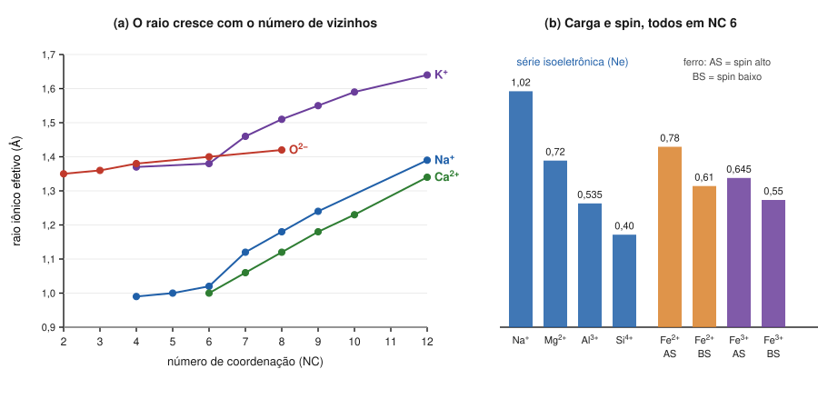

# Aula 01: Raios iônicos efetivos — por que o raio depende da coordenação

**ID:** mineralogia-m08-a01
**Módulo:** [[08-empacotamento-e-coordenacao-modulo|Módulo 08 — Cristaloquímica I: raios iônicos, coordenação e regras de Pauling]]
**Duração estimada:** ~28 min
**Nível:** ensino médio, sem geologia prévia (contrato `ensino-medio-sem-geologia-v1`)
**Objetivo:** ler uma tabela de raios iônicos efetivos escolhendo a linha certa (carga, número de coordenação e spin), prever distâncias entre átomos vizinhos e explicar por que o mesmo íon tem raios diferentes em ambientes diferentes.
**Pré-requisito:** [[01-fundamentos-quimicos-aula-02-tabela-periodica-raio-ionizacao-e-eletronegatividade|módulo 01, aula 02]] (raio e carga nuclear efetiva), [[01-fundamentos-quimicos-aula-03-ions-e-estados-de-oxidacao-fe-mn-e-s|módulo 01, aula 03]] (Fe²⁺, Fe³⁺ e spin) e [[06-reticulo-e-cela-aula-02-cela-primitiva-e-cela-convencional|módulo 06, aula 02]] (cela da halita).

## Vocabulário desta aula

| Termo | O que quer dizer |
|---|---|
| **número de coordenação (NC)** | quantos vizinhos de carga oposta, à distância de ligação, cercam um íon. Escreve-se em algarismos romanos nas tabelas: IV, VI, VIII. |
| **poliedro de coordenação** | a figura formada ligando os centros desses vizinhos: tetraedro (4), octaedro (6), cubo (8). |
| **distância interatômica** | a distância entre os núcleos de dois átomos vizinhos, medida por difração (módulo 18). |
| **raio iônico efetivo** | a parcela dessa distância atribuída a cada íon, por convenção, de modo que r(cátion) + r(ânion) reproduza as distâncias medidas. |
| **série isoeletrônica** | íons com o mesmo número de elétrons, como Na⁺, Mg²⁺, Al³⁺ e Si⁴⁺ (todos com 10, como o neônio). |
| **spin alto / spin baixo** | os dois arranjos possíveis dos elétrons d de íons como o Fe²⁺ dentro de um cristal (definidos no módulo 01, aula 03). |

## Antes de começar, você precisa saber

- O cátion é menor que o átomo de origem e o ânion é maior; o raio diminui ao longo do período porque a carga nuclear efetiva cresce ([[01-fundamentos-quimicos-aula-02-tabela-periodica-raio-ionizacao-e-eletronegatividade|módulo 01, aula 02]]).
- Fe²⁺ é 3d⁶ e Fe³⁺ é 3d⁵; em coordenação octaédrica, spin alto, os raios são cerca de 0,78 e 0,65 Å ([[01-fundamentos-quimicos-aula-03-ions-e-estados-de-oxidacao-fe-mn-e-s|módulo 01, aula 03]]). Esta aula explica de onde vêm esses números.
- A ligação real fica num espectro entre iônica e covalente ([[01-fundamentos-quimicos-aula-04-ligacao-ionica-covalente-e-metalica-como-espectro|módulo 01, aula 04]]).

## Ao final você vai conseguir

- `mineralogia-m08-oa01` — Usar raios iônicos efetivos (Shannon, 1976) considerando carga, número de coordenação e estado de spin, e explicar por que o raio depende do ambiente.

## Conteúdo

### Um íon não tem borda

A nuvem de elétrons de um íon vai rareando para fora, sem uma superfície onde termine. O que se mede, com difração de raios X, é a **distância entre núcleos** vizinhos. Na halita, cada Na fica a 2,82 Å de cada Cl vizinho (metade da aresta da cela, a = 5,6404 Å, do [[06-reticulo-e-cela-aula-02-cela-primitiva-e-cela-convencional|módulo 06]]).

Dividir esses 2,82 Å em "parte do Na" e "parte do Cl" exige uma convenção. A tabela mais usada em mineralogia é a de **Shannon (1976)**, montada a partir das distâncias medidas em muitíssimas estruturas e ancorada num valor fixado para o oxigênio: **O²⁻ em coordenação VI = 1,40 Å**. Dada essa âncora, o raio de cada cátion é escolhido para que as somas reproduzam as distâncias observadas. Por isso o nome **raio iônico efetivo**: ele não mede a "bola" do íon; ele faz a soma dar certo.

Analogia, com o limite dela: pense nos íons como bolas de espuma, não de bilhar: o tamanho "de contato" muda com a vizinhança. Atenção ao sentido da mudança, que é o contrário do que a espuma sugere: como se verá abaixo, o raio **cresce** quando há mais vizinhos, porque cada um é atraído com menos força. E a espuma tem uma superfície; o íon não tem.

> [!warning] Duas tabelas, nunca misturadas
> Shannon publicou também os **raios cristalinos**, com O²⁻ VI = 1,26 Å e cada cátion 0,14 Å maior. A soma cátion + ânion sai igual nas duas tabelas; misturar um raio de uma com um raio da outra erra a distância em 0,14 Å. Neste curso usamos sempre os **raios iônicos efetivos**. Tabelas mais antigas (de Goldschmidt, de Pauling, de Ahrens) têm números um pouco diferentes porque usaram outra âncora e outros métodos.

### O raio cresce com o número de vizinhos

O mesmo íon, com mais vizinhos, aparece maior. O Na⁺ vale 0,99 Å em NC IV, 1,02 Å em VI, 1,18 Å em VIII e 1,39 Å em XII. O Ca²⁺ vai de 1,00 Å (VI) a 1,12 Å (VIII). Até o oxigênio muda: 1,35 Å quando ligado a só dois cátions (II), 1,40 Å em VI.

Por quê? Com mais ânions em volta, eles se repelem mais e cada um recebe uma parcela menor da atração do cátion: cada ligação fica um pouco mais fraca e mais longa. A aula 04 dá a medida disso (a "força" de cada ligação é a carga do cátion dividida pelo número de vizinhos).

*Figura 1. (a) Raios de Shannon do K⁺, Na⁺, Ca²⁺ e O²⁻ em cada número de coordenação tabelado. (b) Todos em NC VI: a série isoeletrônica e o ferro em dois estados de oxidação e dois de spin. O que observar: em (a), toda curva sobe para a direita; em (b), mais carga e spin baixo encolhem o íon.*

### O raio diminui com a carga

Com o mesmo número de elétrons, mais prótons puxam a nuvem para dentro. É o que mostra a série isoeletrônica em NC VI: Na⁺ 1,02; Mg²⁺ 0,72; Al³⁺ 0,535; Si⁴⁺ 0,40 Å. Do outro lado, o F⁻ (1,33 Å) é menor que o O²⁻ (1,40 Å) pela mesma razão.

Para um mesmo elemento, perder mais um elétron também encolhe o íon: em NC VI e spin alto, **Fe²⁺ = 0,78 Å** e **Fe³⁺ = 0,645 Å**; o manganês vai de 0,83 Å (Mn²⁺, spin alto) a 0,645 Å (Mn³⁺, spin alto) e 0,53 Å (Mn⁴⁺). São exatamente os valores citados no módulo 01, aula 03 (lá arredondado para ~0,65 Å).

> [!question] Pare e explique
> Por que o Fe³⁺ cabe em sítios onde o Mg²⁺ (0,72 Å) também cabe, mas o Fe²⁺ (0,78 Å) é quem costuma substituir o Mg²⁺ nos silicatos? Guarde a pergunta: o módulo 09 junta tamanho e carga para responder.

### O spin também muda o raio

Os íons de transição com 4 a 7 elétrons d têm dois arranjos possíveis. No **spin alto**, parte dos elétrons ocupa orbitais d que apontam para os vizinhos; no **spin baixo**, os elétrons se concentram nos orbitais que apontam entre eles (no Fe²⁺, todos os seis), e o íon fica menor. Para o Fe²⁺ em NC VI: **0,78 Å (spin alto)** contra **0,61 Å (spin baixo)**. O Fe²⁺ da pirita é de spin baixo (módulo 01, aula 03); o dos silicatos comuns da crosta, de spin alto. O porquê dos orbitais fica para o módulo 48.

### Como ler a tabela

Para usar um raio, você precisa decidir três coisas, nesta ordem:

1. **a carga** (Fe²⁺ ou Fe³⁺?);
2. **o número de coordenação** no mineral em questão (VI num octaedro, IV num tetraedro);
3. **o spin**, quando o íon tem 4 a 7 elétrons d.

| Íon | NC | Raio (Å) | Íon | NC | Raio (Å) |
|---|---|---|---|---|---|
| O²⁻ | II / IV / VI | 1,35 / 1,38 / 1,40 | Si⁴⁺ | IV / VI | 0,26 / 0,40 |
| F⁻ | VI | 1,33 | Al³⁺ | IV / VI | 0,39 / 0,535 |
| Cl⁻ | VI | 1,81 | Mg²⁺ | VI | 0,72 |
| S²⁻ | VI | 1,84 | Fe²⁺ | VI (alto / baixo) | 0,78 / 0,61 |
| Na⁺ | VI / VIII | 1,02 / 1,18 | Fe³⁺ | VI (alto / baixo) | 0,645 / 0,55 |
| K⁺ | VIII / XII | 1,51 / 1,64 | Ca²⁺ | VI / VIII | 1,00 / 1,12 |

Distância prevista: **d ≈ r(cátion) + r(ânion)**, cada raio no seu próprio NC.

## Exemplo trabalhado

**Problema.** Preveja as distâncias cátion–ânion e compare com as medidas: (a) halita, NaCl (Na e Cl em NC VI; a = 5,6404 Å); (b) periclásio, MgO (mesma estrutura; a = 4,203 a 4,212 Å); (c) quartzo, Si–O (Si em IV; cada O ligado a 2 Si); (d) esfalerita, ZnS (Zn e S em IV; a = 5,4060 Å; a distância Zn–S é a·√3/4).

**(a) Halita.** Prevista: 1,02 + 1,81 = **2,83 Å**. Medida: a/2 = **2,820 Å**. Diferença de 0,3%. A [figura 6 do módulo 06](../06-reticulo-e-cela/06-reticulo-e-cela-fig-06-cela-da-halita.svg) mostra os 6 Cl em volta do Na do centro de face: é daí que vem o "VI" de cada um.

**(b) Periclásio.** Prevista: 0,72 + 1,40 = **2,12 Å**. Medida: a/2 = **2,10 a 2,11 Å**. Diferença de cerca de 1%.

**(c) Quartzo.** O oxigênio, com dois vizinhos, entra com o raio de NC II: 0,26 + 1,35 = **1,61 Å**, a distância Si–O de ~1,61-1,62 Å citada no módulo 01, aula 06. Se você usasse o O²⁻ de NC VI (1,40), erraria por 0,05 Å.

**(d) Esfalerita.** O Shannon só tabela o S²⁻ em NC VI (1,84 Å); com Zn²⁺ em IV (0,60 Å): **2,44 Å** previstos. Medida: 5,4060 × 0,433 = **2,341 Å**, cerca de 4% menos.

**Leitura.** Os raios reproduzem muito bem as distâncias dos óxidos e haletos, de ligação com caráter iônico alto. Nos sulfetos, a previsão erra mais (galena: 3,03 Å previstos, 2,97 medidos; esfalerita, 4%): a ligação Zn–S tem caráter covalente maior (módulo 01, aula 04), e o modelo de esferas que se somam descreve mal o compartilhamento de elétrons.

**Método geral:** carga → NC (de cada um dos dois íons) → spin, se for o caso → soma → compare com o medido e desconfie quando a ligação for pouco iônica.

## Erros comuns

- **Pegar o raio sem olhar o NC.** O Na⁺ em VIII é 16% maior que em VI. Num feldspato, onde o Na tem mais de seis vizinhos, o raio de VI subestima o tamanho do sítio.
- **Misturar raio iônico e raio cristalino.** A soma sai 0,14 Å errada, porque uma tabela põe o O²⁻ em 1,40 e a outra em 1,26.
- **Esquecer o spin do ferro.** Usar 0,78 Å para o Fe²⁺ da pirita superestima o íon em 0,17 Å.
- **Usar o raio atômico** (cerca de 1,9 Å no Na neutro) no lugar do iônico (cerca de 1,0 Å no Na⁺).
- **Achar que o ânion tem tamanho fixo.** O O²⁻ vai de 1,35 (II) a 1,42 Å (VIII).

## O que não concluir

- Que o raio iônico seja o tamanho físico do íon. É uma parcela convencional de uma distância medida; outra âncora daria outros números com as mesmas somas.
- Que uma boa previsão de distância prove que a ligação é puramente iônica. A soma funciona bem em óxidos cuja ligação é parcialmente covalente (Si–O tem ~45% de caráter iônico, módulo 01, aula 04): ela é um ajuste empírico, não uma teoria da ligação.
- Que dois íons de raio igual sejam intercambiáveis. Raio é um dos critérios; carga e tipo de ligação também contam (módulo 09).

## Recap relâmpago

- O que se mede é a distância entre núcleos; o raio iônico efetivo é a parcela convencional de cada íon, com O²⁻ VI = 1,40 Å (Shannon, 1976).
- O raio **cresce com o NC** (Na⁺: 0,99 → 1,39 Å de IV a XII; O²⁻: 1,35 → 1,42 Å) e **diminui com a carga** (Na⁺ 1,02 > Mg²⁺ 0,72 > Al³⁺ 0,535 > Si⁴⁺ 0,40 Å, em VI).
- Ferro em VI: Fe²⁺ 0,78 (spin alto) e 0,61 (spin baixo); Fe³⁺ 0,645 (alto) e 0,55 (baixo).
- Distância prevista = r⁺ + r⁻, cada um no seu NC: halita 2,83 (medida 2,82); quartzo 1,61 Å.
- A previsão é ótima em óxidos e haletos e piora em sulfetos, de ligação mais covalente.
- Raio iônico ≠ raio cristalino ≠ raio atômico: nunca misture tabelas.

## Próxima aula

Em [[08-empacotamento-e-coordenacao-aula-02-razao-de-raios-e-poliedros-de-coordenacao|Aula 02 — Razão de raios e poliedros de coordenação]], os raios viram previsão: dividindo o raio do cátion pelo do ânion, estima-se quantos vizinhos cabem em volta do cátion, e onde essa regra falha.

## Fontes consultadas

- Shannon, R. D. (1976). Revised effective ionic radii and systematic studies of interatomic distances in halides and chalcogenides. *Acta Crystallographica* A32, 751–767. Valores conferidos em 2026-10-06 em duas compilações digitais independentes da tabela (o arquivo `periodic_table.json` do pacote *pymatgen* e a tabela `ionicradii` do pacote *mendeleev*), que concordam entre si; a base do Imperial College (abulafia.mt.ic.ac.uk/shannon) não pôde ser acessada nesta sessão.
- *Handbook of Mineralogy*, Mineralogical Society of America: halita (a = 5,6404 Å), periclásio (Fm3̄m, a = 4,203–4,212 Å), esfalerita (F4̄3m, a = 5,4060 Å), galena (Fm3̄m, a = 5,936 Å) — conferidos por busca em 2026-10-06.
- Klein, C. & Dutrow, B., *Manual of Mineral Science*, 23ª ed., cap. de cristaloquímica (raios iônicos e coordenação).
- Todas as somas e as distâncias a/2 e a·√3/4 calculadas em Python em 2026-10-06.

<!--
nivel: ensino-medio-sem-geologia-v1
palavras_corpo: 1598
cobertura:
  mineralogia-m08-oa01: [Conteúdo, Exemplo trabalhado]
figuras:
  - 08-empacotamento-e-coordenacao-fig-01-raio-coordenacao-carga-spin.svg
  - ../06-reticulo-e-cela/06-reticulo-e-cela-fig-06-cela-da-halita.svg (reaproveitada)
alegacoes_auditaveis:
  - claim_id: CRQ-RAIO-ANCORA-001
    claim: "Raios ionicos efetivos de Shannon (1976) ancorados em O2- VI = 1,40 A; raios cristalinos com O2- VI = 1,26 A e cations 0,14 A maiores; as somas cation + anion coincidem; tabelas antigas (Goldschmidt, Pauling, Ahrens) diferem por ancora e metodo."
    risk: numero
    source: "Shannon (1976), Acta Cryst. A32, 751; pymatgen e mendeleev"
    audit: "corrigido em 2026-10-06 (🟡: tabelas antigas diferem por ancora E metodo, nao so ancora); valores O VI 1,40 ionico / 1,26 cristalino e offset 0,14 conferidos em pymatgen e mendeleev"
  - claim_id: CRQ-RAIO-NC-001
    claim: "Na+: IV 0,99; VI 1,02; VIII 1,18; XII 1,39. Ca2+: VI 1,00; VIII 1,12. O2-: II 1,35; III 1,36; IV 1,38; VI 1,40; VIII 1,42. K+: VIII 1,51; XII 1,64."
    risk: numero
    source: "Shannon (1976) via pymatgen/mendeleev"
    audit: "verificado em 2026-10-06 (pymatgen e mendeleev concordam com todos os valores)"
  - claim_id: CRQ-RAIO-CARGA-001
    claim: "Serie isoeletronica em VI: Na+ 1,02; Mg2+ 0,72; Al3+ 0,535; Si4+ 0,40; F- VI 1,33; Mn2+ VI HS 0,83; Mn3+ VI HS 0,645; Mn4+ VI 0,53; Si4+ IV 0,26; Al3+ IV 0,39; Cl- VI 1,81; S2- VI 1,84."
    risk: numero
    source: "Shannon (1976) via pymatgen/mendeleev"
    audit: "verificado em 2026-10-06 (pymatgen e mendeleev)"
  - claim_id: CRQ-RAIO-FE-001
    claim: "Fe2+ VI: 0,78 (spin alto), 0,61 (spin baixo); Fe3+ VI: 0,645 (alto), 0,55 (baixo); o Fe2+ da pirita e de spin baixo."
    risk: numero
    source: "Shannon (1976); modulo 01, aula 03 (QUI-FE-RAIO-001, QUI-S-ESTADO-001)"
    audit: "verificado em 2026-10-06 (pymatgen/mendeleev: Fe2+ VI HS 0,78 LS 0,61; Fe3+ VI HS 0,645 LS 0,55; coerente com m01 a03)"
  - claim_id: CRQ-RAIO-SPIN-001
    claim: "No spin alto parte dos eletrons d ocupa orbitais que apontam para os vizinhos (eg); no spin baixo os eletrons se concentram nos que apontam entre eles (t2g; no Fe2+ d6, todos os seis), e o ion fica menor."
    risk: conceito
    source: "teoria do campo cristalino (eg x t2g); Klein & Dutrow"
    audit: "corrigido em 2026-10-06 (🟠: 'no spin baixo todos ficam nos t2g' e falso para d7 (t2g6 eg1); restrito: no Fe2+ d6, todos os seis)"
  - claim_id: CRQ-RAIO-DIST-001
    claim: "Distancias previstas x medidas: halita 2,83 x 2,820; periclasio 2,12 x 2,10-2,11; quartzo Si-O 1,61; esfalerita 2,44 x 2,341 (4%); galena 3,03 x 2,968."
    risk: numero
    source: "Shannon (1976); Handbook of Mineralogy (a de halita, periclasio, esfalerita, galena); calculo"
    audit: "verificado em 2026-10-06 (recalculo em Python; a de halita, periclasio, esfalerita e galena conferidos por busca no Handbook of Mineralogy)"
  - claim_id: CRQ-RAIO-PORQUE-001
    claim: "O raio aparente cresce com o NC porque, com mais vizinhos, cada ligacao recebe uma parcela menor da carga do cation e fica mais longa (e os anions se repelem mais)."
    risk: conceito
    source: "Shannon (1976); Pauling (1929); Brown, The Chemical Bond in Inorganic Chemistry (valencia de ligacao)"
    audit: "verificado em 2026-10-06 (explicacao qualitativa consistente com Pauling 1929 e valencia de ligacao; analogia da espuma corrigida, ver CRQ-RAIO-ANALOGIA-001)"
  - claim_id: CRQ-RAIO-ANALOGIA-001
    claim: "Analogia das bolas de espuma, com a ressalva de que o raio cresce com o numero de vizinhos (sentido contrario ao da espuma comprimida) e de que o ion nao tem superficie."
    risk: interpretacao
    source: "auditoria m08"
    audit: "corrigido em 2026-10-06 (🟠: a versao original dizia que as bolas 'se deixam apertar conforme o numero de vizinhas', sugerindo raio menor com mais vizinhos, o oposto dos dados de Shannon)"
-->
