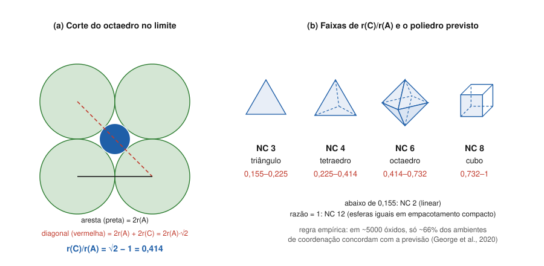

# Aula 02: Razão de raios e poliedros de coordenação

**ID:** mineralogia-m08-a02
**Módulo:** [[08-empacotamento-e-coordenacao-modulo|Módulo 08 — Cristaloquímica I: raios iônicos, coordenação e regras de Pauling]]
**Duração estimada:** ~28 min
**Nível:** ensino médio, sem geologia prévia (contrato `ensino-medio-sem-geologia-v1`)
**Objetivo:** prever o número de coordenação de um cátion pela razão entre o raio dele e o do ânion, deduzir de onde vêm os limites 0,155, 0,225, 0,414 e 0,732, e reconhecer quando a previsão falha.
**Pré-requisito:** [[08-empacotamento-e-coordenacao-aula-01-raios-ionicos-efetivos-por-que-o-raio-depende-da-coordenacao|Aula 01]] (raios iônicos efetivos).

## Vocabulário desta aula

| Termo | O que quer dizer |
|---|---|
| **razão de raios** | r(cátion) / r(ânion), um número entre 0 e cerca de 1 para os minerais comuns. |
| **valor-limite** | a razão em que o cátion toca exatamente todos os ânions de um poliedro, e os ânions se tocam entre si. |
| **triângulo, tetraedro, octaedro, cubo** | os poliedros de coordenação de NC 3, 4, 6 e 8. |
| **cuboctaedro** | o poliedro de NC 12, que aparece quando cátion e ânion têm tamanhos parecidos. |
| **regra empírica** | regra tirada da observação, que acerta na maioria dos casos mas não decorre de uma lei. |

## Antes de começar, você precisa saber

- Ler a tabela de Shannon pela carga, pelo NC e pelo spin ([[08-empacotamento-e-coordenacao-aula-01-raios-ionicos-efetivos-por-que-o-raio-depende-da-coordenacao|aula 01]]).
- **Matemática reativada:** num quadrado de lado L, a diagonal mede L·√2 (≈ 1,414·L); num cubo de aresta L, a diagonal do corpo mede L·√3 (≈ 1,732·L).

## Ao final você vai conseguir

- `mineralogia-m08-oa02` — Prever o número de coordenação de um cátion pela razão de raios e reconhecer os limites desse critério.

## Conteúdo

### A ideia: o maior número de vizinhos sem folga

Um cátion atrai ânions; ânions se repelem entre si. O arranjo estável junta em volta do cátion **o maior número de ânions possível, desde que o cátion continue tocando todos eles**. Se o cátion for pequeno demais para o poliedro, ele "chacoalha" dentro da gaiola de ânions, e a estrutura prefere um poliedro menor, com menos vizinhos, em que ele encoste em todos.

### De onde vem o 0,414

Corte um octaedro pelo plano de quatro dos seus seis ânions: aparece um quadrado de ânions com o cátion no centro (figura 2a). No caso-limite, os ânions se tocam (lado do quadrado = 2·r(A)) e o cátion toca os quatro. A diagonal do quadrado passa por dois ânions e pelo cátion:

2·r(A) + 2·r(C) = 2·r(A)·√2  →  **r(C)/r(A) = √2 − 1 = 0,414**

Abaixo de 0,414 o cátion folga no octaedro. Acima, ele empurra os ânions e os afasta, o que é aceitável até o cátion ficar grande o bastante para caber um vizinho a mais.

As outras fronteiras saem do mesmo raciocínio com outras figuras: o triângulo dá 2/√3 − 1 = 0,155; o tetraedro, √(3/2) − 1 = 0,225; o cubo, √3 − 1 = 0,732.

*Figura 2. (a) Corte do octaedro no plano de quatro ânions, no caso-limite. (b) As faixas de razão e o poliedro previsto em cada uma. O que observar: em (a), a diagonal vermelha atravessa dois ânions e o cátion; é ela que fixa o limite de 0,414.*

| r(C)/r(A) | NC previsto | Poliedro |
|---|---|---|
| < 0,155 | 2 | linear |
| 0,155–0,225 | 3 | triângulo |
| 0,225–0,414 | 4 | tetraedro |
| 0,414–0,732 | 6 | octaedro |
| 0,732–1,0 | 8 | cubo |
| ≈ 1,0 | 12 | cuboctaedro (ou o equivalente hexagonal) |

Note a lacuna: não aparecem NC 5, 7, 9 nem 10 na tabela, embora existam nos minerais (o K⁺ dos feldspatos e das micas tem mais de oito vizinhos, por exemplo). A regra só olha poliedros regulares e muito simétricos.

### Aplicando aos cátions das rochas

Dividindo pelo O²⁻ (1,40 Å) os raios em NC VI da aula 01:

| Cátion | r (VI) | r/1,40 | Previsão | Observado nos silicatos e óxidos |
|---|---|---|---|---|
| Si⁴⁺ | 0,40 | 0,29 | IV | IV (VI em alta pressão; na superfície, só na rara taumasita) |
| Al³⁺ | 0,535 | 0,38 | IV, perto do limite | IV **e** VI |
| Ti⁴⁺ | 0,605 | 0,43 | VI | VI |
| Mg²⁺ | 0,72 | 0,51 | VI | VI |
| Fe²⁺ (spin alto) | 0,78 | 0,56 | VI | VI |
| Ca²⁺ | 1,00 | 0,71 | VI, perto de VIII | VI a VIII |
| Na⁺ | 1,02 | 0,73 | fronteira VI–VIII | VI a IX |
| K⁺ | 1,38 | 0,99 | VIII a XII | VIII a XII |

A tabela acerta a sequência que vai organizar todo o estudo dos silicatos: **Si em tetraedro, Al em tetraedro ou octaedro, Mg e Fe²⁺ em octaedro, Ca e Na em sítios maiores, K nos maiores de todos**. O Al³⁺, com razão perto de 0,414, é justamente o cátion que aparece nas duas coordenações; o Ca²⁺ e o Na⁺, perto de 0,732, aparecem em VI, VII e VIII.

> [!question] Pare e explique
> Por que um cátion cuja razão cai perto de um valor-limite tende a aparecer em duas coordenações diferentes em minerais diferentes?

### Uma armadilha: qual raio usar?

O raio depende do NC (aula 01), e o NC é o que se quer prever. Há um círculo. A saída prática é comparar todos os cátions **no mesmo número de coordenação de referência** (aqui, VI), como na tabela. Se você usasse o raio do Si⁴⁺ em IV (0,26 Å), a razão daria 0,19 e "preveria" NC 3, o que é falso. A previsão depende da convenção de raios escolhida, e isso já diz muito sobre o grau de rigor da regra.

### Onde a regra falha

A razão de raios é uma **regra empírica**. Num estudo sobre cerca de 5000 óxidos de estrutura conhecida, só cerca de **66%** dos ambientes de coordenação concordaram com ela (George et al., 2020). Falhas típicas:

- **Ligação covalente.** O C⁴⁺ do carbonato fica num triângulo de O; a tabela de Shannon chega a dar a ele um raio **negativo** em NC III (−0,08 Å), sinal de que a ideia de esferas que se tocam não descreve a ligação C–O.
- **Zircão, ZrSiO₄.** Razão 0,51 (VI) ou 0,60 (com o raio de VIII): a regra prevê octaedro, mas o Zr tem **oito** vizinhos.
- **Espinélio, MgAl₂O₄.** O Mg²⁺ (razão 0,51) ocupa um sítio **tetraédrico** (aula 06).
- **Pressão.** Em alta pressão os cátions passam a coordenações maiores sem mudar de carga: o Si⁴⁺ da estishovita, polimorfo de alta pressão da sílica, tem NC VI (módulos 10 e 43).

A regra serve para **ordenar** os cátions por tamanho de sítio e para estranhar um resultado. Não serve para decidir sozinha a estrutura de um mineral.

## Exemplo trabalhado

**Problema.** Preveja o NC e confira: (a) Na na halita (Cl⁻ VI 1,81 Å); (b) Ca na fluorita, CaF₂ (Ca²⁺ VIII 1,12 Å; F⁻ IV 1,31 Å, porque cada F tem 4 Ca); (c) Zn na esfalerita (Zn²⁺ VI 0,74; S²⁻ VI 1,84 Å); (d) Zr no zircão.

**(a)** 1,02 / 1,81 = **0,564** → octaedro, NC 6. Observado: 6 (cada Na cercado por 6 Cl; ver a [cela da halita](../06-reticulo-e-cela/06-reticulo-e-cela-fig-06-cela-da-halita.svg) do módulo 06). Acerto.

**(b)** 1,12 / 1,31 = **0,855** → cubo, NC 8. Observado: 8 (aula 06). Acerto.

**(c)** 0,74 / 1,84 = **0,402** → tetraedro, NC 4, logo abaixo de 0,414. Observado: 4. Acerto, por pouco: um número tão perto do limite é uma previsão frágil.

**(d)** 0,72 / 1,40 = **0,514** → NC 6. Observado: 8. Falha. Lição: confira sempre com a estrutura medida.

**Método geral:** (1) raios na mesma tabela e no NC de referência; (2) divida cátion por ânion; (3) leia a faixa; (4) desconfie se a razão está perto de um limite ou se a ligação é covalente; (5) confirme com a estrutura.

## Erros comuns

- **Dividir ao contrário** (ânion por cátion). A razão é sempre do menor (em geral o cátion) pelo maior.
- **Tratar os limites como fronteiras exatas.** 0,40 e 0,43 caem em faixas diferentes, mas a diferença real entre os dois casos é pequena.
- **Concluir que o NC 12 exige razão exatamente 1.** É o caso-limite de esferas iguais (aula 03); cátions grandes, como o K⁺, chegam a NC altos com razão um pouco abaixo de 1.
- **Esquecer que o próprio raio depende do NC**, e misturar raios de NC diferentes na comparação.

## O que não concluir

- Que a razão de raios explique **por que** o Si é tetraédrico. Ela é compatível com isso; a ligação Si–O, em boa parte covalente, também pesa (módulo 01, aula 04).
- Que um mineral que contraria a regra esteja "errado". A regra é que é aproximada.
- Que NC alto signifique ligação forte. É o contrário: mais vizinhos dividem a mesma carga (aula 04).

## Recap relâmpago

- Princípio: o máximo de ânions em volta do cátion, sem o cátion folgar.
- Limites geométricos: 0,155 (III), 0,225 (IV), 0,414 (VI), 0,732 (VIII); ~1 para XII. O 0,414 sai da diagonal do quadrado: √2 − 1.
- Com O²⁻ = 1,40 Å e raios em VI: Si 0,29 (IV), Al 0,38 (IV e VI), Mg 0,51 e Fe²⁺ 0,56 (VI), Ca 0,71 e Na 0,73 (VI–VIII), K 0,99 (VIII–XII).
- Acertos: halita 0,56 → 6; fluorita 0,86 → 8; esfalerita 0,40 → 4.
- Falhas: zircão (8, não 6), Mg tetraédrico no espinélio, C do carbonato, alta pressão. Só ~66% de acerto em ~5000 óxidos.

## Próxima aula

Em [[08-empacotamento-e-coordenacao-aula-03-empacotamento-compacto-e-intersticios|Aula 03 — Empacotamento compacto e interstícios]], a pergunta se inverte: em vez de quantos ânions cabem em volta de um cátion, onde cabem os cátions dentro de uma pilha compacta de ânions. Os mesmos números, 0,414 e 0,225, voltam como tamanho dos buracos.

## Fontes consultadas

- Shannon, R. D. (1976), *Acta Crystallographica* A32, 751–767 — raios conferidos em 2026-10-06 nas compilações dos pacotes *pymatgen* e *mendeleev* (inclusive C⁴⁺ III = −0,08 Å e Zr⁴⁺ VIII = 0,84 Å).
- Pauling, L. (1929). The principles determining the structure of complex ionic crystals. *Journal of the American Chemical Society* 51, 1010–1026 (razão de raios como critério de coordenação).
- George, J., Waroquiers, D., Di Stefano, D., Petretto, G., Rignanese, G.-M. & Hautier, G. (2020). The limited predictive power of the Pauling rules. *Angewandte Chemie International Edition* 59, doi:10.1002/anie.202000829 (~5000 óxidos; ~66% dos ambientes concordam com a primeira regra) — conferido por busca em 2026-10-06.
- Klein & Dutrow, *Manual of Mineral Science*, 23ª ed. (razão de raios e poliedros de coordenação); *Handbook of Mineralogy* (zircão, espinélio, estishovita). Taumasita, Ca₃Si(OH)₆(CO₃)(SO₄)·12H₂O, com Si octaédrico estável em condições ambiente (*Physics and Chemistry of Minerals*, estudos de expansão térmica da taumasita; Mindat) — conferido por busca em 2026-10-06.
- Valores-limite e razões calculados em Python em 2026-10-06.

<!--
nivel: ensino-medio-sem-geologia-v1
palavras_corpo: 1327
cobertura:
  mineralogia-m08-oa02: [Conteúdo, Exemplo trabalhado]
figuras:
  - 08-empacotamento-e-coordenacao-fig-02-razao-de-raios-e-poliedros.svg
  - ../06-reticulo-e-cela/06-reticulo-e-cela-fig-06-cela-da-halita.svg (reaproveitada)
alegacoes_auditaveis:
  - claim_id: CRQ-RR-LIMITES-001
    claim: "Limites: triangulo 2/raiz3 - 1 = 0,155; tetraedro raiz(3/2) - 1 = 0,225; octaedro raiz2 - 1 = 0,414; cubo raiz3 - 1 = 0,732; ~1 para NC 12."
    risk: numero
    source: "Pauling (1929); Klein & Dutrow; calculo"
    audit: "verificado em 2026-10-06 (calculo: 0,1547; 0,2247; 0,4142; 0,7321)"
  - claim_id: CRQ-RR-TABELA-001
    claim: "Si VI em alta pressao e, como excecao de superficie, na taumasita. Razoes com O2- 1,40 e cations em VI: Si 0,29; Al 0,38; Ti 0,43; Mg 0,51; Fe2+ 0,56; Ca 0,71; Na 0,73; K 0,99; coordenacoes observadas: Si IV; Al IV e VI; Ti, Mg, Fe2+ VI; Ca VI-VIII; Na VI-IX; K VIII-XII."
    risk: numero
    source: "Shannon (1976); Klein & Dutrow; calculo"
    audit: "corrigido em 2026-10-06 (🟠: 'Si VI so em alta pressao' e falso como escrito: taumasita tem Si octaedrico estavel em condicoes ambiente); razoes recalculadas"
  - claim_id: CRQ-RR-ESTAT-001
    claim: "Em ~5000 oxidos, so ~66% dos ambientes de coordenacao concordam com a primeira regra de Pauling (George et al., 2020)."
    risk: numero
    source: "George et al. (2020), Angew. Chem. Int. Ed. 59, doi:10.1002/anie.202000829 (busca)"
    audit: "verificado em 2026-10-06 (busca: George et al. 2020, ~5000 oxidos, 66% de concordancia com a primeira regra)"
  - claim_id: CRQ-RR-FALHAS-001
    claim: "Falhas: C4+ III tem raio de Shannon negativo (-0,08 A); Zr no zircao tem NC 8 (razao 0,51-0,60 preveria 6); Mg tetraedrico no espinelio; Si VI na estishovita (alta pressao)."
    risk: fato
    source: "Shannon (1976); Handbook of Mineralogy; Klein & Dutrow"
    audit: "verificado em 2026-10-06 (Shannon C4+ III -0,08 e Zr VIII 0,84 nas compilacoes; zircao Zr VIII, espinelio Mg IV e estishovita Si VI: Klein & Dutrow/HoM)"
  - claim_id: CRQ-RR-EXEMPLOS-001
    claim: "Halita 1,02/1,81 = 0,564 (6); fluorita Ca VIII 1,12 / F IV 1,31 = 0,855 (8); esfalerita Zn VI 0,74 / S 1,84 = 0,402 (4); zircao 0,72/1,40 = 0,514 (observado 8)."
    risk: numero
    source: "Shannon (1976); calculo"
    audit: "verificado em 2026-10-06 (recalculo)"
-->
