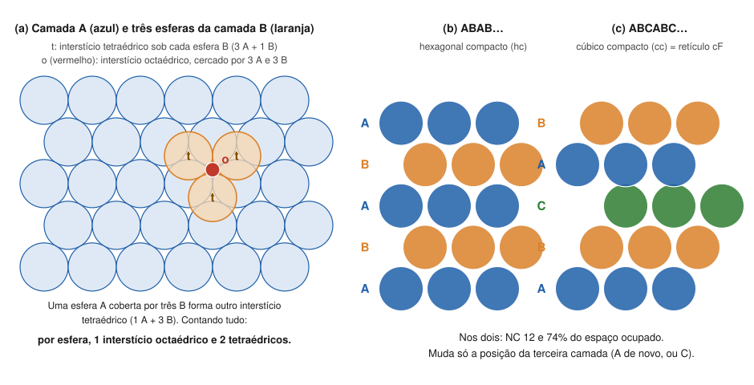

# Aula 03: Empacotamento compacto e interstícios

**ID:** mineralogia-m08-a03
**Módulo:** [[08-empacotamento-e-coordenacao-modulo|Módulo 08 — Cristaloquímica I: raios iônicos, coordenação e regras de Pauling]]
**Duração estimada:** ~30 min
**Nível:** ensino médio, sem geologia prévia (contrato `ensino-medio-sem-geologia-v1`)
**Objetivo:** descrever os empacotamentos compactos hexagonal e cúbico, localizar e contar os interstícios tetraédricos e octaédricos, e usar essa contagem para ler a estrutura de minerais como a halita, o corindo, a olivina e o espinélio.
**Pré-requisito:** [[08-empacotamento-e-coordenacao-aula-02-razao-de-raios-e-poliedros-de-coordenacao|Aula 02]] (poliedros e valores-limite) e [[06-reticulo-e-cela-aula-03-os-14-reticulos-de-bravais|módulo 06, aula 03]] (retículo cF).

## Vocabulário desta aula

| Termo | O que quer dizer |
|---|---|
| **camada compacta** | esferas iguais num plano, cada uma tocando seis vizinhas, como bolas de gude bem apertadas numa bandeja. |
| **empacotamento compacto** | pilha de camadas compactas em que cada esfera se aninha nas depressões da camada de baixo. |
| **hexagonal compacto (hc)** | empilhamento ABAB…, que se repete a cada duas camadas. |
| **cúbico compacto (cc)** | empilhamento ABCABC…, que se repete a cada três camadas; é o retículo cúbico de faces centradas (cF) do módulo 06. |
| **interstício (sítio)** | o espaço vazio entre esferas vizinhas, onde cabe um átomo menor. |
| **fração de empacotamento** | a parte do volume ocupada pelas esferas. |

## Antes de começar, você precisa saber

- Os valores-limite 0,225 (tetraedro) e 0,414 (octaedro) e como saem da geometria ([[08-empacotamento-e-coordenacao-aula-02-razao-de-raios-e-poliedros-de-coordenacao|aula 02]]).
- O retículo cúbico de faces centradas (cF), com 4 pontos por cela, e a contagem por pesos 1/8, 1/4, 1/2 ([[06-reticulo-e-cela-aula-02-cela-primitiva-e-cela-convencional|módulo 06, aula 02]]).

## Ao final você vai conseguir

- `mineralogia-m08-oa03` — Descrever os empacotamentos compactos hexagonal e cúbico e localizar os interstícios tetraédricos e octaédricos.

## Conteúdo

### Uma camada, duas maneiras de empilhar

Ponha laranjas iguais numa caixa, o mais juntas possível: cada uma toca seis vizinhas no mesmo plano (camada **A**). Entre três laranjas que se tocam há uma depressão; há dois conjuntos delas, alternados, que vamos chamar de posições **B** e **C**. A segunda camada se aninha num dos dois conjuntos, digamos B. Ela não cabe nos dois ao mesmo tempo, porque as depressões B e C vizinhas estão perto demais.

Na terceira camada aparece a escolha que define tudo:

- ela repete a posição **A** → empilhamento **ABAB…**, o **hexagonal compacto (hc)**;
- ela ocupa a posição **C**, ainda livre → **ABCABC…**, o **cúbico compacto (cc)**.

Nos dois casos cada esfera toca **12** vizinhas (6 na própria camada, 3 acima, 3 abaixo) e as esferas ocupam **74%** do espaço (π/(3√2) = 0,7405). Não há maneira de empilhar esferas iguais mais densa que essa. Para comparar: o cúbico de corpo centrado, com NC 8, ocupa 68%; o cúbico simples, com NC 6, 52%.

O cúbico compacto é o mesmo arranjo da cela cF: as camadas compactas são os planos perpendiculares à diagonal do cubo. Por isso o ouro, a prata e o cobre nativos, de cela cF, são empacotamentos cúbicos compactos de átomos metálicos.

*Figura 3. (a) Camada A vista de cima, com três esferas da camada B. (b) e (c) As pilhas ABAB e ABCABC vistas de lado, esquematicamente. O que observar: em (a), cada "t" marca um interstício tetraédrico e o ponto vermelho, um octaédrico; em (b) e (c), só a terceira camada muda.*

### Os buracos entre as esferas

Duas camadas compactas encostadas deixam dois tipos de vazio:

- **interstício tetraédrico:** uma esfera de uma camada sobre três da outra. Os quatro centros formam um tetraedro;
- **interstício octaédrico:** três esferas de uma camada e três da outra, giradas de 60°. Os seis centros formam um octaedro.

Contando numa pilha grande: **para cada esfera há 1 interstício octaédrico e 2 tetraédricos**. Na cela cF, que contém 4 esferas, isso aparece direto: os octaédricos ficam no centro do cubo e nos meios das 12 arestas (1 + 12 × 1/4 = 4); os tetraédricos, nas 8 posições do tipo (¼, ¼, ¼), dentro da cela (8).

Que tamanho de átomo cabe neles sem afastar as esferas? A mesma conta da aula 02: **0,414·R** no octaédrico e **0,225·R** no tetraédrico, sendo R o raio das esferas da pilha.

### Os minerais como pilhas de ânions com cátions nos buracos

Muitas estruturas de óxidos e sulfetos se descrevem assim: os **ânions**, grandes, formam (aproximadamente) um empacotamento compacto; os **cátions**, pequenos, ocupam uma fração dos interstícios. A fração sai da fórmula química, porque cada ânion traz 1 octaédrico e 2 tetraédricos.

| Mineral | Pilha | Cátions | Fração ocupada |
|---|---|---|---|
| Halita, NaCl | cc de Cl | Na em octaédricos | todos (1 Na por Cl) |
| Esfalerita, ZnS | cc de S | Zn em tetraédricos | metade (1 Zn para 2 sítios) |
| Wurtzita, ZnS | hc de S | Zn em tetraédricos | metade |
| Corindo, Al₂O₃ | hc de O | Al em octaédricos | 2/3 (2 Al para 3 sítios) |
| Olivina, Mg₂SiO₄ | hc de O (distorcido) | Mg em octaédricos; Si em tetraédricos | Mg 1/2; Si 1/8 |
| Espinélio, MgAl₂O₄ | cc de O | Mg em tetraédricos; Al em octaédricos | Mg 1/8; Al 1/2 |

Um caso ao contrário: na **fluorita**, CaF₂, são os cátions Ca²⁺ que formam o arranjo cúbico compacto (cela cF), e os F⁻ ocupam **todos** os interstícios tetraédricos (2 F para cada Ca). Ela volta na aula 06.

> [!question] Pare e explique
> Halita e esfalerita têm a mesma pilha de ânions. O que, na razão de raios da aula 02, explica que uma ponha o cátion no octaedro e a outra no tetraedro?

### O limite da imagem

"Pilha compacta de ânions" é uma **descrição geométrica**, não a afirmação de que os ânions se tocam. Na halita, a razão Na/Cl (0,56) é maior que 0,414: o Na⁺ é grande demais para o buraco e afasta os Cl⁻. A distância Cl–Cl é a/√2 = 3,99 Å, contra 2 × 1,81 = 3,62 Å se eles se tocassem. Na olivina, a pilha de O é visivelmente distorcida. A descrição continua útil porque diz **onde** ficam os cátions e quantos vizinhos cada um tem.

## Exemplo trabalhado

**Problema.** O corindo, Al₂O₃, tem os O em empacotamento hexagonal compacto e o Al em interstícios octaédricos. (a) Que fração dos octaédricos o Al ocupa? (b) Quantos tetraédricos ficam ocupados? (c) Faça o mesmo para o espinélio, MgAl₂O₄, sabendo que o Mg é tetraédrico e o Al, octaédrico. (d) Na olivina, Mg₂SiO₄, confira as frações 1/2 e 1/8.

**(a)** Por fórmula: 3 O → 3 octaédricos e 6 tetraédricos. 2 Al nos 3 octaédricos → **2/3** ocupados; 1/3 vazio.

**(b)** **Nenhum.** Os 6 tetraédricos por fórmula ficam vazios.

**(c)** 4 O → 4 octaédricos e 8 tetraédricos. 2 Al em 4 octaédricos → **1/2**; 1 Mg em 8 tetraédricos → **1/8**.

**(d)** 4 O → 4 octaédricos e 8 tetraédricos. 2 Mg em 4 → **1/2**; 1 Si em 8 → **1/8**. Confere.

**Conferência pela carga.** Corindo: 2 Al³⁺ = +6 para 3 O²⁻ = −6. Espinélio: Mg²⁺ + 2 Al³⁺ = +8 para 4 O²⁻ = −8. Olivina: 2 Mg²⁺ + Si⁴⁺ = +8 para −8. A contagem de sítios e a neutralidade (módulo 01, aula 03) contam a mesma história.

**Método geral:** (1) conte os ânions da fórmula; (2) cada um traz 1 octaédrico e 2 tetraédricos; (3) divida o número de cátions de cada tipo pelos sítios do tipo que ele ocupa; (4) confira a carga.

## Erros comuns

- **Achar que hc e cc diferem no número de vizinhos.** Os dois têm NC 12 e 74% de ocupação; muda só a sequência das camadas.
- **Contar 1 tetraédrico por esfera.** São 2: um abaixo e um acima de cada esfera, na direção do empilhamento.
- **Supor que todos os buracos estão cheios.** Os minerais ocupam frações (1/2, 2/3, 1/8), ditadas pela fórmula e pela carga.
- **Ler "cúbico compacto" como "cela cúbica simples".** O cúbico compacto é a cela cF, de faces centradas.

## O que não concluir

- Que os ânions de um mineral se toquem só porque a estrutura é descrita como pilha compacta deles. Na halita não se tocam.
- Que todo mineral seja uma pilha compacta de ânions. Silicatos com tetraedros polimerizados em arcabouço, como o quartzo e os feldspatos, não se descrevem bem assim (módulo 11).
- Que a escolha entre ABAB e ABCABC seja indiferente. Ela muda a simetria (hexagonal ou cúbica) e, nos sulfetos de zinco, separa esfalerita de wurtzita (módulo 10).

## Recap relâmpago

- Camada compacta: 6 vizinhas no plano. ABAB… = hexagonal compacto; ABCABC… = cúbico compacto = cela cF.
- Nos dois: NC 12, 74% do espaço (π/(3√2)); corpo centrado 68%, cúbico simples 52%.
- Por esfera: 1 interstício octaédrico (cabe 0,414·R) e 2 tetraédricos (0,225·R). Na cela cF: 4 esferas, 4 octaédricos, 8 tetraédricos.
- Halita: cc de Cl, Na em todos os octaédricos. Esfalerita/wurtzita: cc/hc de S, Zn em metade dos tetraédricos. Corindo: hc de O, Al em 2/3 dos octaédricos. Olivina: Mg 1/2 octa, Si 1/8 tetra. Espinélio: Mg 1/8 tetra, Al 1/2 octa.
- As frações saem da fórmula; a pilha "compacta" é descrição, não contato.

## Próxima aula

Em [[08-empacotamento-e-coordenacao-aula-04-regras-de-pauling-parte-1-coordenacao-e-valencia-eletrostatica|Aula 04 — As regras de Pauling, Parte 1]], os poliedros desta aula ganham uma contabilidade de cargas: quanto de cada cátion chega a cada ânion, e por que isso decide quais arranjos são estáveis.

## Fontes consultadas

- Klein & Dutrow, *Manual of Mineral Science*, 23ª ed., e Nesse, *Introduction to Mineralogy* (empacotamento compacto, interstícios e estruturas descritas como pilhas de ânions).
- Birle, J. D., Gibbs, G. V., Moore, P. B. & Smith, J. V. (1968). Crystal structures of natural olivines. *American Mineralogist* 53, 807 (olivina como hc aproximado de O, metade dos octaédricos e 1/8 dos tetraédricos ocupados) — conferido por busca em 2026-10-06.
- Estrutura do corindo (hc de O, Al em 2/3 dos octaédricos) e do espinélio (cc de O; 1/8 dos tetraédricos, 1/2 dos octaédricos): conferidas por busca em 2026-10-06 (resumos de mineralogia de óxidos e da estrutura do espinélio).
- *Handbook of Mineralogy*: halita (a = 5,6404 Å); ouro, prata e cobre nativos (Fm3̄m).
- Frações de empacotamento (0,7405; 0,6802; 0,5236), distância Cl–Cl (3,99 Å) e contagens calculadas em Python em 2026-10-06.

<!--
nivel: ensino-medio-sem-geologia-v1
palavras_corpo: 1250
cobertura:
  mineralogia-m08-oa03: [Conteúdo, Exemplo trabalhado]
figuras:
  - 08-empacotamento-e-coordenacao-fig-03-empacotamento-compacto.svg
alegacoes_auditaveis:
  - claim_id: CRQ-EMP-HCCC-001
    claim: "Empilhamento ABAB = hexagonal compacto; ABCABC = cubico compacto = celula cF; NC 12 nos dois; fracao pi/(3 raiz2) = 0,7405; ccc 0,680 (NC 8); cubico simples 0,524 (NC 6)."
    risk: numero
    source: "Klein & Dutrow; calculo"
    audit: "verificado em 2026-10-06 (calculo: 0,7405; 0,6802; 0,5236)"
  - claim_id: CRQ-EMP-INTERST-001
    claim: "Por esfera, 1 intersticio octaedrico e 2 tetraedricos; na cela cF: octaedricos no centro e nos meios das arestas (4), tetraedricos em (1/4,1/4,1/4) etc. (8); cabem 0,414 R e 0,225 R."
    risk: conceito
    source: "Klein & Dutrow; calculo"
    audit: "verificado em 2026-10-06 (contagem na cela cF: 4 esferas, 1+12x1/4 = 4 octa, 8 tetra)"
  - claim_id: CRQ-EMP-MINERAIS-001
    claim: "Halita: cc de Cl, Na em todos os octaedricos. Esfalerita: cc de S, Zn em metade dos tetraedricos; wurtzita: hc de S, idem. Corindo: hc de O, Al em 2/3 dos octaedricos. Olivina: hc distorcido de O, M em 1/2 dos octaedricos e Si em 1/8 dos tetraedricos. Espinelio: cc de O, 1/8 dos tetraedricos e 1/2 dos octaedricos. Fluorita: Ca em cF, F em todos os tetraedricos."
    risk: fato
    source: "Birle et al. (1968) Am. Mineral. 53, 807 (olivina); busca (corindo, espinelio); Klein & Dutrow"
    audit: "verificado em 2026-10-06 (busca: olivina Birle et al. 1968; corindo 2/3 dos octaedricos; espinelio 1/8 tetra e 1/2 octa; wurtzita ABAB; fracoes conferidas pela formula)"
  - claim_id: CRQ-EMP-METAIS-001
    claim: "Ouro, prata e cobre nativos tem cela cF (empacotamento cubico compacto)."
    risk: fato
    source: "Handbook of Mineralogy (Fm3m)"
    audit: "verificado em 2026-10-06 (Fm3m para ouro, prata e cobre: Handbook of Mineralogy, ja usado na auditoria do m04)"
  - claim_id: CRQ-EMP-HALCL-001
    claim: "Na halita a distancia Cl-Cl e a/raiz2 = 3,99 A, maior que 2 x 1,81 = 3,62 A: os Cl nao se tocam."
    risk: numero
    source: "Handbook of Mineralogy (a = 5,6404); Shannon (1976); calculo"
    audit: "verificado em 2026-10-06 (5,6404/raiz2 = 3,988 A)"
-->
