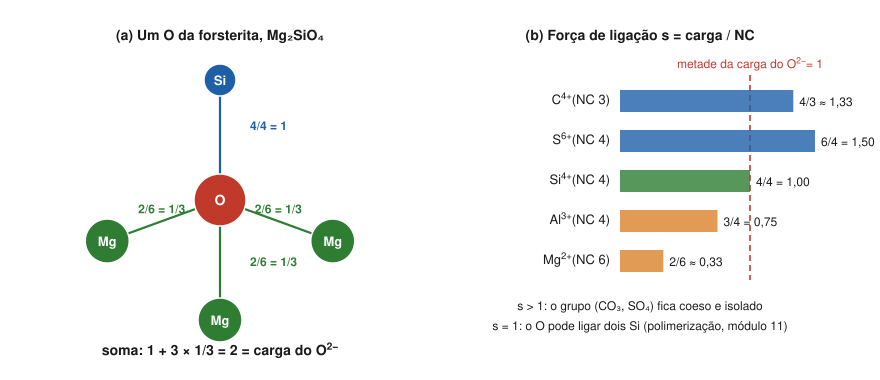

# Aula 04: As regras de Pauling — Parte 1: coordenação e valência eletrostática

**ID:** mineralogia-m08-a04
**Módulo:** [[08-empacotamento-e-coordenacao-modulo|Módulo 08 — Cristaloquímica I: raios iônicos, coordenação e regras de Pauling]]
**Duração estimada:** ~30 min
**Nível:** ensino médio, sem geologia prévia (contrato `ensino-medio-sem-geologia-v1`)
**Objetivo:** enunciar a primeira e a segunda regras de Pauling, calcular a força de ligação eletrostática de cada cátion e usar a soma dessas forças em cada ânion para testar se um arranjo é plausível e para prever quais grupos aniônicos ficam isolados e quais se polimerizam.
**Pré-requisito:** [[08-empacotamento-e-coordenacao-aula-02-razao-de-raios-e-poliedros-de-coordenacao|Aula 02]] (razão de raios) e [[08-empacotamento-e-coordenacao-aula-03-empacotamento-compacto-e-intersticios|aula 03]] (estruturas como poliedros em pilhas de ânions). Esta é a Parte 1; a Parte 2 (regras 3 a 5) vem na aula 05.

## Vocabulário desta aula

| Termo | O que quer dizer |
|---|---|
| **regras de Pauling** | cinco princípios empíricos publicados por Linus Pauling em 1929 para entender estruturas de cristais iônicos complexos. |
| **força de ligação eletrostática (s)** | a parcela da carga de um cátion que chega a cada ânion vizinho: s = carga do cátion / NC. Também chamada de valência eletrostática. |
| **princípio da valência eletrostática** | a segunda regra: a soma das forças que chegam a um ânion iguala (ou quase) a carga desse ânion. |
| **grupo aniônico** | conjunto cátion + ânions tão fortemente ligado que se comporta como uma unidade: CO₃²⁻, SO₄²⁻, SiO₄⁴⁻. |
| **polimerização** | ligação de grupos iguais por ânions compartilhados, formando pares, anéis, cadeias, folhas ou arcabouços. |

## Antes de começar, você precisa saber

- Raios iônicos e razão de raios ([[08-empacotamento-e-coordenacao-aula-01-raios-ionicos-efetivos-por-que-o-raio-depende-da-coordenacao|aula 01]] e [[08-empacotamento-e-coordenacao-aula-02-razao-de-raios-e-poliedros-de-coordenacao|aula 02]]).
- Neutralidade de carga: a soma das cargas de um mineral é zero ([[01-fundamentos-quimicos-aula-03-ions-e-estados-de-oxidacao-fe-mn-e-s|módulo 01, aula 03]]).
- **Matemática reativada:** somar frações (1/3 + 1/3 + 1/3 = 1; 4/6 = 2/3).

## Ao final você vai conseguir

- `mineralogia-m08-oa04` — Aplicar as cinco regras de Pauling, incluindo a valência eletrostática, para julgar a estabilidade de um arranjo e explicar o compartilhamento de poliedros. *Esta aula cobre as regras 1 e 2.*

## Conteúdo

### Por que regras, e de quem

Em 1929, Linus Pauling (o mesmo da escala de eletronegatividade, módulo 01) reuniu num artigo cinco princípios que explicavam por que as estruturas iônicas conhecidas eram como eram. São **regras empíricas**: resumem o que se observa, e o próprio modelo iônico por trás delas é uma idealização (módulo 01, aula 04). Mesmo assim, organizam o raciocínio sobre estruturas até hoje, e o módulo 11 inteiro (silicatos) se apoia nelas.

### Primeira regra: o poliedro de coordenação

> Em torno de cada cátion forma-se um poliedro de ânions. A distância cátion–ânion é dada pela soma dos raios, e o número de coordenação, pela razão de raios.

É o que as aulas 01 e 02 construíram. A consequência prática: uma estrutura pode ser descrita como **poliedros ligados entre si** (tetraedros de SiO₄, octaedros de MgO₆), e a pergunta passa a ser como esses poliedros se juntam.

### Segunda regra: o princípio da valência eletrostática

> Numa estrutura iônica estável, a carga de cada ânion é compensada, exatamente ou quase, pela soma das forças de ligação eletrostática que chegam a ele vindas dos cátions vizinhos.

A **força de ligação** de um cátion é a carga dele repartida igualmente entre os seus vizinhos:

**s = z / NC**  (z = carga do cátion; NC = número de coordenação)

- Na⁺ em octaedro: s = 1/6. Mg²⁺ em octaedro: 2/6 = 1/3. Al³⁺ em octaedro: 3/6 = 1/2; em tetraedro: 3/4.
- Si⁴⁺ em tetraedro: 4/4 = **1**. C⁴⁺ em triângulo: **4/3**. S⁶⁺ em tetraedro: **6/4 = 3/2**.

A regra pede que, para cada ânion, **Σs = |carga do ânion|**: 2 para o O²⁻, 1 para o Cl⁻ e o F⁻.

**Halita.** Cada Cl⁻ recebe 6 ligações de Na⁺: 6 × 1/6 = 1. ✔
**Rutilo, TiO₂.** Ti⁴⁺ em octaedro (s = 2/3); cada O tem 3 Ti: 3 × 2/3 = 2. ✔
**Corindo, Al₂O₃.** Al em octaedro (s = 1/2); cada O tem 4 Al: 4 × 1/2 = 2. ✔
**Forsterita, Mg₂SiO₄.** Cada O tem 1 Si e 3 Mg: 1 + 3 × 1/3 = 2. ✔ (figura 5a)

*Figura 5. (a) Um oxigênio da forsterita e as quatro ligações que chegam a ele. (b) A força de ligação de cátions comuns, comparada à metade da carga do O²⁻. O que observar: em (a), as forças somam exatamente 2; em (b), quem passa da linha vermelha forma grupos isolados, quem fica nela pode polimerizar.*

Por que o oxigênio da forsterita tem exatamente 1 Si e 3 Mg? Conte as ligações: 2 Mg × 6 + 1 Si × 4 = 16 ligações para 4 O, 4 por O; como cada Si se liga a 4 O diferentes, cada O recebe exatamente 1 Si e, portanto, 3 Mg. A segunda regra confirma que essa vizinhança é a que neutraliza o O.

> [!question] Pare e explique
> Se um O da forsterita recebesse 2 Si e 1 Mg, quanto somaria? Por que isso seria um problema?

### Para que a regra serve

**1. Testar um arranjo proposto.** Um O ligado a 2 Si e 1 Mg receberia 1 + 1 + 1/3 = 7/3 ≈ 2,33: excesso de carga positiva. A regra diz que essa vizinhança é improvável, e de fato as estruturas reais a evitam ou se distorcem para compensar.

**2. Prever grupos isolados e polimerização.** Compare s com **metade** da carga do ânion (1, para o O²⁻):

- **s > 1** (C⁴⁺ no triângulo, 4/3; S⁶⁺ no tetraedro, 3/2): o O já recebe do cátion central mais da metade do que precisa. Sobra pouco para outra ligação forte, e o grupo (CO₃²⁻, SO₄²⁻) fica **coeso e isolado**, ligado ao resto por ligações mais fracas. Estruturas assim são chamadas **anisodésmicas** (ligações de forças muito diferentes).
- **s = 1** (Si⁴⁺ no tetraedro): o O recebe exatamente metade do que precisa de um Si e pode receber a outra metade de **outro Si**. Os tetraedros podem compartilhar oxigênios e se polimerizar em pares, anéis, cadeias, folhas e arcabouços. É o caso **mesodésmico**, e é a razão de existir a classificação dos silicatos do módulo 11.
- **todas as s < 1** e parecidas entre si (halita, periclásio, espinélio): nenhum grupo se destaca; estrutura **isodésmica**.

No quartzo, cada O está entre 2 Si: 1 + 1 = 2. ✔ Na calcita, cada O tem 1 C e 2 Ca²⁺ em octaedro: 4/3 + 2 × 1/3 = 2. ✔

### Valência de ligação: a versão moderna

A regra de Pauling divide a carga igualmente entre todos os vizinhos. Na prática, num poliedro distorcido, as ligações mais curtas são mais fortes. A teoria da **valência de ligação** (I. D. Brown e colaboradores) refina a segunda regra atribuindo a cada ligação uma força que depende do seu comprimento; a soma em cada átomo continua a dar a sua valência. É ela que se usa hoje para conferir estruturas.

### Quão bem a regra funciona

Testada com critério rígido em cerca de 5000 óxidos, a segunda regra falha em muitos deles (George et al., 2020): as somas reais desviam do valor ideal, às vezes bastante. Use-a como **teste de plausibilidade**, não como lei.

## Exemplo trabalhado

**Problema.** Verifique a segunda regra em (a) espinélio normal, MgAl₂O₄ (Mg em tetraedro, Al em octaedro; cada O tem 1 Mg e 3 Al); (b) magnetita, Fe₃O₄, um espinélio **inverso**: no tetraedro fica Fe³⁺, e os dois octaedros por fórmula guardam um Fe²⁺ e um Fe³⁺; (c) perovskita ideal, CaTiO₃ (Ti em octaedro; Ca com 12 O; cada O tem 2 Ti e 4 Ca).

**(a)** s(Mg, IV) = 2/4 = 1/2; s(Al, VI) = 3/6 = 1/2. Σ = 1/2 + 3 × 1/2 = **2**. ✔ Todas as ligações valem 1/2: estrutura isodésmica.

**(b)** s(Fe³⁺, IV) = 3/4. Nos octaedros a carga média é (2 + 3)/2 = 2,5, logo s = 2,5/6 = 5/12. Σ = 3/4 + 3 × 5/12 = 3/4 + 5/4 = **2**. ✔ A regra é satisfeita com a distribuição inversa (e também com a normal: a regra 2, sozinha, não escolhe entre elas).

**(c)** s(Ti, VI) = 4/6 = 2/3; s(Ca, XII) = 2/12 = 1/6. Σ = 2 × 2/3 + 4 × 1/6 = 4/3 + 2/3 = **2**. ✔

**Método geral:** (1) para cada cátion, s = carga/NC; (2) para cada ânion, liste os vizinhos e some as s; (3) compare com a carga do ânion; (4) compare cada s com metade da carga do ânion para saber se há grupo isolado ou polimerização.

## Erros comuns

- **Dividir pela carga do ânion em vez do NC do cátion.** s = carga **do cátion** / NC **do cátion**.
- **Achar que s é a carga real transferida.** É uma contabilidade, como o estado de oxidação (módulo 01, aula 03).
- **Confundir "s = 1 no Si" com "ligação Si–O fraca".** s = 1 está entre as maiores forças de ligação dos cátions comuns dos silicatos; o ponto é que ela vale exatamente a metade da carga do O.
- **Esperar Σ exatamente 2 em toda estrutura real.** Desvios em relação ao valor ideal são comuns; as distâncias se ajustam para compensá-los em parte (é o que a valência de ligação mede).

## O que não concluir

- Que satisfazer a regra 2 prove que uma estrutura é a correta. Várias estruturas podem satisfazê-la (magnetita normal ou inversa).
- Que o grupo SO₄ ou CO₃ seja uma molécula separada flutuando no cristal. Ele é um poliedro muito coeso, mas ligado aos cátions vizinhos.
- Que a regra valha para metais e sulfetos de ligação covalente forte. Ela foi formulada para cristais iônicos.

## Recap relâmpago

- Regra 1: poliedro de ânions em torno de cada cátion; distância pela soma dos raios; NC pela razão de raios.
- Regra 2: s = carga do cátion / NC; em cada ânion, Σs = carga do ânion (2 para O²⁻).
- Exemplos: halita 6 × 1/6 = 1; rutilo 3 × 2/3 = 2; corindo 4 × 1/2 = 2; forsterita 1 + 3 × 1/3 = 2; espinélio 1/2 + 3 × 1/2 = 2.
- s > 1 (C⁴⁺ 4/3, S⁶⁺ 3/2): grupo isolado, anisodésmico. s = 1 (Si⁴⁺): polimerização, mesodésmico. Todas as s < 1 e parecidas: isodésmico.
- É teste de plausibilidade: só uma fração dos óxidos cumpre a regra com rigor (George et al., 2020).

## Próxima aula

Em [[08-empacotamento-e-coordenacao-aula-05-regras-de-pauling-parte-2-compartilhamento-de-poliedros-e-parcimonia|Aula 05 — As regras de Pauling, Parte 2]], as regras 3, 4 e 5: por que poliedros preferem compartilhar vértices a arestas e faces, por que os tetraedros de silício quase nunca dividem arestas, e por que as estruturas tendem a ter poucos tipos de sítio.

## Fontes consultadas

- Pauling, L. (1929). The principles determining the structure of complex ionic crystals. *Journal of the American Chemical Society* 51, 1010–1026 (enunciado das regras 1 e 2) — conferido por busca em 2026-10-06.
- Klein & Dutrow, *Manual of Mineral Science*, 23ª ed., e Perkins, *Mineralogy* (LibreTexts, seção "Pauling's Second Rule"): ligações isodésmicas, anisodésmicas e mesodésmicas; C⁴⁺ 4/3, S⁶⁺ 3/2, Si⁴⁺ 1 — conferido por busca em 2026-10-06.
- Brown, I. D. (2002). *The Chemical Bond in Inorganic Chemistry: The Bond Valence Model*. Oxford University Press.
- George, J. et al. (2020). The limited predictive power of the Pauling rules. *Angewandte Chemie International Edition* 59, doi:10.1002/anie.202000829 — conferido por busca em 2026-10-06.
- Magnetita como espinélio inverso (Fe³⁺ no tetraedro; Fe²⁺ e Fe³⁺ nos octaedros): conferido por busca em 2026-10-06.
- Todas as somas feitas com frações exatas em Python em 2026-10-06.

<!--
nivel: ensino-medio-sem-geologia-v1
palavras_corpo: 1407
cobertura:
  mineralogia-m08-oa04: [Conteúdo, Exemplo trabalhado]
figuras:
  - 08-empacotamento-e-coordenacao-fig-05-valencia-eletrostatica.svg
alegacoes_auditaveis:
  - claim_id: CRQ-PAU-ARTIGO-001
    claim: "Pauling publicou as cinco regras em 1929, J. Am. Chem. Soc. 51, 1010-1026; sao regras empiricas para cristais ionicos complexos."
    risk: fato
    source: "Pauling (1929) (busca)"
    audit: "verificado em 2026-10-06 (busca: J. Am. Chem. Soc. 51, p. 1010, 1929; pagina final 1026 citada de memoria de dominio, nao conferida na fonte)"
  - claim_id: CRQ-PAU-R1-001
    claim: "Regra 1: poliedro de anions em torno de cada cation; distancia pela soma dos raios; NC pela razao de raios."
    risk: conceito
    source: "Pauling (1929); Klein & Dutrow"
    audit: "verificado em 2026-10-06"
  - claim_id: CRQ-PAU-R2-001
    claim: "Regra 2: s = z/NC; em cada anion, a soma das s iguala (ou quase) a carga do anion."
    risk: conceito
    source: "Pauling (1929); Klein & Dutrow"
    audit: "verificado em 2026-10-06"
  - claim_id: CRQ-PAU-R2EX-001
    claim: "Halita 6 x 1/6 = 1; rutilo 3 x 2/3 = 2; corindo 4 x 1/2 = 2; forsterita 1 + 3 x 1/3 = 2 (cada O com 1 Si e 3 Mg); quartzo 1 + 1 = 2; calcita 4/3 + 2 x 1/3 = 2; espinelio 1/2 + 3 x 1/2 = 2; magnetita inversa 3/4 + 3 x 5/12 = 2; perovskita ideal 2 x 2/3 + 4 x 1/6 = 2."
    risk: numero
    source: "calculo com fracoes exatas"
    audit: "verificado em 2026-10-06 (fracoes exatas em Python, todas = 1 ou 2)"
  - claim_id: CRQ-PAU-DESMICO-001
    claim: "s > metade da carga do anion (C4+ 4/3, S6+ 3/2): grupo coeso e isolado, anisodesmico; s = metade (Si4+ 1): mesodesmico, permite polimerizacao; todas as s menores e parecidas: isodesmico."
    risk: conceito
    source: "Klein & Dutrow; Perkins (LibreTexts) (busca)"
    audit: "verificado em 2026-10-06 (busca: Perkins/LibreTexts, Colgate; spinel e halita isodesmicos, sulfatos e carbonatos anisodesmicos, silicatos mesodesmicos)"
  - claim_id: CRQ-PAU-BV-001
    claim: "A teoria da valencia de ligacao (Brown) refina a regra 2: forca de cada ligacao depende do comprimento; a soma em cada atomo da a valencia."
    risk: conceito
    source: "Brown (2002)"
    audit: "verificado em 2026-10-06"
  - claim_id: CRQ-PAU-MAGNET-001
    claim: "Magnetita e espinelio inverso: Fe3+ no sitio tetraedrico; Fe2+ e Fe3+ nos octaedricos."
    risk: fato
    source: "busca (estrutura do espinelio e da magnetita)"
    audit: "verificado em 2026-10-06 (busca: magnetita espinelio inverso Fd-3m)"
  - claim_id: CRQ-PAU-SIFORCA-001
    claim: "s = 1 do Si4+ esta entre as maiores forcas de ligacao dos cations comuns dos silicatos."
    risk: conceito
    source: "calculo s = z/NC (Si IV 1; B III 1; Al IV 0,75; Ti VI 0,67)"
    audit: "corrigido em 2026-10-06 (🟡: 'a maior' ignorava o B3+ em triangulo, s = 1, nos borossilicatos)"
  - claim_id: CRQ-PAU-ESTAT2-001
    claim: "(removida) A regra 2 falharia sobretudo quando ha cations de raio e carga muito diferentes."
    risk: interpretacao
    source: "sem fonte"
    audit: "removido em 2026-10-06 (🔵: atribuicao a George et al. 2020 nao confirmada por busca; frase retirada, mantida so a constatacao geral)"
-->
