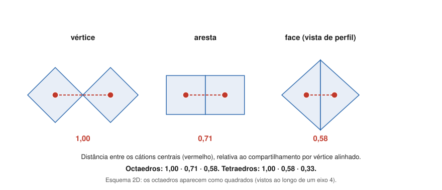

# Aula 05: As regras de Pauling — Parte 2: compartilhamento de poliedros e parcimônia

**ID:** mineralogia-m08-a05
**Módulo:** [[08-empacotamento-e-coordenacao-modulo|Módulo 08 — Cristaloquímica I: raios iônicos, coordenação e regras de Pauling]]
**Duração estimada:** ~27 min
**Nível:** ensino médio, sem geologia prévia (contrato `ensino-medio-sem-geologia-v1`)
**Objetivo:** enunciar as regras 3, 4 e 5 de Pauling, calcular quanto dois cátions se aproximam quando seus poliedros compartilham vértice, aresta ou face, e usar isso para explicar a ordem de estabilidade dos polimorfos de TiO₂ e por que os tetraedros de SiO₄ só dividem vértices.
**Pré-requisito:** [[08-empacotamento-e-coordenacao-aula-04-regras-de-pauling-parte-1-coordenacao-e-valencia-eletrostatica|Aula 04]] (regras 1 e 2, força de ligação). Esta é a Parte 2.

## Vocabulário desta aula

| Termo | O que quer dizer |
|---|---|
| **compartilhar um vértice** | dois poliedros têm um ânion em comum. |
| **compartilhar uma aresta** | têm dois ânions em comum (a linha entre eles). |
| **compartilhar uma face** | têm três ânions em comum (um triângulo, no tetraedro e no octaedro). |
| **repulsão cátion–cátion** | os dois cátions centrais, ambos positivos, se repelem; quanto mais perto, mais. |
| **polimorfos** | minerais de mesma composição e estruturas diferentes, como rutilo, anatásio e brookita (TiO₂). O tema volta no módulo 10. |
| **parcimônia** | economia: usar o menor número de tipos de peças. |

## Antes de começar, você precisa saber

- Poliedros de coordenação e a força de ligação s = carga/NC ([[08-empacotamento-e-coordenacao-aula-04-regras-de-pauling-parte-1-coordenacao-e-valencia-eletrostatica|aula 04]]).
- **Matemática reativada:** no octaedro regular, a distância do centro ao meio de uma aresta é a distância centro–vértice dividida por √2; ao centro de uma face, dividida por √3.

## Ao final você vai conseguir

- `mineralogia-m08-oa04` — Aplicar as cinco regras de Pauling, incluindo a valência eletrostática, para julgar a estabilidade de um arranjo e explicar o compartilhamento de poliedros. *Esta aula cobre as regras 3, 4 e 5.*

## Conteúdo

### Terceira regra: arestas e faces compartilhadas desestabilizam

> A presença de arestas compartilhadas, e sobretudo de faces compartilhadas, diminui a estabilidade de uma estrutura. O efeito é grande para cátions de carga alta e NC baixo.

O motivo é geométrico. Quando dois poliedros se juntam, os cátions dos centros ficam a uma distância que depende do que é compartilhado. Tomando como 1 a distância com um vértice comum e os dois poliedros alinhados:

| Compartilham | Octaedros | Tetraedros |
|---|---|---|
| vértice | 1,00 | 1,00 |
| aresta | 0,71 | 0,58 |
| face | 0,58 | 0,33 |

*Figura 4. Dois octaedros (vistos como quadrados, ao longo de um eixo 4) que compartilham um vértice e uma aresta, e dois poliedros que compartilham uma face, de perfil. O que observar: a cada elemento a mais em comum, os dois cátions vermelhos se aproximam.*

Cátions mais próximos se repelem mais, e a estrutura perde estabilidade. Por isso o efeito é pior para cátions **muito carregados** (a repulsão cresce com a carga) e de **NC baixo** (o tetraedro aproxima mais os centros: 0,33 contra 0,58 na face).

**Tetraedros de silício.** Com Si–O = 1,61 Å (aula 01), dois tetraedros com uma aresta em comum poriam os dois Si⁴⁺ a 2 × 1,61/√3 = **1,86 Å** um do outro; com uma face, a 1,07 Å. Compartilhando só um vértice, com o ângulo Si–O–Si de cerca de 144° do quartzo, ficam a cerca de **3,06 Å**. É por isso que, **nos silicatos comuns, os tetraedros de SiO₄ compartilham entre si apenas vértices**. Essa restrição organiza toda a classificação dos silicatos (módulo 11).

**Os três TiO₂.** Pauling usou o próprio exemplo: rutilo, brookita e anatásio têm Ti em octaedro. No **rutilo**, cada octaedro compartilha **2** arestas com os vizinhos; na **brookita**, **3**; no **anatásio**, **4**. O rutilo, com menos arestas compartilhadas, é a forma estável de TiO₂ na maior parte das condições da crosta; os outros dois são metaestáveis (módulos 10 e 22).

**Como as estruturas se defendem.** Quando o compartilhamento acontece, a estrutura se distorce: os cátions se afastam do elemento compartilhado e a aresta compartilhada encurta, protegendo os cátions um do outro. No **corindo**, onde pares de octaedros de Al dividem uma face, os Al ficam deslocados para longe dessa face. No **rutilo**, a distância Ti–Ti através da aresta compartilhada é o próprio parâmetro c, **2,96 Å**; um octaedro regular, com Ti–O ≈ 1,965 Å (0,605 + 1,36, aula 01), daria 1,965 × √2 = **2,78 Å**. Os Ti estão mais afastados do que a geometria ideal permitiria.

> [!question] Pare e explique
> Por que a terceira regra pesa pouco para o Na⁺ em octaedro (halita, onde os octaedros dividem arestas) e muito para o Si⁴⁺ em tetraedro?

### Quarta regra: cátions de carga alta se evitam

> Num cristal com cátions diferentes, os de valência alta e NC baixo tendem a não compartilhar elementos de poliedro entre si.

É a regra 3 aplicada a uma mistura de cátions: os poliedros dos cátions mais carregados ficam afastados uns dos outros, e os vazios entre eles são preenchidos pelos poliedros dos cátions menos carregados. Na **olivina**, Mg₂SiO₄, os tetraedros de SiO₄ não têm nenhum ânion em comum entre si: cada um fica isolado, ligado aos outros através dos octaedros de Mg. Cada O está num tetraedro só (aula 04: 1 Si + 3 Mg).

### Quinta regra: a parcimônia

> O número de tipos essencialmente diferentes de constituintes numa estrutura tende a ser pequeno.

Em termos modernos: os cristais tendem a ter **poucos tipos de sítio** (ambientes químicos distintos). As granadas são o exemplo clássico: com fórmula X₃Y₂Z₃O₁₂ e dezenas de átomos na cela, têm só três sítios de cátion (X, Y e Z) e um único tipo de sítio de oxigênio. A regra não diz quantos tipos; diz que a natureza não multiplica ambientes sem necessidade.

### O peso real das regras 3 a 5

As regras são tendências, e a estatística confirma que não são leis: no estudo de cerca de 5000 óxidos já citado, só cerca de **13%** dos compostos satisfazem **ao mesmo tempo** as regras 2 a 5 (George et al., 2020). A regra 3 é a mais útil das três para silicatos e óxidos de cátions muito carregados; a regra 5 é a mais vaga.

## Exemplo trabalhado

**Problema.** (a) Calcule a distância entre os centros de dois octaedros regulares, de distância centro–vértice R, que compartilham uma aresta, e depois uma face. (b) Aplique a Ti–O = 1,965 Å e compare com o rutilo. (c) Ordene rutilo, brookita e anatásio pela regra 3.

**(a) Aresta.** Ponha o octaedro com vértices em (±R, 0, 0), (0, ±R, 0), (0, 0, ±R). O meio da aresta entre (R, 0, 0) e (0, R, 0) fica em (R/2, R/2, 0), a R/√2 do centro. Os dois octaedros que dividem a aresta ficam simétricos em relação ao meio dela, e o centro do segundo fica do outro lado desse ponto, à mesma distância: os centros ficam a **2R/√2 = R·√2**. Com vértice compartilhado e alinhados, a distância seria **2R**. Razão: √2/2 = **0,71**.
**Face.** O centro da face (R, 0, 0), (0, R, 0), (0, 0, R) fica em (R/3, R/3, R/3), a R/√3 do centro; pelo mesmo raciocínio de simetria, centros a **2R/√3**; razão 1/√3 = **0,58**.

**(b)** Vértice alinhado: 2 × 1,965 = 3,93 Å. Aresta: 1,965 × √2 = 2,78 Å. Face: 2 × 1,965/√3 = 2,27 Å. O rutilo, com arestas compartilhadas, mostra Ti–Ti = 2,96 Å através delas: os Ti se afastaram cerca de 0,18 Å do ideal, como prevê o "como as estruturas se defendem".

**(c)** Arestas compartilhadas por octaedro: rutilo 2 < brookita 3 < anatásio 4. Pela regra 3, estabilidade: **rutilo > brookita > anatásio** — a ordem que Pauling usou para ilustrar a regra. (Qual polimorfo cristaliza de fato também depende de cinética e do tamanho dos cristais; a regra fala de tendência.)

**Método geral:** (1) identifique o que os poliedros compartilham; (2) estime a distância cátion–cátion com a tabela 1,00/0,71/0,58 (octaedro) ou 1,00/0,58/0,33 (tetraedro); (3) pese a carga dos cátions; (4) procure a distorção que a estrutura usa para se defender.

## Erros comuns

- **Ler a regra 3 como proibição.** Arestas compartilhadas existem em muitos minerais estáveis (halita, corindo, rutilo); a regra diz que elas custam estabilidade, e o custo depende da carga.
- **Inverter o tetraedro e o octaedro.** É o tetraedro que aproxima mais os centros ao compartilhar (0,58 na aresta contra 0,71).
- **Esperar que todo polimorfo menos estável se transforme logo no mais estável.** Anatásio e brookita persistem por cinética lenta (módulos 10 e 24).
- **Tratar a regra 5 como contagem obrigatória.** Ela é uma tendência qualitativa.

## O que não concluir

- Que os tetraedros de SiO₄ nunca compartilhem arestas em material nenhum. A regra vale para os silicatos comuns; não é um teorema.
- Que a estabilidade dos polimorfos de TiO₂ se explique só pela regra 3. Ela dá a tendência; a termodinâmica (módulo 22) decide.
- Que as regras de Pauling sirvam para prever estruturas do zero. Elas ajudam a entender e a criticar estruturas conhecidas.

## Recap relâmpago

- Regra 3: compartilhar arestas e, mais ainda, faces desestabiliza; pior para carga alta e NC baixo.
- Distâncias relativas entre centros: octaedros 1,00 / 0,71 / 0,58; tetraedros 1,00 / 0,58 / 0,33 (vértice / aresta / face).
- SiO₄ compartilham só vértices nos silicatos comuns (aresta poria os Si a 1,86 Å). TiO₂: rutilo 2 arestas, brookita 3, anatásio 4 → rutilo mais estável.
- Defesa: cátions se afastam do elemento compartilhado (corindo; Ti–Ti 2,96 Å no rutilo contra 2,78 ideal).
- Regra 4: cátions de carga alta e NC baixo não compartilham poliedros entre si (SiO₄ isolados na olivina). Regra 5: poucos tipos de sítio (granada: X, Y, Z e um só O).
- Só ~13% de ~5000 óxidos cumprem as regras 2 a 5 juntas.

## Próxima aula

Em [[08-empacotamento-e-coordenacao-aula-06-estruturas-tipo-halita-fluorita-rutilo-corindo-espinelio-perovskita-e-esfalerita|Aula 06 — Estruturas-tipo]], as ferramentas do módulo (raios, coordenação, empacotamento e regras de Pauling) são aplicadas às sete estruturas que servem de modelo para centenas de minerais.

## Fontes consultadas

- Pauling, L. (1929), *J. Am. Chem. Soc.* 51, 1010–1026: regras 3 a 5; rutilo (2 arestas), brookita (3) e anatásio (4) — conferido por busca em 2026-10-06.
- George, J. et al. (2020), *Angew. Chem. Int. Ed.* 59, doi:10.1002/anie.202000829: ~13% dos ~5000 óxidos cumprem as regras 2 a 5 simultaneamente — conferido por busca em 2026-10-06.
- Corindo: octaedros que compartilham face, com os cátions deslocados para longe dos elementos compartilhados — conferido por busca em 2026-10-06 (notas de Pauling's rules, Tulane e UMass; glossário de estrutura do corindo).
- *Handbook of Mineralogy*: rutilo (a = 4,5937, c = 2,9587 Å, já usado no módulo 05, aula 01); granadas (Ia3̄d).
- Klein & Dutrow, *Manual of Mineral Science*, 23ª ed. (regras de Pauling; silicatos com tetraedros ligados por vértices; ângulo Si–O–Si do quartzo próximo de 144°).
- Distâncias relativas e absolutas calculadas em Python em 2026-10-06.

<!--
nivel: ensino-medio-sem-geologia-v1
palavras_corpo: 1332
cobertura:
  mineralogia-m08-oa04: [Conteúdo, Exemplo trabalhado]
figuras:
  - 08-empacotamento-e-coordenacao-fig-04-compartilhamento-de-poliedros.svg
alegacoes_auditaveis:
  - claim_id: CRQ-PAU-R3-001
    claim: "Regra 3: arestas compartilhadas, e sobretudo faces, diminuem a estabilidade; efeito grande para carga alta e NC baixo."
    risk: conceito
    source: "Pauling (1929); Klein & Dutrow"
    audit: "verificado em 2026-10-06"
  - claim_id: CRQ-PAU-R3DIST-001
    claim: "Distancia relativa entre centros: octaedros 1,00/0,71/0,58; tetraedros 1,00/0,58/0,33 (vertice alinhado/aresta/face)."
    risk: numero
    source: "calculo geometrico; Pauling (1929)"
    audit: "verificado em 2026-10-06 (calculo: raiz2/2 = 0,707; 1/raiz3 = 0,577; 1/3)"
  - claim_id: CRQ-PAU-SIO4-001
    claim: "Nos silicatos comuns os tetraedros SiO4 compartilham entre si apenas vertices; com Si-O 1,61, aresta comum poria os Si a 1,86 A, face a 1,07 A; vertice com Si-O-Si ~144 graus (quartzo) da ~3,06 A."
    risk: numero
    source: "Klein & Dutrow; calculo"
    audit: "verificado em 2026-10-06 (calculo; Si-O-Si do alfa-quartzo 143,6 graus por busca)"
  - claim_id: CRQ-PAU-TIO2-001
    claim: "Rutilo: cada octaedro compartilha 2 arestas; brookita 3; anatasio 4; rutilo e a forma estavel na maior parte das condicoes; anatasio e brookita metaestaveis."
    risk: fato
    source: "Pauling (1929) (busca)"
    audit: "verificado em 2026-10-06 (busca: Pauling 1929 - rutilo 2, brookita 3, anatasio 4 arestas)"
  - claim_id: CRQ-PAU-DEFESA-001
    claim: "Com compartilhamento, os cations se afastam do elemento compartilhado (corindo: Al deslocados para longe da face comum); rutilo Ti-Ti atraves da aresta = c = 2,96 A contra 2,78 A no octaedro regular com Ti-O 1,965 A."
    risk: numero
    source: "busca (Pauling's rules; corindo); Handbook of Mineralogy (c do rutilo); Shannon (1976); calculo"
    audit: "verificado em 2026-10-06 (busca: cations deslocados para longe de faces/arestas compartilhadas, corindo com face comum; c do rutilo 2,9587 HoM; 1,965 x raiz2 = 2,779)"
  - claim_id: CRQ-PAU-R4-001
    claim: "Regra 4: cations de valencia alta e NC baixo tendem a nao compartilhar elementos de poliedro entre si; na olivina os SiO4 sao isolados, ligados pelos octaedros de Mg."
    risk: conceito
    source: "Pauling (1929); Klein & Dutrow"
    audit: "verificado em 2026-10-06"
  - claim_id: CRQ-PAU-R5-001
    claim: "Regra 5 (parcimonia): poucos tipos de sitio; granada X3Y2Z3O12 com tres sitios de cation e um unico sitio de oxigenio."
    risk: fato
    source: "Pauling (1929); Klein & Dutrow; Grew et al. (2013) (granada)"
    audit: "verificado em 2026-10-06 (busca: granada Ia-3d, cations em 24c/16a/24d e O so em 96h)"
  - claim_id: CRQ-PAU-ESTAT-001
    claim: "Em ~5000 oxidos, so ~13% satisfazem simultaneamente as regras 2 a 5 (George et al., 2020)."
    risk: numero
    source: "George et al. (2020) (busca)"
    audit: "verificado em 2026-10-06 (busca: 13% satisfazem as regras 2 a 5 simultaneamente)"
-->
