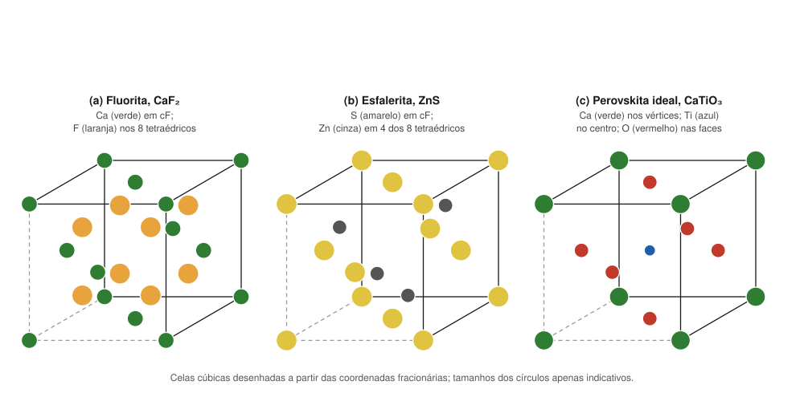

# Aula 06: Estruturas-tipo — halita, fluorita, rutilo, corindo, espinélio, perovskita e esfalerita

**ID:** mineralogia-m08-a06
**Módulo:** [[08-empacotamento-e-coordenacao-modulo|Módulo 08 — Cristaloquímica I: raios iônicos, coordenação e regras de Pauling]]
**Duração estimada:** ~30 min
**Nível:** ensino médio, sem geologia prévia (contrato `ensino-medio-sem-geologia-v1`)
**Objetivo:** reconhecer sete estruturas-tipo pela coordenação dos cátions e dos ânions, pelo arranjo dos poliedros e pelos minerais que as adotam, e conferir cada uma com as ferramentas do módulo.
**Pré-requisito:** as aulas [[08-empacotamento-e-coordenacao-aula-02-razao-de-raios-e-poliedros-de-coordenacao|02]], [[08-empacotamento-e-coordenacao-aula-03-empacotamento-compacto-e-intersticios|03]], [[08-empacotamento-e-coordenacao-aula-04-regras-de-pauling-parte-1-coordenacao-e-valencia-eletrostatica|04]] e [[08-empacotamento-e-coordenacao-aula-05-regras-de-pauling-parte-2-compartilhamento-de-poliedros-e-parcimonia|05]].

## Vocabulário desta aula

| Termo | O que quer dizer |
|---|---|
| **estrutura-tipo** | uma estrutura que serve de modelo para vários compostos: mesmos sítios, mesmas coordenações, outros elementos. Recebe o nome do mineral ou composto mais conhecido que a tem. |
| **isoestrutural** | dois minerais com a mesma estrutura-tipo (halita e galena, por exemplo). O tema volta no módulo 09. |
| **coordenação "6:6", "8:4"** | NC do cátion : NC do ânion. |
| **espinélio normal / inverso** | no normal, o cátion de carga 2+ fica no tetraedro; no inverso, o tetraedro guarda um cátion 3+ e o 2+ vai para um octaedro. |
| **fator de tolerância** | número calculado com os raios que mede se os íons cabem bem na estrutura da perovskita. |

## Antes de começar, você precisa saber

- Razão de raios, empacotamento compacto e interstícios, regras 2 e 3 de Pauling (aulas 02 a 05).
- Ler um grupo espacial pela primeira letra (retículo) e reconhecer o sistema ([[06-reticulo-e-cela-aula-03-os-14-reticulos-de-bravais|módulo 06, aula 03]]).

## Ao final você vai conseguir

- `mineralogia-m08-oa05` — Reconhecer as estruturas-tipo (halita, fluorita, rutilo, corindo, espinélio, perovskita, esfalerita/wurtzita) e os minerais que as adotam.

## Conteúdo

### O quadro geral

Não tente decorar o quadro de uma vez: ele é o mapa do módulo. Leia as seções abaixo, uma estrutura por vez, e volte a ele no fim de cada uma. Se o tempo apertar, a seção da perovskita pode ficar para uma segunda sessão.

| Estrutura-tipo | Fórmula | Grupo espacial | Coordenação | Descrição | Minerais isoestruturais |
|---|---|---|---|---|---|
| halita | NaCl | Fm3̄m | 6:6 | cc de Cl, Na em todos os octaédricos | silvita (KCl), periclásio (MgO), galena (PbS) |
| fluorita | CaF₂ | Fm3̄m | 8:4 | Ca em cF, F em todos os tetraédricos | uraninita (UO₂), torianita (ThO₂) |
| esfalerita | ZnS | F4̄3m | 4:4 | cc de S, Zn em metade dos tetraédricos | — (o diamante tem o mesmo arranjo com um só elemento) |
| wurtzita | ZnS | P6₃mc | 4:4 | hc de S, Zn em metade dos tetraédricos | — |
| rutilo | TiO₂ | P4₂/mnm | 6:3 | cadeias de octaedros com arestas comuns, ao longo de c | cassiterita (SnO₂), pirolusita (MnO₂), estishovita (SiO₂) |
| corindo | Al₂O₃ | R3̄c | 6:4 | hc de O, Al em 2/3 dos octaédricos | hematita (Fe₂O₃), escolaíta (Cr₂O₃) |
| espinélio | MgAl₂O₄ | Fd3̄m | Mg 4, Al 6 | cc de O, 1/8 dos tetraédricos e 1/2 dos octaédricos | magnetita (Fe₃O₄), cromita (FeCr₂O₄), gahnita (ZnAl₂O₄) |
| perovskita | CaTiO₃ | Pm3̄m (ideal); o mineral é ortorrômbico, Pnma | Ti 6, Ca 12 (ideal) | octaedros de TiO₆ ligados por vértices; Ca nos vãos | bridgmanita, (Mg,Fe)SiO₃, do manto inferior |

*Figura 6. Celas cúbicas de três estruturas-tipo, a partir das coordenadas fracionárias. O que observar: fluorita e esfalerita têm a mesma rede cF de um dos íons; a diferença é ocupar os 8 tetraédricos ou só 4, alternados.*

### Halita e fluorita: cúbicas e "iônicas"

**Halita (6:6).** A [cela do módulo 06](../06-reticulo-e-cela/06-reticulo-e-cela-fig-06-cela-da-halita.svg) mostra cada Na cercado por 6 Cl e cada Cl por 6 Na: razão 0,56 (aula 02); regra 2: 6 × 1/6 = 1. A **galena**, PbS, também é tipo halita: a estrutura-tipo descreve a **geometria**, não o tipo de ligação, e a Pb–S tem bem mais caráter covalente que a Na–Cl.

**Fluorita (8:4).** Os Ca²⁺ formam a rede cF; os F⁻ ocupam os 8 interstícios tetraédricos da cela. Cada Ca tem 8 F (um cubo) e cada F tem 4 Ca (um tetraedro). Razão 0,86 → NC 8 (aula 02); regra 2: s(Ca) = 2/8; cada F recebe 4 × 1/4 = 1. A **uraninita** e a **torianita** são isoestruturais.

### Esfalerita e wurtzita: o mesmo tetraedro, duas pilhas

As duas são ZnS com Zn e S em NC 4, e cada uma ocupa metade dos interstícios tetraédricos de uma pilha de S: **cúbica compacta** na esfalerita, **hexagonal compacta** na wurtzita (aula 03). São polimorfos (módulo 10). Se trocar Zn e S por um só elemento, a esfalerita vira o arranjo do **diamante**. Regra 2: s(Zn) = 2/4; cada S recebe 4 × 1/2 = 2.

### Rutilo: cadeias de octaedros

Ti⁴⁺ em octaedro (razão 0,43), O em triângulo de 3 Ti (6:3). Os octaedros dividem **duas arestas opostas** com os vizinhos, formando **cadeias paralelas ao eixo c**, ligadas entre si por vértices (aula 05). Essas cadeias ajudam a explicar o hábito prismático, alongado em c, comum no rutilo. Regra 2: 3 × 2/3 = 2. A **estishovita**, SiO₂ de alta pressão, é tipo rutilo, com o Si em octaedro.

### Corindo: dois terços dos octaedros

O em hexagonal compacto; Al em 2/3 dos octaédricos (aula 03). Cada O tem 4 Al: 4 × 1/2 = 2. Pares de octaedros dividem uma face, e os Al se afastam dela (aula 05). A **hematita** é isoestrutural. A **ilmenita**, FeTiO₃, é um derivado: mesmo arranjo, com Fe e Ti ocupando camadas alternadas de octaedros.

### Espinélio: normal e inverso

O em cúbico compacto; 1/8 dos tetraédricos e 1/2 dos octaédricos ocupados (aula 03). Fórmula geral AB₂O₄.

- **Normal:** A²⁺ no tetraedro, B³⁺ nos octaedros. Espinélio, MgAl₂O₄; cromita, FeCr₂O₄; gahnita, ZnAl₂O₄.
- **Inverso:** B³⁺ no tetraedro; A²⁺ e o outro B³⁺ nos octaedros. **Magnetita**: Fe³⁺[Fe²⁺Fe³⁺]O₄. É a valência mista do módulo 01, aula 03, agora com endereço: os colchetes marcam os octaedros.

O Mg²⁺ tetraédrico do espinélio contraria a razão de raios (aula 02), e a regra 2 aceita as duas distribuições (aula 04). O que decide entre normal e inverso envolve a energia dos elétrons d nos dois sítios (módulo 48).

### Perovskita: octaedros por vértices e um cátion grande

Na versão ideal cúbica, Ti no centro da cela, O nos centros das faces e Ca nos vértices (figura 6c): octaedros de TiO₆ ligados só por vértices, e o Ca num vão de 12 O. Regra 2: 2 × 2/3 + 4 × 1/6 = 2.

A estrutura só fica cúbica se os íons couberem bem. Goldschmidt propôs medir isso com o **fator de tolerância**:

**t = (r_A + r_O) / [√2 · (r_B + r_O)]**

com A o cátion grande (Ca) e B o do octaedro (Ti). Com Ca²⁺ XII 1,34; Ti⁴⁺ VI 0,605; O²⁻ 1,40: t = 2,74 / (1,414 × 2,005) = **0,97**. Abaixo de 1, o Ca é pequeno para o vão; os octaedros giram e a simetria cai. É o que acontece no mineral perovskita, **ortorrômbico** (Pnma), "pseudocúbico". Com isso, o Ca deixa de ter 12 vizinhos equivalentes.

A **bridgmanita**, (Mg,Fe)SiO₃ com estrutura de perovskita, só é estável em pressões muito altas, abaixo de cerca de 660 km, e é considerada o mineral mais abundante da Terra; foi aprovada pela IMA em 2014, descrita no meteorito Tenham (módulo 43).

> [!question] Pare e explique
> O Si⁴⁺ é tetraédrico em quase toda a crosta, mas octaédrico na estishovita e na bridgmanita. Que lição sobre a razão de raios (aula 02) isso dá?

## Exemplo trabalhado

**Problema.** Um óxido de fórmula AB₂O₄ tem O em empacotamento cúbico compacto, um cátion por fórmula em tetraedro e dois em octaedro. (a) Que estrutura-tipo é? (b) Se A = Zn²⁺ e B = Al³⁺, confira a regra 2 supondo distribuição normal. (c) Na magnetita, mostre que a fórmula Fe³⁺[Fe²⁺Fe³⁺]O₄ é neutra. (d) Por que a magnetita e a gahnita, de fórmulas tão diferentes, são isoestruturais?

**(a)** Espinélio: cc de O, 1/8 dos tetraédricos (1 de 8 por fórmula) e 1/2 dos octaédricos (2 de 4).

**(b)** s(Zn, IV) = 2/4 = 1/2; s(Al, VI) = 3/6 = 1/2. Cada O tem 1 cátion tetraédrico e 3 octaédricos (contagem: 1 × 4 + 2 × 6 = 16 ligações para 4 O, 4 por O; 1 delas do tetraedro). Σ = 1/2 + 3/2 = **2**. ✔

**(c)** +3 + 2 + 3 = +8; 4 O = −8. Neutra. ✔

**(d)** Isoestrutural quer dizer **mesmos sítios com as mesmas coordenações**, não mesmos elementos: nos dois, O em cúbico compacto, um cátion tetraédrico e dois octaédricos por fórmula.

**Método para reconhecer uma estrutura-tipo:** (1) fórmula (AX, AX₂, A₂X₃, AB₂X₄, ABX₃); (2) coordenação de cátions e ânions; (3) como os poliedros se ligam (vértice, aresta, face) ou que pilha de ânions e que fração de sítios; (4) confira com a razão de raios e a regra 2.

## Erros comuns

- **Confundir a estrutura-tipo com a composição.** "Tipo halita" descreve sítios; a galena é tipo halita sem ser um cloreto.
- **Chamar de "cúbica" a perovskita mineral.** O CaTiO₃ natural é ortorrômbico; a cela cúbica é a idealização.
- **Achar que fluorita e esfalerita diferem só na fórmula.** A rede cF é a mesma; muda a ocupação dos tetraédricos: todos (fluorita) ou metade, alternados (esfalerita).
- **Esquecer a inversão da magnetita**, e pôr o Fe²⁺ no tetraedro.

## O que não concluir

- Que minerais isoestruturais formem sempre solução sólida entre si. Galena e halita não se misturam; isso exige critérios de tamanho, carga e ligação (módulo 09).
- Que a estrutura-tipo diga o tipo de ligação. Esfalerita e diamante têm o mesmo arranjo e ligações diferentes.
- Que o fator de tolerância seja exato: depende da tabela de raios e do NC atribuído ao cátion A, e serve para ordenar compostos, não para decidir sozinho a simetria.

## Recap relâmpago

- Halita (6:6): cc de ânions, todos os octaédricos; silvita, periclásio, galena.
- Fluorita (8:4): cátions em cF, ânions em todos os tetraédricos; uraninita, torianita.
- Esfalerita (cc) e wurtzita (hc): Zn em metade dos tetraédricos, 4:4; esfalerita = arranjo do diamante com dois elementos.
- Rutilo (6:3): cadeias de octaedros por arestas ao longo de c; cassiterita, pirolusita, estishovita.
- Corindo: hc de O, Al em 2/3 dos octaédricos; hematita, escolaíta; ilmenita é derivado ordenado.
- Espinélio: cc de O, 1/8 tetra e 1/2 octa; normal (MgAl₂O₄, cromita, gahnita) × inverso (magnetita).
- Perovskita: octaedros por vértices; t = (r_A + r_O)/[√2 (r_B + r_O)] = 0,97 no CaTiO₃ → ortorrômbica; bridgmanita no manto inferior.

## Próxima aula

Este é o fim do módulo 08. O [[09-substituicao-e-formula-modulo|módulo 09 — Cristaloquímica II: substituição iônica, solução sólida e fórmula estrutural]] usa os sítios e os raios deste módulo para responder quem pode entrar no lugar de quem, e para calcular, a partir de uma análise química, quantos átomos de cada elemento ocupam cada sítio.

## Fontes consultadas

- *Handbook of Mineralogy*: halita, periclásio (Fm3̄m), galena (Fm3̄m, a = 5,936 Å), esfalerita (F4̄3m), wurtzita (P6₃mc), perovskita (Pnma, ortorrômbica, pseudocúbica), cassiterita (isoestrutural com rutilo), bridgmanita — conferidos por busca em 2026-10-06.
- Grupos do rutilo (rutilo, cassiterita, pirolusita, plattnerita, estishovita) e da uraninita (uraninita, torianita, tipo fluorita, Fm3̄m) — Mindat e notas de estrutura (busca em 2026-10-06).
- Espinélio: cc de O, 1/8 dos tetraédricos e 1/2 dos octaédricos; magnetita inversa (Fd3̄m) — conferido por busca em 2026-10-06.
- Corindo: hc de O, Al em 2/3 dos octaédricos, pares de octaedros com face comum — conferido por busca em 2026-10-06.
- Tschauner, O. et al. (2014). Discovery of bridgmanite, the most abundant mineral in Earth, in a shocked meteorite. *Science* 346 (IMA 2014-017; meteorito Tenham) — conferido por busca em 2026-10-06.
- Goldschmidt, V. M. (1926), fator de tolerância; CaTiO₃ com t ≈ 0,97 e estrutura ortorrômbica — conferido por busca em 2026-10-06; recalculado com os raios de Shannon (1976).
- Klein & Dutrow, *Manual of Mineral Science*, 23ª ed. (estruturas-tipo; ilmenita como derivado do corindo).

<!--
nivel: ensino-medio-sem-geologia-v1
palavras_corpo: 1497
cobertura:
  mineralogia-m08-oa05: [Conteúdo, Exemplo trabalhado]
figuras:
  - 08-empacotamento-e-coordenacao-fig-06-estruturas-tipo-cubicas.svg
  - ../06-reticulo-e-cela/06-reticulo-e-cela-fig-06-cela-da-halita.svg (reaproveitada)
alegacoes_auditaveis:
  - claim_id: CRQ-EST-QUADRO-001
    claim: "Grupos espaciais: halita Fm3m; fluorita Fm3m; esfalerita F-43m; wurtzita P63mc; rutilo P42/mnm; corindo R-3c; espinelio Fd-3m; perovskita ideal Pm-3m, mineral Pnma."
    risk: nomenclatura
    source: "Handbook of Mineralogy (busca); auditoria m04 (rutilo, corindo, halita, fluorita)"
    audit: "verificado em 2026-10-06 (busca HoM: esfalerita F-43m, wurtzita P63mc, perovskita Pnma, periclasio e galena Fm3m; rutilo, corindo, halita, fluorita da auditoria m04; espinelio Fd-3m por busca)"
  - claim_id: CRQ-EST-ISOESTR-001
    claim: "Tipo halita: silvita, periclasio, galena; tipo fluorita: uraninita, torianita; tipo rutilo: cassiterita, pirolusita, estishovita; tipo corindo: hematita, escolaita; espinelios: magnetita, cromita, gahnita; perovskita: bridgmanita."
    risk: fato
    source: "Mindat; Handbook of Mineralogy (busca)"
    audit: "verificado em 2026-10-06 (busca: grupos do rutilo e da uraninita; magnetita, cromita e gahnita no grupo do espinelio; hematita e escolaita tipo corindo; bridgmanita)"
  - claim_id: CRQ-EST-COORD-001
    claim: "Coordenacoes: halita 6:6; fluorita 8:4; esfalerita e wurtzita 4:4; rutilo 6:3; corindo Al 6, O 4; espinelio A 4, B 6; perovskita ideal Ti 6, Ca 12."
    risk: fato
    source: "Klein & Dutrow; contagem de ligacoes"
    audit: "verificado em 2026-10-06 (contagem de ligacoes por formula)"
  - claim_id: CRQ-EST-RUTILO-001
    claim: "No rutilo, octaedros dividem duas arestas opostas formando cadeias paralelas a c, ligadas por vertices; as cadeias ajudam a explicar o habito prismatico alongado em c comum no rutilo."
    risk: conceito
    source: "busca (estrutura do rutilo; grupo do rutilo)"
    audit: "corrigido em 2026-10-06 (🟡: habito 'do rutilo e da cassiterita' generalizava; cassiterita costuma ser curta-prismatica a dipiramidal; restrito ao rutilo e suavizado)"
  - claim_id: CRQ-EST-ILMENITA-001
    claim: "Ilmenita FeTiO3 e derivado ordenado do corindo, com Fe e Ti em camadas alternadas de octaedros."
    risk: fato
    source: "Klein & Dutrow"
    audit: "verificado em 2026-10-06 (Klein & Dutrow; ilmenita R-3)"
  - claim_id: CRQ-EST-ESPINELIO-001
    claim: "Espinelio normal: A2+ no tetraedro (MgAl2O4, cromita FeCr2O4, gahnita ZnAl2O4); inverso: magnetita Fe3+[Fe2+Fe3+]O4."
    risk: fato
    source: "busca (estrutura do espinelio); Klein & Dutrow"
    audit: "verificado em 2026-10-06"
  - claim_id: CRQ-EST-TOLER-001
    claim: "Fator de tolerancia t = (rA + rO)/(raiz2 (rB + rO)); CaTiO3 com Ca XII 1,34, Ti VI 0,605, O 1,40: t = 0,97 (0,966); t < 1 -> octaedros giram, perovskita ortorrombica Pnma."
    risk: numero
    source: "Goldschmidt (1926); busca; Shannon (1976); calculo"
    audit: "verificado em 2026-10-06 (busca: t = 0,966 para CaTiO3, Pbnm/Pnma; recalculado 0,966)"
  - claim_id: CRQ-EST-BRIDG-001
    claim: "Bridgmanita (Mg,Fe)SiO3 com estrutura de perovskita, estavel abaixo de ~660 km, considerada o mineral mais abundante da Terra; aprovada pela IMA em 2014 (IMA 2014-017), descrita no meteorito Tenham."
    risk: fato
    source: "Tschauner et al. (2014), Science 346 (busca)"
    audit: "verificado em 2026-10-06 (busca: IMA 2014-017, Tenham, Tschauner et al. 2014 Science 346)"
  - claim_id: CRQ-EST-ESFDIAM-001
    claim: "A esfalerita com um so elemento corresponde ao arranjo do diamante; esfalerita (cc) e wurtzita (hc) sao polimorfos de ZnS."
    risk: fato
    source: "Klein & Dutrow; busca (wurtzita)"
    audit: "verificado em 2026-10-06"
-->
