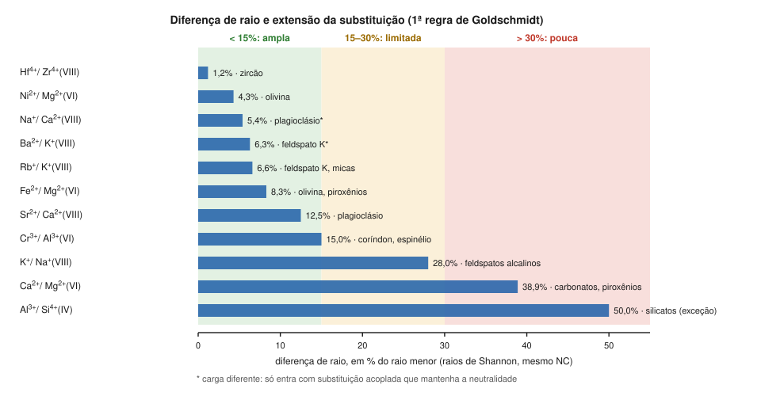

# Aula 01: Quem substitui quem — regras de Goldschmidt e de Ringwood

**ID:** mineralogia-m09-a01
**Módulo:** [[09-substituicao-e-formula-modulo|Módulo 09 — Cristaloquímica II: substituição iônica, solução sólida e fórmula estrutural]]
**Duração estimada:** ~28 min
**Nível:** ensino médio, sem geologia prévia (contrato `ensino-medio-sem-geologia-v1`)
**Objetivo:** usar o tamanho, a carga e a eletronegatividade de dois íons para prever se um pode ocupar o sítio do outro numa estrutura, em que extensão, e qual dos dois entra preferencialmente.
**Pré-requisito:** [[08-empacotamento-e-coordenacao-aula-01-raios-ionicos-efetivos-por-que-o-raio-depende-da-coordenacao|módulo 08, aula 01]] (raios de Shannon) e [[01-fundamentos-quimicos-aula-02-tabela-periodica-raio-ionizacao-e-eletronegatividade|módulo 01, aula 02]] (eletronegatividade de Pauling).

## Vocabulário desta aula

| Termo | O que quer dizer |
|---|---|
| **substituição iônica** | troca de um íon por outro num mesmo sítio da estrutura, sem mudar a estrutura. Também chamada **diadoquia**. |
| **sítio** | uma posição da estrutura com uma coordenação definida (o octaedro do Mg na olivina, por exemplo). |
| **membro final** | composição "pura" de uma série, como Mg₂SiO₄ e Fe₂SiO₄ na olivina. |
| **potencial iônico** | carga dividida pelo raio (z/r): mede quão concentrada está a carga do íon. |
| **substituição acoplada** | duas trocas simultâneas que, juntas, mantêm a neutralidade (aula 02). |

## Antes de começar, você precisa saber

- Usar a tabela de Shannon pela carga, pelo NC e pelo spin ([[08-empacotamento-e-coordenacao-aula-01-raios-ionicos-efetivos-por-que-o-raio-depende-da-coordenacao|módulo 08, aula 01]]). Os raios desta aula são todos dela.
- O "Pare e explique" daquela aula (Fe²⁺ × Fe³⁺ no lugar do Mg²⁺) e o "O que não concluir" da [[08-empacotamento-e-coordenacao-aula-06-estruturas-tipo-halita-fluorita-rutilo-corindo-espinelio-perovskita-e-esfalerita|aula 06 do módulo 08]] (isoestrutural não quer dizer que se misturam) são respondidos aqui e na aula 03.
- Eletronegatividade de Pauling: Mg 1,31; Fe(II) 1,83 ([[01-fundamentos-quimicos-aula-02-tabela-periodica-raio-ionizacao-e-eletronegatividade|módulo 01, aula 02]]).
- **Matemática reativada:** diferença percentual = (maior − menor) / menor × 100.

## Ao final você vai conseguir

- `mineralogia-m09-oa01` — Aplicar as regras de Goldschmidt, e o refinamento de Ringwood pela eletronegatividade, para prever se dois íons podem se substituir numa estrutura.

## Conteúdo

### Minerais quase nunca são puros

A olivina de um basalto não é Mg₂SiO₄ nem Fe₂SiO₄: é (Mg,Fe)₂SiO₄, com os dois cátions dividindo o mesmo sítio octaédrico em qualquer proporção. Uma granada, um piroxênio ou um feldspato reais trazem quatro, cinco, seis cátions diferentes. A estrutura é a mesma; o que muda é quem ocupa cada sítio.

A pergunta da aula: **dado um sítio, que íons podem ocupá-lo?** Ela foi organizada nos anos 1920-30 pelo geoquímico norueguês V. M. Goldschmidt em regras empíricas, depois refinadas por A. E. Ringwood (1955).

### Primeira regra: tamanho

> Íons de raios parecidos se substituem: diferença menor que cerca de 15%, substituição ampla; entre 15 e 30%, limitada; acima de 30%, pouca.

Compare sempre raios **no mesmo número de coordenação** e da mesma tabela (Shannon, módulo 08). Aqui a diferença é calculada sobre o raio menor; outros livros usam o maior, o que muda os casos de fronteira.

*Figura 1. Diferença de raio entre pares de íons, no NC indicado, e onde cada substituição ocorre. O que observar: os pares da faixa verde se substituem amplamente nos minerais indicados; Al³⁺/Si⁴⁺, na faixa vermelha, é a grande exceção.*

| Par (NC) | Raios (Å) | Diferença | O que se observa |
|---|---|---|---|
| Fe²⁺ / Mg²⁺ (VI) | 0,78 / 0,72 | 8% | série completa na olivina |
| Ni²⁺ / Mg²⁺ (VI) | 0,69 / 0,72 | 4% | Ni entra na olivina |
| Hf⁴⁺ / Zr⁴⁺ (VIII) | 0,83 / 0,84 | 1% | todo zircão tem Hf |
| Rb⁺ / K⁺ (VIII) | 1,61 / 1,51 | 7% | Rb nos feldspatos potássicos e nas micas |
| Sr²⁺ / Ca²⁺ (VIII) | 1,26 / 1,12 | 13% | Sr no plagioclásio |
| Cr³⁺ / Al³⁺ (VI) | 0,615 / 0,535 | 15% | Cr no coríndon e no espinélio |
| K⁺ / Na⁺ (VIII) | 1,51 / 1,18 | 28% | limitada nos feldspatos alcalinos em baixa temperatura (aula 03) |
| Ca²⁺ / Mg²⁺ (VI) | 1,00 / 0,72 | 39% | pouca: em equilíbrio e a baixa temperatura, calcita e magnesita quase não se misturam |

### Segunda regra: carga

> Íons de mesma carga se substituem livremente (se o tamanho permitir). Se as cargas diferem de uma unidade, a substituição acontece desde que outra troca compense a carga. Se diferem de duas ou mais, ela é pequena.

O exemplo mais instrutivo é o **Zr⁴⁺ e o Mg²⁺**: em NC VI, ambos têm 0,72 Å. Pelo tamanho, seriam intercambiáveis; pela carga, não, porque compensar duas unidades de carga é difícil. O Zr não entra na olivina. Já o Na⁺ e o Ca²⁺ (5% em VIII) se trocam no plagioclásio porque, ao mesmo tempo, Si⁴⁺ e Al³⁺ se trocam nos tetraedros (aula 02).

### Terceira regra: quem entra primeiro

> Quando dois íons disputam o mesmo sítio, entra preferencialmente o de **maior potencial iônico** (z/r: mais carga ou menor raio), que forma ligações mais fortes.

Na cristalização de um magma, a olivina que se forma primeiro é mais rica em Mg que o líquido: Mg²⁺ (z/r = 2/0,72 = 2,78) ganha do Fe²⁺ (2/0,78 = 2,56). O líquido restante fica relativamente mais rico em Fe, e a olivina que cristaliza depois também. É assim que o zoneamento químico começa (módulo 26).

### O refinamento de Ringwood: a eletronegatividade

As regras de Goldschmidt tratam os íons como esferas carregadas, o modelo da ligação iônica. Ringwood (1955) notou que elas falhavam quando os dois íons formam ligações de **caráter diferente** com o oxigênio, e propôs:

> Entre dois íons de tamanho e carga parecidos, se as eletronegatividades diferem apreciavelmente (mais de cerca de 0,1), entra preferencialmente o de **menor eletronegatividade**, que forma a ligação mais iônica.

Para Mg (1,31) e Fe²⁺ (1,83), Ringwood e Goldschmidt concordam: o Mg entra primeiro. O critério ajuda a entender por que elementos de eletronegatividade mais alta, como Cu e Zn, que formam ligações mais covalentes, tendem a se concentrar em sulfetos quando há enxofre disponível (aula 06). É uma tendência, não uma exclusão: o Pb, por exemplo, também entra no sítio do K dos feldspatos potássicos.

> [!question] Pare e explique
> O Fe²⁺ e o Mg²⁺ diferem bem mais que 0,1 em eletronegatividade, e mesmo assim formam a série completa da olivina. Isso contradiz Ringwood? (Dica: a regra fala de preferência, não de exclusão.)

### Os limites das regras

São regras **empíricas**, e a primeira depende da tabela de raios. O exemplo que mais incomoda: o **Al³⁺ substitui o Si⁴⁺ nos tetraedros** de quase todos os silicatos importantes (feldspatos, micas, anfibólios), e os raios de Shannon em NC IV diferem 50% (0,39 e 0,26 Å). Nesse caso, a ligação parcialmente covalente com o O e a compensação de carga por outro sítio pesam mais que o tamanho. A temperatura também conta: quanto mais quente, mais tolerante a estrutura fica a íons de tamanho diferente (aula 03).

## Exemplo trabalhado

**Problema.** Use as regras para prever: (a) o Ni²⁺ substitui o Mg²⁺ na olivina? (b) O Ba²⁺ entra no sítio do K⁺ do feldspato potássico? (c) O Ca²⁺ substitui o Mg²⁺ no octaedro da olivina? (d) Numa olivina em cristalização, quem entra preferencialmente, Ni²⁺ ou Mg²⁺?

**(a)** Raios em VI: 0,69 e 0,72 Å → **4%**. Mesma carga. Previsão: substituição ampla. Observa-se: a olivina é o principal hospedeiro de Ni nas rochas do manto (aula 06).

**(b)** Raios em VIII: 1,42 e 1,51 Å → **6%**. Cargas diferem de **uma** unidade: possível, desde que compensada. Compensação: Ba²⁺ + Al³⁺ no lugar de K⁺ + Si⁴⁺ (aula 02). Observa-se: feldspatos potássicos ricos em bário; o membro final é a celsiana, BaAl₂Si₂O₈.

**(c)** Raios em VI: 1,00 e 0,72 Å → **39%**. Previsão: pouca. A olivina comum tem pouco Ca.

**(d)** z/r: Ni²⁺ 2/0,69 = **2,90**; Mg²⁺ **2,78**. Pela terceira regra, o Ni²⁺ entra preferencialmente, e é o que se observa: as primeiras olivinas de um magma tiram muito Ni do líquido.

**Método geral:** (1) raios no mesmo NC; (2) diferença percentual; (3) compare as cargas e procure a compensação; (4) se os dois cabem, compare z/r e, se a ligação diferir em caráter, a eletronegatividade; (5) confira com o que se observa.

## Erros comuns

- **Comparar raios de NC diferentes.** O Na⁺ em VI (1,02) e o Ca²⁺ em VIII (1,12) parecem diferir 10%; no mesmo NC, a diferença é outra.
- **Esquecer a carga.** Zr⁴⁺ e Mg²⁺ têm o mesmo raio em VI e não se substituem.
- **Ler a terceira regra como exclusão.** Ela diz quem entra primeiro, não quem fica de fora.
- **Tratar os limites de 15% e 30% como fronteiras exatas.** Mudam com a convenção (raio menor ou maior) e com a temperatura.

## O que não concluir

- Que tamanho e carga bastem. O Al³⁺ no lugar do Si⁴⁺ e o refinamento de Ringwood mostram que o tipo de ligação também decide.
- Que substituição ampla signifique sempre série completa. Isso depende também da temperatura e da estrutura (aula 03).
- Que as regras valham só para elementos-traço. Elas se aplicam igualmente aos elementos maiores, como Fe e Mg.

## Recap relâmpago

- Tamanho (mesmo NC): < 15% ampla; 15–30% limitada; > 30% pouca.
- Carga: igual, livre; diferença de 1, com compensação acoplada; 2 ou mais, pouca (Zr⁴⁺ × Mg²⁺, mesmo raio).
- Preferência: maior z/r entra primeiro (Mg antes de Fe²⁺; Ni antes de Mg na olivina).
- Ringwood (1955): entre íons parecidos, entra o de menor eletronegatividade; elementos de χ alto (Cu, Zn, Pb) preferem sulfetos.
- Exceção notável: Al³⁺ por Si⁴⁺ nos tetraedros (50% de diferença, e ubíqua).

## Próxima aula

Em [[09-substituicao-e-formula-aula-02-mecanismos-de-substituicao-e-vetores-de-troca|Aula 02 — Mecanismos de substituição e vetores de troca]], as maneiras de manter a neutralidade quando as cargas diferem (acoplada, intersticial, por omissão) e uma notação compacta para escrever cada troca.

## Fontes consultadas

- Shannon, R. D. (1976), *Acta Crystallographica* A32, 751–767 — todos os raios conferidos em 2026-10-06 nas compilações dos pacotes *pymatgen* e *mendeleev* (as mesmas do módulo 08).
- Regras de Goldschmidt (15% / 15-30% / > 30%; cargas que diferem de uma unidade com neutralidade mantida; maior potencial iônico entra preferencialmente) e regra de Ringwood (1955; Δχ > ~0,1, entra o de menor eletronegatividade): White, W. M., *Geochemistry*, cap. 7, e notas de curso que reproduzem as regras — conferido por busca em 2026-10-06.
- Ringwood, A. E. (1955). The principles governing trace element distribution during magmatic crystallization. Part I: The influence of electronegativity. *Geochimica et Cosmochimica Acta* 7, 189–202 (Part II, 242–254) — conferido por busca em 2026-10-06 (o critério de Δχ > 0,1 está no Part I).
- Eletronegatividades de Pauling (Allred, 1961): módulo 01, aula 02.
- Klein & Dutrow, *Manual of Mineral Science*, 23ª ed. (substituição iônica; Al por Si nos silicatos; celsiana).
- Diferenças percentuais e z/r calculados em Python em 2026-10-06.

<!--
nivel: ensino-medio-sem-geologia-v1
palavras_corpo: 1280
cobertura:
  mineralogia-m09-oa01: [Conteúdo, Exemplo trabalhado]
figuras:
  - 09-substituicao-e-formula-fig-01-diferenca-de-raio-e-substituicao.svg
alegacoes_auditaveis:
  - claim_id: CRQ-GOLD-TAMANHO-001
    claim: "Primeira regra de Goldschmidt: diferenca de raio < ~15% substituicao ampla; 15-30% limitada; > 30% pouca."
    risk: numero
    source: "White, Geochemistry cap. 7; notas de curso (busca)"
    audit: "verificado em 2026-10-06 (busca: White cap. 7 e notas de curso: <15% livre, 15-30% limitada, >30% pouca)"
  - claim_id: CRQ-GOLD-CARGA-001
    claim: "Segunda regra: cargas iguais substituem livremente; diferenca de uma unidade com neutralidade mantida; diferenca maior, pouca."
    risk: conceito
    source: "White, Geochemistry cap. 7 (busca)"
    audit: "verificado em 2026-10-06 (busca)"
  - claim_id: CRQ-GOLD-PREF-001
    claim: "Terceira regra: o ion de maior potencial ionico (z/r) forma ligacao mais forte e entra preferencialmente; olivina precoce mais rica em Mg que o liquido."
    risk: conceito
    source: "White, Geochemistry cap. 7; Klein & Dutrow"
    audit: "verificado em 2026-10-06 (busca: maior potencial ionico, ligacao mais forte)"
  - claim_id: CRQ-GOLD-RINGWOOD-001
    claim: "Ringwood (1955): entre ions de tamanho e carga parecidos, com Delta chi > ~0,1, entra preferencialmente o de menor eletronegatividade (ligacao mais ionica); elementos de chi alto (Cu, Zn) tendem a se concentrar em sulfetos quando ha S; tendencia, nao exclusao (Pb entra no sitio do K do feldspato potassico)."
    risk: conceito
    source: "White, Geochemistry cap. 7 (busca)"
    audit: "corrigido em 2026-10-06 (🟠: 'Cu, Zn e Pb entram pouco nos silicatos' generalizava demais - o Pb e traco importante do feldspato potassico; reescrito como tendencia a sulfetos quando ha S). Ringwood (1955) GCA 7, 189-202 e criterio Delta chi > 0,1 conferidos por busca"
  - claim_id: CRQ-GOLD-PARES-001
    claim: "Diferencas (sobre o menor raio, Shannon): Fe2+/Mg2+ VI 8%; Ni2+/Mg2+ VI 4%; Hf4+/Zr4+ VIII 1%; Rb+/K+ VIII 7%; Sr2+/Ca2+ VIII 13%; Cr3+/Al3+ VI 15%; K+/Na+ VIII 28%; Ca2+/Mg2+ VI 39%; Ba2+/K+ VIII 6%; Al3+/Si4+ IV 50%."
    risk: numero
    source: "Shannon (1976); calculo"
    audit: "verificado em 2026-10-06 (Shannon via pymatgen/mendeleev; percentuais recalculados)"
  - claim_id: CRQ-GOLD-OBS-001
    claim: "Observacoes: Hf em todo zircao; Rb em feldspato K e micas; Sr no plagioclasio; Cr no corindon e espinelio; Ni na olivina; calcita e magnesita quase nao se misturam em equilibrio a baixa T; Ba em feldspato K (celsiana BaAl2Si2O8); Zr nao entra na olivina; olivina comum pobre em Ca."
    risk: fato
    source: "Klein & Dutrow; White; Handbook of Mineralogy (celsiana)"
    audit: "corrigido em 2026-10-06 (🟡: calcita-magnesita sem a ressalva de equilibrio a baixa T); demais observacoes conferidas (Klein & Dutrow; celsiana HoM)"
  - claim_id: CRQ-GOLD-ZRMG-001
    claim: "Zr4+ e Mg2+ tem o mesmo raio em NC VI (0,72 A) e nao se substituem, pela diferenca de carga."
    risk: fato
    source: "Shannon (1976); busca (exemplo classico)"
    audit: "verificado em 2026-10-06 (busca: exemplo classico Zr4+ 0,72 x Mg2+ 0,72 sem substituicao por carga)"
  - claim_id: CRQ-GOLD-ALSI-001
    claim: "Al3+ substitui Si4+ nos tetraedros da maioria dos silicatos importantes apesar de 50% de diferenca nos raios de Shannon IV (0,39 e 0,26)."
    risk: fato
    source: "Shannon (1976); Klein & Dutrow"
    audit: "verificado em 2026-10-06"
  - claim_id: CRQ-GOLD-ZR-001
    claim: "z/r: Mg2+ VI 2,78; Fe2+ VI 2,56; Ni2+ VI 2,90; Ni entra preferencialmente nas primeiras olivinas."
    risk: numero
    source: "Shannon (1976); calculo; White cap. 7"
    audit: "verificado em 2026-10-06 (calculo)"
-->
