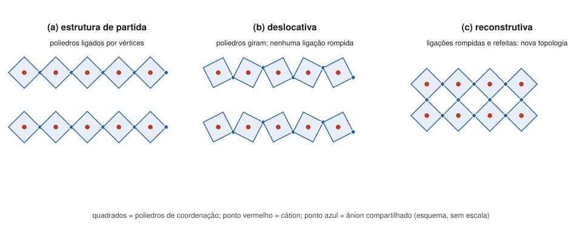

# Aula 01: Polimorfismo — transformações reconstrutivas e deslocativas

**ID:** mineralogia-m10-a01
**Módulo:** [[10-polimorfismo-modulo|Módulo 10 — Polimorfismo, politipismo, ordem-desordem e não cristalinidade]]
**Duração estimada:** ~29 min
**Nível:** ensino médio, sem geologia prévia (contrato `ensino-medio-sem-geologia-v1`)
**Objetivo:** reconhecer polimorfos como estruturas diferentes de uma mesma composição e classificar uma transformação polimórfica em deslocativa ou reconstrutiva pelo que acontece com as ligações e com a coordenação. O terceiro tipo, ordem-desordem, é o tema da aula 02.
**Pré-requisito:** [[08-empacotamento-e-coordenacao-aula-05-regras-de-pauling-parte-2-compartilhamento-de-poliedros-e-parcimonia|Módulo 08, aula 05]] (polimorfos de TiO₂, tetraedros que compartilham vértices) e [[08-empacotamento-e-coordenacao-aula-06-estruturas-tipo-halita-fluorita-rutilo-corindo-espinelio-perovskita-e-esfalerita|aula 06]] (estishovita com estrutura de rutilo).

## Vocabulário desta aula

| Termo | O que quer dizer |
|---|---|
| **polimorfo** | cada uma das estruturas cristalinas diferentes de uma mesma composição química. Calcita e aragonita são dois polimorfos de CaCO₃. |
| **polimorfismo** | a existência de mais de um polimorfo para a mesma composição. Com dois, fala-se em dimorfismo; com três, trimorfismo. |
| **transformação polimórfica** | a passagem de um polimorfo a outro, no estado sólido. Também chamada de transição de fase. |
| **topologia** | o "mapa de quem está ligado a quem": quantos vizinhos cada átomo tem e como os poliedros se conectam, sem considerar ângulos e distâncias exatas. |
| **deslocativa** | transformação em que os átomos só se deslocam um pouco e os poliedros giram ou se inclinam, sem romper ligações. |
| **reconstrutiva** | transformação em que ligações são rompidas e refeitas, mudando a topologia. |
| **paramorfo** | cristal que conserva a forma externa de um polimorfo, mas cuja estrutura já se transformou em outro. |

## Antes de começar, você precisa saber

- Que espécie mineral é definida por composição **e** estrutura, de modo que calcita e aragonita são espécies diferentes ([[02-o-que-e-mineral-aula-03-especie-variedade-grupo-serie-e-nome-comercial|módulo 02, aula 03]]).
- Número de coordenação (NC) e poliedros de coordenação ([[08-empacotamento-e-coordenacao-aula-02-razao-de-raios-e-poliedros-de-coordenacao|módulo 08, aula 02]]).
- Densidade calculada a partir da cela ([[06-reticulo-e-cela-aula-04-conteudo-da-cela-z-volume-e-densidade-calculada|módulo 06, aula 04]]): o quartzo tem 2,65 g/cm³ e a calcita, 2,71.

## Ao final você vai conseguir

- `mineralogia-m10-oa01` — Classificar transformações polimórficas em reconstrutivas, deslocativas e de ordem-desordem pelo tipo de mudança estrutural envolvida. *Esta aula cobre as duas primeiras; a aula 02 cobre a ordem-desordem.*

## Conteúdo

### Mesma fórmula, outro arranjo

Você já encontrou polimorfos no curso: rutilo, anatásio e brookita (TiO₂) no módulo 08; esfalerita e wurtzita (ZnS); a andaluzita, a cianita e a sillimanita (Al₂SiO₅) do módulo 03. Em cada caso a fórmula é a mesma e a estrutura muda. Como a espécie mineral é definida por composição e estrutura, cada polimorfo é uma espécie própria, com nome próprio.

O que muda de um polimorfo para outro? A tabela mostra os casos que o curso vai usar.

| Composição | Polimorfos | O que muda na estrutura | Densidade (g/cm³) |
|---|---|---|---|
| C | grafite; diamante | C em NC 3 (camadas) → NC 4 (arcabouço: rede de ligações nas três direções) | ~2,09–2,23; ~3,51 |
| CaCO₃ | calcita; aragonita; vaterita | Ca em NC 6 → NC 9 (vaterita: rara e metaestável) | 2,71; ~2,93 |
| SiO₂ | quartzo; coesita; estishovita | Si em NC 4 nos dois primeiros (com arcabouços diferentes) → NC 6 | 2,65; ~2,9–3,0; ~4,3 |
| Al₂SiO₅ | andaluzita; sillimanita; cianita | metade do Al é octaédrica nos três; a outra metade: NC 5, NC 4, NC 6 | ~3,13–3,16; ~3,23–3,27; ~3,53–3,65 |
| TiO₂ | rutilo; brookita; anatásio | Ti em NC 6 nos três; muda o número de arestas compartilhadas (2, 3, 4) | — |
| FeS₂ | pirita (cúbica); marcassita (ortorrômbica) | Fe em NC 6 e pares S–S nos dois; muda o arranjo dos octaedros | — |

Duas regularidades saltam da tabela. Primeira: **em geral, o polimorfo de NC maior é o mais denso** (diamante, aragonita, estishovita, cianita). Mais vizinhos por átomo significa átomos mais apertados. É uma tendência, não uma regra sem exceção: a sillimanita, com metade do Al em NC 4, é um pouco mais densa que a andaluzita, com metade do Al em NC 5, porque a densidade depende do empacotamento da estrutura inteira. Isso antecipa uma regra que o módulo 22 vai justificar com termodinâmica: a pressão favorece o polimorfo mais denso, e por isso a coesita e a estishovita indicam alta pressão (módulo 03, aula 03). Segunda: **nem toda mudança é de NC**. No TiO₂, na pirita × marcassita e no quartzo × coesita, os cátions mantêm o NC e o que muda é a maneira de ligar os poliedros.

> [!question] Pare e explique
> A aragonita é cerca de 8% mais densa que a calcita. Que diferença de coordenação da tabela explica isso?

### Classificar pelo que acontece com as ligações

Em 1951, M. J. Buerger propôs classificar as transformações pelo **mecanismo**, isto é, pelo que precisa acontecer com os átomos. Três tipos: **deslocativa**, **reconstrutiva** e **ordem-desordem** (aula 02). A pergunta que separa as duas primeiras é uma só: **alguma ligação precisa ser rompida?**

*Figura 1. Análogo em duas dimensões, com quadrados no lugar dos poliedros. O que observar: em (b), os mesmos vértices continuam compartilhados e só os ângulos mudam; em (c), as cadeias passaram a se ligar entre si em anéis de quatro, o que exige romper e refazer ligações.*

### Deslocativa: girar sem romper

**O exemplo-padrão é o quartzo.** A 1 atm (com a pressão, a temperatura de inversão sobe), o quartzo comum (quartzo-α, trigonal) passa a quartzo-β (hexagonal) a **573 °C**. Os tetraedros de SiO₄ continuam ligados aos mesmos vizinhos pelos mesmos vértices; o que muda é a inclinação entre eles: o ângulo Si–O–Si vai de cerca de 144° no quartzo-α para cerca de 153° no β. Nenhuma ligação se rompe, e a simetria muda (de P3₁21 ou P3₂21 para P6₄22 ou P6₂22).

Daí as marcas da transformação deslocativa:

- **rápida e reversível**: acontece assim que a temperatura cruza o ponto, nos dois sentidos;
- **não se congela**: não dá para resfriar depressa e guardar quartzo-β à temperatura ambiente; ele volta a α;
- **a forma externa pode ficar**. Cristais bipiramidais de quartzo em riolitos (rochas vulcânicas ricas em sílica) cresceram com o hábito do quartzo-β e hoje são quartzo-α: são **paramorfos**. A volta para α pode deixar maclas de Dauphiné (módulo 12).

### Reconstrutiva: romper e refazer

Na transformação reconstrutiva, ligações fortes são rompidas e os átomos se reorganizam numa topologia nova. Isso pode acontecer de dois jeitos:

1. **Muda o NC.** Grafite (NC 3) → diamante (NC 4); calcita (Ca em NC 6) → aragonita (NC 9); quartzo (Si em NC 4) → estishovita (NC 6); andaluzita → cianita (o Al de NC 5 passa a NC 6); andaluzita → sillimanita (o Al de NC 5 passa a NC 4).
2. **O NC fica, a rede de ligações muda.** Quartzo → coesita, quartzo → tridimita ou cristobalita (as formas de alta temperatura da sílica, módulo 36): o Si continua em tetraedro, mas os tetraedros passam a se ligar em outro padrão de anéis. Anatásio → rutilo: o Ti continua em octaedro, mas a rede de octaedros se refaz.

Romper ligações Si–O, C–C ou Al–O custa muita energia. Por isso as reconstrutivas são **lentas**, precisam de temperatura alta ou de muito tempo, e com frequência **não acontecem** quando as condições mudam: o diamante não vira grafite na sua mão, e a sillimanita formada em alta temperatura atravessa milhões de anos depois de resfriada. A aula 05 trata dessa persistência.

> [!question] Pare e explique
> Por que um geólogo pode encontrar sillimanita, formada em alta temperatura, numa rocha que hoje está fria na superfície, mas nunca encontra quartzo-β?

### Um quadro para decidir

| Pergunta | Deslocativa | Reconstrutiva |
|---|---|---|
| Rompe ligações fortes? | não | sim |
| Muda o NC? | não | às vezes |
| Velocidade | rápida, imediata | lenta; pode nem ocorrer |
| Reversível ao voltar às condições iniciais? | sim | em geral não, na escala humana |
| Preserva o polimorfo "errado"? | não (exceto a forma externa) | sim, com frequência |
| Exemplos | quartzo α ↔ β | grafite → diamante; calcita → aragonita; quartzo → coesita ou estishovita; andaluzita → cianita ou sillimanita; anatásio → rutilo |

## Exemplo trabalhado

**Problema.** Classifique cada transformação e diga qual informação da tabela decidiu: (a) quartzo-α → quartzo-β a 573 °C; (b) aragonita de uma concha → calcita, ao longo de milhões de anos; (c) andaluzita → sillimanita no metamorfismo; (d) quartzo → coesita em subducção profunda; (e) anatásio → rutilo no aquecimento.

**(a) Deslocativa.** Mesmos vizinhos, mesmos vértices; só o ângulo Si–O–Si muda (144° → 153°). Rápida e reversível.

**(b) Reconstrutiva.** O Ca passa de NC 9 a NC 6: ligações Ca–O precisam ser rompidas e refeitas. Coerente com a lentidão.

**(c) Reconstrutiva.** Metade do Al passa de NC 5 a NC 4.

**(d) Reconstrutiva**, embora o Si continue em NC 4. É o caso que mais engana: o critério é o rompimento de ligações e a mudança de topologia, não a mudança de NC. A coesita é 10 a 14% mais densa que o quartzo (~2,9–3,0 contra 2,65), o que já indica outro empacotamento.

**(e) Reconstrutiva.** O Ti continua em NC 6, mas o número de arestas compartilhadas por octaedro muda de 4 para 2 (módulo 08, aula 05): a rede de octaedros se refaz.

**Método geral:** (1) liste o NC dos cátions nos dois polimorfos; (2) se o NC muda, é reconstrutiva; (3) se não muda, pergunte se os poliedros continuam ligados aos mesmos vizinhos: se sim, deslocativa; se não, reconstrutiva; (4) confira com a velocidade e a reversibilidade.

## Erros comuns

- **Achar que reconstrutiva significa "muda o NC".** Quartzo → coesita e anatásio → rutilo mantêm o NC e são reconstrutivas. O que decide é romper e refazer ligações.
- **Achar que deslocativa significa "quase nada muda".** A simetria muda, e propriedades físicas como a dilatação térmica mudam bruscamente no ponto de transição. O que não muda é a topologia.
- **Tratar polimorfo como variedade.** Polimorfos são espécies diferentes (calcita e aragonita); variedade é outra coisa (módulo 02, aula 03).
- **Achar que polimorfismo é só "mesma fórmula".** A fórmula igual é a condição de partida; o que distingue os polimorfos é a estrutura, e é dela que vêm a densidade, a dureza e as condições em que cada um se forma. Duas amostras de CaCO₃ podem ser o mesmo polimorfo ou não: quem decide é a estrutura (pela difração, módulo 18), não a análise química.

## O que não concluir

- Que um cristal bipiramidal de quartzo seja quartzo-β. Hoje ele é α; a forma sugere que cresceu como β, o que é uma interpretação, não uma observação.
- Que o polimorfo mais denso seja sempre o mais "resistente" ou o mais comum. Densidade e NC indicam o efeito da pressão; quem é estável em cada condição é assunto do módulo 22.
- Que a classificação em dois tipos seja sempre nítida. Há transformações com características intermediárias; a de Buerger é uma ferramenta de raciocínio, não uma lei.

## Recap relâmpago

- Polimorfos: mesma composição, estruturas diferentes; cada um é uma espécie.
- Em geral, NC maior → polimorfo mais denso (diamante 3,51 × grafite ~2,1–2,2; aragonita ~2,93 × calcita 2,71; estishovita ~4,3 × quartzo 2,65); exceção: sillimanita (Al em NC 4) um pouco mais densa que andaluzita (NC 5).
- Deslocativa: poliedros giram, nenhuma ligação rompida; rápida, reversível, não se congela (quartzo α ↔ β a 573 °C, Si–O–Si 144° → 153°). Pode deixar paramorfos.
- Reconstrutiva: ligações rompidas e refeitas; muda o NC ou só a topologia; lenta, e o polimorfo antigo costuma persistir.
- Critério: romper ligações, não mudar NC (quartzo → coesita é reconstrutiva com Si sempre em NC 4).

## Próxima aula

Em [[10-polimorfismo-aula-02-ordem-desordem-de-cations-e-a-historia-termica|Aula 02 — Ordem-desordem de cátions e a história térmica]], o terceiro tipo de Buerger: a estrutura fica, mas a distribuição dos cátions pelos sítios muda com a temperatura e com a velocidade de resfriamento.

## Fontes consultadas

- Buerger, M. J. (1951), classificação das transformações por mecanismo (reconstrutiva, deslocativa, ordem-desordem) — conferido por busca em 2026-10-06 (Online Dictionary of Crystallography, IUCr, verbete *Phase transition*).
- Quartzo α ↔ β a 573 °C, deslocativa; Si–O–Si ~144° (α) e ~153° (β); grupos espaciais P3₁21/P3₂21 → P6₄22/P6₂22; β não pode ser temperado; maclas de Dauphiné na volta para α; β-quartzo bipiramidal em riolitos como paramorfo — conferido por busca em 2026-10-06 (The Quartz Page; notas de Smith College; Mindat, quartzo-β; *J. Struct. Geol.* sobre maclas de Dauphiné).
- Coesita (D calc. 2,92; medida ~3,0) e estishovita (~4,29–4,35; estrutura de rutilo, Si em NC 6) — conferido por busca (Mindat; Ross et al., 1990, Hazen Lab); as mesmas faixas do curso-geologia-avancado, módulo 40, aula 02 (coesita ~3,00; stishovita ~4,35), citado por nome.
- Calcita (Ca NC 6, 2,71) e aragonita (Ca NC 9, ~2,93); aragonita metaestável na superfície; transformação reconstrutiva — conferido por busca (PNAS 2015, Sun et al.; literatura de CaCO₃). Vaterita: rara e metaestável — busca (Mindat; *Nat. Commun.* 2023).
- Al₂SiO₅: metade do Al em octaedros nos três; o resto em NC 6 (cianita), 5 (andaluzita) e 4 (sillimanita); densidades — conferido por busca (notas do MIT, 12.108; RRUFF/MSA; fichas de andaluzita e cianita).
- Pirita (cúbica) e marcassita (ortorrômbica, Pnnm), ambas com Fe em octaedro e pares S–S; marcassita metaestável — conferido por busca (Mindat; *Dalton Trans.* 2025).
- Diamante (~3,51, C em NC 4) e grafite (~2,09–2,23, C em NC 3) — busca; módulo 01, aulas 04 e 05.
- Densidades relativas e volumes molares calculados em Python em 2026-10-06.

<!--
nivel: ensino-medio-sem-geologia-v1
palavras_corpo: 1597
cobertura:
  mineralogia-m10-oa01: [Conteúdo, Exemplo trabalhado]
figuras:
  - 10-polimorfismo-fig-01-deslocativa-e-reconstrutiva.svg
alegacoes_auditaveis:
  - claim_id: CRQ-POL-DEF-001
    claim: "Polimorfos sao estruturas diferentes de mesma composicao; cada polimorfo e especie distinta (calcita e aragonita)."
    risk: conceito
    source: "Klein & Dutrow; Nickel & Grice (1998); modulo 02 aula 03"
    audit: "verificado em 2026-10-06 (Nickel & Grice 1998; modulo 02 aula 03)"
  - claim_id: CRQ-POL-TABELA-001
    claim: "C: grafite NC3 ~2,09-2,23, diamante NC4 ~3,51; CaCO3: calcita Ca NC6 2,71, aragonita Ca NC9 ~2,93, vaterita rara e metaestavel; SiO2: quartzo 2,65, coesita ~2,9-3,0 (Si IV), estishovita ~4,3 (Si VI); Al2SiO5: metade do Al octaedrica nos tres, o resto NC5 (andaluzita ~3,13-3,16), NC4 (sillimanita ~3,23-3,27), NC6 (cianita ~3,53-3,65); TiO2 Ti VI nos tres; FeS2 Fe VI e pares S-S em pirita (cubica) e marcassita (ortorrombica)."
    risk: numero
    source: "busca (Mindat; MIT 12.108; Sun et al. 2015; Hazen Lab); modulo 06 aula 04; modulo 08 aula 05"
    audit: "corrigido em 2026-10-06 (achado 3: coesita ~2,9-3,0 e estishovita ~4,3, faixas HoM/medida e curso-geologia-avancado m40 a02; demais valores conferidos por busca)"
  - claim_id: CRQ-POL-NCDENS-001
    claim: "Em geral o polimorfo de NC maior e o mais denso (excecao: sillimanita, Al IV, um pouco mais densa que andaluzita, Al V); a pressao favorece o mais denso (justificativa termodinamica no modulo 22)."
    risk: conceito
    source: "Klein & Dutrow; Putnis"
    audit: "corrigido em 2026-10-06 (achado 1: tendencia, com a excecao sillimanita/andaluzita)"
  - claim_id: CRQ-POL-BUERGER-001
    claim: "Buerger (1951) classificou as transformacoes por mecanismo: deslocativa, reconstrutiva e ordem-desordem."
    risk: fato
    source: "IUCr Online Dictionary of Crystallography (busca)"
    audit: "verificado em 2026-10-06 (IUCr Online Dictionary of Crystallography)"
  - claim_id: CRQ-POL-QTZAB-001
    claim: "Quartzo alfa -> beta a 573 C (1 atm), deslocativa: sem romper ligacoes, Si-O-Si ~144 -> ~153 graus, P3121/P3221 -> P6422/P6222; rapida, reversivel, beta nao se tempera."
    risk: numero
    source: "busca (The Quartz Page; Smith College; IAS Mater. Sci. Bull. 1979)"
    audit: "verificado em 2026-10-06 (busca: 573 C a 1 atm, sobe com P; Si-O-Si 144/153; grupos espaciais; nao temperavel)"
  - claim_id: CRQ-POL-PARAMORFO-001
    claim: "Cristais bipiramidais de quartzo em riolitos sao paramorfos de quartzo-alfa apos quartzo-beta; a volta para alfa pode deixar maclas de Dauphine."
    risk: fato
    source: "busca (Mindat quartzo-beta; J. Struct. Geol.)"
    audit: "corrigido em 2026-10-06 (achado 4: pode deixar maclas de Dauphine, nao costuma)"
  - claim_id: CRQ-POL-RECON-001
    claim: "Reconstrutivas rompem e refazem ligacoes, mudando NC ou so a topologia; exemplos: grafite->diamante, calcita->aragonita, quartzo->estishovita, andaluzita->cianita e andaluzita->sillimanita (NC muda); quartzo->coesita, quartzo->tridimita/cristobalita, anatasio->rutilo (NC fica); sao lentas e o polimorfo antigo persiste."
    risk: conceito
    source: "Klein & Dutrow; Putnis; busca (quartzo-tridimita reconstrutiva)"
    audit: "corrigido em 2026-10-06 (achado 2: andaluzita->sillimanita movida para o grupo em que o NC muda)"
  - claim_id: CRQ-POL-ANDSIL-001
    claim: "Andaluzita -> sillimanita: metade do Al passa de NC 5 para NC 4."
    risk: fato
    source: "busca (MIT 12.108)"
    audit: "verificado em 2026-10-06 (MIT 12.108: metade do Al em VI nos tres; resto IV na sillimanita, V na andaluzita)"
  - claim_id: CRQ-POL-CALC-001
    claim: "Aragonita ~8% mais densa que calcita (2,93/2,71); coesita 10-14% mais densa que quartzo (2,92-3,01/2,65)."
    risk: numero
    source: "calculo em Python"
    audit: "corrigido em 2026-10-06 (achado 3: coesita 10-14% mais densa; calculo em Python 2,92/2,65 e 3,01/2,65)"
-->
