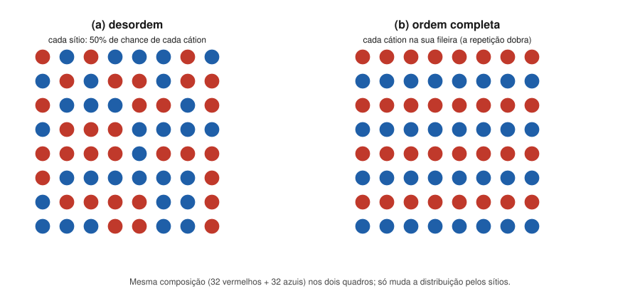

# Aula 02: Ordem-desordem de cátions e a história térmica

**ID:** mineralogia-m10-a02
**Módulo:** [[10-polimorfismo-modulo|Módulo 10 — Polimorfismo, politipismo, ordem-desordem e não cristalinidade]]
**Duração estimada:** ~28 min
**Nível:** ensino médio, sem geologia prévia (contrato `ensino-medio-sem-geologia-v1`)
**Objetivo:** descrever a transformação de ordem-desordem, o terceiro tipo de Buerger, nos exemplos da dolomita, dos feldspatos potássicos e dos ortopiroxênios, e prever o grau de ordem de um cristal a partir da velocidade com que ele esfriou.
**Pré-requisito:** [[10-polimorfismo-aula-01-polimorfismo-transformacoes-reconstrutivas-e-deslocativas|Aula 01]] (deslocativa × reconstrutiva) e [[09-substituicao-e-formula-aula-03-solucao-solida-miscibilidade-e-isomorfismo|módulo 09, aula 03]] (dolomita ordenada; feldspatos alcalinos e temperatura).

## Vocabulário desta aula

| Termo | O que quer dizer |
|---|---|
| **sítio** | posição da estrutura que um cátion pode ocupar; sítios iguais por simetria formam um conjunto. |
| **desordem** | dois cátions dividem um conjunto de sítios ao acaso: cada sítio tem a mesma probabilidade de receber um ou outro. |
| **ordem** | cada cátion prefere um conjunto de sítios; no limite, cada um ocupa só os seus. |
| **grau de ordem** | quanto o arranjo real está entre a desordem total (0) e a ordem completa (1). |
| **sítio tetraédrico T** | sítio em tetraedro, ocupado por Si ou Al nos silicatos. Nos feldspatos triclínicos há quatro tipos, chamados T1o, T1m, T2o e T2m; nos monoclínicos, a simetria torna T1o igual a T1m e T2o igual a T2m, e sobram dois (T1 e T2). |
| **feldspato potássico** | KAlSi₃O₈, um silicato de arcabouço muito comum em granitos (módulo 36). Sanidina, ortoclásio e microclínio são seus três polimorfos. |
| **ortopiroxênio** | piroxênio (silicato de cadeias, módulo 34) ortorrômbico de Mg e Fe, com dois sítios octaédricos, M1 e M2. |

## Antes de começar, você precisa saber

- Que um sítio pode ser dividido por dois cátions numa solução sólida ([[09-substituicao-e-formula-aula-02-mecanismos-de-substituicao-e-vetores-de-troca|módulo 09, aula 02]]).
- Que o Al³⁺ substitui o Si⁴⁺ nos tetraedros ([[09-substituicao-e-formula-aula-01-quem-substitui-quem-regras-de-goldschmidt-e-de-ringwood|módulo 09, aula 01]]).
- Que temperatura alta favorece a mistura e o resfriamento lento permite separação, como na pertita ([[09-substituicao-e-formula-aula-03-solucao-solida-miscibilidade-e-isomorfismo|módulo 09, aula 03]]).

## Ao final você vai conseguir

- `mineralogia-m10-oa03` — Descrever a ordem-desordem de cátions (Al/Si em feldspatos, Fe/Mg em piroxênios) e prever o efeito da história térmica sobre o grau de ordem.
- `mineralogia-m10-oa01` — *Esta aula completa o objetivo com o terceiro tipo de transformação, a de ordem-desordem.*

## Conteúdo

### A estrutura fica; a distribuição muda

Nas transformações da aula 01, a estrutura muda de forma (gira ou se reconstrói). Na de **ordem-desordem**, o arcabouço de poliedros continua o mesmo e o que muda é **quem ocupa cada sítio**. Imagine 64 assentos e 32 pessoas de camisa vermelha e 32 de azul: elas podem se sentar ao acaso ou cada cor em fileiras alternadas. A plateia é a mesma, a composição é a mesma, e as duas situações são diferentes.

*Figura 3. Dois cátions num conjunto de sítios. O que observar: a composição é idêntica; na ordem completa, a menor unidade que se repete passa a ter duas fileiras, porque as fileiras vermelhas e azuis deixaram de ser equivalentes.*

A analogia tem limite: os cátions não "escolhem" um assento. Eles trocam de lugar por difusão, um salto de cada vez, e isso só acontece quando há energia térmica suficiente.

### Por que a temperatura decide

Duas tendências competem:

- **A ordem baixa a energia.** Cada cátion no sítio que lhe serve melhor (tamanho, carga, ligação) torna o cristal mais estável. A temperatura baixa, essa tendência vence.
- **A desordem é favorecida pelo calor.** Há muito mais maneiras de distribuir os cátions ao acaso do que em ordem; a temperatura alta, o cristal "visita" essas maneiras. O módulo 22 dá nome a isso (entropia).

Resultado: **acima de certa temperatura, desordem; abaixo, ordem**. Mas ordenar exige saltos de difusão, que ficam mais lentos à medida que a temperatura cai. Daí a regra prática:

> **Resfriamento lento** dá tempo de ordenar: o cristal chega frio e ordenado. **Resfriamento rápido** congela a desordem de alta temperatura.

O grau de ordem é, portanto, um **registro da história térmica**.

### Quando a ordem muda a simetria (e quando não muda)

Na figura 3, a ordem cria uma diferença entre fileiras que antes eram equivalentes: a simetria diminui e a repetição fica maior. É o caso **convergente**: na desordem total, os sítios ficam iguais por simetria. No caso **não convergente**, os sítios já são diferentes desde o início (tamanhos ou formas distintos), e a ordem só altera a proporção de cada cátion em cada um, sem mudar a simetria.

### Dolomita: Ca e Mg em camadas

A dolomita, CaMg(CO₃)₂, tem a estrutura da calcita com uma diferença: Ca e Mg ocupam **camadas alternadas** perpendiculares ao eixo c. Essa alternância destrói um elemento de simetria da calcita, e o grupo espacial cai de R3̄c (calcita) para **R3̄** (dolomita). É ordem convergente. Uma "dolomita" com Ca e Mg misturados nas camadas seria outro material; por isso a dolomita não é o meio de uma série calcita–magnesita (módulo 09, aula 03). Na difração (módulo 18), a ordem aparece como reflexões extras que a calcita não tem.

### Feldspatos potássicos: Al e Si nos tetraedros

No KAlSi₃O₈ há 1 Al para 3 Si, distribuídos em quatro sítios T. As três espécies formam uma **série de estado estrutural**:

| Espécie | Distribuição de Al | Simetria | Onde aparece |
|---|---|---|---|
| **sanidina** | ao acaso: cada sítio T tem em média 0,25 Al | monoclínica (C2/m) | rochas vulcânicas, resfriadas depressa |
| **ortoclásio** | parcialmente ordenada: Al concentrado nos sítios T1, igualmente em T1o e T1m | monoclínica (C2/m) | granitos rasos e subvulcânicos; rochas metamórficas de grau moderado a alto |
| **microclínio** | ordenada: Al quase todo num único sítio, T1o | triclínica (C1̄) | granitos de embasamento e pegmatitos resfriados lentamente; rochas metamórficas de grau baixo a médio |

A passagem de ortoclásio a microclínio é o ponto em que T1o e T1m deixam de ser equivalentes: a simetria cai de monoclínica para triclínica (convergente). Nesse processo, regiões vizinhas do cristal podem se ordenar de dois modos equivalentes, um a imagem do outro, e o resultado é a "macla em grade" típica do microclínio, uma macla de transformação (módulo 12). A química, a ótica e a nomenclatura dos feldspatos ficam para o módulo 36; esta aula só apresenta a ideia.

> [!question] Pare e explique
> Um feldspato potássico de um derrame de lava e outro de um granito profundo têm a mesma fórmula. Qual dos dois você espera mais ordenado, e por quê?

### Ortopiroxênios: Fe e Mg entre M1 e M2

No ortopiroxênio (Mg,Fe)₂Si₂O₆, os dois sítios octaédricos são diferentes: M2 é maior e mais irregular que M1 (como no piroxênio do módulo 09, aula 05). O Fe²⁺ tem preferência pelo M2. Como os sítios já são diferentes, a simetria não muda com a ordem: é o caso **não convergente**. O que muda com a temperatura é **quanto** Fe²⁺ vai para M2.

A troca Fe²⁺(M2) + Mg(M1) ⇄ Mg(M2) + Fe²⁺(M1) é tão bem calibrada em laboratório que o grau de ordem medido por difração num ortopiroxênio serve como **velocímetro de resfriamento**: para taxas de 1 a 10⁴ °C por milhão de anos, a distribuição "congela" entre cerca de 300 e 400 °C, e o que ficou registrado diz quão rápido a rocha esfriou.

## Exemplo trabalhado

**Problema.** Três feldspatos potássicos tiveram o Al de cada sítio T determinado (valores **construídos** para o exercício). (a) Confira que cada um tem 1 Al por fórmula. (b) Classifique cada um. (c) Ordene-os pela velocidade provável de resfriamento.

| Cristal | T1o | T1m | T2o | T2m |
|---|---|---|---|---|
| A | 0,25 | 0,25 | 0,25 | 0,25 |
| B | 0,40 | 0,40 | 0,10 | 0,10 |
| C | 0,95 | 0,02 | 0,02 | 0,01 |

**(a)** Somas: A = 1,00; B = 1,00; C = 1,00. ✔ (a fórmula tem 4 sítios T e 1 Al.)

**(b)** A: Al igual em todos os sítios → **sanidina**. B: Al concentrado em T1 (0,80 dos 1,00), mas T1o = T1m → ordem parcial, ainda monoclínico → **ortoclásio**. C: Al quase todo em T1o, T1o ≠ T1m → **microclínio**.

**(c)** Mais rápido → mais lento: **A, B, C**. A provavelmente veio de rocha vulcânica; C, de rocha plutônica ou metamórfica que esfriou devagar.

**Método geral:** (1) some as ocupações para conferir a fórmula; (2) compare os sítios: iguais = desordem; (3) veja se a ordem quebra uma equivalência (simetria cai) ou só desloca proporções; (4) leia o grau de ordem como registro do resfriamento.

## Erros comuns

- **Confundir ordem-desordem com solução sólida.** A solução sólida fala de **quanto** de cada cátion há; a ordem-desordem, de **onde** eles estão. A composição de A, B e C é a mesma.
- **Achar que "ordenado" significa "formado a baixa temperatura".** Pode ter se formado quente e se ordenado durante um resfriamento lento.
- **Esperar mudança de simetria sempre.** No ortopiroxênio, a ordem Fe/Mg não muda a simetria.
- **Ler sanidina, ortoclásio e microclínio como composições diferentes.** São o mesmo KAlSi₃O₈ com distribuições diferentes de Al.

## O que não concluir

- Que todo feldspato potássico de granito seja microclínio. Há ortoclásio em granitos; o grau de ordem depende da história de resfriamento e também de deformação e fluidos.
- Que o grau de ordem dê a temperatura de formação. Ele registra a temperatura em que a troca "congelou" no resfriamento, não a de cristalização.
- Que a desordem completa seja o estado natural do cristal. É o estado de equilíbrio só a alta temperatura.

## Recap relâmpago

- Ordem-desordem: mesmo arcabouço, muda quem ocupa cada sítio; é o terceiro tipo de Buerger.
- Alta temperatura → desordem; baixa → ordem; resfriamento lento ordena, rápido congela a desordem.
- Convergente (sítios ficam iguais na desordem; ordem baixa a simetria): dolomita R3̄c → R3̄; ortoclásio → microclínio (monoclínico → triclínico). Não convergente (sítios sempre diferentes): Fe/Mg em M1/M2 do ortopiroxênio.
- K-feldspato: sanidina (0,25 Al por T, vulcânica) → ortoclásio (Al em T1) → microclínio (Al em T1o, triclínico).
- Ortopiroxênio: Fe²⁺ prefere M2; o grau de ordem é velocímetro de resfriamento (congela a ~300–400 °C).

## Próxima aula

Em [[10-polimorfismo-aula-03-politipismo-empilhamentos-e-a-notacao-de-ramsdell|Aula 03 — Politipismo]], outra forma de variar uma estrutura sem mudar a composição: empilhar as mesmas camadas em sequências diferentes.

## Fontes consultadas

- Série sanidina (C2/m, desordenada, 0,25 Al por sítio T) – ortoclásio (parcialmente ordenado, Al em T1) – microclínio (C1̄, Al em T1o); sanidina em rochas vulcânicas, microclínio por resfriamento lento — conferido por busca em 2026-10-06 (Mindat: sanidina, ortoclásio, microclínio; notas de feldspatos do Smith College). Não contradiz a nomenclatura de estado estrutural do curso-geologia-avancado, módulo 40.
- Dolomita R3̄ com camadas alternadas de Ca e Mg; calcita R3̄c; reflexões de ordem na DRX — conferido por busca (*Minerals* 13, 1479, 2023; *Science* 2023).
- Ordem convergente × não convergente (Carpenter; Putnis, *An Introduction to Mineral Sciences*) — conferido por busca (Holland & Powell 1996, *Am. Mineral.* 81; *Phys. Chem. Minerals*).
- Ortopiroxênio: Fe²⁺–Mg entre M1 e M2, Fe²⁺ preferindo M2; velocímetro de resfriamento; fechamento entre 300 e 400 °C para 1–10⁴ °C/Ma — conferido por busca (Stimpfl, Ganguly & Molin, *Contrib. Mineral. Petrol.* 2005; LPSC 2006).
- Macla em grade do microclínio como macla de transformação: Klein & Dutrow, *Manual of Mineral Science*, 23ª ed. (retomada no módulo 12).
- Somas de ocupação do exemplo calculadas em Python em 2026-10-06.

<!--
nivel: ensino-medio-sem-geologia-v1
palavras_corpo: 1312
cobertura:
  mineralogia-m10-oa03: [Conteúdo, Exemplo trabalhado]
  mineralogia-m10-oa01: [Conteúdo]
figuras:
  - 10-polimorfismo-fig-03-ordem-e-desordem.svg
alegacoes_auditaveis:
  - claim_id: CRQ-OD-DEF-001
    claim: "Na transformacao de ordem-desordem o arcabouco fica e muda a distribuicao dos cations pelos sitios; alta T favorece desordem, baixa T ordem; resfriamento lento ordena, rapido congela a desordem."
    risk: conceito
    source: "Putnis; Klein & Dutrow"
    audit: "verificado em 2026-10-06 (Putnis; Klein & Dutrow)"
  - claim_id: CRQ-OD-CONV-001
    claim: "Ordem convergente: sitios equivalentes na desordem, a ordem baixa a simetria; nao convergente: sitios sempre distintos, sem mudanca de simetria."
    risk: conceito
    source: "Carpenter; Putnis (busca)"
    audit: "verificado em 2026-10-06 (busca: Carpenter; Holland & Powell 1996)"
  - claim_id: CRQ-OD-DOLOMITA-001
    claim: "Dolomita CaMg(CO3)2: Ca e Mg em camadas alternadas perpendiculares a c; grupo espacial cai de R-3c (calcita) para R-3; reflexoes de ordem na DRX."
    risk: fato
    source: "busca (Minerals 2023; Science 2023)"
    audit: "verificado em 2026-10-06 (busca: R-3, camadas alternadas, perda do plano c)"
  - claim_id: CRQ-OD-KFS-001
    claim: "K-feldspato: sanidina C2/m desordenada (0,25 Al por sitio T, vulcanica; nos monoclinicos ha so dois tipos de sitio T, T1 e T2); ortoclasio C2/m parcialmente ordenado (Al em T1, T1o = T1m); microclinio C-1 ordenado (Al em T1o), resfriamento lento; a passagem para triclinico gera a macla em grade (macla de transformacao)."
    risk: fato
    source: "Mindat; Smith College; Klein & Dutrow (busca)"
    audit: "corrigido em 2026-10-06 (achado 5: dois tipos de sitio T nos monoclinicos; ocorrencias alinhadas ao curso-geologia-avancado m40 a06)"
  - claim_id: CRQ-OD-OPX-001
    claim: "Ortopiroxenio: Fe2+ prefere M2 (maior, mais irregular que M1); ordem nao convergente; velocimetro de resfriamento; fechamento a ~300-400 C para 1 a 10^4 C/Ma."
    risk: numero
    source: "Stimpfl, Ganguly & Molin (2005); LPSC 2006 (busca)"
    audit: "verificado em 2026-10-06 (Stimpfl, Ganguly & Molin 2005; LPSC 2006)"
  - claim_id: CRQ-OD-EXEMPLO-001
    claim: "Exemplo construido: A 0,25 x4 (sanidina); B 0,40/0,40/0,10/0,10 (ortoclasio); C 0,95/0,02/0,02/0,01 (microclinio); somas 1,00."
    risk: numero
    source: "construido; calculo em Python"
    audit: "verificado em 2026-10-06 (somas recalculadas em Python)"
-->
