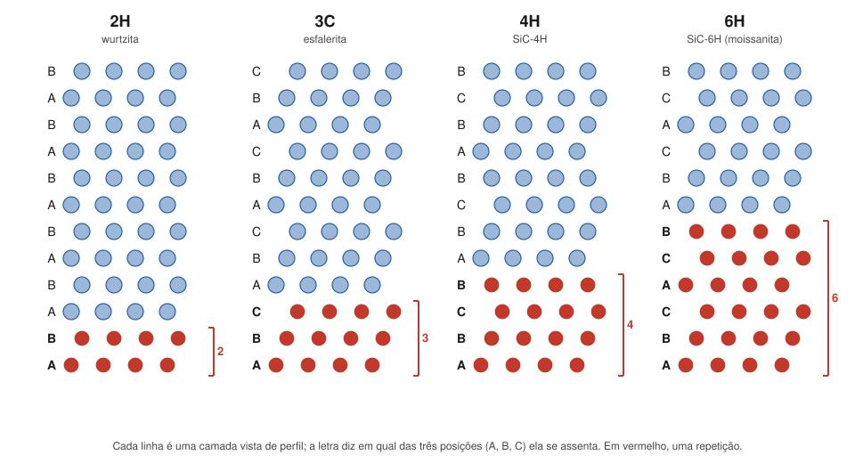

# Aula 03: Politipismo — empilhamentos e a notação de Ramsdell

**ID:** mineralogia-m10-a03
**Módulo:** [[10-polimorfismo-modulo|Módulo 10 — Polimorfismo, politipismo, ordem-desordem e não cristalinidade]]
**Duração estimada:** ~26 min
**Nível:** ensino médio, sem geologia prévia (contrato `ensino-medio-sem-geologia-v1`)
**Objetivo:** explicar o politipismo como um caso de polimorfismo em que só muda a sequência de empilhamento de camadas iguais, ler e escrever símbolos de politipos (2H, 3C, 4H, 6H, 15R; 1M, 2M₁, 3T) e reconhecer como a IMA nomeia politipos.
**Pré-requisito:** [[08-empacotamento-e-coordenacao-aula-03-empacotamento-compacto-e-intersticios|Módulo 08, aula 03]] (camadas A, B, C; empilhamentos ABAB e ABCABC) e [[10-polimorfismo-aula-01-polimorfismo-transformacoes-reconstrutivas-e-deslocativas|aula 01]].

## Vocabulário desta aula

| Termo | O que quer dizer |
|---|---|
| **camada** | fatia da estrutura, de composição e arranjo fixos, que se repete ao longo de uma direção (em geral o eixo c). |
| **sequência de empilhamento** | a ordem em que as camadas se assentam umas sobre as outras, escrita com letras (A, B, C) ou com rotações. |
| **politipo** | cada uma das estruturas que se obtêm empilhando as mesmas camadas em sequências diferentes. |
| **politipismo** | a existência de politipos; é um caso particular de polimorfismo. |
| **notação de Ramsdell** | símbolo do politipo: número de camadas na repetição + letra do sistema (C cúbico, H hexagonal, R romboédrico, T trigonal, M monoclínico, O ortorrômbico, A triclínico). |
| **falha de empilhamento** | um "erro" local na sequência, como ABCAB**AB**CABC (módulo 12). |

## Antes de começar, você precisa saber

- Que esferas iguais em camada compacta podem assentar em três posições, A, B e C, e que ABAB dá empilhamento hexagonal compacto e ABCABC, cúbico compacto ([[08-empacotamento-e-coordenacao-aula-03-empacotamento-compacto-e-intersticios|módulo 08, aula 03]]).
- Que esfalerita e wurtzita, ZnS, têm Zn em metade dos interstícios tetraédricos de uma pilha cúbica e de uma pilha hexagonal de S ([[08-empacotamento-e-coordenacao-aula-06-estruturas-tipo-halita-fluorita-rutilo-corindo-espinelio-perovskita-e-esfalerita|módulo 08, aula 06]]).

## Ao final você vai conseguir

- `mineralogia-m10-oa02` — Explicar o politipismo (micas, ZnS, SiC) e ler a notação de politipos.

## Conteúdo

### Mesmas camadas, outra ordem

No módulo 08 você empilhou esferas: cada camada nova pode cair em duas posições sobre a anterior, e isso dá **ABAB...** ou **ABCABC...**. Nada impede sequências mais longas: ABCB, ABCACB e assim por diante. A única regra é que duas camadas vizinhas não podem estar na mesma posição (AA é impossível: as esferas ficariam umas sobre as outras).

Quando um material é feito de **camadas iguais** e a única diferença entre duas estruturas é a **sequência de empilhamento**, elas são **politipos**. É polimorfismo, porque a composição é a mesma e a estrutura muda, mas um polimorfismo "em uma dimensão": dentro de cada camada nada muda, e os parâmetros a e b da cela ficam praticamente iguais; muda o parâmetro c, que cresce com o número de camadas da repetição.

*Figura 2. A mesma camada em quatro sequências. O que observar: o número do símbolo é o número de camadas até a sequência se repetir (em vermelho); a letra é o sistema que a sequência produz.*

### Lendo o símbolo

O símbolo de Ramsdell tem duas partes: **quantas camadas** há na repetição e **qual o sistema** (ou o retículo, no caso R) da estrutura resultante.

- **2H** = AB: 2 camadas, hexagonal. É a wurtzita.
- **3C** = ABC: 3 camadas, cúbica. É a esfalerita. Atenção: o "3" não contradiz o "cúbico"; vista ao longo da diagonal do cubo, a estrutura cúbica de face centrada é exatamente uma pilha ABC.
- **4H** = ABCB; **6H** = ABCACB: hexagonais com repetições maiores.
- **15R**: 15 camadas, retículo romboédrico.

Se dois politipos têm o mesmo número de camadas e o mesmo sistema, um índice os distingue: nas micas, **2M₁** e **2M₂** são dois politipos monoclínicos de duas camadas diferentes.

> [!question] Pare e explique
> A sequência ABAC repetida é um politipo diferente de ABCB? (Dica: comece a ler ABCB pela segunda letra e troque os nomes das posições.)

### Onde os politipos aparecem

**ZnS.** Esfalerita (3C) e wurtzita (2H) são politipos. A wurtzita também aparece em sequências mais longas (4H, 6H e outras).

**SiC (moissanita).** O carbeto de silício é o recordista: são conhecidos muitos politipos. Na moissanita natural, encontrada em kimberlitos e outras rochas, o mais comum é o **6H**, seguido de 15R e 4H; o 3C é raro e aparece em meteoritos que sofreram impacto.

**Grafite.** Camadas de hexágonos de carbono (módulo 01, aula 05) empilhadas em **2H** (o comum) ou **3R**.

**Micas.** Aqui a "camada" é a lâmina inteira de mica, com seus tetraedros, octaedros e o K que as une (módulo 01, aula 05; a estrutura é do módulo 35). Cada lâmina seguinte pode girar em relação à anterior, em múltiplos de 60°, e as sequências possíveis dão os politipos **1M, 2M₁, 2M₂, 3T**, além dos raros 2O e 6H (Smith e Yoder, 1956). Como cada lâmina tem cerca de 10 Å de espessura, o parâmetro c fica em torno de 10 Å no 1M, 20 Å no 2M₁ e 30 Å no 3T. Na muscovita, o politipo mais comum é o **2M₁**.

### Por que tantos politipos

Os politipos de uma mesma substância diferem pouco em energia, porque cada camada fica cercada de vizinhas quase iguais em qualquer sequência; só as camadas mais distantes "sentem" a diferença. Por isso vários politipos podem se formar nas mesmas condições, e erros de sequência (falhas de empilhamento) são frequentes. Estruturas em que as camadas se encaixam em mais de um modo equivalente são chamadas **estruturas OD** (de *order-disorder*); nelas, o empilhamento pode ser regular (um politipo) ou desordenado, e na difração (módulo 18) a desordem aparece como reflexões borradas ao longo de uma direção.

### Como a IMA nomeia

A regra da IMA é que **politipos não são espécies distintas**. Todos recebem o nome da espécie, seguido do símbolo do politipo depois de um hífen: **muscovita-2M₁**, **grafite-3R**. A exceção são nomes antigos e consagrados, que a comissão manteve: esfalerita e wurtzita continuam sendo duas espécies aprovadas.

**Controvérsia em uma frase:** a lonsdaleíta, descrita como um "diamante 2H" de crateras de impacto, existe como material próprio, ou o que se descreveu é diamante cúbico cheio de maclas e falhas de empilhamento (Németh e colaboradores, 2014)? A questão continua em debate.

## Exemplo trabalhado

**Problema.** (a) Dê o símbolo de Ramsdell das sequências ABCB e ABCACB, sabendo que ambas são hexagonais. (b) ABAC é outro politipo? (c) O que se pode dizer de "muscovita-3T"? (d) Por que a sequência ABBA não existe?

**(a)** ABCB: 4 camadas até repetir → **4H**. ABCACB: 6 → **6H**.

**(b)** Não. Leia ABCB a partir da segunda letra: BCBA. Renomeie as posições (B → A, C → B, A → C): **ABAC**. É a mesma sequência com outro ponto de partida e outros nomes; continua sendo **4H**.

**(c)** É muscovita, a mesma espécie de uma muscovita-2M₁, com 3 lâminas na repetição e simetria trigonal; c em torno de 30 Å.

**(d)** Duas camadas vizinhas na mesma posição (BB) poriam as esferas umas sobre as outras, sem encaixe nos vãos.

**Método geral:** (1) escreva a sequência até ela se repetir e conte as camadas; (2) acrescente a letra do sistema; (3) antes de declarar um politipo novo, teste se a sequência não é a mesma lida de outro ponto ou com as letras trocadas.

## Erros comuns

- **Achar que politipo é espécie nova.** Pela regra da IMA, é a mesma espécie com um sufixo; esfalerita e wurtzita são exceção histórica.
- **Ler o número do símbolo como número de átomos.** É o número de camadas na repetição.
- **Achar que 3C é "trigonal" porque tem 3 camadas.** A sequência ABC produz simetria cúbica.
- **Confundir politipismo com ordem-desordem.** No politipo, mudam as posições relativas das camadas; na ordem-desordem (aula 02), muda quem ocupa cada sítio.

## O que não concluir

- Que todo empilhamento seja um politipo regular. Falhas e sequências desordenadas são comuns, sobretudo em micas e argilominerais (módulo 35).
- Que a sequência de empilhamento indique uma condição de formação precisa. A diferença de energia entre politipos é pequena, e o politipo formado depende também das condições de crescimento.
- Que a lonsdaleíta seja uma prova aceita sem discussão de impacto: o próprio material é contestado.

## Recap relâmpago

- Politipos: mesmas camadas, sequências de empilhamento diferentes; caso particular de polimorfismo; muda c, a e b quase não.
- Ramsdell: nº de camadas na repetição + sistema: 2H (AB), 3C (ABC), 4H (ABCB), 6H (ABCACB), 15R; micas 1M, 2M₁, 2M₂, 3T.
- ZnS: esfalerita 3C, wurtzita 2H; SiC natural: 6H mais comum; grafite 2H e 3R; muscovita: 2M₁ mais comum.
- IMA: politipo não é espécie; escreve-se muscovita-2M₁, grafite-3R (exceção histórica: esfalerita e wurtzita).
- Estruturas OD e falhas de empilhamento explicam a abundância de politipos e a desordem de empilhamento.

## Próxima aula

Em [[10-polimorfismo-aula-04-amorfos-mineraloides-e-metamictizacao|Aula 04 — Amorfos, mineraloides e metamictização]], o limite do estado cristalino: materiais sem ordem de longo alcance e cristais que perdem a ordem por radiação.

## Fontes consultadas

- Guinier, A. et al. (1984), "Nomenclature of polytype structures", *Acta Cryst.* A40, 399–404 (definição; notação de Ramsdell; letras de sistema) — conferido por busca em 2026-10-06 (IUCr, Commission on Crystallographic Nomenclature).
- Nickel, E. H. & Grice, J. D. (1998), *Can. Mineral.* 36 (politipos não são espécies; sufixo; nomes consagrados mantidos) e Hatert, F. et al. (2023), "CNMNC guidelines for the nomenclature of polymorphs and polysomes", *Mineral. Mag.* 87, 225 ss. — conferido por busca.
- Micas: Smith, J. V. & Yoder, H. S. (1956): 1M, 2M₁, 2M₂, 3T, 2O, 6H; muscovita-2M₁ o mais comum; c ~10, 20 e 30 Å para 1M, 2M₁ e 3T (relatório de nomenclatura de micas da IMA, Rieder et al., 1998) — conferido por busca.
- Moissanita: politipos 3C, 4H, 6H, 15R; 6H o mais comum na natureza; 3C raro, em meteoritos chocados — conferido por busca (Shiryaev et al., *Lithos*; Mindat).
- Grafite-2H e grafite-3R; esfalerita e wurtzita mantidas como espécies — conferido por busca (Mindat; Bailey, 1977, *Acta Cryst.* A33).
- Németh, P. et al. (2014), "Lonsdaleite is faulted and twinned cubic diamond and does not exist as a discrete material", *Nat. Commun.* 5, 5447 — conferido por busca; debate posterior (PNAS 2023).
- Sequências de empilhamento conferidas por script (camadas vizinhas sempre diferentes; ABAC equivalente a ABCB) em 2026-10-06.

<!--
nivel: ensino-medio-sem-geologia-v1
palavras_corpo: 1133
cobertura:
  mineralogia-m10-oa02: [Conteúdo, Exemplo trabalhado]
figuras:
  - 10-polimorfismo-fig-02-politipos-sequencias-de-empilhamento.svg
alegacoes_auditaveis:
  - claim_id: CRQ-PTP-DEF-001
    claim: "Politipos: estruturas de camadas iguais que diferem so na sequencia de empilhamento; caso particular de polimorfismo; a e b quase iguais, c cresce com o numero de camadas."
    risk: conceito
    source: "Guinier et al. (1984)"
    audit: "verificado em 2026-10-06 (Guinier et al. 1984)"
  - claim_id: CRQ-PTP-RAMSDELL-001
    claim: "Notacao de Ramsdell: numero de camadas na repeticao + letra do sistema (C, H, R, T, M, O, A); 2H = AB, 3C = ABC, 4H = ABCB, 6H = ABCACB, 15R."
    risk: fato
    source: "Guinier et al. (1984); Nickel & Grice (1998)"
    audit: "verificado em 2026-10-06 (Guinier et al. 1984; Nickel & Grice 1998; sequencias conferidas por script)"
  - claim_id: CRQ-PTP-ZNS-001
    claim: "Esfalerita = 3C e wurtzita = 2H, politipos de ZnS; wurtzita tem politipos mais longos (4H, 6H)."
    risk: fato
    source: "busca (Mindat; MTU)"
    audit: "verificado em 2026-10-06 (busca: Mindat, MTU)"
  - claim_id: CRQ-PTP-SIC-001
    claim: "Moissanita (SiC) natural: 6H o mais comum, depois 15R e 4H; 3C raro, em meteoritos chocados."
    risk: fato
    source: "busca (Shiryaev et al.; Mindat)"
    audit: "verificado em 2026-10-06 (busca: Shiryaev et al.; Mindat)"
  - claim_id: CRQ-PTP-MICA-001
    claim: "Micas: politipos 1M, 2M1, 2M2, 3T, 2O, 6H (Smith & Yoder 1956); c ~10, 20, 30 A para 1M, 2M1, 3T; muscovita-2M1 o mais comum; lamina de ~10 A."
    risk: numero
    source: "Smith & Yoder (1956); Rieder et al. (1998) (busca)"
    audit: "corrigido em 2026-10-06 (achado 6: exemplo (c) nao afirma mais composicao identica entre muscovitas; valores de c conferidos)"
  - claim_id: CRQ-PTP-GRAFITE-001
    claim: "Grafite-2H (comum) e grafite-3R."
    risk: fato
    source: "busca (Mindat)"
    audit: "verificado em 2026-10-06 (busca: Mindat, grafite-3R)"
  - claim_id: CRQ-PTP-IMA-001
    claim: "IMA: politipos nao sao especies distintas; nome + sufixo (muscovita-2M1, grafite-3R); nomes antigos consagrados mantidos (esfalerita e wurtzita)."
    risk: fato
    source: "Nickel & Grice (1998); Hatert et al. (2023); Bailey (1977)"
    audit: "verificado em 2026-10-06 (Nickel & Grice 1998; Hatert et al. 2023; Bailey 1977)"
  - claim_id: CRQ-PTP-OD-001
    claim: "Politipos diferem pouco em energia; estruturas OD admitem mais de um encaixe equivalente entre camadas; desordem de empilhamento aparece como reflexoes borradas ao longo de uma direcao."
    risk: conceito
    source: "Putnis; Guinier et al. (1984)"
    audit: "verificado em 2026-10-06 (Putnis; Guinier et al. 1984)"
  - claim_id: CRQ-PTP-LONSD-001
    claim: "Lonsdaleita ('diamante 2H') contestada por Nemeth et al. (2014), Nat. Commun. 5, 5447: diamante cubico com maclas e falhas; debate aberto."
    risk: controversia
    source: "Nemeth et al. (2014) (busca)"
    audit: "verificado em 2026-10-06 (Nemeth et al. 2014; PNAS 2023 sobre ureilitos): controversia apresentada como pergunta aberta"
-->
