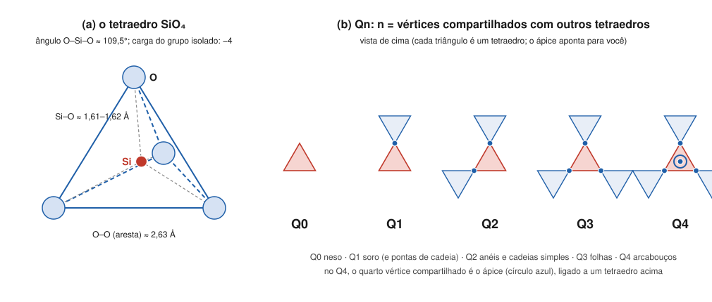

# Aula 01: O tetraedro SiO₄ e a ligação Si–O

**ID:** mineralogia-m11-a01
**Módulo:** [[11-estrutura-dos-silicatos-modulo|Módulo 11 — Arquitetura dos silicatos]]
**Duração estimada:** ~27 min
**Nível:** ensino médio, sem geologia prévia (contrato `ensino-medio-sem-geologia-v1`)
**Objetivo:** descrever a geometria do tetraedro SiO₄ e explicar, pela segunda e pela terceira regras de Pauling, por que os tetraedros podem se ligar uns aos outros e por que o fazem só pelos vértices; introduzir a notação Qⁿ, que conta quantos vértices cada tetraedro compartilha.
**Pré-requisito:** [[08-empacotamento-e-coordenacao-aula-04-regras-de-pauling-parte-1-coordenacao-e-valencia-eletrostatica|Módulo 08, aula 04]] (força de ligação s = carga/NC; grupos isolados × polimerização) e [[08-empacotamento-e-coordenacao-aula-05-regras-de-pauling-parte-2-compartilhamento-de-poliedros-e-parcimonia|aula 05]] (vértice, aresta e face compartilhados).

## Vocabulário desta aula

| Termo | O que quer dizer |
|---|---|
| **silicato** | mineral cuja estrutura é construída com tetraedros SiO₄ (módulo 02, aula 04). |
| **tetraedro SiO₄** | um Si⁴⁺ no centro e quatro O²⁻ nos vértices de um tetraedro regular. |
| **oxigênio ponte** | O compartilhado por dois tetraedros (Si–O–Si). Em inglês, *bridging oxygen*. |
| **oxigênio não ponte** | O ligado a um só Si; o resto da sua carga é compensado por outros cátions (Mg, Fe, Ca...). |
| **polimerização** | ligação de tetraedros entre si por oxigênios ponte, formando pares, anéis, cadeias, folhas ou arcabouços. |
| **Qⁿ** (lê-se "Q ene") | notação para um tetraedro com n oxigênios ponte; n vai de 0 a 4. |

## Antes de começar, você precisa saber

- Que a ligação Si–O é cerca de metade iônica e metade covalente, forte e direcional ([[01-fundamentos-quimicos-aula-04-ligacao-ionica-covalente-e-metalica-como-espectro|módulo 01, aula 04]]).
- Raios de Shannon: Si⁴⁺ em NC IV, 0,26 Å; O²⁻, 1,35 a 1,40 Å, conforme o NC ([[08-empacotamento-e-coordenacao-aula-01-raios-ionicos-efetivos-por-que-o-raio-depende-da-coordenacao|módulo 08, aula 01]]).
- **Matemática reativada:** num tetraedro regular, a aresta mede √(8/3) ≈ 1,633 vezes a distância do centro ao vértice.

## Ao final você vai conseguir

- `mineralogia-m11-oa01` — Descrever o tetraedro SiO₄ e explicar, pela segunda regra de Pauling, por que ele polimeriza por compartilhamento de vértices.

## Conteúdo

### Por que tudo começa no SiO₄

O módulo 02 mostrou que o oxigênio é ~47% da massa da crosta, ~63% dos átomos e ~90% do volume, e que o silício vem em segundo lugar em massa. A crosta é, em volume, cerca de 92% silicatos. Entender os silicatos é, portanto, entender a maior parte das rochas, e todos eles são construídos com a mesma peça.

### A peça: geometria do tetraedro

O Si⁴⁺ é pequeno. Com o O²⁻, a razão de raios fica na faixa do tetraedro (módulo 08, aula 02), e o Si se cerca de **quatro** oxigênios. Os números:

- **Si–O ≈ 1,61–1,62 Å**: 1,61 pela soma dos raios de Shannon (0,26 + 1,35), ~1,62 medido (módulo 01, aula 06);
- **ângulo O–Si–O ≈ 109,5°**, o do tetraedro regular;
- **aresta O–O ≈ 2,63 Å** (1,61 × 1,633);
- **carga do grupo isolado: −4** (Si +4, quatro O −2 cada: 4 − 8 = −4). Por isso se escreve SiO₄⁴⁻.

*Figura 1. (a) O tetraedro, com as distâncias de referência. (b) A notação Qⁿ, vista de cima: cada triângulo é um tetraedro. O que observar: n conta os vértices que o tetraedro vermelho divide com vizinhos; no Q4, o quarto é o vértice de cima. (Na figura, Q⁰ a Q⁴ aparecem escritos Q0 a Q4.)*

A ligação Si–O é das mais fortes dos minerais comuns. Na prática, o tetraedro se comporta como uma peça rígida: nos silicatos comuns, ele se deforma pouco, e o que varia de uma estrutura para outra é **como as peças se ligam**.

### Por que os tetraedros podem se ligar: a segunda regra de Pauling

Volte à força de ligação do módulo 08: **s = carga do cátion / NC**. Para o Si em tetraedro, s = 4/4 = **1**. Cada O²⁻ precisa receber, somando as forças que chegam a ele, **2**. Do seu Si, ele recebe 1; falta 1. Há dois jeitos de completar:

1. **Outro Si**: 1 + 1 = 2. O O vira **oxigênio ponte**, compartilhado por dois tetraedros (Si–O–Si). É o que acontece em todos os O do quartzo.
2. **Outros cátions**: no Mg₂SiO₄ (forsterita), cada O recebe 1 do Si e 1/3 de cada um de três Mg em octaedro: 1 + 3 × 1/3 = 2. O O é **não ponte**.

Como s vale exatamente metade da carga do O, as duas soluções são possíveis, e é isso que permite aos tetraedros **polimerizar** (o caso "mesodésmico" do módulo 08). Compare com o carbonato (C⁴⁺ em triângulo, s = 4/3) e o sulfato (S⁶⁺ em tetraedro, s = 3/2): um O entre dois C receberia 8/3, muito mais que 2. Por isso CO₃²⁻ e SO₄²⁻ ficam isolados, e os silicatos formam a enorme variedade que o módulo vai mapear.

> [!question] Pare e explique
> Um O entre dois Si recebe exatamente 2. Um O entre dois C receberia 8/3. Por que esse excesso torna a ligação C–O–C improvável numa estrutura iônica?

### Por que só pelos vértices: a terceira regra

O módulo 08 (aula 05) fez a conta: se dois tetraedros dividissem uma **aresta**, os dois Si⁴⁺ ficariam a ~1,86 Å; se dividissem uma **face**, a ~1,07 Å. Dividindo um **vértice**, com o ângulo Si–O–Si de ~144° do quartzo, ficam a ~3,06 Å. Dois cátions de carga +4 tão próximos se repeliriam demais. Resultado: **nos silicatos comuns, os tetraedros compartilham entre si apenas vértices**, e cada vértice é compartilhado por no máximo dois tetraedros (um O ponte recebe exatamente 2 de dois Si; um terceiro Si o deixaria com 3).

O que sobra de flexível é o **ângulo Si–O–Si**: nos silicatos ele varia, aproximadamente, de 120° a 180°, com valores em torno de 144° no quartzo. É essa "dobradiça" que permite aos tetraedros se arranjarem em cadeias, anéis e folhas de formas diferentes, e que gira na transformação α ↔ β do quartzo (módulo 10).

### Contando os vértices: a notação Qⁿ

Se cada tetraedro pode dividir de 0 a 4 vértices, basta um número para dizer o grau de ligação de cada um. A notação **Qⁿ** faz isso: **n = número de oxigênios ponte** do tetraedro.

| Qⁿ | Oxigênios ponte | Oxigênios não ponte | Onde aparece (aula 02) |
|---|---|---|---|
| Q⁰ | 0 | 4 | tetraedros isolados |
| Q¹ | 1 | 3 | pares; pontas de cadeia |
| Q² | 2 | 2 | anéis; cadeias simples |
| Q³ | 3 | 1 | folhas |
| Q⁴ | 4 | 0 | arcabouços |

A notação nasceu na espectroscopia de ressonância magnética nuclear do silício-29 (a partir dos trabalhos de Engelhardt e de Lippmaa, nos anos 1970–80), que distingue tetraedros com números diferentes de oxigênios ponte, e é usada até hoje para descrever minerais, vidros e magmas. Para este módulo, ela é só uma contagem: quanto maior o n, mais polimerizada a estrutura.

## Exemplo trabalhado

**Problema.** (a) Na forsterita, Mg₂SiO₄, cada O tem 1 Si e 3 Mg (octaédricos) como vizinhos. Some as forças de ligação, classifique o O e dê o Qⁿ do tetraedro. (b) No quartzo, SiO₂, cada O está entre 2 Si. Faça o mesmo. (c) Calcule a carga de dois tetraedros que dividem um vértice, Si₂O₇. (d) Por que um O não pode ser compartilhado por três tetraedros de Si?

**(a)** 1 + 3 × (2/6) = 1 + 1 = **2** ✔. Nenhum O é ponte: **Q⁰**. Os tetraedros ficam isolados, ligados entre si pelos octaedros de Mg.

**(b)** 1 + 1 = **2** ✔. Todo O é ponte; cada Si tem 4 oxigênios ponte: **Q⁴**.

**(c)** Dois tetraedros têm 8 vértices; um é comum, então há 7 O. Carga: 2 × (+4) + 7 × (−2) = 8 − 14 = **−6**: Si₂O₇⁶⁻.

**(d)** O O receberia 1 + 1 + 1 = 3, mais que os 2 de que precisa. A regra 2 o proíbe.

**Método geral:** (1) s do Si = 1; (2) em cada O, some as forças que chegam; (3) O com 2 Si = ponte; O com 1 Si = não ponte; (4) conte os pontes de cada tetraedro para obter o Qⁿ.

## Erros comuns

- **Ver o SiO₄⁴⁻ como uma molécula solta dentro do cristal.** O tetraedro é uma unidade forte, mas ligada por todos os lados: aos vizinhos tetraédricos (oxigênios ponte) ou aos outros cátions (não ponte).
- **Achar que os tetraedros de silicatos dividem arestas.** Nos silicatos comuns, só vértices; aresta poria os Si a ~1,86 Å.
- **Confundir o n de Qⁿ com o NC do Si.** O NC do Si é 4 em todos os silicatos comuns; n conta quantos desses 4 oxigênios são compartilhados.
- **Tratar a Si–O como ligação iônica pura.** É cerca de metade iônica (módulo 01); o modelo de forças de ligação é uma contabilidade útil, não uma descrição da ligação.

## O que não concluir

- Que o Si esteja sempre em tetraedro. Em alta pressão ele passa a NC VI (estishovita, bridgmanita; módulos 08 e 10), e na superfície há a rara taumasita.
- Que o Qⁿ diga quais cátions estão no mineral. Dois minerais com o mesmo Qⁿ podem ter química e propriedades muito diferentes.
- Que o tetraedro seja perfeitamente regular em todo mineral. Ele se distorce um pouco; a regularidade é uma boa aproximação.

## Recap relâmpago

- Tetraedro SiO₄: Si–O ≈ 1,61–1,62 Å; O–Si–O ≈ 109,5°; O–O ≈ 2,63 Å; carga do grupo isolado −4.
- Regra 2 de Pauling: s(Si) = 1 = metade da carga do O → o O pode ser ponte (2 Si) ou não ponte (1 Si + outros cátions): os tetraedros polimerizam. CO₃ (s = 4/3) e SO₄ (3/2) não.
- Regra 3: só vértices; no máximo dois tetraedros por vértice; o ângulo Si–O–Si (~120° a 180°; ~144° no quartzo) é a dobradiça.
- Qⁿ: n = oxigênios ponte por tetraedro (Q⁰ isolado … Q⁴ arcabouço).

## Próxima aula

Em [[11-estrutura-dos-silicatos-aula-02-polimerizacao-de-tetraedros-isolados-a-arcaboucos|Aula 02 — Polimerização: de tetraedros isolados a arcabouços]], as seis classes dos silicatos, a razão Si:O de cada uma e como ler a classe na fórmula.

## Fontes consultadas

- Klein & Dutrow, *Manual of Mineral Science*, 23ª ed. (tetraedro SiO₄; regras de Pauling aplicadas aos silicatos; compartilhamento só por vértices).
- Raios de Shannon (1976) e distâncias: módulo 08, aulas 01 e 05 (auditados); Si–O ~1,62 Å medido: módulo 01, aula 06.
- Ângulo Si–O–Si de 120° a 180° nos silicatos, ~144° no α-quartzo — conferido por busca em 2026-10-06 (Gibbs et al., *Am. Mineral.* 1999 e 1972; Liebau, *Structural Chemistry of Silicates*, 1985).
- Notação Qⁿ: Engelhardt et al. (1975) e Lippmaa et al. (1980), RMN de ²⁹Si — conferido por busca (*Am. Mineral.* 70, 332; literatura de vidros silicáticos).
- Abundâncias da crosta: módulo 02, aula 04 (Ronov & Yaroshevsky, 1969).
- Aresta O–O, ângulo tetraédrico, carga de Si₂O₇ e somas de forças calculados em Python em 2026-10-06.

<!--
nivel: ensino-medio-sem-geologia-v1
palavras_corpo: 1326
cobertura:
  mineralogia-m11-oa01: [Conteúdo, Exemplo trabalhado]
figuras:
  - 11-estrutura-dos-silicatos-fig-01-tetraedro-e-qn.svg
alegacoes_auditaveis:
  - claim_id: CRQ-SIL-TETRA-001
    claim: "Tetraedro SiO4: Si-O ~1,61 (Shannon 0,26 + 1,35) a ~1,62 A medido; O-Si-O ~109,5 graus; aresta O-O ~2,63 A (1,61 x raiz(8/3)); carga do grupo isolado -4."
    risk: numero
    source: "Shannon (1976); modulo 01 aula 06; modulo 08 aula 01; calculo"
    audit: "verificado em 2026-10-06 (Shannon 1976 via modulo 08; calculo: 1,61 x 1,633 = 2,629)"
  - claim_id: CRQ-SIL-PAULING2-001
    claim: "s(Si IV) = 1; O ponte recebe 1 + 1 = 2 de dois Si; O nao ponte da forsterita recebe 1 + 3 x 1/3 = 2; C (4/3) e S (3/2) nao polimerizam (C-O-C daria 8/3)."
    risk: conceito
    source: "Pauling (1929); modulo 08 aula 04"
    audit: "verificado em 2026-10-06 (somas recalculadas em Python; coerente com modulo 08 aula 04)"
  - claim_id: CRQ-SIL-VERTICE-001
    claim: "Nos silicatos comuns os tetraedros compartilham so vertices (aresta 1,86 A, face 1,07 A, vertice ~3,06 A entre Si); no maximo dois tetraedros por vertice (tres dariam 3 ao O)."
    risk: conceito
    source: "modulo 08 aula 05; Pauling (1929)"
    audit: "verificado em 2026-10-06 (modulo 08 aula 05, auditado)"
  - claim_id: CRQ-SIL-SIOSI-001
    claim: "Angulo Si-O-Si varia de ~120 a 180 graus nos silicatos; ~144 graus no alfa-quartzo."
    risk: numero
    source: "Gibbs et al.; Liebau (1985) (busca)"
    audit: "verificado em 2026-10-06 (busca: faixa 120-180 graus; 144 no alfa-quartzo)"
  - claim_id: CRQ-SIL-QN-001
    claim: "Notacao Qn: n = oxigenios ponte por tetraedro (0 a 4); Q0 isolado, Q1 pares e pontas, Q2 aneis e cadeias simples, Q3 folhas, Q4 arcaboucos; origem na RMN de 29Si (Engelhardt et al. 1975; Lippmaa et al. 1980)."
    risk: fato
    source: "busca (Am. Mineral. 70, 332; literatura de vidros)"
    audit: "verificado em 2026-10-06 (busca: Engelhardt 1975, Lippmaa 1980)"
  - claim_id: CRQ-SIL-ABUND-001
    claim: "O ~47% da massa, ~63% dos atomos, ~90% do volume da crosta; silicatos ~92% em volume."
    risk: numero
    source: "modulo 02 aula 04 (Ronov & Yaroshevsky 1969)"
    audit: "verificado em 2026-10-06 (modulo 02 aula 04, auditado)"
  - claim_id: CRQ-SIL-SI2O7-001
    claim: "Si2O7: 7 O, carga -6."
    risk: numero
    source: "calculo"
    audit: "verificado em 2026-10-06 (calculo)"
-->
