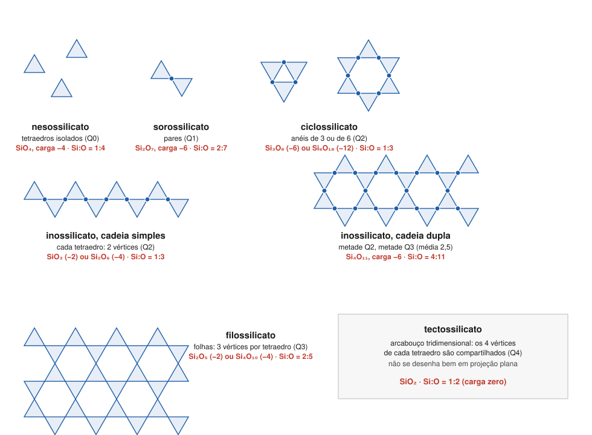

# Aula 02: Polimerização — de tetraedros isolados a arcabouços

**ID:** mineralogia-m11-a02
**Módulo:** [[11-estrutura-dos-silicatos-modulo|Módulo 11 — Arquitetura dos silicatos]]
**Duração estimada:** ~30 min
**Nível:** ensino médio, sem geologia prévia (contrato `ensino-medio-sem-geologia-v1`)
**Objetivo:** classificar um silicato em neso-, soro-, ciclo-, ino- (cadeia simples ou dupla), filo- ou tectossilicato pelo número de oxigênios que cada tetraedro compartilha, calcular a razão Si:O e a carga de cada unidade, e reconhecer a classe a partir da fórmula. Os silicatos com Al nos tetraedros ficam para a aula 03.
**Pré-requisito:** [[11-estrutura-dos-silicatos-aula-01-o-tetraedro-sio4-e-a-ligacao-si-o|Aula 01]] (oxigênio ponte; Qⁿ).

## Vocabulário desta aula

| Termo | O que quer dizer |
|---|---|
| **neso-** | do grego "ilha": tetraedros isolados. |
| **soro-** | "grupo": pares de tetraedros. |
| **ciclo-** | "anel": anéis fechados de tetraedros. |
| **ino-** | "fio": cadeias infinitas, simples ou duplas. |
| **filo-** | "folha": folhas infinitas. |
| **tecto-** | "construção": arcabouço tridimensional. |
| **unidade silicática** | a parte da fórmula feita só de Si e dos O ligados a Si, como SiO₄, Si₂O₇ ou Si₄O₁₀. |
| **razão Si:O** | número de Si para cada O dentro da unidade silicática. |

## Antes de começar, você precisa saber

- Que cada O ponte é dividido entre dois tetraedros e que os tetraedros só dividem vértices ([[11-estrutura-dos-silicatos-aula-01-o-tetraedro-sio4-e-a-ligacao-si-o|aula 01]]).
- Neutralidade de carga de uma fórmula ([[01-fundamentos-quimicos-aula-03-ions-e-estados-de-oxidacao-fe-mn-e-s|módulo 01, aula 03]]).

## Ao final você vai conseguir

- `mineralogia-m11-oa02` — Classificar um silicato em neso-, soro-, ciclo-, ino-, filo- ou tectossilicato pela razão Si:O e pelo número de oxigênios compartilhados.

## Conteúdo

### Uma conta só

Cada tetraedro tem 4 O. Os que não são compartilhados pertencem só a ele; cada O ponte é dividido com um vizinho e conta **meio**. Se um tetraedro compartilha n vértices:

**O por Si = (4 − n) + n/2 = 4 − n/2**

Com n = 0, 1, 2, 3, 4, isso dá 4, 3½, 3, 2½ e 2 oxigênios por Si. As classes dos silicatos são exatamente esses degraus.

*Figura 2. Projeções esquemáticas, vistas de cima: cada triângulo é um tetraedro; o ponto azul marca um O ponte. O que observar: de uma classe para a seguinte, cresce o número de vértices compartilhados e cai o número de O por Si.*

### As seis classes

| Classe | Vértices por tetraedro (n) | Unidade e carga | Si:O | Exemplo (cátions e NC) |
|---|---|---|---|---|
| **neso** | 0 (Q⁰) | SiO₄, −4 | 1:4 | forsterita Mg₂SiO₄ (Mg VI); zircão ZrSiO₄ (Zr VIII) |
| **soro** | 1 (Q¹) | Si₂O₇, −6 | 2:7 | hemimorfita Zn₄Si₂O₇(OH)₂·H₂O (Zn IV) |
| **ciclo** | 2 (Q²), em anel | Si₃O₉, −6; Si₆O₁₈, −12 | 1:3 | berilo Be₃Al₂Si₆O₁₈ (Be IV, Al VI) |
| **ino, cadeia simples** | 2 (Q²), em cadeia | SiO₃, −2 (ou Si₂O₆, −4) | 1:3 | diopsídio CaMgSi₂O₆ (Mg VI, Ca VIII) |
| **ino, cadeia dupla** | metade 2, metade 3 (média 2,5) | Si₄O₁₁, −6 | 4:11 | tremolita Ca₂Mg₅Si₈O₂₂(OH)₂ (Mg VI, Ca VIII) |
| **filo** | 3 (Q³) | Si₂O₅, −2 (ou Si₄O₁₀, −4) | 2:5 | talco Mg₃Si₄O₁₀(OH)₂ (Mg VI) |
| **tecto** | 4 (Q⁴) | SiO₂, 0 | 1:2 | quartzo SiO₂ |

Três observações sobre a tabela:

- **Anel e cadeia simples têm a mesma razão** (1:3), porque nos dois cada tetraedro divide 2 vértices. O que os separa é a **topologia** (quem está ligado a quem, módulo 10, aula 01): o anel fecha; a cadeia continua indefinidamente. Os anéis comuns são de 3 tetraedros (Si₃O₉, como na benitoíta, BaTiSi₃O₉) ou de 6 (Si₆O₁₈, como no berilo e na turmalina).
- **A cadeia dupla é a única com valor "quebrado"** de n: são duas cadeias simples ligadas lado a lado, e só metade dos tetraedros divide um terceiro vértice com a cadeia vizinha. Conta: na unidade Si₄O₁₁, 2 tetraedros dividem 2 vértices e 2 dividem 3; média (2 × 2 + 2 × 3)/4 = 2,5 → 4 − 2,5/2 = 2,75 O por Si = 11/4.
- **A carga cai com a polimerização.** Mais O ponte significa menos O não ponte para os outros cátions neutralizarem. No arcabouço de SiO₂, não sobra carga nenhuma: o quartzo não precisa de outro cátion.

> [!question] Pare e explique
> O diopsídio (CaMgSi₂O₆) e o berilo (Be₃Al₂Si₆O₁₈) têm a mesma razão Si:O. O que, então, os coloca em classes diferentes?

### Como ler a classe numa fórmula

A razão Si:O só vale **dentro da unidade silicática**. Muitas fórmulas têm oxigênios que não estão ligados a Si: hidroxilas (OH), água (H₂O) ou O ligados só a outros cátions. Receita:

1. **Separe** os O que não pertencem à unidade silicática (OH, H₂O, O "extras");
2. **conte** Si e O da unidade e simplifique a razão;
3. **compare** com a tabela;
4. **confira a carga**: a soma das cargas da fórmula inteira deve dar zero.

Dois casos que pedem atenção:

- **Unidades mistas.** O epidoto, Ca₂Al₂Fe³⁺(SiO₄)(Si₂O₇)O(OH), tem tetraedros isolados **e** pares. As classificações o põem entre os sorossilicatos, mas a fórmula mostra as duas unidades.
- **O extra.** A titanita, CaTiSiO₅, tem SiO₄ mais um O ligado só a Ca e Ti: é nesossilicato (módulo 02, aula 05), não um silicato de razão 1:5.

## Exemplo trabalhado

**Problema.** Classifique e confira a carga: (a) hemimorfita, Zn₄Si₂O₇(OH)₂·H₂O; (b) tremolita, Ca₂Mg₅Si₈O₂₂(OH)₂; (c) caulinita, Al₂Si₂O₅(OH)₄; (d) wollastonita, CaSiO₃; (e) cianita, Al₂SiO₅.

**(a)** Separe (OH)₂ e H₂O. Unidade Si₂O₇: **2:7 → sorossilicato**. Carga: Zn₄ (+8) + Si₂O₇ (−6) + (OH)₂ (−2) = 0 ✔.

**(b)** Separe (OH)₂. Si₈O₂₂ = 2 × Si₄O₁₁: **4:11 → inossilicato de cadeia dupla** (um anfibólio). Carga: Ca₂ (+4) + Mg₅ (+10) + Si₈O₂₂ (2 × −6 = −12) + (OH)₂ (−2) = 0 ✔.

**(c)** Separe (OH)₄. Si₂O₅: **2:5 → filossilicato**. Carga: Al₂ (+6) + Si₂O₅ (−2) + (OH)₄ (−4) = 0 ✔.

**(d)** SiO₃: **1:3**. Anel ou cadeia? A fórmula sozinha não decide; é preciso saber a estrutura. Na wollastonita, os tetraedros formam **cadeias** simples: inossilicato (um piroxenoide, isto é, um silicato de cadeia simples que não é piroxênio; aula 05 e módulo 34). Carga: Ca (+2) + SiO₃ (−2) = 0 ✔.

**(e)** Os 5 O não estão todos ligados a Si: a unidade é SiO₄, e o quinto O fica só entre os Al. **Nesossilicato** (o grupo dos polimorfos de Al₂SiO₅ do módulo 10). Carga: Al₂ (+6) + SiO₄ (−4) + O (−2) = 0 ✔.

**Método geral:** separe os O fora da unidade, simplifique Si:O, compare com a tabela; se der 1:3, a estrutura decide entre anel e cadeia; feche com a carga.

## Erros comuns

- **Calcular Si:O com todos os O da fórmula.** O (OH)₂ do talco, se contado, levaria a Si₄O₁₂ = 1:3 e a um "inossilicato" que não existe.
- **Achar que a razão 1:3 basta para classificar.** Anel e cadeia simples têm a mesma razão.
- **Esquecer que a cadeia dupla é Si₄O₁₁** e escrevê-la como Si₂O₆ duplicado. A ligação entre as duas cadeias consome O.
- **Achar que "tecto" quer dizer "sem outros cátions".** O quartzo não tem, mas os feldspatos têm, por causa do Al nos tetraedros (aula 03).

## O que não concluir

- Que toda fórmula traga a unidade escrita em evidência. Muitas vezes é preciso reescrevê-la (Si₈O₂₂ → 2 Si₄O₁₁).
- Que a classe estrutural seja sempre a classe de catálogo. O quartzo é tectossilicato pela estrutura, mas Nickel-Strunz o coloca entre os óxidos (módulo 02, aula 05).
- Que a razão Si:O funcione igual quando há Al nos tetraedros. Aí é preciso contar Si + Al tetraédrico (aula 03).

## Recap relâmpago

- O por Si = 4 − n/2 (n = vértices compartilhados por tetraedro).
- Neso SiO₄ (−4, 1:4); soro Si₂O₇ (−6, 2:7); ciclo Si₃O₉ (−6) ou Si₆O₁₈ (−12), 1:3; ino simples SiO₃ (−2) ou Si₂O₆ (−4), 1:3; ino dupla Si₄O₁₁ (−6, 4:11); filo Si₂O₅ (−2) ou Si₄O₁₀ (−4), 2:5; tecto SiO₂ (0, 1:2).
- Anel × cadeia simples: mesma razão, topologia diferente.
- Na fórmula, conte só os O da unidade (fora OH, H₂O e O extras) e feche com a carga.

## Próxima aula

Em [[11-estrutura-dos-silicatos-aula-03-substituicao-al-si-e-cations-de-compensacao|Aula 03 — Substituição Al↔Si e cátions de compensação]], o Al entra nos tetraedros, a carga da unidade muda e a contagem passa a ser de Si + Al.

## Fontes consultadas

- Klein & Dutrow, *Manual of Mineral Science*, 23ª ed., e Nesse, *Introduction to Mineralogy* (classes estruturais dos silicatos; unidades aniônicas; exemplos).
- Fórmulas e coordenações dos exemplos: forsterita e zircão (módulo 08, aulas 02 e 06); diopsídio (módulo 06; sítios M1 e M2 no módulo 09, aula 05); berilo (módulo 09, aula 02); tremolita (*Handbook of Mineralogy*, Ca₂(Mg,Fe²⁺)₅Si₈O₂₂(OH)₂, conferido por busca em 2026-10-06); hemimorfita, caulinita, talco, wollastonita, benitoíta e epidoto (Mindat e *Handbook of Mineralogy*, por busca); titanita (módulo 02, aula 05); cianita (módulo 10, aula 01).
- Razões, cargas e a média de 2,5 vértices da cadeia dupla calculadas em Python em 2026-10-06 (todas as fórmulas do quadro e do exemplo com carga zero).

<!--
nivel: ensino-medio-sem-geologia-v1
palavras_corpo: 1097
cobertura:
  mineralogia-m11-oa02: [Conteúdo, Exemplo trabalhado]
figuras:
  - 11-estrutura-dos-silicatos-fig-02-polimerizacao.svg
alegacoes_auditaveis:
  - claim_id: CRQ-POLIM-REGRA-001
    claim: "O por Si = 4 - n/2, com n vertices compartilhados por tetraedro: 4; 3,5; 3; 2,5; 2."
    risk: numero
    source: "calculo; Klein & Dutrow"
    audit: "verificado em 2026-10-06 (calculo em Python)"
  - claim_id: CRQ-POLIM-CLASSES-001
    claim: "Neso SiO4 -4 1:4; soro Si2O7 -6 2:7; ciclo Si3O9 -6 / Si6O18 -12 1:3; ino simples SiO3 -2 / Si2O6 -4 1:3; ino dupla Si4O11 -6 4:11 (metade dos tetraedros com 2 vertices, metade com 3, media 2,5); filo Si2O5 -2 / Si4O10 -4 2:5; tecto SiO2 0 1:2."
    risk: numero
    source: "Klein & Dutrow; calculo em Python"
    audit: "verificado em 2026-10-06 (calculo em Python: razoes, cargas e media 2,5 da cadeia dupla)"
  - claim_id: CRQ-POLIM-EXEMPLOS-001
    claim: "Forsterita Mg2SiO4 (Mg VI); zircao ZrSiO4 (Zr VIII); hemimorfita Zn4Si2O7(OH)2.H2O (Zn IV); berilo Be3Al2Si6O18 (Be IV, Al VI); diopsidio CaMgSi2O6 (Mg VI, Ca VIII); tremolita Ca2Mg5Si8O22(OH)2 (Mg VI, Ca VIII); talco Mg3Si4O10(OH)2 (Mg VI); quartzo SiO2."
    risk: fato
    source: "Handbook of Mineralogy; Mindat (busca); modulos 08 e 09"
    audit: "verificado em 2026-10-06 (busca: HoM tremolita; Mindat hemimorfita Zn IV; modulos 08 e 09)"
  - claim_id: CRQ-POLIM-ANEIS-001
    claim: "Aneis comuns de 3 (Si3O9, benitoita BaTiSi3O9) e de 6 tetraedros (Si6O18, berilo, turmalina)."
    risk: fato
    source: "Klein & Dutrow; Mindat (busca)"
    audit: "verificado em 2026-10-06 (busca: benitoita BaTiSi3O9; berilo e turmalina Si6O18)"
  - claim_id: CRQ-POLIM-MISTOS-001
    claim: "Epidoto Ca2Al2Fe3+(SiO4)(Si2O7)O(OH) tem SiO4 e Si2O7 e e classificado entre os sorossilicatos; titanita CaTiSiO5 e nesossilicato (SiO4 + O extra)."
    risk: fato
    source: "Nickel-Strunz 9.B (epidoto); modulo 02 aula 05 (titanita)"
    audit: "verificado em 2026-10-06 (busca: epidoto em 9.BG; titanita modulo 02)"
  - claim_id: CRQ-POLIM-WOLL-001
    claim: "Wollastonita CaSiO3: cadeia simples (piroxenoide)."
    risk: fato
    source: "Klein & Dutrow; LibreTexts (Perkins)"
    audit: "verificado em 2026-10-06 (busca: LibreTexts/Perkins, wollastonita cadeia de repeticao 3)"
  - claim_id: CRQ-POLIM-CARGAS-001
    claim: "Cargas dos exemplos (hemimorfita, tremolita, caulinita, wollastonita, cianita) fecham em zero."
    risk: numero
    source: "calculo em Python"
    audit: "verificado em 2026-10-06 (calculo em Python)"
-->
