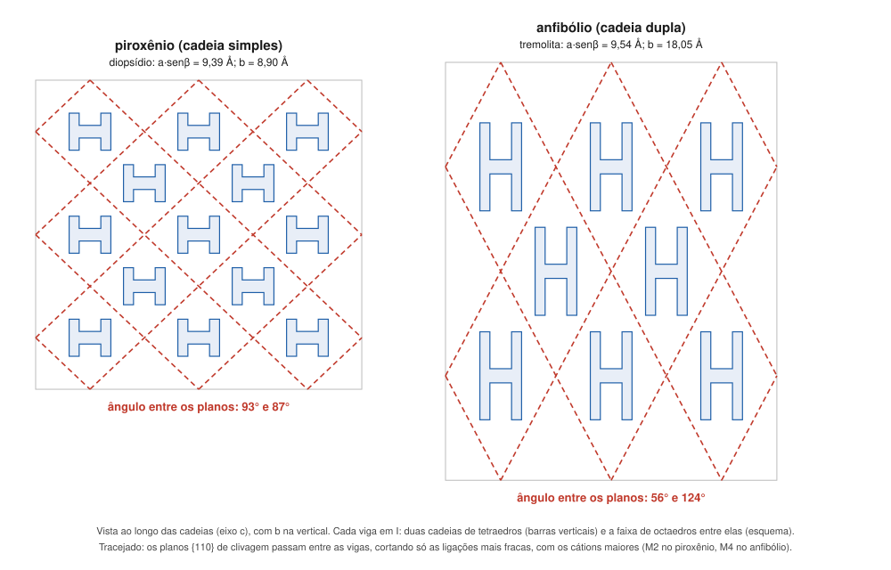

# Aula 04: Da estrutura à propriedade — clivagem, hábito, densidade e ordem de cristalização

**ID:** mineralogia-m11-a04
**Módulo:** [[11-estrutura-dos-silicatos-modulo|Módulo 11 — Arquitetura dos silicatos]]
**Duração estimada:** ~30 min
**Nível:** ensino médio, sem geologia prévia (contrato `ensino-medio-sem-geologia-v1`)
**Objetivo:** prever clivagem, hábito, densidade relativa e ordem de cristalização de um silicato a partir da sua classe estrutural, e calcular os ângulos de clivagem de piroxênios e anfibólios a partir da cela.
**Pré-requisito:** [[11-estrutura-dos-silicatos-aula-02-polimerizacao-de-tetraedros-isolados-a-arcaboucos|Aula 02]] (as classes) e [[01-fundamentos-quimicos-aula-05-ligacoes-fracas-e-minerais-com-mais-de-uma-ligacao|módulo 01, aula 05]] (clivagem pelo plano de ligação mais fraca).

## Vocabulário desta aula

| Termo | O que quer dizer |
|---|---|
| **clivagem** | tendência de um cristal a se partir em planos lisos, sempre nas mesmas direções (módulo 01, aula 05; formalizada no módulo 13). |
| **hábito** | forma externa típica dos cristais de um mineral: equidimensional, prismático, acicular (em agulhas), fibroso, placoide (em placas). |
| **viga em I** | nos piroxênios e anfibólios, a unidade formada por duas cadeias de tetraedros, com as pontas voltadas uma para a outra, e a faixa de octaedros entre elas; vista de topo, lembra a letra I. |
| **{110}** | a família de planos (110) e (1̄10), em notação de Miller (módulo 05). |
| **série de Bowen** | ordem em que os minerais costumam cristalizar de um magma basáltico que esfria (módulo 38; curso-geologia, módulo 06, citado por nome). |

## Antes de começar, você precisa saber

- Índices de Miller e cela monoclínica, com o diopsídio: a = 9,746 Å, b = 8,899 Å, β = 105,63° ([[05-miller-e-projecao-aula-01-eixos-cristalograficos-e-parametros-de-cela-por-sistema|módulo 05, aula 01]]).
- **Matemática reativada:** num triângulo retângulo, tangente = cateto oposto / cateto adjacente; o ângulo sai da tecla tan⁻¹ (arctan) da calculadora.

## Ao final você vai conseguir

- `mineralogia-m11-oa04` — Prever propriedades (clivagem, hábito, densidade, ordem de cristalização) a partir do grau de polimerização.

## Conteúdo

### A regra de fundo

O módulo 01 deu a regra: um cristal se parte onde as ligações são mais fracas. Nos silicatos, as ligações mais fortes são as **Si–O** dentro das unidades silicáticas; as mais fracas, em geral, são as dos cátions grandes e de carga baixa (K, Na, Ca) e, quando existem, as de van der Waals. Logo: **a clivagem tende a passar entre as unidades silicáticas, sem cortá-las**. Como cada classe tem unidades de formato diferente, cada classe tem um padrão.

### Neso: sem direção preferida

Os tetraedros isolados se ligam por cátions em todas as direções; não há plano que evite cortar ligações fortes. A clivagem é **ausente ou pobre** (granada: nenhuma; olivina: pobre) e o hábito tende a ser **equidimensional** (os cristais de granada e de olivina). A tendência tem exceções: o zircão é nesossilicato e forma prismas.

### Ino: cadeias, prismas e duas clivagens

As cadeias correm ao longo do eixo c. O cristal cresce mais facilmente ao longo delas: **hábito prismático, acicular ou fibroso** (alguns anfibólios crescem em fibras, que estão entre os minerais chamados de asbesto; a crisotila, uma serpentina, é outro deles). Vistas de topo, as cadeias estão empacotadas em **vigas em I**: duas cadeias com a faixa de octaedros entre elas. As ligações fortes ficam dentro das vigas; entre uma viga e outra estão os sítios de cátions maiores (M2 no piroxênio; M4 e o sítio A, muitas vezes vazio, no anfibólio; módulos 09 e 34), de ligações mais fracas. As clivagens passam **entre as vigas**, ao longo dos planos {110}, paralelos às cadeias.

*Figura 3. Vigas em I de um piroxênio e de um anfibólio, desenhadas na escala das celas do diopsídio e da tremolita. O que observar: a viga do anfibólio é duas vezes mais larga ao longo de b, e por isso os planos de clivagem, que contornam as vigas, se cruzam em ângulos muito diferentes.*

O resultado é a ferramenta mais usada para distinguir os dois grupos em campo e ao microscópio:

| Grupo | Cadeia | Ângulos entre as clivagens |
|---|---|---|
| piroxênios | simples | ~87° e ~93° |
| anfibólios | dupla | ~56° e ~124° |

### Filo: uma clivagem perfeita

As folhas são fortes em duas direções e fracas na terceira (van der Waals no talco; K⁺ nas micas, módulo 01). Resultado: **uma clivagem basal perfeita** {001}, hábito **placoide ou em lâminas**, dureza baixa paralela às lâminas (talco 1; micas 2 a 2,5).

### Tecto: forte em tudo, ou quase

No quartzo, o arcabouço de Si–O é forte nas três direções: **não há clivagem**; ele se parte em fratura conchoidal e tem dureza 7. Os feldspatos têm Al e cátions de compensação no arcabouço, e ele tem direções em que há menos ligações a romper: duas clivagens boas, a cerca de 90° (detalhe no módulo 36).

> [!question] Pare e explique
> Talco e quartzo são feitos quase só de tetraedros de Si–O e de ligações fortes. Por que um tem dureza 1 e o outro, 7?

### Densidade: o arcabouço é mais aberto

Comparando silicatos de **cátions parecidos**, a densidade cai com a polimerização, porque arcabouços e folhas deixam mais espaço vazio:

| Mineral (Mg ou Mg-Ca) | Classe | Densidade (g/cm³) |
|---|---|---|
| forsterita Mg₂SiO₄ | neso | ~3,28 |
| enstatita Mg₂Si₂O₆ | ino | ~3,19 |
| talco Mg₃Si₄O₁₀(OH)₂ | filo | ~2,7–2,8 |
| quartzo SiO₂ | tecto | 2,65 |

Os feldspatos (ortoclásio ~2,56; albita ~2,62) também são leves. Mas a regra só vale com cátions parecidos: o **zircão** (ZrSiO₄, nesossilicato) tem ~4,6–4,7 g/cm³ por causa do Zr, que é pesado.

### Ordem de cristalização

Quando um magma basáltico esfria, os minerais ferromagnesianos tendem a aparecer numa ordem conhecida, a **série descontínua de Bowen**: olivina → piroxênio → anfibólio → biotita, seguidos, no fim, por feldspato potássico, muscovita e quartzo. Leia-a com a tabela da aula 02: **neso → ino simples → ino dupla → filo → tecto**. A polimerização cresce à medida que a temperatura cai e o líquido que sobra fica mais rico em sílica. É uma correlação útil, não uma lei: o **plagioclásio**, um tectossilicato, cristaliza desde o início, numa série contínua paralela, e a ordem real depende da composição do magma (módulo 38).

## Exemplo trabalhado

**Problema.** Calcule os ângulos entre as clivagens {110} (a) do diopsídio (a = 9,746 Å, b = 8,899 Å, β = 105,63°) e (b) da tremolita (a = 9,863 Å, b = 18,048 Å, β ≈ 104,8°). (c) Um grão prismático tem duas clivagens a ~56°. Que classe e que grupo?

**Raciocínio.** Os planos {110} contêm o eixo c. Olhando ao longo de c, o eixo a aparece encurtado para a·senβ, perpendicular a b. O plano (110) corta os dois eixos na distância de uma cela; o ângulo entre (110) e (1̄10) é então **2 × arctan(a·senβ / b)**, e o outro ângulo é o suplemento.

**(a)** a·senβ = 9,746 × sen 105,63° = 9,385 Å. 9,385 / 8,899 = 1,055 → arctan = 46,5° → 2 × 46,5 = **93,0°**; suplemento **87,0°**.

**(b)** a·senβ = 9,863 × sen 104,8° = 9,535 Å. 9,535 / 18,048 = 0,528 → arctan = 27,9° → **55,7°**; suplemento **124,3°**.

**(c)** Prismático + duas clivagens a ~56°: **inossilicato de cadeia dupla, um anfibólio**. A cela dobra ao longo de b porque a cadeia dupla é duas vezes mais larga, e é isso que fecha o ângulo.

**Método geral:** classe estrutural → onde estão as ligações fracas → planos que evitam cortar as unidades → clivagem e hábito; densidade só entre minerais de cátions parecidos.

## Erros comuns

- **Achar que todo nesossilicato é denso e todo tectossilicato é leve.** O zircão é neso e pesado; a regra vale com cátions parecidos.
- **Confundir as faces do prisma com as clivagens.** As duas podem ser paralelas a {110}, mas a clivagem aparece ao quebrar o cristal, repetida em planos paralelos (módulo 13).
- **Decorar 87° e 56° sem a razão.** Os ângulos saem da largura da viga, isto é, de b; a conta mostra por quê.
- **Tomar a série de Bowen como sequência obrigatória.** É uma tendência de magmas basálticos; o plagioclásio fura a "regra" da polimerização.

## O que não concluir

- Que a classe estrutural sozinha dê a dureza. O talco (filo) tem 1, as micas (também filo) 2 a 2,5, e a diferença vem do que une as folhas.
- Que todo tectossilicato não tenha clivagem. Os feldspatos têm duas.
- Que o ângulo de clivagem identifique a espécie. Ele separa piroxênio de anfibólio; a espécie exige química e óptica (módulos 16 e 34).

## Recap relâmpago

- A clivagem passa entre as unidades silicáticas, pelas ligações mais fracas.
- Neso: clivagem pobre ou ausente, hábito equidimensional (exceção: zircão prismático). Ino: prismas, fibras; {110} a ~87°/93° (piroxênio) e ~56°/124° (anfibólio), pelas vigas em I. Filo: clivagem basal perfeita {001}, placas. Tecto: quartzo sem clivagem; feldspatos com duas a ~90°.
- Ângulo {110} = 2 × arctan(a·senβ / b): diopsídio 93,0°/87,0°; tremolita 55,7°/124,3°.
- Densidade cai com a polimerização se os cátions forem parecidos: forsterita ~3,28 > enstatita ~3,19 > talco ~2,7–2,8 > quartzo 2,65; zircão (~4,6–4,7) mostra o peso do cátion.
- Bowen: olivina → piroxênio → anfibólio → biotita → (feldspato K, muscovita, quartzo) acompanha a polimerização; o plagioclásio corre em paralelo.

## Próxima aula

Em [[11-estrutura-dos-silicatos-aula-05-panorama-dos-silicatos-formadores-de-rocha-o-mapa-do-bloco-de-sistematica|Aula 05 — Panorama dos silicatos formadores de rocha]], o mapa que liga cada classe aos módulos 33 a 36 e a nomenclatura de Liebau.

## Fontes consultadas

- Klein & Dutrow, *Manual of Mineral Science*, 23ª ed., e Nesse, *Introduction to Mineralogy* (clivagem e hábito por classe; vigas em I; sítios M2 e M4).
- Clivagens de piroxênios (~87°/93°) e anfibólios (~56°/124°), vigas em I — conferido por busca em 2026-10-06 (Open University, *Introduction to minerals and rocks under the microscope*, 3.4.2; University of Minnesota, *Common Minerals*).
- Celas: diopsídio (módulo 05, aula 01; *Handbook of Mineralogy*); tremolita a = 9,863, b = 18,048, c = 5,285 Å (*Handbook of Mineralogy*) e β ≈ 104,8–104,95° (Mindat), por busca. Ângulos calculados em Python: 2·arctan(a·senβ/b) = 93,0° (diopsídio) e 55,7° (tremolita; 55,6° com β = 104,95°).
- Densidades: forsterita 3,275 e enstatita (Mg, calculada) 3,189 (*Handbook of Mineralogy*); talco ~2,7–2,8; ortoclásio ~2,56; albita ~2,62 (por busca); quartzo 2,65 (módulo 06); zircão ~4,6–4,7 (módulo 10, aula 04).
- Série de Bowen e polimerização crescente (olivina, piroxênio, anfibólio, biotita) — conferido por busca (Britannica, *Bowen's reaction series*; Earle, *Physical Geology*, 3.3).
- Durezas de talco, micas e quartzo: módulo 01, aulas 04 e 05.
- Asbesto como nome comercial de minerais fibrosos, anfibólios e crisotila (serpentina): Klein & Dutrow; sítios entre as vigas (M2; M4 e A): Klein & Dutrow, Nesse.

<!--
nivel: ensino-medio-sem-geologia-v1
palavras_corpo: 1231
cobertura:
  mineralogia-m11-oa04: [Conteúdo, Exemplo trabalhado]
figuras:
  - 11-estrutura-dos-silicatos-fig-03-vigas-em-i-e-clivagem.svg
alegacoes_auditaveis:
  - claim_id: CRQ-PROP-REGRA-001
    claim: "A clivagem tende a passar entre as unidades silicaticas, pelas ligacoes mais fracas (cations grandes de carga baixa; van der Waals)."
    risk: conceito
    source: "Klein & Dutrow; modulo 01 aula 05"
    audit: "verificado em 2026-10-06 (Klein & Dutrow; modulo 01 aula 05)"
  - claim_id: CRQ-PROP-NESO-001
    claim: "Nesossilicatos: clivagem ausente ou pobre (granada nenhuma, olivina pobre), habito equidimensional; zircao e excecao prismatica."
    risk: fato
    source: "Klein & Dutrow; Handbook of Mineralogy"
    audit: "verificado em 2026-10-06 (Klein & Dutrow; HoM)"
  - claim_id: CRQ-PROP-INO-001
    claim: "Inossilicatos: cadeias ao longo de c, habito prismatico/acicular/fibroso (asbesto: alguns anfibolios; tambem crisotila, serpentina); vigas em I; clivagem {110} entre as vigas, pelos sitios M2 (piroxenio) e M4 e A (anfibolio); piroxenios ~87/93 graus, anfibolios ~56/124 graus."
    risk: numero
    source: "busca (Open University; U. Minnesota); Klein & Dutrow"
    audit: "corrigido em 2026-10-06 (achado 2: asbesto inclui crisotila; sitio A do anfibolio acrescentado; angulos conferidos por busca)"
  - claim_id: CRQ-PROP-ANGULO-001
    claim: "Angulo entre (110) e (1-10) = 2 arctan(a senB / b): diopsidio (9,746; 8,899; 105,63) 93,0/87,0; tremolita (9,863; 18,048; ~104,8) 55,7/124,3."
    risk: numero
    source: "calculo em Python; HoM; Mindat; modulo 05"
    audit: "verificado em 2026-10-06 (calculo em Python com HoM/Mindat/modulo 05: 93,0/87,0 e 55,7/124,3)"
  - claim_id: CRQ-PROP-FILO-001
    claim: "Filossilicatos: clivagem basal perfeita {001}, habito placoide; talco dureza 1, micas 2-2,5."
    risk: fato
    source: "modulo 01 aula 05; HoM"
    audit: "verificado em 2026-10-06 (modulo 01 aula 05)"
  - claim_id: CRQ-PROP-TECTO-001
    claim: "Quartzo sem clivagem, fratura conchoidal, dureza 7; feldspatos com duas clivagens boas a cerca de 90 graus."
    risk: fato
    source: "Klein & Dutrow; modulo 01"
    audit: "verificado em 2026-10-06 (Klein & Dutrow; modulo 01)"
  - claim_id: CRQ-PROP-DENS-001
    claim: "Densidades: forsterita ~3,28 (HoM 3,275); enstatita Mg ~3,19 (calc 3,189); talco ~2,7-2,8; quartzo 2,65; ortoclasio ~2,56; albita ~2,62; zircao ~4,6-4,7."
    risk: numero
    source: "Handbook of Mineralogy (busca); modulos 06 e 10"
    audit: "verificado em 2026-10-06 (busca: HoM forsterita 3,275 e enstatita calc 3,189; demais por busca)"
  - claim_id: CRQ-PROP-BOWEN-001
    claim: "Serie descontinua de Bowen: olivina -> piroxenio -> anfibolio -> biotita, depois feldspato K, muscovita, quartzo; acompanha polimerizacao crescente; plagioclasio (tecto) em serie continua paralela desde o inicio."
    risk: conceito
    source: "Britannica; Earle, Physical Geology (busca)"
    audit: "verificado em 2026-10-06 (busca: Britannica; Earle)"
-->
