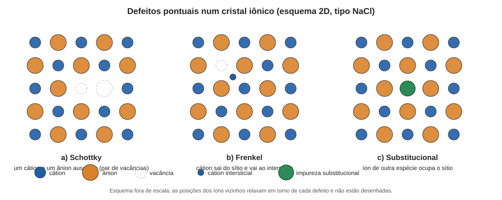

# Aula 01: Defeitos pontuais e o que eles fazem

**ID:** mineralogia-m12-a01
**Módulo:** [[12-defeitos-e-maclas-modulo|Módulo 12 — Defeitos cristalinos e maclas]]
**Duração estimada:** ~30 min
**Nível:** ensino médio, sem geologia prévia (contrato `ensino-medio-sem-geologia-v1`)
**Objetivo:** classificar os defeitos pontuais de um cristal (vacância, intersticial, Schottky, Frenkel, substitucional), conferir que cada um respeita a neutralidade de carga e relacioná-los à difusão, à cor e à condutividade.
**Pré-requisito:** [[09-substituicao-e-formula-aula-02-mecanismos-de-substituicao-e-vetores-de-troca|módulo 09, aula 02]] (substituição acoplada e balanço de carga) e [[08-empacotamento-e-coordenacao-aula-06-estruturas-tipo-halita-fluorita-rutilo-corindo-espinelio-perovskita-e-esfalerita|módulo 08, aula 06]] (as estruturas da halita e da fluorita).

## Vocabulário desta aula

| Termo | O que quer dizer |
|---|---|
| **defeito pontual** | imperfeição que envolve um sítio (ou um par de sítios vizinhos) da estrutura; tem "dimensão zero". |
| **vacância** | sítio da estrutura que deveria ter um átomo ou íon e está vazio. |
| **intersticial** | átomo ou íon alojado num vazio que, na estrutura ideal, não é um sítio ocupado. |
| **defeito de Schottky** | par (ou grupo) de vacâncias de cátion e de ânion, na proporção que mantém o cristal neutro. |
| **defeito de Frenkel** | uma vacância e um intersticial do mesmo íon: o íon saiu do sítio e foi para um vazio vizinho. |
| **defeito substitucional** | íon de outra espécie ocupando um sítio regular (é o que o módulo 09 chamou de substituição). |
| **defeito intrínseco / extrínseco** | intrínseco: existe mesmo no cristal quimicamente puro; extrínseco: exige impureza. |
| **difusão** | migração de átomos ou íons através do cristal, passo a passo, de sítio em sítio. |
| **centro de cor** | defeito que absorve luz visível e, por isso, dá cor a um cristal que seria incolor. |

## Antes de começar, você precisa saber

- Que um cristal ideal tem cada sítio ocupado pelo íon certo e é eletricamente neutro (módulo 08).
- Que a substituição Ca²⁺ ↔ Na⁺ exige um acompanhante para fechar a carga (substituição acoplada, módulo 09).
- Que no NaCl (halita) cada Na⁺ tem 6 Cl⁻ vizinhos, e que na fluorita (CaF₂) os F⁻ ocupam os centros dos oito cubos menores da cela de Ca²⁺ (todos os vazios tetraédricos); vistos os F⁻ como uma rede de cubos, metade desses cubos de 8 F⁻ tem um Ca²⁺ no centro e a outra metade tem o centro vazio (módulo 08).

## Ao final você vai conseguir

- `mineralogia-m12-oa01` — Classificar defeitos pontuais (vacância, intersticial, Schottky, Frenkel, substitucional) e relacioná-los a difusão, cor e condutividade.

## Conteúdo

### O cristal real tem defeitos, e isso não é falha de fabricação

Todo o curso até aqui desenhou cristais ideais: cada sítio no lugar, cada íon da espécie certa. Um cristal real nunca é assim. Mesmo um cristal natural perfeitamente puro e crescido devagar tem, em equilíbrio, uma pequena fração de sítios vazios. A razão é termodinâmica: tirar um átomo do lugar custa energia (rompe ligações), mas deixa a estrutura mais "desordenada", e a temperatura acima do zero absoluto sempre favorece algum grau de desordem (módulo 10, aula 02, para a mesma ideia aplicada a cátions trocando de sítio).

A fração de sítios com um tipo de defeito em equilíbrio segue uma lei exponencial:

**n / N ≈ exp(−E / kT)**

em que exp(x) é o número e ≈ 2,718 elevado a x, **E** é a energia para criar um defeito (em elétron-volts, eV, uma unidade de energia), **k** é a constante de Boltzmann (8,617 × 10⁻⁵ eV/K) e **T** a temperatura em kelvin. (Quando o defeito só pode nascer em par, como o par de vacâncias de Schottky, e E é a energia do par, o expoente fica −E/2kT.) O que importa é a forma: a concentração de defeitos **cresce muito rápido com a temperatura**.

### Os defeitos pontuais, um a um

A figura mostra três casos num cristal iônico esquematizado em 2D.

*Legenda: em (a), um par Na⁺/Cl⁻ ausente; em (b), um cátion deslocado para o interstício, deixando uma vacância; em (c), um íon de outra espécie no sítio. Os círculos tracejados são vacâncias.*

**Vacância.** Um sítio vazio. É o defeito mais simples e o mais importante para a difusão.

**Intersticial.** Um átomo num vazio da estrutura. Um íon da própria espécie nesse vazio é um *autointersticial*; um íon de outro elemento é um intersticial de impureza. Nos silicatos e óxidos de empacotamento denso (módulo 08, aula 03), os interstícios existem, mas são pequenos; só íons pequenos (como H⁺ ou Li⁺) tendem a ocupá-los com facilidade.

**Schottky.** Num cristal iônico, tirar só um cátion deixaria o cristal com carga negativa; então os defeitos de Schottky vêm em **grupos que somam carga zero**. No NaCl: uma vacância de Na⁺ **e** uma de Cl⁻ (1:1). Na fluorita, CaF₂: uma vacância de Ca²⁺ e **duas** de F⁻ (1:2), porque a fórmula tem 1 Ca para 2 F. Os átomos "retirados" não somem: vão para a superfície ou para um contorno, onde completam uma camada nova.

**Frenkel.** O íon sai do sítio e vai para um intersticial próximo, de modo que há **uma vacância e um intersticial do mesmo íon**, e a carga total não muda. Aparece quando o íon é pequeno e há espaço vazio: cátions pequenos em haletos de prata (AgCl, AgBr) e, na fluorita, o F⁻ indo para o centro de um dos cubos vazios (um defeito de Frenkel *de ânion*).

**Substitucional.** O íon de outra espécie ocupando o sítio regular. É a mesma substituição do módulo 09, vista agora como defeito, e vale a mesma regra de carga: se o íon que entra tem carga diferente (*heterovalente*), algo precisa compensar, e o compensador pode ser outro defeito pontual. Exemplo clássico: Ca²⁺ entrando no lugar de Na⁺ na halita. O Ca traz +2 onde havia +1; para o cristal continuar neutro, **uma vacância de Na⁺** acompanha cada Ca²⁺ (dois sítios de Na viram um Ca e uma vacância).

> [!question] Pare e explique
> Por que um defeito de Frenkel não muda a densidade do cristal, enquanto um de Schottky tende a diminuí-la um pouco? (Dica: pense em onde foram parar os átomos de cada caso.)

### Defeitos e difusão

Para um átomo trocar de lugar dentro de um cristal, ele precisa de um lugar vizinho para onde ir. No mecanismo mais comum, **por vacância**, o átomo salta para uma vacância vizinha (a vacância "anda" na direção contrária). A taxa de difusão depende de duas coisas: quantas vacâncias existem (cresce com T, como visto) e quanta energia o salto exige. O coeficiente de difusão costuma ser escrito

**D = D₀ · exp(−Q / RT)**

(forma de Arrhenius, com **Q** a energia de ativação por mol e **R** a constante dos gases). Duas consequências geológicas: (1) um cristal frio é praticamente "congelado", e zoneamento e inclusões podem se preservar por milhões de anos (módulo 26); (2) um cristal quente re-equilibra a composição por difusão, apagando zoneamento ou reiniciando relógios isotópicos, as idades medidas pelo decaimento radioativo (módulos 24 e 26). Q e D₀ variam muito entre minerais e entre elementos; esta aula não os tabela.

### Defeitos e cor

O NaCl ideal é incolor: nenhum íon absorve luz visível. Um defeito pode criar um estado eletrônico que a absorve: é um **centro de cor**. O exemplo clássico é o **centro F**: um elétron preso numa vacância de ânion, que absorve num comprimento de onda característico do cristal. Centros assim são a explicação aceita para a cor de certas halitas e fluoritas irradiadas: os centros F dão o amarelo-âmbar da halita irradiada, e o azul da halita e o roxo de muitas fluoritas vêm de um estágio seguinte, em que os elétrons presos reduzem o metal e formam partículas coloidais (minúsculas) de Na ou de Ca metálico (atribuir cada cor a cada centro, em cada mineral, é assunto de literatura especializada).

No quartzo, o mecanismo é de **substitucional + radiação**. O quartzo-fumê é atribuído a Al³⁺ no lugar de Si⁴⁺ (cátions como H⁺, Li⁺ ou Na⁺ compensam a carga) e à radiação natural, que arranca um elétron e deixa um "buraco" no oxigênio vizinho, centro que absorve luz; a ametista, a ferro (Fe³⁺) que a radiação oxida a Fe⁴⁺; se esse ferro ocupa o lugar do Si⁴⁺ ou um interstício ainda é debatido na literatura. A cor das gemas de quartzo é retomada no módulo 48; aqui o ponto é que **a mesma substituição que o módulo 09 chamou de "traço" é a que cria a cor**.

### Defeitos e condutividade

Duas rotas. Na **condutividade iônica**, as vacâncias deixam íons se moverem sob um campo elétrico (haletos alcalinos conduzem eletricidade assim, de modo apreciável apenas em temperatura alta). Na **condutividade eletrônica**, um defeito altera a valência de outro íon: o exemplo é a **não estequiometria**, uma composição que foge da proporção de números inteiros da fórmula ideal. A wüstita é descrita como Fe₁₋ₓO, com vacâncias de Fe²⁺ compensadas por Fe³⁺; a pirrotita é Fe₁₋ₓS, com x de 0 até cerca de 0,17 (a variedade monoclínica comum tem composição perto de Fe₇S₈, x = 0,125). Nesses minerais, elétrons "saltam" entre Fe²⁺ e Fe³⁺, e o mineral conduz.

## Exemplo trabalhado

**Problema.** (a) Dê a composição de um grupo de Schottky na fluorita (CaF₂) e confira a carga. (b) Caso **hipotético**: um cátion M³⁺ ocupa sítios de Na⁺ na halita, e a carga é compensada só por vacâncias de Na⁺. Quantas por M³⁺? (c) Ilustre quanto a temperatura pesa: para um defeito com E = 1,0 eV (valor **hipotético**, escolhido só para a conta), compare n/N a 500 K e a 1000 K.

**(a)** Retira-se 1 Ca²⁺ (−2 de carga positiva) e 2 F⁻ (+2 de carga positiva), o que deixa a carga líquida em 0 ✔. Grupo de Schottky da fluorita: **1 vacância de Ca + 2 de F** (três vacâncias).

**(b)** M³⁺ traz +2 a mais; cada vacância de Na⁺ retira +1: **2 vacâncias por M³⁺** (M + 2 vacâncias no lugar de 3 Na: 3 × (+1) = +3 ✔). A conta diz só o que o balanço permite (veja "O que não concluir").

**(c)** kT a 1000 K = 8,617 × 10⁻⁵ × 1000 = 0,0862 eV; E/kT = 11,6; n/N = e⁻¹¹·⁶ ≈ **9 × 10⁻⁶**. A 500 K: kT = 0,0431 eV; E/kT = 23,2; n/N ≈ **8 × 10⁻¹¹**. A razão é ≈ 1,1 × 10⁵: dobrar a temperatura absoluta multiplica por cerca de cem mil a concentração de vacâncias, e por isso a difusão a 1000 K é incomparavelmente mais rápida. (O E é fictício; a lição é a *razão* e a forma exponencial.)

**Método geral:** (1) liste os íons que saem ou entram; (2) some as cargas; (3) se não fechar em zero, acrescente defeitos até fechar.

## Erros comuns

- **Dizer "defeito" como se fosse "erro" ou "impureza".** Vacâncias existem em cristal puro e em equilíbrio; um cristal só tem zero defeitos no zero absoluto.
- **Esquecer a carga.** Uma vacância de Na⁺ sozinha violaria a neutralidade; ela vem com um defeito que compensa (vacância de Cl⁻, Ca²⁺ de impureza, elétron preso).
- **Confundir Frenkel e Schottky.** Frenkel: o íon muda de lugar dentro do cristal (vacância + intersticial). Schottky: os íons saem do volume para uma superfície (só vacâncias).
- **Achar que todo cristal colorido tem impureza.** Centros de cor podem vir de vacâncias e radiação, sem elemento cromóforo.

## O que não concluir

- Que um mineral de cor uniforme tem concentração uniforme de defeitos. Cor depende do tipo de defeito, da radiação recebida e da história térmica (módulo 48).
- Que o balanço de carga, sozinho, preveja quais defeitos se formam: ele diz o que é *permitido*, não o que é *favorável* (isso é energia, que depende da estrutura).

## Recap relâmpago

- Cristais reais têm defeitos pontuais em equilíbrio; a fração segue n/N ≈ exp(−E/kT) e cresce depressa com a temperatura.
- Vacância (sítio vazio), intersticial (átomo no vazio), Schottky (grupo de vacâncias de cátion e ânion que soma carga zero), Frenkel (vacância + intersticial do mesmo íon), substitucional (íon de outra espécie).
- Substituição heterovalente pede compensação: Ca²⁺ em NaCl traz uma vacância de Na⁺.
- Difusão por vacância: D = D₀ exp(−Q/RT); cristal frio congela, cristal quente re-equilibra.
- Cor: centros de cor (centro F; Al substituindo Si e Fe no quartzo, com radiação). Condutividade: iônica por vacâncias; eletrônica em compostos não estequiométricos (Fe₁₋ₓO, Fe₁₋ₓS).

## Próxima aula

Em [[12-defeitos-e-maclas-aula-02-discordancias-e-defeitos-planares-parte-1-discordancias-e-vetor-de-burgers|Aula 02 — Discordâncias e defeitos planares, Parte 1]], os defeitos ganham uma dimensão: linhas (discordâncias, ligadas à deformação e ao crescimento em espiral). Na aula 03 (Parte 2), ganham duas: planos (contornos de grão, falhas de empilhamento, contornos de antifase).

## Fontes consultadas

- Klein & Dutrow, *Manual of Mineral Science*, 23ª ed. (capítulo sobre defeitos cristalinos: vacâncias, interstícios, Schottky, Frenkel; centros de cor; não estequiometria).
- Nassau, K., *The Physics and Chemistry of Color* (centros de cor e cor de quartzo). Conferido na auditoria (2026-10-06, por busca): centro [AlO₄]⁰ do quartzo-fumê; Fe⁴⁺ da ametista, com sítio (substitucional ou intersticial) em debate (Cox, 1977; Cohen, 1985; Rossman, 1994); centro F e Na coloidal na halita, Ca coloidal na fluorita roxa.
- Constante de Boltzmann 8,617333 × 10⁻⁵ eV/K (valor padrão); conta de n/N feita em Python em 2026-10-06.
- Estruturas da halita e da fluorita: módulo 08, aula 06. Substituição acoplada: módulo 09, aula 02.
- Pirrotita Fe₁₋ₓS (x = 0 a 0,17) e wüstita Fe₁₋ₓO: *Handbook of Mineralogy* (verbetes pyrrhotite e wüstite), conferidos na auditoria em 2026-10-06.

<!--
nivel: ensino-medio-sem-geologia-v1
palavras_corpo: 1649
cobertura:
  mineralogia-m12-oa01: [Conteúdo, Exemplo trabalhado]
figuras:
  - 12-defeitos-e-maclas-fig-01-defeitos-pontuais.svg
alegacoes_auditaveis:
  - claim_id: CRI-DEFPT-EQUIL-001
    claim: "Em equilibrio, a fracao de sitios com um tipo de defeito pontual segue n/N ~ exp(-E/kT) (exp(-E/2kT) para defeito em par, como Schottky, com E do par); cresce rapido com T. k = 8,617e-5 eV/K."
    risk: numero
    source: "Klein & Dutrow; calculo"
    audit: "corrigido em 2026-10-06 (achado 2: expoente -E/2kT para defeitos em par, como Schottky; k conferido)"
  - claim_id: CRI-DEFPT-CALC-001
    claim: "Com E = 1,0 eV hipotetico: n/N = 9,1e-6 a 1000 K e 8,3e-11 a 500 K; razao ~1,1e5."
    risk: numero
    source: "calculo em Python (2026-10-06); E ficticio, declarado como ilustrativo"
    audit: "verificado em 2026-10-06 (Python: 9,125e-6; 8,326e-11; razao 1,096e5)"
  - claim_id: CRI-DEFPT-SCHOT-001
    claim: "Schottky: grupo de vacancias de cation e anion com carga total zero (NaCl 1:1; CaF2 1 Ca + 2 F); os atomos vao para superficie ou contorno."
    risk: fato
    source: "Klein & Dutrow"
    audit: "verificado em 2026-10-06 (balanco de carga; Klein & Dutrow)"
  - claim_id: CRI-DEFPT-FRENK-001
    claim: "Frenkel: vacancia + intersticial do mesmo ion; ocorre em cations pequenos de haletos de prata (AgCl, AgBr) e como Frenkel de anion (F- em intersticio) na fluorita."
    risk: fato
    source: "Klein & Dutrow; literatura de defeitos em solidos ionicos"
    audit: "verificado em 2026-10-06 (busca: Frenkel de cation dominante em AgCl e AgBr; Frenkel de anion dominante no CaF2)"
  - claim_id: CRI-DEFPT-SUBST-001
    claim: "Ca2+ no lugar de Na+ na halita e compensado por uma vacancia de Na+ por Ca2+ (balanco de carga)."
    risk: fato
    source: "calculo de carga; modulo 09"
    audit: "verificado em 2026-10-06 (calculo de carga)"
  - claim_id: CRI-DEFPT-DIFUS-001
    claim: "Difusao por vacancia; D = D0 exp(-Q/RT) (Arrhenius)."
    risk: conceito
    source: "Klein & Dutrow; manuais de difusao em solidos"
    audit: "verificado em 2026-10-06 (forma de Arrhenius)"
  - claim_id: CRI-DEFPT-COR-001
    claim: "Centro F: eletron preso numa vacancia de anion; ambar da halita irradiada; azul da halita e roxo da fluorita por Na/Ca coloidal. Quartzo fume: Al3+ no lugar de Si4+ com compensador (H+, Li+, Na+) e radiacao que cria buraco; ametista: Fe3+ oxidado a Fe4+ pela radiacao, sitio substitucional ou intersticial em debate."
    risk: fato
    source: "Nassau (memoria de literatura; nao reconferido por busca); Klein & Dutrow"
    audit: "corrigido em 2026-10-06 (achados 3 e 4: centro F = ambar da halita; azul da halita e roxo da fluorita por Na/Ca coloidal; [AlO4]0 do fume conferido; ametista Fe4+ com sitio em debate)"
  - claim_id: CRI-DEFPT-NAOES-001
    claim: "Wustita Fe1-xO (vacancias de Fe2+ compensadas por Fe3+) e pirrotita Fe1-xS (x = 0 a ~0,17; variedade monoclinica comum ~Fe7S8) sao nao estequiometricas; conducao eletronica por salto Fe2+/Fe3+; condutividade ionica em haletos alcalinos de modo apreciavel so em T alta."
    risk: fato
    source: "Klein & Dutrow; Handbook of Mineralogy"
    audit: "corrigido em 2026-10-06 (achado 5: pirrotita x = 0 a 0,17 no HoM; Fe7S8 = variedade monoclinica comum; wustita Fe1-xO conferida)"
  - claim_id: CRI-DEFPT-DIDAT-001
    claim: "Glosas acrescentadas pela revisao didatica: exp(x) = e^x; eV = eletron-volt, unidade de energia de atomos e eletrons; nao estequiometria = composicao fora da proporcao inteira da formula ideal; relogios isotopicos = idades por decaimento radioativo; particulas coloidais (minusculas) de Na ou Ca metalico. Exemplo trabalhado (b) trocado por caso hipotetico de M3+ em sitio de Na+ compensado so por vacancias (2 por M3+), conta pura de carga, declarada hipotetica."
    risk: conceito
    source: "definicoes usuais; auditoria do m12, achado 3 (Na/Ca coloidal)"
    audit: "verificado em 2026-10-06, segunda passagem (glosas conferidas; exemplo (b): M3+ + 2 vacancias no lugar de 3 Na+, carga +3 = +3; 'O que nao concluir' reescrito com sentido correto)"
-->
