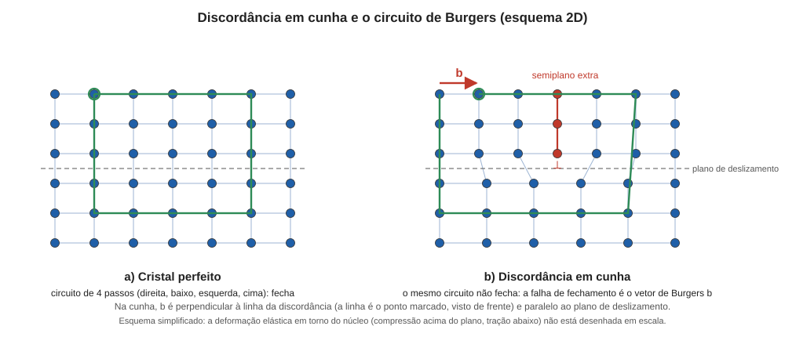

# Aula 02: Discordâncias e defeitos planares, Parte 1 — discordâncias e o vetor de Burgers

**ID:** mineralogia-m12-a02
**Módulo:** [[12-defeitos-e-maclas-modulo|Módulo 12 — Defeitos cristalinos e maclas]]
**Duração estimada:** ~28 min
**Nível:** ensino médio, sem geologia prévia (contrato `ensino-medio-sem-geologia-v1`)
**Objetivo:** descrever uma discordância em cunha e em hélice pelo vetor de Burgers, classificar uma discordância pelo ângulo entre b e a linha, e explicar como ela permite a deformação plástica e o crescimento em espiral.
**Pré-requisito:** [[12-defeitos-e-maclas-aula-01-defeitos-pontuais-e-o-que-eles-fazem|Aula 01]] (vacâncias e difusão) e [[05-miller-e-projecao-aula-03-direcoes-uvw-e-o-sistema-hexagonal-de-miller-bravais-hkil|módulo 05, aula 03]] (direções [uvw] e famílias ⟨uvw⟩).

> Esta aula foi dividida na revisão didática para caber em 30 minutos. Esta Parte 1 trata dos defeitos em linha (discordâncias); a [[12-defeitos-e-maclas-aula-03-discordancias-e-defeitos-planares-parte-2-contornos-falhas-de-empilhamento-e-antifase|Parte 2 (aula 03)]] trata dos defeitos planares.

## Vocabulário desta aula

| Termo | O que quer dizer |
|---|---|
| **discordância** | defeito linear: uma linha ao longo da qual a fileira de átomos está "fora do lugar" e em torno da qual a rede está distorcida. |
| **discordância em cunha** | a que corresponde a um semiplano extra de átomos inserido no cristal; a linha é a borda desse semiplano. |
| **discordância em hélice** | a que faz os planos da rede se enrolarem em espiral em torno da linha, como uma escada em caracol. |
| **vetor de Burgers (b)** | vetor que mede a "falha de fechamento" de um circuito em volta da linha; dá a direção e a grandeza do desajuste. |
| **tensão de cisalhamento** | esforço que tende a fazer uma parte do cristal escorregar sobre a outra, paralelamente a um plano. |
| **plano de deslizamento** | plano que contém a linha da discordância e o vetor de Burgers, sobre o qual ela se move. |

## Antes de começar, você precisa saber

- Que um cristal é uma repetição periódica de uma cela, que direções na rede se escrevem [uvw] e que uma família de direções equivalentes se escreve ⟨uvw⟩ (módulo 05, aula 03).
- Que vacâncias permitem a difusão e que a difusão é muito mais rápida em temperatura alta (aula 01).

## Ao final você vai conseguir

- `mineralogia-m12-oa02` — Descrever discordâncias em cunha e em hélice pelo vetor de Burgers e explicar seu papel na deformação plástica e no crescimento em espiral.

## Conteúdo

### Uma linha fora do lugar

Um cristal é duro, mas não rígido no sentido de ser indeformável: ele se deforma plasticamente sob tensão, ao longo de grandes escalas de tempo geológico (um mármore dobrado, um quartzo achatado). Se fosse preciso deslizar um plano inteiro de átomos sobre outro, rompendo todas as ligações do plano de uma vez, a tensão necessária seria enorme. Na prática, a deformação ocorre com tensões bem menores, e a explicação é a **discordância**: o deslizamento acontece uma fileira de átomos de cada vez, como mover um tapete empurrando uma ruga ao longo dele em vez de arrastar o tapete inteiro.

### Cunha e hélice, e como medir a diferença: o vetor de Burgers

Na **discordância em cunha**, imagine inserir um **semiplano extra** de átomos na metade superior do cristal. Em cima, a rede fica comprimida; embaixo, esticada. A linha da discordância é a borda inferior do semiplano.

*Legenda: à esquerda, o circuito (4 passos em cada direção) fecha no cristal perfeito; à direita, o mesmo circuito ao redor do semiplano extra (vermelho) não fecha. O vetor que falta para fechar é o vetor de Burgers, b.*

Essa é a definição operacional: **desenhe, em torno da linha, um circuito de passos de rede que fecharia num cristal perfeito. Se não fecha, o vetor que falta é o vetor de Burgers.** Para a cunha, **b é perpendicular à linha**.

Na **discordância em hélice**, o cristal é "cortado" por um semiplano e uma metade desliza em relação à outra paralelamente à borda do corte. Os planos da rede viram uma rampa helicoidal. Aqui **b é paralelo à linha**.

A maioria das discordâncias reais é **mista**: a linha curva, de modo que num ponto é quase cunha e noutro quase hélice, e o ângulo entre b e a linha varia (0° é hélice pura, 90° é cunha pura). O vetor de Burgers, porém, é **o mesmo ao longo de toda a linha**, e por isso é a identidade da discordância. Numa discordância **perfeita**, ele é um vetor da rede (uma translação do cristal), o que dá a grandeza do desajuste: em geral, uma translação curta (a menor, na direção de empacotamento mais denso). Existem também discordâncias **parciais**, cujo b é só uma fração de uma translação; elas sempre margeiam um defeito planar, em geral uma falha de empilhamento (aula 03).

### Deformação plástica

A discordância se move quando a tensão de cisalhamento atua sobre o plano de deslizamento: o semiplano extra "salta" de uma coluna para a seguinte (as ligações se rompem e se refazem uma a uma). Quando a discordância atravessa o cristal e emerge na superfície, uma metade ficou deslocada de **um vetor b** em relação à outra: esse é o degrau de deformação. Muitas discordâncias percorrendo muitos planos somam a deformação visível.

Três consequências para quem observa rochas:

1. **A deformação plástica tem direções preferidas.** O conjunto "plano de deslizamento + direção de b" é um **sistema de deslizamento**. A halita, por exemplo, desliza por {110}⟨1̄10⟩ (b = a/2⟨110⟩); o quartzo tem, entre outros, o deslizamento basal (0001)⟨11̄20⟩.
2. **Temperatura ajuda.** Uma discordância em cunha pode sair do seu plano de deslizamento *subindo* ou *descendo* (**escalada**), mas isso exige que o semiplano ganhe ou perca átomos, ou seja, **difusão de vacâncias** (aula 01). Escalada, portanto, é mais fácil a temperaturas altas.
3. **Discordâncias se acumulam e se organizam.** Elas se empilham em paredes, formando **subgrãos**: pequenos blocos quase perfeitos, levemente girados uns em relação aos outros, separados por contornos de baixo ângulo (aula 03). No microscópio (módulo 15), essa distorção aparece como **extinção ondulante** em quartzo deformado: entre polarizadores cruzados, o grão não escurece todo de uma vez ao girar a platina.

### Discordâncias e crescimento em espiral

As discordâncias também *constroem* cristais. Para crescer uma face lisa de um cristal, é preciso começar uma camada nova, o que exige uma "ilha" de átomos que se forme e se espalhe (nucleação bidimensional), e isso só acontece com bastante supersaturação (excesso de material dissolvido, ou de vapor, além do que o equilíbrio admite; módulo 03). Em 1949, F. C. Frank mostrou que uma **discordância em hélice que emerge na face cria um degrau que nunca se esgota**: os átomos que chegam se prendem ao degrau, que avança e se enrola em espiral em torno do ponto de emergência. Assim o cristal cresce com supersaturações muito menores. Espirais de crescimento foram observadas em faces de cristais como o SiC (carbeto de silício) e a calcita; a teoria completa (Burton, Cabrera e Frank, 1951) é a base do módulo 25.

## Exemplo trabalhado

**Problema.** (a) Calcule o módulo de b para o deslizamento ⟨110⟩ da halita (cela cúbica de a = 5,640 Å, b = a/2⟨110⟩). (b) Calcule b para o deslizamento basal ⟨11̄20⟩ do quartzo (a = 4,913 Å, b = a). (c) Uma discordância tem b = [1 0 0] e a linha segue [0 0 1]. Que tipo é? (d) Num cristal cúbico, outra discordância tem b = [1 0 0] e a linha segue [1 1 0]. Que tipo é?

**(a)** Numa cela cúbica, o vetor [110] vai de um vértice da cela ao vértice oposto da mesma face: é a diagonal de um quadrado de lado a, que mede a√2 (Pitágoras: √(a² + a²)). O vetor a/2⟨110⟩ é metade dessa diagonal, isto é, vai do vértice ao centro da face; na halita, cujo retículo é de faces centradas (módulo 06), essa metade já é uma translação da rede. |b| = a√2/2 = a/√2 = 5,640/1,414 = **3,99 Å**.

**(b)** No quartzo, b = a = **4,913 Å** (a translação mais curta no plano basal).

**(c)** Se a linha e b formam 90°, é **cunha**. Aqui a linha [001] é perpendicular a [100]: **discordância em cunha**.

**(d)** Num cristal cúbico, [100] e [110] formam 45° (a diagonal da face com uma das arestas). Não é 0° nem 90°: **discordância mista**.

**Método geral:** (1) confirme que o defeito é uma linha; (2) compare o ângulo entre b e a linha (0°: hélice; 90°: cunha; outro: mista); (3) para o módulo de b, escreva o vetor em termos dos eixos da cela e use Pitágoras.

## Erros comuns

- **Confundir a linha da discordância com b.** São grandezas distintas: a linha dá a posição do defeito; b dá o desajuste da rede.
- **Achar que a discordância é um "buraco".** Não falta uma região do cristal; há um semiplano extra (cunha) ou um escorregamento parcial.
- **Tratar subgrão como grão novo.** Um subgrão é parte do mesmo cristal, só levemente girado por uma parede de discordâncias.

## O que não concluir

- Que toda deformação de rocha ocorra por discordâncias. Há também difusão, deslizamento entre grãos, maclagem (aula 05) e fraturamento.
- Que b seja igual a um parâmetro de cela em todo mineral: em estruturas complexas, as discordâncias dissociam-se em parciais e o b de menor energia nem sempre é um parâmetro de cela simples.

## Recap relâmpago

- Discordância é um defeito linear que permite deslizar uma fileira de cada vez, com tensão muito menor que a de deslizar um plano inteiro.
- O vetor de Burgers b é a falha de fechamento do circuito de passos em torno da linha. Cunha: b ⊥ linha; hélice: b ∥ linha; mista: ângulo intermediário. b é constante ao longo da linha (translação da rede na perfeita; fração dela na parcial).
- Deslizamento ocorre no plano que contém a linha e b; escalada exige difusão de vacâncias; paredes de discordâncias formam subgrãos.
- Hélice emergindo numa face dá um degrau perene: crescimento em espiral (Frank, 1949).

## Próxima aula

Em [[12-defeitos-e-maclas-aula-03-discordancias-e-defeitos-planares-parte-2-contornos-falhas-de-empilhamento-e-antifase|Aula 03 — Discordâncias e defeitos planares, Parte 2]], os defeitos passam de linhas a superfícies: contornos de grão, falhas de empilhamento e contornos de antifase.

## Fontes consultadas

- Klein & Dutrow, *Manual of Mineral Science*, 23ª ed., e Nesse, *Introduction to Mineralogy* (discordâncias, vetor de Burgers, discordâncias parciais). Que as parciais margeiam um defeito planar que nem sempre é falha de empilhamento (parciais de macla nos contornos de macla; superparciais com contorno de antifase em fases ordenadas): Hull & Bacon, *Introduction to Dislocations*, e literatura de maclagem e de ligas ordenadas, conferidos por busca na terceira passagem da auditoria (2026-10-06).
- Frank, F. C. (1949), *Discuss. Faraday Soc.* 5, 48–54; Burton, Cabrera & Frank (1951), *Phil. Trans. R. Soc. A* 243, 299; espirais em SiC: Verma (1951, *Nature* e *Phil. Mag.*). Conferidos na auditoria em 2026-10-06. Na segunda passagem (2026-10-06), conferido que o paradoxo resolvido por Frank e BCF é o da supersaturação exigida no crescimento a partir de vapor, caso dos cristais de SiC.
- Extinção ondulante (a extinção "varre" o grão ao girar a platina, por subgrãos levemente desorientados): definição usual, conferida por busca na segunda passagem.
- Sistemas de deslizamento da halita ({110}⟨1̄10⟩, b = a/2⟨110⟩) e do quartzo (basal (0001)⟨a⟩): literatura de deformação de minerais (por exemplo, Passchier & Trouw, *Microtectonics*); conferidos por busca na auditoria.
- Parâmetros de cela: halita 5,640 Å (módulo 08); quartzo a = 4,9135 Å (*Handbook of Mineralogy*); módulos de b calculados em Python em 2026-10-06.

<!--
nivel: ensino-medio-sem-geologia-v1
palavras_corpo: 1280
origem: "Parte 1 da antiga aula 02 (mesmo ID), dividida na revisao didatica de 2026-10-06; a Parte 2 recebeu o ID novo mineralogia-m12-a07"
cobertura:
  mineralogia-m12-oa02: [Conteúdo, Exemplo trabalhado]
figuras:
  - 12-defeitos-e-maclas-fig-02-discordancia-e-burgers.svg
alegacoes_auditaveis:
  - claim_id: CRI-DISC-BURGERS-001
    claim: "Vetor de Burgers = falha de fechamento de um circuito de passos de rede em torno da linha; cunha: b perpendicular a linha; helice: b paralelo a linha; mista: angulo intermediario; b constante ao longo da linha; vetor de translacao da rede na discordancia perfeita (fracao dele nas parciais, que margeiam um defeito planar, em geral falha de empilhamento)."
    risk: conceito
    source: "Klein & Dutrow; Nesse; Hull & Bacon (parciais de macla; superparciais com contorno de antifase)"
    audit: "corrigido em 2026-10-06 (achado 6: b e vetor da rede so na discordancia perfeita; parciais tem b fracionario). Terceira passagem (2026-10-06, achado 15): 'sempre margeiam uma falha de empilhamento' generalizado para 'um defeito planar, em geral uma falha de empilhamento' (parciais de macla em contornos de macla; superparciais em contornos de antifase de fases ordenadas)"
  - claim_id: CRI-DISC-DESLIZ-001
    claim: "Deslizamento no plano que contem a linha e b; escalada exige difusao de vacancias (favorecida em T alta); acumulo de discordancias forma subgraos (contornos de baixo angulo = paredes de discordancias); extincao ondulante no quartzo deformado."
    risk: conceito
    source: "Klein & Dutrow; Passchier & Trouw"
    audit: "verificado em 2026-10-06 (Klein & Dutrow; Passchier & Trouw)"
  - claim_id: CRI-DISC-SISTEMA-001
    claim: "Halita desliza por {110}<1-10> com b = a/2<110>; |b| = a/raiz2 = 3,99 A para a = 5,640 A. Quartzo: deslizamento basal (0001)<11-20>, b = a = 4,913 A."
    risk: numero
    source: "literatura de deformacao de minerais; calculo em Python"
    audit: "verificado em 2026-10-06 (busca: NaCl {110}<1-10>, b = a/2<110>; quartzo basal <a>; HoM a = 4,9135; Python 3,988 A)"
  - claim_id: CRI-DISC-FRANK-001
    claim: "Frank (1949): discordancia em helice emergindo na face cria degrau perene e crescimento em espiral com baixa supersaturacao; teoria BCF (Burton, Cabrera, Frank, 1951); espirais observadas em SiC e calcita."
    risk: fato
    source: "Frank (1949); Burton, Cabrera & Frank (1951)"
    audit: "verificado em 2026-10-06 (Discuss. Faraday Soc. 5, 48-54; Phil. Trans. A 243, 299; Verma 1951 em SiC)"
  - claim_id: CRI-DISC-DIDAT-001
    claim: "Textos explicativos acrescentados pela revisao didatica: (1) a/2<110> vai do vertice ao centro da face e, no reticulo de faces centradas da halita, ja e translacao da rede; (2) em cristal cubico [100] e [110] formam 45 graus (discordancia mista); (3) extincao ondulante: entre polarizadores cruzados o grao nao escurece todo de uma vez ao girar a platina."
    risk: conceito
    source: "modulo 06 (reticulo cF); geometria; definicao usual de extincao ondulante (Passchier & Trouw)"
    audit: "verificado em 2026-10-06, segunda passagem ((1/2,1/2,0) = centro da face, translacao de cF; cos 45 = 1/raiz2; extincao ondulante: a extincao varre o grao ao girar a platina, por busca)"
  - claim_id: CRI-DISC-SUPERSAT-001
    claim: "Glosa da revisao didatica: supersaturacao = excesso de material dissolvido, ou de vapor, alem do que o equilibrio admite. A nucleacao bidimensional exige supersaturacao alta; as espirais em SiC (Verma, 1951) sao de cristais crescidos de vapor."
    risk: conceito
    source: "modulo 03 aula 04; Verma (1951), Phil. Mag. 42; teoria BCF (crescimento a partir de vapor)"
    audit: "corrigido em 2026-10-06, segunda passagem (achado 14: a glosa 'excesso de material dissolvido' restringia a solucao; o exemplo SiC e a teoria BCF tratam crescimento a partir de vapor)"
-->
