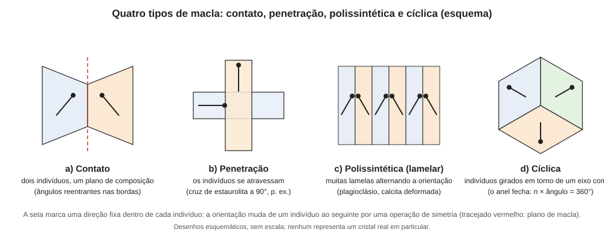

# Aula 04: Maclas — definição, elemento de macla e tipos

**ID:** mineralogia-m12-a03
**Módulo:** [[12-defeitos-e-maclas-modulo|Módulo 12 — Defeitos cristalinos e maclas]]
**Duração estimada:** ~29 min
**Nível:** ensino médio, sem geologia prévia (contrato `ensino-medio-sem-geologia-v1`)
**Objetivo:** definir macla, identificar o elemento de macla (plano, eixo ou centro) que relaciona dois indivíduos, distinguir macla de agregado paralelo e de sobrecrescimento, e classificar uma macla em contato, penetração, polissintética ou cíclica.
**Pré-requisito:** [[05-miller-e-projecao-aula-07-simetria-no-estereograma-elementos-e-forma-geral-das-classes|módulo 05, aula 07]] (elementos de simetria) e [[12-defeitos-e-maclas-aula-03-discordancias-e-defeitos-planares-parte-2-contornos-falhas-de-empilhamento-e-antifase|aula 03]] (defeito planar); para o exemplo (b), [[11-estrutura-dos-silicatos-aula-04-da-estrutura-a-propriedade-clivagem-habito-e-densidade|módulo 11, aula 04]] (ângulo entre (110) e (1̄10) pela tangente).

## Vocabulário desta aula

| Termo | O que quer dizer |
|---|---|
| **macla** (também **geminação**) | intercrescimento regular de dois ou mais cristais da mesma espécie (indivíduos), em que a orientação de um é a do outro transformada por uma operação de simetria que **não** é simetria do cristal isolado. |
| **indivíduo** | cada cristal (domínio) que compõe a macla. |
| **operação de macla** | a operação de simetria que leva a orientação de um indivíduo à do outro: reflexão, rotação ou inversão. |
| **plano de macla** | plano de espelho imaginário que relaciona os indivíduos (macla por reflexão). |
| **eixo de macla** | eixo de rotação (em geral de 180°) que relaciona os indivíduos. |
| **centro de macla** | ponto de inversão que relaciona os indivíduos. |
| **plano de composição** | superfície real onde os indivíduos se encontram; pode coincidir ou não com o plano de macla. |
| **lei de macla** | a regra que dá o elemento de macla (e o plano de composição) de uma macla, com um nome próprio (aulas 06 e 07). |
| **ângulo reentrante** | "entalhe" na borda externa da macla, onde as faces dos dois indivíduos formam um ângulo que entra no cristal. |

## Antes de começar, você precisa saber

- Que planos de simetria, eixos de rotação e o centro de inversão são elementos de simetria (módulo 05, aula 07).
- Escrever um plano como (hkl) e uma direção como [uvw] (módulo 05).

## Ao final você vai conseguir

- `mineralogia-m12-oa04` — Definir macla e seu elemento de macla (plano, eixo, centro) e classificá-la em contato, penetração, polissintética ou cíclica.

## Conteúdo

### O que é uma macla, e o que ela não é

Considere dois cristais de calcita crescidos juntos, que dividem um plano de contato e parecem refletir um ao outro como num espelho. Se um deles for uma cópia **refletida por um plano** que não é plano de simetria do próprio cristal, eles formam uma **macla**. A palavra-chave da definição é: **a relação entre os dois é uma operação de simetria que o cristal individual não possui**. Se ele já tivesse essa simetria, o espelhamento produziria um cristal igual ao original, e não haveria nada a distinguir.

Isso separa a macla de dois casos parecidos:

- **Agregado paralelo.** Vários indivíduos da mesma espécie, todos com **a mesma orientação** (relacionados apenas por translação ou por simetria que o cristal já tem). Parece um cristal só ramificado, mas não há reorientação.
- **Sobrecrescimento epitaxial.** Um cristal de **outra espécie** crescido sobre o primeiro, com orientação relacionada à do substrato (módulo 27). Na macla, os dois indivíduos são da mesma espécie e a relação é de simetria.

### O elemento de macla

A operação de macla pode ser de três tipos, que dão os três elementos:

| Operação | Elemento | O que faz |
|---|---|---|
| Reflexão | **plano de macla** (hkl) | o segundo indivíduo é a imagem do primeiro num espelho. |
| Rotação (em geral de 180°) | **eixo de macla** [uvw] | o segundo é o primeiro girado meia volta. |
| Inversão | **centro de macla** | o segundo é o primeiro invertido por um ponto. |

Dois cuidados. Primeiro, o elemento de macla **não pode ser um elemento de simetria do cristal**: um plano de macla de índices que já seja plano de simetria da classe não existe. Segundo, o elemento de macla é um **ente abstrato** (a regra de relação); o que se vê no cristal é o **plano de composição**, a superfície onde os dois indivíduos realmente se tocam. Eles frequentemente coincidem, mas não sempre. Em muitos casos de macla por rotação em torno de um eixo, o plano de composição é perpendicular ao eixo ("macla normal") ou contém o eixo ("macla paralela"); essa distinção é usada na descrição dos feldspatos (aula 06).

A **lei de macla** reúne essas informações, e quase sempre tem nome (de um lugar ou de um mineral): Carlsbad, albita, espinélio etc. Dizer "macla da lei do espinélio" significa dar o elemento de macla (um plano (111)) de forma abreviada.

### Os quatro tipos

*Legenda: em cada esquema, a seta é uma direção fixa dentro do indivíduo; ela muda de um indivíduo para o seguinte pela operação de macla.*

1. **Macla de contato (ou de justaposição).** Dois indivíduos (ou poucos) se encontram num **plano de composição** nítido e regular. É a forma típica da macla "simples". O sinal visual característico é o **ângulo reentrante** na borda onde a linha de composição encontra o contorno externo (o "rabo de andorinha" da gipsita é um exemplo).
2. **Macla de penetração (ou de interpenetração).** Os indivíduos se atravessam, com superfície de composição **irregular**, de modo que o cristal parece "um dentro do outro". A cruz de estaurolita e os cubos de fluorita entrelaçados são exemplos clássicos.
3. **Macla polissintética (ou lamelar, múltipla).** Muitas **lamelas finas e paralelas** com a mesma lei, em que as lamelas vizinhas alternam a orientação. É a que produz as estrias de macla do plagioclásio em lâmina delgada (módulo 15) e as lamelas da calcita deformada.
4. **Macla cíclica (ou repetida).** Três ou mais indivíduos relacionados por **eixos não paralelos** (ou planos de macla não paralelos) que **fecham um círculo**. Se cada indivíduo gira θ em relação ao anterior, num anel idealizado de n indivíduos com giros iguais, o anel fecha quando **n × θ = 360°**: trilling de 120°, fourling de 90°, sixling de 60° (nomes do inglês para maclas de três, quatro e seis indivíduos). A macla cíclica pode ser **pseudossimétrica**: o conjunto imita uma simetria mais alta que a dos indivíduos (por exemplo, um cristal ortorrômbico que, repetido em anel, imita um prisma hexagonal).

Esses quatro tipos **não se excluem**: uma macla polissintética pode ser também de contato (cada lamela encosta na vizinha), e é comum falar em "macla simples" (dois indivíduos) e "múltipla" (mais de dois) de forma complementar à classificação anterior.

### Por que isso importa na prática

Reconhecer uma macla muda o que se conclui sobre uma amostra: um cristal com ângulo reentrante, ou com estrias paralelas que não são clivagem, ou que se extingue em duas metades distintas ao microscópio, pode estar maclado, e não ser dois cristais distintos nem uma deformação. Além disso, a lei de macla é, para muitas espécies, **diagnóstico** (o plagioclásio tem maclas de albita; o espinélio, as do próprio nome). E o contorno de uma macla é um defeito **planar de baixa energia**: a rede é contínua através do plano, e só a orientação muda.

## Exemplo trabalhado

**Problema.** (a) Classifique: (i) dois piritoedros (dodecaedros pentagonais) de pirita que se atravessam, formando a "cruz de ferro"; (ii) lâmina de plagioclásio com dezenas de faixas paralelas alternando extinção; (iii) dois cristais prismáticos de gipsita unidos por um plano, com um entalhe em V na ponta; (iv) seis cristais de rutilo dispostos em anel. (b) Para a aragonita (ortorrômbica, a = 4,96 Å, b = 7,97 Å), a macla de plano {110} produz trilling: calcule o ângulo entre os planos (110) e (1̄10) e diga por que o conjunto parece hexagonal. (c) Quantos indivíduos fecham um anel com θ = 60°?

**(a)** (i) **penetração**; (ii) **polissintética**; (iii) **contato** (o entalhe em V é o ângulo reentrante); (iv) **cíclica** (e provavelmente de 6 indivíduos).

**(b)** É a mesma conta da clivagem dos piroxênios no módulo 11, aula 04, mais simples porque a aragonita é ortorrômbica (β = 90°, não entra o senβ). O plano (110) corta o eixo a em a e o eixo b em b; olhando ao longo de c, os dois ângulos entre (110) e (1̄10) são 2 · arctan(a/b) e 2 · arctan(b/a), que somam 180° (lá foi escrito o primeiro; aqui, o segundo). No plano a–b, o ângulo entre (110) e (1̄10) é 2 · arctan(b/a) = 2 · arctan(7,97/4,96) = 2 × 58,1° = **116,2°**, com suplemento de **63,8°**. Como 63,8° está perto de 60° (e 116° perto de 120°), três indivíduos relacionados em torno do eixo c quase fecham um hexágono: é a **pseudossimetria hexagonal**. O "quase" é a diferença de 3–4° em relação a 60°: o anel só fecha com uma pequena falha entre os indivíduos.

**(c)** n = 360° / 60° = **6** indivíduos (sixling).

**Método geral:** (1) conte os indivíduos e olhe a superfície de composição (nítida → contato; irregular → penetração); (2) muitas lamelas paralelas → polissintética; (3) eixos que fecham o círculo → cíclica, com n × θ = 360°.

## Erros comuns

- **Confundir macla com agregado paralelo.** Se não há reorientação (orientação idêntica), não há macla.
- **Confundir o plano de composição com o plano de macla.** O primeiro é a superfície real de contato; o segundo é a regra de relação. Podem coincidir, mas só o segundo entra na definição da lei.
- **Chamar toda faixa paralela de macla.** Lamelas de exsolução (módulo 09, aula 03; módulo 23) e planos de clivagem também dão listras; a macla se distingue pela mudança de orientação (extinção alternada, ângulo reentrante).
- **Esquecer a restrição de simetria.** Um plano de macla de índices que já é espelho do cristal "não existe" como macla.

## O que não concluir

- Que um ângulo reentrante prove macla: um cristal pode ter faces côncavas por esqueletismo (crescimento mais rápido nas arestas e nos vértices que no centro das faces, módulo 25) ou por dissolução. É forte indício, não prova.
- Que toda macla tenha o plano de macla paralelo a uma face do cristal: o plano de macla é, em geral, um plano com índices simples, mas não precisa coincidir com uma face desenvolvida.
- Que "macla" e "geminação" sejam coisas diferentes: são sinônimos; o curso usa "macla", e os mesmos nomes de leis do curso-geologia-avancado (que usa "geminação").

## Recap relâmpago

- Macla = intercrescimento regular de indivíduos da mesma espécie, relacionados por uma operação de simetria (reflexão, rotação ou inversão) que o cristal individual não tem.
- Elemento de macla: plano, eixo (em geral de 180°) ou centro; não pode ser elemento de simetria do cristal. Plano de composição = superfície real de contato, que pode ou não coincidir com o plano de macla.
- Tipos: contato (plano nítido, ângulo reentrante), penetração (superfície irregular), polissintética (lamelas paralelas), cíclica (anel de indivíduos, n × θ = 360°).
- Macla difere de agregado paralelo (mesma orientação) e de sobrecrescimento epitaxial (outra espécie).

## Próxima aula

Em [[12-defeitos-e-maclas-aula-05-origem-das-maclas-crescimento-transformacao-e-deformacao|Aula 05 — Origem das maclas]], a pergunta passa a ser de onde uma macla vem: de um erro durante o crescimento, de uma transformação de fase ou de uma deformação.

## Fontes consultadas

- Klein & Dutrow, *Manual of Mineral Science*, 23ª ed. (maclas: definição, elementos, tipos e leis); Nesse, *Introduction to Mineralogy* (maclas e simetria).
- Terminologia de macla normal/paralela e leis: curso-geologia-avancado, módulo 40, aula 08 (citado por nome).
- Aragonita: parâmetros de cela a = 4,9611 Å e b = 7,9672 Å (*Handbook of Mineralogy*; trilling pseudo-hexagonal por contato repetido em {110}), conferidos na auditoria; ângulo calculado em Python em 2026-10-06 (116,18° e 63,82°).
- Pirita: macla de eixo [001] e plano {011}, de penetração ("cruz de ferro" de dois piritoedros) (*Handbook of Mineralogy*), conferida na auditoria.
- Nomes ingleses das maclas múltiplas (trilling, fourling, sixling): glossário do minerals.net, conferido por busca na segunda passagem da auditoria (2026-10-06).
- Exemplos de gipsita (rabo de andorinha), estaurolita, fluorita, plagioclásio e rutilo: aulas 06 e 07 e fontes citadas ali.

<!--
nivel: ensino-medio-sem-geologia-v1
palavras_corpo: 1469
cobertura:
  mineralogia-m12-oa04: [Conteúdo, Exemplo trabalhado]
figuras:
  - 12-defeitos-e-maclas-fig-03-tipos-de-macla.svg
alegacoes_auditaveis:
  - claim_id: MIN-MACLA-DEFIN-001
    claim: "Macla: intercrescimento regular de indiv. da mesma especie, relacionados por operacao de simetria (reflexao, rotacao, inversao) que nao e simetria do cristal individual; elemento de macla = plano, eixo (em geral 180 graus) ou centro; nao pode ser elemento de simetria do cristal."
    risk: conceito
    source: "Klein & Dutrow; Nesse"
    audit: "verificado em 2026-10-06 (Klein & Dutrow; Nesse)"
  - claim_id: MIN-MACLA-COMPOS-001
    claim: "Plano de composicao (superficie real de contato) pode ou nao coincidir com o plano de macla; macla normal (eixo perpendicular ao plano de composicao) e paralela (eixo contido no plano)."
    risk: conceito
    source: "Klein & Dutrow; curso-geologia-avancado m40 a08 (por nome)"
    audit: "verificado em 2026-10-06 (Klein & Dutrow)"
  - claim_id: MIN-MACLA-TIPOS-001
    claim: "Tipos: contato (plano nitido, angulo reentrante), penetracao (superficie irregular), polissintetica/lamelar, ciclica (n x theta = 360 graus)."
    risk: conceito
    source: "Klein & Dutrow"
    audit: "verificado em 2026-10-06 (Klein & Dutrow; achado 8 corrigiu so o exemplo da pirita no exercicio)"
  - claim_id: MIN-MACLA-DIFER-001
    claim: "Macla difere de agregado paralelo (mesma orientacao) e de sobrecrescimento epitaxial (outra especie, orientacao relacionada)."
    risk: conceito
    source: "Klein & Dutrow; modulo 27 (previsto)"
    audit: "verificado em 2026-10-06 (Klein & Dutrow)"
  - claim_id: MIN-MACLA-ARAG-001
    claim: "Aragonita (ortorrombica, a ~ 4,96 A, b ~ 7,97 A): angulo entre (110) e (1-10) = 2 arctan(b/a) = 116,2 graus (suplemento 63,8); trilling pseudo-hexagonal de plano {110}."
    risk: numero
    source: "Handbook of Mineralogy (parametros, a conferir); calculo em Python"
    audit: "verificado em 2026-10-06 (HoM a = 4,9611, b = 7,9672; Python 116,18/63,82 graus; trilling em {110})"
  - claim_id: MIN-MACLA-DIDAT-001
    claim: "Acrescimos da revisao didatica: os dois angulos entre (110) e (1-10) num ortorrombico sao 2 arctan(a/b) e 2 arctan(b/a), que somam 180 graus (m11 a04 usou a forma com a.senb/b); trilling/fourling/sixling = nomes do ingles para maclas de 3, 4 e 6 individuos; esqueletismo = crescimento mais rapido nas arestas e vertices que no centro das faces."
    risk: conceito
    source: "trigonometria (arctan x + arctan 1/x = 90 graus); modulo 11 aula 04; glossario minerals.net (trilling, fourling, sixling); hopper/skeletal growth"
    audit: "corrigido em 2026-10-06, segunda passagem (achado 13: 'quatrilling' nao e termo ingles; o termo e 'fourling'. Soma 180 graus, ponte com m11 a04 (2 arctan(a senB/b), com B = 90 graus da 2 arctan(a/b)) e esqueletismo verificados)"
-->
