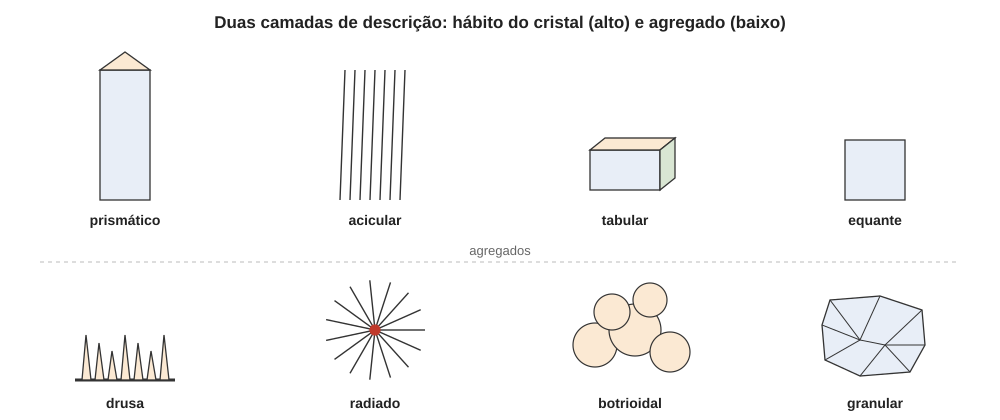

# Aula 01: Hábito e agregados — a linguagem da morfologia

**ID:** mineralogia-m13-a01
**Módulo:** [[13-propriedades-fisicas-modulo|Módulo 13 — Propriedades físicas e identificação macroscópica]]
**Duração estimada:** ~25 min
**Nível:** ensino médio, sem geologia prévia (contrato `ensino-medio-sem-geologia-v1`)
**Objetivo:** descrever um espécime pela terminologia padrão em duas camadas, o hábito do cristal individual e o tipo de agregado, e ligar o hábito à estrutura e às condições de crescimento.
**Pré-requisito:** [[04-simetria-e-morfologia-aula-07-formas-cristalinas-e-habito-formas-gerais-especiais-abertas-e-fechadas|módulo 04, aula 07]] (forma cristalina e a primeira tabela de hábitos) e [[11-estrutura-dos-silicatos-aula-04-da-estrutura-a-propriedade-clivagem-habito-e-densidade|módulo 11, aula 04]] (hábito pela polimerização).

## Vocabulário desta aula

| Termo | O que quer dizer |
|---|---|
| **hábito** | aparência típica dos cristais individuais de um mineral (alongados, achatados, equidimensionais...). |
| **agregado** | conjunto de muitos cristais ou grãos do mesmo mineral (ou de vários) unidos num só espécime. |
| **euédrico** | cristal limitado por faces próprias e bem formadas. |
| **anédrico** | grão sem faces próprias, de contorno imposto pelos vizinhos. |
| **massivo** | agregado compacto, sem forma externa nem cristais individuais visíveis a olho nu. |
| **criptocristalino** | feito de cristais tão pequenos que só se resolvem ao microscópio (a calcedônia é um exemplo). |
| **drusa** | crosta de pequenos cristais cobrindo a parede de uma cavidade ou fratura. |
| **geodo** | cavidade arredondada da rocha com as paredes forradas de cristais ou de camadas minerais. |

## Antes de começar, você precisa saber

- O que é uma forma cristalina e que o hábito é uma descrição de aparência, que não depende da classe de simetria (módulo 04, aula 07).
- Que as unidades estruturais condicionam a morfologia: cadeias favorecem o alongamento; folhas favorecem placas (módulo 11, aula 04).

## Ao final você vai conseguir

- `mineralogia-m13-oa01` — Descrever hábito e agregados cristalinos com a terminologia padrão.

## Conteúdo

### Duas perguntas, duas camadas

Ao pegar um espécime, faça duas perguntas diferentes. **Primeira: como é cada cristal?** Isso é o **hábito**. **Segunda: como os cristais estão reunidos?** Isso é o **agregado**. Misturar as duas é o erro mais comum de iniciante: "quartzo botrioidal" não existe como hábito de cristal; existe um agregado de superfície botrioidal, que pode ser feito de cristais de hábito fibroso. Neste módulo, "descrever" quer dizer observar e nomear, sem ainda interpretar a origem (o degrau de inferência do módulo 25 em diante).

### Primeira camada: o hábito do cristal individual

A tabela do módulo 04 (prismático, acicular, tabular, lamelar, equante, fibroso) segue valendo. Acrescente três termos de uso corrente: **em lâmina** (*bladed*, alongado e achatado como lâmina de faca, típico da cianita), **capilar** (fios finíssimos, mais finos que o acicular) e **piramidal/bipiramidal** (o cristal é dominado por uma pirâmide). O hábito não é lei do mineral: é o que o mineral fez em **certas** condições de crescimento. Temperatura, grau de supersaturação (quanto o fluido excede o que o cristal sustentaria em equilíbrio), impurezas e espaço disponível mudam o hábito de uma mesma espécie (módulo 25). O quartzo forma prismas bem terminados numa cavidade, grãos anédricos num granito e calcedônia criptocristalina numa ágata: três aparências, uma só espécie.

A estrutura ainda deixa sua marca (módulo 11, aula 04). Minerais de cadeias (anfibólios, piroxênios) tendem a prismas e fibras; minerais de folhas (micas), a placas; minerais de arcabouço fortemente ligado em três direções, a grãos equantes. É uma **tendência**, não uma regra: o zircão é um nesossilicato e forma prismas.

### Segunda camada: o agregado

Os termos se organizam por **o que se vê**, de fora para dentro.

**Cristais visíveis, reunidos:**

| Termo | Aparência |
|---|---|
| **drusa** | crosta de cristais pequenos sobre uma superfície |
| **radiado / estrelado** | cristais alongados partindo de um centro, como raios |
| **colunar** | colunas paralelas, lado a lado |
| **fibroso** | fibras finas e paralelas (a gipsita fibrosa; a crisotila, uma serpentina que é a forma mais comum de amianto) |
| **dendrítico** | ramificado como folha de samambaia, por crescimento em fino filme ou fratura |
| **em roseta** | lâminas ou placas dispostas como pétalas (a "rosa do deserto" de barita ou gipsita) |

**Grãos (cristais pequenos ou irregulares):**

| Termo | Aparência |
|---|---|
| **granular** | grãos distinguíveis a olho nu, de tamanho parecido; **sacaroide** quando lembra açúcar (mármore) |
| **laminado / foliado** | lâminas que se destacam em folhas (micas) |
| **massivo** | compacto, sem cristais distintos |

**Formas de superfície arredondada** (em geral agregados de fibras radiadas, ou de camadas):

| Termo | Aparência |
|---|---|
| **botrioidal** | muitas esferas coladas, como um cacho de uvas |
| **reniforme** | lobos maiores, como rins |
| **mamilar** | lobos ainda maiores, como seios |
| **estalactítico** | formas pendentes ou cônicas, como pingentes |
| **oolítico / pisolítico** | esferas de ~1 mm (ooides, como ovas de peixe) ou de ~2 mm e mais (pisoides, como ervilhas), em camadas concêntricas |
| **concrecionário / nodular** | massa arredondada que cresceu a partir de um centro dentro de um sedimento |

Os cortes de tamanho entre oolítico e pisolítico variam de autor para autor (o limite de 2 mm é o mais usado na petrologia sedimentar); ao descrever, diga "esferas de cerca de 1 mm" se quiser ser preciso.

*Figura 1. A mesma pergunta em duas camadas: no alto, quatro hábitos do cristal individual; embaixo, quatro agregados. O que observar: no agregado radiado, cada "raio" é um cristal alongado; no botrioidal, cada "lobo" não é um cristal só, e sim um feixe de muitas fibras radiadas a partir de um centro; a superfície arredondada é apenas a forma externa do conjunto.*

### Cristalinidade: de cristais a sem cristais

Há ainda um eixo à parte: o grau de cristalinidade. **Cristalino** (cristais ou grãos visíveis ao olho ou à lupa), **criptocristalino** (só ao microscópio; calcedônia, jaspe) e **amorfo** (sem ordem de longo alcance, como a opala, que é mineraloide; módulo 10, aula 04). Um espécime "massivo" pode ser, na verdade, criptocristalino. Para distinguir, olhe o brilho da superfície de fratura: faces de clivagem refletindo em direções coordenadas indicam cristais, e superfície uniforme e cerosa sugere criptocristalino ou amorfo.

### Alerta de segurança: fibras

Minerais **asbestiformes** (de fibras muito finas e flexíveis, que se soltam em feixes) liberam fibras ao serem quebrados, raspados ou pulverizados, e a inalação delas é perigosa. Não se usa um espécime fibroso para teste de dureza ou de traço sem saber o que é. Mineral fibroso de identidade desconhecida se descreve e se guarda fechado; quem manuseia não o parte.

## Exemplo trabalhado

**Problema.** Descreva com a terminologia da aula: (a) uma crosta de pequenos cristais prismáticos de quartzo, todos apontando para dentro de uma cavidade de rocha; (b) uma massa de superfície lisa e arredondada, em lobos do tamanho de uma ervilha, preta; ao quebrá-la, o interior mostra fibras finas partindo do centro de cada lobo; (c) uma rocha de calcita em que os grãos têm cerca de 1 mm, aproximadamente iguais, e brilham como açúcar.

**(a)** Hábito do cristal: **prismático**. Agregado: **drusa**. Se a cavidade é toda arredondada, é um **geodo com drusa de quartzo**.

**(b)** Agregado de superfície: **botrioidal** (lobos pequenos, coalescidos) ou **reniforme** (se maiores). O interior mostra que cada lobo é **fibroso radiado**: o hábito dos cristais é fibroso, e a superfície arredondada é o conjunto deles. É o aspecto descrito para a hematita botrioidal ou reniforme, mas a descrição vale para qualquer mineral que se comporte assim; a **identificação** ainda precisa de outras propriedades (aulas seguintes).

**(c)** Agregado **granular**, **sacaroide** (grãos equidimensionais e anédricos). O nome da rocha é **mármore** quando a calcita é metamórfica; descrever é uma coisa, interpretar a origem é outra.

**Método geral:** (1) o mineral é cristalino, criptocristalino ou amorfo? (2) Os cristais individuais são visíveis? Dê o hábito. (3) Como estão reunidos? Dê o agregado. (4) Se o interior difere da superfície, descreva os dois separadamente.

## Erros comuns

- **Usar nomes de agregado como se fossem hábito** (e o contrário). Botrioidal é agregado; fibroso pode ser os dois, e é preciso dizer a que escala.
- **Achar que o hábito identifica a espécie.** Mesmo mineral, hábitos diferentes; minerais diferentes, mesmo hábito (muitos minerais formam agregados botrioidais, como hematita, malaquita e calcedônia).
- **Confundir euédrico com cristal "bonito".** Euédrico quer dizer que as faces são do próprio cristal; um cristal quebrado ou desgastado não é euédrico no ponto de ruptura.
- **Chamar de "cristal" qualquer grão.** Grão anédrico é um cristal sem faces próprias; o termo "cristal" na descrição sugere faces.

## O que não concluir

- Que o hábito seja uma propriedade fixa do mineral, como a dureza. É dependente do ambiente de crescimento.
- Que um agregado botrioidal tenha origem inorgânica "pura" ou orgânica: a forma não diz isso; a descrição fica no degrau da observação.
- Que um espécime "massivo" não tenha estrutura cristalina. Tem; os cristais apenas são pequenos demais para o olho.

## Recap relâmpago

- Descrever em duas camadas: **hábito** do cristal individual e **agregado** do conjunto; mais o grau de cristalinidade (cristalino, criptocristalino, amorfo).
- Hábito: equante, prismático, acicular, capilar, em lâmina, tabular, lamelar, fibroso; depende das condições de crescimento e tem a marca da estrutura (cadeias: fibras; folhas: placas).
- Agregados: drusa, radiado, colunar, fibroso, dendrítico, em roseta, granular, laminado, massivo; formas arredondadas: botrioidal, reniforme, mamilar, estalactítico, oolítico, pisolítico, concrecionário.
- Fibras asbestiformes: não quebrar, raspar nem pulverizar.

## Próxima aula

Em [[13-propriedades-fisicas-aula-02-clivagem-particao-e-fratura|Aula 02 — Clivagem, partição e fratura]], o espécime é quebrado, ou imaginado quebrado: como ele se parte diz mais sobre a estrutura do que a forma externa.

## Fontes consultadas

- Klein & Dutrow, *Manual of Mineral Science*, 23ª ed., e Nesse, *Introduction to Mineralogy* (terminologia de hábito e de agregados).
- Distinção oólito/pisólito pelo tamanho (cerca de 2 mm): petrologia sedimentar usual (Tucker, *Sedimentary Petrology*); conferida por busca na auditoria de 2026-10-07 (ooides em geral ≤ 2 mm; pisoides > 2 mm); os cortes variam entre autores, e a aula o declara.
- Hábitos citados: *Handbook of Mineralogy*, lido em 2026-10-07 (hematita "radiating fibrous, reniform, botryoidal or stalactitic masses"; cianita "bladed", alongada ∥ [001]; gipsita "fibrous", "in rosettes"; quartzo "drusy, fine-grained to microcrystalline (chalcedony)").
- Asbestiformes e risco de inalação: orientação geral de segurança de coleções (Smithsonian, NPS Conserve O Gram), por busca em 2026-10-07.

<!--
nivel: ensino-medio-sem-geologia-v1
palavras_corpo: 1275
cobertura:
  mineralogia-m13-oa01: [Conteúdo, Exemplo trabalhado]
figuras:
  - 13-propriedades-fisicas-fig-01-habito-e-agregados.svg
alegacoes_auditaveis:
  - claim_id: PRF-HAB-DUAS-001
    claim: "Descrever em duas camadas: habito do cristal individual e tipo de agregado; botrioidal, reniforme, mamilar, estalactitico, drusa, radiado, colunar, fibroso, dendritico, roseta, granular, laminado, massivo sao termos de agregado ou de superficie."
    risk: conceito
    source: "Klein & Dutrow; Nesse"
    audit: "verificado em 2026-10-07 (Klein & Dutrow; Nesse; terminologia de habito e agregado)"
  - claim_id: PRF-HAB-OOIDE-001
    claim: "Oolitico = esferas de ~1 mm em camadas concentricas; pisolitico = esferas maiores (limite usual ~2 mm); o corte varia entre autores."
    risk: numero
    source: "petrologia sedimentar usual (Tucker)"
    audit: "verificado em 2026-10-07 (ooides em geral <= 2 mm, pisoides > 2 mm; corte varia entre autores)"
  - claim_id: PRF-HAB-CRISTAL-001
    claim: "Cristalino, criptocristalino (calcedonia, jaspe) e amorfo (opala, mineraloide) como eixo de cristalinidade; massivo pode ser criptocristalino."
    risk: fato
    source: "Klein & Dutrow; modulo 10 aula 04"
    audit: "verificado em 2026-10-07 (HoM quartz: chalcedony microcristalino; modulo 10 aula 04: opala mineraloide)"
  - claim_id: PRF-HAB-AMBIENTE-001
    claim: "O habito depende de temperatura, supersaturacao, impurezas e espaco; o mesmo mineral (quartzo) forma prismas em cavidade, graos anedricos em granito e calcedonia criptocristalina em agata; estrutura em cadeias favorece prismas e fibras, em folhas, placas; zircao (neso) e excecao prismatica."
    risk: conceito
    source: "Klein & Dutrow; modulo 11 aula 04"
    audit: "verificado em 2026-10-07 (Klein & Dutrow; modulo 11 aula 04; zircao prismatico)"
  - claim_id: PRF-HAB-ASBEST-001
    claim: "Minerais asbestiformes liberam fibras ao serem quebrados, raspados ou pulverizados, com risco por inalacao; nao usar espécime fibroso de identidade desconhecida em teste de dureza ou traco."
    risk: seguranca
    source: "orientacao de seguranca de colecoes (Smithsonian; NPS Conserve O Gram)"
    audit: "verificado em 2026-10-07 (orientacao de seguranca de colecoes; provavel)"
  - claim_id: PRF-HAB-HEMATITA-001
    claim: "Hematita ocorre como agregado botrioidal ou reniforme com interior fibroso radiado."
    risk: fato
    source: "Handbook of Mineralogy (hematite)"
    audit: "verificado em 2026-10-07 (HoM hematite: radiating fibrous, reniform, botryoidal)"
  - claim_id: PRF-FIG01-LEGENDA-001
    claim: "Legenda da figura 1: no radiado cada raio e um cristal alongado; no botrioidal cada lobo e um feixe de fibras radiadas, nao um cristal so."
    risk: conceito
    source: "HoM hematite; corpo da aula"
    audit: "corrigido em 2026-10-07 (achado 1)"
  - claim_id: PRF-HAB-DIDAT-001
    claim: "Acrescentado na revisao didatica: crisotila e uma serpentina e a forma mais comum de amianto."
    risk: fato
    source: "Klein & Dutrow; Handbook of Mineralogy (chrysotile)"
    audit: "verificado em 2026-10-07, segunda passagem (crisotila: serpentina, cerca de 95% do amianto usado; Wikipedia Chrysotile e USGS, por busca)"
-->
