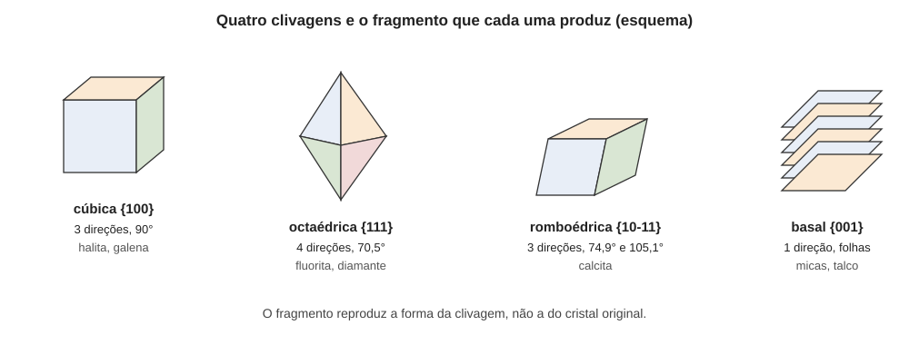

# Aula 02: Clivagem, partição e fratura

**ID:** mineralogia-m13-a02
**Módulo:** [[13-propriedades-fisicas-modulo|Módulo 13 — Propriedades físicas e identificação macroscópica]]
**Duração estimada:** ~30 min
**Nível:** ensino médio, sem geologia prévia (contrato `ensino-medio-sem-geologia-v1`)
**Objetivo:** distinguir clivagem, partição, fratura e face cristalina num espécime; relacionar cada clivagem a uma forma {hkl} e à ligação mais fraca da estrutura; calcular o ângulo entre planos de clivagem de um mineral cúbico.
**Pré-requisito:** [[01-fundamentos-quimicos-aula-05-ligacoes-fracas-e-minerais-com-mais-de-uma-ligacao|módulo 01, aula 05]] (clivagem e ligação fraca), [[05-miller-e-projecao-aula-02-indices-de-miller-de-interceptos-a-hkl-e-formas|módulo 05, aula 02]] (índices de Miller e formas {hkl}), [[11-estrutura-dos-silicatos-aula-04-da-estrutura-a-propriedade-clivagem-habito-e-densidade|módulo 11, aula 04]] (clivagem dos silicatos) e [[12-defeitos-e-maclas-aula-04-maclas-definicao-elemento-de-macla-e-tipos|módulo 12, aula 04]] (planos de macla).

## Vocabulário desta aula

| Termo | O que quer dizer |
|---|---|
| **clivagem** | tendência de um cristal a se partir em superfícies planas, sempre paralelas a planos cristalográficos definidos, em qualquer fragmento. |
| **partição** | separação do espécime ao longo de planos de fraqueza que não são planos de ligação fraca da estrutura, e sim planos de macla, de exsolução ou de deformação. |
| **fratura** | quebra em superfície que não segue plano cristalográfico. |
| **direção de clivagem** | cada família de planos paralelos de clivagem; um par de faces paralelas conta uma vez. |
| **conchoidal** | fratura de superfícies curvas e lisas, com ondulações como as de uma concha, típica do vidro quebrado. |
| **forma {hkl}** | conjunto de planos equivalentes por simetria; {100}, no cubo, são os três pares de faces do cubo (módulo 05). |

## Antes de começar, você precisa saber

- Que um cristal se parte onde as ligações por área de plano são mais fracas ou menos numerosas (módulo 01, aula 05; módulo 11, aula 04).
- Índices de Miller, e que {hkl} agrupa os planos equivalentes pela simetria da classe (módulo 05).
- **Matemática reativada:** o ângulo entre dois planos de um cristal cúbico, com índices (h₁k₁l₁) e (h₂k₂l₂), é o ângulo entre os vetores [h₁k₁l₁] e [h₂k₂l₂] (no cubo, a normal ao plano tem os mesmos índices): cos θ = (h₁h₂ + k₁k₂ + l₁l₂) / (√(h₁²+k₁²+l₁²) · √(h₂²+k₂²+l₂²)). Em outros sistemas a fórmula é mais longa (módulo 05); aqui só o cúbico.

## Ao final você vai conseguir

- `mineralogia-m13-oa02` — Relacionar clivagem, partição e fratura à estrutura e à ligação, e expressar a clivagem em notação de forma {hkl}.

## Conteúdo

### Clivagem: a quebra que obedece à estrutura

Bata num cristal de halita: ele se parte em fragmentos cada vez menores que continuam **cúbicos**, todos com faces lisas e perpendiculares entre si. Bata num cristal de quartzo: o resultado são cacos de superfícies curvas. Essa diferença é a clivagem. O quartzo tem o arcabouço de Si–O forte em todas as direções, e a halita tem planos que se separam mais facilmente que os outros (porque cada plano {100} corta menos ligações por área do que os demais; módulo 01, aula 05).

A clivagem é uma propriedade **da estrutura**, por isso se repete em todos os cristais da espécie e se descreve por três informações: **o número de direções**, a **qualidade** e os **índices {hkl}** (com os ângulos entre as direções).

**Qualidade.** Costuma ser dada em graus: **perfeita** (superfícies planas e brilhantes, obtidas com facilidade; micas, calcita, halita), **boa** ou **distinta** (planos nítidos, mas com alguma fratura entre eles; piroxênios), **imperfeita** ou **pobre** (planos difíceis de ver, como na olivina e no berilo) e **ausente** (quartzo, granada). Os graus não são escala de laboratório, são uma convenção de descrição, e variam de autor para autor.

**Número de direções.** O número de direções é o de **pares** de planos paralelos. A forma {100} do cubo, com seis faces, dá **3** direções; a forma {111}, o octaedro, com oito faces, dá **4**; {110}, o dodecaedro rômbico, com doze faces, dá **6**; o romboedro, com seis faces, dá **3**; o pinacoide {001}, **1**.

*Figura 2. Fragmentos típicos de quatro clivagens: cúbica {100} (halita, galena), octaédrica {111} (fluorita), romboédrica (calcita) e basal {001} em folhas (mica). O que observar: o fragmento reproduz a forma cristalográfica da clivagem, e não a forma original do cristal.*

### A tabela de referência

| Mineral | Clivagem | Direções | Ângulos entre as direções |
|---|---|---|---|
| halita, galena | {100}, perfeita | 3 | 90° |
| fluorita, diamante | {111}, perfeita | 4 | 70,5° entre planos (109,5° entre faces adjacentes do octaedro) |
| esfalerita | {110}, perfeita | 6 | 60° e 90° |
| calcita | romboédrica, {10-11}, perfeita (na cela estrutural, {10-14}) | 3 | as faces se cortam a 74,9° e a 105,1° (ângulos suplementares, nas arestas agudas e obtusas do romboedro) |
| micas, talco | {001}, perfeita | 1 | — |
| feldspatos | {001} perfeita e {010} boa | 2 | cerca de 90° |
| piroxênios | {110}, boa | 2 | ~87° e ~93° |
| anfibólios | {110}, perfeita a boa | 2 | ~56° e ~124° |
| quartzo, granada | ausente | 0 | — |

Observações. A calcita tem a mesma clivagem em duas notações: {10-11} na cela morfológica antiga e {10-14} na cela estrutural, de c ≈ 17,06 Å (módulo 05, aula 03); é o mesmo plano. O diamante tem clivagem perfeita {111}, mesmo com as ligações C–C iguais em todas as direções: nos planos {111}, a densidade de ligações a romper por área é menor (módulo 01, aula 05). O topázio, que parece compacto, tem uma clivagem perfeita {001}, de uma só direção; uma gema de topázio quebra em um golpe, e a vulnerabilidade vem desse plano, e não da dureza.

### Face ou clivagem?

Uma face cristalina é a superfície natural do cristal, formada durante o crescimento; a clivagem é uma superfície artificial, aberta pelo golpe ou pela tensão. Para distinguir, gire o espécime sob luz forte. **Clivagem:** várias superfícies planas e paralelas, em **degraus**, que acendem juntas ao mesmo ângulo; e os fragmentos reproduzem a clivagem. **Face de crescimento:** em geral única, às vezes com estrias, marcas de crescimento ou figuras de corrosão, e não se repete em escada dentro do cristal.

### Partição: a fraqueza do espécime, não da espécie

Alguns espécimes se separam em superfícies planas **sem** terem clivagem naquela direção. É a **partição**. Ela segue planos onde houve maclagem polissintética (módulo 12, aula 04), exsolução de lamelas ou deformação: planos de macla ou de lamelas funcionam como fraquezas. Exemplos descritos: o **coríndon** (partição basal {0001} e romboédrica {10-11}, ao longo de lamelas de macla e de lamelas de böhmita exsolvida nesses planos, como registrado no módulo 12; ele não tem clivagem), a **magnetita** (partição {111}) e alguns **piroxênios**. A distinção que importa: a **clivagem** existe em todo cristal sem defeito da espécie; a **partição** só nos espécimes que têm maclas, lamelas ou deformação no plano, e não aparece em todos os fragmentos. Uma partição de superfície menos lisa, que desaparece quando o cristal não é maclado, é a pista.

### Fratura: quando nenhum plano é mais fraco

Onde não há plano de fraqueza, a quebra segue o caminho de menor resistência local, e a superfície é descrita assim:

| Tipo | Aparência | Exemplo |
|---|---|---|
| **conchoidal** | curva e lisa, em ondas concêntricas | quartzo, obsidiana (vidro vulcânico), opala |
| **irregular** | rugosa, sem padrão | muitos minerais |
| **serrilhada** (hackly) | pontas afiadas e irregulares, de metal que se rasga | cobre nativo, prata e ouro |
| **estilhaçada** | em lascas e farpas | crisotila, algumas gipsitas |
| **terrosa** | como barro seco; esfarela | minerais de alteração, caulinita |

O vidro e a opala (sólidos sem ordem de longo alcance) quebram em fratura conchoidal, por isso a fratura conchoidal não indica cristal.

### Cuidado com o golpe

Para ver clivagem, não se quebra espécime de coleção: o dano é permanente. Se for preciso quebrar um fragmento de material sem valor, usem-se **óculos de proteção**, e o fragmento se protege num pano.

## Exemplo trabalhado

**Problema.** (a) Um mineral se parte em fragmentos de 3 direções perpendiculares entre si; que {hkl}? (b) Qual o ângulo entre os planos (111) e (11-1) de um cristal cúbico, e entre (110) e (1-10)? E entre (110) e (101)? (c) Uma gema de topázio, de dureza 8, quebrou-se ao ser batida de lado. Por quê?

**(a)** Três direções a 90° → **{100}**, a forma do cubo, com 3 pares de faces paralelas. Isso reduz as possibilidades (halita, galena e outros), mas não identifica a espécie: é preciso mais propriedades.

**(b)** (111) e (11-1): cos θ = (1·1 + 1·1 + 1·(−1)) / (√3 · √3) = 1/3 → θ = **70,53°** entre as normais; o ângulo interno entre faces adjacentes de um octaedro é 180° − 70,53° = **109,47°**. (110) e (1-10): cos θ = (1 − 1 + 0) / (√2 · √2) = 0 → **90°**. E (110) e (101): cos θ = 1/2 → **60°**. Esses são os dois ângulos da clivagem dodecaédrica da esfalerita.

**(c)** O topázio tem uma clivagem perfeita {001}. A dureza mede a resistência a riscar; a clivagem, a facilidade de partir num plano. Um mineral duro pode quebrar-se fácil: a dureza e a clivagem são propriedades distintas (a aula 03 aprofunda isso).

**Método geral:** (1) a superfície é plana? Repete-se em degraus e em vários fragmentos (clivagem) ou só em planos de macla e lamelas (partição)? (2) Conte as direções (pares de planos paralelos). (3) Dê a qualidade. (4) Se a forma é conhecida, escreva {hkl} e confira o ângulo.

## Erros comuns

- **Confundir clivagem com face cristalina.** A face é do crescimento; a clivagem se repete em degraus e em todo fragmento.
- **Contar as faces em vez das direções.** O cubo tem 6 faces e 3 direções; o octaedro, 8 faces e 4 direções.
- **Chamar de clivagem a partição do coríndon.** O coríndon não tem clivagem; a separação plana é partição.
- **Achar que mineral duro não quebra.** Topázio e diamante, duros, têm clivagem perfeita.
- **Achar que fratura conchoidal é sinal de cristal.** Vidros e opala (sem ordem de longo alcance) também a têm.

## O que não concluir

- Que o ângulo de clivagem, sozinho, identifique a espécie: ele separa famílias (piroxênio de anfibólio), mas várias espécies partilham a mesma clivagem.
- Que a ausência de clivagem seja ausência de plano mais fraco que outros: significa que nenhum se destaca o bastante para guiar a quebra.
- Que toda superfície plana lisa de um espécime seja clivagem.

## Recap relâmpago

- Clivagem: quebra em planos cristalográficos definidos, de qualquer fragmento, determinada pela estrutura; descrita por número de direções (pares de planos), qualidade e {hkl}.
- Direções: {100} = 3; {111} = 4; {110} = 6; romboedro = 3; {001} = 1.
- Partição: separação plana do espécime em planos de macla, exsolução ou deformação; fratura: conchoidal, irregular, serrilhada, estilhaçada, terrosa.
- Ângulos cúbicos: {111} 70,53° entre normais (109,47° interno); {110} 60° e 90°.
- Dureza e clivagem são propriedades diferentes: o topázio é duro e tem clivagem perfeita.

## Próxima aula

Em [[13-propriedades-fisicas-aula-03-dureza-e-tenacidade|Aula 03 — Dureza e tenacidade]], a pergunta é outra: não onde o mineral se parte, mas quanto ele resiste a ser riscado e a ser quebrado.

## Fontes consultadas

- Klein & Dutrow, *Manual of Mineral Science*, 23ª ed., e Nesse, *Introduction to Mineralogy* (clivagem, partição, fratura).
- Clivagens da halita, galena, fluorita, esfalerita, calcita, micas, feldspatos, piroxênios e anfibólios: confirmadas por busca em 2026-10-07 (Wikipedia, *Cleavage (crystal)*; Univ. Notre Dame, *Cleavage*; MSA, chave de identificação); piroxênios e anfibólios, módulo 11, aula 04.
- Ângulos de clivagem da calcita (74,94° / 105,06°) calculados em Python com a cela a = 4,9896 Å, c = 17,0610 Å (módulo 06, aula 04), plano (104) da cela estrutural; fluorita 70,53° e esfalerita 60°/90° pelo produto escalar no cubo. Recalculados na auditoria de 2026-10-07 (o mesmo 74,94° sai da cela morfológica, com {10-11} e c/a = 0,855).
- Qualidade das clivagens: *Handbook of Mineralogy* (augita, jadeíta: {110} boa, ~87°; tremolita e magnesio-hornblenda: {110} perfeita, actinolita: boa, 56°/124°; ortoclásio {001} e {010}; topázio {001} perfeita; forsterita, faialita e berilo imperfeitas; quartzo "raramente observável"), lido em 2026-10-07.
- Partição do coríndon ({0001} e {10-11}, "from exsolved böhmite") e da magnetita ({111}, "very good"): *Handbook of Mineralogy*, verbetes corundum e magnetite, lidos em 2026-10-07; coerente com o módulo 12 (auditoria, achado 11).

<!--
nivel: ensino-medio-sem-geologia-v1
palavras_corpo: 1458
cobertura:
  mineralogia-m13-oa02: [Conteúdo, Exemplo trabalhado]
figuras:
  - 13-propriedades-fisicas-fig-02-clivagem-e-formas.svg
alegacoes_auditaveis:
  - claim_id: PRF-CLIV-DIRECOES-001
    claim: "Numero de direcoes de clivagem = pares de planos paralelos da forma: {100} 3; {111} 4; {110} 6; romboedro 3; {001} 1."
    risk: conceito
    source: "Klein & Dutrow; modulo 05 aula 02"
    audit: "verificado em 2026-10-07 (pares de planos paralelos; recontado)"
  - claim_id: PRF-CLIV-TABELA-001
    claim: "Halita e galena {100}; fluorita e diamante {111}; esfalerita {110} (6 direcoes); calcita romboedrica; micas e talco {001}; feldspatos {001} perfeita e {010} boa, ~90 graus; piroxenios {110} boa; anfibolios {110} perfeita a boa; quartzo e granada sem clivagem; topazio {001} perfeita."
    risk: fato
    source: "Handbook of Mineralogy; Wikipedia Cleavage (crystal); MSA"
    audit: "verificado em 2026-10-07 (HoM halita, galena, fluorita, diamante, esfalerita, calcita, micas, talco, topazio, ortoclasio; quartzo raramente observavel; anfibolios ajustados pelo achado 2)"
  - claim_id: PRF-CLIV-ANGULO-001
    claim: "Fluorita: 70,53 graus entre normais de {111} (109,47 entre faces adjacentes do octaedro); esfalerita {110}: 60 e 90 graus; calcita: as faces de clivagem se cortam a 74,94 e a 105,06 graus (suplementares; cela a=4,9896, c=17,0610, plano 104)."
    risk: numero
    source: "calculo em Python (2026-10-07)"
    audit: "corrigido em 2026-10-07 (achado 3: a calcita tem os dois diedros, 74,94 e 105,06; contas refeitas em Python)"
  - claim_id: PRF-CLIV-CALCITA-001
    claim: "Clivagem da calcita {10-11} na cela morfologica antiga e {10-14} na cela estrutural (c ~17,06); mesmo plano."
    risk: fato
    source: "modulo 05 aula 03"
    audit: "verificado em 2026-10-07 (HoM calcite {10-11}; modulo 05 aula 03; mesmo 74,94 graus nas duas celas, Python)"
  - claim_id: PRF-CLIV-DIAMANTE-001
    claim: "Diamante tem clivagem perfeita {111} mesmo com ligacoes iguais em todas as direcoes, pela menor densidade de ligacoes por area nos planos {111}."
    risk: conceito
    source: "modulo 01 aula 05"
    audit: "verificado em 2026-10-07 (HoM diamond {111} perfect; modulo 01 aula 05)"
  - claim_id: PRF-CLIV-PARTICAO-001
    claim: "Particao: separacao plana do espécime em planos de macla polissintetica, exsolucao ou deformacao; corindon (basal {0001} e romboedrica {10-11}, ao longo de lamelas de macla e de bohmita exsolvida; sem clivagem), magnetita ({111}) e alguns piroxenios; nao aparece em todos os fragmentos."
    risk: fato
    source: "Klein & Dutrow; Handbook of Mineralogy (conferido na auditoria de 2026-10-07)"
    audit: "corrigido em 2026-10-07 (achado 4: particao do corindon ao longo de lamelas de macla e de bohmita exsolvida; HoM e modulo 12)"
  - claim_id: PRF-CLIV-FRATURA-001
    claim: "Tipos de fratura: conchoidal (quartzo, obsidiana, opala), irregular, serrilhada (metais nativos), estilhacada, terrosa; fratura conchoidal tambem em solidos sem ordem de longo alcance."
    risk: fato
    source: "Klein & Dutrow"
    audit: "verificado em 2026-10-07 (HoM: quartzo conchoidal; cobre, ouro e prata hackly; gipsita splintery)"
  - claim_id: PRF-CLIV-ANFIB-001
    claim: "Qualidade da clivagem {110}: piroxenios boa (~87/93 graus); anfibolios perfeita a boa (~56/124 graus)."
    risk: fato
    source: "HoM augita, jadeita, tremolita, magnesio-hornblenda, actinolita"
    audit: "corrigido em 2026-10-07 (achado 2)"
  - claim_id: PRF-FIG02-ROMBO-001
    claim: "Figura 2: o fragmento de clivagem romboedrica e um romboedro de faces obliquas (rombos de ~78/102 graus), nao uma caixa de faces retangulares."
    risk: conceito
    source: "calculo em Python (angulo plano da face: 78,1/101,9 graus)"
    audit: "corrigido em 2026-10-07 (achado 5)"
  - claim_id: PRF-CLIV-DIDAT-001
    claim: "Acrescentado na revisao didatica: obsidiana = vidro vulcanico; o enunciado do exemplo (b) passou a pedir tambem o angulo (110)/(101), 60 graus, que a resolucao ja dava."
    risk: fato
    source: "Klein & Dutrow; calculo do proprio exemplo"
    audit: "verificado em 2026-10-07, segunda passagem (obsidiana = vidro vulcanico; Python: (110)/(101) = 60,00 graus)"
-->
