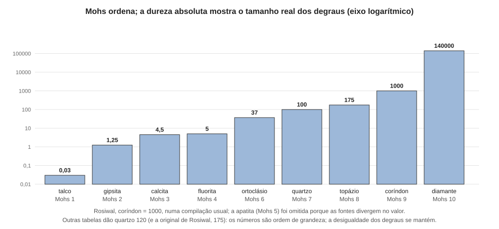

# Aula 03: Dureza e tenacidade

**ID:** mineralogia-m13-a03
**Módulo:** [[13-propriedades-fisicas-modulo|Módulo 13 — Propriedades físicas e identificação macroscópica]]
**Duração estimada:** ~30 min
**Nível:** ensino médio, sem geologia prévia (contrato `ensino-medio-sem-geologia-v1`)
**Objetivo:** distinguir dureza relativa (Mohs), dureza absoluta e tenacidade; explicar a dureza pela ligação e pela direção; testar a dureza de um espécime com segurança e interpretar o resultado como intervalo.
**Pré-requisito:** [[01-fundamentos-quimicos-aula-04-ligacao-ionica-covalente-e-metalica-como-espectro|módulo 01, aula 04]] (tipos de ligação) e [[13-propriedades-fisicas-aula-02-clivagem-particao-e-fratura|aula 02]] (clivagem).

## Vocabulário desta aula

| Termo | O que quer dizer |
|---|---|
| **dureza de risco (Mohs)** | resistência da superfície a ser riscada; é expressa pela posição numa escala de dez minerais de referência. |
| **escala ordinal** | escala que só ordena (1 < 2 < 3...), sem que a distância entre degraus seja constante. |
| **dureza absoluta** | dureza medida num aparelho, com número que permite comparar intervalos (Rosiwal; Vickers; Knoop). |
| **microdureza por indentação** | dureza medida pressionando uma ponta de diamante com carga conhecida e medindo a marca deixada. |
| **tenacidade** | resistência do mineral a quebrar, curvar ou rasgar (diferente de dureza). |
| **anisotropia** | propriedade que varia com a direção do cristal. |

## Antes de começar, você precisa saber

- Que as ligações covalentes são em geral as mais fortes e as fracas (van der Waals) as mais fracas, e que o diamante (dureza 10) e o grafite (1 a 2) têm o mesmo elemento (módulo 01, aulas 04 e 05).
- Que clivagem é a facilidade de partir em plano; aqui se separa isso de risco.

## Ao final você vai conseguir

- `mineralogia-m13-oa03` — Distinguir dureza relativa (Mohs), dureza absoluta e tenacidade, e explicar a anisotropia de dureza.

## Conteúdo

### A escala de Mohs: dez minerais de referência

Em 1812, Friedrich Mohs propôs ordenar a resistência ao risco por dez minerais de referência. Se o mineral A risca o B, A é mais duro. Os dez, do mais mole ao mais duro:

| 1 | 2 | 3 | 4 | 5 | 6 | 7 | 8 | 9 | 10 |
|---|---|---|---|---|---|---|---|---|---|
| talco | gipsita | calcita | fluorita | apatita | ortoclásio | quartzo | topázio | coríndon | diamante |

A escala é **ordinal**: dizer que o quartzo (7) é mais duro que a fluorita (4) é um fato, mas dizer que ele é "quase duas vezes mais duro" é um erro. Os degraus são desiguais.

### Dureza absoluta: o tamanho real dos degraus

Medida num aparelho, a dureza mostra o tamanho dos degraus. Na escala de **Rosiwal** (resistência ao desgaste por abrasão), com o coríndon valendo 1 000, uma compilação muito citada dá: talco 0,03; gipsita 1,25; calcita 4,5; fluorita 5; ortoclásio 37; quartzo 100; topázio 175; coríndon 1 000; diamante 140 000. As tabelas não concordam em todos os números: o quartzo vale 100 nessa compilação, 120 em outras e 175 na primeira tabela do próprio Rosiwal (1892–1895); a apatita aparece como 5,5 ou 6,5 (por isso não é dada aqui). Concordam o coríndon = 1 000, o diamante 140 vezes mais duro que ele e a forma da curva; leia os números como **ordem de grandeza** (as tabelas completas estão nas Fontes).

*Figura 3. Os nove minerais de referência com valor de Rosiwal na compilação adotada no texto, em eixo logarítmico (cada divisão é dez vezes a anterior). O que observar: os degraus de Mohs, todos iguais a 1, correspondem a saltos muito desiguais; o do coríndon ao diamante é, de longe, o maior.*

Outros métodos dão outros números: com o **esclerômetro** (aparelho que risca a superfície com uma ponta de diamante sob carga controlada), uma tabela dá 400 ao coríndon e 1 500 ao diamante. O número muda com o método; a **ordem** e a **desigualdade** dos degraus, não. Daí a regra: use Mohs para **ordenar**, nunca para somar nem tirar razão.

Nos laboratórios, a dureza também se mede por **indentação**: uma ponta de diamante pressiona a superfície com carga conhecida, e a dureza sai do tamanho da marca (testes de **Vickers** e **Knoop**). É a **microdureza**, medida em fragmentos diminutos e polidos: o método de pesquisa; o risco de Mohs é o de campo.

### Por que cada mineral tem a sua dureza

Riscar é deslocar ou romper ligações na superfície. A dureza cresce com a força das ligações e com o número delas por volume. Duas regras do módulo 01:

- **Tipo de ligação.** Covalente forte nas três direções (diamante, 10), arcabouço de Si–O (quartzo, 7); iônica média (calcita, 3); van der Waals entre lâminas (talco, 1).
- **Íons pequenos e de carga alta** aproximam e ligam mais forte (a halita, íons de carga 1, é 2,5; o coríndon, Al³⁺ e O²⁻, 9).

Dentro de uma mesma composição, o arranjo decide: o carbono é 10 como diamante e 1 a 2 como grafite (módulo 10). A calcita (3) e a aragonita (3,5 a 4), ambas CaCO₃, ilustram o mesmo efeito em escala menor (o polimorfismo, módulo 10).

### Anisotropia: o mesmo cristal, dureza diferente

A dureza varia com a **direção** no cristal, pelo mesmo motivo da clivagem (aula 02): as ligações que a ponta precisa romper mudam com a direção em que ela corre. O exemplo clássico é a **cianita**, Al₂SiO₅: ao longo do comprimento da lâmina, a dureza é cerca de 4,5 a 5,5; atravessando a lâmina, 6,5 a 7 (as fontes variam: o *Handbook of Mineralogy* dá 5,5 e 7). Uma agulha de aço risca a cianita ao longo, mas não a risca de través. Essa dupla dureza é um dos testes de campo para reconhecê-la. Em geral, a anisotropia é pequena e some no intervalo de Mohs; a cianita é lembrada porque é excepcionalmente grande. Por isso, e pela variação entre espécimes, as fichas dão a dureza em **intervalos**.

### Tenacidade: resistir a quebrar não é resistir a riscar

A **tenacidade** descreve como o mineral reage à força que o deforma ou o quebra:

| Termo | Comportamento | Exemplo |
|---|---|---|
| **frágil** | quebra ou se pulveriza com um golpe | quartzo, calcita, a maioria dos minerais iônicos e covalentes |
| **séctil** | pode ser cortado com faca, saindo lascas e deixando risco brilhante | acantita (argentita), cobre nativo, grafite |
| **maleável** | achata em lâmina sob o martelo | ouro, prata e cobre nativos |
| **dúctil** | estira em fio | ouro e cobre nativos |
| **flexível** | dobra e **fica** dobrado | selenita (gipsita), clorita, talco |
| **elástico** | dobra e **volta** à forma | moscovita |

O diamante é o mais duro e é **frágil**: um golpe de lado, no plano {111}, o parte. Já a **nefrita** (um agregado de anfibólio) e a **jadeíta** (um piroxênio), os dois materiais chamados jade, têm dureza mediana (6 a 7) e tenacidade excepcional: seus cristais finos se entrelaçam, e a trinca não encontra um plano para correr. Por isso o jade foi usado como ferramenta. Tenacidade, dureza e clivagem são **três propriedades distintas**, e é um erro de campo juntá-las.

### Como testar (e o que o teste faz com o espécime)

Para estimar a dureza, risca-se o espécime com objetos de dureza conhecida: **unha** (cerca de 2,5), **moeda de cobre** (cerca de 3), **lâmina de aço** (cerca de 5 a 5,5; o aço varia com a liga, e tabelas dão faixas de 4 a 5,5), **vidro** (5,5), **lima de aço** (6,5) e, no ápice, o próprio quartzo (7). O melhor é testar com os minerais de referência.

**Procedimento.** (1) Escolha uma superfície **fresca**, pequena e discreta, longe das faces melhores do espécime. (2) Pressione a ponta do objeto de teste contra o espécime e arraste; se puder, faça também o contrário (uma aresta do espécime no objeto). (3) Limpe com o dedo: se a marca sumir, era pó do mineral mais mole depositado, não risco. (4) Registre como **intervalo**: "risca vidro (5,5) mas não é riscado pelo quartzo (7)" → 5,5 a 7.

O teste **danifica**: não se risca gema nem espécime de coleção, e peças valiosas só se testam em local discreto, se for realmente necessário. O pó dos minerais não deve ser inalado, e nunca se testa um mineral fibroso de identidade desconhecida (aula 01).

## Exemplo trabalhado

**Problema.** (a) Um mineral é riscado pela moeda de cobre mas não pela unha. Qual o intervalo? (b) Um cristal em lâmina azul é riscado ao longo por um canivete de aço e não o é de través. Que mineral fica em hipótese? (c) Com os valores de Rosiwal, quantas vezes o quartzo é "mais duro" que o talco, e o diamante que o coríndon? Isso valida a leitura de Mohs como "uma unidade de diferença"?

**(a)** A unha (cerca de 2,5) não o risca, a moeda (cerca de 3) risca: dureza entre ~2,5 e ~3, ou seja, **~2,5 a 3**. Os valores dos objetos são aproximados, e o intervalo carrega essa incerteza.

**(b)** Lâmina azul, riscável numa direção e não na outra: a **cianita** é a hipótese (a dureza anisotrópica é uma pista forte, e não um diagnóstico isolado). Confirmar exige clivagem, densidade (aula 04) e outros testes (aula 09).

**(c)** 100 / 0,03 ≈ **3 300** vezes entre quartzo e talco (4 000 com o quartzo a 120), mas 6 degraus. Diamante / coríndon = 140 000 / 1 000 = **140** vezes, num degrau. Nos números de Rosiwal, o "mais um" de Mohs vale de cerca de 1,1 vez (calcita → fluorita, 5 / 4,5) a 140 vezes (coríndon → diamante), passando por 1,75 entre quartzo e topázio (175 / 100; 1,46 com o quartzo a 120). Os números mudam com a tabela, a conclusão não: a escala é ordinal e a leitura "uma unidade" é falsa.

**Método geral:** o procedimento da seção anterior, de baixo para cima na escala (objeto mais mole primeiro), registrando o intervalo e a direção; e lembre que a dureza não prevê a quebra.

## Erros comuns

- **Ler Mohs como escala numérica.** Dureza 6 não é o dobro de 3.
- **Confundir risco com mancha.** O pó do mineral mole fica no duro; limpe antes de concluir.
- **Confundir dureza com tenacidade.** Diamante: duro e frágil; jade: tenaz e de dureza média.
- **Testar uma superfície alterada.** A crosta de alteração é mais mole que o mineral; teste em superfície fresca.
- **Testar uma só direção num mineral anisotrópico.**

## O que não concluir

- Que dureza de Mohs 7 signifique "não quebra". A dureza só ordena a resistência ao risco.
- Que dois minerais com a mesma dureza sejam o mesmo mineral. A dureza reduz a lista, não identifica.
- Que um teste de uma amostra dê a dureza da espécie: o resultado é do espécime, na direção e no ponto testados.

## Recap relâmpago

- Mohs (1812): dez minerais de referência, escala **ordinal**; talco, gipsita, calcita, fluorita, apatita, ortoclásio, quartzo, topázio, coríndon, diamante.
- Dureza absoluta (Rosiwal, indentação por Vickers e Knoop) mostra degraus muito desiguais; o salto coríndon → diamante é o maior; os números variam com a tabela.
- A dureza vem do tipo de ligação, do tamanho e da carga dos íons e do arranjo (diamante × grafite).
- Anisotropia: as ligações a romper mudam com a direção; a cianita tem cerca de 4,5 a 5,5 ao longo e 6,5 a 7 de través.
- Tenacidade (frágil, séctil, maleável, dúctil, flexível, elástico) é outra propriedade; o teste de risco danifica e se registra como intervalo.

## Próxima aula

Em [[13-propriedades-fisicas-aula-04-densidade-medida-e-calculada|Aula 04 — Densidade: medida e calculada]], a propriedade mais fácil de quantificar em um espécime: quanto ele pesa pelo volume que ocupa.

## Fontes consultadas

- Klein & Dutrow, *Manual of Mineral Science*, 23ª ed. (escala de Mohs, tenacidade, anisotropia).
- Valores de Rosiwal para os minerais da escala: Wikipedia, *Rosiwal scale* (quartzo 100, apatita 5,5), por busca em 2026-10-07; a Wikipedia alemã (*Mohshärte*) dá quartzo 120 e apatita 6,5. Tabela original: A. Rosiwal, comunicação preliminar sobre o método de 1892 (separata P.S.479, p. 104–105) e "Ueber die Härte der Mineralien", *Monatsblätter des Wissenschaftlichen Club in Wien* 17 (1895), Korund = 1000: diamante 140 000, topázio 194, quartzo 175, adulária 59,2, apatita 8,0, calcita 5,6, halita 2,0, talco 0,04 (PDFs do acervo da GeoSphere Austria, opac.geologie.ac.at, lidos na auditoria de 2026-10-07). Tabela de esclerômetro (coríndon 400; diamante 1 500): Wikipedia, *Mohs scale of mineral hardness*, mesma data.
- Dureza de objetos comuns (cobre 2,5 a 3; vidro 5,5; aço de 4 a 5,5): Wikipedia (*Mohs scale*) e uso corrente; os valores variam, e a aula os declara aproximados.
- Cianita: *Handbook of Mineralogy* (5,5 ∥ [001]; 7 ∥ [100]) e fontes de identificação (4,5 a 5 ao longo; 6,5 a 7 de través), conferidos em 2026-10-07.
- Aragonita 3,5 a 4; jadeíta 6 a 7, "very tough when massive"; actinolita (nefrita) "tough in fibrous aggregates"; acantita e grafite sécteis; gipsita e clorita flexíveis e inelásticas; moscovita elástica; cobre, ouro e prata maleáveis e dúcteis; halita 2 a 2,5: *Handbook of Mineralogy*, verbetes lidos em 2026-10-07.

<!--
nivel: ensino-medio-sem-geologia-v1
palavras_corpo: 1643
cobertura:
  mineralogia-m13-oa03: [Conteúdo, Exemplo trabalhado]
figuras:
  - 13-propriedades-fisicas-fig-03-mohs-e-dureza-absoluta.svg
alegacoes_auditaveis:
  - claim_id: PRF-DUR-MOHS-001
    claim: "Escala de Mohs (1812): talco, gipsita, calcita, fluorita, apatita, ortoclasio, quartzo, topazio, corindon, diamante; escala ordinal com degraus desiguais."
    risk: fato
    source: "Klein & Dutrow; Wikipedia Mohs scale"
    audit: "verificado em 2026-10-07 (Klein & Dutrow; Wikipedia Mohs scale)"
  - claim_id: PRF-DUR-ROSIWAL-001
    claim: "Valores de Rosiwal numa compilacao usual (corindon = 1000): talco 0,03; gipsita 1,25; calcita 4,5; fluorita 5; ortoclasio 37; quartzo 100; topazio 175; corindon 1000; diamante 140000; outras compilacoes dao quartzo 120 e apatita 5,5 ou 6,5; a tabela original de Rosiwal (1892-1895) dava quartzo 175, topazio 194, adularia 59; numeros como ordem de grandeza."
    risk: numero
    source: "Wikipedia Rosiwal scale (busca 2026-10-07)"
    audit: "corrigido em 2026-10-07 (achado 6, controverso: compilacoes divergem no quartzo, 100 ou 120, e na apatita; tabela original de Rosiwal 1892/1895 da quartzo 175 e topazio 194; divergencia explicitada)"
  - claim_id: PRF-DUR-ESCLER-001
    claim: "Tabela de esclerometro citada na Wikipedia: corindon 400 e diamante 1500; o numero depende do metodo, a ordem e a desigualdade dos degraus se mantem."
    risk: numero
    source: "Wikipedia Mohs scale (busca 2026-10-07)"
    audit: "verificado em 2026-10-07 (Wikipedia Mohs scale: corindon 400, diamante 1500)"
  - claim_id: PRF-DUR-CALC-001
    claim: "Razoes de Rosiwal entre degraus: calcita->fluorita ~1,1; topazio/quartzo = 1,75 (1,46 com quartzo 120); diamante/corindon = 140; quartzo/talco ~3300 (4000 com quartzo 120)."
    risk: numero
    source: "calculo a partir dos valores de Rosiwal"
    audit: "verificado em 2026-10-07 (Python: 3333; 1,11; 1,75; 140; texto ampliado pelo achado 6 com quartzo 120: 4000 e 1,46)"
  - claim_id: PRF-DUR-CIANITA-001
    claim: "Cianita: dureza ~4,5-5,5 ao longo da lamina e ~6,5-7 de traves (HoM: 5,5 paralelo a [001], 7 paralelo a [100]); teste de campo."
    risk: numero
    source: "Wikipedia Kyanite; fontes de identificacao (busca 2026-10-07)"
    audit: "corrigido em 2026-10-07 (achado 7: HoM da 5,5 paralelo a [001] e 7 paralelo a [100]; faixa ampliada para 4,5-5,5)"
  - claim_id: PRF-DUR-LIGACAO-001
    claim: "Dureza cresce com forca e numero de ligacoes (diamante covalente 10; quartzo 7; calcita 3; talco 1); halita 2,5 e corindon 9 pela carga dos ions; diamante 10 x grafite 1-2; calcita 3 x aragonita 3,5-4."
    risk: fato
    source: "modulo 01 aulas 04-05; Handbook of Mineralogy (aragonita, conferido na auditoria de 2026-10-07)"
    audit: "verificado em 2026-10-07 (HoM: halita 2-2,5, corindon 9, aragonita 3,5-4, grafite 1-2)"
  - claim_id: PRF-DUR-TENAC-001
    claim: "Tenacidade: frágil, sectil (acantita, cobre nativo, grafite), maleavel e ductil (ouro, prata, cobre), flexivel (selenita, clorita, talco), elastico (moscovita); diamante duro e fragil; nefrita e jadeita tenazes (dureza 6-7) por cristais finos entrelacados."
    risk: fato
    source: "Klein & Dutrow (conferido na auditoria de 2026-10-07)"
    audit: "verificado em 2026-10-07 (HoM: acantita e grafite secteis; gipsita flexivel inelastica; moscovita elastica; jadeita very tough; actinolita/nefrita tough)"
  - claim_id: PRF-DUR-OBJETOS-001
    claim: "Objetos de teste: unha ~2,5; moeda de cobre ~3; lamina de aco ~5-5,5 (varia 4-5,5); vidro 5,5; lima de aco ~6,5; valores aproximados."
    risk: numero
    source: "Wikipedia Mohs scale (cobre 2,5-3; aco 4-4,5; vidro 5,5); uso corrente"
    audit: "verificado em 2026-10-07 (Wikipedia Mohs scale; valores aproximados e declarados)"
  - claim_id: PRF-DUR-DIDAT-001
    claim: "Acrescentado na revisao didatica: a anisotropia de dureza tem a mesma causa da clivagem (as ligacoes que a ponta rompe mudam com a direcao do risco); esclerometro = aparelho que risca a superficie com ponta de diamante sob carga controlada; nefrita = agregado de anfibolio e jadeita = piroxenio, os dois chamados jade; o detalhe da tabela original de Rosiwal (topazio 194, adularia 59, halita no lugar da gipsita) passou do corpo para as Fontes, ficando no corpo a divergencia do quartzo (100, 120, 175) e da apatita."
    risk: conceito
    source: "Klein & Dutrow (anisotropia de dureza); modulo 11 (anfibolios e piroxenios); Wikipedia Mohs scale (esclerometro)"
    audit: "verificado em 2026-10-07, segunda passagem (esclerometro de Turner: ponta de diamante com carga; nefrita = agregado de tremolita-actinolita, jadeita = piroxenio; anisotropia pela ligacao, Klein & Dutrow; detalhe de Rosiwal nas Fontes igual ao achado 6)"
-->
