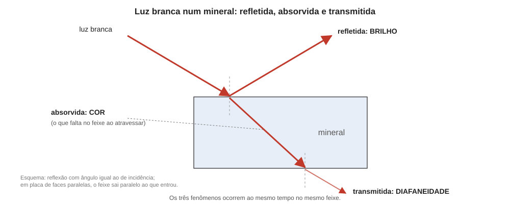

# Aula 05: Brilho, diafaneidade, cor e traço, Parte 1 — brilho e diafaneidade

**ID:** mineralogia-m13-a05
**Módulo:** [[13-propriedades-fisicas-modulo|Módulo 13 — Propriedades físicas e identificação macroscópica]]
**Duração estimada:** ~22 min
**Nível:** ensino médio, sem geologia prévia (contrato `ensino-medio-sem-geologia-v1`)
**Objetivo:** descrever o brilho e a diafaneidade de um espécime, explicar os dois pela luz que reflete na superfície e pela que atravessa o volume, e usá-los para separar os minerais opacos de brilho metálico dos demais.
**Pré-requisito:** [[13-propriedades-fisicas-aula-02-clivagem-particao-e-fratura|aula 02]] (superfícies de clivagem e de fratura) e [[01-fundamentos-quimicos-aula-04-ligacao-ionica-covalente-e-metalica-como-espectro|módulo 01, aula 04]] (ligação metálica: elétrons livres).
**Esta é a Parte 1.** A Parte 2 (cor e traço) vem na aula 06.

> Esta aula foi dividida em duas (brilho e diafaneidade; cor e traço) para caber em 30 minutos. A Parte 2 retoma a diafaneidade para explicar a cor e o traço.

## Vocabulário desta aula

| Termo | O que quer dizer |
|---|---|
| **brilho** | aparência da superfície do mineral sob luz refletida: intensidade e qualidade, sem relação com a cor. |
| **metálico** | brilho de metal polido, em minerais opacos. |
| **não metálico** | todos os brilhos que não são de metal (vítreo, resinoso, nacarado...). |
| **diafaneidade** | grau em que o mineral deixa a luz passar: transparente, translúcido ou opaco. |
| **índice de refração (n)** | número que mede o quanto a luz desacelera ao entrar num material (módulo 14, adiantado). |
| **superfície fresca** | superfície recém-exposta, sem película de alteração, onde se avalia o brilho. |

## Antes de começar, você precisa saber

- Que metais têm elétrons livres e conduzem corrente, e que isso explica o brilho típico de um metal (módulo 01, aula 04).
- Que a clivagem expõe superfícies lisas e a fratura expõe superfícies irregulares (aula 02).

## Ao final você vai conseguir

- `mineralogia-m13-oa05` — Descrever brilho, diafaneidade, cor (idiocromática, alocromática, pseudocromática) e traço, e explicar por que a cor é o critério menos confiável. (Parte 1: brilho e diafaneidade; a cor e o traço ficam na Parte 2.)

## Conteúdo

### O que acontece com a luz que chega ao mineral

Quando a luz branca incide num mineral, três coisas podem ocorrer: parte **reflete** na superfície, parte **é absorvida** (vira calor) e parte **atravessa** o volume e sai do outro lado. O **brilho** descreve a luz **refletida**; a **diafaneidade**, a luz que **passa**; e a **cor** (aula 06), as ondas (as "cores" do arco-íris) que foram absorvidas e as que sobraram. São três observações diferentes sobre o mesmo fenômeno. Elas se avaliam em **luz branca** e numa **superfície fresca**, porque a película de alteração (poeira, óxido, pátina) muda o brilho: uma galena recém-quebrada é metálica e uma galena alterada pode ser fosca.

### Brilho: metálico ou não metálico

A primeira separação é entre **metálico** e **não metálico**.

**Metálico.** Brilho de metal polido: opaco, muito refletivo. Ocorre em minerais com elétrons livres, ou quase livres (ligação metálica ou semimetálica; módulo 01): ouro, cobre nativo, pirita, galena, magnetita. O **submetálico** é metálico "baço", típico de minerais quase opacos de índice de refração muito alto, como cromita e cuprita.

**Não metálico.** Descrito pela **aparência**:

| Brilho | Aparência | Exemplo |
|---|---|---|
| **vítreo** | de vidro | quartzo, fluorita, a maioria dos silicatos |
| **resinoso** | de resina ou cera de vela | esfalerita clara, enxofre |
| **adamantino** | de diamante: cintilante, forte | diamante, cerussita, zircão |
| **nacarado** | de madrepérola: reflexos de camadas | talco, moscovita e apofilita, nos planos de clivagem |
| **sedoso** | de seda: faixas luminosas em fibras | gipsita fibrosa, malaquita fibrosa |
| **ceroso** | de cera, fosco e liso | calcedônia, serpentina |
| **gorduroso** | de óleo sobre a superfície | alguns espécimes de nefelina e quartzo leitoso |
| **terroso / fosco** | de barro seco, sem reflexo | caulinita, limonita terrosa |

**O que decide o brilho.** O brilho cresce com o **índice de refração** (n): quanto mais a luz desacelera ao entrar, mais ela é refletida na superfície. De forma aproximada, e com limites convencionais: **vítreo** para n de cerca de 1,3 a 1,9 (o quartzo tem n ≈ 1,54); **adamantino** de 1,9 a 2,6 (o diamante tem n ≈ 2,42); **submetálico** de 2,6 a 3; **metálico**, n acima de 3 (junto com a absorção forte). Esses limites são aproximados, e a classificação, por fim, é visual.

O brilho também depende da **superfície**: o nacarado só aparece nos planos de clivagem {001} das micas e do talco, e o mesmo cristal tem brilho vítreo nas faces de fratura. Descreva o brilho em **mais de uma superfície** quando houver diferença.

*Figura 4. Feixe de luz branca num mineral: a parte refletida define o brilho, a que atravessa define a diafaneidade, e a absorvida (a parcela que falta) define a cor. O que observar: os três fenômenos acontecem ao mesmo tempo.*

### Diafaneidade: o quanto a luz passa

Três graus:

- **Transparente:** enxerga-se um objeto nitidamente através do espécime (cristais de quartzo e fluorita sem fissuras).
- **Translúcido:** a luz passa, mas a imagem é difusa; só se vê claridade (ágata, esfalerita clara, calcita leitosa).
- **Opaco:** nenhuma luz passa, mesmo em lâminas finas (pirita, galena, magnetita, grafite).

A diafaneidade não é do mineral sozinho: depende da **espessura** (uma lâmina de quartzo leitoso fina deixa a luz passar, uma massa não), do estado do espécime (**fissuras, inclusões e poros** espalham a luz e tornam um cristal translúcido) e do tamanho dos grãos num agregado. Os minerais opacos são, em geral, os de brilho metálico, onde elétrons livres absorvem toda a luz; o **ouro** deixa passar luz verde-azulada numa folha muito fina, mas é opaco em qualquer espessura de espécime. Em lâminas de 0,03 mm (módulo 15), a maioria dos silicatos é transparente, e os sulfetos e óxidos metálicos continuam opacos, o que obriga a estudá-los em luz refletida (módulo 17).

**Não confunda** "opaco" com "fosco". Opaco é sobre a **luz que passa**; fosco é sobre o **brilho**. Uma hematita especular é opaca e metálica; uma hematita terrosa, vermelha, é opaca e fosca.

## Exemplo trabalhado

**Problema.** Descreva brilho e diafaneidade: (a) cristal cúbico dourado, que reflete como metal e não deixa passar luz nenhuma; (b) prisma incolor, que deixa ver uma letra através dele, brilhando como vidro; (c) cristal castanho-amarelado, que brilha como resina e deixa passar luz difusa; (d) massa pulverulenta, vermelha, sem nenhum reflexo, que mancha o dedo.

**(a)** Brilho **metálico**, **opaco**. Brilho e diafaneidade são compatíveis com pirita, calcopirita e outros sulfetos dourados (o hábito cúbico favorece a pirita: a calcopirita não forma cubos); a cor dourada **não** distingue (aula 06), e outras propriedades são necessárias.

**(b)** Brilho **vítreo**, **transparente**. É compatível com quartzo, mas também com outros minerais incolores e vítreos.

**(c)** Brilho **resinoso**, **translúcido**: a descrição que se lê para a esfalerita (ZnS). A esfalerita tem n alto (cerca de 2,4); o brilho resinoso a submetálico depende da cor e do teor de ferro. Repare: pelos limites da seção anterior, n ≈ 2,4 cairia no adamantino, e há espécimes claros de brilho adamantino; os limites são aproximados, e a classificação do brilho é visual. Isso é uma hipótese, e a identificação exige clivagem (seis direções, aula 02) e traço (aula 06).

**(d)** Brilho **terroso (fosco)**, **opaco**. Terroso descreve o aspecto da superfície, não identifica o mineral (hematita terrosa, limonita e outros).

**Método geral:** (1) superfície fresca, luz branca; (2) o mineral é opaco e metálico? Se sim, brilho metálico ou submetálico; (3) senão, nomeie o brilho não metálico pela aparência; (4) classifique a diafaneidade pela luz que passa, anotando a espessura; (5) registre se muda de superfície para superfície.

## Erros comuns

- **Chamar de "brilhante" todo mineral que reflete.** Brilho tem categorias; "brilhante" não descreve nada.
- **Confundir cor com brilho.** Ouro nativo e pirita são amarelos e metálicos, mas só um deles é ouro. Um brilho metálico dourado não é ouro.
- **Julgar o brilho numa superfície alterada.** Use superfície fresca.
- **Chamar de opaco um cristal que só está leitoso.** Se a luz passa, é translúcido.
- **Confundir opaco com fosco.**

## O que não concluir

- Que brilho metálico implique metal nativo. A pirita, a galena e a magnetita têm brilho metálico e são compostos.
- Que brilho adamantino implique diamante. Cerussita e zircão têm brilho adamantino.
- Que uma classificação de brilho seja objetiva: dois observadores podem divergir entre resinoso e ceroso, e por isso o brilho é pista, e não critério.

## Recap relâmpago

- A luz reflete (brilho), é absorvida (cor) e atravessa (diafaneidade).
- Metálico: opaco, de metal polido; submetálico: quase opaco. Não metálico, descrito pela aparência: vítreo, resinoso, adamantino, nacarado, sedoso, ceroso, gorduroso, terroso.
- O brilho cresce com o índice de refração (de forma aproximada, vítreo 1,3–1,9; adamantino 1,9–2,6; submetálico 2,6–3; metálico acima de 3).
- Diafaneidade: transparente, translúcido, opaco; depende de espessura, fissuras, inclusões e grãos.
- Opaco (luz) não é fosco (brilho).

## Próxima aula

Em [[13-propriedades-fisicas-aula-06-brilho-diafaneidade-cor-e-traco-parte-2-cor-e-traco|Aula 06 — Brilho, diafaneidade, cor e traço, Parte 2: cor e traço]], a parcela de luz absorvida: por que a cor engana, e por que a cor do pó é mais confiável que a do cristal.

## Fontes consultadas

- Klein & Dutrow, *Manual of Mineral Science*, 23ª ed. (brilho e diafaneidade).
- Limites de índice de refração por tipo de brilho (vítreo 1,3 a 1,9; adamantino 1,9 a 2,6; submetálico 2,6 a 3; metálico acima de 3): convenção de manuais de identificação, reproduzida por fontes de ensino (LibreTexts, *Gemology*, 7.05 Luster; webmineral, *Mineral Luster*), conferida na auditoria de 2026-10-07; a Wikipedia (*Lustre (mineralogy)*) só dá "1,9 ou mais" para o adamantino. Exemplos de brilho adamantino (cerussita, zircão) e submetálico (esfalerita, cuprita, cinábrio): Wikipedia, *Lustre (mineralogy)*, e *Handbook of Mineralogy* (cerussita "adamantine"; zircão "vitreous to adamantine"; cuprita "adamantine to submetallic"; cromita "metallic to submetallic").
- n do quartzo (~1,54) e do diamante (2,4175 a 589 nm, *Handbook of Mineralogy*); n da esfalerita, 2,369 (Na, ZnS), brilho "resinous to adamantine" e traço "pale brown to pale yellow and white": *Handbook of Mineralogy*, sphalerite, lido em 2026-10-07.
- Luz através de folha fina de ouro: o *Handbook of Mineralogy* (gold) registra "opaque in all but thinnest foils" e "blue and green in transmitted light".

<!--
nivel: ensino-medio-sem-geologia-v1
palavras_corpo: 1163
cobertura:
  mineralogia-m13-oa05: [Conteúdo, Exemplo trabalhado]
figuras:
  - 13-propriedades-fisicas-fig-04-luz-brilho-e-diafaneidade.svg
alegacoes_auditaveis:
  - claim_id: PRF-BRI-LUZ-001
    claim: "A luz que chega a um mineral e refletida (brilho), absorvida (cor) e transmitida (diafaneidade); avalia-se em luz branca e em superficie fresca."
    risk: conceito
    source: "Klein & Dutrow"
    audit: "verificado em 2026-10-07 (Klein & Dutrow)"
  - claim_id: PRF-BRI-IR-001
    claim: "Brilho e indice de refracao: vitreo 1,3-1,9; adamantino 1,9-2,6; submetalico 2,6-3; metalico acima de 3 (limites aproximados e convencionais); quartzo n ~1,54; diamante n ~2,42."
    risk: numero
    source: "Wikipedia Lustre (mineralogy), busca 2026-10-07; valores padrao"
    audit: "verificado em 2026-10-07 (convencao de manuais via LibreTexts e webmineral; a Wikipedia so da 1,9+ para adamantino; fonte da aula corrigida)"
  - claim_id: PRF-BRI-TIPOS-001
    claim: "Brilhos nao metalicos: vitreo (quartzo), resinoso (esfalerita clara, enxofre), adamantino (diamante, cerussita, zircao), nacarado (talco, moscovita, apofilita em {001}), sedoso (gipsita fibrosa), ceroso (calcedonia, serpentina), gorduroso, terroso (caulinita, limonita); submetalico (cromita, cuprita)."
    risk: fato
    source: "Klein & Dutrow; Wikipedia Lustre"
    audit: "verificado em 2026-10-07 (Wikipedia Lustre; HoM cerussita, zircao, cuprita, cromita, talco, moscovita)"
  - claim_id: PRF-BRI-DIAF-001
    claim: "Diafaneidade: transparente, translucido, opaco; depende de espessura, fissuras, inclusoes e granulacao; minerais opacos tem em geral brilho metalico; em lamina de 0,03 mm sulfetos e oxidos metalicos continuam opacos; ouro transmite luz verde-azulada em folha muito fina; opaco nao e fosco."
    risk: fato
    source: "Klein & Dutrow; modulos 15 e 17"
    audit: "verificado em 2026-10-07 (HoM gold: opaque in all but thinnest foils; blue and green in transmitted light)"
  - claim_id: PRF-BRI-ESFAL-001
    claim: "Esfalerita: brilho resinoso a submetalico conforme a cor e o teor de Fe; n ~2,4; clivagem {110} em seis direcoes."
    risk: numero
    source: "Handbook of Mineralogy (conferido na auditoria de 2026-10-07)"
    audit: "verificado em 2026-10-07 (HoM sphalerite: n 2,369; resinous to adamantine; {011} perfect)"
  - claim_id: PRF-BRI-COBRE-001
    claim: "Ouro nativo e pirita sao amarelos e metalicos; o cobre nativo e vermelho-cobre."
    risk: fato
    source: "Handbook of Mineralogy, copper e gold"
    audit: "corrigido em 2026-10-07 (achado 10)"
  - claim_id: PRF-BRI-CALCOP-001
    claim: "Brilho metalico e opacidade sao compativeis com pirita, calcopirita e outros sulfetos dourados; o habito cubico favorece a pirita (a calcopirita nao forma cubos)."
    risk: fato
    source: "Handbook of Mineralogy, pyrite e chalcopyrite"
    audit: "corrigido em 2026-10-07 (achado 11)"
  - claim_id: PRF-FIG04-OPTICA-001
    claim: "Figura 4: reflexao com angulo igual ao de incidencia; raio refratado reto dentro do mineral; em placa de faces paralelas o feixe transmitido sai paralelo ao incidente."
    risk: conceito
    source: "optica geometrica (lei da reflexao; lei de Snell)"
    audit: "corrigido em 2026-10-07 (achado 12)"
  - claim_id: PRF-BRI-DIDAT-001
    claim: "Acrescentado na revisao didatica: pelos limites convencionais, n ~2,4 da esfalerita cairia no adamantino; ha espécimes claros de brilho adamantino (HoM: resinous to adamantine), e a classificacao do brilho e visual."
    risk: conceito
    source: "Handbook of Mineralogy, sphalerite (ja citado nas Fontes da aula)"
    audit: "verificado em 2026-10-07, segunda passagem (HoM sphalerite: resinous to adamantine, n 2,369; Wikipedia: adamantina a resinosa, submetalica nas ricas em Fe)"
-->
