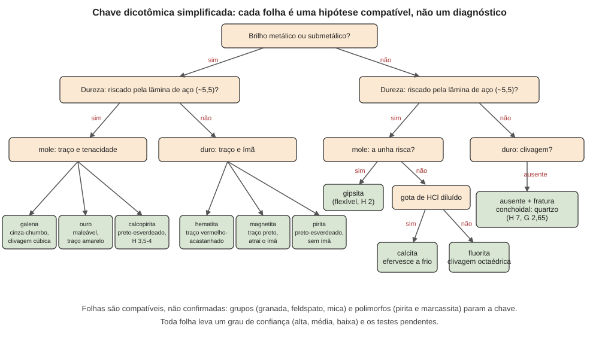

# Aula 09: A chave macroscópica e o grau de confiança da identificação

**ID:** mineralogia-m13-a07
**Módulo:** [[13-propriedades-fisicas-modulo|Módulo 13 — Propriedades físicas e identificação macroscópica]]
**Duração estimada:** ~28 min
**Nível:** ensino médio, sem geologia prévia (contrato `ensino-medio-sem-geologia-v1`)
**Objetivo:** aplicar uma chave de identificação macroscópica que combina as propriedades do módulo, e registrar o resultado com o que foi observado, o que ficou compatível, o que foi descartado, o grau de confiança e os testes que ainda faltam.
**Pré-requisito:** as aulas 01 a 08 deste módulo (hábito, clivagem, dureza, densidade, brilho, cor e traço, propriedades especiais), [[02-o-que-e-mineral-aula-03-especie-variedade-grupo-serie-e-nome-comercial|módulo 02, aula 03]] (espécie, variedade e grupo) e [[10-polimorfismo-aula-01-polimorfismo-transformacoes-reconstrutivas-e-deslocativas|módulo 10, aula 01]] (polimorfismo).

## Vocabulário desta aula

| Termo | O que quer dizer |
|---|---|
| **chave dicotômica** | sequência de perguntas de duas respostas, cada uma levando à seguinte, até uma ou poucas hipóteses. |
| **compatível** | que não é contradito por nenhuma observação, mas também não foi provado. |
| **confirmado** | identificação fechada por método que mede composição ou estrutura (difração, análise química), não por aparência. |
| **propriedade diagnóstica** | propriedade estável e discriminante (clivagem, dureza, densidade, traço). |
| **grau de confiança** | declaração, em palavras, de quão firme é a identificação e por quê. |
| **teste confirmatório pendente** | ensaio que ainda separaria a hipótese principal da alternativa mais próxima. |

## Antes de começar, você precisa saber

- Das aulas anteriores: que a cor e o hábito são pistas instáveis, e que clivagem, dureza, densidade e traço são mais estáveis (aulas 01 a 06).
- Que um grupo (granada, feldspato, mica) reúne espécies parecidas e que um polimorfo (pirita e marcassita) tem a mesma fórmula e outra estrutura (módulos 02 e 10).

## Ao final você vai conseguir

- `mineralogia-m13-oa07` — Aplicar uma chave de identificação macroscópica e declarar o grau de confiança e os testes confirmatórios pendentes.

## Conteúdo

### Identificar é inferir

Identificar um mineral a olho nu **não é reconhecê-lo, é inferir**. As observações (as aulas anteriores) são **fatos**; a lista de minerais que **cabem** nelas é uma **inferência**; e dizer "é a espécie X" é uma conclusão que só se fecha com método que **meça** composição ou estrutura. É uma escada de inferência, a mesma ideia que o curso usará para as texturas (módulos 25 a 27) e a catalogação (módulo 50), aqui aplicada à identificação: **observação → propriedades → hipóteses compatíveis → confirmação**. A honestidade da identificação está em dizer em que degrau ela parou.

### A ordem dos testes

Do que **não danifica** ao que danifica, e do mais estável ao menos estável:

1. **Observar** sem tocar: hábito e agregado, brilho, diafaneidade, cor (pistas, não critérios).
2. **Clivagem e fratura**: olhar as superfícies; contar direções e estimar ângulos.
3. **Densidade**: pesar no ar e na água (aula 04); não danifica.
4. **Dureza**: riscar um ponto discreto (aula 03); danifica pouco.
5. **Traço**: só em minerais menos duros que a placa (aula 06).
6. **Testes especiais**, se necessário: ímã, UV, ácido, água (aulas 07 e 08). Cada um tem seus perigos, e o ácido e a água danificam o espécime, como o teste de dureza.

Cada passo **reduz a lista**, e quase nunca chega a uma espécie sozinho.

### Uma chave simples

*Figura 5. Chave dicotômica para alguns minerais comuns: brilho (metálico ou não), dureza (riscado pela lâmina de aço, ~5,5, ou não) e uma propriedade final. O que observar: cada folha é uma hipótese, não um diagnóstico; os valores de dureza dividem os ramos, e os testes finais (traço, ímã, ácido, clivagem) fecham a folha.*

A chave da figura é um **modelo**: nenhuma chave cobre as mais de 6 mil espécies da lista da IMA (módulo 02, aula 04), e todas têm folhas que dizem "compatível com". Uma ficha de apoio com valores para a conferência:

| Mineral | Dureza | Densidade | Pistas finais |
|---|---|---|---|
| galena | ~2,5 | ~7,6 | clivagem cúbica; traço cinza-chumbo |
| ouro nativo | 2,5 a 3 | ~19 | maleável; traço amarelo |
| calcopirita | 3,5 a 4 | ~4,2 | traço preto-esverdeado; amarelo-latão |
| pirita | 6 a 6,5 | ~5,0 | frágil; traço preto-esverdeado; cubos estriados |
| magnetita | 5,5 a 6,5 | ~5,2 | traço preto; atraída pelo ímã |
| hematita | 5 a 6,5 | ~5,3 | traço vermelho-acastanhado |
| gipsita | 2 | ~2,3 | risca com a unha; flexível |
| calcita | 3 | 2,71 | efervesce a frio; 3 clivagens romboédricas |
| fluorita | 4 | ~3,18 | clivagem octaédrica; várias cores |
| quartzo | 7 | 2,65 | sem clivagem; fratura conchoidal |

(Valores aproximados, de literatura; as fichas e a auditoria os confirmam, e os intervalos de dureza refletem a variação entre espécimes e a anisotropia, aula 03.)

### Quando a chave para no grupo, ou no par de polimorfos

Para muitos minerais, as propriedades macroscópicas **não separam** as espécies:
- **Grupos:** granadas, feldspatos, micas, turmalinas, anfibólios e piroxênios têm membros que só química ou difração distinguem. A identificação macroscópica honesta é "granada" ou "plagioclásio" (módulo 02, aula 03).
- **Polimorfos:** pirita e marcassita (FeS₂) têm a mesma fórmula, quase a mesma dureza e densidade, e traço semelhante; calcita e aragonita diferem em dureza e densidade (aragonita, 3,5 a 4 e ~2,95), mas a diferença é pequena; e a tridimita e a cristobalita, polimorfos de alta temperatura da sílica que persistem metaestáveis em rochas vulcânicas (módulo 10), formam grãos pequenos que a olho nu não se separam com segurança do quartzo.

### O grau de confiança, em palavras

Em vez de um número, declara-se um **grau**, com a razão:

| Grau | Critério |
|---|---|
| **alta** | quatro ou mais propriedades **independentes e estáveis** concordam; a alternativa mais próxima foi **descartada** por um teste decisivo; a espécie não tem polimorfo ou parente indistinguível |
| **média** | as propriedades concordam, mas ao menos uma alternativa plausível **não foi descartada** |
| **baixa** | poucas propriedades, ou apoio principalmente em cor e hábito |

**Confirmado** é outra coisa: só vem de método analítico (difração de raios X, módulo 18; composição química, módulo 19). Mesmo "alta" é uma identificação **provável**, e deve vir com os **testes pendentes** que a fechariam.

O registro de um espécime tem, então, cinco campos: **observado**; **compatível com**; **descartado por**; **confiança**; **testes pendentes**. É o mesmo formato que o módulo 50 usa na ficha de coleção.

Os cursos irmãos tratam do mesmo tema em outro nível: curso-geologia, módulo 05, aulas 01 a 03, e curso-gemologia, módulo 01 (propriedades gemológicas), citados por nome.

## Exemplo trabalhado

**Problema.** Um espécime: cristais cúbicos, dourados, brilho metálico, faces com estrias; frágil; não é riscado por um canivete de aço, mas risca o vidro; densidade medida 5,0; traço preto-esverdeado; não atraído por ímã comum. (a) Que mineral é compatível? (b) Que alternativas foram descartadas e por quê? (c) Qual o grau de confiança e que teste está pendente? (d) Um segundo espécime: grão incolor, vítreo, sem clivagem, dureza ~7.

**(a)** Brilho metálico; dureza acima de ~5,5 (risca o vidro e resiste ao aço; nenhum teste fixou o limite de cima); densidade ~5,0; traço preto-esverdeado; sem atração: **pirita** é compatível (cubos estriados são típicos).

**(b)** **Ouro**: descartado por ser maleável (aqui, frágil), por densidade (~19) e por traço (amarelo). **Calcopirita**: descartada pela dureza (3,5 a 4; o canivete a riscaria). **Magnetita**: descartada pelo traço (preto) e por não ser atraída. **Hematita**: descartada pelo traço (vermelho-acastanhado).

**(c)** Confiança **média**: as propriedades independentes (dureza, densidade, traço, hábito) concordam e as alternativas comuns foram descartadas, **mas a marcassita** (FeS₂ ortorrômbica, polimorfo da pirita, de dureza e densidade quase iguais) **não foi descartada**: a densidade, que descartou o ouro, aqui não decide (pirita ~5,0, marcassita ~4,9). O cubo estriado favorece pirita, e é pista de **hábito**, instável. **Pendente:** difração de raios X ou análise química e estrutural em laboratório. Registro: "pirita provável (média); marcassita não excluída; confirmação pendente por DRX".

**(d)** Incolor, vítreo, sem clivagem, dureza ~7: **quartzo** é compatível, mas outros minerais incolores de dureza ≥ 7 (berilo, turmalina e topázio incolores) também cabem. O topázio tem clivagem basal perfeita, e não vê-la o torna menos provável, sem excluí-lo: um grão pequeno pode não mostrar a clivagem, e só descarta o que foi testado. Confiança **baixa**: só duas propriedades estáveis (dureza e ausência de clivagem), as outras são pistas (cor, brilho), e várias alternativas seguem abertas. O próximo teste é a densidade (quartzo 2,65), mas ela não fecha tudo: descarta o topázio (~3,5) e a turmalina incolor (~2,9 a 3,1), e separa mal o berilo (2,63 a 2,97, conforme o teor de álcalis), que pode ter a densidade do quartzo; para ele, o teste seguinte é o índice de refração (módulo 14 em diante) ou a difração.

**Método geral:** (1) observe sem danificar; (2) clivagem e fratura; (3) densidade; (4) dureza e traço; (5) testes especiais só se preciso; (6) liste compatíveis e descartados; (7) declare o grau e os testes pendentes.

## Erros comuns

- **Chamar de "identificação" uma lista de compatíveis.** A lista é uma hipótese.
- **Tratar a ausência de um teste como descarte.** Só descarta o que foi testado.
- **Contar duas vezes propriedades dependentes** (dureza e clivagem de uma mesma estrutura, por exemplo) como se fossem independentes.
- **Esquecer polimorfos e membros de grupo** ao declarar a confiança.
- **Deixar de registrar os testes pendentes.**

## O que não concluir

- Que uma identificação "alta" seja "confirmada". Ela é provável, e a confirmação é analítica.
- Que uma chave dicotômica funcione para qualquer espécime: espécimes alterados, misturados ou de composição incomum contrariam os valores de manual.
- Que a identificação macroscópica seja inútil: ela encurta muito o caminho, e a transparência sobre a confiança é o que a torna útil.

## Recap relâmpago

- Identificar é inferir: observação → propriedades → compatíveis → confirmação; macroscopicamente, quase nunca se chega à última.
- Ordem: observar, clivagem e fratura, densidade, dureza, traço, testes especiais (do não destrutivo ao destrutivo; do estável ao instável).
- Chave dicotômica: brilho → dureza → propriedade final; cada folha é uma hipótese.
- Grupos e polimorfos (pirita × marcassita) param a chave; grau **alta/média/baixa** com a razão; **confirmado** só por método analítico.
- Registro: observado, compatível com, descartado por, confiança, testes pendentes.

## Próxima aula

O módulo 13 termina aqui. O módulo 14, [[14-optica-fisica-modulo|Óptica física para mineralogia: luz, refração, polarização e interferência]], dá a base física das propriedades de luz que aqui foram só descritas, a caminho do microscópio petrográfico.

## Fontes consultadas

- Klein & Dutrow, *Manual of Mineral Science*, 23ª ed., e Nesse, *Introduction to Mineralogy* (chaves de identificação, ordem dos testes).
- Valores da ficha de apoio (dureza e densidade de galena, ouro, calcopirita, pirita, magnetita, hematita, gipsita, calcita, fluorita, quartzo): *Handbook of Mineralogy*, verbetes lidos na auditoria de 2026-10-07 (galena 2,5–2,75 e 7,58; ouro 2,5–3 e 19,3; calcopirita 3,5–4 e 4,1–4,3; pirita 6–6,5 e 5,018; magnetita 5,5–6,5 e 5,175; hematita 5–6 e 5,26, com 5,5–6,5 em outras bases; gipsita 1,5–2 e 2,317; calcita 3 e 2,710; fluorita 4 e 3,18; quartzo 7 e 2,65). Marcassita (FeS₂): dureza 6 a 6,5, densidade 4,887, traço "grayish or brownish black"; aragonita 3,5–4 e 2,95: *Handbook of Mineralogy*, mesma data. Exemplo (d), lidos na segunda passagem da auditoria (2026-10-07): berilo, dureza 7,5–8, D(meas.) 2,63–2,97 "increasing with alkali content" (D(calc.) 2,640); topázio, dureza 8, clivagem {001} perfeita, D 3,49–3,57; elbaíta (turmalina incolor), dureza 7, D 2,90–3,10: *Handbook of Mineralogy*. Pirita (4,8–5,0 medida) e marcassita (4,83–4,92) têm faixas que se tocam: Mindat, por busca. Polimorfos da sílica: módulo 10, aulas 01 e 05.
- Remissões por nome ao curso-geologia (módulo 05, aulas 01 a 03) e ao curso-gemologia (módulo 01); nenhum wikilink.

<!--
nivel: ensino-medio-sem-geologia-v1
palavras_corpo: 1415
cobertura:
  mineralogia-m13-oa07: [Conteúdo, Exemplo trabalhado]
figuras:
  - 13-propriedades-fisicas-fig-05-chave-macroscopica.svg
alegacoes_auditaveis:
  - claim_id: PRF-CHV-ESCADA-001
    claim: "Identificacao macroscopica e inferencia: observacao -> propriedades -> hipoteses compativeis -> confirmacao; confirmado so por metodo analitico (DRX, composicao quimica)."
    risk: conceito
    source: "contexto do curso (escada de inferencia); Klein & Dutrow"
    audit: "verificado em 2026-10-07 (contexto do curso)"
  - claim_id: PRF-CHV-ORDEM-001
    claim: "Ordem dos testes: observar, clivagem e fratura, densidade, dureza, traco, testes especiais; do nao destrutivo ao destrutivo e do estavel ao instavel."
    risk: conceito
    source: "Klein & Dutrow; Nesse"
    audit: "verificado em 2026-10-07 (Klein & Dutrow; Nesse)"
  - claim_id: PRF-CHV-FICHA-001
    claim: "Ficha de apoio: galena H ~2,5 G ~7,6; ouro H 2,5-3 G ~19; calcopirita H 3,5-4 G ~4,2; pirita H 6-6,5 G ~5,0; magnetita H 5,5-6,5 G ~5,2; hematita H 5-6,5 G ~5,3; gipsita H 2 G ~2,3; calcita H 3 G 2,71; fluorita H 4 G ~3,18; quartzo H 7 G 2,65."
    risk: numero
    source: "Handbook of Mineralogy; Mindat (conferido na auditoria de 2026-10-07)"
    audit: "verificado em 2026-10-07 (HoM; galena corrigida para ~7,6 pelo achado 9)"
  - claim_id: PRF-CHV-POLIM-001
    claim: "Pirita e marcassita (FeS2, polimorfos) tem dureza 6-6,5 e densidade ~5,0 e ~4,9, nao separaveis de modo seguro por testes macroscopicos; aragonita H 3,5-4, G ~2,95."
    risk: numero
    source: "Handbook of Mineralogy (conferido na auditoria de 2026-10-07)"
    audit: "verificado em 2026-10-07 (HoM marcasite 6-6,5 e 4,887; aragonite 3,5-4 e 2,95)"
  - claim_id: PRF-CHV-GRAU-001
    claim: "Grau de confianca em palavras (alta, media, baixa) com criterio: 4 ou mais propriedades independentes e estaveis concordam, alternativa mais proxima descartada por teste decisivo, sem polimorfo ou parente indistinguivel; registro com observado, compativel com, descartado por, confianca e testes pendentes."
    risk: conceito
    source: "convencao do curso (modulo 50; escada de inferencia)"
    audit: "verificado em 2026-10-07 (convencao do curso)"
  - claim_id: PRF-CHV-GRUPOS-001
    claim: "Granadas, feldspatos, micas, turmalinas, anfibolios e piroxenios tem membros que so quimica ou difracao distinguem; a identificacao macroscopica honesta e o grupo."
    risk: conceito
    source: "modulo 02 aula 03; Klein & Dutrow"
    audit: "verificado em 2026-10-07 (modulo 02 aula 03; Klein & Dutrow)"
  - claim_id: PRF-CHV-ESPECIES-001
    claim: "A lista da IMA tem mais de 6 mil especies (6.161 em julho de 2025, segundo o modulo 02, aula 04)."
    risk: numero
    source: "modulo 02 aula 04 (IMA-CNMNC)"
    audit: "verificado em 2026-10-07 (modulo 02 aula 04, auditado)"
  - claim_id: PRF-CHV-EXEMPLO-001
    claim: "No exemplo, riscar o vidro e resistir ao aco da dureza acima de ~5,5; sem teste de limite superior."
    risk: conceito
    source: "logica do exemplo"
    audit: "corrigido em 2026-10-07 (achado 18)"
  - claim_id: PRF-CHV-SILICA-001
    claim: "Tridimita e cristobalita sao polimorfos de alta temperatura da silica, metaestaveis em rochas vulcanicas; em graos pequenos nao se separam do quartzo a olho nu."
    risk: fato
    source: "modulo 10 aulas 01 e 05"
    audit: "corrigido em 2026-10-07 (achado 19)"
  - claim_id: PRF-CHV-DIDAT-001
    claim: "Acrescentado na revisao didatica: no exemplo (c), a densidade nao separa pirita (~5,0) de marcassita (~4,9); no exemplo (d), a falta de clivagem visivel torna o topazio menos provavel sem exclui-lo (grao pequeno pode nao mostrar a clivagem), e a confianca passa de 'baixa a media' para 'baixa' (so duas propriedades estaveis); a escada de inferencia da aula e apresentada como versao da usada nos modulos 25-27 e 50."
    risk: conceito
    source: "Handbook of Mineralogy (marcassita 4,887; pirita 5,018, ja nas Fontes); criterio de grau da propria aula; _contexto.md (espinha didatica)"
    audit: "verificado em 2026-10-07, segunda passagem (Mindat: pirita 4,8-5,0 e marcassita 4,83-4,92, faixas que se tocam; HoM topazio {001} perfeita; confianca baixa coerente com a tabela da aula; _contexto.md: escada adotada nos modulos 25-27, 37 e 50)"
  - claim_id: PRF-CHV-BERILO-001
    claim: "No exemplo (d), a densidade (quartzo 2,65) descarta o topazio (~3,5) e a turmalina incolor (~2,9-3,1), mas separa mal o berilo (2,63-2,97 conforme o teor de alcalis), que pede indice de refracao ou difracao."
    risk: numero
    source: "Handbook of Mineralogy (beryl, topaz, elbaite), lidos em 2026-10-07"
    audit: "corrigido em 2026-10-07, segunda passagem (achado 20; sugestao azul 4 da revisao didatica)"
-->
