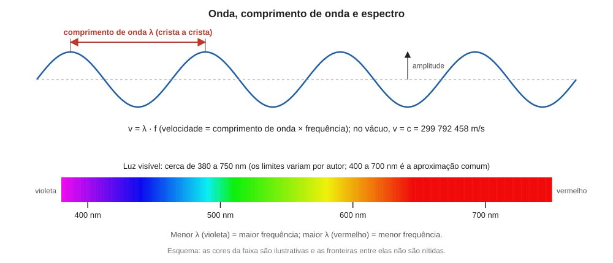

# Aula 01: A luz como onda eletromagnética

**ID:** mineralogia-m14-a01
**Módulo:** [[14-optica-fisica-modulo|Módulo 14 — Óptica física para mineralogia: luz, refração, polarização e interferência]]
**Duração estimada:** ~25 min
**Nível:** ensino médio, sem geologia prévia (contrato `ensino-medio-sem-geologia-v1`)
**Objetivo:** descrever a luz como onda eletromagnética transversal, usar comprimento de onda, frequência e velocidade (v = λ·f) e situar o espectro visível, preparando o que vai acontecer com a onda quando ela entra num cristal.
**Pré-requisito:** [[04-simetria-e-morfologia-aula-06-os-sete-sistemas-cristalinos-definidos-pela-simetria|módulo 04, aula 06]] (os sete sistemas cristalinos; só vão aparecer na aula 08). Nenhuma física além do ensino médio é assumida.

## Vocabulário desta aula

| Termo | O que quer dizer |
|---|---|
| **onda** | perturbação que se propaga transportando energia, sem transportar matéria de um lugar a outro. |
| **comprimento de onda (λ)** | distância entre duas cristas vizinhas da onda (letra grega lambda). |
| **frequência (f)** | número de ondas completas que passam por um ponto a cada segundo; unidade hertz (Hz). |
| **período (T)** | tempo de uma oscilação completa; T = 1/f. |
| **amplitude** | altura máxima da oscilação, a partir da posição de repouso; a intensidade cresce com o quadrado dela (aula 05). |
| **onda transversal** | onda em que a oscilação é perpendicular à direção em que a onda avança. |
| **campo elétrico (E)** | região de influência de cargas elétricas, que empurra outras cargas. |
| **espectro eletromagnético** | o conjunto de todos os comprimentos de onda das ondas eletromagnéticas. |
| **nanômetro (nm)** | um bilionésimo de metro (10⁻⁹ m). |

## Antes de começar, você precisa saber

- Que um cristal é um arranjo regular de átomos, com distâncias entre átomos vizinhas da ordem de décimos de nanômetro ([[06-reticulo-e-cela-modulo|módulo 06]] e [[08-empacotamento-e-coordenacao-modulo|módulo 08]]).
- Notação científica: 3 × 10⁸ significa 300 000 000.

## Ao final você vai conseguir

- `mineralogia-m14-oa01` — Descrever a luz como onda eletromagnética (comprimento de onda, frequência, velocidade) e situar o espectro visível.

## Conteúdo

### Por que a mineralogia precisa de uma aula de óptica

Um mineral transparente deixa a luz passar, e a maneira como a luz passa muda de mineral para mineral e, dentro de um mesmo cristal, de direção para direção. Isso permite identificar minerais em lâmina delgada, sem destruí-los. Para entender essa informação é preciso saber o que a luz é e o que acontece com ela dentro de um material. Este módulo reconstrói isso a partir do ensino médio; os módulos 15 e 16 usam tudo o que for visto aqui.

### A onda: três grandezas e uma regra

Pense numa corda esticada que você sacode para cima e para baixo: forma-se uma onda que corre ao longo da corda. A corda sobe e desce, e a forma da onda avança. Três grandezas descrevem uma onda periódica:

- o **comprimento de onda λ**, a distância de uma crista à seguinte;
- a **frequência f**, quantas oscilações completas passam por um ponto a cada segundo;
- a **velocidade v**, com que a forma da onda avança.

Elas se relacionam por uma regra simples: em um período T (o tempo de uma oscilação), a onda avança exatamente um comprimento de onda. Logo v = λ/T = **λ · f**. Se a frequência é 2 por segundo e o comprimento de onda é 3 m, a velocidade é 6 m/s.

*Figura 1. No alto, uma onda com λ e amplitude marcados; embaixo, a faixa visível do espectro. O que observar: λ menor corresponde ao violeta, λ maior ao vermelho.*

### A luz é uma onda, e é eletromagnética

Na luz, o que oscila não é uma corda, e sim um **campo elétrico** (acompanhado de um campo magnético, perpendicular a ele). Num ponto do espaço, o vetor campo elétrico **E** aponta para um lado, diminui, inverte, e assim por diante, milhões de bilhões de vezes por segundo. Duas consequências valem para o resto do módulo:

1. A luz é uma **onda transversal**: **E** oscila perpendicularmente à direção de propagação. Se a luz viaja de cima para baixo, **E** oscila num plano horizontal, e dentro desse plano pode apontar para qualquer direção. Essa liberdade de escolha é a base da **polarização** (aulas 05 e 06).
2. A matéria é feita de cargas (núcleos e elétrons). O campo elétrico da luz empurra essas cargas, e é esse empurrão que faz a luz ser refletida, desacelerada, absorvida ou desviada num mineral. Por isso a resposta do mineral depende da direção em que **E** oscila em relação ao arranjo dos átomos: o elo entre óptica e simetria cristalina (aula 08).

No vácuo, a luz de qualquer cor viaja à mesma velocidade, **c = 299 792 458 m/s** (valor exato por definição do metro no Sistema Internacional), cerca de 3 × 10⁸ m/s, ou 300 000 km/s. Nada transporta energia mais depressa. Dentro de um material transparente a luz é **mais lenta** que c; a próxima aula quantifica isso.

### O espectro: a luz visível é uma faixa estreita

Aplicando v = λ · f ao vácuo, f = c/λ. Cada comprimento de onda tem uma frequência. A luz **visível** é a faixa que o olho humano detecta: de cerca de **380 a 750 nm** de comprimento de onda, e as fontes variam nos limites (alguns manuais dizem 400 a 700 nm). Do menor ao maior λ: violeta, azul, verde, amarelo, laranja, vermelho. A luz branca é a mistura de todas elas. Fora dessa faixa há outras ondas eletromagnéticas, da mesma natureza e diferindo só no λ: o **ultravioleta** (λ menor que o do violeta), o **infravermelho** (maior que o do vermelho), os **raios X** (de λ muito menor, de décimos de nanômetro, usados no módulo 18) e as **ondas de rádio** (λ de metros).

Dois valores servem de referência neste módulo. A luz amarela do sódio, de **λ = 589 nm** (nm no vácuo), é a luz com que, por convenção, se tabelam os índices de refração de minerais e gemas. E a luz de 400 nm e a de 700 nm têm frequências de cerca de 7,5 × 10¹⁴ Hz e 4,3 × 10¹⁴ Hz, centenas de trilhões de oscilações por segundo, tão rápidas que o olho vê só o efeito médio.

### O que acontece com λ e f quando a luz entra num material

Quando a luz passa do ar para um cristal, a velocidade cai. A **frequência não muda**: a fonte determina quantas oscilações por segundo chegam, e o material não cria nem destrói oscilações na fronteira. Como v = λ · f e f fica igual, **λ diminui na mesma proporção que a velocidade**. Se a velocidade caísse pela metade, a distância entre cristas também cairia à metade. Guarde esta ideia: ela explica o desvio dos raios (aula 02) e o retardo entre dois raios (aula 07).

### O cristal visto pela luz

Compare escalas. O λ da luz visível, de 380 a 750 nm, é milhares de vezes maior que a distância entre átomos de um cristal (décimos de nanômetro). Uma onda tão longa não "enxerga" cada átomo; sente a média. O cristal funciona, para a luz visível, como um meio contínuo cujas propriedades dependem da direção só porque o arranjo atômico tem direções preferenciais. Já os raios X, de λ comparável à distância entre átomos, interagem com os planos atômicos individuais e geram difração (módulo 18).

## Exemplo trabalhado

**Problema.** (a) Calcule a frequência da luz de sódio, λ = 589 nm no vácuo. (b) A velocidade da luz nessa onda ao entrar no quartzo cai para cerca de 1,94 × 10⁸ m/s. Qual passa a ser o comprimento de onda dentro do quartzo?

**(a)** Converta: 589 nm = 589 × 10⁻⁹ m = 5,89 × 10⁻⁷ m. Então f = c/λ = (3,00 × 10⁸) / (5,89 × 10⁻⁷) ≈ **5,09 × 10¹⁴ Hz**. Com c exato (299 792 458 m/s), f ≈ 5,090 × 10¹⁴ Hz.

**(b)** A frequência no quartzo é a mesma: 5,09 × 10¹⁴ Hz. Então λ = v/f = (1,94 × 10⁸) / (5,09 × 10¹⁴) ≈ 3,81 × 10⁻⁷ m = **381 nm**. O comprimento de onda caiu de 589 para 381 nm, na mesma razão em que a velocidade caiu (589/381 ≈ 1,54; a próxima aula chama esse número de índice de refração do quartzo).

**Verificação de ordem de grandeza:** uma onda cuja velocidade é 65% da original (1,94/3,00 ≈ 0,65) deve ter λ também 65% do original: 0,65 × 589 ≈ 383 nm. Confere.

## Erros comuns

- **Achar que a cor muda ao entrar no vidro ou no cristal.** A cor é determinada pela frequência, que não muda. O que muda é λ (e v).
- **Trocar λ por f nas contas.** λ é uma distância (nm), f é um número de oscilações por segundo (Hz). v = λ · f só fecha se as unidades estiverem em metro e hertz.
- **Esquecer a conversão de nm para m** (10⁻⁹).
- **Levar a analogia da corda longe demais.** Na luz nada material sobe e desce, e o raio não serpenteia: segue em linha reta. A altura da curva na Figura 1 representa o valor do campo elétrico **E** (que aponta numa direção perpendicular ao raio), não um deslocamento no espaço.

## O que não concluir

- Que a luz "é" só uma onda. A luz também se comporta como partícula (fótons) em outros fenômenos; para refração, polarização e interferência, o modelo ondulatório basta, e é o único usado neste módulo.
- Que o espectro visível seja uma propriedade da luz. É uma propriedade do olho humano; outros animais veem faixas diferentes.
- Que a luz amarela do sódio seja "a luz do mineral". É apenas a referência convencional para tabelar índices.

## Recap relâmpago

- A luz é uma onda eletromagnética transversal: o campo elétrico E oscila perpendicularmente à direção de propagação.
- v = λ · f; no vácuo v = c = 299 792 458 m/s (cerca de 3 × 10⁸ m/s).
- A luz visível ocupa de cerca de 380 a 750 nm: violeta (λ menor) a vermelho (λ maior); a de 589 nm (sódio) é a referência para índices.
- Ao entrar num material, a frequência não muda; a velocidade e λ diminuem na mesma proporção.
- O λ da luz visível é milhares de vezes maior que a distância entre átomos; o cristal age como meio contínuo, mas direcional.

## Próxima aula

Em [[14-optica-fisica-aula-02-refracao-indice-de-refracao-e-lei-de-snell|Aula 02 — Refração, índice de refração e lei de Snell]], a razão entre c e a velocidade no material vira um número, o índice de refração, e a lei de Snell prevê o desvio do raio ao mudar de meio.

## Fontes consultadas

- Hecht, E., *Optics* (ondas eletromagnéticas, relação v = λ·f, luz em meios materiais).
- Valor exato de c e definição do metro: Sistema Internacional de Unidades (BIPM); limites do espectro visível (380 a 750 nm, com variação de 400 a 700 nm conforme o autor): Wikipedia, *Light*, e manuais de óptica, lidos em 2026-10-07; os limites variam entre fontes e não são tratados aqui como valores exatos.
- Luz do sódio, 589 nm, como referência de índices: *Handbook of Mineralogy* (índice do diamante dado em 486, 589 e 687 nm).
- Valor de c, λ e f: contas refeitas em Python em 2026-10-07.

<!--
nivel: ensino-medio-sem-geologia-v1
palavras_corpo: 1416
cobertura:
  mineralogia-m14-oa01: [Conteúdo, Exemplo trabalhado]
figuras:
  - 14-optica-fisica-fig-01-onda-e-espectro.svg
alegacoes_auditaveis:
  - claim_id: OPT-LUZ-ONDA-001
    claim: "A luz e uma onda eletromagnetica transversal: o campo eletrico E oscila perpendicularmente a direcao de propagacao; v = lambda x f."
    risk: conceito
    source: "Hecht, Optics"
    audit: "verificado em 2026-10-07 (Hecht, Optics; onda transversal e v = lambda f)"
  - claim_id: OPT-LUZ-C-001
    claim: "No vacuo, c = 299 792 458 m/s (exato por definicao do metro), cerca de 3 x 10^8 m/s."
    risk: numero
    source: "Sistema Internacional (BIPM)"
    audit: "verificado em 2026-10-07 (BIPM/SI: c = 299 792 458 m/s exato)"
  - claim_id: OPT-LUZ-VIS-001
    claim: "A luz visivel ocupa cerca de 380 a 750 nm (limites variam entre fontes; 400 a 700 nm e a aproximacao comum), do violeta (menor lambda) ao vermelho; ultravioleta e infravermelho sao ondas da mesma natureza; raios X tem lambda de decimos de nanometro."
    risk: numero
    source: "Wikipedia Light; manuais de optica"
    audit: "verificado em 2026-10-07 (limites 380-750 nm variam por autor, apresentados como aproximados; fig 01 mapeia 380-750 nm com 2,162 px/nm)"
  - claim_id: OPT-LUZ-FREQ-001
    claim: "A frequencia da luz de 589 nm no vacuo e cerca de 5,09 x 10^14 Hz; a de 400 nm e 700 nm sao cerca de 7,5 x 10^14 Hz e 4,3 x 10^14 Hz (contas em Python)."
    risk: numero
    source: "calculo f = c/lambda (Python, 2026-10-07)"
    audit: "verificado em 2026-10-07 (Python: 5,090e14; 7,49e14; 4,28e14 Hz)"
  - claim_id: OPT-LUZ-MEIO-001
    claim: "Ao entrar num material a frequencia nao muda; velocidade e comprimento de onda diminuem na mesma proporcao. No quartzo (v ~ 1,94 x 10^8 m/s), lambda de 589 nm cai a cerca de 381 nm."
    risk: numero
    source: "Hecht, Optics; v = c/n com n(quartzo) = 1,544 (Handbook of Mineralogy); contas em Python"
    audit: "verificado em 2026-10-07 (Python: c/1,544 = 1,942e8 m/s; 589/1,544 = 381,5 nm; HoM quartz omega 1,544)"
  - claim_id: OPT-LUZ-ESCALA-001
    claim: "O lambda da luz visivel e milhares de vezes maior que a distancia entre atomos num cristal (decimos de nanometro); raios X, de lambda comparavel a essa distancia, difratam nos planos atomicos."
    risk: conceito
    source: "Klein & Dutrow (ordem de grandeza); modulos 06, 08 e 18"
    audit: "verificado em 2026-10-07 (400-700 nm contra 0,2-0,3 nm entre atomos: razao de mil a alguns milhares)"
  - claim_id: OPT-LUZ-SODIO-001
    claim: "Indices de refracao de minerais e gemas sao tabelados por convencao para a luz amarela do sodio, 589 nm."
    risk: fato
    source: "Handbook of Mineralogy (diamante a 589 nm); convencao de gemologia"
    audit: "verificado em 2026-10-07 (HoM diamond: n a 486, 589 e 687 nm; convencao Na D)"
  - claim_id: OPT-LUZ-DIDAT-001
    claim: "A intensidade de uma onda cresce com o quadrado da amplitude; na luz nada material oscila e o raio segue em linha reta: a altura da curva da figura 1 representa o valor do campo eletrico E, que aponta numa direcao perpendicular ao raio."
    risk: conceito
    source: "Hecht, Optics; aula 05 (OPT-POL-MALUS-001)"
    audit: "verificado em 2026-10-07 (segunda passagem: Hecht, Optics; I proporcional ao quadrado da amplitude; 1,94/3,00 = 0,647)"
-->
