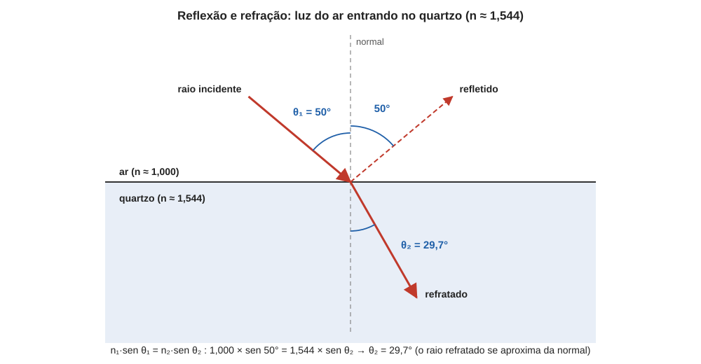

# Aula 02: Refração, índice de refração e lei de Snell

**ID:** mineralogia-m14-a02
**Módulo:** [[14-optica-fisica-modulo|Módulo 14 — Óptica física para mineralogia: luz, refração, polarização e interferência]]
**Duração estimada:** ~28 min
**Nível:** ensino médio, sem geologia prévia (contrato `ensino-medio-sem-geologia-v1`)
**Objetivo:** definir o índice de refração, enunciar as leis da reflexão e da refração (lei de Snell) e calcular o ângulo do raio refratado ao passar de um meio a outro.
**Pré-requisito:** [[14-optica-fisica-aula-01-a-luz-como-onda-eletromagnetica|aula 01]] (v = λ·f; a frequência não muda ao mudar de meio).
**Esta aula cobre a refração.** A reflexão total e o ângulo crítico ficam na aula 03; a dispersão, na aula 04.

## Vocabulário desta aula

| Termo | O que quer dizer |
|---|---|
| **raio de luz** | linha que indica a direção em que a luz avança; é uma representação, não um objeto. |
| **interface** | superfície de separação entre dois meios (ar e cristal, por exemplo). |
| **normal** | reta perpendicular à interface no ponto onde o raio chega. |
| **ângulo de incidência (θ₁)** | ângulo entre o raio incidente e a normal (não com a superfície). |
| **refração** | mudança de direção do raio ao passar de um meio a outro. |
| **índice de refração (n)** | n = c/v: quantas vezes a luz é mais lenta no material do que no vácuo. |
| **seno** | num triângulo retângulo, razão entre o cateto oposto ao ângulo e a hipotenusa. |

## Antes de começar, você precisa saber

- Que λ diminui, com f constante, quando a luz entra num material (aula 01).
- O que é o seno de um ângulo. Reativação: num triângulo retângulo, sen θ = cateto oposto / hipotenusa. Valores úteis: sen 0° = 0; sen 30° = 0,5; sen 45° ≈ 0,707; sen 60° ≈ 0,866; sen 90° = 1. O seno cresce com o ângulo (de 0 a 90°) e nunca passa de 1. A calculadora tem a tecla sen e a tecla inversa sen⁻¹ (arcsen), que devolve o ângulo.

## Ao final você vai conseguir

- `mineralogia-m14-oa02` — Aplicar a lei de Snell e o conceito de índice de refração, incluindo ângulo crítico e reflexão total. (Parte 1 do objetivo: índice de refração e lei de Snell; o ângulo crítico e a reflexão total ficam na aula 03.)

## Conteúdo

### O índice de refração: a lentidão da luz num número

Dentro de um material a luz anda mais devagar do que no vácuo (aula 01), porque o campo elétrico da onda mexe com as cargas do material, e essa interação atrasa a propagação. A medida dessa lentidão é o **índice de refração**:

**n = c / v**

onde c é a velocidade no vácuo e v, a velocidade no material. Como v nunca passa de c, n é sempre maior que 1 em materiais transparentes comuns. Quanto maior n, mais lenta a luz.

Valores de referência (para a luz de 589 nm):

| Material | n | Fonte e observação |
|---|---|---|
| ar (pressão atmosférica) | ≈ 1,0003 | valor tabelado; vale 1,000 nas contas desta aula |
| água | ≈ 1,33 | valor tabelado |
| fluorita | 1,433 a 1,448 | *Handbook of Mineralogy* |
| quartzo | ω = 1,544; ε = 1,553 | *Handbook of Mineralogy* (dois valores, chamados ômega e épsilon: aulas 06 a 08) |
| halita (sal-gema) | 1,5443 | *Handbook of Mineralogy* |
| esfalerita | 2,369 | *Handbook of Mineralogy* |
| diamante | 2,4175 | *Handbook of Mineralogy* (a 589 nm) |

Num mineral em que n é 1,544, v = c/1,544 ≈ 1,94 × 10⁸ m/s; no diamante, v = c/2,4175 ≈ 1,24 × 10⁸ m/s, menos da metade de c. Note que o quartzo tem dois índices: ele não é **isotrópico** (isto é, não tem as mesmas propriedades ópticas em todas as direções), e o motivo é a aula 08. Por enquanto, num meio isotrópico (fluorita, halita, diamante), n é um só, o mesmo em todas as direções.

### Reflexão e refração numa interface

Quando um raio chega a uma interface entre dois meios, duas coisas acontecem ao mesmo tempo: parte da luz **volta** (reflexão) e parte **passa** para o outro meio, com a direção alterada (refração). Os ângulos se medem sempre em relação à **normal**, não à superfície.

**Lei da reflexão.** O ângulo de reflexão é igual ao de incidência, e o raio refletido fica no mesmo plano do raio incidente e da normal.

**Lei da refração (lei de Snell).** O raio refratado também fica no plano de incidência, e

**n₁ · sen θ₁ = n₂ · sen θ₂**

em que n₁ e θ₁ pertencem ao meio de onde a luz vem, e n₂ e θ₂, ao meio para onde ela vai. Quando a luz entra num meio de n maior (mais lento), sen θ₂ fica menor que sen θ₁: o raio se **aproxima da normal**. Ao passar para um meio de n menor, afasta-se da normal. A direção do trajeto não importa: o raio é reversível, e a mesma equação vale nos dois sentidos.

*Figura 2. Raio incidente a 50° da normal, refletido a 50° e refratado a 29,7° no quartzo. O que observar: dentro do mineral, o raio se aproxima da normal; os ângulos saem da conta da lei de Snell, não de estimativa visual.*

### De onde vem a lei de Snell

Imagine uma frente de onda plana chegando obliquamente à interface, como uma fileira de soldados marchando para uma área de lama. A ponta da frente que entra primeiro no meio lento (n maior) desacelera primeiro, enquanto a outra ponta ainda anda rápido no meio de origem. Resultado: a frente gira e o raio, perpendicular a ela, também. Como a frequência é a mesma nos dois meios, a razão entre os comprimentos de onda é a razão entre as velocidades, e a geometria dá exatamente n₁ sen θ₁ = n₂ sen θ₂. O formato é o que importa: o produto n · sen θ se conserva ao atravessar a interface.

Dois casos extremos servem de teste. Se θ₁ = 0° (incidência perpendicular), sen θ₁ = 0, logo θ₂ = 0°: o raio atravessa sem desviar, embora diminua de velocidade. Se n₁ = n₂, θ₂ = θ₁ e a interface desaparece para a luz: é o princípio de mergulhar um cristal num líquido de mesmo índice para torná-lo invisível, e a base de uma técnica de identificação de minerais em grãos (a linha de Becke, módulo 15).

### Uma placa de faces paralelas

Se a luz atravessa uma placa de faces paralelas (uma lâmina de mineral, uma lamínula de vidro) e volta ao mesmo meio, a lei de Snell aplicada à entrada e à saída mostra que o raio emergente é **paralelo** ao incidente, só deslocado lateralmente. A lâmina não desvia a direção da luz; ela só a atrasa. Isso será essencial na aula 07: dois raios que atravessam a mesma lâmina com velocidades diferentes saem na mesma direção, mas atrasados um em relação ao outro.

## Exemplo trabalhado

**Problema.** Um raio de luz amarela do sódio incide do ar sobre uma face polida de diamante (n = 2,4175) com θ₁ = 50°. Calcule (a) o ângulo do raio refratado, (b) o do raio refletido e (c) compare com o mesmo raio entrando no quartzo (n = 1,544, valor de ω).

**(a) Diamante.** n₁ sen θ₁ = n₂ sen θ₂ → 1,000 × sen 50° = 2,4175 × sen θ₂. Com sen 50° = 0,7660: sen θ₂ = 0,7660 / 2,4175 = 0,3169. Então θ₂ = sen⁻¹(0,3169) = **18,5°**.

**(b) Reflexão.** θ = 50°, igual ao de incidência, do lado do ar.

**(c) Quartzo.** sen θ₂ = 0,7660 / 1,544 = 0,4961 → θ₂ = **29,7°**. O raio no diamante é desviado mais do que no quartzo (18,5° contra 29,7°, medidos a partir da normal): quanto maior n, mais o raio se aproxima da normal.

**Verificação:** em (a) e (c), sen θ₂ ficou menor que sen θ₁ e θ₂ menor que θ₁, como é esperado ao entrar num meio de n maior. Os ângulos foram conferidos em Python.

**Método geral:** (1) identifique n₁ e n₂ e de que lado fica cada um; (2) meça os ângulos **com a normal**; (3) isole sen θ₂ = (n₁/n₂) · sen θ₁; (4) verifique se o resultado é menor que 1 (se for maior, não há raio refratado: aula 03); (5) aplique sen⁻¹ e confira se o raio se aproxima da normal quando n₂ > n₁.

## Erros comuns

- **Medir o ângulo a partir da superfície em vez da normal.** A lei de Snell só vale com ângulos medidos com a normal.
- **Trocar n₁ e n₂.** n₁ é o meio de onde a luz vem, qualquer que seja o sinal do desvio.
- **Aplicar a relação ao ângulo, não ao seno.** Dobrar n não divide o ângulo ao meio; só o seno é proporcional.
- **Usar a calculadora em radianos.** Configure em graus.
- **Achar que n é uma propriedade do mineral sem a luz.** n depende do comprimento de onda (aula 04) e, em cristais anisotrópicos, da direção (aula 08).

## O que não concluir

- Que um mineral de n alto seja necessariamente mais denso. n e densidade costumam subir juntos, mas não são a mesma propriedade, e não há lei geral que as una (diamante: densidade 3,51 e n = 2,42; esfalerita: densidade 3,9 a 4,1 e n = 2,37).
- Que a luz "pare" ou "perca energia" ao ser desacelerada. A frequência é a mesma; a energia por onda é a mesma. A luz é desacelerada, não absorvida.
- Que os n da tabela valham para todos os cristais do mesmo mineral. Variam com a composição (a esfalerita rica em ferro, por exemplo) e com a luz usada.

## Recap relâmpago

- n = c/v: quantas vezes a luz é mais lenta no material; n ≥ 1; ar ≈ 1,0003, quartzo ≈ 1,544, diamante ≈ 2,4175.
- Reflexão: ângulo de reflexão = ângulo de incidência; ângulos sempre medidos a partir da normal.
- Lei de Snell: n₁ sen θ₁ = n₂ sen θ₂; ao entrar num meio de n maior, o raio se aproxima da normal.
- Uma placa de faces paralelas não muda a direção do raio; só o atrasa e o desloca.
- Se n₁ = n₂, a interface é invisível para a luz.

## Próxima aula

Em [[14-optica-fisica-aula-03-dispersao-e-reflexao-total-parte-1-angulo-critico-e-reflexao-total|Aula 03 — Dispersão e reflexão total, Parte 1: ângulo crítico e reflexão total]], o que ocorre quando sen θ₂ passaria de 1: o raio não sai, e o cristal vira espelho por dentro.

## Fontes consultadas

- Hecht, E., *Optics* (lei de Snell, índice de refração, placa de faces paralelas).
- *Handbook of Mineralogy*: quartzo (ω = 1,544; ε = 1,553), halita (n = 1,5443), fluorita (n = 1,433 a 1,448), esfalerita (n = 2,369, Na) e diamante (n = 2,4354 a 486 nm; 2,4175 a 589 nm; 2,4076 a 687 nm), lidos em 2026-10-07.
- Índices do ar (1,000293 a 0 °C e 1 atm) e da água (1,333 a 20 °C), na linha D do sódio: Wikipedia, *Refractive index* e *List of refractive indices*, conferido na auditoria de 2026-10-07.
- Densidade do diamante (3,511) e da esfalerita (3,9 a 4,1): *Handbook of Mineralogy*, lido em 2026-10-07.
- Ângulos calculados em Python em 2026-10-07.

<!--
nivel: ensino-medio-sem-geologia-v1
palavras_corpo: 1356
cobertura:
  mineralogia-m14-oa02: [Conteúdo, Exemplo trabalhado]
figuras:
  - 14-optica-fisica-fig-02-reflexao-e-refracao.svg
alegacoes_auditaveis:
  - claim_id: OPT-REF-N-001
    claim: "Indice de refracao n = c/v; n >= 1 em materiais transparentes comuns; quanto maior n, mais lenta a luz."
    risk: conceito
    source: "Hecht, Optics"
    audit: "verificado em 2026-10-07 (Hecht, Optics)"
  - claim_id: OPT-REF-VALORES-001
    claim: "Indices a 589 nm: ar ~1,0003; agua ~1,33; fluorita 1,433-1,448; quartzo omega 1,544 e epsilon 1,553; halita 1,5443; esfalerita 2,369; diamante 2,4175 (Handbook of Mineralogy)."
    risk: numero
    source: "Handbook of Mineralogy (quartzo, halita, fluorita, esfalerita, diamante); ar e agua: manuais de optica"
    audit: "verificado em 2026-10-07 (HoM quartz, halite, fluorite, sphalerite, diamond; ar 1,000293 e agua 1,333 (Wikipedia, Refractive index))"
  - claim_id: OPT-REF-VEL-001
    claim: "No quartzo (n 1,544) v ~ 1,94 x 10^8 m/s; no diamante (n 2,4175) v ~ 1,24 x 10^8 m/s (menos da metade de c)."
    risk: numero
    source: "calculo v = c/n (Python, 2026-10-07)"
    audit: "verificado em 2026-10-07 (Python: 1,942e8 e 1,240e8 m/s)"
  - claim_id: OPT-REF-LEIS-001
    claim: "Lei da reflexao (angulo de reflexao = angulo de incidencia, no plano de incidencia) e lei de Snell n1 sen theta1 = n2 sen theta2, com angulos medidos a partir da normal; ao entrar em meio de n maior o raio se aproxima da normal; reversibilidade."
    risk: conceito
    source: "Hecht, Optics"
    audit: "verificado em 2026-10-07 (Hecht, Optics)"
  - claim_id: OPT-REF-PLACA-001
    claim: "Numa placa de faces paralelas o raio emergente e paralelo ao incidente, apenas deslocado; se n1 = n2 a interface desaparece (base da linha de Becke, modulo 15)."
    risk: conceito
    source: "Hecht, Optics"
    audit: "verificado em 2026-10-07 (Hecht, Optics)"
  - claim_id: OPT-REF-EXEMPLO-001
    claim: "Ar para diamante a 50 graus: refratado a 18,5 graus; ar para quartzo (n 1,544): 29,7 graus; refletido a 50 graus (Python)."
    risk: numero
    source: "Snell, calculo em Python (2026-10-07)"
    audit: "verificado em 2026-10-07 (Python: 18,47 e 29,75 graus)"
  - claim_id: OPT-REF-DENS-001
    claim: "n e densidade nao seguem lei geral: diamante densidade 3,511 e n 2,42; esfalerita densidade 3,9 a 4,1 e n 2,37."
    risk: numero
    source: "Handbook of Mineralogy (diamante, esfalerita)"
    audit: "verificado em 2026-10-07 (HoM: diamante D(meas) 3,511; esfalerita 3,9-4,1)"
  - claim_id: OPT-FIG02-SNELL-001
    claim: "Figura 2: raio incidente a 50 graus no ar, refletido a 50 graus, refratado a 29,7 graus no quartzo (n 1,544); angulos medidos a partir da normal, calculados pela lei de Snell."
    risk: conceito
    source: "optica geometrica (leis da reflexao e de Snell); Python"
    audit: "verificado em 2026-10-07 (codigo SVG: incidente e refletido a 50,0 graus da normal, refratado a 29,74 graus; arcos de raio constante; segunda passagem: rotulos de angulo afastados dos raios, valores inalterados)"
  - claim_id: OPT-REF-DIDAT-001
    claim: "Isotropico: com as mesmas propriedades opticas em todas as direcoes; os dois indices do quartzo sao chamados omega e epsilon."
    risk: conceito
    source: "Hecht, Optics; Klein & Dutrow"
    audit: "verificado em 2026-10-07 (segunda passagem: Nesse; Klein & Dutrow; HoM quartz)"
-->
