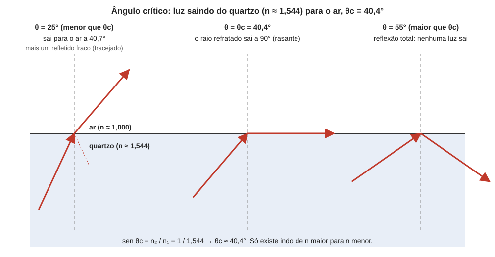

# Aula 03: Dispersão e reflexão total, Parte 1 — ângulo crítico e reflexão total

**ID:** mineralogia-m14-a03
**Módulo:** [[14-optica-fisica-modulo|Módulo 14 — Óptica física para mineralogia: luz, refração, polarização e interferência]]
**Duração estimada:** ~22 min
**Nível:** ensino médio, sem geologia prévia (contrato `ensino-medio-sem-geologia-v1`)
**Objetivo:** calcular o ângulo crítico para a passagem de um meio de índice maior a um de índice menor, prever quando há reflexão total e explicar por que ela vale para gemas, refratômetros e fibras ópticas.
**Pré-requisito:** [[14-optica-fisica-aula-02-refracao-indice-de-refracao-e-lei-de-snell|aula 02]] (índice de refração e lei de Snell).
**Esta é a Parte 1.** A Parte 2 (dispersão da luz) vem na aula 04.

> A aula do planejamento "Dispersão e reflexão total" foi dividida em duas para caber em 30 minutos: a reflexão total fecha o objetivo de Snell e a dispersão abre um assunto novo.

## Vocabulário desta aula

| Termo | O que quer dizer |
|---|---|
| **ângulo crítico (θc)** | maior ângulo de incidência para o qual ainda há raio refratado, indo de n maior para n menor. |
| **reflexão total** | situação em que toda a luz volta ao meio de origem, sem raio refratado. |
| **meio denso** | em óptica, o de índice de refração maior (não tem relação com densidade em g/cm³). |
| **raio rasante** | raio refratado que corre paralelo à interface (θ₂ = 90°). |
| **refratômetro** | instrumento que mede n a partir do ângulo crítico. |

## Antes de começar, você precisa saber

- Lei de Snell, n₁ sen θ₁ = n₂ sen θ₂, e que o seno nunca passa de 1 (aula 02).
- Que, ao passar de n maior para n menor, o raio se afasta da normal (aula 02).

## Ao final você vai conseguir

- `mineralogia-m14-oa02` — Aplicar a lei de Snell e o conceito de índice de refração, incluindo ângulo crítico e reflexão total.

## Conteúdo

### Uma pergunta que a lei de Snell não responde sozinha

Na aula 02, a luz entrava num meio de índice maior e sempre havia um raio refratado. Inverta a situação: a luz está **dentro** do quartzo (n = 1,544) e chega à superfície, saindo para o ar (n = 1,000). A lei de Snell fica:

1,544 · sen θ₁ = 1,000 · sen θ₂ → sen θ₂ = 1,544 · sen θ₁.

Se θ₁ = 25°, sen θ₁ = 0,4226 e sen θ₂ = 0,6525, logo θ₂ = 40,7°: o raio sai afastado da normal. Mas aumente θ₁: quando θ₁ chega a cerca de 40°, sen θ₂ chega a 1, isto é, θ₂ = 90°. E se θ₁ for 55°? sen θ₂ = 1,544 × 0,8192 = 1,265, um valor impossível, porque nenhum ângulo tem seno maior que 1. A equação não tem solução: **não existe raio refratado**. O que acontece com a luz?

### Ângulo crítico

A luz não some: **volta inteira** para dentro do cristal, refletida como num espelho perfeito. É a **reflexão total** (ou reflexão total interna). O limite entre os dois regimes é o **ângulo crítico θc**, o ângulo de incidência para o qual o raio refratado sai a 90° da normal, correndo rente à interface. Fazendo θ₂ = 90° na lei de Snell (sen 90° = 1):

**sen θc = n₂ / n₁**, com n₁ > n₂.

Para ângulos de incidência **menores** que θc, parte da luz sai (refrata) e parte volta (reflexão parcial). Para ângulos **maiores** que θc, a reflexão é total. Duas condições são obrigatórias: (1) a luz precisa vir do meio de **n maior** para o de n menor (de n menor para n maior o seno nunca passa de 1, não há ângulo crítico); (2) o ângulo de incidência deve ser maior que θc.

*Figura 3. Três raios dentro do quartzo chegando à interface com o ar: abaixo do ângulo crítico, o raio sai; no ângulo crítico, sai rasante; acima, volta todo. O que observar: o raio refratado se afasta da normal até chegar a 90°.*

### Ângulos críticos de alguns materiais saindo para o ar

Com n₂ = 1,000 (ar): sen θc = 1/n₁.

| Material (n₁) | sen θc = 1/n₁ | θc |
|---|---|---|
| fluorita (1,433, extremo inferior do intervalo) | 0,698 | 44,3° |
| quartzo, ω (1,544) | 0,648 | 40,4° |
| diamante (2,4175) | 0,414 | 24,4° |

Quanto **maior o índice, menor o ângulo crítico**, e maior a faixa de ângulos em que o cristal aprisiona a luz. É uma das razões pelas quais o diamante brilha: de n tão alto, a luz que entra pela mesa (a faceta grande e plana do topo) e bate no lado oposto num ângulo maior que 24° não escapa por ali; volta, e acaba saindo pela parte de cima. A conta do talho propriamente dito (inclinação das facetas) pertence ao curso de lapidação, que trata do ângulo crítico aplicado ao talhe.

### O meio em volta também conta

O θc depende dos **dois** índices, e n₂ não precisa ser o do ar. Quartzo cercado por água (n₂ ≈ 1,33): sen θc = 1,33 / 1,544 = 0,861 e θc = 59,5° a 59,7° (conforme o valor de n da água usado). Mergulhado em água, o quartzo aprisiona a luz bem menos: o ângulo crítico sobe de 40,4° para quase 60°. Se n₂ = n₁, sen θc = 1 e θc = 90°: o cristal "desaparece" no líquido, como visto na aula 02.

### Reflexão parcial, reflexão total e o ponto de vista do observador

Fora da condição de reflexão total, a reflexão não vale zero: sempre há uma parcela refletida, pequena na incidência perpendicular e crescente quando o raio se inclina (é o que dá a aparência de espelho da água vista de raspão; o brilho de uma face de mineral transparente vem dessa mesma reflexão parcial e cresce com n, como no módulo 13; já o brilho metálico tem outra origem, a absorção forte pelos elétrons livres). A aula 06 mostra que essa luz refletida é polarizada. A reflexão **total** é diferente: 100% da luz fica no meio denso, e por isso é usada onde se quer guiar luz sem perdas, como em fibras ópticas, onde a luz bate na parede de dentro sempre acima do ângulo crítico.

### Aplicação em mineralogia e gemologia

O **refratômetro** de bancada, usado para medir n de gemas e minerais, é uma aplicação direta desta aula: a gema é apertada contra um vidro de n alto, com uma gota de líquido de contato, e a luz é enviada de baixo. A luz que bate na interface vidro-gema acima do ângulo crítico volta; a que bate abaixo penetra na gema. Na ocular se vê uma fronteira clara-escura, cuja posição dá θc e, portanto, n da gema (como sen θc = n_gema / n_vidro, medir θc dá n_gema). O instrumento só mede gemas de n menor que o do vidro **e** que o do líquido de contato, e por isso ambos têm n elevado; na prática quem fixa o teto é, em geral, o líquido (n ≈ 1,79 a 1,81), e o refratômetro gemológico comum lê até cerca de 1,81. Diamante, zircão e moissanita (carbeto de silício, usado como imitação de diamante) ficam acima da escala. A questão é só princípio: o detalhe do instrumento é assunto de gemologia.

## Exemplo trabalhado

**Problema.** Um cristal de n = 1,544 está em contato com um líquido de n = 1,333. (a) Calcule θc. (b) Um raio chega à interface com 55°. Há refração? (c) E com 70°?

**(a)** sen θc = n₂/n₁ = 1,333/1,544 = 0,8634 → θc = sen⁻¹(0,8634) = **59,7°**.

**(b)** 55° < 59,7°: há raio refratado. sen θ₂ = (1,544/1,333) · sen 55° = 1,1583 × 0,8192 = 0,9489 → θ₂ = 71,6°. Parte da luz sai a 71,6° da normal, e uma parte menor é refletida.

**(c)** 70° > 59,7°: reflexão total. Conferindo: sen θ₂ = 1,1583 × sen 70° = 1,1583 × 0,9397 = 1,0884 > 1, impossível; não há raio refratado.

**Método geral:** (1) confira se n₁ > n₂; se não, não há reflexão total; (2) calcule θc = sen⁻¹(n₂/n₁); (3) compare o ângulo de incidência com θc; (4) abaixo de θc, calcule o raio refratado por Snell; acima, o raio volta.

## Erros comuns

- **Aplicar sen θc = n₂/n₁ quando n₁ < n₂.** O resultado passaria de 1: não existe ângulo crítico indo de n menor para n maior.
- **Trocar n₁ e n₂ na fração.** O n do meio de origem (maior) fica no denominador.
- **Esperar reflexão total para qualquer ângulo.** Só acima de θc.
- **Achar que a reflexão total "gasta" luz.** Toda a luz volta; é a reflexão mais eficiente que existe.
- **Chamar de "meio denso" o de maior densidade.** Em óptica, "denso" quer dizer n maior.

## O que não concluir

- Que um cristal de n alto sempre mostre reflexão total. Depende da geometria: o raio precisa chegar à interface acima do ângulo crítico.
- Que a reflexão total explique sozinha o brilho de uma gema. Ela é parte do mecanismo no diamante lapidado, mas o brilho sobre uma face polida vem da reflexão parcial (seção "Reflexão parcial" acima e módulo 13), e a cor, de outros fenômenos.
- Que o refratômetro meça qualquer material: mede o n da superfície em contato, só dentro da faixa do vidro e do líquido do aparelho.

## Recap relâmpago

- Indo de n maior (n₁) para n menor (n₂): sen θc = n₂/n₁.
- Abaixo de θc, a luz refrata; no ângulo crítico, sai rasante; acima, há reflexão total (nenhuma luz sai).
- Quanto maior n₁, menor θc: quartzo 40,4°, diamante 24,4° (para o ar).
- O meio ao redor também conta: o quartzo na água tem θc ≈ 60°.
- O refratômetro mede n a partir do ângulo crítico.

## Próxima aula

Em [[14-optica-fisica-aula-04-dispersao-e-reflexao-total-parte-2-dispersao|Aula 04 — Dispersão e reflexão total, Parte 2: dispersão]], o fato de que n depende do comprimento de onda: por que a luz branca se abre em cores e como se mede isso.

## Fontes consultadas

- Hecht, E., *Optics* (reflexão total interna, ângulo crítico, fibras).
- *Handbook of Mineralogy*: n da fluorita (1,433 a 1,448), do quartzo (ω = 1,544) e do diamante (2,4175 a 589 nm).
- Índice da água (1,333 a 20 °C, 589 nm): Wikipedia, *List of refractive indices*, conferido na auditoria de 2026-10-07. Limite dos refratômetros gemológicos (cerca de 1,81, fixado em geral pelo líquido de contato; "OTL", *over the limit*, acima disso): Skyjems, *Gemological refractometer* e *Contact liquid*, e literatura do GIA sobre refratômetros, conferido na auditoria de 2026-10-07.
- Ângulos críticos calculados em Python em 2026-10-07.

<!--
nivel: ensino-medio-sem-geologia-v1
palavras_corpo: 1331
cobertura:
  mineralogia-m14-oa02: [Conteúdo, Exemplo trabalhado]
figuras:
  - 14-optica-fisica-fig-03-reflexao-total.svg
alegacoes_auditaveis:
  - claim_id: OPT-TOT-CRIT-001
    claim: "Indo de n1 maior para n2 menor, sen theta_c = n2/n1; abaixo do angulo critico a luz refrata, no critico sai rasante (90 graus), acima ha reflexao total; nao existe angulo critico de n menor para n maior."
    risk: conceito
    source: "Hecht, Optics"
    audit: "verificado em 2026-10-07 (Hecht, Optics)"
  - claim_id: OPT-TOT-VALORES-001
    claim: "Angulos criticos para o ar: fluorita (n 1,433) 44,3 graus; quartzo (omega 1,544) 40,4 graus; diamante (2,4175) 24,4 graus; quartzo em agua (n ~1,33): ~59,7 graus."
    risk: numero
    source: "calculo sen theta_c = n2/n1 (Python, 2026-10-07) com n do Handbook of Mineralogy; n da agua: manuais de optica"
    audit: "verificado em 2026-10-07 (Python: 44,25; 40,37; 24,43 graus; agua 59,47 (1,33) a 59,69 (1,333))"
  - claim_id: OPT-TOT-MEIO-001
    claim: "Quanto maior o indice, menor o angulo critico; o theta_c depende dos dois indices; se n1 = n2 o cristal desaparece no liquido (theta_c = 90 graus)."
    risk: conceito
    source: "Hecht, Optics"
    audit: "verificado em 2026-10-07 (Hecht, Optics)"
  - claim_id: OPT-TOT-PARCIAL-001
    claim: "A reflexao parcial cresce com a inclinacao do raio (espelho da agua vista de raspao); o brilho de uma face de mineral transparente vem dessa reflexao parcial e cresce com n (modulo 13); o brilho metalico tem outra origem (absorcao forte por eletrons livres)."
    risk: conceito
    source: "Hecht, Optics; modulo 13, aula 05"
    audit: "corrigido em 2026-10-07 (achado 1: brilho metalico nao vem da reflexao parcial obliqua)"
  - claim_id: OPT-TOT-REFRATOMETRO-001
    claim: "O refratometro mede n a partir do angulo critico na interface vidro-amostra; so mede amostras de n menor que o do vidro e o do liquido de contato; o teto, fixado em geral pelo liquido (n ~1,79 a 1,81), e de cerca de 1,81; diamante, zircao e moissanita ficam acima."
    risk: fato
    source: "manuais de gemologia (a confirmar na auditoria)"
    audit: "corrigido em 2026-10-07 (achado 2: teto fixado em geral pelo liquido de contato, cerca de 1,81)"
  - claim_id: OPT-TOT-EXEMPLO-001
    claim: "Cristal n 1,544 em liquido n 1,333: theta_c = 59,7 graus; incidencia a 55 graus refrata a 71,6 graus; a 70 graus ha reflexao total (sen theta_2 = 1,088)."
    risk: numero
    source: "calculo por Snell em Python (2026-10-07)"
    audit: "verificado em 2026-10-07 (Python: 59,69; 71,59 graus; 1,0884)"
  - claim_id: OPT-TOT-DIAM-001
    claim: "Diamante lapidado retem luz por reflexao total por causa do n alto (theta_c = 24,4 graus); a inclinacao das facetas pertence ao curso de lapidacao."
    risk: conceito
    source: "Hecht, Optics; Handbook of Mineralogy (n do diamante)"
    audit: "verificado em 2026-10-07 (HoM diamond 2,4175; theta_c 24,43 graus)"
  - claim_id: OPT-FIG03-TOTAL-001
    claim: "Figura 3: raios no quartzo (n 1,544) para o ar a 25 graus (sai a 40,7 graus), 40,4 graus (sai rasante) e 55 graus (reflexao total)."
    risk: numero
    source: "Snell, calculo em Python (2026-10-07)"
    audit: "verificado em 2026-10-07 (codigo SVG: 24,98/40,7; 40,37/rasante; 55,0 com reflexao simetrica; segunda passagem: rotulos dos meios afastados do raio de 25 graus e normais encurtadas, valores inalterados)"
  - claim_id: OPT-TOT-DIDAT-001
    claim: "Mesa e a faceta grande e plana do topo de uma gema lapidada; moissanita e carbeto de silicio, usado como imitacao de diamante; o brilho de uma face polida vem da reflexao parcial (secao da propria aula e modulo 13)."
    risk: fato
    source: "manuais de gemologia (GIA); modulo 13"
    audit: "verificado em 2026-10-07 (segunda passagem: moissanita SiC, n 2,648-2,691, simulante de diamante desde 1998 (Skyjems; Nassau et al., Synthetic moissanite); mesa = table facet)"
-->
