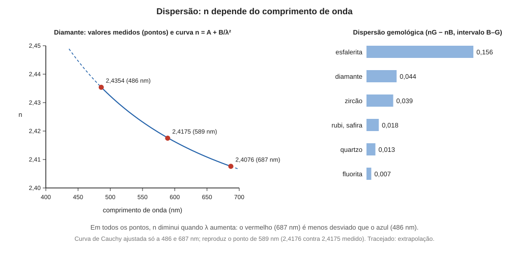

# Aula 04: Dispersão e reflexão total, Parte 2 — dispersão

**ID:** mineralogia-m14-a06
**Módulo:** [[14-optica-fisica-modulo|Módulo 14 — Óptica física para mineralogia: luz, refração, polarização e interferência]]
**Duração estimada:** ~24 min
**Nível:** ensino médio, sem geologia prévia (contrato `ensino-medio-sem-geologia-v1`)
**Objetivo:** explicar por que o índice de refração depende do comprimento de onda, como isso separa a luz branca em cores, e como a dispersão é definida e medida (linhas de referência, dispersão gemológica, prisma e refratômetro).
**Pré-requisito:** [[14-optica-fisica-aula-02-refracao-indice-de-refracao-e-lei-de-snell|aula 02]] (n e lei de Snell) e [[14-optica-fisica-aula-01-a-luz-como-onda-eletromagnetica|aula 01]] (λ e as cores do espectro).
**Esta é a Parte 2.** A Parte 1 (ângulo crítico e reflexão total) está na aula 03; esta aula tem ID novo (`a06`) porque o planejamento original tinha uma aula só, dividida na redação.

## Vocabulário desta aula

| Termo | O que quer dizer |
|---|---|
| **dispersão** | dependência do índice de refração com o comprimento de onda; por extensão, a separação da luz branca em cores. |
| **linha de Fraunhofer** | comprimento de onda de referência (do espectro solar ou de uma lâmpada) usado para tabelar n. |
| **dispersão normal** | situação em que n diminui quando λ aumenta (vermelho com n menor que azul). |
| **fogo** | em gemologia, os lampejos coloridos que uma gema transparente mostra por causa da dispersão. |
| **prisma** | bloco transparente de faces planas inclinadas, que desvia e separa a luz. |
| **desvio mínimo (D)** | menor desvio total que um prisma impõe a um raio, para um dado comprimento de onda. |

## Antes de começar, você precisa saber

- A lei de Snell e o fato de que, ao entrar num meio de n maior, o raio se aproxima da normal (aula 02).
- Que a luz branca é uma mistura de comprimentos de onda de cerca de 380 a 750 nm (aula 01).

## Ao final você vai conseguir

- `mineralogia-m14-oa03` — Explicar a dispersão da luz e como ela é medida.

## Conteúdo

### n não é um número só

Na aula 02, o diamante aparecia com n = 2,4175. Esse número vale para a luz de 589 nm. O *Handbook of Mineralogy* lista três valores para o diamante: **2,4354 a 486 nm, 2,4175 a 589 nm e 2,4076 a 687 nm**. Isso quer dizer que a luz azul (486 nm) é mais **lenta** no diamante do que a luz vermelha (687 nm), e quando a luz branca entra obliquamente, cada cor é desviada num ângulo um pouco diferente. A esse fenômeno chama-se **dispersão**.

Aplique a lei de Snell a um raio de 60° saindo do ar para o diamante. Para o azul: sen θ₂ = 0,866 / 2,4354 = 0,3556, θ₂ = 20,83°. Para o vermelho: sen θ₂ = 0,866 / 2,4076 = 0,3597, θ₂ = 21,08°. A diferença é de apenas **0,25°** numa interface. É pequena, mas o raio atravessa várias interfaces, se reflete dentro da gema, e as diferenças se somam até o olho separar as cores.

*Figura 4. À esquerda, n do diamante em função de λ (pontos do Handbook of Mineralogy e curva de Cauchy, tracejada fora do intervalo de 486 a 687 nm usado no ajuste); à direita, a dispersão gemológica de algumas gemas. O que observar: n cai quando λ cresce; a esfalerita tem dispersão maior que a do diamante.*

### Por que n depende de λ

O campo elétrico da luz faz os elétrons do material oscilarem, e o material responde melhor a certas frequências (as frequências próprias dos elétrons e das ligações, que em minerais transparentes ficam, em geral, no ultravioleta). Quanto mais perto da frequência própria a luz está, mais ela é retardada. O violeta e o azul, de frequência mais alta, estão mais perto do ultravioleta que o vermelho, e por isso são mais retardados: n é maior para o azul. Em materiais transparentes na faixa visível, isso é a **dispersão normal**: n **diminui** quando λ aumenta. Perto de uma absorção forte a tendência se inverte (dispersão anômala), caso que não vamos usar.

Como a dispersão vem das ligações do material, ela é uma propriedade do mineral: na tabela, esfalerita é muito dispersiva, fluorita muito pouco.

### Uma fórmula empírica para o formato da curva

Na década de 1830, Cauchy propôs uma fórmula simples: **n = A + B/λ²**, em que A e B são constantes do material (A é o n "no limite de λ muito grande"). A memória de Cauchy sobre a dispersão é de 1836; algumas fontes datam a fórmula de um trabalho de 1830. Cauchy a tirou de um modelo teórico hoje abandonado, e ela é usada como ajuste empírico, não como lei: funciona bem na faixa do visível e falha perto de absorções. Com dois pontos do diamante (486 e 687 nm) saem as duas constantes: subtraindo as duas equações, A desaparece, e B = (2,4354 − 2,4076) / (1/486² − 1/687²) ≈ 1,314 × 10⁴ nm²; depois, A = 2,4354 − B/486² ≈ 2,3798. O exemplo trabalhado (c) testa a fórmula num terceiro ponto, que ela não usou.

### Como a dispersão é medida

Dispersão se mede com **n em dois (ou mais) comprimentos de onda de referência**:

- **Linhas de Fraunhofer.** O espectro do Sol tem linhas escuras que servem de referência fixa: a linha **C** (656,3 nm, vermelho), a **D** do sódio (589,3 nm, amarelo) e a **F** (486,1 nm, azul). Os índices em C, D e F são os de referência da óptica técnica.
- **Dispersão gemológica.** Define-se como a diferença de n entre a linha **B** (686,7 nm, vermelho) e a linha **G** (430,8 nm, violeta): **dispersão = nG − nB**. Para o diamante, nB = 2,407 e nG = 2,451, logo **0,044**. Outros valores publicados: zircão 0,039, quartzo 0,013, rubi e safira 0,018, fluorita 0,007 e esfalerita 0,156.
- **Instrumentos.** O **refratômetro** (aula 03) e o **goniômetro de prisma** (o goniômetro, do módulo 04, mede ângulos; este mede os do prisma e do raio desviado) medem n em um comprimento de onda a cada vez, com luz monocromática (lâmpada de sódio ou filtros). No prisma, mede-se o **desvio mínimo D** e o ângulo A do prisma: **n = sen[(A + D)/2] / sen(A/2)**. Repetindo para vários λ, obtém-se a curva n(λ).

Os valores de dispersão **não são comparáveis** se medidos em intervalos diferentes: a diferença entre 486 nm e 687 nm no diamante (2,4354 − 2,4076 = 0,0278) é menor que o valor gemológico (0,044), porque o intervalo B–G é mais largo (431 a 687 nm) e a curva é mais inclinada no violeta. Antes de comparar duas dispersões, confira entre que linhas foram calculadas.

### O que a dispersão faz na prática

- Numa **gema transparente e de dispersão alta**, como o diamante (0,044), o zircão (0,039) e a esfalerita (0,156), os raios que entram e saem por facetas diferentes se separam em cores: o "fogo". Em gemas de dispersão baixa, como o quartzo (0,013) e a fluorita (0,007), o efeito é pouco visível.
- Em **luz branca**, uma lâmina de mineral mostra bordas coloridas quando n do mineral e n do meio em volta coincidem para uma cor e não para as outras (módulo 15).
- A dispersão é também um **entrave**: as lentes do microscópio precisam corrigi-la para não borrar a imagem com franjas de cor.

## Exemplo trabalhado

**Problema.** Um prisma de um cristal isotrópico tem ângulo A = 60°. Com luz de sódio (589 nm), mede-se desvio mínimo D = 37,0°. (a) Calcule n. (b) Para o diamante, calcule a dispersão a partir de n(486) = 2,4354 e n(687) = 2,4076 e explique por que o valor difere de 0,044. (c) Teste a fórmula de Cauchy com A = 2,3798 e B = 13 144 nm² em 589 nm.

**(a)** n = sen[(A + D)/2] / sen(A/2) = sen(48,5°) / sen(30°) = 0,7490 / 0,5 = **1,498**. Resultado compatível com um cristal de n próximo de 1,5. (Os números do enunciado são um exercício; não correspondem a um mineral específico.)

**(b)** n(486) − n(687) = 2,4354 − 2,4076 = **0,0278**. É menor que 0,044 porque o intervalo de 486 a 687 nm é mais estreito que o de 431 a 687 nm, e a curva sobe mais depressa no violeta. O valor gemológico não se calcula com essas duas linhas.

**(c) Teste da fórmula de Cauchy.** Com B = 13 144 nm² e A = 2,3798, n(589) = 2,3798 + 13 144/346 921 = 2,3798 + 0,0379 ≈ **2,4176** (com A e B sem arredondar), contra 2,4175 medido; diferença de 0,0001. Quando a fórmula reproduz um ponto que não usou, ela é boa para interpolar dentro da faixa 486–687 nm, mas não para extrapolar além dela.

**Método geral:** (1) confirme em que comprimentos de onda os n foram dados; (2) subtraia n(menor λ) − n(maior λ): o resultado é positivo na dispersão normal; (3) compare só dispersões calculadas no mesmo intervalo; (4) num prisma, use a fórmula de desvio mínimo com os ângulos em graus.

## Erros comuns

- **Citar n sem dizer para que λ.** Um n "do diamante" é sempre n(λ); a convenção é 589 nm.
- **Confundir dispersão com birrefringência.** Dispersão: n varia com a cor. Birrefringência: n varia com a direção/polarização (aulas 06 e 08). São efeitos independentes.
- **Comparar dispersões calculadas entre linhas diferentes.**
- **Achar que o vermelho é o mais desviado.** Na dispersão normal, o violeta é o mais desviado.
- **Trocar a ordem da subtração.** Defina sempre nG − nB (positivo).

## O que não concluir

- Que dispersão alta signifique n alto. A esfalerita tem n de 2,369 (menor que o do diamante) e dispersão de 0,156, mais de três vezes a do diamante.
- Que a fórmula de Cauchy valha em qualquer faixa. É um ajuste empírico, bom no visível e para materiais transparentes.
- Que o fogo de uma gema seja só dispersão. Depende também do talhe e da reflexão total (aula 03).

## Recap relâmpago

- n depende de λ: no visível, em materiais transparentes, n diminui quando λ aumenta (dispersão normal); o azul é mais desviado que o vermelho.
- Diamante, HoM: 2,4354 (486 nm), 2,4175 (589 nm), 2,4076 (687 nm).
- Cauchy: n = A + B/λ² ajusta bem o visível; é empírica.
- Dispersão gemológica = n(430,8 nm) − n(686,7 nm) = nG − nB (o "intervalo B–G"): diamante 0,044; esfalerita 0,156; quartzo 0,013; fluorita 0,007.
- Mede-se com refratômetro e prisma (n = sen[(A+D)/2]/sen(A/2)), com luz monocromática.

## Próxima aula

Em [[14-optica-fisica-aula-05-polarizacao-parte-1-polarizacao-por-absorcao-e-lei-de-malus|Aula 05 — Polarização, Parte 1: polarização por absorção e lei de Malus]], a direção em que o campo elétrico oscila, que a luz natural mistura e que um filtro seleciona.

## Fontes consultadas

- *Handbook of Mineralogy*, diamante: n = 2,4354 (486 nm), 2,4175 (589 nm), 2,4076 (687 nm), isotrópico, "dispersion: strong"; esfalerita n = 2,369, lido em 2026-10-07.
- Dispersão gemológica (intervalo B–G, linhas B 686,7 nm e G 430,8 nm, tomado como nG − nB, positivo; algumas fontes escrevem "nB − nG" e dão o valor em módulo; diamante nB = 2,407 e nG = 2,451, 0,044): Gem Society, *Gemstone dispersion*, e LibreTexts, *Gemology*, 7.16 Dispersion, buscados em 2026-10-07. Valores de outras gemas (zircão 0,039, quartzo 0,013, rubi e safira 0,018, fluorita 0,007, esfalerita 0,156): tabela de dispersão de gemselect.com; conferidos na auditoria de 2026-10-07 contra LibreTexts, *Gemology* 7.16, e Gem Society, *Sphalerite* (0,156, "mais de três vezes" a do diamante).
- Linhas de Fraunhofer C (656,281 nm), D (dubleto do sódio, 588,995 e 589,592 nm, média 589,3 nm), F (486,134 nm), B (686,719 nm) e G (430,8 nm): Wikipedia, *Fraunhofer lines*, conferido na auditoria de 2026-10-07. Data da fórmula de Cauchy: Buchwald, J. Z., *Cauchy's Theory of Dispersion Anticipated by Fresnel* (Caltech, 2011), memória de 1836; a Wikipedia, *Cauchy's equation*, dá 1830. Fórmula do desvio mínimo: Hecht, *Optics*.
- Contas refeitas em Python em 2026-10-07.

<!--
nivel: ensino-medio-sem-geologia-v1
palavras_corpo: 1429
cobertura:
  mineralogia-m14-oa03: [Conteúdo, Exemplo trabalhado]
figuras:
  - 14-optica-fisica-fig-04-dispersao.svg
alegacoes_auditaveis:
  - claim_id: OPT-DIS-N-001
    claim: "Diamante (isotropico): n = 2,4354 a 486 nm, 2,4175 a 589 nm e 2,4076 a 687 nm; dispersao forte."
    risk: numero
    source: "Handbook of Mineralogy, diamond"
    audit: "verificado em 2026-10-07 (HoM diamond: 2,4354 (486), 2,4175 (589), 2,4076 (687); Dispersion: Strong)"
  - claim_id: OPT-DIS-SNELL-001
    claim: "Ar para diamante a 60 graus: refratado a 20,83 graus (486 nm) e 21,08 graus (687 nm), diferenca ~0,25 grau (Python)."
    risk: numero
    source: "Snell com n do Handbook of Mineralogy; Python"
    audit: "verificado em 2026-10-07 (Python: 20,83 e 21,08 graus)"
  - claim_id: OPT-DIS-NORMAL-001
    claim: "Dispersao normal: no visivel, em materiais transparentes, n diminui com o aumento de lambda (azul mais desviado que vermelho); explicacao pela resposta dos eletrons, cujas frequencias proprias ficam em geral no ultravioleta; perto de absorcao forte a tendencia inverte (dispersao anomala)."
    risk: conceito
    source: "Hecht, Optics"
    audit: "verificado em 2026-10-07 (Hecht, Optics)"
  - claim_id: OPT-DIS-CAUCHY-001
    claim: "Formula de Cauchy n = A + B/lambda^2 (decada de 1830; memoria de 1836, algumas fontes dao 1830), usada como ajuste empirico; com os pontos de 486 e 687 nm do diamante, A = 2,3798 e B = 1,314 x 10^4 nm^2, e n(589) = 2,4176, contra 2,4175 do Handbook of Mineralogy."
    risk: numero
    source: "Hecht, Optics (ano e forma da formula a confirmar); Python"
    audit: "corrigido em 2026-10-07 (achado 3: data divergente entre fontes, 1836 (Buchwald) e 1830 (Wikipedia); contas conferidas: A 2,37975, B 13 144 nm2, n(589) 2,41764)"
  - claim_id: OPT-DIS-FRAUN-001
    claim: "Linhas de Fraunhofer de referencia: C 656,3 nm (vermelho), D 589,3 nm (sodio, amarelo), F 486,1 nm (azul)."
    risk: numero
    source: "Hecht, Optics (a confirmar)"
    audit: "verificado em 2026-10-07 (Wikipedia, Fraunhofer lines: C 656,281; D1 589,592 e D2 588,995; F 486,134 nm)"
  - claim_id: OPT-DIS-GEM-001
    claim: "Dispersao gemologica = intervalo B-G = n(G, 430,8 nm) - n(B, 686,7 nm), positivo; diamante nB 2,407 e nG 2,451, 0,044."
    risk: numero
    source: "Gem Society, Gemstone dispersion; LibreTexts Gemology 7.16 (busca 2026-10-07)"
    audit: "corrigido em 2026-10-07 (achado 4: ordem da subtracao harmonizada para nG - nB no recap, nas fontes e na figura 4)"
  - claim_id: OPT-DIS-GEMAS-001
    claim: "Dispersao gemologica publicada: zircao 0,039; quartzo 0,013; rubi e safira 0,018; fluorita 0,007; esfalerita 0,156."
    risk: numero
    source: "gemselect.com dispersion chart (fonte secundaria, busca 2026-10-07)"
    audit: "verificado em 2026-10-07 (LibreTexts Gemology 7.16 e Gem Society: zircao 0,039; corindon 0,018; quartzo 0,013; fluorita 0,007; esfalerita 0,156)"
  - claim_id: OPT-DIS-PRISMA-001
    claim: "Prisma de angulo A e desvio minimo D: n = sen[(A+D)/2]/sen(A/2); com A = 60 e D = 37 graus, n = 1,498."
    risk: numero
    source: "Hecht, Optics; Python"
    audit: "verificado em 2026-10-07 (Python: 1,4979)"
  - claim_id: OPT-DIS-INTERVALO-001
    claim: "No diamante n(486) - n(687) = 0,0278, menor que 0,044 por o intervalo B-G ser mais largo e a curva mais inclinada no violeta."
    risk: numero
    source: "Handbook of Mineralogy; Gem Society; Python"
    audit: "verificado em 2026-10-07 (Python: 0,0278; Cauchy da 0,0430 entre B e G)"
  - claim_id: OPT-FIG04-DISP-001
    claim: "Figura 4: pontos do diamante (Handbook of Mineralogy), curva de Cauchy ajustada aos extremos e barras de dispersao gemologica de esfalerita, diamante, zircao, rubi/safira, quartzo e fluorita."
    risk: numero
    source: "Handbook of Mineralogy; gemselect.com; Python"
    audit: "verificado em 2026-10-07 (codigo SVG: pontos e curva de Cauchy na escala; barras proporcionais (1346 px por unidade); cabecalho corrigido no achado 4)"
  - claim_id: OPT-DIS-DIDAT-001
    claim: "Coeficientes de Cauchy a partir de dois pontos: B = (2,4354 - 2,4076)/(1/486^2 - 1/687^2) = 1,314 x 10^4 nm^2 e A = 2,4354 - B/486^2 = 2,3798 (Python: 13 144,3; 2,37975); o goniometro de prisma mede os angulos do prisma e do raio desviado; a dispersao da esfalerita (0,156) e mais de tres vezes a do diamante (0,044; razao 3,5); na figura 4 a curva e tracejada fora de 486-687 nm (extrapolacao)."
    risk: numero
    source: "Python (2026-10-07); Handbook of Mineralogy, diamond; Hecht, Optics"
    audit: "verificado em 2026-10-07 (segunda passagem: Python B 13 144,3 nm2, A 2,37975, n(436) 2,4489 em y 96,2; 0,156/0,044 = 3,55; Gem Society, Sphalerite)"
-->
