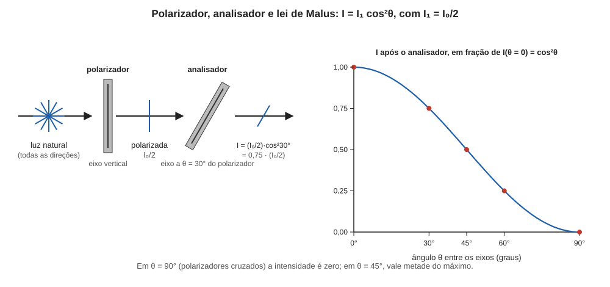

# Aula 05: Polarização, Parte 1 — polarização por absorção e lei de Malus

**ID:** mineralogia-m14-a04
**Módulo:** [[14-optica-fisica-modulo|Módulo 14 — Óptica física para mineralogia: luz, refração, polarização e interferência]]
**Duração estimada:** ~26 min
**Nível:** ensino médio, sem geologia prévia (contrato `ensino-medio-sem-geologia-v1`)
**Objetivo:** descrever a luz polarizada, explicar como um filtro polarizador seleciona uma direção de oscilação do campo elétrico (polarização por absorção) e calcular a intensidade transmitida por um ou mais filtros com a lei de Malus.
**Pré-requisito:** [[14-optica-fisica-aula-01-a-luz-como-onda-eletromagnetica|aula 01]] (luz como onda transversal; campo elétrico E).
**Esta é a Parte 1.** A Parte 2 (polarização por reflexão e por dupla refração) vem na aula 06.

> A aula "Polarização" do planejamento foi dividida em duas para caber em 30 minutos: aqui, a polarização por absorção, que é a do microscópio; na Parte 2, os outros dois mecanismos do objetivo.

## Vocabulário desta aula

| Termo | O que quer dizer |
|---|---|
| **polarização** | restrição da oscilação do campo elétrico a uma direção (ou a um padrão definido). |
| **luz natural (não polarizada)** | luz em que E oscila, ao longo do tempo, em todas as direções perpendiculares à propagação. |
| **luz polarizada linearmente** | luz em que E oscila sempre numa só direção. |
| **direção de vibração** | direção em que E oscila (também chamada de direção de polarização). |
| **polarizador** | filtro que deixa passar só a componente de E numa direção, o eixo de transmissão. |
| **analisador** | segundo polarizador, colocado depois do primeiro, usado para analisar a luz já polarizada. |
| **polarizadores cruzados** | polarizador e analisador com eixos perpendiculares (90°). |
| **cosseno** | num triângulo retângulo, razão entre o cateto adjacente ao ângulo e a hipotenusa. |

## Antes de começar, você precisa saber

- Que a luz é onda transversal e que o vetor campo elétrico **E** oscila perpendicularmente à propagação (aula 01).
- Decomposição de um vetor: um vetor de módulo E inclinado de um ângulo θ em relação a uma direção tem, nessa direção, a componente **E cos θ**, e na perpendicular, **E sen θ**. Valores: cos 0° = 1; cos 30° ≈ 0,866; cos 45° ≈ 0,707; cos 60° = 0,5; cos 90° = 0.
- Que a intensidade (brilho) de uma onda é proporcional ao **quadrado** da amplitude: duas vezes a amplitude de E dá quatro vezes a intensidade.

## Ao final você vai conseguir

- `mineralogia-m14-oa04` — Explicar a polarização da luz por absorção, reflexão e dupla refração. (Parte 1: absorção; a reflexão e a dupla refração ficam na Parte 2, aula 06.)

## Conteúdo

### Luz natural e luz polarizada

Na aula 01, o campo elétrico da luz oscilava num plano perpendicular à direção em que a luz avança. Dentro desse plano, o vetor **E** pode apontar para cima e para baixo, para a direita e a esquerda, ou em qualquer direção intermediária. A luz do Sol ou de uma lâmpada incandescente vem de bilhões de átomos emitindo de modo independente, cada um com sua direção; somando todos, **E** varia de direção ao acaso, rapidamente, e nenhuma direção predomina. É a **luz natural** (ou não polarizada).

Se, por algum processo, E fica restrito a uma só direção, a luz é **polarizada linearmente** (ou plano-polarizada), e a direção da oscilação é a **direção de vibração**. A luz polarizada se comporta exatamente como a luz natural quanto a n e a Snell; a diferença está em como ela interage com materiais **que distinguem direções**: filtros polarizadores e, o ponto da mineralogia óptica, cristais anisotrópicos.

### Polarização por absorção: o filtro polarizador

Um **polarizador** é uma folha plástica (como a das lentes de óculos polarizados) onde moléculas longas e condutoras foram esticadas e alinhadas numa só direção. Uma componente de E que oscila **ao longo** das moléculas faz os elétrons delas se moverem, e a energia dessa componente é gasta como calor: foi absorvida. A componente **perpendicular** às moléculas move pouco os elétrons e atravessa. O resultado é que a folha transmite a vibração numa direção definida, o **eixo de transmissão**, e absorve a perpendicular a ela. Para o microscópio de mineralogia óptica, a direção do eixo de transmissão de cada polarizador é conhecida e marcada: no módulo 15, as direções dos dois filtros serão fixas e perpendiculares entre si (em geral, uma de leste a oeste e a outra de norte a sul, em relação ao observador).

Qualquer direção de E pode ser pensada como a soma de duas componentes perpendiculares: uma ao longo do eixo de transmissão e outra perpendicular a ele. O polarizador **corta a perpendicular e deixa a paralela**. Se **E** faz o ângulo θ com o eixo, a componente que passa tem amplitude **E cos θ**.

Luz natural atravessando um polarizador: como todas as direções de E aparecem com igual probabilidade, em média metade da energia passa. A luz que emerge está polarizada ao longo do eixo e tem **intensidade I₀/2**, onde I₀ é a intensidade da luz natural incidente (num polarizador ideal, sem perdas extras).

### A lei de Malus

Agora ponha um segundo polarizador (o **analisador**) depois do primeiro, com eixo formando o ângulo θ com o do primeiro. A luz que chega ao analisador está polarizada e tem amplitude E₁ numa direção que faz o ângulo θ com o eixo do analisador. A componente que passa é E₁ cos θ. Como a intensidade é proporcional ao quadrado da amplitude:

**I = I₁ · cos²θ**   (lei de Malus)

em que I₁ é a intensidade da luz que chega ao analisador, já polarizada. Formulada por Étienne-Louis Malus no início do século XIX. Casos notáveis:

- θ = 0° (eixos paralelos): cos² = 1; toda a luz passa (num polarizador ideal).
- θ = 90° (**polarizadores cruzados**): cos 90° = 0; **nada passa**. Campo escuro.
- θ = 45°: cos² 45° = 0,5; metade passa.

*Figura 5. À esquerda, luz natural, polarizada pelo primeiro filtro (I₀/2) e analisada com ângulo de 30°; à direita, a curva cos²θ. O que observar: a intensidade cai suavemente de 1 (0°) a 0 (90°), e passa por 0,5 em 45°.*

### Por que isso importa para a mineralogia óptica

O **microscópio petrográfico** (módulo 15) tem dois polarizadores: um **polarizador** abaixo da lâmina do mineral e um **analisador** acima, que pode ser inserido ou retirado. Com os dois cruzados e **sem** a lâmina, o campo fica escuro: é a situação de θ = 90°. Se um mineral isotrópico (vidro, halita, granada) é colocado entre os dois, **continua escuro**, porque ele não altera a direção de vibração. Se um mineral anisotrópico decompõe E em duas vibrações perpendiculares que o atravessam em velocidades diferentes (a dupla refração, aula 06), a luz que chega ao analisador deixa de ser polarizada só na direção do primeiro filtro, e **parte passa**: o mineral "acende" entre polarizadores cruzados. Reconhecer essa diferença é o primeiro passo da identificação óptica. A aula 07 vai explicar por que a luz que passa tem cor.

### O experimento dos três polarizadores

Um resultado que parece contraditório fecha a lógica da lei de Malus. Dois polarizadores cruzados não deixam passar luz. Se um **terceiro**, com eixo a 45° dos outros dois, é inserido **entre** eles, passa luz. Isto se explica sem mistério: o terceiro filtro não só corta, ele **reorienta** a direção de vibração. Após o primeiro, E está a 0°; após o do meio (a 45°), E está a 45°, com intensidade reduzida; para o analisador (a 90° do primeiro), o ângulo entre o E que chega (45°) e o eixo (90°) é de 45°, e novamente parte passa. Esse resultado antecipa um fato central da mineralogia óptica: um mineral entre polarizadores cruzados pode fazer passar luz porque **decompõe** a vibração em duas direções. A comparação com o filtro do meio tem limite, e é bom saber onde: o filtro entrega **uma** vibração, a 45°, e sempre deixa passar luz; o mineral entrega **duas**, uma atrasada em relação à outra, e quanto passa depende desse atraso (aula 07) e da posição do cristal entre os filtros (módulo 15). Pode passar muita luz, pouca ou nenhuma.

## Exemplo trabalhado

**Problema.** Um feixe de luz natural, de intensidade I₀ = 100 (unidades arbitrárias), atravessa um polarizador e depois um analisador cujo eixo forma o ângulo θ com o do polarizador. Calcule a intensidade final para (a) θ = 0°, (b) θ = 30°, (c) θ = 60°, (d) θ = 90°, e (e) com um terceiro polarizador a 45°, entre os dois, em polarizadores cruzados.

**Passo comum:** após o primeiro filtro, I₁ = I₀/2 = 50.

**(a)** I = 50 · cos²0° = 50 · 1 = **50**.

**(b)** I = 50 · cos²30° = 50 · (0,866)² = 50 · 0,75 = **37,5**.

**(c)** I = 50 · cos²60° = 50 · (0,5)² = 50 · 0,25 = **12,5**.

**(d)** I = 50 · cos²90° = **0** (cruzados).

**(e) Três filtros.** Após o primeiro: 50. Após o do meio (45° do primeiro): 50 · cos²45° = 50 · 0,5 = 25, polarizada a 45°. Após o analisador (45° do filtro do meio): 25 · cos²45° = 25 · 0,5 = **12,5**. Dois filtros cruzados davam 0; com um terceiro no meio passam 12,5, isto é, 12,5% do I₀ original.

**Conferência:** os valores têm de decrescer de (a) para (d); decrescem (50; 37,5; 12,5; 0). E (b) + (c) dá exatamente 50, não por acaso: cos 60° = sen 30°, e cos²θ + sen²θ = 1, ou seja, as componentes paralela e perpendicular a um eixo somam a intensidade inteira. Contas refeitas em Python.

**Método geral:** (1) luz natural: metade passa pelo primeiro filtro; (2) para cada filtro seguinte, I = I_anterior · cos²θ, onde θ é o ângulo entre a direção de vibração da luz que chega e o eixo do filtro; (3) após cada filtro, a luz fica polarizada ao longo do eixo dele.

## Erros comuns

- **Aplicar cos θ em vez de cos²θ à intensidade.** cos θ é a razão de amplitudes; a intensidade usa o quadrado.
- **Aplicar a lei de Malus à luz natural.** A luz natural perde metade da intensidade no primeiro filtro (I₀/2); só depois vale I = I₁cos²θ.
- **Achar que filtros cruzados bloqueiam sempre toda a luz.** Bloqueiam a luz polarizada na direção do primeiro; se algo entre eles reorientar a vibração, passa luz.
- **Pensar que o polarizador funciona como uma grade de fendas por onde a luz "passa ou não".** No polarizador de folha, as moléculas alinhadas **absorvem** a componente ao longo delas e deixam passar a perpendicular; a imagem da grade engana sobre qual componente passa.
- **Confundir eixo de transmissão com direção das moléculas.** Em filtros de folha, a transmissão é perpendicular ao alinhamento das moléculas.

## O que não concluir

- Que luz polarizada seja uma luz "diferente" ou com outra cor: tem o mesmo λ e a mesma velocidade que a natural.
- Que polarizadores ideais existam: filtros reais absorvem algo da luz paralela e deixam passar algo da perpendicular. Os valores aqui são de polarizadores ideais.
- Que a lei de Malus descreva a luz que passa por um cristal. Ela descreve só filtros polarizadores; o cristal acrescenta a dupla refração e a interferência (aulas 06 e 07).

## Recap relâmpago

- Luz natural: E oscila em todas as direções; polarizada: E oscila numa só direção.
- Um polarizador absorve a componente de E numa direção e deixa passar a perpendicular, o eixo de transmissão.
- Luz natural por um polarizador: intensidade I₀/2, polarizada.
- Lei de Malus: I = I₁ cos²θ; θ = 90° (cruzados) dá zero.
- Um terceiro filtro a 45° entre os cruzados faz passar 12,5% da luz natural inicial, porque reorienta a vibração. Um mineral anisotrópico também pode "acender" entre filtros cruzados, mas por outro caminho: divide a vibração em duas, e quanto passa depende do atraso entre elas (aula 07).

## Próxima aula

Em [[14-optica-fisica-aula-06-polarizacao-parte-2-reflexao-e-dupla-refracao|Aula 06 — Polarização, Parte 2: reflexão e dupla refração]], dois processos que polarizam a luz sem filtro: a reflexão no ângulo de Brewster e a dupla refração dos cristais, o mais importante para a mineralogia.

## Fontes consultadas

- Hecht, E., *Optics* (polarização por dicroísmo/absorção, lei de Malus, luz natural e polarizada).
- Britannica, *Brewster's law*, e Wikipedia, *Brewster's angle*: Malus observou a polarização pela reflexão em 1808 (comunicada ao Institut em dezembro de 1808); a lei do cos²θ aparece no artigo de 1809, *Sur une propriété de la lumière réfléchie* (Wikipedia, *Étienne-Louis Malus*; MacTutor/DSB, *Malus*), conferido na auditoria de 2026-10-07.
- Polarizador de folha (H-sheet: PVA estirado e dopado com iodo, que absorve a componente de E ao longo das cadeias): Wikipedia, *Polaroid (polarizer)*, conferido na auditoria de 2026-10-07.
- Lei de Malus e sequência de três polarizadores: contas refeitas em Python em 2026-10-07.

<!--
nivel: ensino-medio-sem-geologia-v1
palavras_corpo: 1565
cobertura:
  mineralogia-m14-oa04: [Conteúdo, Exemplo trabalhado]
figuras:
  - 14-optica-fisica-fig-05-polarizacao-malus.svg
alegacoes_auditaveis:
  - claim_id: OPT-POL-NAT-001
    claim: "Luz natural: E oscila ao acaso em todas as direcoes perpendiculares a propagacao; luz polarizada linearmente: E oscila numa so direcao; a luz polarizada tem o mesmo lambda e a mesma velocidade da natural."
    risk: conceito
    source: "Hecht, Optics"
    audit: "verificado em 2026-10-07 (Hecht, Optics)"
  - claim_id: OPT-POL-ABS-001
    claim: "Polarizador de folha: moleculas longas alinhadas absorvem a componente de E ao longo delas e transmitem a perpendicular (eixo de transmissao); luz natural por um polarizador ideal tem intensidade I0/2."
    risk: conceito
    source: "Hecht, Optics (a confirmar na auditoria)"
    audit: "verificado em 2026-10-07 (Wikipedia, Polaroid (polarizer): PVA com iodo absorve E ao longo das cadeias)"
  - claim_id: OPT-POL-MALUS-001
    claim: "Lei de Malus: I = I1 cos^2(theta) para luz ja polarizada atravessando analisador a theta do eixo; theta = 90 graus (cruzados) da zero; amplitude E cos theta, intensidade proporcional ao quadrado da amplitude."
    risk: conceito
    source: "Hecht, Optics"
    audit: "verificado em 2026-10-07 (Hecht, Optics)"
  - claim_id: OPT-POL-HIST-001
    claim: "A polarizacao pela reflexao foi observada por Etienne-Louis Malus em 1808; a lei de Malus e do inicio do seculo XIX."
    risk: data
    source: "Britannica, Brewster's law; Wikipedia, Brewster's angle (a confirmar)"
    audit: "verificado em 2026-10-07 (Malus: reflexao em 1808; lei do cos2 em 1809 (Wikipedia, Etienne-Louis Malus))"
  - claim_id: OPT-POL-CALC-001
    claim: "Com I0 = 100: apos o primeiro filtro 50; analisador a 0, 30, 60 e 90 graus: 50; 37,5; 12,5; 0; tres polarizadores (0, 45 e 90 graus): 12,5."
    risk: numero
    source: "lei de Malus, calculo em Python (2026-10-07)"
    audit: "verificado em 2026-10-07 (Python: 50; 37,5; 12,5; 0; tres filtros 12,5)"
  - claim_id: OPT-POL-MICRO-001
    claim: "No microscopio petrografico ha polarizador abaixo da lamina e analisador acima; com os dois cruzados e sem amostra o campo e escuro; mineral isotropico entre eles permanece escuro; mineral anisotropico faz passar luz porque reorienta (decompoe) a vibracao."
    risk: conceito
    source: "Klein & Dutrow; modulo 15 (desenvolve)"
    audit: "verificado em 2026-10-07 (Klein & Dutrow; Nesse)"
  - claim_id: OPT-FIG05-MALUS-001
    claim: "Figura 5: luz natural, polarizador (I0/2), analisador a 30 graus (I = 0,75 x I0/2) e curva cos^2(theta) com pontos em 0, 30, 45, 60 e 90 graus; titulo I = I1 cos^2(theta), com I1 = I0/2."
    risk: numero
    source: "lei de Malus; Python"
    audit: "corrigido em 2026-10-07 (achado 5: titulo da figura usava I0, que na aula e a luz natural)"
  - claim_id: OPT-POL-DIDAT-001
    claim: "O filtro intermediario a 45 graus entrega uma unica vibracao e sempre deixa passar luz; um mineral anisotropico entrega duas vibracoes, uma atrasada em relacao a outra, e entre polarizadores cruzados a luz que passa depende desse atraso e da posicao do cristal entre os filtros, podendo ser nenhuma; cos2(30) + cos2(60) = 1 porque cos 60 = sen 30."
    risk: conceito
    source: "Hecht, Optics; Nesse, Introduction to Optical Mineralogy"
    audit: "verificado em 2026-10-07 (segunda passagem: Hecht, Optics, I proporcional a sen2(2phi) sen2(pi Gamma/lambda); Python cos2 30 + cos2 60 = 1)"
-->
