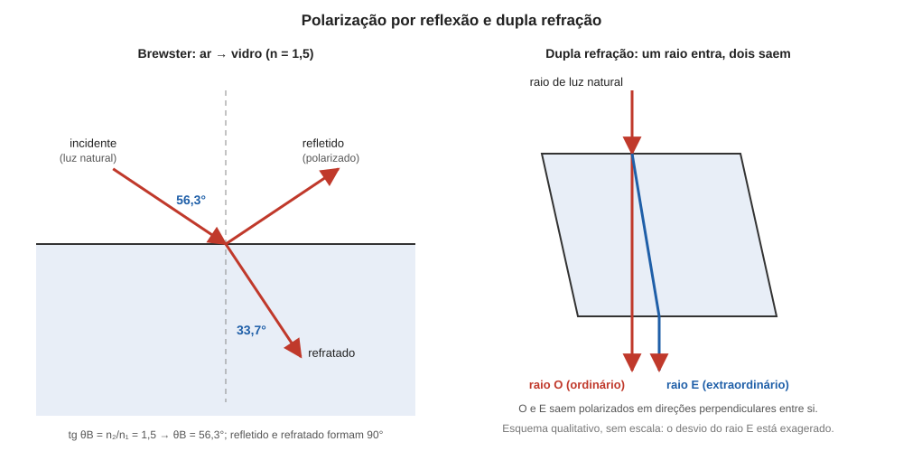

# Aula 06: Polarização, Parte 2 — reflexão e dupla refração

**ID:** mineralogia-m14-a07
**Módulo:** [[14-optica-fisica-modulo|Módulo 14 — Óptica física para mineralogia: luz, refração, polarização e interferência]]
**Duração estimada:** ~26 min
**Nível:** ensino médio, sem geologia prévia (contrato `ensino-medio-sem-geologia-v1`)
**Objetivo:** explicar como a reflexão (ângulo de Brewster) e a dupla refração dos cristais polarizam a luz, descrever os dois raios da calcita e definir birrefringência, eixo óptico e sinal óptico num cristal uniaxial.
**Pré-requisito:** [[14-optica-fisica-aula-05-polarizacao-parte-1-polarizacao-por-absorcao-e-lei-de-malus|aula 05]] (luz polarizada, direção de vibração) e [[14-optica-fisica-aula-02-refracao-indice-de-refracao-e-lei-de-snell|aula 02]] (lei de Snell).
**Esta é a Parte 2.** A Parte 1 (polarização por absorção e lei de Malus) está na aula 05; esta aula tem ID novo (`a07`) porque o planejamento original tinha uma aula só, dividida na redação.

## Vocabulário desta aula

| Termo | O que quer dizer |
|---|---|
| **plano de incidência** | plano que contém o raio incidente e a normal. |
| **ângulo de Brewster (θB)** | ângulo de incidência em que a luz refletida é totalmente polarizada. |
| **dupla refração (birrefringência)** | divisão de um raio de luz em dois raios, de velocidades e polarizações diferentes, ao entrar num cristal anisotrópico. |
| **raio ordinário (O)** | raio que obedece à lei de Snell com um índice fixo (ω). |
| **raio extraordinário (E)** | raio cujo índice depende da direção de propagação (varia de ε a ω). |
| **cristal uniaxial** | cristal anisotrópico com uma só direção em que a luz não se divide, o **eixo óptico**; nele, o eixo óptico coincide com o eixo c. A aula 08 mostra quais sistemas cristalinos são uniaxiais. |
| **eixo óptico** | direção, num cristal uniaxial, ao longo da qual a luz não se divide em dois raios. |
| **birrefringência (valor)** | valor absoluto da diferença entre os dois índices principais (ε e ω) de um cristal uniaxial. |
| **sinal óptico** | positivo se ε > ω; negativo se ε < ω. |

## Antes de começar, você precisa saber

- Que a luz natural tem E em todas as direções e a polarizada, numa só (aula 05).
- A lei de Snell e o conceito de n (aula 02), e que n pode depender da direção em cristais não cúbicos (aula 02, anunciada; desenvolvida aqui e na aula 08).
- O **eixo c**: o eixo cristalográfico que, nos sistemas tetragonal, hexagonal e trigonal, é posto ao longo do eixo de simetria principal ([[05-miller-e-projecao-aula-01-eixos-cristalograficos-e-parametros-de-cela-por-sistema|módulo 05, aula 01]]).
- A tangente: tg θ = cateto oposto / cateto adjacente. Valores: tg 45° = 1; tg 56,3° ≈ 1,5.

## Ao final você vai conseguir

- `mineralogia-m14-oa04` — Explicar a polarização da luz por absorção, reflexão e dupla refração. (Parte 2: reflexão e dupla refração.)

## Conteúdo

### Polarização por reflexão

A luz natural que bate numa superfície lisa (água parada, vidro, uma face polida de mineral) é refletida em parte, e a luz refletida tem **polarização parcial**: a vibração **perpendicular ao plano de incidência** é refletida mais do que a paralela. A razão é a mesma da refração (aula 02): o campo elétrico da luz põe em movimento as cargas do material, e são elas que reirradiam a luz refletida; uma carga que oscila ao longo de uma direção não irradia nessa mesma direção. Em um ângulo particular, o **ângulo de Brewster**, a componente paralela ao plano de incidência não é refletida de modo algum, e a luz refletida fica **totalmente polarizada**, com E perpendicular ao plano de incidência. A lei de Brewster dá o ângulo:

**tg θB = n₂ / n₁**

onde n₁ é o índice do meio de onde a luz vem e n₂, o do meio refletor. Nesse ângulo, o raio refletido e o raio refratado formam **90°** entre si, e é isso que liga a lei à explicação acima: a componente paralela ao plano de incidência faz as cargas do meio refletor oscilarem perpendicularmente ao raio refratado, isto é, exatamente na direção em que o refletido teria de sair, e nessa direção elas não irradiam. Valores, vindo do ar (n₁ = 1,000): água (n = 1,333), θB = 53,1°; vidro comum (n = 1,5), θB = 56,3°; diamante (n = 2,4175), θB = 67,5°. Isso explica por que **óculos polarizados** reduzem o reflexo da água e do asfalto molhado: o brilho refletido está polarizado na horizontal, e a lente, com eixo vertical, o bloqueia.

*Figura 6. À esquerda, o ângulo de Brewster ar-vidro: refletido e refratado a 90°. À direita, esquema da dupla refração na calcita (sem escala). O que observar: dentro do cristal os dois raios seguem trajetos diferentes e saem polarizados em direções perpendiculares.*

### Dupla refração: o fenômeno que o mineralogista usa

Em 1669, o dinamarquês Erasmus Bartholin descreveu um cristal de calcita transparente da Islândia que, posto sobre um texto, mostrava **duas imagens** de cada letra. A explicação veio com a óptica ondulatória: a luz que entra num cristal anisotrópico se divide em **dois raios**, que se propagam com **velocidades diferentes**, em direções ligeiramente diferentes, e saem **polarizados em direções perpendiculares**. É a **dupla refração**.

Num cristal uniaxial (aula 08), os dois raios são:

- o **raio ordinário (O)**, que obedece à lei de Snell com um índice **fixo, ω**, qualquer que seja a direção. Vibra **perpendicularmente** ao plano que contém o eixo óptico e o raio;
- o **raio extraordinário (E)**, cujo índice depende da direção de propagação: vale **ω** quando a luz caminha **ao longo** do eixo óptico, e vai até **ε** quando caminha **perpendicular** a ele. Vibra **dentro** desse plano. Por isso o raio E não segue a lei de Snell com um n único, e pode se desviar mesmo quando a luz entra perpendicular à face (Figura 6).

Por que a luz se divide em duas? Porque a resposta do cristal ao campo elétrico depende da direção do campo em relação ao arranjo de átomos. Na calcita, por exemplo, os grupos CO₃ ficam em planos perpendiculares ao eixo c, e um campo E dentro desses planos move os elétrons de modo diferente de um campo E ao longo de c. Se a vibração é em uma direção, a luz "vê" um índice; na perpendicular, outro. Qualquer luz que entra se decompõe em **duas** vibrações perpendiculares (ordinária e extraordinária), cada uma com seu índice e sua velocidade.

### Eixo óptico, birrefringência e sinal óptico

Ao longo do **eixo óptico** não há dupla refração: a luz que anda nessa direção vê o mesmo índice, ω, para qualquer vibração, e não se divide. Nas outras direções, os dois raios têm índices diferentes. A **birrefringência** é a diferença entre os índices máximo e mínimo: o **valor absoluto de ε − ω**. Dados do *Handbook of Mineralogy*:

| Mineral | ω | ε | Birrefringência (valor absoluto de ε − ω) | Sinal |
|---|---|---|---|---|
| calcita | 1,658 | 1,486 | 0,172 | negativo (ε < ω) |
| quartzo | 1,544 | 1,553 | 0,009 | positivo (ε > ω) |
| rutilo | 2,605–2,613 | 2,899–2,901 | cerca de 0,29 | positivo |
| coríndon | 1,767–1,772 | 1,759–1,763 | cerca de 0,008 a 0,009 | negativo |

Na calcita, o raio ordinário (que vibra perpendicular ao eixo c, no plano dos grupos CO₃) tem v = c/1,658 ≈ 1,81 × 10⁸ m/s, e a vibração extraordinária **paralela** ao eixo c (luz caminhando perpendicular a c) tem v = c/1,486 ≈ 2,02 × 10⁸ m/s, mais rápida. A diferença de 11% é grande, e por isso a calcita é o exemplo clássico: as duas imagens se separam a olho nu. No quartzo (0,009), as duas velocidades quase coincidem e o efeito só aparece com instrumento, em lâmina fina entre polarizadores.

Minerais que **não** dividem a luz são os **isotrópicos**: fluorita, halita, diamante, esfalerita e granadas têm um só n em todas as direções; o vidro e a opala (amorfos) também.

## Exemplo trabalhado

**Problema.** (a) Calcule o ângulo de Brewster para a luz no ar refletida na água (n = 1,333) e o ângulo do raio refratado. (b) Um raio entra na calcita com 40° de incidência. Calcule o ângulo do raio ordinário. (c) Classifique o sinal óptico e a birrefringência do coríndon tomando ω = 1,767 e ε = 1,759.

**(a)** tg θB = 1,333/1,000 = 1,333 → θB = **53,1°**. O refratado: n₁ sen θ₁ = n₂ sen θ₂ → sen θ₂ = sen 53,1° / 1,333 = 0,8/1,333 = 0,6 → θ₂ = **36,9°**. Soma: 53,1° + 36,9° = 90°. É a característica de Brewster, e é uma boa conferência.

**(b)** O raio ordinário obedece à lei de Snell com n = ω = 1,658: sen θ₂ = sen 40° / 1,658 = 0,6428 / 1,658 = 0,3877 → θ₂ = **22,8°**. Para o raio extraordinário **não** se usa a lei de Snell com um n único, por isso não há conta análoga aqui: seu desvio depende da orientação do eixo óptico.

**(c)** ε − ω = 1,759 − 1,767 = −0,008, ou seja, ε < ω: sinal **negativo**; birrefringência (valor absoluto) = **0,008**. Os dois índices sobem **juntos** com o teor de Fe e Cr, e por isso a birrefringência do coríndon fica perto de 0,008 a 0,009 nas amostras reais. Combinar o ω mínimo com o ε máximo do intervalo do Handbook (0,004), ou o contrário (0,013), mistura amostras diferentes e dá valores que nenhum cristal mostra.

**Método geral:** (1) Brewster: θB = tg⁻¹(n₂/n₁) e θB + θ₂ = 90°; (2) dupla refração: O sempre obedece Snell com ω; (3) birrefringência = valor absoluto de ε − ω e sinal pelo sinal de ε − ω.

## Erros comuns

- **Achar que a luz refletida é sempre totalmente polarizada.** Só no ângulo de Brewster; fora dele é parcialmente polarizada.
- **Aplicar a lei de Snell ao raio extraordinário com um único n.** Só o raio ordinário a obedece com n fixo.
- **Trocar ω e ε.** ω é o índice do raio ordinário (e de qualquer luz que caminhe ao longo do eixo óptico); ε é o extremo do índice do raio extraordinário, atingido quando a luz caminha perpendicular ao eixo.
- **Esquecer o sinal.** Calcita e quartzo têm birrefringências muito diferentes, mas o que os distingue em sinal é a ordem de ε e ω.

## O que não concluir

- Que todo cristal divida a luz em dois. Os isotrópicos (cúbicos e amorfos) não dividem.
- Que o raio E seja "mais lento" ou "mais rápido" por definição. Depende do mineral: na calcita (negativa), a vibração do E é a mais rápida; no quartzo (positivo), a mais lenta.
- Que o "eixo óptico" seja um eixo cristalográfico qualquer. Em cristais uniaxiais, coincide com o eixo de simetria principal (aula 08).
- Que o n tabelado de um mineral anisotrópico seja um só. Há dois (uniaxial) ou três (biaxial).

## Recap relâmpago

- A reflexão polariza a luz; no ângulo de Brewster (tg θB = n₂/n₁) a polarização é total e refletido e refratado formam 90°.
- A dupla refração divide a luz em dois raios, com velocidades diferentes e polarizações perpendiculares (calcita: Bartholin, 1669).
- Raio O: segue Snell com ω; raio E: índice varia de ω (ao longo do eixo óptico) a ε (perpendicular a ele).
- Birrefringência = valor absoluto de ε − ω; calcita 0,172 (−), quartzo 0,009 (+).
- Cristais isotrópicos não dividem a luz.

## Próxima aula

Em [[14-optica-fisica-aula-07-interferencia-retardo-e-anisotropia-optica-parte-1-interferencia-e-retardo|Aula 07 — Interferência, retardo e anisotropia óptica, Parte 1: interferência e retardo]], o que ocorre quando os dois raios saem do cristal atrasados um em relação ao outro e voltam a se encontrar.

## Fontes consultadas

- Hecht, E., *Optics* (polarização por reflexão, lei de Brewster, dupla refração e eixo óptico).
- *Handbook of Mineralogy*: calcita (uniaxial negativa, ω = 1,658, ε = 1,486), quartzo (uniaxial positivo, ω = 1,544, ε = 1,553), rutilo (uniaxial positivo, ω = 2,605 a 2,613, ε = 2,899 a 2,901), coríndon (uniaxial negativo, ω = 1,767 a 1,772, ε = 1,759 a 1,763), lidos em 2026-10-07.
- Ângulo de Brewster ar-vidro de n = 1,5 (56,3°; no texto da fonte, 56°19′): Britannica, *Brewster's law*, e Wikipedia, *Brewster's angle*, buscadas em 2026-10-07. Bartholin, *Experimenta crystalli islandici disdiaclastici* (1669): MacTutor (St Andrews), *Erasmus Bartholin*, conferido na auditoria de 2026-10-07. Grupos CO₃ da calcita em planos perpendiculares ao eixo c, com a vibração ordinária nesse plano: Klein & Dutrow e literatura de óptica da calcita, conferido na auditoria de 2026-10-07. Birrefringência real do coríndon (0,008 a 0,010): GIA, *Ruby* (Gem Encyclopedia), e Gem Society, tabela de índices e dupla refração, conferido na auditoria de 2026-10-07. Índice da água (1,333 a 20 °C, 589 nm): Wikipedia, *List of refractive indices*.
- Contas refeitas em Python em 2026-10-07.

<!--
nivel: ensino-medio-sem-geologia-v1
palavras_corpo: 1449
cobertura:
  mineralogia-m14-oa04: [Conteúdo, Exemplo trabalhado]
figuras:
  - 14-optica-fisica-fig-06-brewster-e-dupla-refracao.svg
alegacoes_auditaveis:
  - claim_id: OPT-BRE-LEI-001
    claim: "Lei de Brewster: tg theta_B = n2/n1; no angulo de Brewster a luz refletida e totalmente polarizada com E perpendicular ao plano de incidencia, e refletido e refratado formam 90 graus."
    risk: conceito
    source: "Hecht, Optics; Britannica, Brewster's law"
    audit: "verificado em 2026-10-07 (Hecht, Optics; Britannica, Brewster law)"
  - claim_id: OPT-BRE-VALORES-001
    claim: "Angulos de Brewster a partir do ar: agua (n 1,333) 53,1 graus (refratado 36,9); vidro (n 1,5) 56,3 graus; diamante (n 2,4175) 67,5 graus."
    risk: numero
    source: "calculo tg theta_B = n (Python, 2026-10-07); vidro 56 graus 19 min: Britannica"
    audit: "verificado em 2026-10-07 (Python: 53,12/36,88; 56,31; 67,53 graus)"
  - claim_id: OPT-BRE-OCULOS-001
    claim: "Oculos polarizados reduzem o reflexo de agua e asfalto molhado porque a luz refletida e polarizada na horizontal e a lente tem eixo vertical."
    risk: fato
    source: "Hecht, Optics (a confirmar)"
    audit: "verificado em 2026-10-07 (Hecht, Optics)"
  - claim_id: OPT-DUPLA-FENOM-001
    claim: "A dupla refracao divide a luz em dois raios de velocidades diferentes, em trajetos ligeiramente diferentes, saindo polarizados em direcoes perpendiculares; Erasmus Bartholin descreveu o fenomeno na calcita da Islandia em 1669."
    risk: data
    source: "Hecht, Optics (data a confirmar na auditoria)"
    audit: "verificado em 2026-10-07 (MacTutor: Bartholin, Experimenta crystalli islandici disdiaclastici, 1669)"
  - claim_id: OPT-DUPLA-OE-001
    claim: "Em cristal uniaxial: raio O obedece Snell com n fixo omega e vibra perpendicular ao plano que contem o eixo optico e o raio; raio E tem n que varia de omega (propagacao ao longo do eixo optico) a epsilon (perpendicular) e vibra nesse plano; ao longo do eixo optico nao ha dupla refracao."
    risk: conceito
    source: "Hecht, Optics; Klein & Dutrow"
    audit: "verificado em 2026-10-07 (Hecht, Optics; Klein & Dutrow)"
  - claim_id: OPT-DUPLA-CALCITA-001
    claim: "Na calcita os grupos CO3 ficam em planos perpendiculares ao eixo c, e a resposta ao campo eletrico depende da direcao do campo em relacao a esses planos."
    risk: fato
    source: "Klein & Dutrow (estrutura da calcita; a confirmar)"
    audit: "verificado em 2026-10-07 (Klein & Dutrow; CO3 em planos perpendiculares a c)"
  - claim_id: OPT-DUPLA-DADOS-001
    claim: "Uniaxiais (Handbook of Mineralogy): calcita omega 1,658 epsilon 1,486 (negativa, 0,172); quartzo 1,544 e 1,553 (positivo, 0,009); rutilo omega 2,605-2,613 e epsilon 2,899-2,901 (positivo, ~0,29); corindon omega 1,767-1,772 e epsilon 1,759-1,763 (negativo, birrefringencia real ~0,008 a 0,009, porque os dois indices sobem juntos; exemplo com omega 1,767 e epsilon 1,759)."
    risk: numero
    source: "Handbook of Mineralogy (calcite, quartz, rutile, corundum)"
    audit: "corrigido em 2026-10-07 (achado 7: birrefringencia do corindon 0,008 a 0,009, nao 0,004 a 0,013)"
  - claim_id: OPT-DUPLA-VEL-001
    claim: "Na calcita v(O, vibracao perpendicular a c) = c/1,658 = 1,81 x 10^8 m/s e v(vibracao extraordinaria paralela a c, epsilon) = c/1,486 = 2,02 x 10^8 m/s."
    risk: numero
    source: "calculo v = c/n (Python, 2026-10-07)"
    audit: "corrigido em 2026-10-07 (achado 6: a vibracao de indice epsilon e paralela ao eixo c, nao perpendicular)"
  - claim_id: OPT-DUPLA-ISO-001
    claim: "Fluorita, halita, diamante, esfalerita e granadas sao isotropicos (n unico); vidro e opala (amorfos) tambem; ressalva: tensao pode causar anisotropia fraca."
    risk: fato
    source: "Handbook of Mineralogy (fluorita, halita, diamante, esfalerita: Optical Class isotropic)"
    audit: "verificado em 2026-10-07 (HoM: fluorite, halite, diamond, sphalerite Optical Class isotropic, com anisotropia anomala ou por tensao)"
  - claim_id: OPT-DUPLA-EXEMPLO-001
    claim: "Calcita com incidencia de 40 graus: raio ordinario refratado a 22,8 graus (n = omega 1,658); raio E nao segue Snell com n unico."
    risk: numero
    source: "Snell, Python (2026-10-07)"
    audit: "verificado em 2026-10-07 (Python: 22,81 graus)"
  - claim_id: OPT-FIG06-BREWDUPLA-001
    claim: "Figura 6: ar-vidro n 1,5 com theta_B 56,3 e refratado 33,7 graus (90 graus entre refletido e refratado); esquema qualitativo, sem escala, de raios O e E na calcita."
    risk: conceito
    source: "Brewster; esquema"
    audit: "verificado em 2026-10-07 (codigo SVG: 56,31/33,69 graus, 90 entre refletido e refratado; raio E desviado em incidencia normal e emergente paralelo; segunda passagem: rotulo 33,7 graus afastado do raio refratado, valores inalterados)"
  - claim_id: OPT-DUPLA-DIDAT-001
    claim: "Cristal uniaxial: um so eixo optico, que coincide com o eixo c; o eixo c e posto ao longo do eixo de simetria principal nos sistemas tetragonal, hexagonal e trigonal (modulo 05, aula 01). No angulo de Brewster a componente paralela ao plano de incidencia faz as cargas do meio refletor oscilarem perpendicularmente ao raio refratado, exatamente na direcao em que o refletido sairia, e cargas nao irradiam ao longo da propria direcao de oscilacao."
    risk: conceito
    source: "Hecht, Optics (modelo de dipolo para Brewster); Klein & Dutrow; modulo 05"
    audit: "verificado em 2026-10-07 (segunda passagem: Wikipedia, Brewster's angle (explicacao pelos dipolos); Hecht, Optics; modulo 05, aula 01)"
-->
