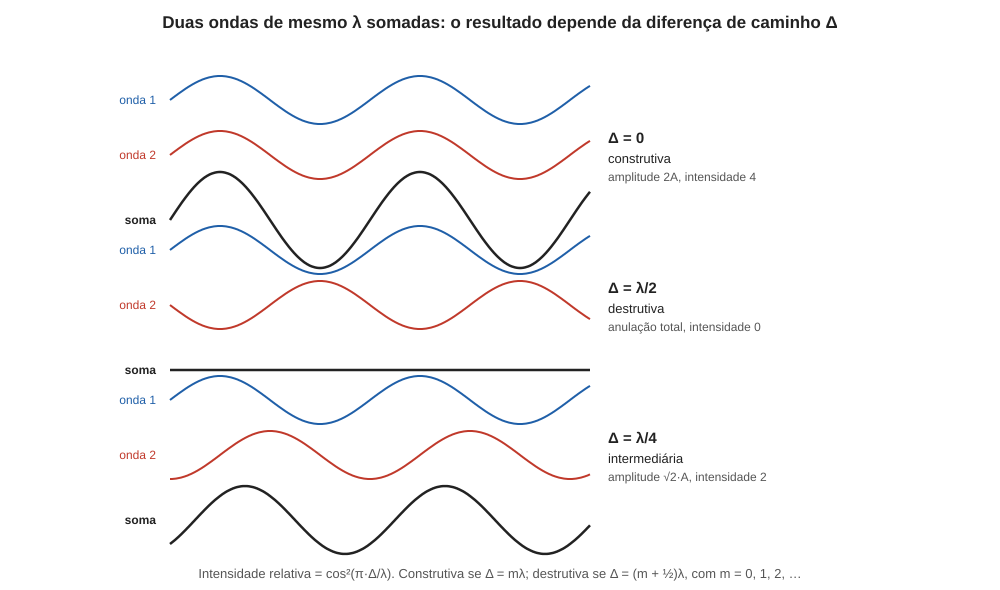

# Aula 07: Interferência, retardo e anisotropia óptica, Parte 1 — interferência e retardo

**ID:** mineralogia-m14-a05
**Módulo:** [[14-optica-fisica-modulo|Módulo 14 — Óptica física para mineralogia: luz, refração, polarização e interferência]]
**Duração estimada:** ~26 min
**Nível:** ensino médio, sem geologia prévia (contrato `ensino-medio-sem-geologia-v1`)
**Objetivo:** somar duas ondas de mesma frequência, definir a diferença de caminho (retardo), prever interferência construtiva ou destrutiva e calcular o retardo entre os dois raios que atravessam uma lâmina de cristal.
**Pré-requisito:** [[14-optica-fisica-aula-01-a-luz-como-onda-eletromagnetica|aula 01]] (λ, onda), [[14-optica-fisica-aula-02-refracao-indice-de-refracao-e-lei-de-snell|aula 02]] (n e velocidade) e [[14-optica-fisica-aula-06-polarizacao-parte-2-reflexao-e-dupla-refracao|aula 06]] (dupla refração, birrefringência).
**Esta é a Parte 1.** A Parte 2 (anisotropia óptica e simetria cristalina) vem na aula 08.

> A aula "Interferência, retardo e anisotropia óptica" do planejamento foi dividida em duas para caber em 30 minutos: aqui, interferência e retardo (objetivo `oa05`); na Parte 2, a ligação entre os índices e a simetria (objetivo `oa06`).

## Vocabulário desta aula

| Termo | O que quer dizer |
|---|---|
| **superposição** | num ponto onde duas ondas se encontram, o deslocamento total é a soma dos deslocamentos de cada uma. |
| **interferência** | efeito da superposição: reforço ou cancelamento conforme as cristas e vales coincidam ou não. |
| **fase** | posição de um ponto no ciclo da oscilação (crista, vale, ou entre eles). |
| **diferença de caminho (Δ)** | quanto uma onda está atrasada em relação à outra, medida em comprimento (nm). |
| **retardo (Γ)** | a diferença de caminho acumulada por duas vibrações ao atravessarem um cristal, Γ = d·(n₂ − n₁). |
| **construtiva / destrutiva** | interferência que reforça (cristas com cristas) / que anula (crista com vale). |
| **ordem de interferência (m)** | quantos comprimentos de onda inteiros cabem na diferença de caminho. |
| **coerência** | propriedade de ondas que mantêm uma diferença de fase constante; só ondas coerentes interferem de modo estável. |

## Antes de começar, você precisa saber

- Que a luz é onda de comprimento λ, de 380 a 750 nm (aula 01), e que um material de índice n retarda a luz (aula 02).
- Que a dupla refração divide a luz em dois raios, de índices diferentes (aula 06).
- Conversões: 1 mm = 1 000 µm = 1 000 000 nm; uma lâmina de mineral de 0,03 mm tem 30 µm = 30 000 nm de espessura.

## Ao final você vai conseguir

- `mineralogia-m14-oa05` — Calcular a diferença de caminho (retardo) entre dois raios e prever interferência construtiva ou destrutiva.

## Conteúdo

### Somar ondas

Duas ondas que ocupam o mesmo lugar ao mesmo tempo **se somam ponto a ponto**: onde as duas empurram para cima, o resultado é o dobro; onde uma empurra para cima e a outra para baixo, se cancelam. É a **superposição**. Considere duas ondas de **mesmo λ e mesma amplitude A**, uma deslocada em relação à outra pela diferença de caminho Δ. O deslocamento relativo, em fração do ciclo, é Δ/λ, e a diferença de fase é φ = 2π · Δ/λ (em radianos: 2π rad = 360°, um ciclo inteiro por comprimento de onda).

- Se Δ = 0, ou um número **inteiro** de comprimentos de onda (Δ = mλ), crista encontra crista: a amplitude resultante é **2A**, e a intensidade, proporcional ao quadrado, é **4** (contra 1 de uma onda só). **Interferência construtiva.**
- Se Δ = λ/2, ou meio comprimento de onda mais um número inteiro (Δ = (m + ½)λ), crista encontra vale: a amplitude resultante é **0**. **Interferência destrutiva**: as ondas se anulam.
- Em valores intermediários, o resultado fica entre os dois: a amplitude resultante vale 2A·|cos(πΔ/λ)| e a intensidade, em fração do máximo, **cos²(πΔ/λ)**. Para Δ = λ/4, amplitude √2·A ≈ 1,41 A e intensidade 2 (metade do máximo).

*Figura 7. Duas ondas de mesmo λ somadas para Δ = 0 (reforço), Δ = λ/2 (anulação) e Δ = λ/4 (intermediário). O que observar: só a diferença de caminho decide o resultado; as ondas são as mesmas nas três linhas.*

A energia não é destruída na interferência destrutiva: ela reaparece em outros pontos, onde há reforço. A soma das intensidades médias continua igual à das duas ondas.

### Condições para ver a interferência

Duas ondas só produzem um padrão estável de reforço e anulação se forem **coerentes** (a diferença de fase se mantém no tempo), de **mesma frequência** e com **vibrações na mesma direção**. Duas lâmpadas distintas, por exemplo, não interferem de modo visível, porque cada átomo emite com fase independente. A solução é partir **uma só onda em duas** e depois juntar as duas partes: assim as duas descendem da mesma onda e mantêm fase constante entre si. Num cristal iluminado com luz **já polarizada** (o polarizador abaixo da lâmina, aula 05), a dupla refração faz exatamente isso: o raio O e o raio E são as duas componentes de uma mesma vibração de entrada, e portanto são coerentes. Com luz natural isso não basta: as duas componentes perpendiculares da luz natural não guardam fase fixa entre si e não interferem, mesmo levadas à mesma direção (leis de Fresnel-Arago). Por isso o microscópio polariza a luz **antes** do cristal.

Há ainda uma condição que decorre da aula 06: as vibrações de O e E são **perpendiculares** entre si, e **vibrações perpendiculares não se cancelam nem se reforçam**. Para que O e E interfiram, é preciso trazê-los à mesma direção de vibração, e é isso que o **analisador** faz no microscópio (módulo 15): ele só deixa passar a componente de cada raio ao longo de um mesmo eixo.

### O retardo: como o cristal cria a diferença de caminho

Uma lâmina de cristal de espessura **d** recebe luz perpendicular à face. A luz se divide em duas vibrações, uma com índice n₁ e outra com n₂ (n₂ > n₁). Ambas atravessam a mesma espessura d, mas com velocidades diferentes (c/n₁ e c/n₂). Dentro do cristal, cada vibração faz o seu caminho "óptico", que é o comprimento d vezes o índice: **n₁·d** e **n₂·d**. A diferença é o **retardo**:

**Γ = d · (n₂ − n₁)**

Γ tem unidade de comprimento: é a distância que a vibração lenta ficou atrás da rápida quando saíram da lâmina. Em lâminas de minerais, usa-se o nanômetro. A fórmula diz que Γ cresce com a **espessura** e com a **birrefringência** (n₂ − n₁, aula 06).

Para saber o que acontece quando as duas vibrações se encontram, compare Γ com λ: a **ordem de interferência** é m = Γ/λ. Se Γ for múltiplo inteiro de λ (m = 0, 1, 2, …), a diferença de fase é de ciclos inteiros: as duas ondas estão "em fase", como se não houvesse atraso entre elas. Se m termina em meio (m = 0,5; 1,5; …), as ondas estão em oposição de fase.

### Cada cor tem uma ordem diferente

Γ é o mesmo para todas as cores (ele depende de d e dos índices), mas λ varia: **m = Γ/λ** é diferente para o azul e para o vermelho. Para um dado Γ, o azul pode estar em ordem inteira e o vermelho em ordem meia-inteira; quando as ondas são recombinadas pelo analisador, **algumas cores são reforçadas e outras anuladas**, e a luz que sobra tem cor. É a origem das **cores de interferência** que um mineral mostra entre polarizadores cruzados. O catálogo ordenado dessas cores segundo Γ é a carta de Michel-Lévy (módulos 15 e 16); a aula 08 mostrará quais direções do cristal têm retardo máximo e quais têm retardo zero.

### Um aviso sobre a condição de extinção

A regra "Δ = mλ reforça, Δ = (m+½)λ anula" vale para **duas ondas polarizadas na mesma direção**. No microscópio, com os polarizadores cruzados e o cristal a 45° dos polarizadores, a luz de um dado λ é **extinta** quando Γ = mλ (as duas vibrações voltam a compor a mesma vibração que entrou, bloqueada pelo analisador) e é **máxima** quando Γ = (m + ½)λ. O detalhe fica para o módulo 15; guarde por ora que as duas regras existem e valem em situações diferentes.

## Exemplo trabalhado

**Problema.** Uma lâmina de 30 µm (0,03 mm), cortada de modo que a luz percorra o cristal perpendicular ao eixo óptico, é iluminada com luz de 589 nm. Calcule o retardo Γ e a ordem de interferência m (a) para o quartzo (ω = 1,544; ε = 1,553) e (b) para a calcita (ω = 1,658; ε = 1,486). (c) Para a calcita, compare m em 450, 550 e 650 nm.

**Preparação:** d = 30 µm = 30 000 nm.

**(a) Quartzo.** Birrefringência = 1,553 − 1,544 = 0,009. Γ = 30 000 × 0,009 = **270 nm**. m = 270/589 = **0,46**: menos da metade de um comprimento de onda; a vibração lenta fica quase meio λ atrás, perto da oposição de fase.

**(b) Calcita.** Birrefringência = |1,486 − 1,658| = 0,172. Γ = 30 000 × 0,172 = **5 160 nm**. m = 5 160/589 = **8,76**: oito comprimentos de onda e três quartos. O retardo é quase 19 vezes maior que o do quartzo (5 160/270 = 19,1), embora a espessura seja a mesma.

**(c) Três cores na calcita.** m = 5 160/450 = **11,47**; 5 160/550 = **9,38**; 5 160/650 = **7,94**. As três cores estão em ordens diferentes. O azul (11,47) fica quase em oposição de fase (ordem próxima de meio-inteira, 11,5); o vermelho (7,94) fica quase em fase (ordem próxima de 8). Num microscópio com polarizadores cruzados (módulo 15), o vermelho seria quase extinto e o azul, quase máximo; em luz branca, o resultado é uma mistura de cores, que não é nem luz branca nem escuridão.

**Verificação de ordem de grandeza:** 0,03 mm é 30 000 nm, cerca de 50 vezes λ; multiplicar por 0,009 dá cerca de metade de λ, de acordo com (a).

**Método geral:** (1) converta d para nm; (2) retardo Γ = d × |n₂ − n₁|, com os dois índices da direção de propagação considerada; (3) m = Γ/λ; (4) m inteiro: duas vibrações em fase; m meio-inteiro: em oposição; (5) lembre que essa regra vale para ondas polarizadas na mesma direção.

## Erros comuns

- **Misturar unidades.** Espessura em mm, λ em nm: converta antes (1 mm = 10⁶ nm).
- **Somar os caminhos em vez de subtrair.** Os dois raios atravessam a mesma espessura; Γ vem da diferença de índices vezes essa espessura, não da soma.
- **Chamar o retardo de "diferença de fase".** O retardo é uma distância (nm); a diferença de fase, um ângulo (Γ/λ de ciclo, ou 2πΓ/λ rad).
- **Achar que as vibrações O e E interferem apenas por se encontrarem.** Precisam estar na mesma direção de vibração (analisador).
- **Esquecer que Γ vale para uma direção de propagação determinada.** Em outra direção, os índices mudam (aula 08).

## O que não concluir

- Que interferência destrutiva "destrua energia". A energia vai para onde há reforço.
- Que um retardo grande implique birrefringência grande: depende também da espessura. Lâmina espessa e pouco birrefringente pode igualar lâmina fina e muito birrefringente.
- Que os valores de n do exemplo sirvam para qualquer corte do cristal: foram usados os extremos ω e ε (corte paralelo ao eixo óptico, com luz perpendicular a ele).

## Recap relâmpago

- Ondas coerentes de mesmo λ, vibrando na mesma direção, somam-se: Δ = mλ reforça (intensidade 4 vezes a de uma onda); Δ = (m + ½)λ anula; em geral, a intensidade relativa é cos²(πΔ/λ).
- Atenção: entre polarizadores cruzados, com o cristal a 45° deles (módulo 15), a regra se inverte: Γ = mλ dá escuro e Γ = (m + ½)λ dá o máximo.
- Duas vibrações perpendiculares não interferem; o analisador as leva à mesma direção.
- O retardo de uma lâmina é Γ = d · (n₂ − n₁), em nm; a ordem é m = Γ/λ.
- Quartzo, 30 µm: Γ = 270 nm; calcita, 30 µm: Γ = 5 160 nm.
- Como m depende de λ, cada cor tem uma ordem diferente: daí as cores de interferência.

## Próxima aula

Em [[14-optica-fisica-aula-08-interferencia-retardo-e-anisotropia-optica-parte-2-anisotropia-e-simetria|Aula 08 — Interferência, retardo e anisotropia óptica, Parte 2: anisotropia e simetria]], por que a simetria cristalina decide quantos índices um mineral tem, e em que direções o retardo é máximo ou zero.

## Fontes consultadas

- Hecht, E., *Optics* (superposição, interferência, coerência, fórmula do retardo de uma lâmina birrefringente).
- *Handbook of Mineralogy*: índices do quartzo (ω = 1,544; ε = 1,553) e da calcita (ω = 1,658; ε = 1,486), lidos em 2026-10-07.
- Espessura padrão de 0,03 mm de lâminas delgadas: mencionada na aula 05 do módulo 13 e retomada no módulo 15; Wikipedia, *Thin section* e *Optical mineralogy* (30 µm; quartzo em cinza de primeira ordem), conferido na auditoria de 2026-10-07.
- Coerência de O e E só com luz incidente polarizada: Wikipedia, *Fresnel–Arago laws* (terceira e quarta leis), conferido na auditoria de 2026-10-07.
- Contas de Γ, m e cos² refeitas em Python em 2026-10-07.

<!--
nivel: ensino-medio-sem-geologia-v1
palavras_corpo: 1607
cobertura:
  mineralogia-m14-oa05: [Conteúdo, Exemplo trabalhado]
figuras:
  - 14-optica-fisica-fig-07-interferencia.svg
alegacoes_auditaveis:
  - claim_id: OPT-INT-SUP-001
    claim: "Duas ondas coerentes de mesmo lambda e amplitude A com diferenca de caminho delta: delta = m lambda da amplitude 2A (intensidade 4); delta = (m + 1/2) lambda anula; delta = lambda/4 da amplitude raiz(2) A (intensidade 2); intensidade relativa cos^2(pi delta/lambda); a diferenca de fase e 2 pi delta/lambda."
    risk: conceito
    source: "Hecht, Optics; Python"
    audit: "verificado em 2026-10-07 (Python e codigo SVG da fig 07: amplitude 2A, 0 e 1,414A; cos2(pi delta/lambda))"
  - claim_id: OPT-INT-COER-001
    claim: "Interferencia estavel exige ondas coerentes, de mesma frequencia e com vibracoes na mesma direcao; vibracoes perpendiculares nao interferem; O e E sao coerentes quando a luz que entra no cristal ja e polarizada (componentes da mesma vibracao); as componentes perpendiculares da luz natural nao interferem (Fresnel-Arago); o analisador leva as duas a mesma direcao."
    risk: conceito
    source: "Hecht, Optics"
    audit: "corrigido em 2026-10-07 (achado 8: O e E so sao coerentes se a luz incidente ja for polarizada (leis de Fresnel-Arago))"
  - claim_id: OPT-INT-RETARDO-001
    claim: "Retardo de uma lamina de espessura d com dois indices n1 e n2: Gamma = d (n2 - n1); ordem de interferencia m = Gamma/lambda."
    risk: conceito
    source: "Hecht, Optics; Klein & Dutrow"
    audit: "verificado em 2026-10-07 (Hecht, Optics; Klein & Dutrow)"
  - claim_id: OPT-INT-QZ-001
    claim: "Lamina de quartzo de 30 micrometros (luz perpendicular ao eixo optico): birrefringencia 0,009, retardo 270 nm, m = 0,46 em 589 nm."
    risk: numero
    source: "Handbook of Mineralogy (n do quartzo); Python (2026-10-07)"
    audit: "verificado em 2026-10-07 (Python: 270 nm, m 0,458; quartzo cinza de primeira ordem a 30 micrometros)"
  - claim_id: OPT-INT-CC-001
    claim: "Lamina de calcita de 30 micrometros: birrefringencia 0,172, retardo 5 160 nm, m = 8,76 em 589 nm (19 vezes o do quartzo); em 450, 550 e 650 nm m = 11,47; 9,38; 7,94."
    risk: numero
    source: "Handbook of Mineralogy (n da calcita); Python (2026-10-07)"
    audit: "verificado em 2026-10-07 (Python: 5 160 nm; 8,76; 19,1; 11,47, 9,38, 7,94)"
  - claim_id: OPT-INT-COR-001
    claim: "Como m = Gamma/lambda varia com a cor, ao recombinar as vibracoes algumas cores sao reforcadas e outras anuladas, originando as cores de interferencia; a carta de Michel-Levy as cataloga segundo Gamma."
    risk: conceito
    source: "Klein & Dutrow; modulos 15 e 16"
    audit: "verificado em 2026-10-07 (Klein & Dutrow)"
  - claim_id: OPT-INT-EXTINCAO-001
    claim: "No microscopio, com polarizadores cruzados e o cristal a 45 graus, a luz de um lambda e extinta quando Gamma = m lambda e maxima quando Gamma = (m + 1/2) lambda (tratado no modulo 15)."
    risk: conceito
    source: "Hecht, Optics; Klein & Dutrow (a confirmar na auditoria)"
    audit: "verificado em 2026-10-07 (Hecht, Optics: I proporcional a sen2(2phi) sen2(pi Gamma/lambda) entre polarizadores cruzados; so remetido ao modulo 15)"
  - claim_id: OPT-INT-LAMINA-001
    claim: "A lamina delgada padrao de mineralogia optica tem 0,03 mm (30 micrometros)."
    risk: numero
    source: "Klein & Dutrow; modulo 13 aula 05"
    audit: "verificado em 2026-10-07 (Wikipedia, Thin section: 30 micrometros; modulo 13 aula 05)"
  - claim_id: OPT-FIG07-INTERF-001
    claim: "Figura 7: duas ondas de mesmo lambda e suas somas para delta = 0 (amplitude 2A), lambda/2 (zero) e lambda/4 (raiz(2) A), calculadas numericamente."
    risk: numero
    source: "Python (2026-10-07)"
    audit: "verificado em 2026-10-07 (codigo SVG: lambda 200 px; deslocamentos 100 e 50 px; amplitudes 48, 0 e 33,9 = 24 raiz 2)"
  - claim_id: OPT-INT-DIDAT-001
    claim: "2 pi rad = 360 graus, um ciclo por comprimento de onda; recap: entre polarizadores cruzados, com o cristal a 45 graus, Gamma = m lambda da escuro e Gamma = (m + 1/2) lambda da o maximo (mesma condicao ja verificada em OPT-INT-EXTINCAO-001); quartzo de 30 micrometros, m = 0,46: a vibracao lenta fica quase meio lambda atras."
    risk: conceito
    source: "Hecht, Optics; Python"
    audit: "verificado em 2026-10-07 (segunda passagem: Python 2 pi rad = 360 graus, m = 0,458; condicao de OPT-INT-EXTINCAO-001)"
-->
