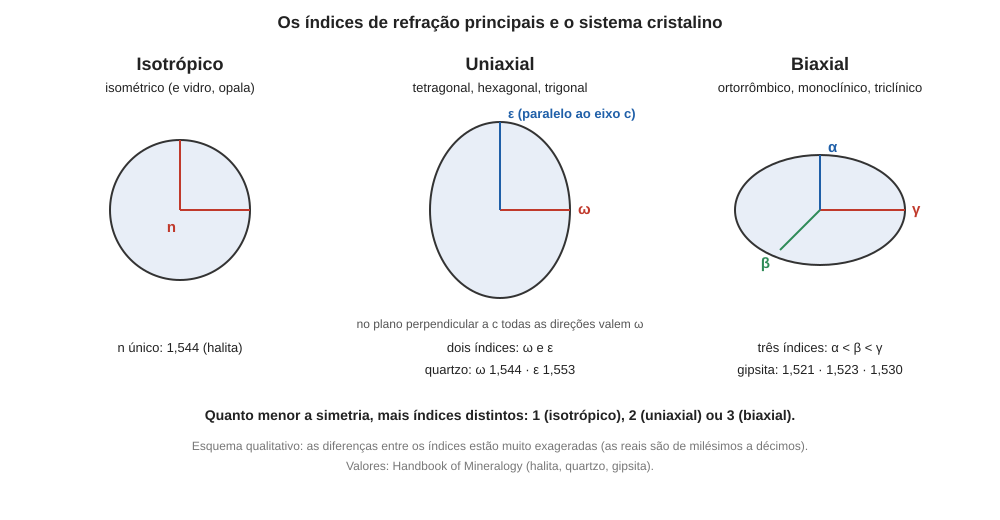

# Aula 08: Interferência, retardo e anisotropia óptica, Parte 2 — anisotropia e simetria

**ID:** mineralogia-m14-a08
**Módulo:** [[14-optica-fisica-modulo|Módulo 14 — Óptica física para mineralogia: luz, refração, polarização e interferência]]
**Duração estimada:** ~28 min
**Nível:** ensino médio, sem geologia prévia (contrato `ensino-medio-sem-geologia-v1`)
**Objetivo:** relacionar a simetria de um cristal ao número de índices de refração principais que ele tem (um, dois ou três) e, assim, classificá-lo como isotrópico, uniaxial ou biaxial.
**Pré-requisito:** [[04-simetria-e-morfologia-aula-06-os-sete-sistemas-cristalinos-definidos-pela-simetria|módulo 04, aula 06]] (sete sistemas e seus eixos de simetria), [[14-optica-fisica-aula-06-polarizacao-parte-2-reflexao-e-dupla-refracao|aula 06]] (dupla refração, ω e ε) e [[14-optica-fisica-aula-07-interferencia-retardo-e-anisotropia-optica-parte-1-interferencia-e-retardo|aula 07]] (retardo).
**Esta é a Parte 2.** A Parte 1 (interferência e retardo) está na aula 07; esta aula tem ID novo (`a08`) porque o planejamento original tinha uma aula só, dividida na redação.

## Vocabulário desta aula

| Termo | O que quer dizer |
|---|---|
| **isotrópico** | material em que a luz se comporta do mesmo jeito em todas as direções: um só índice de refração. |
| **anisotrópico** | material em que o índice depende da direção de vibração da luz. |
| **uniaxial** | cristal anisotrópico com um único eixo óptico e dois índices principais (ω e ε). |
| **biaxial** | cristal anisotrópico com dois eixos ópticos e três índices principais (α, β, γ, com α < β < γ). |
| **índices principais** | os valores extremos e intermediário do índice de um cristal, medidos em três direções perpendiculares. |
| **indicatriz** | superfície (esfera ou elipsoide) cujos semieixos são os índices principais; desenvolvida no módulo 16. |
| **grupo pontual** | conjunto das operações de simetria de um cristal que deixam um ponto fixo (módulo 04). |

## Antes de começar, você precisa saber

- Os sete sistemas cristalinos e os eixos de simetria que os definem: no cúbico, quatro eixos ternários; no tetragonal, hexagonal e trigonal, um eixo principal de ordem 4, 6 ou 3; no ortorrômbico, três direções perpendiculares com eixo 2 ou 2̄; no monoclínico, uma só direção com eixo 2 ou 2̄ (o 2̄ equivale a um plano de simetria); no triclínico, nenhum eixo (módulo 04).
- A dupla refração, os índices ω e ε e a birrefringência (aula 06).

## Ao final você vai conseguir

- `mineralogia-m14-oa06` — Relacionar isotropia e anisotropia óptica à simetria cristalina (isométrico, uniaxial, biaxial).

## Conteúdo

### O princípio: o índice não pode ser menos simétrico que o cristal

Um cristal tem direções equivalentes: rodando-o por uma operação de simetria do seu grupo pontual, ele volta a ficar igual a si mesmo. Se ele não muda, **qualquer medida feita nele não pode mudar**. O índice de refração, medido para a vibração ao longo de uma direção, tem de ser igual ao medido ao longo de qualquer direção que a simetria torne equivalente a ela. Esta é a ideia (princípio de Neumann) que liga a óptica à cristalografia: **a simetria da propriedade óptica contém a simetria do cristal**. Ela pode ter simetria maior (o quartzo tem em c só um eixo 3, mas seu índice é o mesmo em todas as direções do plano perpendicular a c), nunca menor.

Pense nos índices como um valor n para cada direção de vibração. Atenção: daqui em diante, "direção" é aquela em que **E** vibra, não aquela em que a luz caminha; como a luz é transversal (aula 01), a que caminha numa direção só vibra, e só "sente" índices, nas direções perpendiculares a ela. Em vez de descrever os infinitos valores, basta dar a **indicatriz**: uma superfície que, em cada direção, tem raio igual ao índice da vibração naquela direção. Para materiais cristalinos transparentes, esta superfície é uma esfera ou um elipsoide, e o elipsoide fica definido por três semieixos perpendiculares, os **índices principais**. Quanto mais simétrico o cristal, mais semieixos iguais.

*Figura 8. Esfera, elipsoide de revolução e elipsoide de três eixos desiguais, com um exemplo de cada. O que observar: o número de índices distintos (1, 2 ou 3) cresce quando a simetria diminui. As diferenças estão exageradas.*

### Os três casos, pela simetria

**Cúbico (isométrico): isotrópico, um índice.** Os quatro eixos ternários ligam as três direções a, b, c entre si: se rodar 120° em torno de uma diagonal do cubo, a vira b, b vira c, c vira a. Logo n_a = n_b = n_c, e a indicatriz é uma **esfera**. Todas as vibrações veem o mesmo índice, a luz não se divide e o cristal permanece escuro entre polarizadores cruzados. Os materiais amorfos (vidro, opala) também são isotrópicos, por falta de direções preferidas.

**Tetragonal, hexagonal e trigonal: uniaxial, dois índices.** Todos têm **um eixo principal** de ordem 4, 6 ou 3 (o eixo c). Girar de 90°, 60° ou 120° em torno de c tem de deixar igual o corte da indicatriz pelo plano perpendicular a c; uma elipse alongada (não circular) só volta a si mesma com giro de 180°, então esse corte é um círculo, e **todas as direções nesse plano têm o mesmo índice, ω**. A vibração ao longo de c é diferente, e seu índice é **ε**; só a luz que caminha perpendicular a c pode vibrar ao longo de c e encontrar ε. A indicatriz é um **elipsoide de revolução** em torno de c, e c é o **eixo óptico**: a luz que caminha ao longo dele só vibra no plano perpendicular a c, vê só ω e não se divide (aula 06). Exemplos: quartzo, calcita e coríndon (trigonais) e rutilo (tetragonal).

**Ortorrômbico, monoclínico e triclínico: biaxial, três índices.** Sem eixo de ordem 3, 4 ou 6, não há equivalência entre direções perpendiculares, e os três índices principais podem ser diferentes: **α < β < γ**. A indicatriz é um **elipsoide de três eixos desiguais**, com **dois** eixos ópticos (as duas direções perpendiculares às duas seções circulares do elipsoide; a luz que caminha ao longo delas não se divide). Seção é o corte do elipsoide por um plano que passa pelo centro: quase todas são elipses, só duas são círculos. A luz que caminha perpendicular a um desses círculos vibra dentro dele e vê um índice só. A simetria controla também **onde** ficam os três eixos do elipsoide, e é essa a diferença entre os três sistemas:

- **ortorrômbico:** três eixos binários (ou planos de simetria) perpendiculares forçam os três eixos do elipsoide a coincidirem com a, b e c;
- **monoclínico:** o único eixo binário (b; na classe m, que não tem eixo 2, o papel é da normal ao único plano de simetria, o eixo 2̄) obriga um eixo do elipsoide a coincidir com b; os outros dois ficam no plano perpendicular a b, em orientação livre, que varia de mineral para mineral;
- **triclínico:** sem eixo nem plano de simetria, os três eixos do elipsoide podem ter qualquer orientação em relação a a, b, c.

| Mineral (Handbook of Mineralogy) | Sistema | Índices | Classe óptica |
|---|---|---|---|
| halita | cúbico | n = 1,5443 | isotrópico |
| fluorita | cúbico | n = 1,433 a 1,448 | isotrópico |
| diamante | cúbico | n = 2,4175 (589 nm) | isotrópico |
| quartzo | trigonal | ω 1,544; ε 1,553 | uniaxial (+) |
| calcita | trigonal | ω 1,658; ε 1,486 | uniaxial (−) |
| rutilo | tetragonal | ω 2,605–2,613; ε 2,899–2,901 | uniaxial (+) |
| gipsita | monoclínico | α 1,521; β 1,523; γ 1,530 | biaxial (+) |
| aragonita | ortorrômbico | α 1,530; β 1,681; γ 1,685 | biaxial (−) |

(O sinal dos uniaxiais é positivo se ε > ω e negativo se ε < ω, como na aula 06. O dos biaxiais, definido pela posição de β entre α e γ, vem no módulo 16.)

### Retardo por direção

O retardo da aula 07, Γ = d × (diferença entre os índices das duas vibrações), depende da direção em que a luz anda:

- **isotrópico:** só há um índice, a diferença é zero e **Γ = 0 em qualquer direção**: escuro entre polarizadores cruzados, qualquer que seja a espessura;
- **uniaxial:** Γ = 0 ao longo do eixo óptico (as duas vibrações têm ω) e é **máximo** perpendicular a ele, onde a diferença é |ε − ω|; em direções intermediárias, vale entre 0 e o máximo;
- **biaxial:** Γ = 0 ao longo de **cada um dos dois eixos ópticos**, e o máximo possível é d × (γ − α), na direção em que as vibrações são α e γ.

### Cuidados

- **Isotropia óptica não é isotropia de tudo.** Um cristal cúbico pode ter clivagem e dureza diferentes por direção (módulo 13); só o índice é igual em todas.
- **Tensão pode quebrar a isotropia.** O *Handbook of Mineralogy* registra que halita e esfalerita podem mostrar anisotropia fraca induzida por tensão, e muitos cristais cúbicos mostram anomalias, por isso um cristal que "acende" fracamente não é necessariamente não cúbico.
- **A classe óptica é uma pista da simetria, não a simetria inteira.** Uniaxial reúne três sistemas, biaxial reúne três; o sistema exato exige outras informações (hábito, clivagem, difração).

## Exemplo trabalhado

**Problema.** Para cada material: (a) n = 1,434 em todas as direções; (b) um cristal de hábito prismático hexagonal com dois índices, 1,544 e 1,553; (c) um cristal com três índices, 1,521, 1,523 e 1,530. Classifique e calcule o retardo máximo para uma lâmina de 30 µm.

**(a)** Um só índice: **isotrópico**; compatível com cúbico (fluorita tem n = 1,433 a 1,448) ou amorfo. Retardo: **Γ = 0** em qualquer direção.

**(b)** Dois índices: **uniaxial** (o sistema é tetragonal, hexagonal ou trigonal). Como ε = 1,553 > ω = 1,544, sinal **positivo**. Retardo máximo (luz perpendicular ao eixo óptico): Γ = 30 000 nm × 0,009 = **270 nm**. Esses valores são os do quartzo, que é trigonal: o prisma de seis faces é hábito, e o eixo é de ordem 3.

**(c)** Três índices distintos: **biaxial**; a simetria é ortorrômbica, monoclínica ou triclínica (a gipsita, monoclínica, tem esses valores). Retardo máximo: Γ = 30 000 × (1,530 − 1,521) = 30 000 × 0,009 = **270 nm**.

**Comparação.** (b) e (c) têm o mesmo retardo, 270 nm, em sistemas diferentes: o retardo mede a diferença de índices e a espessura, não o sistema cristalino.

**Contraste, a aragonita:** Γ_máx = 30 000 × (1,685 − 1,530) = 30 000 × 0,155 = **4 650 nm**, cerca de 8 λ de 589 nm.

**Método geral:** (1) conte os índices principais: 1, 2 ou 3 = isotrópico, uniaxial ou biaxial, com os sistemas de cada caso; (2) retardo máximo = d × (maior índice − menor índice), e zero nos eixos ópticos.

## Erros comuns

- **Ler "uniaxial" e "biaxial" como número de eixos cristalográficos.** É o número de eixos **ópticos** (um ou dois); no uniaxial, o eixo óptico coincide com o eixo de ordem 3, 4 ou 6 (c), mas o conceito é óptico.
- **Achar que a direção c "tem índice ε" para qualquer luz.** ε é o índice da vibração ao longo de c; a luz que caminha ao longo de c não vibra nessa direção e vê ω.
- **Confundir isotrópico com isométrico ou com transparente.** Isotrópico (n único) inclui os cúbicos e os amorfos; o quartzo é transparente e anisotrópico.
- **Esquecer que a ordem α < β < γ é por valor.** α é o menor, γ o maior, independentemente dos eixos a, b, c.

## O que não concluir

- Que o retardo máximo ocorra em qualquer lâmina: depende do corte. Uma lâmina cortada perpendicular a um eixo óptico mostra Γ ≈ 0 e parece "isotrópica".

## Recap relâmpago

- A simetria do índice contém a simetria do cristal: direções equivalentes têm o mesmo n.
- Cúbico e amorfo: isotrópico, um índice (esfera).
- Tetragonal, hexagonal e trigonal: uniaxial, ω e ε (elipsoide de revolução; eixo óptico = c).
- Ortorrômbico, monoclínico e triclínico: biaxial, α < β < γ (elipsoide de três eixos; dois eixos ópticos).
- O retardo é zero nos isotrópicos e nos eixos ópticos; o máximo é d × (maior índice − menor índice).

## Próxima aula

Fim do módulo 14. O [[15-microscopio-petrografico-modulo|módulo 15 — O microscópio petrográfico]] usa tudo isto: polarizador, analisador, lâmina de 30 µm, retardo e cores de interferência, para identificar minerais em luz plana e entre polarizadores cruzados; o [[16-indicatriz-e-conoscopia-modulo|módulo 16]] desenvolve a indicatriz.

## Fontes consultadas

- Klein, C. & Dutrow, B., *Manual of Mineral Science*, e Nesse, W., *Introduction to Optical Mineralogy* (ligação entre sistema cristalino e classe óptica; indicatriz). Orientação da indicatriz (monoclínico: um dos eixos X, Y ou Z paralelo a b, os outros dois livres no plano ac; triclínico: sem vínculo): Nelson, S., *Biaxial minerals* (Tulane, EENS 2110), e o próprio *Handbook of Mineralogy* (gipsita Y = b; aragonita X = c, Y = a, Z = b), conferido na auditoria de 2026-10-07.
- *Handbook of Mineralogy*: halita (isotrópico, n = 1,5443, anisotropia fraca por tensão), fluorita (isotrópica, n = 1,433 a 1,448), diamante (isotrópico), quartzo, calcita e rutilo (uniaxiais), gipsita (biaxial positiva, α 1,521, β 1,523, γ 1,530) e aragonita (biaxial negativa, α 1,530, β 1,681, γ 1,685), esfalerita (isotrópica, anisotropia induzida por tensão), lidos em 2026-10-07.
- Princípio de Neumann: Nye, J.F., *Physical Properties of Crystals* (enunciado clássico: a simetria de uma propriedade física inclui a do grupo pontual), conferido na auditoria de 2026-10-07.
- Contas refeitas em Python em 2026-10-07.

<!--
nivel: ensino-medio-sem-geologia-v1
palavras_corpo: 1644
cobertura:
  mineralogia-m14-oa06: [Conteúdo, Exemplo trabalhado]
figuras:
  - 14-optica-fisica-fig-08-isotropia-uniaxial-biaxial.svg
alegacoes_auditaveis:
  - claim_id: OPT-ANI-NEUMANN-001
    claim: "A simetria de uma propriedade fisica de um cristal (como o indice de refracao) contem a simetria do grupo pontual do cristal (principio de Neumann): direcoes equivalentes por simetria tem o mesmo indice."
    risk: conceito
    source: "Nye, Physical Properties of Crystals (a confirmar)"
    audit: "verificado em 2026-10-07 (Nye, Physical Properties of Crystals)"
  - claim_id: OPT-ANI-ISO-001
    claim: "Cristais cubicos sao opticamente isotropicos (um indice, indicatriz esferica); materiais amorfos (vidro, opala) tambem sao isotropicos; isotropia optica nao implica isotropia de outras propriedades como dureza e clivagem."
    risk: conceito
    source: "Klein & Dutrow; Nesse, Optical Mineralogy"
    audit: "verificado em 2026-10-07 (Klein & Dutrow; Nesse)"
  - claim_id: OPT-ANI-UNI-001
    claim: "Tetragonal, hexagonal e trigonal sao uniaxiais (dois indices, omega e epsilon; elipsoide de revolucao; eixo optico paralelo ao eixo c); ortorrombico, monoclinico e triclinico sao biaxiais (tres indices alpha < beta < gamma, dois eixos opticos, normais as duas secoes circulares do elipsoide)."
    risk: conceito
    source: "Klein & Dutrow; Nesse, Optical Mineralogy"
    audit: "corrigido em 2026-10-07 (achado 9: eixos opticos sao as normais as secoes circulares)"
  - claim_id: OPT-ANI-ORIENT-001
    claim: "Orientacao dos eixos da indicatriz: ortorrombico, coincide com a, b e c; monoclinico, um eixo coincide com b (eixo 2, ou normal ao plano m na classe m) e os outros dois ficam em orientacao livre no plano perpendicular a b; triclinico, orientacao livre."
    risk: conceito
    source: "Nesse, Optical Mineralogy; Klein & Dutrow (a confirmar)"
    audit: "corrigido em 2026-10-07 (achado 10: monoclinico da classe m nao tem eixo binario; o vinculo vem da normal ao plano)"
  - claim_id: OPT-ANI-DADOS-001
    claim: "Handbook of Mineralogy: halita isotropica n 1,5443; fluorita isotropica n 1,433-1,448; diamante isotropico; quartzo uniaxial (+) omega 1,544 epsilon 1,553; calcita uniaxial (-) omega 1,658 epsilon 1,486; rutilo uniaxial (+) omega 2,605-2,613 epsilon 2,899-2,901; gipsita biaxial (+) 1,521/1,523/1,530; aragonita biaxial (-) 1,530/1,681/1,685."
    risk: numero
    source: "Handbook of Mineralogy (halite, fluorite, diamond, quartz, calcite, rutile, gypsum, aragonite)"
    audit: "verificado em 2026-10-07 (HoM: halite, fluorite, diamond, quartz, calcite, rutile, gypsum (Y = b), aragonite (X = c, Y = a, Z = b))"
  - claim_id: OPT-ANI-SISTEMAS-001
    claim: "Quartzo, calcita e corindon sao trigonais; rutilo e tetragonal; gipsita e monoclinica; aragonita e ortorrombica; halita, fluorita e diamante sao cubicos."
    risk: fato
    source: "Handbook of Mineralogy"
    audit: "verificado em 2026-10-07 (HoM: quartzo 32, calcita e corindon 3-barra 2/m (familia hexagonal, sistema trigonal); rutilo tetragonal; gipsita 2/m; aragonita 2/m 2/m 2/m; cubicos)"
  - claim_id: OPT-ANI-RETARDO-001
    claim: "Retardo por direcao: zero nos isotropicos e ao longo dos eixos opticos; maximo uniaxial perpendicular ao eixo = d x |epsilon - omega|; maximo biaxial = d x (gamma - alpha)."
    risk: conceito
    source: "Hecht, Optics; Klein & Dutrow"
    audit: "verificado em 2026-10-07 (Hecht, Optics; Klein & Dutrow)"
  - claim_id: OPT-ANI-TENSAO-001
    claim: "Halita e esfalerita podem mostrar anisotropia fraca induzida por tensao (Handbook of Mineralogy: weakly anisotropic due to stress; strain-induced birefringence)."
    risk: fato
    source: "Handbook of Mineralogy (halite, sphalerite)"
    audit: "verificado em 2026-10-07 (HoM halite: weakly anisotropic due to stress; sphalerite: may show strain-induced birefringence)"
  - claim_id: OPT-ANI-EXEMPLO-001
    claim: "Retardo maximo em lamina de 30 micrometros: quartzo (0,009) 270 nm; gipsita (gamma - alpha = 0,009) 270 nm; aragonita (0,155) 4 650 nm."
    risk: numero
    source: "Handbook of Mineralogy; Python (2026-10-07)"
    audit: "corrigido em 2026-10-07 (achado 7: trecho do corindon no rodape corrigido; contas do corpo conferidas: 270, 270 e 4 650 nm)"
  - claim_id: OPT-FIG08-INDICATRIZ-001
    claim: "Figura 8: esfera (isotropico, halita n 1,544), elipsoide de revolucao (quartzo omega 1,544, epsilon 1,553) e elipsoide triaxial (gipsita 1,521/1,523/1,530), com diferencas exageradas e esquema qualitativo."
    risk: conceito
    source: "Handbook of Mineralogy; esquema"
    audit: "verificado em 2026-10-07 (codigo SVG: elipsoide do quartzo alongado em c (positivo, epsilon > omega); triaxial com gamma > beta > alpha)"
  - claim_id: OPT-ANI-DIDAT-001
    claim: "A luz que caminha numa direcao so vibra nas direcoes perpendiculares a ela e so sente os indices dessas direcoes; epsilon e o indice da vibracao ao longo de c, encontrado so pela luz que caminha perpendicular a c; a luz que caminha ao longo de c ve so omega. Das secoes centrais de um elipsoide de tres eixos desiguais so duas sao circulos, e a luz que caminha perpendicular a uma delas ve um so indice. Ortorrombico: tres direcoes perpendiculares com eixo 2 ou 2-barra; monoclinico: uma so direcao com 2 ou 2-barra (o 2-barra equivale a um plano de simetria)."
    risk: conceito
    source: "Nesse, Introduction to Optical Mineralogy; Klein & Dutrow; modulo 04, aula 06"
    audit: "verificado em 2026-10-07 (segunda passagem: Nelson, Biaxial minerals (Tulane), duas secoes circulares de raio beta, eixos opticos normais a elas; modulo 04, aula 06, tabela dos sistemas)"
  - claim_id: OPT-ANI-QZSIM-001
    claim: "Principio de Neumann, exemplo: o quartzo (classe 32) tem em c so um eixo 3 (e tres eixos 2 perpendiculares a c), mas o indice e o mesmo em todas as direcoes do plano perpendicular a c; a propriedade e mais simetrica que o cristal."
    risk: conceito
    source: "Nye, Physical Properties of Crystals; Handbook of Mineralogy, quartz (classe 32); modulo 05, aula 01"
    audit: "corrigido em 2026-10-07 (segunda passagem, achado 11: 'o quartzo so tem eixo 3' ignorava os tres eixos 2 da classe 32)"
  - claim_id: OPT-ANI-ELIPSE-001
    claim: "Argumento do uniaxial: uma elipse nao circular so volta a si mesma com giro de 180 graus (ou volta inteira); se giros de 90, 120 ou 60 graus em torno de c preservam o corte da indicatriz perpendicular a c, esse corte e um circulo e todas as vibracoes nesse plano tem indice omega."
    risk: conceito
    source: "Nye, Physical Properties of Crystals; Python (invariancia da forma quadratica sob rotacao)"
    audit: "corrigido em 2026-10-07 (segunda passagem, achado 12: 'uma elipse so volta a si mesma com 180 graus' e falso para o circulo, que e a conclusao do argumento)"
-->
